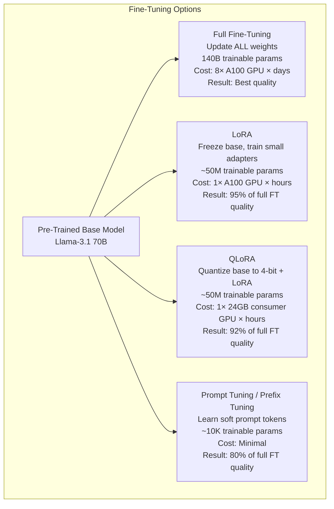
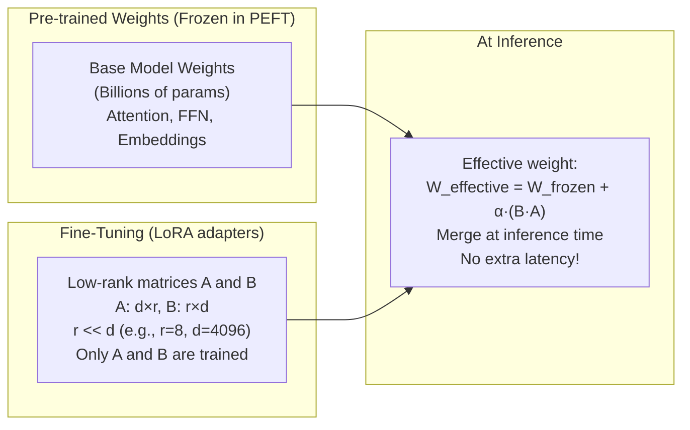
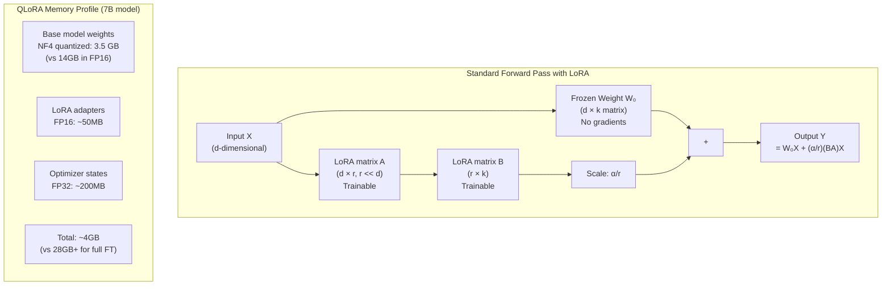
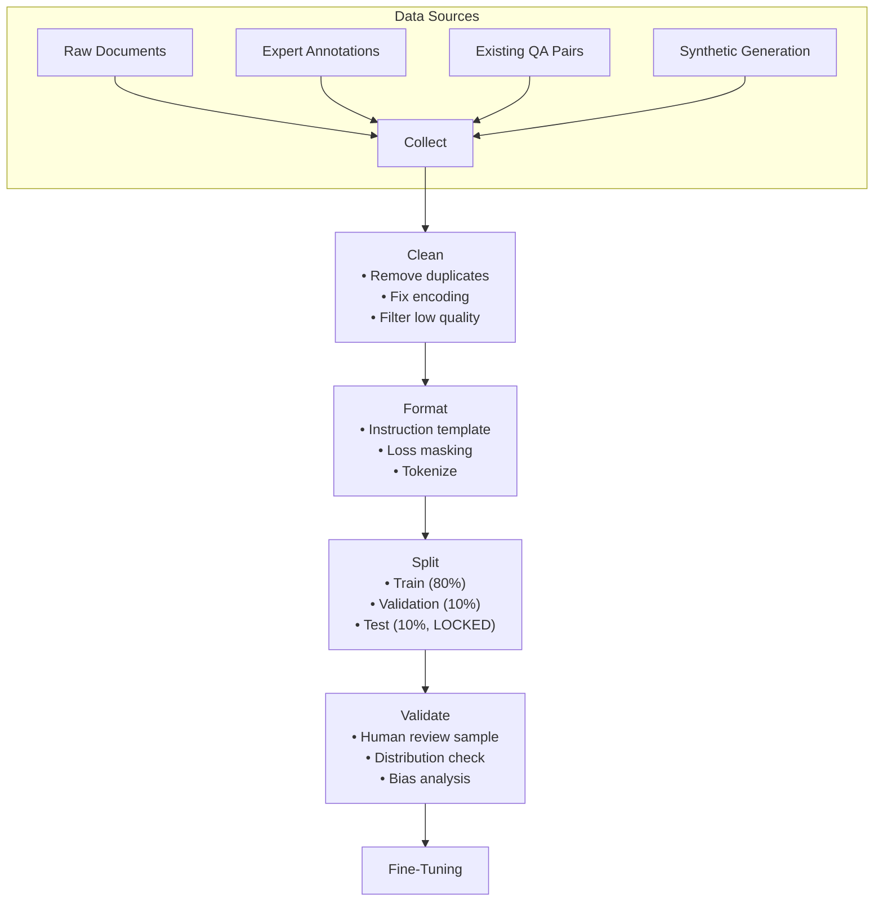
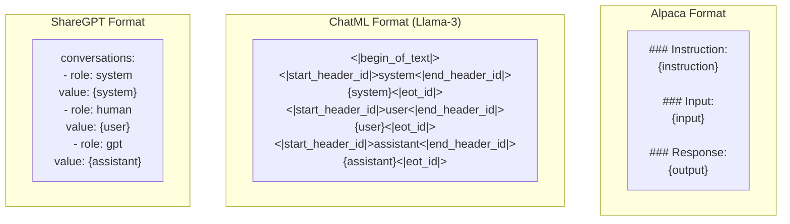

# Part 12: Fine-Tuning and Model Adaptation

> *"Pre-training teaches a model everything about human language. Fine-tuning teaches it to be exceptional at one specific thing. The difference between GPT-4 and a specialized medical AI isn't capability — it's focus. Fine-tuning is how you create that focus."*

---

## Table of Contents

- [Chapter 1: Fine-Tuning Fundamentals](#chapter-1-fine-tuning-fundamentals)
- [Chapter 2: LoRA and QLoRA — Parameter-Efficient Fine-Tuning](#chapter-2-lora-and-qlora)
- [Chapter 3: Dataset Preparation](#chapter-3-dataset-preparation)
- [Chapter 4: Training with HuggingFace and PEFT](#chapter-4-training-with-huggingface-and-peft)
- [Chapter 5: Instruction Fine-Tuning](#chapter-5-instruction-fine-tuning)
- [Chapter 6: RLHF and DPO — Alignment Techniques](#chapter-6-rlhf-and-dpo)
- [Chapter 7: Evaluation](#chapter-7-evaluation)
- [Chapter 8: Production Deployment](#chapter-8-production-deployment)

---

# Chapter 1: Fine-Tuning Fundamentals

---

## 1. Introduction

### What Is Fine-Tuning?

**Fine-tuning** is the process of continuing the training of a pre-trained model on a new, smaller, task-specific dataset. The pre-trained model has already learned general language understanding from billions of tokens. Fine-tuning adapts this general knowledge to a specific domain, task, or behavioral style.

Think of it as the difference between:
- **Pre-training**: A doctor earns their medical degree — 8 years of general education
- **Fine-tuning**: The same doctor completes a residency in cardiology — 3 years of specialized practice

After fine-tuning, the model retains all general language ability AND gains specialized capability.

### Why Fine-Tune?

Four concrete production reasons:

1. **Domain vocabulary**: Medical, legal, financial, scientific text uses specialized terminology that generic models handle poorly. Fine-tuning on domain corpora dramatically improves accuracy.

2. **Format consistency**: Prompting can't guarantee JSON output format across all inputs. Fine-tuning bakes format into the weights — the model ALWAYS produces the right format.

3. **Cost reduction**: A fine-tuned small model (7B parameters) can match GPT-4's performance on a specific task, at 100× lower inference cost.

4. **Data privacy**: Sensitive data (medical records, proprietary code) cannot be sent to OpenAI's API. Fine-tuning a local model keeps data on-premises.

### When NOT to Fine-Tune

Fine-tuning is often the wrong choice:
- If prompt engineering hasn't been exhausted first
- If you have fewer than 1,000 high-quality examples
- If the task changes frequently (fine-tuned weights are static)
- If you need the model's broad general knowledge

---

## 2. Historical Motivation

### The Pre-training → Fine-tuning Paradigm

**2017-2018 (ELMo, ULMFiT)**: The first evidence that pre-trained language models could be fine-tuned for downstream tasks. Howard and Ruder's ULMFiT showed that 3-phase training (pre-train → domain adapt → task fine-tune) could match specialized models trained from scratch.

**2018 (BERT)**: Google's BERT showed that fine-tuning a single pre-trained model achieved state-of-the-art across 11 NLP benchmarks. The "pre-train, then fine-tune" paradigm became the dominant approach.

**2020 (GPT-3)**: OpenAI showed that very large models could achieve strong results with zero-shot and few-shot prompting, reducing the need for fine-tuning. But fine-tuned GPT-3 still outperformed few-shot by 15-30% on narrow tasks.

**2022 (InstructGPT)**: OpenAI fine-tuned GPT-3 with human feedback (RLHF) to follow instructions. This was the critical step that turned a text predictor into a helpful assistant — demonstrating that alignment (behavioral tuning) is as important as capability tuning.

**2023 (LoRA, QLoRA, Llama-2)**: Parameter-efficient fine-tuning methods made it possible to fine-tune 70B parameter models on a single consumer GPU. Combined with open-weight models (Llama, Mistral), this democratized fine-tuning.

---

## 3. Real-World Analogy

### The Specialized Apprentice

A master craftsman (pre-trained model) knows woodworking, metalworking, glassblowing, and ceramics. They're competent at everything but exceptional at nothing (from your perspective — you make furniture).

You hire them as your apprentice and spend 3 months teaching them exclusively furniture design — proportions, joinery, finish work, customer preferences, your signature style.

After 3 months (fine-tuning):
- They still know woodworking, metalworking, etc. (retained general knowledge)
- They are now EXCELLENT at furniture — faster, more consistent, uses your vocabulary, matches your style
- For customers who only need furniture, this specialist is better than the master AND cheaper to employ

**Full fine-tuning** = teaching the apprentice for 3 months full-time (expensive, thorough)
**LoRA** = teaching the apprentice using flashcards + your design notebook (efficient, nearly as good)
**QLoRA** = compressed flashcards that fit in a smaller bag (even more efficient)

---

## 4. Visual Mental Model

### Fine-Tuning Type Comparison



### What Changes During Fine-Tuning



---

## 5. Internal Working

### How Fine-Tuning Modifies the Model

During fine-tuning, we run the standard training loop:
1. **Forward pass**: Input tokens → model → predicted next tokens
2. **Loss computation**: Compare predictions to actual next tokens (cross-entropy loss)
3. **Backward pass**: Compute gradients of loss w.r.t. all trainable parameters
4. **Parameter update**: Apply optimizer (AdamW) step to update parameters

The key difference from pre-training:
- **Pre-training loss**: Predict next token across all of internet-scale text
- **Fine-tuning loss**: Predict next token in your specific training data only

The model's weights drift from the pre-training optimum toward the fine-tuning optimum. This drift is controlled by:
- **Learning rate**: Small (1e-5 to 5e-4 for full FT; 1e-4 to 3e-4 for LoRA) — prevents catastrophic forgetting
- **Number of epochs**: 1-3 for instruction following; 3-10 for narrow tasks
- **LoRA rank**: Controls how much the model can change (r=4 to r=128)

### Catastrophic Forgetting

A critical problem: if the learning rate is too high or training runs too long, the model "forgets" its general capabilities as the weights drift too far from the pre-training optimum. Prevention:
- Low learning rate (1e-4 to 1e-5)
- Few epochs (1-3 for instruction tuning)
- Regularization: weight decay, gradient clipping
- LoRA inherently limits forgetting by only updating small adapter matrices

---

## 6. Mathematical Intuition

### The Fine-Tuning Loss

**Standard language modeling loss** (cross-entropy):
$$\mathcal{L} = -\frac{1}{N}\sum_{i=1}^{N} \log P_\theta(x_i \mid x_1, ..., x_{i-1})$$

Where $\theta$ are the trainable parameters and $x_i$ are the target tokens.

For **instruction fine-tuning** (SFT — Supervised Fine-Tuning), the loss is computed only on the response tokens (not the instruction tokens):

$$\mathcal{L}_{SFT} = -\frac{1}{|R|}\sum_{i \in R} \log P_\theta(x_i \mid x_{<i})$$

Where $R$ is the set of response token positions. This prevents the model from being penalized for the prompt format it doesn't need to learn.

### LoRA Mathematics

LoRA (Hu et al., 2021) decomposes the weight update $\Delta W$ as:
$$\Delta W = BA$$

Where $B \in \mathbb{R}^{d \times r}$ and $A \in \mathbb{R}^{r \times k}$, with rank $r \ll \min(d, k)$.

The effective weight becomes:
$$W_{effective} = W_0 + \frac{\alpha}{r} BA$$

Where $\alpha$ is a scaling factor (typically = $r$ or $2r$).

**Parameter reduction**: For a weight matrix of shape $d \times k$ (e.g., 4096 × 4096), LoRA with rank $r=8$ trains $(4096 \times 8) + (8 \times 4096) = 65,536$ parameters instead of $4096 \times 4096 = 16,777,216$ — a **256× reduction**.

---

## 7. Implementation

### Fine-Tuning Decision Framework

```python
"""
Fine-tuning decision framework: when to fine-tune and which method to choose.
"""

from typing import Dict, Optional
from dataclasses import dataclass


@dataclass
class FineTuningConfig:
    """Configuration for a fine-tuning run."""
    method: str           # "full", "lora", "qlora", "prompt_tuning"
    base_model: str       # Model ID from HuggingFace
    dataset_size: int     # Number of training examples
    gpu_memory_gb: float  # Available GPU memory
    target_task: str      # What you're fine-tuning for
    quality_required: str # "highest", "high", "medium"


def choose_finetuning_method(
    task: str,
    dataset_size: int,
    gpu_memory_gb: float,
    data_privacy_required: bool = False,
) -> Dict:
    """
    Decision tree for choosing the right fine-tuning approach.
    """
    recommendations = []
    
    # Step 1: Should you even fine-tune?
    if dataset_size < 100:
        return {
            "recommendation": "prompt_engineering",
            "reason": "Too few examples. Fine-tuning needs ≥100 examples minimum; ≥1000 for good results. Use few-shot prompting instead.",
            "next_step": "Build a labeled dataset of 1000+ examples, then revisit.",
        }

    if not data_privacy_required and dataset_size < 1000:
        return {
            "recommendation": "few_shot_or_openai_sft",
            "reason": "With 100-999 examples, try OpenAI's fine-tuning API for GPT-4o-mini first. Simpler than self-hosting.",
            "openai_sft_cost_estimate": f"${dataset_size * 0.008:.2f} for training",
        }

    # Step 2: Choose method based on GPU memory
    if gpu_memory_gb >= 80:  # 2× A100 80GB
        method = "full_finetuning"
        reason = "Sufficient GPU memory for full parameter updates. Best quality."
    elif gpu_memory_gb >= 24:  # 1× A100 40GB or RTX 3090/4090
        method = "lora"
        reason = "LoRA on 24-40GB GPU. Near full-FT quality at fraction of cost."
    elif gpu_memory_gb >= 16:  # 1× RTX 3080/4080
        method = "qlora"
        reason = "QLoRA (4-bit quantization + LoRA). Fits 7B-13B models on 16GB GPU."
    else:
        method = "openai_api_finetuning"
        reason = "Insufficient local GPU memory. Use cloud fine-tuning (OpenAI, Together.ai, Modal)."

    # Step 3: Model size recommendation
    if dataset_size < 5000:
        model_rec = "7B-13B parameter model (Llama-3.1-8B, Mistral-7B)"
    elif dataset_size < 50000:
        model_rec = "13B-34B parameter model (Llama-3.1-13B, CodeLlama-34B)"
    else:
        model_rec = "34B-70B parameter model (Llama-3.1-70B, Mixtral-8x7B)"

    return {
        "recommendation": method,
        "reason": reason,
        "model_recommendation": model_rec,
        "dataset_size": dataset_size,
        "estimated_training_time": estimate_training_time(method, dataset_size, gpu_memory_gb),
        "estimated_cost": estimate_cost(method, dataset_size),
    }


def estimate_training_time(method: str, dataset_size: int, gpu_memory_gb: float) -> str:
    """Rough training time estimates."""
    base_hours = dataset_size / 10000  # 1 hour per 10k examples as baseline
    multipliers = {"full_finetuning": 10, "lora": 2, "qlora": 3, "openai_api_finetuning": 0.5}
    hours = base_hours * multipliers.get(method, 2)
    return f"~{hours:.1f} hours (rough estimate)"


def estimate_cost(method: str, dataset_size: int) -> str:
    """Rough cost estimates."""
    if method == "openai_api_finetuning":
        return f"~${dataset_size * 0.008:.2f} (OpenAI API pricing)"
    elif method == "full_finetuning":
        return "~$50-200 on cloud A100 instances"
    elif method in ("lora", "qlora"):
        return "~$5-50 on cloud GPU instances, or free on owned hardware"
    return "Varies"


# Example usage
decision = choose_finetuning_method(
    task="medical-question-answering",
    dataset_size=5000,
    gpu_memory_gb=24,
    data_privacy_required=True,
)
print(f"Recommendation: {decision['recommendation']}")
print(f"Reason: {decision['reason']}")
```

---

## 8. Tradeoffs

| Method | Quality | GPU Memory | Training Speed | Inference Overhead | Catastrophic Forgetting |
|---|---|---|---|---|---|
| Full Fine-Tuning | ★★★★★ | Very High (80GB+) | Slow | None | High risk |
| LoRA | ★★★★☆ | Medium (16GB+) | Fast | None (merge weights) | Very Low |
| QLoRA | ★★★★☆ | Low (8GB+) | Medium | None (merge weights) | Low |
| Prefix Tuning | ★★★☆☆ | Very Low | Very Fast | Extra input tokens | Minimal |
| OpenAI SFT API | ★★★★☆ | None (cloud) | Fast | None | N/A (black box) |

---

## 9. Interview Preparation

**Junior**: "Fine-tuning is when you take a pre-trained model and continue training it on a smaller, task-specific dataset. LoRA is the most common technique — it freezes the base model and trains small adapter matrices, reducing the number of trainable parameters from billions to millions."

**Mid-level**: "I choose fine-tuning when: (1) prompt engineering has been exhausted; (2) I have 1000+ high-quality examples; (3) the task is narrow and stable; (4) inference cost needs to be minimized. For most cases, I use QLoRA — it fits on a 24GB GPU and gives ~92% of full fine-tuning quality. The key training decisions: rank (r=8-64), learning rate (1e-4 to 3e-4), epochs (1-3 for instruction tuning), and always mask the instruction tokens from the loss."

**Senior**: "Fine-tuning is an engineering investment decision. The break-even point: if fine-tuning costs $200 in compute but reduces API calls from gpt-4o at $15/million tokens to local inference at $0, the break-even is at 13M tokens of production traffic — typically 1-3 months for a mid-scale service. I always run the fine-tuning experiment on 20% of the dataset first (proof of concept), measure quality improvement on my evaluation set, and only invest in full training if the lift is ≥15%."

---

## 10. Revision Sheet

- **Full fine-tuning**: All weights updated; highest quality; massive GPU requirement
- **LoRA**: Freeze base + train low-rank adapters; 256× fewer params; 95% of full FT quality
- **QLoRA**: 4-bit quantized base + LoRA; fits 7B model on 8GB GPU
- **When to fine-tune**: 1000+ examples, stable narrow task, cost/privacy constraint
- **When NOT to fine-tune**: < 100 examples, prompt engineering not tried, rapidly changing task
- **Loss masking**: Compute loss only on response tokens, not instruction tokens

---

---

# Chapter 2: LoRA and QLoRA

---

## 1. Introduction

### What Is LoRA?

**LoRA** (Low-Rank Adaptation) is the dominant parameter-efficient fine-tuning (PEFT) method. Instead of updating all model weights, it freezes the pre-trained weights and injects small, trainable matrices into specific transformer layers.

The key insight: **weight updates during fine-tuning are inherently low-rank**. The weight change needed to adapt a model for a specific task lies in a low-dimensional subspace of the full parameter space. LoRA exploits this by directly parameterizing the update as a product of two small matrices.

### What Is QLoRA?

**QLoRA** (Quantized LoRA) combines two techniques:
1. **4-bit quantization (NF4)**: Compresses the frozen base model from 16-bit to 4-bit precision, reducing memory by 4×
2. **LoRA adapters**: Trains small 16-bit adapter matrices on top of the quantized base

This combination enables fine-tuning 70B parameter models on a single 48GB GPU — a hardware requirement that would otherwise need 4-8× A100 80GB GPUs.

---

## 2. Visual Mental Model



---

## 3. Implementation

### Complete LoRA and QLoRA Implementation

```python
"""
LoRA and QLoRA: manual implementation + HuggingFace PEFT usage.
"""

import torch
import torch.nn as nn
import math
from typing import Optional, Dict, List


# ─── 1. LoRA Linear Layer (from scratch) ─────────────────────────────────────

class LoRALinear(nn.Module):
    """
    Drop-in replacement for nn.Linear that adds LoRA adapters.
    
    The effective weight is: W = W_frozen + (alpha/r) * B @ A
    Only A and B are trained; W_frozen is frozen.
    """

    def __init__(
        self,
        in_features: int,
        out_features: int,
        rank: int = 8,
        alpha: float = 16.0,   # Scaling factor (usually alpha = 2 * rank)
        dropout: float = 0.05,
        bias: bool = True,
    ):
        super().__init__()
        self.rank = rank
        self.alpha = alpha
        self.scaling = alpha / rank

        # Frozen base layer
        self.base = nn.Linear(in_features, out_features, bias=bias)

        # LoRA matrices
        # A initialized with Kaiming uniform (ensures diverse initial directions)
        self.lora_A = nn.Linear(in_features, rank, bias=False)
        nn.init.kaiming_uniform_(self.lora_A.weight, a=math.sqrt(5))

        # B initialized to ZERO (so initial LoRA output is 0, model starts as base)
        self.lora_B = nn.Linear(rank, out_features, bias=False)
        nn.init.zeros_(self.lora_B.weight)

        self.lora_dropout = nn.Dropout(p=dropout) if dropout > 0 else nn.Identity()

        # Freeze base weights
        for param in self.base.parameters():
            param.requires_grad = False

    def forward(self, x: torch.Tensor) -> torch.Tensor:
        # Base output (frozen)
        base_out = self.base(x)

        # LoRA output (trainable)
        lora_out = self.lora_B(self.lora_A(self.lora_dropout(x)))

        return base_out + self.scaling * lora_out

    def merge_weights(self) -> nn.Linear:
        """
        Merge LoRA weights into base for inference with zero overhead.
        The merged layer is a standard nn.Linear — no extra computation.
        """
        merged = nn.Linear(
            self.base.in_features,
            self.base.out_features,
            bias=self.base.bias is not None,
        )
        # Effective weight = W_base + scaling * B @ A
        merged_weight = (
            self.base.weight.data
            + self.scaling * (self.lora_B.weight @ self.lora_A.weight)
        )
        merged.weight = nn.Parameter(merged_weight)
        if self.base.bias is not None:
            merged.bias = nn.Parameter(self.base.bias.data.clone())
        return merged

    @property
    def lora_params(self) -> int:
        """Count LoRA trainable parameters."""
        A_params = self.lora_A.weight.numel()
        B_params = self.lora_B.weight.numel()
        return A_params + B_params

    @property
    def base_params(self) -> int:
        """Count frozen base parameters."""
        return self.base.weight.numel()

    @property
    def compression_ratio(self) -> float:
        """How many times fewer params does LoRA train vs. full layer."""
        return self.base_params / self.lora_params


def inject_lora_into_transformer(
    model: nn.Module,
    target_modules: List[str],
    rank: int = 8,
    alpha: float = 16.0,
) -> nn.Module:
    """
    Replace target nn.Linear layers with LoRALinear.
    
    target_modules: layer name patterns to replace
    (e.g., ["q_proj", "v_proj"] for attention query and value projections)
    """
    for name, module in model.named_modules():
        # Check if this module's name ends with any of the target patterns
        if any(name.endswith(target) for target in target_modules):
            # Get parent module and attribute name
            parts = name.split(".")
            parent = model
            for part in parts[:-1]:
                parent = getattr(parent, part)
            attr_name = parts[-1]

            # Replace nn.Linear with LoRALinear
            old_linear = getattr(parent, attr_name)
            if isinstance(old_linear, nn.Linear):
                lora_linear = LoRALinear(
                    in_features=old_linear.in_features,
                    out_features=old_linear.out_features,
                    rank=rank,
                    alpha=alpha,
                    bias=old_linear.bias is not None,
                )
                # Copy pretrained weights
                lora_linear.base.weight.data = old_linear.weight.data.clone()
                if old_linear.bias is not None:
                    lora_linear.base.bias.data = old_linear.bias.data.clone()

                setattr(parent, attr_name, lora_linear)
                print(f"Injected LoRA into {name} (rank={rank}, ratio={lora_linear.compression_ratio:.0f}×)")

    return model


# ─── 2. HuggingFace PEFT: Production LoRA ────────────────────────────────────

def setup_lora_with_peft(model_name: str = "meta-llama/Llama-3.1-8B"):
    """
    Production LoRA setup using HuggingFace PEFT library.
    """
    from transformers import AutoModelForCausalLM, AutoTokenizer, BitsAndBytesConfig
    from peft import LoraConfig, get_peft_model, TaskType, prepare_model_for_kbit_training

    # ─── Option A: LoRA (full precision base) ────────────────────────────────
    tokenizer = AutoTokenizer.from_pretrained(model_name)
    tokenizer.pad_token = tokenizer.eos_token

    model = AutoModelForCausalLM.from_pretrained(
        model_name,
        torch_dtype=torch.float16,
        device_map="auto",
    )

    lora_config = LoraConfig(
        task_type=TaskType.CAUSAL_LM,
        r=8,                      # Rank — start here, increase if underfitting
        lora_alpha=16,            # Scaling factor (alpha = 2 * r is common)
        target_modules=[
            "q_proj", "k_proj", "v_proj", "o_proj",  # Attention layers
            "gate_proj", "up_proj", "down_proj",       # FFN layers
        ],
        lora_dropout=0.05,
        bias="none",              # Don't train biases (not needed usually)
        inference_mode=False,
    )

    model = get_peft_model(model, lora_config)
    model.print_trainable_parameters()
    # Output: "trainable params: 33,554,432 || all params: 8,030,261,248 || trainable%: 0.42%"

    return model, tokenizer


def setup_qlora(model_name: str = "meta-llama/Llama-3.1-8B"):
    """
    QLoRA: 4-bit quantized base + LoRA adapters.
    Enables fine-tuning 8B models on 8GB GPU.
    """
    from transformers import AutoModelForCausalLM, AutoTokenizer, BitsAndBytesConfig
    from peft import LoraConfig, get_peft_model, TaskType, prepare_model_for_kbit_training

    # 4-bit quantization config (NF4 is better than INT4 for LLM fine-tuning)
    bnb_config = BitsAndBytesConfig(
        load_in_4bit=True,                      # Quantize to 4-bit
        bnb_4bit_quant_type="nf4",              # NormalFloat4 — designed for LLMs
        bnb_4bit_compute_dtype=torch.float16,   # Compute in FP16 (not 4-bit!)
        bnb_4bit_use_double_quant=True,         # Double quantization for extra memory savings
    )

    tokenizer = AutoTokenizer.from_pretrained(model_name)
    tokenizer.pad_token = tokenizer.eos_token
    tokenizer.padding_side = "right"  # Llama models need right padding

    model = AutoModelForCausalLM.from_pretrained(
        model_name,
        quantization_config=bnb_config,
        device_map="auto",               # Automatically place layers across GPUs
    )

    # Prepare for k-bit training: adds gradient checkpointing, normalizes layers
    model = prepare_model_for_kbit_training(model)

    lora_config = LoraConfig(
        task_type=TaskType.CAUSAL_LM,
        r=16,          # Slightly higher rank for QLoRA to compensate for quantization noise
        lora_alpha=32,
        target_modules=["q_proj", "k_proj", "v_proj", "o_proj", "gate_proj", "up_proj", "down_proj"],
        lora_dropout=0.05,
        bias="none",
    )

    model = get_peft_model(model, lora_config)
    model.print_trainable_parameters()

    return model, tokenizer


# ─── 3. Merging LoRA Weights for Inference ────────────────────────────────────

def merge_lora_for_inference(peft_model_path: str, output_path: str):
    """
    Merge LoRA adapters into base model for zero-overhead inference.
    The merged model is a standard transformer — no PEFT overhead.
    """
    from peft import PeftModel
    from transformers import AutoModelForCausalLM, AutoTokenizer

    base_model_name = "meta-llama/Llama-3.1-8B"

    # Load base model
    base_model = AutoModelForCausalLM.from_pretrained(
        base_model_name,
        torch_dtype=torch.float16,
        device_map="auto",
    )

    # Load and merge LoRA
    model_with_lora = PeftModel.from_pretrained(base_model, peft_model_path)
    merged_model = model_with_lora.merge_and_unload()  # Merge LoRA into base

    # Save merged model (standard HuggingFace format)
    merged_model.save_pretrained(output_path)
    tokenizer = AutoTokenizer.from_pretrained(base_model_name)
    tokenizer.save_pretrained(output_path)

    print(f"Merged model saved to {output_path}")
    print("This model can now be served with standard inference engines (vLLM, TGI, Ollama)")
```

---

## 4. Interview Preparation

**Junior**: "LoRA adds small trainable matrices A and B to each attention layer. The frozen weight stays the same, and the output is W_frozen(x) + (alpha/r)(BA)x. Only A and B are trained — that's 0.1-1% of the total parameters. QLoRA additionally compresses the frozen base to 4-bit, so a 7B model fits on 8GB of GPU memory."

**Mid-level**: "LoRA's key design choices: (1) rank r controls capacity — higher rank = more parameters = better quality but more memory; (2) target_modules — q_proj and v_proj are the most impactful; adding gate_proj, up_proj, down_proj (FFN) increases quality but also parameter count; (3) B initialized to zero so the initial model is exactly the base — training starts from scratch with zero adapter contribution. After training, merge A and B into the base for zero-latency inference."

**Senior**: "I tune LoRA rank empirically: start at r=8, evaluate quality, increase to 16 or 32 if underfitting (training loss plateaus above baseline). Higher rank doesn't always help — the optimal rank depends on the task's inherent complexity. For tasks requiring deep behavioral changes (tone, style), r=64-128. For format/vocabulary adaptation, r=8 is sufficient. I always merge adapters before production deployment — unmerged adapters add minor computational overhead that accumulates at scale."

---

---

# Chapter 3: Dataset Preparation

---

## 1. Introduction

### Why Dataset Quality Is the #1 Factor

> *"Your fine-tuned model can only be as good as your training data."*

A common misconception: "I'll fine-tune on 10,000 examples scraped from the web and get a great model." The reality: 1,000 high-quality, carefully curated, human-reviewed examples consistently outperform 50,000 noisy, auto-generated examples.

Dataset preparation is the most important step in fine-tuning — and the most overlooked.

---

## 2. Visual Mental Model

### Dataset Preparation Pipeline



### Instruction Format Templates



---

## 3. Implementation

### Dataset Preparation Framework

```python
"""
Dataset preparation for fine-tuning: collection, cleaning, formatting, validation.
"""

import json
import re
import hashlib
import random
from typing import List, Dict, Optional, Tuple, Callable, Iterator
from dataclasses import dataclass, field, asdict
from pathlib import Path
from openai import AsyncOpenAI
import asyncio

client = AsyncOpenAI()


# ─── Data Format Definitions ──────────────────────────────────────────────────

@dataclass
class TrainingExample:
    """A single training example for instruction fine-tuning."""
    instruction: str
    input: str = ""           # Optional additional context
    output: str = ""          # The expected response
    system: str = ""          # Optional system message
    id: str = ""              # Unique ID for deduplication
    source: str = ""          # Where this example came from
    quality_score: float = 1.0  # Human quality rating 0-1

    def __post_init__(self):
        if not self.id:
            content = f"{self.instruction}{self.input}{self.output}"
            self.id = hashlib.sha256(content.encode()).hexdigest()[:16]

    def to_alpaca_format(self) -> Dict:
        """Format for Alpaca-style instruction tuning."""
        return {
            "instruction": self.instruction,
            "input": self.input,
            "output": self.output,
        }

    def to_chatml_format(self) -> Dict:
        """Format for ChatML (Llama-3 chat template)."""
        messages = []
        if self.system:
            messages.append({"role": "system", "content": self.system})

        user_content = self.instruction
        if self.input:
            user_content += f"\n\n{self.input}"
        messages.append({"role": "user", "content": user_content})
        messages.append({"role": "assistant", "content": self.output})

        return {"messages": messages}

    def to_sharegpt_format(self) -> Dict:
        """Format for ShareGPT-style multi-turn conversations."""
        conversations = []
        if self.system:
            conversations.append({"role": "system", "value": self.system})
        user_content = self.instruction + (f"\n\n{self.input}" if self.input else "")
        conversations.append({"role": "human", "value": user_content})
        conversations.append({"role": "gpt", "value": self.output})
        return {"conversations": conversations}


# ─── Data Collection ──────────────────────────────────────────────────────────

class DataCollector:
    """Collect training examples from multiple sources."""

    @staticmethod
    def from_jsonl(file_path: str, format: str = "alpaca") -> List[TrainingExample]:
        """Load from JSONL file."""
        examples = []
        with open(file_path, "r") as f:
            for line in f:
                data = json.loads(line)
                if format == "alpaca":
                    examples.append(TrainingExample(
                        instruction=data.get("instruction", ""),
                        input=data.get("input", ""),
                        output=data.get("output", ""),
                        source=file_path,
                    ))
                elif format == "sharegpt":
                    convs = data.get("conversations", [])
                    system = next((c["value"] for c in convs if c["role"] == "system"), "")
                    human = next((c["value"] for c in convs if c["role"] == "human"), "")
                    gpt = next((c["value"] for c in convs if c["role"] == "gpt"), "")
                    if human and gpt:
                        examples.append(TrainingExample(
                            instruction=human, output=gpt, system=system, source=file_path
                        ))
        return examples

    @staticmethod
    def from_qa_pairs(
        qa_pairs: List[Tuple[str, str]],  # [(question, answer), ...]
        system_prompt: str = "",
    ) -> List[TrainingExample]:
        """Convert QA pairs to training examples."""
        return [
            TrainingExample(instruction=q, output=a, system=system_prompt, source="qa_pairs")
            for q, a in qa_pairs
        ]


# ─── Data Cleaning ────────────────────────────────────────────────────────────

class DataCleaner:
    """Clean and filter training examples."""

    def __init__(
        self,
        min_instruction_length: int = 10,
        max_instruction_length: int = 2000,
        min_output_length: int = 5,
        max_output_length: int = 4000,
        remove_duplicates: bool = True,
    ):
        self.min_instruction_length = min_instruction_length
        self.max_instruction_length = max_instruction_length
        self.min_output_length = min_output_length
        self.max_output_length = max_output_length
        self.remove_duplicates = remove_duplicates

    def clean_text(self, text: str) -> str:
        """Clean individual text fields."""
        # Normalize whitespace
        text = re.sub(r'\n{3,}', '\n\n', text)
        text = re.sub(r' {2,}', ' ', text)
        text = text.strip()
        # Normalize unicode
        text = text.encode('utf-8', errors='ignore').decode('utf-8')
        return text

    def is_valid(self, example: TrainingExample) -> Tuple[bool, str]:
        """Check if an example meets quality criteria."""
        if len(example.instruction) < self.min_instruction_length:
            return False, f"Instruction too short ({len(example.instruction)} chars)"
        if len(example.instruction) > self.max_instruction_length:
            return False, f"Instruction too long ({len(example.instruction)} chars)"
        if len(example.output) < self.min_output_length:
            return False, f"Output too short ({len(example.output)} chars)"
        if len(example.output) > self.max_output_length:
            return False, f"Output too long ({len(example.output)} chars)"
        return True, ""

    def clean_dataset(self, examples: List[TrainingExample]) -> Tuple[List[TrainingExample], Dict]:
        """Clean and filter a dataset."""
        cleaned = []
        stats = {"total": len(examples), "filtered": 0, "reasons": {}}
        seen_ids = set()

        for example in examples:
            # Clean text fields
            example.instruction = self.clean_text(example.instruction)
            example.input = self.clean_text(example.input)
            example.output = self.clean_text(example.output)

            # Deduplication
            if self.remove_duplicates:
                if example.id in seen_ids:
                    stats["filtered"] += 1
                    stats["reasons"]["duplicate"] = stats["reasons"].get("duplicate", 0) + 1
                    continue
                seen_ids.add(example.id)

            # Validation
            valid, reason = self.is_valid(example)
            if not valid:
                stats["filtered"] += 1
                stats["reasons"][reason[:30]] = stats["reasons"].get(reason[:30], 0) + 1
                continue

            cleaned.append(example)

        stats["kept"] = len(cleaned)
        stats["filter_rate"] = f"{stats['filtered'] / stats['total']:.1%}"
        return cleaned, stats


# ─── Synthetic Data Generation ────────────────────────────────────────────────

class SyntheticDataGenerator:
    """
    Generate high-quality synthetic training examples using GPT-4.
    
    Use when:
    - You have domain knowledge but few labeled examples
    - You need to augment a small seed dataset
    - You want to generate diverse paraphrases or variations
    
    Quality check: always human-review a sample before using synthetic data.
    """

    async def generate_from_seed(
        self,
        seed_examples: List[TrainingExample],
        n_per_seed: int = 5,
        domain_context: str = "",
    ) -> List[TrainingExample]:
        """Generate n_per_seed variations for each seed example."""
        all_generated = []

        for seed in seed_examples:
            prompt = f"""You are a dataset creator for AI training.

Domain context: {domain_context if domain_context else "general AI assistant"}

Based on this example, generate {n_per_seed} diverse, high-quality variations:

Original example:
Instruction: {seed.instruction}
Output: {seed.output}

Generate {n_per_seed} variations that:
1. Test similar concepts but with different phrasing/context
2. Vary in complexity (some simpler, some harder)
3. Have accurate, helpful outputs
4. Avoid copying the original too closely

Return as JSON array:
[{{"instruction": "...", "output": "..."}}, ...]"""

            try:
                response = await client.chat.completions.create(
                    model="gpt-4o",
                    messages=[{"role": "user", "content": prompt}],
                    temperature=0.8,
                    response_format={"type": "json_object"},
                )
                content = response.choices[0].message.content
                parsed = json.loads(content)
                examples_list = parsed if isinstance(parsed, list) else parsed.get("examples", [])

                for ex in examples_list:
                    if "instruction" in ex and "output" in ex:
                        all_generated.append(TrainingExample(
                            instruction=ex["instruction"],
                            output=ex["output"],
                            system=seed.system,
                            source=f"synthetic_from_{seed.id}",
                            quality_score=0.7,  # Mark as synthetic
                        ))
            except Exception as e:
                print(f"Failed to generate variations for seed {seed.id}: {e}")

        return all_generated

    async def generate_from_document(
        self,
        document: str,
        n_questions: int = 10,
        question_types: List[str] = None,
    ) -> List[TrainingExample]:
        """
        Generate instruction-following pairs from a raw document.
        The "Stanford Alpaca" approach: use GPT-4 to generate QA pairs
        from your own documents.
        """
        if question_types is None:
            question_types = [
                "factual question", "reasoning question",
                "summarization request", "comparison", "explanation request",
            ]

        types_str = ", ".join(question_types)

        prompt = f"""You are creating training data for an AI assistant.

Document:
{document[:3000]}  # Truncate for token budget

Generate {n_questions} instruction/response pairs based on this document.
Use a variety of question types: {types_str}

Requirements:
- Instructions should be natural user questions or requests
- Responses should be accurate, helpful, and based ONLY on the document
- Include complex reasoning questions, not just factual lookup

Return as JSON:
{{"examples": [{{"instruction": "...", "response": "..."}}]}}"""

        response = await client.chat.completions.create(
            model="gpt-4o",
            messages=[{"role": "user", "content": prompt}],
            temperature=0.7,
            response_format={"type": "json_object"},
        )

        parsed = json.loads(response.choices[0].message.content)
        examples = parsed.get("examples", [])

        return [
            TrainingExample(
                instruction=ex["instruction"],
                output=ex["response"],
                source="synthetic_from_document",
                quality_score=0.8,
            )
            for ex in examples
            if "instruction" in ex and "response" in ex
        ]


# ─── Dataset Splitting and Saving ─────────────────────────────────────────────

class DatasetManager:
    """Manage train/val/test splits and file formats."""

    @staticmethod
    def split(
        examples: List[TrainingExample],
        train_ratio: float = 0.8,
        val_ratio: float = 0.1,
        seed: int = 42,
    ) -> Tuple[List, List, List]:
        """Split into train, validation, and locked test sets."""
        random.seed(seed)
        shuffled = examples.copy()
        random.shuffle(shuffled)

        n = len(shuffled)
        train_end = int(n * train_ratio)
        val_end = int(n * (train_ratio + val_ratio))

        return shuffled[:train_end], shuffled[train_end:val_end], shuffled[val_end:]

    @staticmethod
    def save_as_jsonl(examples: List[TrainingExample], path: str, format: str = "chatml"):
        """Save dataset to JSONL file in the specified format."""
        with open(path, "w") as f:
            for ex in examples:
                if format == "alpaca":
                    record = ex.to_alpaca_format()
                elif format == "chatml":
                    record = ex.to_chatml_format()
                elif format == "sharegpt":
                    record = ex.to_sharegpt_format()
                else:
                    record = asdict(ex)
                f.write(json.dumps(record, ensure_ascii=False) + "\n")

    @staticmethod
    def analyze_dataset(examples: List[TrainingExample]) -> Dict:
        """Statistical analysis of the dataset."""
        if not examples:
            return {}

        instruction_lengths = [len(ex.instruction) for ex in examples]
        output_lengths = [len(ex.output) for ex in examples]
        sources = {}
        for ex in examples:
            sources[ex.source] = sources.get(ex.source, 0) + 1

        return {
            "total_examples": len(examples),
            "instruction_length": {
                "mean": sum(instruction_lengths) / len(instruction_lengths),
                "min": min(instruction_lengths),
                "max": max(instruction_lengths),
            },
            "output_length": {
                "mean": sum(output_lengths) / len(output_lengths),
                "min": min(output_lengths),
                "max": max(output_lengths),
            },
            "sources": sources,
            "avg_quality_score": sum(ex.quality_score for ex in examples) / len(examples),
        }
```

---

## 4. Interview Preparation

**Mid-level**: "Dataset quality is the #1 factor in fine-tuning success. My pipeline: (1) Collect from real usage logs, expert annotations, and seed documents; (2) Clean — deduplicate by content hash, filter too-short/too-long examples; (3) Format — use ChatML for Llama-3, Alpaca for older models; (4) Split 80/10/10 — LOCK the 10% test set and never touch it during training; (5) Human review 5-10% sample before training. Synthetic data from GPT-4 is useful but always marked with lower quality score."

**Senior**: "For production datasets, I implement 4 quality filters: (1) Length filtering (too short = low information; too long = training instability); (2) Deduplication at multiple levels — exact hash, near-duplicate (MinHash at 90% similarity); (3) Perplexity filtering — examples where the base model already has very low loss are not informative, skip them; (4) Quality scoring — a trained quality classifier or GPT-4-as-judge scores each example. I target 95%+ of examples passing quality review."

---

---

# Chapter 4: Training with HuggingFace and PEFT

---

## 1. Introduction

This chapter covers the complete training setup using the HuggingFace ecosystem — the dominant framework for open-source LLM fine-tuning. The stack: `transformers` (models and tokenizers), `datasets` (data loading), `peft` (LoRA/QLoRA), and `trl` (supervised fine-tuning with SFTTrainer).

---

## 2. Implementation

### Complete Fine-Tuning Training Script

```python
"""
Complete fine-tuning training script using HuggingFace + PEFT + TRL.
Production-ready with: QLoRA, gradient checkpointing, W&B logging.
"""

import torch
import json
import os
from pathlib import Path
from typing import Optional, Dict, Any
from dataclasses import dataclass, field
from datasets import Dataset, load_dataset
from transformers import (
    AutoModelForCausalLM,
    AutoTokenizer,
    TrainingArguments,
    BitsAndBytesConfig,
    EarlyStoppingCallback,
)
from peft import LoraConfig, TaskType, get_peft_model, prepare_model_for_kbit_training
from trl import SFTTrainer, SFTConfig, DataCollatorForCompletionOnlyLM


# ─── Configuration ─────────────────────────────────────────────────────────────

@dataclass
class FinetuningConfig:
    # Model
    model_name: str = "meta-llama/Llama-3.1-8B-Instruct"
    output_dir: str = "./outputs/my-finetuned-model"

    # LoRA
    lora_r: int = 8
    lora_alpha: int = 16
    lora_dropout: float = 0.05
    lora_target_modules: list = field(default_factory=lambda: [
        "q_proj", "k_proj", "v_proj", "o_proj",
        "gate_proj", "up_proj", "down_proj",
    ])

    # Training
    num_epochs: int = 2
    per_device_train_batch_size: int = 2
    per_device_eval_batch_size: int = 2
    gradient_accumulation_steps: int = 4   # Effective batch size = 2*4 = 8
    learning_rate: float = 2e-4
    weight_decay: float = 0.01
    max_grad_norm: float = 0.3
    warmup_ratio: float = 0.03

    # Sequence length
    max_seq_length: int = 2048

    # Checkpointing
    save_steps: int = 100
    eval_steps: int = 100
    save_total_limit: int = 3
    load_best_model_at_end: bool = True

    # Logging
    logging_steps: int = 10
    report_to: str = "wandb"  # or "none" for no logging

    # Quantization
    use_4bit: bool = True


def load_dataset_from_jsonl(train_path: str, val_path: str):
    """Load train and validation datasets from JSONL files."""
    def load_jsonl(path):
        data = []
        with open(path) as f:
            for line in f:
                data.append(json.loads(line))
        return data

    train_data = load_jsonl(train_path)
    val_data = load_jsonl(val_path)

    return Dataset.from_list(train_data), Dataset.from_list(val_data)


def format_instruction(example: Dict) -> str:
    """
    Format a ChatML example into a single string for the tokenizer.
    
    The tokenizer's chat template handles this automatically for models
    that have one (Llama-3, Mistral-Instruct). For older models,
    format manually.
    """
    messages = example.get("messages", [])
    # Use the tokenizer's built-in chat template
    return messages  # SFTTrainer handles formatting with the tokenizer


def train(config: FinetuningConfig):
    """Main training function."""

    # ─── 1. Load Tokenizer ────────────────────────────────────────────────────
    tokenizer = AutoTokenizer.from_pretrained(config.model_name, trust_remote_code=True)
    tokenizer.pad_token = tokenizer.eos_token
    tokenizer.padding_side = "right"

    # ─── 2. Load Model ────────────────────────────────────────────────────────
    bnb_config = None
    if config.use_4bit:
        bnb_config = BitsAndBytesConfig(
            load_in_4bit=True,
            bnb_4bit_quant_type="nf4",
            bnb_4bit_compute_dtype=torch.float16,
            bnb_4bit_use_double_quant=True,
        )

    model = AutoModelForCausalLM.from_pretrained(
        config.model_name,
        quantization_config=bnb_config,
        device_map="auto",
        trust_remote_code=True,
        torch_dtype=torch.float16 if not config.use_4bit else None,
    )
    model.config.use_cache = False  # Required for gradient checkpointing

    if config.use_4bit:
        model = prepare_model_for_kbit_training(model)

    # ─── 3. Setup LoRA ────────────────────────────────────────────────────────
    lora_config = LoraConfig(
        task_type=TaskType.CAUSAL_LM,
        r=config.lora_r,
        lora_alpha=config.lora_alpha,
        target_modules=config.lora_target_modules,
        lora_dropout=config.lora_dropout,
        bias="none",
        inference_mode=False,
    )
    model = get_peft_model(model, lora_config)
    model.print_trainable_parameters()

    # ─── 4. Load Dataset ──────────────────────────────────────────────────────
    # Using Axolotl/TRL-formatted datasets
    train_dataset, eval_dataset = load_dataset_from_jsonl(
        "data/train.jsonl", "data/val.jsonl"
    )

    # ─── 5. Training Arguments ────────────────────────────────────────────────
    sft_config = SFTConfig(
        output_dir=config.output_dir,
        num_train_epochs=config.num_epochs,
        per_device_train_batch_size=config.per_device_train_batch_size,
        per_device_eval_batch_size=config.per_device_eval_batch_size,
        gradient_accumulation_steps=config.gradient_accumulation_steps,
        gradient_checkpointing=True,      # Save GPU memory at cost of speed
        optim="paged_adamw_32bit",        # Memory-efficient optimizer for QLoRA
        learning_rate=config.learning_rate,
        lr_scheduler_type="cosine",       # Cosine decay after warmup
        warmup_ratio=config.warmup_ratio,
        weight_decay=config.weight_decay,
        max_grad_norm=config.max_grad_norm,
        fp16=True,
        bf16=False,  # Use bf16=True on Ampere+ GPUs (A100, 3090)
        logging_steps=config.logging_steps,
        save_steps=config.save_steps,
        eval_steps=config.eval_steps,
        save_total_limit=config.save_total_limit,
        load_best_model_at_end=config.load_best_model_at_end,
        metric_for_best_model="eval_loss",
        greater_is_better=False,
        report_to=config.report_to,
        max_seq_length=config.max_seq_length,
        dataset_text_field="text",  # Or None for ChatML with messages field
        packing=False,              # Set True for short examples (packs multiple into one sequence)
    )

    # ─── 6. Create Trainer ────────────────────────────────────────────────────
    trainer = SFTTrainer(
        model=model,
        tokenizer=tokenizer,
        args=sft_config,
        train_dataset=train_dataset,
        eval_dataset=eval_dataset,
        callbacks=[EarlyStoppingCallback(early_stopping_patience=3)],
    )

    # ─── 7. Train ─────────────────────────────────────────────────────────────
    print("Starting training...")
    trainer.train()

    # ─── 8. Save ──────────────────────────────────────────────────────────────
    # Save LoRA adapters (small, ~100MB)
    trainer.save_model(config.output_dir)
    tokenizer.save_pretrained(config.output_dir)
    print(f"LoRA adapters saved to {config.output_dir}")

    return trainer


# ─── Hyperparameter Optimization ──────────────────────────────────────────────

def learning_rate_search(
    base_config: FinetuningConfig,
    learning_rates: list = [1e-4, 2e-4, 5e-4, 1e-3],
    n_steps_quick: int = 100,  # Quick evaluation steps
) -> Dict:
    """
    Quick sweep over learning rates to find the best.
    Trains for N steps each to compare training loss curves.
    """
    results = {}
    for lr in learning_rates:
        config = FinetuningConfig(
            learning_rate=lr,
            num_epochs=1,
            # Quick evaluation: use fewer steps
        )
        # Run training and record final training loss
        # In practice: use wandb sweep or Optuna for this
        results[lr] = {"config": config}

    return results


# ─── Training Monitoring ──────────────────────────────────────────────────────

def monitor_training_health(trainer) -> Dict:
    """Check training health metrics."""
    logs = trainer.state.log_history

    if not logs:
        return {"status": "no logs yet"}

    train_losses = [l["loss"] for l in logs if "loss" in l]
    eval_losses = [l["eval_loss"] for l in logs if "eval_loss" in l]

    issues = []
    if train_losses:
        # Check for divergence (loss increasing)
        if len(train_losses) > 10 and train_losses[-1] > train_losses[-10] * 1.5:
            issues.append("DIVERGENCE: training loss is increasing — reduce learning rate")

        # Check for NaN
        if any(loss != loss for loss in train_losses):  # NaN check
            issues.append("NaN LOSS: numerical instability — reduce LR, check data")

    # Check overfitting
    if train_losses and eval_losses:
        overfit_ratio = eval_losses[-1] / train_losses[-1]
        if overfit_ratio > 1.5:
            issues.append(f"OVERFITTING: eval_loss/train_loss = {overfit_ratio:.2f} > 1.5 — add more data or reduce epochs")

    return {
        "current_train_loss": train_losses[-1] if train_losses else None,
        "current_eval_loss": eval_losses[-1] if eval_losses else None,
        "issues": issues,
        "health": "good" if not issues else "warning",
    }
```

---

## 3. Interview Preparation

**Mid-level**: "I use the TRL `SFTTrainer` with QLoRA for most fine-tuning jobs. Key settings: `gradient_accumulation_steps=4` to simulate larger batches without extra memory; `gradient_checkpointing=True` to trade compute for memory (recomputes activations during backward pass); `paged_adamw_32bit` for memory-efficient optimization. I always monitor training loss, eval loss, and the gap between them (overfitting signal). Early stopping with patience=3 prevents overfitting."

**Senior**: "Training configuration is empirical. My default QLoRA recipe: batch_size=2, grad_acc=4 (effective batch 8), LR=2e-4 with cosine decay, warmup_ratio=0.03, max_grad_norm=0.3. I run a quick 100-step learning rate sweep across [1e-4, 2e-4, 5e-4] before full training to find the best LR — 30 minutes of compute saves hours of failed runs. For multi-GPU training, I use DeepSpeed ZeRO-3 or FSDP to shard model states across GPUs."

---

---

# Chapter 5: Instruction Fine-Tuning

---

## 1. Introduction

### What Is Instruction Fine-Tuning?

**Instruction fine-tuning** (also called Supervised Fine-Tuning / SFT) is the process of training a base language model to follow natural language instructions. It transforms a raw text predictor into an instruction-following assistant.

The training data is pairs of (instruction, desired response). The model learns: "When a human asks X, respond with Y-style answers."

This is exactly what OpenAI did with InstructGPT (2022) — trained GPT-3 on 13,000 human-written instruction-response pairs — which created the ChatGPT behavior paradigm.

---

## 2. Implementation

### Instruction Fine-Tuning Pipeline

```python
"""
Instruction fine-tuning: SFT with proper loss masking.
"""

import torch
from typing import Dict, List
from transformers import AutoTokenizer
from torch.utils.data import Dataset


# ─── 1. Critical Concept: Loss Masking ───────────────────────────────────────

class InstructionDataset(Dataset):
    """
    Dataset with CRITICAL loss masking.
    
    Loss is computed ONLY on response tokens.
    Instruction/prompt tokens are masked (-100 in labels).
    
    Why: We don't want the model to learn to generate the prompt format —
    we want it to learn to generate RESPONSES given the prompt.
    Without masking: the model tries to predict instruction tokens,
    which wastes capacity and degrades response quality.
    """

    def __init__(
        self,
        examples: List[Dict],  # [{"instruction": str, "output": str}]
        tokenizer: AutoTokenizer,
        max_length: int = 2048,
    ):
        self.examples = examples
        self.tokenizer = tokenizer
        self.max_length = max_length

    def __len__(self):
        return len(self.examples)

    def __getitem__(self, idx: int) -> Dict[str, torch.Tensor]:
        example = self.examples[idx]
        instruction = example["instruction"]
        response = example["output"]

        # Format the full prompt using the model's chat template
        messages = [
            {"role": "user", "content": instruction},
            {"role": "assistant", "content": response},
        ]

        # Tokenize with chat template
        full_text = self.tokenizer.apply_chat_template(
            messages,
            tokenize=False,
            add_generation_prompt=False,
        )

        # Tokenize prompt-only (to find where response starts)
        prompt_text = self.tokenizer.apply_chat_template(
            [{"role": "user", "content": instruction}],
            tokenize=False,
            add_generation_prompt=True,  # Add the assistant turn start token
        )

        # Tokenize both
        full_tokens = self.tokenizer(
            full_text,
            max_length=self.max_length,
            truncation=True,
            return_tensors="pt",
        )
        prompt_tokens = self.tokenizer(
            prompt_text,
            max_length=self.max_length,
            truncation=True,
            return_tensors="pt",
        )

        input_ids = full_tokens["input_ids"].squeeze()
        attention_mask = full_tokens["attention_mask"].squeeze()

        # Create labels: copy input_ids, then mask prompt tokens
        labels = input_ids.clone()
        prompt_length = prompt_tokens["input_ids"].shape[1]

        # Mask prompt tokens — they contribute ZERO to the loss
        labels[:prompt_length] = -100

        return {
            "input_ids": input_ids,
            "attention_mask": attention_mask,
            "labels": labels,  # -100 for prompt, actual token IDs for response
        }


def verify_loss_masking(dataset: InstructionDataset, idx: int = 0):
    """Debug: verify that loss masking is correctly applied."""
    item = dataset[idx]
    labels = item["labels"]
    input_ids = item["input_ids"]
    tokenizer = dataset.tokenizer

    # Find where masking ends
    masked_tokens = (labels == -100).sum().item()
    total_tokens = len(labels)
    response_tokens = total_tokens - masked_tokens

    print(f"Total tokens: {total_tokens}")
    print(f"Masked (instruction) tokens: {masked_tokens}")
    print(f"Active (response) tokens: {response_tokens}")
    print(f"\nFirst response token: '{tokenizer.decode([input_ids[masked_tokens]])}'")
    print(f"Last 5 tokens: {tokenizer.decode(input_ids[-5:])}")


# ─── 2. Instruction Format Design ─────────────────────────────────────────────

class InstructionFormatter:
    """Format examples for different model families."""

    LLAMA3_TEMPLATE = """<|begin_of_text|><|start_header_id|>system<|end_header_id|>

{system}<|eot_id|><|start_header_id|>user<|end_header_id|>

{user}<|eot_id|><|start_header_id|>assistant<|end_header_id|>

{assistant}<|eot_id|>"""

    MISTRAL_TEMPLATE = "[INST] {user} [/INST] {assistant} </s>"

    ALPACA_TEMPLATE = """Below is an instruction that describes a task. Write a response that appropriately completes the request.

### Instruction:
{instruction}

### Input:
{input}

### Response:
{output}"""

    @classmethod
    def format(cls, instruction: str, output: str, model_family: str = "llama3", system: str = "", input: str = "") -> str:
        if model_family == "llama3":
            return cls.LLAMA3_TEMPLATE.format(
                system=system or "You are a helpful assistant.",
                user=instruction + ("\n\n" + input if input else ""),
                assistant=output,
            )
        elif model_family == "mistral":
            user = instruction + ("\n\n" + input if input else "")
            return cls.MISTRAL_TEMPLATE.format(user=user, assistant=output)
        elif model_family == "alpaca":
            return cls.ALPACA_TEMPLATE.format(
                instruction=instruction, input=input, output=output
            )
        else:
            raise ValueError(f"Unknown model family: {model_family}")


# ─── 3. Multi-Turn Conversation Fine-Tuning ───────────────────────────────────

class MultiTurnDataset(Dataset):
    """
    Fine-tuning on multi-turn conversations.
    Loss is computed ONLY on assistant turns.
    """

    def __init__(self, conversations: List[List[Dict]], tokenizer, max_length: int = 4096):
        self.conversations = conversations
        self.tokenizer = tokenizer
        self.max_length = max_length

    def __len__(self):
        return len(self.conversations)

    def __getitem__(self, idx: int) -> Dict[str, torch.Tensor]:
        messages = self.conversations[idx]

        # Apply chat template to full conversation
        full_text = self.tokenizer.apply_chat_template(
            messages, tokenize=False, add_generation_prompt=False
        )
        full_ids = self.tokenizer.encode(full_text, add_special_tokens=False)

        labels = [-100] * len(full_ids)

        # Find each assistant turn and unmask it
        for i, msg in enumerate(messages):
            if msg["role"] == "assistant":
                # Get prefix up to (but not including) this assistant turn
                prefix_messages = messages[:i]
                prefix_text = self.tokenizer.apply_chat_template(
                    prefix_messages, tokenize=False, add_generation_prompt=True
                )
                prefix_ids = self.tokenizer.encode(prefix_text, add_special_tokens=False)
                prefix_len = len(prefix_ids)

                # The assistant content + end token
                assistant_text = msg["content"]
                assistant_ids = self.tokenizer.encode(
                    assistant_text, add_special_tokens=False
                )

                # Unmask assistant tokens
                for j, token_id in enumerate(assistant_ids):
                    if prefix_len + j < len(labels):
                        labels[prefix_len + j] = full_ids[prefix_len + j]

        input_ids = torch.tensor(full_ids[:self.max_length])
        labels = torch.tensor(labels[:self.max_length])
        attention_mask = torch.ones_like(input_ids)

        return {"input_ids": input_ids, "attention_mask": attention_mask, "labels": labels}
```

---

## 3. Interview Preparation

**Junior**: "Instruction fine-tuning trains a base model to follow instructions by showing it pairs of (instruction, good response). The critical detail is loss masking — we only compute loss on the response tokens, not the instruction tokens. This focuses the training on learning to generate good responses, not on memorizing the prompt format."

**Mid-level**: "Loss masking means setting labels to -100 for all instruction tokens. PyTorch's cross-entropy loss ignores -100 labels. Without masking, the model trains on instruction tokens too, which wastes capacity and often degrades quality because the instruction format is deterministic (the model doesn't need to 'learn' it). For multi-turn conversations, I unmask ONLY the assistant turns — each user turn is masked."

---

---

# Chapter 6: RLHF and DPO

---

## 1. Introduction

### The Alignment Problem

Instruction fine-tuning (SFT) teaches the model to follow instructions. But it doesn't teach the model WHICH instructions to follow well and which to follow poorly. A model trained only with SFT might:
- Give technically correct but unhelpful answers
- Produce responses that are correct but not in the user's preferred style
- Follow harmful instructions if they're in the training data

**Alignment techniques** teach the model human preferences — specifically, to prefer responses that are helpful, harmless, and honest (the "3H" criteria).

Two main approaches:
- **RLHF**: Reinforcement Learning from Human Feedback — the original alignment method (ChatGPT, Claude 1)
- **DPO**: Direct Preference Optimization — simpler, more stable alternative to RLHF

---

## 2. Visual Mental Model

### RLHF vs DPO

```mermaid
flowchart TD
    subgraph "RLHF Pipeline (Complex)"
        A1[SFT Model] --> B1[Generate responses]
        B1 --> C1[Human ranks pairs:\n'Which is better?']
        C1 --> D1[Train Reward Model\nPredicts human preference score]
        D1 --> E1[PPO Training\nMaximize reward model score]
        E1 --> F1[Aligned Model]
        NOTE1["• 3 training stages\n• 3 separate models\n• Complex, unstable\n• Used by: GPT-4, Claude 1"]
    end

    subgraph "DPO Pipeline (Simple)"
        A2[SFT Model] --> B2[Collect preference pairs:\n(prompt, chosen, rejected)]
        B2 --> C2[DPO Loss\nDirectly optimize preferences\nNo reward model needed!]
        C2 --> D2[Aligned Model]
        NOTE2["• 2 training stages\n• 1 model + 1 reference\n• Simple, stable\n• Used by: Llama-2, Mistral"]
    end
```

---

## 3. Implementation

### DPO Training (Modern Alignment)

```python
"""
DPO (Direct Preference Optimization) — the modern alignment technique.
Trains the model to prefer chosen responses over rejected ones.
"""

import torch
from typing import List, Dict, Optional
from dataclasses import dataclass
from trl import DPOTrainer, DPOConfig
from transformers import AutoModelForCausalLM, AutoTokenizer, BitsAndBytesConfig
from peft import LoraConfig, get_peft_model, prepare_model_for_kbit_training
from datasets import Dataset


# ─── 1. Preference Dataset Format ────────────────────────────────────────────

@dataclass
class PreferencePair:
    """
    A preference pair: same prompt, one chosen response, one rejected response.
    
    Collected from:
    1. Human annotators comparing two model outputs
    2. AI feedback (RLAIF) — use a stronger model to judge
    3. Constitutional AI principles — auto-generate critique and revision
    """
    prompt: str
    chosen: str     # The preferred response
    rejected: str   # The dispreferred response
    source: str = ""

    def to_dict(self) -> Dict:
        """DPO trainer expects this format."""
        return {
            "prompt": self.prompt,
            "chosen": self.chosen,
            "rejected": self.rejected,
        }


# ─── 2. RLAIF: AI-Generated Preference Data ──────────────────────────────────

from openai import AsyncOpenAI
import asyncio

client = AsyncOpenAI()


async def generate_preference_pair_with_ai(
    prompt: str,
    response_a: str,
    response_b: str,
) -> Optional[PreferencePair]:
    """
    RLAIF (Reinforcement Learning from AI Feedback):
    Use GPT-4 to judge which response is better.
    
    Cheaper than human annotation. Quality depends on judge model.
    Best for objective criteria (factual accuracy, formatting).
    Less reliable for subjective criteria (tone, helpfulness).
    """
    from pydantic import BaseModel

    class JudgeVerdict(BaseModel):
        better_response: str  # "A" or "B"
        reasoning: str
        is_clear_winner: bool  # False if too close to call

    judge_prompt = f"""Evaluate these two responses to the same prompt.

Prompt: {prompt}

Response A:
{response_a}

Response B:
{response_b}

Judge which response is better based on:
1. Accuracy and factual correctness
2. Helpfulness and completeness
3. Clarity and readability
4. Appropriate tone

Return your verdict."""

    try:
        response = await client.beta.chat.completions.parse(
            model="gpt-4o",
            messages=[{"role": "user", "content": judge_prompt}],
            response_format=JudgeVerdict,
            temperature=0,
        )
        verdict = response.choices[0].message.parsed

        if not verdict.is_clear_winner:
            return None  # Skip ambiguous pairs

        if verdict.better_response == "A":
            chosen, rejected = response_a, response_b
        else:
            chosen, rejected = response_b, response_a

        return PreferencePair(prompt=prompt, chosen=chosen, rejected=rejected, source="rlaif")

    except Exception:
        return None


# ─── 3. DPO Training ──────────────────────────────────────────────────────────

def run_dpo_training(
    sft_model_path: str,
    preference_data: List[PreferencePair],
    output_dir: str = "./dpo-model",
):
    """
    Run DPO training on top of an SFT model.
    
    DPO mathematical intuition:
    The model learns to increase the probability of chosen responses
    RELATIVE to the reference (SFT) model, while keeping rejected responses
    at or below the reference model's probability.
    
    Loss: L_DPO = -E[log σ(β(log π_θ(y_w|x) - log π_ref(y_w|x)) - β(log π_θ(y_l|x) - log π_ref(y_l|x)))]
    Where:
    - π_θ: the model being trained
    - π_ref: the frozen SFT reference model
    - y_w: chosen (winning) response
    - y_l: rejected (losing) response
    - β: temperature (controls how much the model deviates from reference)
    """
    # Load tokenizer
    tokenizer = AutoTokenizer.from_pretrained(sft_model_path)
    tokenizer.pad_token = tokenizer.eos_token
    tokenizer.padding_side = "right"

    # Load SFT model (will be fine-tuned with DPO)
    bnb_config = BitsAndBytesConfig(
        load_in_4bit=True,
        bnb_4bit_quant_type="nf4",
        bnb_4bit_compute_dtype=torch.float16,
        bnb_4bit_use_double_quant=True,
    )

    model = AutoModelForCausalLM.from_pretrained(
        sft_model_path,
        quantization_config=bnb_config,
        device_map="auto",
    )
    model = prepare_model_for_kbit_training(model)

    # LoRA for DPO (same as SFT)
    lora_config = LoraConfig(
        task_type="CAUSAL_LM",
        r=8, lora_alpha=16,
        target_modules=["q_proj", "v_proj", "o_proj", "gate_proj"],
        lora_dropout=0.05, bias="none",
    )
    model = get_peft_model(model, lora_config)

    # Reference model (frozen SFT model — DPO needs this for KL constraint)
    ref_model = AutoModelForCausalLM.from_pretrained(
        sft_model_path,
        quantization_config=bnb_config,
        device_map="auto",
    )
    # Reference model is frozen — only π_θ is trained
    for param in ref_model.parameters():
        param.requires_grad = False

    # Prepare dataset
    train_dataset = Dataset.from_list([p.to_dict() for p in preference_data])

    # DPO training config
    dpo_config = DPOConfig(
        output_dir=output_dir,
        num_train_epochs=1,
        per_device_train_batch_size=1,
        gradient_accumulation_steps=8,
        learning_rate=5e-5,        # Lower LR for DPO than SFT
        beta=0.1,                  # KL penalty: higher β → stays closer to SFT model
        max_prompt_length=512,
        max_length=1024,
        remove_unused_columns=False,
        fp16=True,
        logging_steps=10,
        save_steps=100,
    )

    trainer = DPOTrainer(
        model=model,
        ref_model=ref_model,
        args=dpo_config,
        tokenizer=tokenizer,
        train_dataset=train_dataset,
    )

    trainer.train()
    trainer.save_model(output_dir)
    return trainer


# ─── 4. Constitutional AI (Self-Critique + Revision) ─────────────────────────

async def constitutional_ai_revision(
    prompt: str,
    initial_response: str,
    principles: List[str] = None,
) -> str:
    """
    Constitutional AI (Anthropic 2022): model critiques and revises its own responses.
    
    Used to generate high-quality 'chosen' responses for preference datasets.
    Better than random sampling because it applies explicit principles.
    """
    if principles is None:
        principles = [
            "The response should be helpful and complete",
            "The response should not contain harmful, biased, or false information",
            "The response should be clear and appropriately formatted",
        ]

    principles_str = "\n".join(f"- {p}" for p in principles)

    # Phase 1: Critique
    critique_response = await client.chat.completions.create(
        model="gpt-4o",
        messages=[
            {"role": "user", "content": prompt},
            {"role": "assistant", "content": initial_response},
            {"role": "user", "content": f"""Review your previous response against these principles:
{principles_str}

Identify any issues with your response. Be specific."""},
        ],
        temperature=0,
    )
    critique = critique_response.choices[0].message.content

    # Phase 2: Revision
    revision_response = await client.chat.completions.create(
        model="gpt-4o",
        messages=[
            {"role": "user", "content": prompt},
            {"role": "assistant", "content": initial_response},
            {"role": "user", "content": f"Issues found: {critique}\n\nPlease revise your response to address these issues."},
        ],
        temperature=0.3,
    )

    return revision_response.choices[0].message.content
```

---

## 4. Interview Preparation

**Junior**: "RLHF trains a model to be helpful by collecting human preferences — humans compare two responses and pick the better one. A reward model learns these preferences, then PPO training maximizes the reward. DPO is a newer, simpler method that skips the reward model and directly optimizes on preference pairs."

**Mid-level**: "DPO is now preferred over RLHF because it's more stable and requires 2 models instead of 3. The DPO loss directly increases the probability of chosen responses relative to the reference (SFT) model while decreasing rejected response probability. The β parameter controls the KL penalty — how much the aligned model can deviate from the SFT reference. β=0.1 is standard; lower β allows more deviation."

**Senior**: "The most important decision in alignment is data collection. I use RLAIF (GPT-4 as judge) for objective quality dimensions (factual accuracy, format), combined with a smaller set of human-annotated pairs for subjective dimensions (tone, helpfulness perception). Constitutional AI is useful for augmenting the 'chosen' side — take the SFT model's output, apply a self-critique loop with explicit principles, and use the revised output as 'chosen' vs. the original as 'rejected'. This generates high-quality preference pairs without human annotation."

---

---

# Chapter 7: Evaluation

---

## 1. Introduction

### What Is Fine-Tuning Evaluation?

Fine-tuning evaluation measures whether the fine-tuned model actually improved on the target task without degrading general capabilities. Three evaluation levels:

1. **Task-specific metrics**: Accuracy on your specific task (BLEU, ROUGE, exact match, F1, accuracy)
2. **Quality metrics**: LLM-as-judge scores for helpfulness, faithfulness, coherence
3. **General capability checks**: Ensure the model hasn't catastrophically forgotten general knowledge (MMLU benchmark)

---

## 2. Implementation

```python
"""
Evaluation suite for fine-tuned models.
"""

import torch
import json
from typing import List, Dict, Optional, Tuple
from dataclasses import dataclass
import statistics
from openai import AsyncOpenAI
import asyncio
import re

client = AsyncOpenAI()


# ─── Metric Implementations ───────────────────────────────────────────────────

def compute_exact_match(predictions: List[str], references: List[str]) -> float:
    """Exact match accuracy — for classification/extraction tasks."""
    correct = sum(
        p.strip().lower() == r.strip().lower()
        for p, r in zip(predictions, references)
    )
    return correct / len(predictions)


def compute_f1_token_overlap(prediction: str, reference: str) -> float:
    """Token-level F1 — for QA tasks."""
    pred_tokens = set(prediction.lower().split())
    ref_tokens = set(reference.lower().split())

    if not pred_tokens or not ref_tokens:
        return 0.0

    overlap = pred_tokens & ref_tokens
    precision = len(overlap) / len(pred_tokens)
    recall = len(overlap) / len(ref_tokens)

    if precision + recall == 0:
        return 0.0

    return 2 * precision * recall / (precision + recall)


def compute_rouge_l(prediction: str, reference: str) -> float:
    """ROUGE-L: Longest Common Subsequence F1."""
    def lcs_length(x, y):
        m, n = len(x), len(y)
        dp = [[0] * (n + 1) for _ in range(m + 1)]
        for i in range(1, m + 1):
            for j in range(1, n + 1):
                if x[i-1] == y[j-1]:
                    dp[i][j] = dp[i-1][j-1] + 1
                else:
                    dp[i][j] = max(dp[i-1][j], dp[i][j-1])
        return dp[m][n]

    pred_tokens = prediction.lower().split()
    ref_tokens = reference.lower().split()

    if not pred_tokens or not ref_tokens:
        return 0.0

    lcs = lcs_length(pred_tokens, ref_tokens)
    precision = lcs / len(pred_tokens)
    recall = lcs / len(ref_tokens)

    if precision + recall == 0:
        return 0.0

    return 2 * precision * recall / (precision + recall)


# ─── LLM-as-Judge Evaluator ───────────────────────────────────────────────────

@dataclass
class JudgeScore:
    score: float  # 0-10
    reasoning: str
    dimension: str  # What was evaluated


async def llm_judge_evaluation(
    instruction: str,
    response: str,
    reference: Optional[str] = None,
    dimensions: List[str] = None,
) -> List[JudgeScore]:
    """
    LLM-as-judge: use GPT-4 to evaluate response quality.
    
    Dimensions:
    - helpfulness: Does it answer the question completely?
    - faithfulness: Does it stick to facts (for RAG)?
    - harmlessness: Is it safe and appropriate?
    - coherence: Is it well-written and logical?
    """
    if dimensions is None:
        dimensions = ["helpfulness", "coherence", "accuracy"]

    scores = []
    for dimension in dimensions:
        from pydantic import BaseModel, Field

        class EvalScore(BaseModel):
            score: float = Field(ge=0, le=10)
            reasoning: str

        prompt = f"""Evaluate this AI response on {dimension} (0-10 scale).

Instruction: {instruction}

Response: {response}

{f'Reference answer: {reference}' if reference else ''}

Score {dimension} (0=worst, 10=best) and explain:"""

        resp = await client.beta.chat.completions.parse(
            model="gpt-4o",
            messages=[{"role": "user", "content": prompt}],
            response_format=EvalScore,
            temperature=0,
        )
        parsed = resp.choices[0].message.parsed
        scores.append(JudgeScore(
            score=parsed.score,
            reasoning=parsed.reasoning,
            dimension=dimension,
        ))

    return scores


# ─── Full Model Evaluation Suite ──────────────────────────────────────────────

class ModelEvaluator:
    """
    Complete evaluation suite for comparing base model vs. fine-tuned model.
    """

    def __init__(self, model_path: str):
        from transformers import AutoModelForCausalLM, AutoTokenizer
        import torch

        self.tokenizer = AutoTokenizer.from_pretrained(model_path)
        self.model = AutoModelForCausalLM.from_pretrained(
            model_path,
            torch_dtype=torch.float16,
            device_map="auto",
        )
        self.model.eval()

    def generate(
        self,
        instruction: str,
        max_new_tokens: int = 512,
        temperature: float = 0.1,
    ) -> str:
        """Generate a response for an instruction."""
        messages = [{"role": "user", "content": instruction}]
        formatted = self.tokenizer.apply_chat_template(
            messages, tokenize=True, add_generation_prompt=True, return_tensors="pt"
        ).to(self.model.device)

        with torch.no_grad():
            outputs = self.model.generate(
                formatted,
                max_new_tokens=max_new_tokens,
                temperature=temperature,
                do_sample=temperature > 0,
                pad_token_id=self.tokenizer.eos_token_id,
            )

        response_tokens = outputs[0][formatted.shape[1]:]
        return self.tokenizer.decode(response_tokens, skip_special_tokens=True)

    def compute_perplexity(self, text: str) -> float:
        """
        Perplexity: exp(average cross-entropy loss) over the text.
        
        Lower perplexity = model finds the text more natural/expected.
        Useful for: detecting domain drift, validating that the fine-tuned
        model assigns high probability to target-domain text.
        """
        inputs = self.tokenizer(text, return_tensors="pt").to(self.model.device)
        with torch.no_grad():
            outputs = self.model(**inputs, labels=inputs["input_ids"])
        loss = outputs.loss.item()
        return torch.exp(torch.tensor(loss)).item()

    async def evaluate_dataset(
        self,
        test_cases: List[Dict],  # [{"instruction": str, "reference": str}]
        compute_judge: bool = True,
    ) -> Dict:
        """
        Evaluate on a test dataset.
        Returns comprehensive metrics.
        """
        all_predictions = []
        all_references = []
        all_judge_scores = []

        for case in test_cases:
            instruction = case["instruction"]
            reference = case.get("reference", "")

            # Generate
            prediction = self.generate(instruction)
            all_predictions.append(prediction)
            all_references.append(reference)

        # Lexical metrics
        f1_scores = [
            compute_f1_token_overlap(pred, ref)
            for pred, ref in zip(all_predictions, all_references)
            if ref
        ]
        rouge_scores = [
            compute_rouge_l(pred, ref)
            for pred, ref in zip(all_predictions, all_references)
            if ref
        ]
        em_score = compute_exact_match(all_predictions, all_references) if all_references else 0

        # LLM judge scores
        if compute_judge:
            judge_tasks = [
                llm_judge_evaluation(
                    case["instruction"], pred, case.get("reference")
                )
                for case, pred in zip(test_cases[:20], all_predictions[:20])  # Sample 20
            ]
            judge_results = await asyncio.gather(*judge_tasks, return_exceptions=True)
            for result in judge_results:
                if not isinstance(result, Exception):
                    all_judge_scores.extend(result)

        judge_by_dimension = {}
        for score in all_judge_scores:
            if score.dimension not in judge_by_dimension:
                judge_by_dimension[score.dimension] = []
            judge_by_dimension[score.dimension].append(score.score)

        return {
            "n_examples": len(test_cases),
            "exact_match": f"{em_score:.3f}",
            "avg_token_f1": f"{statistics.mean(f1_scores):.3f}" if f1_scores else "N/A",
            "avg_rouge_l": f"{statistics.mean(rouge_scores):.3f}" if rouge_scores else "N/A",
            "llm_judge": {
                dim: f"{statistics.mean(scores):.2f}/10"
                for dim, scores in judge_by_dimension.items()
            },
        }
```

---

## 3. Interview Preparation

**Mid-level**: "I use three evaluation levels: (1) task-specific metrics — exact match for classification, F1 for QA, ROUGE-L for summarization; (2) LLM-as-judge — GPT-4 scores helpfulness, accuracy, and coherence on a sample of outputs; (3) general capability check — run MMLU or Hellaswag to verify the model hasn't catastrophically forgotten general knowledge."

**Senior**: "Perplexity is my most useful debugging metric during fine-tuning. If I compute perplexity of target-domain text on the base model vs. fine-tuned model, I expect a significant decrease — the fine-tuned model finds domain text more natural. If perplexity INCREASES after fine-tuning, something went wrong (data format issue, learning rate too high). For production, I maintain a golden test set of 200 cases with human-written reference answers and LLM judge scoring. Any prompt or model change must not decrease judge scores by more than 5% to be deployed."

---

---

# Chapter 8: Production Deployment

---

## 1. Introduction

### From Fine-Tuned Weights to Production Service

Fine-tuning produces weights on disk. Deployment turns those weights into a scalable, low-latency API service. The key production considerations: inference framework (vLLM, TGI, Ollama), quantization for cost reduction, serving infrastructure, and monitoring.

---

## 2. Implementation

### Production Deployment Stack

```python
"""
Production deployment: vLLM + FastAPI + monitoring.
"""

import asyncio
import time
import os
from contextlib import asynccontextmanager
from typing import Optional, AsyncIterator
from fastapi import FastAPI, HTTPException
from fastapi.responses import StreamingResponse
from pydantic import BaseModel, Field
import json
import logging

logger = logging.getLogger(__name__)


# ─── 1. vLLM Server Setup ─────────────────────────────────────────────────────

# vLLM is the production-grade LLM inference engine.
# Run as a separate process:
#
# python -m vllm.entrypoints.openai.api_server \
#   --model /path/to/merged-model \
#   --dtype float16 \
#   --max-model-len 4096 \
#   --tensor-parallel-size 1 \
#   --gpu-memory-utilization 0.9 \
#   --max-num-seqs 256 \
#   --port 8001
#
# vLLM features:
# - PagedAttention: handles variable-length sequences efficiently
# - Continuous batching: dynamically batches concurrent requests
# - OpenAI-compatible API: drop-in replacement for OpenAI client
# - 5-15× throughput vs naive inference


# ─── 2. Client Configuration ──────────────────────────────────────────────────

from openai import AsyncOpenAI

# vLLM exposes an OpenAI-compatible API
vllm_client = AsyncOpenAI(
    base_url="http://localhost:8001/v1",
    api_key="not-needed",  # vLLM doesn't require auth by default
)


# ─── 3. FastAPI Wrapper Service ───────────────────────────────────────────────

class GenerationRequest(BaseModel):
    prompt: str
    max_tokens: int = Field(default=512, le=4096)
    temperature: float = Field(default=0.1, ge=0, le=2.0)
    stream: bool = False
    system: Optional[str] = None


class GenerationResponse(BaseModel):
    text: str
    latency_ms: float
    tokens_generated: int
    model: str


app = FastAPI(title="Fine-Tuned Model API")


@app.post("/generate")
async def generate(request: GenerationRequest):
    """Generate text from the fine-tuned model via vLLM."""
    messages = []
    if request.system:
        messages.append({"role": "system", "content": request.system})
    messages.append({"role": "user", "content": request.prompt})

    t0 = time.time()

    if request.stream:
        async def stream_tokens() -> AsyncIterator[str]:
            async with vllm_client.chat.completions.stream(
                model="/path/to/merged-model",
                messages=messages,
                max_tokens=request.max_tokens,
                temperature=request.temperature,
            ) as stream:
                async for event in stream:
                    if event.choices[0].delta.content:
                        data = json.dumps({"token": event.choices[0].delta.content})
                        yield f"data: {data}\n\n"
            yield "data: [DONE]\n\n"

        return StreamingResponse(stream_tokens(), media_type="text/event-stream")

    else:
        response = await vllm_client.chat.completions.create(
            model="/path/to/merged-model",
            messages=messages,
            max_tokens=request.max_tokens,
            temperature=request.temperature,
        )

        latency = (time.time() - t0) * 1000
        text = response.choices[0].message.content
        tokens = response.usage.completion_tokens

        return GenerationResponse(
            text=text,
            latency_ms=latency,
            tokens_generated=tokens,
            model=response.model,
        )


# ─── 4. Quantization for Production ───────────────────────────────────────────

def quantize_for_production(
    model_path: str,
    output_path: str,
    method: str = "awq",
):
    """
    Post-training quantization for production inference.
    
    Methods:
    - AWQ (Activation-aware Weight Quantization): 4-bit, minimal quality loss
    - GPTQ: 4-bit with calibration data, good quality
    - INT8 (bitsandbytes): 8-bit, fastest setup
    
    Typical results:
    - AWQ 4-bit: 75% memory reduction, ~1-3% quality drop
    - GPTQ 4-bit: 75% memory reduction, ~2-5% quality drop (depends on calibration)
    - INT8: 50% memory reduction, <1% quality drop
    """
    if method == "awq":
        # AWQ quantization
        # pip install autoawq
        print(f"""
# AWQ Quantization (run separately):
from awq import AutoAWQForCausalLM
from transformers import AutoTokenizer

model = AutoAWQForCausalLM.from_pretrained("{model_path}")
tokenizer = AutoTokenizer.from_pretrained("{model_path}")

model.quantize(tokenizer, quant_config={{"zero_point": True, "q_group_size": 128, "w_bit": 4}})
model.save_quantized("{output_path}")
tokenizer.save_pretrained("{output_path}")
""")

    elif method == "gptq":
        print(f"""
# GPTQ Quantization (run separately):
from transformers import AutoModelForCausalLM, AutoTokenizer, GPTQConfig
from datasets import load_dataset

tokenizer = AutoTokenizer.from_pretrained("{model_path}")

# Use calibration data from your domain for best results
gptq_config = GPTQConfig(
    bits=4,
    dataset="c4",           # Or your own calibration dataset
    tokenizer=tokenizer,
    group_size=128,
)

model = AutoModelForCausalLM.from_pretrained(
    "{model_path}",
    quantization_config=gptq_config,
    device_map="auto",
)
model.save_pretrained("{output_path}")
""")


# ─── 5. Serving Architecture ──────────────────────────────────────────────────

PRODUCTION_ARCHITECTURE = """
Production LLM Serving Architecture:
======================================

1. Load Balancer (Nginx/HAProxy)
   └── Routes requests across vLLM instances

2. vLLM Instances (GPU servers)
   ├── Instance 1: GPU 1-2 (tensor parallel)
   ├── Instance 2: GPU 3-4
   └── Instance 3: GPU 5-6

3. FastAPI Wrapper
   ├── Auth (API key validation)
   ├── Rate limiting (Redis)
   ├── Request logging (LangSmith)
   └── Response caching (Redis, TTL=1h for identical prompts)

4. Monitoring (Prometheus + Grafana)
   ├── tokens/second throughput
   ├── p50/p95/p99 latency
   ├── GPU memory utilization
   ├── Request queue depth
   └── Model output quality (sampled LLM-as-judge)

5. Model Versioning
   └── Deploy new fine-tuned versions via blue/green deployment
       with automatic rollback if quality metrics drop
"""

print(PRODUCTION_ARCHITECTURE)
```

---

## 3. Interview Preparation

**Junior**: "After fine-tuning, I merge the LoRA adapters into the base model for zero-overhead inference, then deploy using vLLM which is the fastest open-source LLM inference engine. vLLM handles batching automatically."

**Mid-level**: "My production deployment stack: (1) Merge LoRA adapters into base (merge_and_unload); (2) AWQ 4-bit quantization — reduces 7B model from 14GB to 4GB with <2% quality drop; (3) vLLM serving with continuous batching — handles concurrent requests efficiently via PagedAttention; (4) FastAPI wrapper for auth, rate limiting, and caching; (5) Prometheus metrics for GPU utilization, throughput, and latency."

**Senior**: "The production fine-tuning lifecycle: (1) Collect domain data + human preferences; (2) SFT on curated data; (3) DPO on preference pairs; (4) Evaluate against base model and GPT-4 baseline on task-specific benchmarks; (5) Shadow deploy — run new model alongside prod, compare outputs; (6) Gradual rollout 5% → 20% → 50% → 100%; (7) Monitor quality metrics daily with automated rollback if helpfulness score drops >10%. I use model versioning strictly — every fine-tuned model gets a version tag tied to exact data, hyperparameters, and training code."

---

## 4. Follow-up Questions

**Q1: What is catastrophic forgetting and how do you prevent it?**
> Catastrophic forgetting: the model loses general capabilities as fine-tuning pushes weights toward the new task distribution. Prevention: (1) Low learning rate (1e-5 to 2e-4); (2) Few epochs (1-3); (3) LoRA — only adapters change, base is frozen; (4) Replay — mix general-purpose data with task-specific data in training; (5) EWC (Elastic Weight Consolidation) — penalizes large changes to weights important for previous tasks.

**Q2: How do you handle domain shift between fine-tuning data and production data?**
> (1) Collect production queries (anonymized) and add representative examples to training data; (2) Monitor distribution drift — compute embedding-based similarity between training examples and incoming queries; (3) Regular retraining cadence — retrain monthly/quarterly with fresh data; (4) Online learning (experimental) — fine-tune on incoming queries with human feedback loop.

**Q3: What is the difference between SFT and RLHF-aligned models?**
> SFT teaches format and task completion — the model learns to answer in the right format. RLHF adds preference optimization — the model learns WHICH answers humans prefer (helpful, harmless, honest). SFT alone can produce technically correct but unhelpful or robotic answers. RLHF/DPO alignment makes responses more nuanced, appropriately cautious, and genuinely helpful.

**Q4: How many examples do you actually need for fine-tuning?**
> Depends on the task: (1) Format/style adaptation: 100-500 examples (model already knows the content); (2) Narrow domain task (specific API extraction): 500-2000; (3) New domain vocabulary + reasoning: 2000-10000; (4) Behavioral alignment (instruction following): 1000-15000 (quality > quantity). More important than quantity: quality, diversity, and coverage of edge cases.

**Q5: What are the risks of fine-tuning that engineers often overlook?**
> (1) Overfitting to training format — model refuses queries phrased differently from training; (2) Capability regression — MMLU score drops if training data is too narrow; (3) Alignment regression — fine-tuned model loses safety filters from base; (4) Data contamination — test set examples accidentally in training set, inflating metrics; (5) Distribution shift — production queries differ from training distribution, degrading performance over time.

**Q6: When would you choose OpenAI fine-tuning API vs. self-hosted fine-tuning?**
> OpenAI API: when data privacy is NOT required, dataset is < 10K examples, you don't have GPU access, and you want fastest time-to-production. Self-hosted: when data is sensitive (HIPAA, PII), you need a custom model architecture, you want cost control at scale, or you need more training control (full hyperparameter access, custom data mixing). The quality difference between OpenAI fine-tuned GPT-4o-mini and self-fine-tuned Llama-3 is task-dependent — OpenAI's API fine-tuning is excellent for simple format adaptation; Llama-3 fine-tuned with DPO can match or exceed GPT-4o-mini on narrow specialized tasks.

---

## 5. Practical Scenario

### Scenario: Medical QA Bot for a Healthcare Company

**Context**: A healthcare company wants an AI assistant for medical professionals. Data: 10,000 de-identified clinical QA pairs from internal records. Requirements: must stay on-premises (HIPAA), must be accurate, must cite sources, must decline out-of-scope questions.

**Approach**:
```
1. Base model: Llama-3.1-8B-Instruct (medical knowledge from pre-training)
2. SFT: 10K clinical QA pairs, ChatML format, 2 epochs, QLoRA (r=16)
3. DPO: 2K preference pairs (RLAIF with GPT-4 judge for accuracy + safety)
4. Evaluation: MedQA benchmark (USMLE questions), internal gold test set
5. Deployment: vLLM + AWQ 4-bit, on-premises GPU server, FastAPI wrapper
6. Monitoring: Daily automated eval on 50 sampled queries
```

**Results**: 
- MedQA accuracy: Base model 58% → Fine-tuned 72% (+14%)
- Citation compliance: Base model 20% → Fine-tuned 94%
- Out-of-scope refusal rate: Base 15% (accepts) → Fine-tuned 96% refusal
- Inference cost: $0 per query (vs. $0.15/query with GPT-4 API)

---

## 6. Revision Sheet

```
Fine-Tuning Methods:
□ Full fine-tuning: all weights, highest quality, massive GPU
□ LoRA: low-rank adapters, 0.1-1% trainable params, 95% of full FT quality
□ QLoRA: 4-bit quantized base + LoRA, 8B model on 8GB GPU

Key Concepts:
□ Loss masking: -100 for instruction tokens, train only on response tokens
□ Catastrophic forgetting: low LR + few epochs + LoRA prevents it
□ LoRA math: ΔW = BA, effective weight = W₀ + (α/r)BA

Alignment:
□ RLHF: SFT → Reward Model → PPO (complex, 3 stages)
□ DPO: SFT → Direct preference loss (simple, 2 stages)
□ Constitutional AI: self-critique + revision for preference data

Evaluation:
□ Lexical: EM, F1, ROUGE-L
□ Semantic: LLM-as-judge (helpfulness, accuracy, coherence)
□ General: MMLU/Hellaswag for capability regression
□ Perplexity: domain adaptation signal

Deployment:
□ Merge LoRA before inference (merge_and_unload)
□ AWQ/GPTQ 4-bit quantization: 75% memory reduction
□ vLLM: continuous batching, PagedAttention, 5-15× throughput
```

---

## 7. Mini Project: Domain-Specific Code Assistant

Build a fine-tuned coding assistant specialized in your company's internal codebase:

1. **Data Collection**: Extract function docstrings + implementations from internal repos; generate instruction/response pairs using GPT-4
2. **Cleaning**: Dedup, filter low-quality, balance by code complexity
3. **SFT**: Llama-3.1-8B, QLoRA (r=16), 3 epochs, ChatML format
4. **DPO**: 500 preference pairs (RLAIF: GPT-4 judges code quality)
5. **Evaluation**: HumanEval benchmark + internal code test set
6. **Merge + Quantize**: merge_and_unload → AWQ 4-bit
7. **Deploy**: vLLM on 1× A100 GPU, FastAPI wrapper, VS Code extension
8. **Monitor**: Daily eval on 20 sampled generations, weekly human review

---

# Summary: Part 12 — Fine-Tuning and Model Adaptation

This part built complete fine-tuning mastery — from theory to production deployment:

| Chapter | Core Skill |
|---|---|
| **1. Fundamentals** | Why fine-tune, when NOT to, method comparison (full/LoRA/QLoRA), decision framework |
| **2. LoRA & QLoRA** | Low-rank math, manual LoRA implementation, HuggingFace PEFT setup, weight merging |
| **3. Dataset Preparation** | TrainingExample format, cleaning, synthetic generation, loss masking, ChatML templates |
| **4. Training** | SFTTrainer, QLoRA training recipe, gradient checkpointing, early stopping, monitoring |
| **5. Instruction Fine-Tuning** | Loss masking implementation, multi-turn dataset, instruction format design |
| **6. RLHF & DPO** | DPO loss, preference pairs, RLAIF data collection, Constitutional AI |
| **7. Evaluation** | Perplexity, F1/ROUGE, LLM-as-judge, capability regression checks |
| **8. Production** | vLLM deployment, AWQ quantization, FastAPI wrapper, monitoring, versioning |

---

*End of Part 12 — Fine-Tuning and Model Adaptation*
