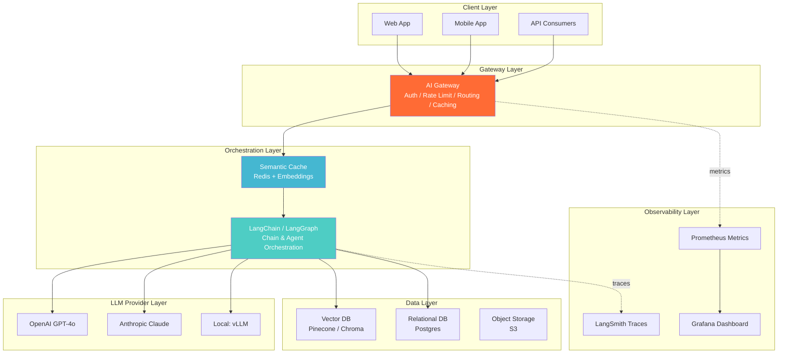
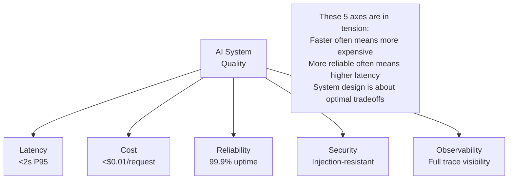
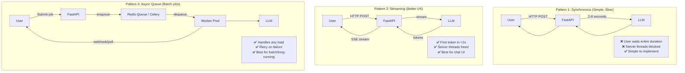
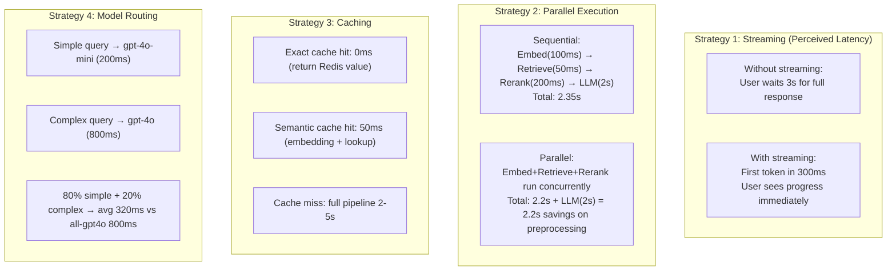

# Part 13: AI System Design and Production Architecture

> *"Building an AI feature that works is engineering. Building an AI feature that works for a million users, at sub-second latency, costs $0.001 per request, and degrades gracefully when OpenAI goes down — that is AI system design. The LLM is 10% of the work. The system around it is 90%."*

---

## Table of Contents

- [Chapter 1: AI System Design Principles](#chapter-1-ai-system-design-principles)
- [Chapter 2: Scalable LLM Application Architecture](#chapter-2-scalable-llm-application-architecture)
- [Chapter 3: Latency and Performance Optimization](#chapter-3-latency-and-performance-optimization)
- [Chapter 4: Cost Optimization Strategies](#chapter-4-cost-optimization-strategies)
- [Chapter 5: Reliability and Fault Tolerance](#chapter-5-reliability-and-fault-tolerance)
- [Chapter 6: Observability and Monitoring](#chapter-6-observability-and-monitoring)
- [Chapter 7: Security and Privacy Architecture](#chapter-7-security-and-privacy-architecture)
- [Chapter 8: Production Design Patterns and Case Studies](#chapter-8-production-design-patterns-and-case-studies)

---

# Chapter 1: AI System Design Principles

---

## 1. Introduction

### What Is AI System Design?

**AI System Design** is the discipline of architecting production systems that incorporate AI/ML components — specifically LLMs, embeddings, vector databases, agents, and pipelines — to reliably serve real users at scale.

It extends classical distributed systems design with AI-specific concerns:
- **Non-determinism**: The same input may produce different outputs
- **Latency spikes**: LLM inference is slow (100ms–10s), non-uniform
- **Token economics**: Cost scales with input+output token count
- **Context management**: State must be managed across stateless HTTP requests
- **Quality degradation**: Silent failures — the model responds but answers incorrectly
- **Vendor dependency**: Outages at OpenAI/Anthropic affect your SLA

Understanding these constraints shapes every architectural decision.

---

## 2. Historical Motivation

### From Classical Software to AI Systems

Classical software systems have a simple reliability contract: if inputs are valid, outputs are deterministic and correct. Add redundancy and the system is resilient. Monitoring is straightforward — error rates, latency, uptime.

AI systems violate every one of these assumptions:
- **Non-determinism**: Same prompt + temperature>0 = different outputs every time
- **Quality failures are silent**: A wrong LLM answer doesn't throw an exception
- **Context windows**: Systems fail not with errors but with degraded quality as context grows
- **External dependency**: Your reliability is bounded by your LLM provider's uptime
- **Cost nonlinearity**: A single runaway agent loop can generate 10,000× more tokens than expected

The 2023 wave of "AI wrappers" that failed in production revealed exactly this: it's easy to build a working demo. It's hard to build a reliable, cost-controlled, observable, secure AI system.

This chapter is the blueprint for getting it right.

---

## 3. Real-World Analogy

### The Restaurant Kitchen

A good restaurant is a **system**, not just a collection of good chefs.

| Restaurant Component | AI System Equivalent |
|---|---|
| Chef (cooks food) | LLM (generates text) |
| Order management system | Request queue + rate limiter |
| Ingredient inventory | Prompt template registry |
| Food quality check | LLM-as-judge evaluation |
| Health inspector | Security and compliance |
| Cost accounting | Token cost tracking |
| Multiple kitchen stations | Parallel LLM calls |
| Rush hour protocols | Auto-scaling under load |
| Backup ingredients | Fallback model providers |
| Customer reviews | User satisfaction monitoring |

A restaurant that's just "a good chef" fails when demand exceeds one chef's capacity, when a key ingredient is out of stock, when health standards aren't met. Similarly, an AI product that's just "a good LLM call" fails in production.

---

## 4. Visual Mental Model

### The AI System Design Stack



### The Five Axes of AI System Design



---

## 5. Internal Working

### The Request Lifecycle in an AI System

```
1. Client sends POST /chat {"message": "What is HNSW?"}
2. Gateway: authenticate API key → rate limit check → log request
3. Cache: hash(message) → check semantic cache → cache hit → return cached response
4. Cache miss: route to orchestration layer
5. LangChain: build prompt (system + history + context)
6. Retriever: embed query → vector search → retrieve top-5 docs
7. Reranker: cross-encoder scores → select top-3
8. LLM call: send prompt+context to GPT-4o → stream tokens
9. Output parser: extract structured response
10. Cache: store embedding + response (TTL=1h)
11. Stream tokens back to client
12. LangSmith: persist full trace
13. Prometheus: record latency, token count, cost
```

Each step can fail independently. Each step has a latency budget. Each step adds cost.

---

## 6. Mathematical Intuition

### Cost and Latency Models

**Total cost per request**:
$$C_{request} = (T_{input} \cdot P_{input}) + (T_{output} \cdot P_{output}) + C_{embedding} + C_{vector\_search}$$

Where $T$ = token count, $P$ = price per token. For GPT-4o-mini:
$$P_{input} = \$0.15/\text{M tokens}, \quad P_{output} = \$0.60/\text{M tokens}$$

A typical RAG request (500 input tokens, 200 output tokens):
$$C = (500 \cdot 1.5 \times 10^{-7}) + (200 \cdot 6 \times 10^{-7}) \approx \$0.000195$$

At 100,000 requests/day: **$19.50/day = $585/month** — before embedding and vector search costs.

**Latency decomposition**:
$$L_{total} = L_{embed} + L_{retrieve} + L_{rerank} + L_{LLM\_TTFT} + L_{LLM\_generation}$$

Where TTFT = Time to First Token. LLM generation latency is approximately:
$$L_{generation} \approx T_{output} / \text{tokens\_per\_second}$$

GPT-4o generates ~150 tokens/second, so 200 output tokens ≈ 1.3 seconds of generation.

---

## 7. Implementation

### AI System Design Framework

```python
"""
AI system design: gateway, routing, configuration, and health checks.
"""

from typing import Dict, List, Optional, Any, Callable, Tuple
from dataclasses import dataclass, field
from enum import Enum
import asyncio
import time
import hashlib
import json
from datetime import datetime


# ─── System Configuration ─────────────────────────────────────────────────────

@dataclass
class LLMProviderConfig:
    """Configuration for a single LLM provider."""
    name: str
    model: str
    api_key_env: str
    base_url: Optional[str] = None
    max_tokens: int = 4096
    requests_per_minute: int = 500
    tokens_per_minute: int = 100000
    cost_per_input_token: float = 0.0  # USD
    cost_per_output_token: float = 0.0  # USD
    avg_latency_ms: float = 1000.0
    is_fallback: bool = False


@dataclass
class SystemConfig:
    """Complete AI system configuration."""
    # Providers in priority order
    primary_providers: List[LLMProviderConfig] = field(default_factory=list)
    fallback_providers: List[LLMProviderConfig] = field(default_factory=list)

    # Caching
    enable_semantic_cache: bool = True
    cache_similarity_threshold: float = 0.95
    cache_ttl_seconds: int = 3600

    # Rate limiting
    max_requests_per_user_per_minute: int = 30
    max_tokens_per_user_per_day: int = 100000

    # Timeouts
    llm_timeout_seconds: float = 30.0
    retriever_timeout_seconds: float = 5.0
    total_request_timeout_seconds: float = 60.0

    # Reliability
    max_retries: int = 3
    retry_delay_seconds: float = 1.0
    circuit_breaker_threshold: int = 5  # Failures before circuit opens

    # Quality
    enable_output_validation: bool = True
    min_response_length: int = 10

    # Cost controls
    max_cost_per_request_usd: float = 0.10
    daily_budget_usd: float = 100.0


# Default system config for production RAG service
PRODUCTION_CONFIG = SystemConfig(
    primary_providers=[
        LLMProviderConfig(
            name="openai",
            model="gpt-4o-mini",
            api_key_env="OPENAI_API_KEY",
            requests_per_minute=500,
            tokens_per_minute=200000,
            cost_per_input_token=0.00000015,
            cost_per_output_token=0.0000006,
            avg_latency_ms=800,
        ),
    ],
    fallback_providers=[
        LLMProviderConfig(
            name="anthropic",
            model="claude-3-haiku-20240307",
            api_key_env="ANTHROPIC_API_KEY",
            cost_per_input_token=0.00000025,
            cost_per_output_token=0.00000125,
            avg_latency_ms=1200,
            is_fallback=True,
        ),
    ],
    enable_semantic_cache=True,
    max_requests_per_user_per_minute=30,
    daily_budget_usd=150.0,
)


# ─── Cost Tracker ─────────────────────────────────────────────────────────────

class CostTracker:
    """Track token costs in real-time."""

    def __init__(self, daily_budget_usd: float):
        self.daily_budget = daily_budget_usd
        self._costs: Dict[str, float] = {}   # date → total cost
        self._request_costs: List[float] = []

    def record_cost(
        self,
        input_tokens: int,
        output_tokens: int,
        provider_config: LLMProviderConfig,
    ) -> float:
        """Record the cost of an LLM call."""
        cost = (
            input_tokens * provider_config.cost_per_input_token +
            output_tokens * provider_config.cost_per_output_token
        )
        today = datetime.now().strftime("%Y-%m-%d")
        self._costs[today] = self._costs.get(today, 0.0) + cost
        self._request_costs.append(cost)
        return cost

    def get_today_cost(self) -> float:
        today = datetime.now().strftime("%Y-%m-%d")
        return self._costs.get(today, 0.0)

    def is_budget_exceeded(self) -> bool:
        return self.get_today_cost() >= self.daily_budget

    def budget_remaining(self) -> float:
        return max(0.0, self.daily_budget - self.get_today_cost())

    def cost_stats(self) -> Dict:
        if not self._request_costs:
            return {}
        return {
            "today_total": f"${self.get_today_cost():.4f}",
            "budget_remaining": f"${self.budget_remaining():.2f}",
            "avg_cost_per_request": f"${sum(self._request_costs) / len(self._request_costs):.6f}",
            "p95_cost": f"${sorted(self._request_costs)[int(len(self._request_costs) * 0.95)]:.6f}",
        }


# ─── Health Check System ──────────────────────────────────────────────────────

class ComponentHealth(Enum):
    HEALTHY = "healthy"
    DEGRADED = "degraded"
    UNHEALTHY = "unhealthy"


@dataclass
class HealthStatus:
    component: str
    status: ComponentHealth
    latency_ms: Optional[float] = None
    error: Optional[str] = None
    checked_at: str = field(default_factory=lambda: datetime.now().isoformat())


class SystemHealthChecker:
    """Check health of all system components."""

    async def check_llm_provider(self, provider: LLMProviderConfig) -> HealthStatus:
        """Probe LLM provider with a minimal request."""
        from openai import AsyncOpenAI
        t0 = time.time()
        try:
            client = AsyncOpenAI(base_url=provider.base_url)
            await asyncio.wait_for(
                client.chat.completions.create(
                    model=provider.model,
                    messages=[{"role": "user", "content": "Hi"}],
                    max_tokens=5,
                ),
                timeout=10.0,
            )
            latency = (time.time() - t0) * 1000
            status = ComponentHealth.HEALTHY if latency < 5000 else ComponentHealth.DEGRADED
            return HealthStatus("llm", status, latency_ms=latency)
        except Exception as e:
            return HealthStatus("llm", ComponentHealth.UNHEALTHY, error=str(e)[:100])

    async def check_vector_db(self, client) -> HealthStatus:
        """Check vector database connectivity."""
        t0 = time.time()
        try:
            await asyncio.wait_for(client.heartbeat(), timeout=5.0)
            return HealthStatus("vector_db", ComponentHealth.HEALTHY, latency_ms=(time.time()-t0)*1000)
        except Exception as e:
            return HealthStatus("vector_db", ComponentHealth.UNHEALTHY, error=str(e)[:100])

    async def check_all(self, config: SystemConfig) -> Dict:
        """Run all health checks concurrently."""
        checks = []
        for provider in config.primary_providers + config.fallback_providers:
            checks.append(self.check_llm_provider(provider))

        results = await asyncio.gather(*checks, return_exceptions=True)

        overall = ComponentHealth.HEALTHY
        statuses = {}
        for i, result in enumerate(results):
            if isinstance(result, Exception):
                statuses[f"provider_{i}"] = HealthStatus(f"provider_{i}", ComponentHealth.UNHEALTHY, error=str(result))
                overall = ComponentHealth.UNHEALTHY
            else:
                statuses[result.component] = result
                if result.status == ComponentHealth.UNHEALTHY:
                    overall = ComponentHealth.UNHEALTHY
                elif result.status == ComponentHealth.DEGRADED and overall == ComponentHealth.HEALTHY:
                    overall = ComponentHealth.DEGRADED

        return {
            "overall": overall.value,
            "components": {k: {"status": v.status.value, "latency_ms": v.latency_ms, "error": v.error}
                          for k, v in statuses.items()},
            "checked_at": datetime.now().isoformat(),
        }
```

---

## 8. Interview Preparation

**Junior**: "AI system design means building the infrastructure around the LLM call — things like caching, rate limiting, fallbacks, monitoring, and cost tracking. The LLM itself is just one component in a larger system."

**Mid-level**: "The five key concerns in AI system design: (1) Latency — LLMs are slow; caching, streaming, and async execution reduce perceived latency; (2) Cost — token costs add up; semantic caching and model routing (cheap model first) control spend; (3) Reliability — LLM providers have outages; fallback providers and circuit breakers maintain uptime; (4) Observability — quality failures are silent; LLM-as-judge and trace logging detect them; (5) Security — prompt injection can hijack agent behavior; input sandboxing and output filtering prevent it."

**Senior**: "AI system design interviews expect you to reason about tradeoffs quantitatively. Given 100K RPD (requests per day), 500 input tokens, 200 output tokens, using GPT-4o-mini: $0.000195/request × 100K = $19.50/day. A semantic cache at 30% hit rate reduces this to $13.65/day — $2,145 annual savings. That's the calculation that justifies cache infrastructure investment. I always start system design with the cost model, then work backwards to the architecture that hits cost targets while meeting latency and reliability SLAs."

---

## 9. Revision Sheet

- **5 axes**: Latency, Cost, Reliability, Security, Observability
- **Request lifecycle**: Gateway → Cache → Orchestrator → Retriever → LLM → Parser → Cache write → Log
- **Cost model**: (input_tokens × input_price) + (output_tokens × output_price)
- **Primary failure modes**: LLM hallucination (silent), provider outage, token overflow, runaway agents
- **Configuration-first design**: All thresholds (budget, timeout, rate limit) in config, not hardcoded

---

---

# Chapter 2: Scalable LLM Application Architecture

---

## 1. Introduction

### What Makes LLM Apps Hard to Scale?

LLM applications face scaling challenges fundamentally different from traditional web apps:

1. **High latency per request**: 500ms–5s vs. <100ms for DB queries
2. **Variable latency**: Short responses finish in 200ms; long ones take 8s
3. **CPU/IO bound differently**: You're waiting on external API, not your own compute
4. **Stateful context**: Conversation history must be managed across requests
5. **Non-deterministic quality**: Scaling doesn't fix quality problems
6. **Bursty, expensive compute**: Unlike databases, you can't cache everything

---

## 2. Visual Mental Model

### Scalable Architecture Patterns



---

## 3. Implementation

### Complete Scalable AI Service

```python
"""
Scalable AI service: FastAPI + async streaming + queue + multi-tenant.
"""

import asyncio
import json
import time
import uuid
from contextlib import asynccontextmanager
from typing import AsyncIterator, Dict, List, Optional, Any
from enum import Enum

from fastapi import FastAPI, HTTPException, BackgroundTasks, Depends, Header
from fastapi.responses import StreamingResponse
from pydantic import BaseModel, Field
from openai import AsyncOpenAI
import redis.asyncio as aioredis
import logging

logger = logging.getLogger(__name__)


# ─── Job Status (for async queue pattern) ─────────────────────────────────────

class JobStatus(str, Enum):
    PENDING = "pending"
    PROCESSING = "processing"
    COMPLETED = "completed"
    FAILED = "failed"


class JobResult(BaseModel):
    job_id: str
    status: JobStatus
    result: Optional[str] = None
    error: Optional[str] = None
    created_at: float
    completed_at: Optional[float] = None
    cost_usd: Optional[float] = None
    tokens_used: Optional[int] = None


# ─── Application State ────────────────────────────────────────────────────────

class AppServices:
    llm_client: AsyncOpenAI = None
    redis: aioredis.Redis = None
    rate_limiter = None


services = AppServices()


@asynccontextmanager
async def lifespan(app: FastAPI):
    """Initialize services at startup."""
    services.llm_client = AsyncOpenAI()
    services.redis = await aioredis.from_url("redis://localhost:6379", decode_responses=True)
    logger.info("Services initialized")
    yield
    await services.redis.aclose()
    logger.info("Services shutdown")


app = FastAPI(title="Scalable AI Service", lifespan=lifespan)


# ─── Rate Limiter (sliding window) ────────────────────────────────────────────

class SlidingWindowRateLimiter:
    """Redis-backed sliding window rate limiter."""

    def __init__(self, redis: aioredis.Redis, window_seconds: int = 60, max_requests: int = 30):
        self.redis = redis
        self.window_seconds = window_seconds
        self.max_requests = max_requests

    async def is_allowed(self, user_id: str) -> Tuple[bool, int]:
        """Check if user is within rate limit. Returns (allowed, remaining)."""
        key = f"rate_limit:{user_id}"
        now = time.time()
        window_start = now - self.window_seconds

        async with self.redis.pipeline() as pipe:
            pipe.zremrangebyscore(key, 0, window_start)   # Remove old entries
            pipe.zadd(key, {str(now): now})                # Add current request
            pipe.zcard(key)                                 # Count in window
            pipe.expire(key, self.window_seconds)           # Auto-expire key
            results = await pipe.execute()

        current_count = results[2]
        remaining = max(0, self.max_requests - current_count)
        return current_count <= self.max_requests, remaining


# ─── Semantic Cache ────────────────────────────────────────────────────────────

class SemanticCache:
    """
    Cache LLM responses by semantic similarity.
    Uses Redis for storage + OpenAI embeddings for similarity.
    """

    def __init__(self, redis: aioredis.Redis, threshold: float = 0.95, ttl: int = 3600):
        self.redis = redis
        self.threshold = threshold
        self.ttl = ttl

    async def _embed(self, text: str) -> List[float]:
        """Embed text using OpenAI."""
        response = await services.llm_client.embeddings.create(
            input=text, model="text-embedding-3-small"
        )
        return response.data[0].embedding

    async def get(self, query: str) -> Optional[str]:
        """Check cache for semantically similar query."""
        import numpy as np
        query_emb = await self._embed(query)
        query_emb_np = np.array(query_emb)

        # Get all cached embeddings
        cache_keys = await self.redis.keys("semantic_cache:emb:*")
        if not cache_keys:
            return None

        for key in cache_keys[:100]:  # Check up to 100 cached items
            cached_emb_json = await self.redis.get(key)
            if not cached_emb_json:
                continue

            cached_emb = np.array(json.loads(cached_emb_json))
            sim = float(np.dot(query_emb_np, cached_emb) / (np.linalg.norm(query_emb_np) * np.linalg.norm(cached_emb)))

            if sim >= self.threshold:
                # Cache hit — get the corresponding response
                response_key = key.replace("emb:", "resp:")
                cached_response = await self.redis.get(response_key)
                if cached_response:
                    logger.info(f"Semantic cache hit (similarity={sim:.3f})")
                    return cached_response

        return None

    async def set(self, query: str, response: str):
        """Store query embedding and response in cache."""
        query_emb = await self._embed(query)
        cache_id = hashlib.sha256(query.encode()).hexdigest()[:16]

        async with self.redis.pipeline() as pipe:
            pipe.setex(f"semantic_cache:emb:{cache_id}", self.ttl, json.dumps(query_emb))
            pipe.setex(f"semantic_cache:resp:{cache_id}", self.ttl, response)
            await pipe.execute()


# ─── Request Models ────────────────────────────────────────────────────────────

class ChatRequest(BaseModel):
    message: str = Field(..., min_length=1, max_length=10000)
    session_id: str = Field(..., min_length=1, max_length=100)
    stream: bool = True
    model: str = "gpt-4o-mini"
    temperature: float = Field(default=0.1, ge=0, le=2.0)
    max_tokens: int = Field(default=1024, ge=1, le=4096)


class BatchRequest(BaseModel):
    """For async batch processing."""
    requests: List[ChatRequest] = Field(..., max_items=100)
    webhook_url: Optional[str] = None  # Callback when batch complete


# ─── Auth Middleware ───────────────────────────────────────────────────────────

async def get_user_id(x_api_key: str = Header(...)) -> str:
    """Validate API key and extract user ID."""
    # In production: lookup API key in database
    if not x_api_key or len(x_api_key) < 10:
        raise HTTPException(status_code=401, detail="Invalid API key")
    # Hash the key to get a stable user ID
    return hashlib.sha256(x_api_key.encode()).hexdigest()[:16]


# ─── Core Chat Endpoint ────────────────────────────────────────────────────────

@app.post("/v1/chat")
async def chat(
    request: ChatRequest,
    user_id: str = Depends(get_user_id),
):
    """
    Primary chat endpoint.
    Supports streaming and non-streaming with:
    - Rate limiting
    - Semantic caching
    - Cost tracking
    - Session memory
    """
    rate_limiter = SlidingWindowRateLimiter(services.redis)
    cache = SemanticCache(services.redis)

    # Rate limit check
    allowed, remaining = await rate_limiter.is_allowed(user_id)
    if not allowed:
        raise HTTPException(status_code=429, detail="Rate limit exceeded")

    # Check semantic cache (only for non-streaming with identical-ish queries)
    if not request.stream:
        cached = await cache.get(request.message)
        if cached:
            return {"response": cached, "cached": True, "remaining_requests": remaining}

    # Load session history from Redis
    session_key = f"session:{user_id}:{request.session_id}"
    history_json = await services.redis.get(session_key)
    history = json.loads(history_json) if history_json else []

    # Build messages
    messages = [{"role": "system", "content": "You are a helpful AI assistant."}]
    messages.extend(history[-10:])  # Last 10 messages (5 turns)
    messages.append({"role": "user", "content": request.message})

    # Generate response
    if request.stream:
        async def generate() -> AsyncIterator[str]:
            full_response = ""
            prompt_tokens = 0
            completion_tokens = 0

            try:
                async with services.llm_client.chat.completions.stream(
                    model=request.model,
                    messages=messages,
                    max_tokens=request.max_tokens,
                    temperature=request.temperature,
                ) as stream:
                    async for event in stream:
                        if event.choices[0].delta.content:
                            chunk = event.choices[0].delta.content
                            full_response += chunk
                            yield f"data: {json.dumps({'token': chunk, 'done': False})}\n\n"

                    # Final message with metadata
                    usage = stream.get_final_completion().usage
                    if usage:
                        prompt_tokens = usage.prompt_tokens
                        completion_tokens = usage.completion_tokens

                yield f"data: {json.dumps({'token': '', 'done': True, 'tokens': completion_tokens})}\n\n"

            except asyncio.TimeoutError:
                yield f"data: {json.dumps({'error': 'Request timed out', 'done': True})}\n\n"
            except Exception as e:
                logger.error(f"Stream error: {e}")
                yield f"data: {json.dumps({'error': 'Internal error', 'done': True})}\n\n"
            finally:
                # Save to session history
                if full_response:
                    history.append({"role": "user", "content": request.message})
                    history.append({"role": "assistant", "content": full_response})
                    await services.redis.setex(session_key, 86400, json.dumps(history))

                    # Cache if response is substantial
                    if len(full_response) > 50:
                        asyncio.create_task(cache.set(request.message, full_response))

        return StreamingResponse(
            asyncio.timeout_context(generate(), timeout=30),
            media_type="text/event-stream",
            headers={
                "X-RateLimit-Remaining": str(remaining),
                "X-Cache": "MISS",
            }
        )

    else:
        t0 = time.time()
        response = await asyncio.wait_for(
            services.llm_client.chat.completions.create(
                model=request.model,
                messages=messages,
                max_tokens=request.max_tokens,
                temperature=request.temperature,
            ),
            timeout=30.0,
        )
        latency = (time.time() - t0) * 1000
        text = response.choices[0].message.content

        # Save session + cache
        history.append({"role": "user", "content": request.message})
        history.append({"role": "assistant", "content": text})
        await services.redis.setex(session_key, 86400, json.dumps(history))
        asyncio.create_task(cache.set(request.message, text))

        return {
            "response": text,
            "latency_ms": latency,
            "tokens": response.usage.total_tokens,
            "cached": False,
            "remaining_requests": remaining,
        }


# ─── Batch Processing Endpoint ────────────────────────────────────────────────

@app.post("/v1/batch")
async def create_batch(
    request: BatchRequest,
    background_tasks: BackgroundTasks,
    user_id: str = Depends(get_user_id),
):
    """Submit a batch of requests for async processing."""
    batch_id = str(uuid.uuid4())

    # Initialize job records
    jobs = {}
    for i, req in enumerate(request.requests):
        job_id = f"{batch_id}_{i}"
        job = JobResult(
            job_id=job_id,
            status=JobStatus.PENDING,
            created_at=time.time(),
        )
        await services.redis.setex(f"job:{job_id}", 86400, job.model_dump_json())
        jobs[job_id] = job

    # Process in background
    background_tasks.add_task(
        process_batch,
        batch_id=batch_id,
        requests=request.requests,
        user_id=user_id,
    )

    return {"batch_id": batch_id, "job_count": len(request.requests), "status": "submitted"}


async def process_batch(batch_id: str, requests: List[ChatRequest], user_id: str):
    """Background task: process all requests in a batch."""
    semaphore = asyncio.Semaphore(10)  # Max 10 concurrent LLM calls

    async def process_one(req: ChatRequest, idx: int):
        job_id = f"{batch_id}_{idx}"
        async with semaphore:
            try:
                await services.redis.hset(f"job:{job_id}", "status", JobStatus.PROCESSING)
                response = await services.llm_client.chat.completions.create(
                    model=req.model,
                    messages=[{"role": "user", "content": req.message}],
                    max_tokens=req.max_tokens,
                )
                result = response.choices[0].message.content
                job_data = {
                    "status": JobStatus.COMPLETED,
                    "result": result,
                    "completed_at": time.time(),
                    "tokens_used": response.usage.total_tokens,
                }
                await services.redis.setex(f"job:{job_id}", 86400, json.dumps(job_data))
            except Exception as e:
                error_data = {"status": JobStatus.FAILED, "error": str(e), "completed_at": time.time()}
                await services.redis.setex(f"job:{job_id}", 86400, json.dumps(error_data))

    await asyncio.gather(*[process_one(req, i) for i, req in enumerate(requests)])


@app.get("/v1/jobs/{job_id}")
async def get_job(job_id: str, user_id: str = Depends(get_user_id)):
    """Poll job status for async batch processing."""
    job_data = await services.redis.get(f"job:{job_id}")
    if not job_data:
        raise HTTPException(status_code=404, detail="Job not found")
    return json.loads(job_data)
```

---

## 3. Interview Preparation

**Mid-level**: "For a scalable AI service, I build three patterns: (1) Streaming for chat — FastAPI + SSE streaming, first token in <1s, good UX; (2) Sync for short queries — standard HTTP request/response with a 30s timeout; (3) Async queue for batch jobs — Redis Queue / Celery for long-running tasks, webhook or polling for results. Rate limiting with sliding window (Redis ZSET), semantic cache with embedding similarity."

**Senior**: "Scalability for LLM services is primarily about concurrency management, not throughput. Python's asyncio handles hundreds of concurrent LLM requests (all I/O waiting) on a single server — the bottleneck is the LLM API rate limits, not your server. I tune max_concurrency to stay just under the provider's rate limit. For burst traffic, I use a Redis-backed request queue with configurable worker pool size, and auto-scale workers based on queue depth (Kubernetes HPA or AWS Lambda). The hardest scaling problem: maintaining sub-100ms latency for session retrieval as sessions grow — use Redis with a 24h TTL and trim to last 10 messages per session."

---

---

# Chapter 3: Latency and Performance Optimization

---

## 1. Introduction

### The Latency Problem

LLM applications have inherently high latency. A typical RAG request:
- Embedding the query: 50-100ms
- Vector search: 10-50ms
- LLM inference: 500ms-5s

The challenge: users abandon applications with >3s perceived latency. The solution is not to make the LLM faster — it's to architect the system so users feel it's fast.

---

## 2. Visual Mental Model

### Latency Optimization Strategies



---

## 3. Implementation

### Latency Optimization Techniques

```python
"""
Latency optimization: streaming, parallelism, caching, model routing.
"""

import asyncio
import time
import hashlib
import json
from typing import AsyncIterator, List, Dict, Optional, Tuple
from openai import AsyncOpenAI

client = AsyncOpenAI()


# ─── 1. Async Parallelism: Run Independent Steps Simultaneously ────────────────

async def optimized_rag_pipeline(query: str, retriever, llm) -> AsyncIterator[str]:
    """
    Optimized RAG: embed and retrieve while query classifier runs.
    All preprocessing happens in parallel before the LLM call.
    """
    t0 = time.time()

    # Run embedding, retrieval, and query classification in PARALLEL
    embed_task = asyncio.create_task(retriever.embed_query(query))
    classify_task = asyncio.create_task(classify_query_complexity(query))

    # Wait for embedding, then immediately start retrieval
    query_embedding = await embed_task
    retrieve_task = asyncio.create_task(retriever.retrieve_with_embedding(query_embedding))

    # Get classification (probably already done)
    complexity = await classify_task

    # Now get retrieved docs
    docs = await retrieve_task

    retrieval_time = (time.time() - t0) * 1000
    print(f"Retrieval time: {retrieval_time:.0f}ms")

    # Choose model based on complexity
    model = "gpt-4o" if complexity == "complex" else "gpt-4o-mini"

    # Stream the LLM response
    context = "\n\n".join(doc.page_content for doc in docs)
    messages = [
        {"role": "system", "content": f"Answer based on context only:\n{context}"},
        {"role": "user", "content": query},
    ]

    async with client.chat.completions.stream(
        model=model,
        messages=messages,
        max_tokens=512,
    ) as stream:
        async for event in stream:
            if event.choices[0].delta.content:
                yield event.choices[0].delta.content


async def classify_query_complexity(query: str) -> str:
    """Fast complexity classifier using a tiny model."""
    # Use regex heuristics first (0ms)
    complex_indicators = ["compare", "explain why", "analyze", "difference between", "pros and cons"]
    if any(indicator in query.lower() for indicator in complex_indicators):
        return "complex"
    if len(query.split()) < 10:
        return "simple"

    # Use small model for borderline cases (200ms)
    response = await client.chat.completions.create(
        model="gpt-4o-mini",
        messages=[
            {"role": "system", "content": "Classify query as 'simple' or 'complex'. One word only."},
            {"role": "user", "content": query},
        ],
        max_tokens=5,
        temperature=0,
    )
    return response.choices[0].message.content.strip().lower()


# ─── 2. Speculative Decoding Pattern ──────────────────────────────────────────

async def speculative_rag(
    query: str,
    retriever,
    fast_model: str = "gpt-4o-mini",
    slow_model: str = "gpt-4o",
) -> str:
    """
    Speculative execution: start fast model, cancel if quality is insufficient.
    
    Pattern: Run fast model first. If answer quality is adequate, return it.
    If quality is poor (hallucination detected, too short), switch to slow model.
    
    Expected result: 80% of requests served by fast model (200ms),
    20% upgraded to slow model (800ms). Average: ~320ms vs 800ms.
    """
    docs = await retriever.aretrieve(query)
    context = "\n\n".join(doc.page_content for doc in docs)

    prompt = [
        {"role": "system", "content": f"Answer concisely from context:\n{context}"},
        {"role": "user", "content": query},
    ]

    # Try fast model first
    fast_response = await client.chat.completions.create(
        model=fast_model,
        messages=prompt,
        max_tokens=512,
        temperature=0,
    )
    fast_answer = fast_response.choices[0].message.content

    # Quality gate: should we upgrade to the slow model?
    if await needs_upgrade(query, fast_answer, context):
        slow_response = await client.chat.completions.create(
            model=slow_model,
            messages=prompt,
            max_tokens=1024,
            temperature=0,
        )
        return slow_response.choices[0].message.content

    return fast_answer


async def needs_upgrade(query: str, answer: str, context: str) -> bool:
    """Determine if the fast model's answer needs a quality upgrade."""
    # Heuristic checks (0ms)
    if len(answer.split()) < 15 and len(query.split()) > 10:
        return True  # Answer too short for complex query
    if "I don't know" in answer or "I cannot" in answer:
        return True  # Fast model refused to answer

    # For high-stakes queries, always upgrade
    upgrade_keywords = ["diagnosis", "legal", "financial", "medication"]
    if any(kw in query.lower() for kw in upgrade_keywords):
        return True

    return False


# ─── 3. Response Caching Hierarchy ────────────────────────────────────────────

class MultiLayerCache:
    """
    Three-layer cache with different granularities and TTLs.
    
    Layer 1: Exact match (hash of prompt) — 0ms lookup, 24h TTL
    Layer 2: Semantic match (embedding similarity) — 50ms lookup, 1h TTL
    Layer 3: Partial cache (cache the retrieval step only) — 30ms lookup, 15min TTL
    """

    def __init__(self, redis):
        self.redis = redis

    async def get_exact(self, prompt: str) -> Optional[str]:
        """L1: Exact hash match."""
        key = f"cache:exact:{hashlib.sha256(prompt.encode()).hexdigest()}"
        return await self.redis.get(key)

    async def set_exact(self, prompt: str, response: str, ttl: int = 86400):
        key = f"cache:exact:{hashlib.sha256(prompt.encode()).hexdigest()}"
        await self.redis.setex(key, ttl, response)

    async def get_retrieval(self, query: str) -> Optional[List[Dict]]:
        """L3: Cache retrieved documents (cheaper than full response)."""
        key = f"cache:retrieval:{hashlib.sha256(query.encode()).hexdigest()}"
        cached = await self.redis.get(key)
        return json.loads(cached) if cached else None

    async def set_retrieval(self, query: str, docs: List[Dict], ttl: int = 900):
        key = f"cache:retrieval:{hashlib.sha256(query.encode()).hexdigest()}"
        await self.redis.setex(key, ttl, json.dumps(docs))

    async def lookup_all(self, query: str) -> Tuple[Optional[str], Optional[List[Dict]], str]:
        """
        Check all cache layers. Returns (full_response, cached_docs, cache_level).
        """
        # L1: Exact match (fastest)
        exact = await self.get_exact(query)
        if exact:
            return exact, None, "L1_exact"

        # L3: Retrieval cache (can skip vector search)
        cached_docs = await self.get_retrieval(query)
        if cached_docs:
            return None, cached_docs, "L3_retrieval"

        return None, None, "MISS"


# ─── 4. Connection Pooling for LLM Clients ─────────────────────────────────────

class LLMClientPool:
    """
    Pool of AsyncOpenAI clients with connection reuse.
    
    OpenAI's AsyncOpenAI client is already connection-pooled internally,
    but creating one per request wastes connection setup time.
    Create once at startup, reuse per request.
    """

    def __init__(self, api_key: str, pool_size: int = 10):
        # Single client with internal connection pool
        self.client = AsyncOpenAI(
            api_key=api_key,
            max_retries=3,
            timeout=30.0,
        )

    async def complete(self, **kwargs):
        return await self.client.chat.completions.create(**kwargs)

    async def stream(self, **kwargs):
        return self.client.chat.completions.stream(**kwargs)


# ─── 5. Latency Budget Enforcement ───────────────────────────────────────────

class LatencyBudget:
    """
    Enforce latency budgets per pipeline stage.
    Gracefully degrade (skip reranking, use cached retrieval) when over budget.
    """

    def __init__(self, total_budget_ms: float = 5000):
        self.total_budget = total_budget_ms
        self.spent = 0.0
        self.start_time = time.time()

    def elapsed(self) -> float:
        return (time.time() - self.start_time) * 1000

    def remaining(self) -> float:
        return max(0.0, self.total_budget - self.elapsed())

    def can_afford(self, estimated_ms: float) -> bool:
        return self.remaining() >= estimated_ms

    async def execute_if_affordable(
        self,
        coroutine,
        estimated_ms: float,
        fallback=None,
    ):
        """Execute coroutine only if within budget, otherwise return fallback."""
        if self.can_afford(estimated_ms):
            return await coroutine
        else:
            print(f"Skipping step: only {self.remaining():.0f}ms remaining, needed {estimated_ms}ms")
            return fallback


async def budget_aware_rag(query: str, retriever, reranker):
    """RAG pipeline that degrades gracefully based on latency budget."""
    budget = LatencyBudget(total_budget_ms=4000)

    # Always: retrieve (critical)
    docs = await retriever.aretrieve(query)

    # Optional: rerank (skip if over budget)
    reranked = await budget.execute_if_affordable(
        reranker.arerank(query, docs),
        estimated_ms=300,
        fallback=docs[:3],  # Use top-3 without reranking
    )

    # Optional: expand context (skip if over budget)
    expanded = await budget.execute_if_affordable(
        expand_context(reranked),
        estimated_ms=100,
        fallback=reranked,
    )

    print(f"Total preprocessing: {budget.elapsed():.0f}ms")
    return expanded


async def expand_context(docs):
    """Fetch parent documents for context expansion."""
    # Implementation would fetch parent docs from DB
    return docs
```

---

## 4. Interview Preparation

**Junior**: "Streaming is the most impactful latency optimization — users see the first token in <1 second instead of waiting for the full response. Other techniques: cache repeated queries in Redis, run embedding and retrieval in parallel with asyncio.gather."

**Mid-level**: "I use a 4-layer latency strategy: (1) Streaming for perceived latency — first token < 1s; (2) Multi-layer caching — exact match (0ms), semantic (50ms), retrieval-only (30ms); (3) Parallel preprocessing — embed, classify, and prepare context concurrently; (4) Model routing — 80% of simple queries to gpt-4o-mini (200ms), 20% complex to gpt-4o (800ms). Average latency: ~320ms vs. 800ms all-gpt4o."

**Senior**: "Latency optimization is a budget allocation problem. I assign each stage a latency budget (embed=100ms, retrieve=50ms, rerank=200ms, LLM=3s). A `LatencyBudget` class tracks remaining budget and degrades non-critical steps gracefully — if retrieval takes longer than expected, skip reranking. For P95 latency targets, I simulate the full pipeline with realistic traffic patterns (Poisson arrivals) and measure tail latency behavior before deploying optimizations."

---

---

# Chapter 4: Cost Optimization Strategies

---

## 1. Introduction

### The Hidden Costs of LLM Applications

Engineers often underestimate production LLM costs. The full cost picture:

| Cost Component | Typical Share | Notes |
|---|---|---|
| LLM API calls | 60-80% | Input + output tokens |
| Embedding API calls | 10-20% | Every RAG query |
| Vector DB operations | 5-10% | Per-query search |
| Infrastructure | 5-15% | Servers, Redis, DB |
| Observability | 1-5% | LangSmith, monitoring |

Optimization focus: LLM API costs first, embedding second.

---

## 2. Implementation

### Cost Optimization Framework

```python
"""
Cost optimization: model routing, prompt compression, caching, batching.
"""

import asyncio
import json
import tiktoken
from typing import List, Dict, Optional, Tuple, Any
from openai import AsyncOpenAI
from pydantic import BaseModel

client = AsyncOpenAI()


# ─── 1. Token Counting and Cost Estimation ────────────────────────────────────

class TokenCounter:
    """Precise token counting using tiktoken."""

    _encoders = {}

    @classmethod
    def get_encoder(cls, model: str):
        if model not in cls._encoders:
            try:
                cls._encoders[model] = tiktoken.encoding_for_model(model)
            except KeyError:
                cls._encoders[model] = tiktoken.get_encoding("cl100k_base")
        return cls._encoders[model]

    @classmethod
    def count(cls, text: str, model: str = "gpt-4o") -> int:
        return len(cls.get_encoder(model).encode(text))

    @classmethod
    def count_messages(cls, messages: List[Dict], model: str = "gpt-4o") -> int:
        """Count tokens in a message list including overhead."""
        enc = cls.get_encoder(model)
        total = 3  # Every message starts with overhead
        for message in messages:
            total += 4  # Role + content overhead
            for value in message.values():
                total += len(enc.encode(str(value)))
        return total


MODEL_PRICING = {
    "gpt-4o":         {"input": 5.00,   "output": 15.00},    # Per 1M tokens
    "gpt-4o-mini":    {"input": 0.15,   "output": 0.60},
    "gpt-4-turbo":    {"input": 10.00,  "output": 30.00},
    "claude-3-opus":  {"input": 15.00,  "output": 75.00},
    "claude-3-sonnet":{"input": 3.00,   "output": 15.00},
    "claude-3-haiku": {"input": 0.25,   "output": 1.25},
}


def estimate_request_cost(
    messages: List[Dict],
    expected_output_tokens: int = 500,
    model: str = "gpt-4o-mini",
) -> Dict:
    """Estimate the cost of an API call before making it."""
    input_tokens = TokenCounter.count_messages(messages, model)
    pricing = MODEL_PRICING.get(model, MODEL_PRICING["gpt-4o-mini"])
    input_cost = (input_tokens / 1_000_000) * pricing["input"]
    output_cost = (expected_output_tokens / 1_000_000) * pricing["output"]
    total_cost = input_cost + output_cost

    return {
        "model": model,
        "input_tokens": input_tokens,
        "expected_output_tokens": expected_output_tokens,
        "estimated_cost_usd": total_cost,
        "daily_at_1k_requests": total_cost * 1000,
        "monthly_at_1k_requests": total_cost * 30000,
    }


# ─── 2. Intelligent Model Router ──────────────────────────────────────────────

class IntelligentModelRouter:
    """
    Routes requests to the cheapest model that can handle them.
    
    Cost reduction: 70-80% by sending simple queries to cheap models.
    Quality: comparable — simple queries don't need GPT-4.
    """

    ROUTING_RULES = [
        # (complexity_threshold, model, max_tokens)
        (0, "gpt-4o-mini", 512),   # Simple: factual, short, single-hop
        (0.4, "gpt-4o-mini", 1024), # Medium: moderate reasoning
        (0.7, "gpt-4o", 2048),      # Complex: multi-step, analysis
        (0.9, "gpt-4o", 4096),      # Expert: code, math, research
    ]

    async def route(self, query: str, context: str = "") -> Tuple[str, int]:
        """Determine the best model for a given query."""
        complexity = await self._estimate_complexity(query, context)

        for threshold, model, max_tokens in reversed(self.ROUTING_RULES):
            if complexity >= threshold:
                return model, max_tokens

        return "gpt-4o-mini", 512

    async def _estimate_complexity(self, query: str, context: str = "") -> float:
        """
        Estimate query complexity (0.0 to 1.0) using fast heuristics.
        Only calls LLM for borderline cases.
        """
        score = 0.0

        # Length signals
        word_count = len(query.split())
        if word_count > 50: score += 0.2
        elif word_count > 20: score += 0.1

        # Complexity keywords
        complex_patterns = [
            ("compare", 0.15), ("analyze", 0.2), ("explain why", 0.15),
            ("what would happen if", 0.25), ("pros and cons", 0.15),
            ("write code", 0.3), ("debug", 0.3), ("architecture", 0.25),
            ("derive", 0.3), ("prove", 0.35), ("mathematical", 0.3),
        ]
        query_lower = query.lower()
        for pattern, weight in complex_patterns:
            if pattern in query_lower:
                score += weight

        # Multiple questions
        if query.count("?") > 1:
            score += 0.2

        # Context complexity
        if len(context.split()) > 1000:
            score += 0.1

        return min(1.0, score)


# ─── 3. Prompt Compression ────────────────────────────────────────────────────

class PromptCompressor:
    """
    Compress prompts to reduce token cost without losing key information.
    
    Techniques:
    1. Remove redundant whitespace/formatting
    2. Summarize long context with a cheap model
    3. Extract only relevant sentences (attention-based filtering)
    4. Use shorter system prompts with equivalent effect
    """

    def __init__(self, target_token_budget: int = 2000):
        self.token_budget = target_token_budget

    def clean_whitespace(self, text: str) -> str:
        """Remove redundant whitespace (free 5-10% token reduction)."""
        import re
        text = re.sub(r'\n{3,}', '\n\n', text)
        text = re.sub(r' {2,}', ' ', text)
        text = re.sub(r'\t+', ' ', text)
        return text.strip()

    async def compress_context(
        self,
        query: str,
        context: str,
        max_tokens: int = 1500,
    ) -> str:
        """
        Compress long context to fit within token budget.
        Uses extractive summarization via a cheap model.
        """
        current_tokens = TokenCounter.count(context)
        if current_tokens <= max_tokens:
            return context  # Already fits, no compression needed

        # Extractive compression: ask model to extract relevant sentences
        compression_prompt = f"""Extract ONLY the sentences from the context that are directly relevant to this question.
Remove all irrelevant sentences. Keep exact text, no paraphrasing.
Aim for {max_tokens // 4} words.

Question: {query}

Context:
{context[:4000]}  # Truncate very long contexts first

Extracted relevant sentences:"""

        response = await client.chat.completions.create(
            model="gpt-4o-mini",  # Use cheap model for compression
            messages=[{"role": "user", "content": compression_prompt}],
            max_tokens=max_tokens,
            temperature=0,
        )

        compressed = response.choices[0].message.content
        new_tokens = TokenCounter.count(compressed)
        reduction = (1 - new_tokens / current_tokens) * 100
        print(f"Context compressed: {current_tokens} → {new_tokens} tokens ({reduction:.0f}% reduction)")
        return compressed

    def extract_relevant_sentences(self, query: str, context: str) -> str:
        """
        Heuristic sentence extraction (no LLM call needed).
        Selects sentences containing query keywords.
        """
        import re
        sentences = re.split(r'(?<=[.!?])\s+', context)
        query_words = set(query.lower().split()) - {"what", "how", "is", "the", "a", "an", "of", "in", "and"}

        scored_sentences = []
        for sent in sentences:
            sent_lower = sent.lower()
            score = sum(1 for word in query_words if word in sent_lower)
            if score > 0:
                scored_sentences.append((score, sent))

        scored_sentences.sort(reverse=True)
        top_sentences = [s for _, s in scored_sentences[:10]]
        return " ".join(top_sentences) if top_sentences else context[:1000]


# ─── 4. Batch Inference (for offline workloads) ───────────────────────────────

class CostAwareBatcher:
    """
    Batch multiple requests and process during off-peak hours.
    OpenAI Batch API: 50% cheaper, 24h SLA.
    """

    async def submit_batch_to_openai(self, requests: List[Dict]) -> str:
        """
        Use OpenAI's Batch API for 50% cost reduction on non-urgent tasks.
        """
        import json
        from pathlib import Path

        # Prepare JSONL batch file
        batch_lines = []
        for i, req in enumerate(requests):
            batch_lines.append(json.dumps({
                "custom_id": f"request-{i}",
                "method": "POST",
                "url": "/v1/chat/completions",
                "body": req,
            }))

        # Upload batch file
        batch_content = "\n".join(batch_lines).encode()
        batch_file = await client.files.create(
            file=("batch.jsonl", batch_content),
            purpose="batch",
        )

        # Submit batch
        batch = await client.batches.create(
            input_file_id=batch_file.id,
            endpoint="/v1/chat/completions",
            completion_window="24h",
        )

        print(f"Batch submitted: {batch.id} ({len(requests)} requests, 50% cost reduction)")
        return batch.id

    async def retrieve_batch_results(self, batch_id: str) -> List[Dict]:
        """Retrieve completed batch results."""
        batch = await client.batches.retrieve(batch_id)

        if batch.status != "completed":
            return []  # Not ready yet

        content = await client.files.content(batch.output_file_id)
        results = []
        for line in content.text.split("\n"):
            if line:
                result = json.loads(line)
                results.append({
                    "id": result["custom_id"],
                    "response": result["response"]["body"]["choices"][0]["message"]["content"],
                })
        return results


# ─── 5. Cost Dashboard ────────────────────────────────────────────────────────

def calculate_optimization_impact() -> Dict:
    """Calculate potential cost savings from optimization strategies."""
    base_cost_per_day = 100.00  # $100/day baseline

    savings = {
        "semantic_cache_30pct_hit_rate": base_cost_per_day * 0.30,
        "model_routing_80pct_to_mini": base_cost_per_day * (1 - (0.8 * 0.15/5.0 + 0.2)),
        "prompt_compression_20pct_reduction": base_cost_per_day * 0.20,
        "batch_api_for_offline_jobs": base_cost_per_day * 0.15,  # 30% of traffic × 50% discount
    }

    print("Cost Optimization Impact Analysis:")
    print(f"Baseline: ${base_cost_per_day:.2f}/day")
    for strategy, saving in savings.items():
        print(f"  {strategy}: saves ${saving:.2f}/day ({saving/base_cost_per_day:.0%})")

    total_saving = sum(savings.values())
    print(f"Combined savings: ${total_saving:.2f}/day (if non-overlapping)")
    return savings
```

---

## 3. Interview Preparation

**Mid-level**: "Four cost levers: (1) Semantic cache — 30-40% hit rate reduces API calls by that much; (2) Model routing — 80% of queries to gpt-4o-mini ($0.15/M) instead of gpt-4o ($5/M) = 97% cost reduction for those queries; (3) Prompt compression — shorter prompts, fewer tokens; (4) OpenAI Batch API — 50% cheaper for non-real-time jobs. Combined: 60-70% cost reduction is achievable."

**Senior**: "I start every cost optimization project with a token cost breakdown by component: system prompt, conversation history, retrieved context, output. In most systems, retrieved context is 40-60% of input tokens. Compressing context (extractive summarization with gpt-4o-mini) is cheap (10 tokens to compress) and often saves 50+ tokens per request — a net positive. For model routing, I build a 200-example evaluation set for each complexity tier, verify that gpt-4o-mini achieves ≥95% of gpt-4o quality on that tier, then route confidently."

---

---

# Chapter 5: Reliability and Fault Tolerance

---

## 1. Introduction

### The SLA Challenge

LLM services have challenging SLA targets because their reliability depends on external providers. OpenAI's historical uptime is ~99.9% = ~8.7 hours of downtime/year. But during an outage, your service is completely down unless you've built redundancy.

Fault tolerance in AI systems means: **any single component failure should not cause a user-facing outage**.

---

## 2. Implementation

### Circuit Breaker and Fallback System

```python
"""
Reliability patterns: circuit breaker, fallback, retry, timeout.
"""

import asyncio
import time
import logging
from typing import Optional, Callable, TypeVar, Any, List
from enum import Enum
from dataclasses import dataclass, field

logger = logging.getLogger(__name__)

T = TypeVar("T")


# ─── 1. Circuit Breaker ───────────────────────────────────────────────────────

class CircuitState(Enum):
    CLOSED = "closed"      # Normal operation
    OPEN = "open"          # Failing, reject all requests
    HALF_OPEN = "half_open" # Testing if service has recovered


@dataclass
class CircuitBreaker:
    """
    Circuit breaker pattern for LLM provider calls.
    
    States:
    - CLOSED: all requests pass through (normal)
    - OPEN: all requests fail immediately (service down)
    - HALF_OPEN: one test request allowed (testing recovery)
    
    Transition: CLOSED → OPEN when failure_threshold exceeded
    Transition: OPEN → HALF_OPEN after recovery_timeout
    Transition: HALF_OPEN → CLOSED on success, OPEN on failure
    """
    failure_threshold: int = 5      # Failures before opening
    recovery_timeout: float = 60.0  # Seconds before trying again
    
    _state: CircuitState = field(default=CircuitState.CLOSED, init=False)
    _failure_count: int = field(default=0, init=False)
    _last_failure_time: float = field(default=0.0, init=False)
    _name: str = field(default="circuit", init=False)

    def __init__(self, name: str, failure_threshold: int = 5, recovery_timeout: float = 60.0):
        self._name = name
        self.failure_threshold = failure_threshold
        self.recovery_timeout = recovery_timeout
        self._state = CircuitState.CLOSED
        self._failure_count = 0
        self._last_failure_time = 0.0

    def is_open(self) -> bool:
        if self._state == CircuitState.OPEN:
            if time.time() - self._last_failure_time >= self.recovery_timeout:
                self._state = CircuitState.HALF_OPEN
                logger.info(f"Circuit {self._name}: OPEN → HALF_OPEN (testing recovery)")
                return False
            return True
        return False

    def record_success(self):
        self._failure_count = 0
        if self._state == CircuitState.HALF_OPEN:
            self._state = CircuitState.CLOSED
            logger.info(f"Circuit {self._name}: HALF_OPEN → CLOSED (service recovered)")

    def record_failure(self):
        self._failure_count += 1
        self._last_failure_time = time.time()
        if self._failure_count >= self.failure_threshold:
            self._state = CircuitState.OPEN
            logger.warning(f"Circuit {self._name}: OPENED after {self._failure_count} failures")

    @property
    def state(self) -> CircuitState:
        return self._state


# ─── 2. Multi-Provider Failover Manager ──────────────────────────────────────

class AIProviderManager:
    """
    Manages multiple LLM providers with automatic failover.
    
    Priority: OpenAI (primary) → Anthropic (fallback) → Local vLLM (last resort)
    """

    def __init__(self):
        self.providers = {}  # name → (client, circuit_breaker)
        self._setup_providers()

    def _setup_providers(self):
        from openai import AsyncOpenAI
        from anthropic import AsyncAnthropic

        # Primary: OpenAI
        self.providers["openai"] = {
            "client": AsyncOpenAI(),
            "circuit": CircuitBreaker("openai", failure_threshold=3, recovery_timeout=60),
            "model": "gpt-4o-mini",
            "priority": 1,
        }

        # Fallback: Anthropic
        self.providers["anthropic"] = {
            "client": AsyncAnthropic(),
            "circuit": CircuitBreaker("anthropic", failure_threshold=3, recovery_timeout=60),
            "model": "claude-3-haiku-20240307",
            "priority": 2,
        }

    async def complete(
        self,
        messages: List[dict],
        max_tokens: int = 512,
        temperature: float = 0.1,
        timeout: float = 30.0,
    ) -> dict:
        """
        Try providers in priority order. Auto-failover on failure.
        """
        sorted_providers = sorted(
            self.providers.items(),
            key=lambda x: x[1]["priority"]
        )

        last_error = None
        for name, provider_config in sorted_providers:
            circuit = provider_config["circuit"]

            if circuit.is_open():
                logger.info(f"Skipping {name}: circuit is OPEN")
                continue

            try:
                result = await asyncio.wait_for(
                    self._call_provider(name, provider_config, messages, max_tokens, temperature),
                    timeout=timeout,
                )
                circuit.record_success()
                return {**result, "provider": name}

            except asyncio.TimeoutError:
                logger.error(f"Provider {name} timed out after {timeout}s")
                circuit.record_failure()
                last_error = asyncio.TimeoutError(f"{name} timeout")

            except Exception as e:
                logger.error(f"Provider {name} failed: {e}")
                circuit.record_failure()
                last_error = e

        raise RuntimeError(f"All providers failed. Last error: {last_error}")

    async def _call_provider(
        self, name: str, config: dict, messages: List[dict], max_tokens: int, temperature: float
    ) -> dict:
        """Call a specific provider."""
        if name == "openai":
            response = await config["client"].chat.completions.create(
                model=config["model"],
                messages=messages,
                max_tokens=max_tokens,
                temperature=temperature,
            )
            return {
                "content": response.choices[0].message.content,
                "tokens": response.usage.total_tokens,
            }

        elif name == "anthropic":
            # Anthropic API format differs slightly
            system = next((m["content"] for m in messages if m["role"] == "system"), "")
            user_messages = [m for m in messages if m["role"] != "system"]
            response = await config["client"].messages.create(
                model=config["model"],
                max_tokens=max_tokens,
                system=system,
                messages=user_messages,
            )
            return {
                "content": response.content[0].text,
                "tokens": response.usage.input_tokens + response.usage.output_tokens,
            }

        raise ValueError(f"Unknown provider: {name}")

    def get_circuit_states(self) -> Dict:
        return {
            name: config["circuit"].state.value
            for name, config in self.providers.items()
        }


# ─── 3. Retry with Exponential Backoff ────────────────────────────────────────

async def with_retry(
    coroutine_factory: Callable,
    max_retries: int = 3,
    base_delay: float = 1.0,
    max_delay: float = 60.0,
    retryable_errors: tuple = (Exception,),
) -> Any:
    """
    Retry with exponential backoff and jitter.
    
    Delay schedule: 1s, 2s, 4s, 8s... with ±25% jitter.
    """
    import random

    for attempt in range(max_retries + 1):
        try:
            return await coroutine_factory()
        except retryable_errors as e:
            if attempt == max_retries:
                raise  # Final attempt failed

            delay = min(base_delay * (2 ** attempt), max_delay)
            jitter = random.uniform(0.75, 1.25)
            sleep_time = delay * jitter

            logger.warning(f"Attempt {attempt + 1} failed: {e}. Retrying in {sleep_time:.1f}s...")
            await asyncio.sleep(sleep_time)


# ─── 4. Graceful Degradation ──────────────────────────────────────────────────

class GracefulDegradation:
    """
    System degrades gracefully when components fail.
    Maintains core functionality at reduced quality.
    """

    @staticmethod
    async def rag_with_fallbacks(
        query: str,
        vector_store,
        llm_manager: AIProviderManager,
    ) -> dict:
        """
        RAG with graceful degradation:
        1. Try full RAG (retrieve + rerank + generate)
        2. If retrieval fails: direct LLM without context
        3. If LLM fails: static fallback response
        """
        retrieved_docs = []
        retrieved = True

        # Try retrieval
        try:
            retrieved_docs = await asyncio.wait_for(
                vector_store.asimilarity_search(query, k=5),
                timeout=5.0,
            )
        except asyncio.TimeoutError:
            logger.warning("Vector search timed out — proceeding without context")
            retrieved = False
        except Exception as e:
            logger.error(f"Vector search failed: {e} — proceeding without context")
            retrieved = False

        # Build messages
        if retrieved_docs:
            context = "\n\n".join(doc.page_content for doc in retrieved_docs[:3])
            system = f"Answer based on context:\n{context}"
        else:
            system = "Answer based on your general knowledge. Note: retrieval system is unavailable."

        # Try LLM
        try:
            result = await llm_manager.complete(
                messages=[
                    {"role": "system", "content": system},
                    {"role": "user", "content": query},
                ],
                timeout=30.0,
            )
            return {
                "answer": result["content"],
                "source": "rag" if retrieved else "llm_only",
                "degraded": not retrieved,
            }
        except Exception as e:
            logger.error(f"All LLM providers failed: {e}")
            # Ultimate fallback
            return {
                "answer": "I'm experiencing technical difficulties. Please try again in a moment.",
                "source": "static_fallback",
                "degraded": True,
                "error": "all_providers_failed",
            }
```

---

## 3. Interview Preparation

**Junior**: "For reliability, I use retry with exponential backoff for transient failures, and a fallback provider (Anthropic) when OpenAI is down. A circuit breaker prevents hammering a failing service — after 5 failures it stops sending requests for 60 seconds."

**Mid-level**: "The circuit breaker pattern has three states: CLOSED (normal), OPEN (failing, all requests rejected), HALF_OPEN (testing recovery). Transition CLOSED→OPEN after N consecutive failures; OPEN→HALF_OPEN after timeout; HALF_OPEN→CLOSED on success. I combine this with provider fallback: OpenAI (circuit OPEN) → Anthropic (circuit OPEN) → local vLLM → static fallback. Graceful degradation: if vector search fails, serve without context; if all LLMs fail, return a helpful static message."

**Senior**: "SLA engineering for AI systems: our service's P(available) = P(OpenAI up) × ... but actually, with fallbacks: P(all providers fail simultaneously) = P(OpenAI down) × P(Anthropic down) ≈ 0.001 × 0.001 = 0.000001 = 99.9999% availability. The circuit breaker is critical — without it, during a provider outage every request tries the failing provider, accumulates timeout delays (30s each), and your service response time degrades from 1s to 30s. The circuit opens immediately after N failures and subsequent requests fail fast (<1ms) — your service stays responsive even during complete provider outages."

---

---

# Chapter 6: Observability and Monitoring

---

## 1. Introduction

### Why Observability Is Different for AI Systems

Classical systems fail loudly (5xx errors, timeouts). AI systems fail silently — the model returns a 200 OK with a confident-sounding but completely wrong answer. Traditional monitoring misses these failures entirely.

AI observability requires three additional layers:
1. **Trace-level visibility**: What prompt was sent, what was returned, how long each step took
2. **Quality monitoring**: Are the answers actually correct/helpful?
3. **Drift detection**: Are answer quality metrics declining over time?

---

## 2. Implementation

### Comprehensive AI Observability Stack

```python
"""
AI observability: traces, metrics, quality monitoring, and alerting.
"""

import asyncio
import time
import json
import uuid
from typing import Dict, List, Optional, Any, Callable
from dataclasses import dataclass, field
from datetime import datetime
from openai import AsyncOpenAI
from pydantic import BaseModel
import logging

logger = logging.getLogger(__name__)
client = AsyncOpenAI()


# ─── 1. Trace Data Model ──────────────────────────────────────────────────────

@dataclass
class StepTrace:
    """Trace data for a single pipeline step."""
    step_name: str
    start_time: float
    end_time: Optional[float] = None
    input_summary: str = ""
    output_summary: str = ""
    tokens_used: int = 0
    cost_usd: float = 0.0
    error: Optional[str] = None
    metadata: Dict = field(default_factory=dict)

    @property
    def duration_ms(self) -> Optional[float]:
        if self.end_time:
            return (self.end_time - self.start_time) * 1000
        return None

    def complete(self, output: str = "", error: str = None, **metadata):
        self.end_time = time.time()
        self.output_summary = output[:200]
        self.error = error
        self.metadata.update(metadata)


@dataclass
class RequestTrace:
    """Full trace for a single request through the AI pipeline."""
    trace_id: str = field(default_factory=lambda: str(uuid.uuid4()))
    session_id: str = ""
    user_id: str = ""
    query: str = ""
    final_answer: str = ""
    steps: List[StepTrace] = field(default_factory=list)
    start_time: float = field(default_factory=time.time)
    end_time: Optional[float] = None
    total_cost_usd: float = 0.0
    total_tokens: int = 0
    error: Optional[str] = None
    quality_score: Optional[float] = None

    def start_step(self, step_name: str, input_summary: str = "") -> StepTrace:
        step = StepTrace(
            step_name=step_name,
            start_time=time.time(),
            input_summary=input_summary[:200],
        )
        self.steps.append(step)
        return step

    def complete(self, answer: str = "", error: str = None):
        self.end_time = time.time()
        self.final_answer = answer
        self.error = error
        self.total_cost_usd = sum(s.cost_usd for s in self.steps)
        self.total_tokens = sum(s.tokens_used for s in self.steps)

    @property
    def total_duration_ms(self) -> Optional[float]:
        if self.end_time:
            return (self.end_time - self.start_time) * 1000
        return None

    def to_dict(self) -> Dict:
        return {
            "trace_id": self.trace_id,
            "session_id": self.session_id,
            "query": self.query[:100],
            "duration_ms": self.total_duration_ms,
            "total_cost_usd": self.total_cost_usd,
            "total_tokens": self.total_tokens,
            "steps": [
                {
                    "name": s.step_name,
                    "duration_ms": s.duration_ms,
                    "tokens": s.tokens_used,
                    "error": s.error,
                }
                for s in self.steps
            ],
            "quality_score": self.quality_score,
            "error": self.error,
        }


# ─── 2. Metrics Collector ─────────────────────────────────────────────────────

class MetricsCollector:
    """
    Collect and aggregate AI system metrics.
    In production: export to Prometheus, Datadog, or CloudWatch.
    """

    def __init__(self):
        self._latencies: List[float] = []
        self._costs: List[float] = []
        self._token_counts: List[int] = []
        self._quality_scores: List[float] = []
        self._error_count: int = 0
        self._cache_hits: int = 0
        self._cache_misses: int = 0
        self._request_count: int = 0
        self._provider_calls: Dict[str, int] = {}

    def record_request(self, trace: RequestTrace):
        """Record metrics from a completed request trace."""
        self._request_count += 1

        if trace.total_duration_ms:
            self._latencies.append(trace.total_duration_ms)

        if trace.total_cost_usd > 0:
            self._costs.append(trace.total_cost_usd)

        if trace.total_tokens > 0:
            self._token_counts.append(trace.total_tokens)

        if trace.quality_score is not None:
            self._quality_scores.append(trace.quality_score)

        if trace.error:
            self._error_count += 1

    def record_cache_hit(self):
        self._cache_hits += 1

    def record_cache_miss(self):
        self._cache_misses += 1

    def record_provider_call(self, provider: str):
        self._provider_calls[provider] = self._provider_calls.get(provider, 0) + 1

    def get_summary(self) -> Dict:
        """Compute metric summary for dashboard."""
        import statistics

        def percentile(data, p):
            if not data:
                return None
            sorted_data = sorted(data)
            idx = int(len(sorted_data) * p / 100)
            return sorted_data[min(idx, len(sorted_data) - 1)]

        total = self._cache_hits + self._cache_misses
        cache_hit_rate = self._cache_hits / total if total > 0 else 0

        return {
            "request_count": self._request_count,
            "error_rate": self._error_count / max(self._request_count, 1),
            "cache_hit_rate": cache_hit_rate,
            "latency": {
                "p50_ms": percentile(self._latencies, 50),
                "p95_ms": percentile(self._latencies, 95),
                "p99_ms": percentile(self._latencies, 99),
                "avg_ms": statistics.mean(self._latencies) if self._latencies else None,
            },
            "cost": {
                "avg_per_request": statistics.mean(self._costs) if self._costs else None,
                "total": sum(self._costs),
                "p95_per_request": percentile(self._costs, 95),
            },
            "quality": {
                "avg_score": statistics.mean(self._quality_scores) if self._quality_scores else None,
                "p5_score": percentile(self._quality_scores, 5),  # Worst 5% quality
            },
            "providers": self._provider_calls,
        }


# ─── 3. Quality Monitor (LLM-as-Judge in Production) ─────────────────────────

class ProductionQualityMonitor:
    """
    Sample production responses and evaluate quality automatically.
    Runs asynchronously without impacting request latency.
    """

    def __init__(self, sample_rate: float = 0.05, metrics: MetricsCollector = None):
        """
        sample_rate: fraction of requests to evaluate (0.05 = 5%)
        """
        self.sample_rate = sample_rate
        self.metrics = metrics
        self._evaluation_queue: asyncio.Queue = asyncio.Queue(maxsize=100)

    async def maybe_evaluate(self, trace: RequestTrace):
        """Enqueue for evaluation if sampled."""
        import random
        if random.random() < self.sample_rate:
            try:
                self._evaluation_queue.put_nowait(trace)
            except asyncio.QueueFull:
                pass  # Drop evaluation if queue is full

    async def evaluation_worker(self):
        """Background worker that evaluates queued responses."""
        while True:
            trace = await self._evaluation_queue.get()
            try:
                score = await self._evaluate_quality(trace)
                trace.quality_score = score
                if self.metrics:
                    self.metrics.record_request(trace)
                    
                if score < 6.0:
                    logger.warning(
                        f"Low quality response detected: score={score:.1f}, "
                        f"query='{trace.query[:50]}', trace_id={trace.trace_id}"
                    )
            except Exception as e:
                logger.error(f"Quality evaluation failed: {e}")
            finally:
                self._evaluation_queue.task_done()

    async def _evaluate_quality(self, trace: RequestTrace) -> float:
        """Use LLM-as-judge to score a production response."""
        from pydantic import BaseModel as PM, Field as F

        class QualityScore(PM):
            score: float = F(ge=0, le=10)
            issue: Optional[str] = None

        response = await client.beta.chat.completions.parse(
            model="gpt-4o-mini",  # Use cheap model for monitoring
            messages=[
                {
                    "role": "system",
                    "content": "Rate this AI response quality 0-10. Flag issues if score < 6.",
                },
                {
                    "role": "user",
                    "content": f"Query: {trace.query}\nResponse: {trace.final_answer[:500]}",
                },
            ],
            response_format=QualityScore,
            temperature=0,
        )
        return response.choices[0].message.parsed.score


# ─── 4. Alerting ──────────────────────────────────────────────────────────────

class AlertManager:
    """Send alerts when metrics cross thresholds."""

    ALERT_THRESHOLDS = {
        "error_rate": 0.05,          # Alert if >5% of requests error
        "p95_latency_ms": 8000,      # Alert if P95 latency > 8s
        "avg_quality_score": 6.5,    # Alert if average quality < 6.5/10
        "cache_hit_rate_min": 0.15,  # Alert if cache hit rate < 15%
        "daily_cost_usd": 200.0,     # Alert if daily cost > $200
    }

    async def check_and_alert(self, metrics_summary: Dict):
        """Check all metrics and send alerts for violations."""
        alerts = []

        if metrics_summary.get("error_rate", 0) > self.ALERT_THRESHOLDS["error_rate"]:
            alerts.append(f"HIGH ERROR RATE: {metrics_summary['error_rate']:.1%}")

        if (metrics_summary.get("latency", {}).get("p95_ms") or 0) > self.ALERT_THRESHOLDS["p95_latency_ms"]:
            p95 = metrics_summary["latency"]["p95_ms"]
            alerts.append(f"HIGH LATENCY: P95={p95:.0f}ms > {self.ALERT_THRESHOLDS['p95_latency_ms']}ms")

        avg_quality = (metrics_summary.get("quality") or {}).get("avg_score")
        if avg_quality and avg_quality < self.ALERT_THRESHOLDS["avg_quality_score"]:
            alerts.append(f"LOW QUALITY: avg={avg_quality:.1f} < {self.ALERT_THRESHOLDS['avg_quality_score']}")

        if alerts:
            await self._send_alerts(alerts, metrics_summary)

    async def _send_alerts(self, alerts: List[str], metrics: Dict):
        """Send alerts to Slack/PagerDuty/email."""
        message = "🚨 AI System Alert:\n" + "\n".join(f"• {a}" for a in alerts)
        logger.critical(message)
        # In production: POST to Slack webhook, trigger PagerDuty incident
        print(message)  # Placeholder
```

---

## 3. Interview Preparation

**Junior**: "For observability, I log every LLM call with the prompt, response, latency, and token count. LangSmith gives me a UI to see all traces. I track basic metrics: error rate, average latency, tokens per request."

**Mid-level**: "AI observability requires four dashboards: (1) Infrastructure — latency, error rate, throughput; (2) Cost — tokens/request, cost/request, daily spend; (3) Quality — LLM-as-judge scores sampled at 5% of production traffic; (4) Alerts — automated thresholds on error rate, P95 latency, quality score, and daily budget. LangSmith for trace-level debugging; Prometheus + Grafana for aggregated metrics."

**Senior**: "The hardest observability problem: detecting silent quality degradation. The model responds correctly 98% of the time, but quality is quietly declining from 8.5/10 to 7.2/10 over 2 months due to prompt drift or model version changes. I detect this with: (1) Weekly automated eval on a locked 500-question golden dataset; (2) 5% sampling of production traffic for LLM-as-judge scoring, tracked as a time series; (3) User satisfaction signals (thumbs up/down, follow-up rate) correlated with quality scores. Alert triggers at 10% drop in any 7-day rolling window."

---

---

# Chapter 7: Security and Privacy Architecture

---

## 1. Introduction

### The AI-Specific Security Surface

AI systems introduce new attack surfaces beyond traditional web security:
1. **Prompt injection** (covered in Part 11): User input hijacks LLM behavior
2. **Data exfiltration via LLM**: Sensitive data in prompts leaks via model outputs
3. **Indirect injection via RAG**: Malicious content in retrieved documents hijacks agents
4. **Model poisoning**: Adversarial training data corrupts fine-tuned models
5. **Privacy violations**: PII in conversation history; training data memorization

---

## 2. Implementation

```python
"""
AI security: PII detection, data classification, access control, audit logging.
"""

import re
import hashlib
import json
from typing import Dict, List, Optional, Set, Tuple
from enum import Enum
from dataclasses import dataclass
from openai import AsyncOpenAI

client = AsyncOpenAI()


# ─── 1. PII Detection and Redaction ──────────────────────────────────────────

class PIIType(Enum):
    SSN = "ssn"
    CREDIT_CARD = "credit_card"
    EMAIL = "email"
    PHONE = "phone"
    DATE_OF_BIRTH = "date_of_birth"
    IP_ADDRESS = "ip_address"
    API_KEY = "api_key"


@dataclass
class PIIMatch:
    pii_type: PIIType
    start: int
    end: int
    original: str
    redacted: str


class PIIDetector:
    """
    Detect and redact PII from text before sending to LLM APIs.
    
    Critical for: HIPAA compliance, GDPR, financial regulations.
    """

    PATTERNS = {
        PIIType.SSN: re.compile(r'\b\d{3}-\d{2}-\d{4}\b'),
        PIIType.CREDIT_CARD: re.compile(r'\b(?:\d{4}[-\s]?){3}\d{4}\b'),
        PIIType.EMAIL: re.compile(r'\b[A-Za-z0-9._%+-]+@[A-Za-z0-9.-]+\.[A-Z|a-z]{2,}\b'),
        PIIType.PHONE: re.compile(r'\b(?:\+1[-.\s]?)?(?:\(\d{3}\)|\d{3})[-.\s]?\d{3}[-.\s]?\d{4}\b'),
        PIIType.IP_ADDRESS: re.compile(r'\b(?:\d{1,3}\.){3}\d{1,3}\b'),
        PIIType.API_KEY: re.compile(r'\b(?:sk-|pk-|api-)?[A-Za-z0-9]{32,}\b'),
    }

    REDACTION_MAP = {
        PIIType.SSN: "[REDACTED_SSN]",
        PIIType.CREDIT_CARD: "[REDACTED_CC]",
        PIIType.EMAIL: "[REDACTED_EMAIL]",
        PIIType.PHONE: "[REDACTED_PHONE]",
        PIIType.IP_ADDRESS: "[REDACTED_IP]",
        PIIType.API_KEY: "[REDACTED_KEY]",
    }

    def detect(self, text: str) -> List[PIIMatch]:
        """Find all PII in text."""
        matches = []
        for pii_type, pattern in self.PATTERNS.items():
            for match in pattern.finditer(text):
                matches.append(PIIMatch(
                    pii_type=pii_type,
                    start=match.start(),
                    end=match.end(),
                    original=match.group(),
                    redacted=self.REDACTION_MAP[pii_type],
                ))
        return sorted(matches, key=lambda m: m.start)

    def redact(self, text: str) -> Tuple[str, List[PIIMatch]]:
        """Redact all PII. Returns (redacted_text, list_of_matches)."""
        matches = self.detect(text)
        redacted = text
        offset = 0
        for match in matches:
            start = match.start + offset
            end = match.end + offset
            redacted = redacted[:start] + match.redacted + redacted[end:]
            offset += len(match.redacted) - len(match.original)
        return redacted, matches

    def has_pii(self, text: str) -> bool:
        return len(self.detect(text)) > 0


# ─── 2. Data Classification ────────────────────────────────────────────────────

class DataClassification(Enum):
    PUBLIC = "public"
    INTERNAL = "internal"
    CONFIDENTIAL = "confidential"
    RESTRICTED = "restricted"  # Highest sensitivity


class DataClassifier:
    """Classify data sensitivity to enforce access controls."""

    RESTRICTED_KEYWORDS = {
        "medical", "diagnosis", "patient", "medication", "ssn", "password",
        "private key", "secret", "confidential", "top secret",
    }
    CONFIDENTIAL_KEYWORDS = {
        "salary", "performance review", "personnel", "financial", "revenue",
        "trade secret", "proprietary", "internal only",
    }

    @classmethod
    def classify(cls, text: str) -> DataClassification:
        text_lower = text.lower()

        if any(kw in text_lower for kw in cls.RESTRICTED_KEYWORDS):
            return DataClassification.RESTRICTED

        if any(kw in text_lower for kw in cls.CONFIDENTIAL_KEYWORDS):
            return DataClassification.CONFIDENTIAL

        return DataClassification.INTERNAL

    @classmethod
    def can_send_to_external_api(cls, classification: DataClassification) -> bool:
        """Restricted data must not leave the organization."""
        return classification in (DataClassification.PUBLIC, DataClassification.INTERNAL)


# ─── 3. Secure Request Processor ──────────────────────────────────────────────

class SecureRequestProcessor:
    """
    Full security pipeline: classify → redact → check → process → audit.
    """

    def __init__(self, allow_external_api: bool = True):
        self.pii_detector = PIIDetector()
        self.allow_external = allow_external_api
        self.audit_log: List[Dict] = []

    async def process(
        self,
        user_id: str,
        query: str,
        context: Optional[str] = None,
    ) -> Dict:
        """Process a request with full security controls."""
        audit_entry = {
            "user_id": user_id,
            "query_hash": hashlib.sha256(query.encode()).hexdigest()[:16],
            "timestamp": __import__("datetime").datetime.now().isoformat(),
            "pii_found": False,
            "data_class": None,
            "blocked": False,
        }

        # Step 1: PII detection
        query_pii = self.pii_detector.detect(query)
        context_pii = self.pii_detector.detect(context or "")
        if query_pii or context_pii:
            audit_entry["pii_found"] = True
            audit_entry["pii_types"] = list(set(
                m.pii_type.value for m in query_pii + context_pii
            ))

        # Step 2: Classify data
        full_text = (query + " " + (context or "")).strip()
        classification = DataClassifier.classify(full_text)
        audit_entry["data_class"] = classification.value

        # Step 3: Block if restricted + external API
        if not DataClassifier.can_send_to_external_api(classification) and self.allow_external:
            audit_entry["blocked"] = True
            self.audit_log.append(audit_entry)
            return {
                "blocked": True,
                "reason": f"RESTRICTED data cannot be sent to external API. Data class: {classification.value}",
                "recommendation": "Use an on-premises model for this data.",
            }

        # Step 4: Redact PII before sending to API
        redacted_query, _ = self.pii_detector.redact(query)
        redacted_context, _ = self.pii_detector.redact(context or "")

        # Step 5: Process with LLM
        messages = []
        if redacted_context:
            messages.append({"role": "system", "content": f"Context: {redacted_context}"})
        messages.append({"role": "user", "content": redacted_query})

        response = await client.chat.completions.create(
            model="gpt-4o-mini",
            messages=messages,
            max_tokens=512,
        )
        answer = response.choices[0].message.content

        # Step 6: Audit log
        self.audit_log.append(audit_entry)

        return {
            "answer": answer,
            "pii_redacted": bool(query_pii or context_pii),
            "data_classification": classification.value,
            "blocked": False,
        }

    def get_audit_log(self) -> List[Dict]:
        return self.audit_log


# ─── 4. Secrets Management ────────────────────────────────────────────────────

class SecretsManager:
    """
    Secure secrets management for AI API keys.
    
    NEVER hardcode API keys. NEVER put them in environment variables in production.
    Use a proper secrets manager.
    """

    @staticmethod
    def get_from_aws_secrets_manager(secret_name: str) -> str:
        """Fetch secret from AWS Secrets Manager."""
        import boto3
        import json
        client = boto3.client("secretsmanager", region_name="us-east-1")
        response = client.get_secret_value(SecretId=secret_name)
        return json.loads(response["SecretString"])["api_key"]

    @staticmethod
    def get_from_vault(secret_path: str) -> str:
        """Fetch secret from HashiCorp Vault."""
        import hvac
        vault_client = hvac.Client(url="https://vault.company.com")
        vault_client.auth.kubernetes.login(role="ai-service")
        secret = vault_client.secrets.kv.v2.read_secret_version(path=secret_path)
        return secret["data"]["data"]["api_key"]

    @staticmethod
    def rotate_api_key_zero_downtime(
        service_name: str,
        new_key: str,
    ):
        """
        Zero-downtime key rotation pattern:
        1. Add new key alongside old key (both valid)
        2. Update services to use new key
        3. Verify all services use new key
        4. Revoke old key
        """
        print(f"Key rotation for {service_name}:")
        print("1. Add new key to secrets manager (alongside old)")
        print("2. Trigger rolling restart of services (picks up new key)")
        print("3. Verify new key in use via monitoring")
        print("4. Revoke old key after 15min grace period")
```

---

## 3. Interview Preparation

**Mid-level**: "Four security controls for AI systems: (1) PII detection and redaction before sending to external APIs — regex patterns for SSN, credit card, email, phone; (2) Data classification — RESTRICTED data must stay on-premises, use local vLLM; (3) Prompt injection defense — input sandboxing, LLM-based injection classifier; (4) Audit logging — every LLM call logged with user ID, timestamp, data classification, PII detected flag."

**Senior**: "OWASP LLM Top 10 maps directly to my security architecture: LLM01 (prompt injection) → input sandboxing + injection classifier; LLM06 (sensitive info disclosure) → PII redaction + data classification; LLM09 (overreliance) → factual grounding + confidence thresholds; LLM10 (model theft) → rate limiting + anomaly detection. For healthcare (HIPAA) or finance, I add: differential privacy for training data, zero-trust network for LLM API calls, and a compliance audit trail that logs every inference with a data lineage record."

---

---

# Chapter 8: Production Design Patterns and Case Studies

---

## 1. Introduction

This chapter brings everything together with complete system design blueprints for the most common production AI architectures. Each design includes the component diagram, data flow, failure modes, and cost/latency profile.

---

## 2. Design Pattern 1: Enterprise RAG Service

```
Requirements:
- 10,000 internal documents (PDF, Confluence, GitHub)
- 500 users, 50 concurrent, 5,000 queries/day
- Latency: < 3s P95
- Cost target: < $0.005/query
- Data privacy: all data stays on-premises
- Compliance: SOC2

Architecture:
┌─────────────────────────────────────────────────────────────────┐
│                      Enterprise RAG Service                      │
│                                                                   │
│  Users → Okta SSO → FastAPI Gateway                             │
│                        │                                          │
│                     Rate Limiter (Redis, 30 RPM/user)            │
│                        │                                          │
│  ┌──────────────────── RAG Pipeline ──────────────────────────┐  │
│  │  Query → Semantic Cache (Redis, hit ~35%)                  │  │
│  │       → BGE Embedding (local, 10ms)                        │  │
│  │       → Chroma Vector Search (10ms)                        │  │
│  │       → Cross-encoder Rerank (local BGE, 50ms)             │  │
│  │       → Llama-3.1-8B (vLLM, fine-tuned, 500ms)             │  │
│  │       → Citation Extractor                                  │  │
│  └────────────────────────────────────────────────────────────┘  │
│                                                                   │
│  All compute on-premises (AWS private VPC)                       │
│  Documents stored in S3 (encrypted at rest)                      │
│  Postgres for session history + audit logs                       │
│  Grafana dashboard: latency, quality, cache hit rate             │
└─────────────────────────────────────────────────────────────────┘

Cost breakdown:
  - vLLM on 1× A100 GPU: $3/hr = $72/day = $2,160/month
  - At 5,000 queries/day: $0.014/query (on-premises cost amortized)
  - With 35% cache: $0.009/query effective
  - vs. GPT-4o at $0.002/query: cheaper at scale + privacy ✓
```

---

## 3. Design Pattern 2: Multi-Agent Research System

```python
"""
System design template: multi-agent research system.
"""

from typing import Dict, List, Optional
from dataclasses import dataclass


@dataclass
class SystemDesignSpec:
    """Template for AI system design specifications."""
    name: str
    requirements: Dict
    components: List[Dict]
    data_flow: List[str]
    failure_modes: List[Dict]
    cost_profile: Dict
    sla: Dict


MULTI_AGENT_RESEARCH_SPEC = SystemDesignSpec(
    name="Multi-Agent Research System",
    requirements={
        "throughput": "100 research tasks/day",
        "latency": "5-30 minutes per full research task",
        "quality": "Peer-review grade synthesis",
        "reliability": "99.5% task completion",
        "cost_target": "$0.50 per research task",
    },
    components=[
        {"name": "Task Queue", "tech": "Redis Streams", "purpose": "Durable task management"},
        {"name": "Supervisor Agent", "tech": "LangGraph + GPT-4o", "purpose": "Orchestrate research workflow"},
        {"name": "Research Agent", "tech": "LangGraph + GPT-4o + Tavily", "purpose": "Web search + KB search"},
        {"name": "Writer Agent", "tech": "LangGraph + GPT-4o", "purpose": "Draft synthesis from notes"},
        {"name": "Reviewer Agent", "tech": "LangGraph + GPT-4o", "purpose": "Quality gate"},
        {"name": "Checkpointing", "tech": "LangGraph PostgresSaver", "purpose": "Resume on failure"},
        {"name": "Vector Store", "tech": "Pinecone", "purpose": "Semantic search of research notes"},
        {"name": "Observability", "tech": "LangSmith", "purpose": "Trace every agent step"},
    ],
    data_flow=[
        "1. API receives research task → enqueue in Redis Streams",
        "2. Worker dequeues task → initialize LangGraph with PostgresSaver",
        "3. Supervisor determines research plan (subqueries)",
        "4. 3× Research agents run in parallel (LangGraph Send API)",
        "5. Research notes merged into TeamState (operator.add reducer)",
        "6. Supervisor routes to Writer (once sufficient notes)",
        "7. Writer drafts from notes → Reviewer scores",
        "8. If score < 8: Writer revises (max 3 iterations)",
        "9. Final output stored in S3 + webhook to requestor",
    ],
    failure_modes=[
        {"component": "Web Search", "failure": "Tavily rate limit", "mitigation": "Fallback to SerpAPI, circuit breaker"},
        {"component": "LLM", "failure": "OpenAI outage", "mitigation": "Failover to Anthropic, continue from checkpoint"},
        {"component": "Worker crash", "failure": "Mid-task failure", "mitigation": "PostgresSaver checkpoint, auto-restart from last node"},
        {"component": "Quality gate", "failure": "Endless revision loop", "mitigation": "Max 3 revisions hard limit, fallback to reviewer score"},
    ],
    cost_profile={
        "supervisor_calls": "10 × $0.001 = $0.01",
        "research_agents": "3 agents × 5 calls × $0.001 = $0.015",
        "writer_calls": "3 drafts × $0.005 = $0.015",
        "reviewer_calls": "3 reviews × $0.002 = $0.006",
        "web_search": "15 searches × $0.001 = $0.015",
        "total_estimate": "$0.061 per research task",
        "vs_target": "Well under $0.50 target ✓",
    },
    sla={
        "completion_rate": "99.5% (checkpointing handles transient failures)",
        "avg_latency": "12 minutes",
        "p95_latency": "28 minutes",
    },
)
```

---

## 4. Interview Preparation

**Junior**: "For a production AI system design interview, I cover: ingestion (data pipeline), retrieval (vector search), generation (LLM call), and serving (FastAPI with streaming). Then add: caching (Redis), reliability (fallback providers), monitoring (LangSmith + Prometheus)."

**Mid-level**: "I structure my AI system design answers across five dimensions: (1) Core pipeline — retrieval + generation; (2) Scale — caching, async queuing, horizontal scaling; (3) Cost — model routing, prompt compression, batch API; (4) Reliability — circuit breakers, fallbacks, graceful degradation; (5) Observability — traces, metrics, quality monitoring. For any production design, I always include the cost calculation and latency breakdown."

**Senior**: "The deepest AI system design question I've faced: 'Design a multi-tenant AI platform for 10,000 enterprise customers with strict data isolation, SLAs, and cost accountability per tenant.' My answer: (1) Namespaced vector stores per tenant (Pinecone namespaces or separate Chroma collections); (2) Per-tenant Redis key prefixes for session history and rate limiting; (3) Per-tenant cost tracking via LangSmith metadata tags; (4) Shared LLM tier (OpenAI API, no per-tenant isolation needed — prompts don't persist); (5) Billing: token count × model price per tenant_id, reported via billing microservice. The key insight: most multi-tenancy is at the data layer (vector store isolation), not the LLM layer."

---

## 5. System Design Interview Framework

### RADIO Framework for AI Systems

```
R — Requirements
  - Functional: What does the system do?
  - Non-functional: Latency (<3s), throughput (1K RPM), cost (<$0.01/req), SLA (99.9%)
  - Scale estimates: DAU, queries/day, storage, compute

A — Architecture
  - High-level diagram: clients → gateway → pipeline → LLMs → storage
  - Component selection: LangGraph vs LCEL? RAG vs fine-tuning? Managed vs self-hosted?
  
D — Data Flow
  - Request lifecycle (step by step)
  - State management (where does session history live?)
  - Ingestion pipeline (how does data get into the vector store?)

I — Infrastructure
  - Compute: CPU/GPU requirements, auto-scaling policy
  - Storage: vector DB choice, session storage (Redis), document storage (S3)
  - Networking: VPC, private endpoints for sensitive data

O — Observability + Operations
  - Metrics: latency, cost, quality, error rate
  - Tracing: LangSmith for all LLM calls
  - Alerts: error rate, latency, budget, quality degradation
  - Runbooks: what to do when OpenAI is down, cache is full, quality drops
```

---

## 6. Follow-up Questions

**Q1: How do you handle a sudden 10× traffic spike?**
> Three-layer response: (1) Semantic cache absorbs repeated queries instantly (30-40% of traffic); (2) Redis-backed request queue buffers excess traffic, preventing cascade failure; (3) Auto-scaling workers (Kubernetes HPA on queue depth) brings capacity online in 1-2 minutes. For LLM API: requests are still rate-limited by the provider — implement proper backoff queuing to avoid 429s.

**Q2: How do you reduce latency from 5s to < 1s for a conversational chatbot?**
> Four techniques: (1) Streaming — first token in 200-400ms, perceived latency drops dramatically; (2) Semantic cache — 35% of queries return in <100ms; (3) Model routing — simple queries to gpt-4o-mini (200ms avg generation) vs gpt-4o (800ms); (4) Parallel retrieval — embed + retrieve + classify concurrently rather than sequentially. Combined: P50 from 5s to ~800ms, P95 from 8s to ~2.5s.

**Q3: How do you test AI systems in production without impacting users?**
> Shadow deployment: route 1-5% of live traffic to the new model, compare outputs without serving them to users. Compare: quality scores (LLM-as-judge), latency, cost, user acceptance (for A/B tests where users see results). Canary deployment: gradually increase traffic to new model (5% → 20% → 50% → 100%) with automatic rollback if any metric drops >10%.

**Q4: How do you handle context window overflow in long conversations?**
> Three strategies: (1) Sliding window — keep last K turns (simple, loses early context); (2) Summary compression — summarize old turns with cheap model, keep recent turns verbatim; (3) Vector retrieval — store all turns, retrieve semantically relevant past turns for each new query. In production I use (2): summary + sliding window hybrid. Trigger when total tokens exceeds 60% of context window.

---

## 7. Revision Sheet

```
AI System Design Checklist:

Infrastructure:
□ FastAPI + async/await for all I/O
□ LLM clients: create once at startup, reuse per request
□ Redis for: session history, semantic cache, rate limiting, job queue
□ PostgreSQL for: user data, audit logs, checkpoints

Latency:
□ Streaming (SSE) for chat interfaces — first token < 500ms
□ Parallel preprocessing with asyncio.gather
□ Multi-layer cache: L1 exact, L2 semantic, L3 retrieval
□ Model routing: simple → cheap/fast, complex → capable/slow

Cost:
□ Token counting before expensive calls
□ Semantic cache (35% hit rate = 35% cost reduction)
□ Model routing (80% mini + 20% full = 60% cost reduction)
□ OpenAI Batch API for offline jobs (50% cheaper)
□ Daily budget alerts and hard caps

Reliability:
□ Circuit breaker per LLM provider
□ Multi-provider fallback (OpenAI → Anthropic → local)
□ Retry with exponential backoff (max 3 retries)
□ Graceful degradation: LLM fails → static fallback
□ LangGraph checkpointing for long-running workflows

Security:
□ PII detection before external API calls
□ Data classification (RESTRICTED stays on-premises)
□ Prompt injection defense (sandboxing + classifier)
□ API key rotation via secrets manager (never env vars in prod)
□ Audit log every LLM call

Observability:
□ LangSmith traces for all LLM calls
□ Prometheus metrics: latency P50/P95/P99, cost, error rate
□ Quality monitoring: 5% sample → LLM-as-judge → alert if < threshold
□ Weekly eval on golden dataset: catch quality regression
```

---

# Summary: Part 13 — AI System Design and Production Architecture

This part built complete AI system design mastery — from first principles to enterprise-grade architecture:

| Chapter | Core Skill |
|---|---|
| **1. Principles** | 5 design axes, request lifecycle, cost/latency models, configuration-first design |
| **2. Scalable Architecture** | Streaming vs sync vs async queue, rate limiting (Redis ZSET), semantic cache, batch processing |
| **3. Latency Optimization** | Parallel preprocessing, multi-layer cache, model routing, latency budget enforcement |
| **4. Cost Optimization** | Token counting, model router, prompt compression, OpenAI Batch API, cost dashboard |
| **5. Reliability** | Circuit breaker (CLOSED/OPEN/HALF_OPEN), multi-provider failover, retry with jitter, graceful degradation |
| **6. Observability** | StepTrace + RequestTrace model, MetricsCollector, LLM-as-judge quality sampling, AlertManager |
| **7. Security** | PII detection/redaction, data classification, SecureRequestProcessor, secrets rotation |
| **8. Design Patterns** | Enterprise RAG blueprint, multi-agent research system, RADIO interview framework |

---

*End of Part 13 — AI System Design and Production Architecture*
