# Part 1: Python for AI Engineers

> *"Python is not just a language. For AI engineers, it is the foundation on which every model, every API, every pipeline, and every production system is built. Master it deeply — not just the syntax, but the philosophy."*

---

## Table of Contents

- [Chapter 1: Python Fundamentals](#chapter-1-python-fundamentals)
- [Chapter 2: Object-Oriented Programming (OOP)](#chapter-2-object-oriented-programming-oop)
- [Chapter 3: Data Structures for AI Engineers](#chapter-3-data-structures-for-ai-engineers)
- [Chapter 4: Algorithms for AI Engineers](#chapter-4-algorithms-for-ai-engineers)
- [Chapter 5: AsyncIO and Concurrency](#chapter-5-asyncio-and-concurrency)
- [Chapter 6: FastAPI](#chapter-6-fastapi)
- [Chapter 7: Pydantic](#chapter-7-pydantic)
- [Chapter 8: Testing](#chapter-8-testing)
- [Chapter 9: Packaging and Project Structure](#chapter-9-packaging-and-project-structure)
- [Chapter 10: Logging and Observability](#chapter-10-logging-and-observability)

---

# Chapter 1: Python Fundamentals

---

## 1. Introduction

### What Are Python Fundamentals for AI Engineers?

Python fundamentals are not "Hello, World!" and for-loops. For an AI engineer, Python fundamentals are the deep behavioral characteristics of the language that directly affect how you write ML pipelines, data processing code, API services, and LLM applications.

You need to understand:
- How Python manages memory and object identity
- How Python's type system works (dynamic typing, type hints, duck typing)
- How generators and iterators save memory when processing large datasets
- How closures and decorators power the frameworks you use daily (FastAPI, LangChain)
- How Python's GIL affects concurrency in ML workloads
- How Python's data model makes everything extensible

This chapter bridges the gap between "I write Python" and "I understand Python."

### Why Does Deep Python Knowledge Matter for AI Engineers?

Because AI engineering involves:
- Processing gigabytes of data efficiently → generators, lazy evaluation
- Building API wrappers around LLMs → decorators, type hints, async
- Writing LangChain agents and custom tools → Python's data model, descriptors
- Debugging production ML pipelines → understanding scopes, memory, mutability
- Performance-critical data pipelines → NumPy vectorization, memory layouts

Shallow Python knowledge is sufficient for tutorials. Production AI systems demand deep mastery.

---

## 2. Historical Motivation

### Why Python Won AI/ML

In the early 2010s, AI research was dominated by MATLAB, R, and C++. Python entered with two critical advantages:

1. **NumPy** (2005): Brought C-speed array operations to Python, making numerical computation viable
2. **Readability + flexibility**: Researchers could prototype quickly and systems engineers could build on top

By 2015, TensorFlow chose Python as its primary interface. By 2017, PyTorch doubled down on Python-first design. The ecosystem became self-reinforcing: every major ML library chose Python, attracting more Python developers, creating more libraries.

Today, Python is the de facto language of AI. Understanding why — and why certain patterns exist — helps you write better AI code.

---

## 3. Real-World Analogy

Think of Python's fundamental features as **tools in a professional chef's kitchen**.

- **Types and variables**: The ingredients — each has a nature (solid, liquid, hot, cold)
- **Functions**: Recipes — repeatable procedures that take ingredients and produce dishes
- **Generators**: A slow cooker — you set it up, and it produces food on demand, one portion at a time, without cooking everything at once
- **Decorators**: Kitchen equipment that wraps around your cooking process — a timer that auto-starts and auto-stops, without changing the recipe itself
- **Context managers**: A self-cleaning station — it sets up before you cook and automatically cleans up after, even if you spill something

A chef who only knows how to follow recipes struggles in a professional kitchen. A chef who understands the tools and why each exists adapts to any situation. Python mastery is the same.

---

## 4. Visual Mental Model

### Python's Execution Model

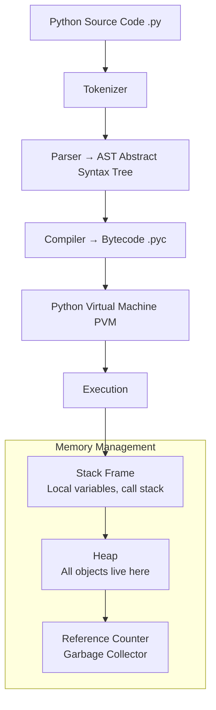

### Python's Object Model

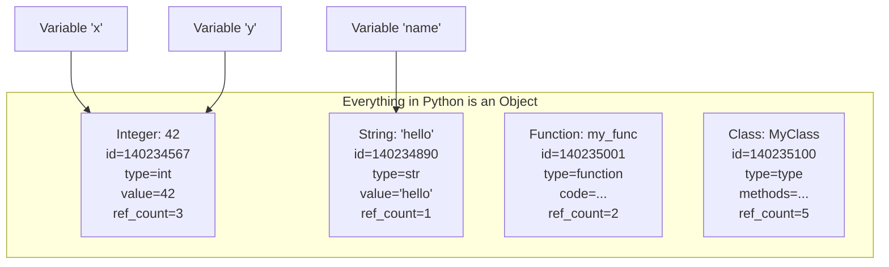

---

## 5. Internal Working

### Variables: Names Are References, Not Containers

This is the most important concept in Python that trips up engineers from Java/C++ backgrounds.

In Python, a variable is not a box that contains a value. It is a **label (name)** that points to an object in memory.

```python
# Example 1: Understanding references
x = [1, 2, 3]
y = x          # y doesn't copy the list — it points to the SAME list

y.append(4)
print(x)       # [1, 2, 3, 4] — both x and y point to the same object!

# Example 2: Why this matters for AI (e.g., accumulating results)
results = []

def process_batch(batch, accumulator=results):  # DANGER: default arg is created once!
    accumulator.extend(batch)
    return accumulator

# Both calls share the same list object
process_batch([1, 2])   # results = [1, 2]
process_batch([3, 4])   # results = [1, 2, 3, 4]

# Correct pattern: use None as default
def process_batch_safe(batch, accumulator=None):
    if accumulator is None:
        accumulator = []
    accumulator.extend(batch)
    return accumulator
```

### The `is` vs `==` Distinction

```python
# == checks VALUE equality
# is  checks IDENTITY (same object in memory)

a = [1, 2, 3]
b = [1, 2, 3]

print(a == b)  # True  — same values
print(a is b)  # False — different objects

# Small integers are cached (-5 to 256)
x = 100
y = 100
print(x is y)  # True — Python caches small ints (implementation detail!)

x = 1000
y = 1000
print(x is y)  # False — not cached

# IMPORTANT: Always use 'is' for None, True, False comparisons
if response is None:  # Correct
    pass
if response == None:  # Works but bad practice — custom __eq__ can lie
    pass
```

### Mutability: The Root of Many AI Pipeline Bugs

```python
# IMMUTABLE types: int, float, str, tuple, frozenset, bytes
# MUTABLE types: list, dict, set, bytearray, custom objects

# Why mutability matters for AI:

# Pattern 1: Accumulating tokens across LLM streaming
tokens = []                           # mutable — you CAN append
for chunk in stream_response():
    tokens.append(chunk)

# Pattern 2: DON'T do this with immutable strings (creates new object each time)
result = ""                           # immutable — creates new str each time
for chunk in stream_response():
    result += chunk                   # O(N²) time! Creates new string each iteration

# Correct: use a list and join at the end
parts = []
for chunk in stream_response():
    parts.append(chunk)
result = "".join(parts)               # O(N) — one pass
```

### Generators: Processing Large Data Lazily

For AI engineers, generators are essential when processing datasets that don't fit in memory.

```python
# List comprehension — loads ALL results into memory at once
all_embeddings = [embed(doc) for doc in million_documents]  # OOM on large datasets!

# Generator expression — computes ONE result at a time
embedding_gen = (embed(doc) for doc in million_documents)   # Memory-efficient!

# Generator function — same idea, more expressive
def embed_documents(documents):
    """Process documents one at a time — memory safe for any dataset size."""
    for doc in documents:
        yield embed(doc)  # yield instead of return

# Using the generator
for embedding in embed_documents(million_documents):
    store_in_vector_db(embedding)
    # At any point, only ONE embedding is in memory
```

### Closures: How Decorators Work Internally

```python
# A closure is a function that "remembers" the environment it was created in

def make_retry(max_attempts: int):
    """Creates a retry wrapper — this is a closure factory."""
    
    def decorator(func):
        """The actual decorator — closes over max_attempts."""
        
        def wrapper(*args, **kwargs):
            """The wrapped function — closes over func and max_attempts."""
            last_exception = None
            
            for attempt in range(max_attempts):
                try:
                    return func(*args, **kwargs)
                except Exception as e:
                    last_exception = e
                    print(f"Attempt {attempt + 1}/{max_attempts} failed: {e}")
            
            raise last_exception  # max_attempts exhausted
        
        return wrapper
    return decorator


# Using the closure-based decorator
@make_retry(max_attempts=3)
def call_llm_api(prompt: str) -> str:
    """This function will automatically retry up to 3 times on failure."""
    import openai
    response = openai.chat.completions.create(
        model="gpt-4o",
        messages=[{"role": "user", "content": prompt}]
    )
    return response.choices[0].message.content
```

---

## 6. Mathematical Intuition

### Computational Complexity in Python

Understanding time complexity is essential for writing production AI code that scales.

| Operation | List | Dict | Set | Sorted List (bisect) |
|---|---|---|---|---|
| Lookup by key | O(N) | O(1) avg | O(1) avg | O(log N) |
| Insert | O(1) amortized | O(1) avg | O(1) avg | O(log N) + O(N) |
| Delete | O(N) | O(1) avg | O(1) avg | O(N) |
| Contains check | O(N) | O(1) avg | O(1) avg | O(log N) |

**Why this matters for AI**:
- Deduplicating documents before embedding: `set` for O(N) instead of O(N²)
- Looking up token counts by document ID: `dict` for O(1) instead of O(N)
- Finding nearest embedding by distance: sorted list + bisect for O(log N)

---

## 7. Implementation

### Python Patterns Every AI Engineer Must Know

```python
"""
Core Python patterns for production AI systems.
Each pattern is chosen for a specific AI engineering use case.
"""

from typing import TypeVar, Callable, Generator, Iterator, Any
from functools import wraps, lru_cache
from contextlib import contextmanager
import time
import logging

logger = logging.getLogger(__name__)

T = TypeVar('T')

# ─── Pattern 1: Type Hints for LLM Applications ────────────────────────────

from typing import Optional, Union, List, Dict, Literal, TypedDict

class Message(TypedDict):
    role: Literal["system", "user", "assistant"]
    content: str

class LLMConfig(TypedDict, total=False):
    model: str
    temperature: float
    max_tokens: int
    top_p: float

def call_llm(
    messages: List[Message],
    config: Optional[LLMConfig] = None
) -> str:
    """Type hints make LLM wrapper APIs self-documenting and IDE-friendly."""
    ...


# ─── Pattern 2: Decorator for API Rate Limiting ────────────────────────────

import asyncio
from collections import deque

def rate_limited(calls_per_second: float):
    """
    Decorator factory that rate-limits a function.
    Essential for LLM API calls to avoid hitting provider limits.
    """
    min_interval = 1.0 / calls_per_second
    last_called = [0.0]  # mutable container to allow closure mutation
    
    def decorator(func: Callable) -> Callable:
        @wraps(func)  # Preserves function name, docstring, etc.
        def wrapper(*args, **kwargs):
            elapsed = time.monotonic() - last_called[0]
            wait = min_interval - elapsed
            if wait > 0:
                time.sleep(wait)
            result = func(*args, **kwargs)
            last_called[0] = time.monotonic()
            return result
        return wrapper
    return decorator


# ─── Pattern 3: Context Manager for Resource Management ────────────────────

@contextmanager
def timer(label: str = ""):
    """
    Context manager that times a block of code.
    Use this to profile LLM API calls, vector DB queries, etc.
    """
    start = time.perf_counter()
    try:
        yield
    finally:
        elapsed = time.perf_counter() - start
        logger.info(f"{label}: {elapsed:.3f}s")


# Usage
with timer("GPT-4 API call"):
    response = call_llm([{"role": "user", "content": "Hello"}])


# ─── Pattern 4: Generator Pipeline for Document Processing ─────────────────

from pathlib import Path

def read_documents(directory: Path) -> Generator[str, None, None]:
    """Lazily read all .txt files in a directory."""
    for path in directory.glob("**/*.txt"):
        with open(path, encoding="utf-8") as f:
            yield f.read()

def chunk_documents(
    documents: Iterator[str],
    chunk_size: int = 1000,
    overlap: int = 100
) -> Generator[str, None, None]:
    """Chunk documents with overlap — memory-efficient pipeline stage."""
    for doc in documents:
        words = doc.split()
        for i in range(0, len(words), chunk_size - overlap):
            chunk = " ".join(words[i:i + chunk_size])
            if chunk:
                yield chunk

def filter_chunks(
    chunks: Iterator[str],
    min_length: int = 50
) -> Generator[str, None, None]:
    """Filter out chunks that are too short."""
    for chunk in chunks:
        if len(chunk) >= min_length:
            yield chunk

# Build a complete lazy pipeline — no data in memory until consumed
def build_rag_pipeline(directory: Path) -> Generator[str, None, None]:
    docs = read_documents(directory)
    chunks = chunk_documents(docs, chunk_size=500, overlap=50)
    filtered = filter_chunks(chunks, min_length=100)
    return filtered

# This entire pipeline processes one chunk at a time, regardless of dataset size
for chunk in build_rag_pipeline(Path("./documents")):
    embed_and_store(chunk)


# ─── Pattern 5: LRU Cache for Expensive Computations ──────────────────────

@lru_cache(maxsize=1000)
def get_embedding(text: str) -> tuple:
    """
    Cache embeddings to avoid re-computing for repeated texts.
    
    IMPORTANT: 
    - lru_cache requires hashable arguments — use str, not list
    - Returns tuple (not list) because cached values should be immutable
    """
    result = expensive_embedding_api(text)
    return tuple(result)  # Convert to tuple for hashability and immutability


# ─── Pattern 6: dataclass for Configuration Objects ────────────────────────

from dataclasses import dataclass, field

@dataclass
class RAGConfig:
    """Configuration for a RAG pipeline — clean, type-safe, self-documenting."""
    
    # Required fields (no default)
    collection_name: str
    embedding_model: str
    
    # Optional fields with defaults
    top_k: int = 5
    similarity_threshold: float = 0.7
    chunk_size: int = 500
    chunk_overlap: int = 50
    rerank: bool = True
    
    # Field with default factory (mutable defaults need this!)
    metadata_filters: Dict[str, Any] = field(default_factory=dict)
    
    def __post_init__(self):
        """Validation after initialization."""
        if self.top_k < 1:
            raise ValueError(f"top_k must be >= 1, got {self.top_k}")
        if not 0.0 <= self.similarity_threshold <= 1.0:
            raise ValueError("similarity_threshold must be between 0 and 1")

# Usage
config = RAGConfig(
    collection_name="company_docs",
    embedding_model="text-embedding-3-small",
    top_k=10,
    rerank=True
)
```

---

## 8. Production Architecture

### Python Project Layout for AI Services

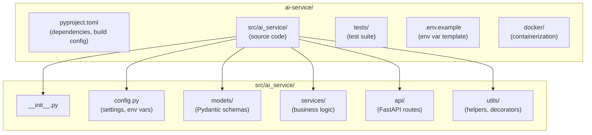

---

## 9. Tradeoffs

| Feature | When to Use | When to Avoid |
|---|---|---|
| Generators | Large datasets, streaming | When you need random access or length |
| `@lru_cache` | Pure functions, repeated inputs | Functions with side effects or mutable args |
| Dataclasses | Config objects, data containers | Complex validation (use Pydantic instead) |
| TypedDicts | JSON-like dicts with type hints | When you need methods (use dataclass/class) |
| `__slots__` | Millions of small objects | When you need dynamic attributes |

---

## 10. Common Mistakes

❌ **Mutable default arguments**: `def func(items=[])` — the list is created ONCE and shared across all calls. Use `def func(items=None)` and initialize inside.

❌ **String concatenation in loops**: `result += chunk` in a loop is O(N²). Use `"".join(parts)`.

❌ **Using `is` for value comparison**: `if x is 1000` — works for small integers but fails for large ones. Use `==` for values, `is` for identity/None.

❌ **Not using `@wraps` in decorators**: Without `@wraps(func)`, your decorated function loses its `__name__`, `__doc__`, and type annotations — breaking logging, documentation, and introspection.

❌ **Catching bare `Exception` or worse `BaseException`**: Catches `KeyboardInterrupt` and `SystemExit` — prevents clean shutdowns of your AI service.

❌ **Ignoring the GIL for CPU-bound ML tasks**: `threading` doesn't parallelize CPU-bound Python. Use `multiprocessing` or `concurrent.futures.ProcessPoolExecutor`.

---

## 11. Interview Preparation

**Junior**: "Python variables are references to objects, not containers. Generators compute values lazily, saving memory. Decorators wrap functions to add behavior."

**Mid-level**: "Python's everything-is-an-object model means even functions and classes are first-class objects. The GIL prevents true thread-based parallelism for CPU-bound tasks — I use multiprocessing for that. For AI workloads, generators are critical for processing large datasets without OOM errors. I use `@functools.wraps` in all decorators to preserve metadata."

**Senior**: "I understand Python's memory model: reference counting with cycle detection GC. I use `__slots__` for memory-critical objects like embedding vectors stored in millions. For AI pipelines, I design generator pipelines with clear stage boundaries, making them testable and composable. I leverage Python's data model (dunder methods) to create AI-specific abstractions — e.g., implementing `__call__` on LLM wrappers for consistent interfaces."

**Principal**: "Python's design philosophy — 'explicit is better than implicit' — guides how I structure AI systems. I enforce type safety through Pydantic (runtime) and mypy (static). For performance-critical paths, I understand CPython internals: where the GIL matters (IO-bound: threads fine; CPU-bound: multiprocessing or C extensions). I design Python APIs for AI components following the Protocol pattern rather than ABC — making them testable without requiring inheritance. I use `__init_subclass__` hooks for plugin registries in agent frameworks."

---

## 12. Follow-up Questions

**Q1: What is the GIL and why does it matter for AI engineering?**
> The GIL (Global Interpreter Lock) is a mutex in CPython that allows only one thread to execute Python bytecode at a time. For IO-bound tasks (LLM API calls, database queries), threads work fine because the GIL is released during IO. For CPU-bound tasks (tokenization, preprocessing, embedding), threads don't help — use `multiprocessing` or offload to NumPy/PyTorch (which release the GIL internally).

**Q2: What is duck typing and how does it apply to LLM frameworks?**
> Duck typing: if it walks like a duck and quacks like a duck, it's a duck. Python checks behavior, not type. LangChain uses this extensively — any object with a `.run()` method can be a tool; any object with an `.embed_query()` method can be an embedding model. This makes frameworks extensible without forced inheritance.

**Q3: Explain Python's memory management.**
> Python uses reference counting: every object tracks how many references point to it. When the count reaches 0, the object is deallocated. For cyclic references (A → B → A), reference counting alone fails — Python's generational garbage collector handles these. Large AI objects (model weights, embedding matrices) that should be freed must have no lingering references — be careful with module-level globals and long-lived caches.

**Q4: What is the difference between `__str__` and `__repr__`?**
> `__repr__` is for developers: unambiguous, ideally evaluable as Python code to recreate the object. `__str__` is for end users: readable. When only `__repr__` is defined, Python uses it for both. For AI objects (custom LLM wrappers, retriever configs), always implement `__repr__` with the key configuration fields — it makes debugging much easier.

**Q5: How do you handle circular imports in large AI Python projects?**
> Circular imports occur when Module A imports Module B which imports Module A. Solutions: (1) Restructure: move shared code to a third `utils.py`; (2) Import inside the function where needed (lazy import); (3) Use `TYPE_CHECKING` flag for type-annotation-only imports; (4) Dependency injection: pass objects rather than importing them. In AI frameworks, circular imports often indicate a design issue — services shouldn't depend on each other directly.

**Q6: What is the difference between `deepcopy` and `copy`?**
> `copy.copy()`: shallow copy — creates a new container but references the same nested objects. `copy.deepcopy()`: deep copy — recursively creates new copies of all nested objects. For AI: when copying a config dict that contains lists, `copy()` means mutations to nested lists affect the original; `deepcopy()` is fully independent. For performance-critical code, avoid deepcopy on large objects — use immutable types instead.

**Q7: What are Python Protocols and when should you use them over ABCs?**
> Protocols (PEP 544) enable structural subtyping — a class satisfies a Protocol if it has the required methods, without needing explicit inheritance. ABCs require explicit registration or inheritance. For AI frameworks: Protocol is better when you want third-party integrations (any class with `.embed()` works, even if it doesn't know your Protocol exists). ABCs are better when you want to enforce interface contracts with clear error messages at definition time.

---

## 13. Practical Scenario

### Scenario: Memory Leak in a Production RAG Pipeline

**Context**: A startup's RAG pipeline processes 50,000 document uploads per day. After 6 hours, the service's memory grows from 500MB to 12GB and crashes.

**Root Cause Discovery**:

```python
# The buggy code:
class EmbeddingCache:
    _cache = {}  # Class-level dict — lives forever!
    
    def get_or_compute(self, text: str):
        if text not in self._cache:
            self._cache[text] = expensive_embedding(text)  
            # Cache grows unboundedly — 50K docs × 6KB each = 300MB+
        return self._cache[text]

# The fix:
from functools import lru_cache
import weakref

class EmbeddingCache:
    def __init__(self, maxsize: int = 10_000):
        # Bounded LRU cache — evicts oldest entries automatically
        self._compute = lru_cache(maxsize=maxsize)(self._embed)
    
    def _embed(self, text: str):
        return expensive_embedding(text)
    
    def get_or_compute(self, text: str):
        return self._compute(text)
    
    def clear(self):
        self._compute.cache_clear()
```

**Lesson**: Class-level mutable objects (module-level dicts, class variables) that grow with request data always cause memory leaks. Use bounded caches (`lru_cache`) and instance-level (not class-level) state.

---

## 14. Revision Sheet

### Key Points
- Variables are references (labels), not containers — assignment binds a name to an object
- Everything is an object: integers, functions, classes, modules
- Mutable: list, dict, set | Immutable: int, str, tuple, frozenset
- Generators use `yield` and are lazy — compute on demand, constant memory
- Decorators are higher-order functions that wrap other functions
- `is` checks identity; `==` checks value — always use `is` for `None`
- GIL: threads for IO-bound, multiprocessing for CPU-bound

### Common Traps
```
Mutable default args → def f(x=[]): x.append(1)  # shared across calls
String += in loop    → O(N²) complexity, use "".join()
Bare except          → catches KeyboardInterrupt
Missing @wraps       → decorated function loses metadata
Class-level dict     → memory leak if grows with requests
```

---

## 15. Hands-on Exercises

**Easy**: Implement a `retry` decorator that catches exceptions and retries up to N times with exponential backoff.

**Medium**: Build a generator pipeline: `read_files()` → `parse_documents()` → `chunk_text()` → `filter_short_chunks()`. Measure memory usage vs. list-based approach.

**Hard**: Implement a bounded thread-safe LRU cache from scratch without using `functools.lru_cache`. Use `threading.RLock` for thread safety.

**Production**: Build a Python context manager that measures LLM API latency, token usage, and cost, and logs them as structured JSON to a monitoring system.

---

## 16. Mini Project: LLM API Wrapper with Retry, Caching, and Rate Limiting

```python
"""
Production LLM API Wrapper
Demonstrates: decorators, context managers, generators, type hints, dataclasses
"""

import asyncio
import time
import logging
import hashlib
from dataclasses import dataclass, field
from functools import wraps
from typing import Optional, List, AsyncGenerator
from contextlib import asynccontextmanager

from openai import AsyncOpenAI

logger = logging.getLogger(__name__)

@dataclass
class LLMCallStats:
    model: str
    prompt_tokens: int
    completion_tokens: int
    latency_seconds: float
    cached: bool = False
    
    @property
    def total_tokens(self) -> int:
        return self.prompt_tokens + self.completion_tokens
    
    @property
    def estimated_cost_usd(self) -> float:
        rates = {"gpt-4o": (0.005, 0.015), "gpt-4o-mini": (0.00015, 0.0006)}
        input_rate, output_rate = rates.get(self.model, (0.01, 0.03))
        return (self.prompt_tokens / 1000) * input_rate + \
               (self.completion_tokens / 1000) * output_rate


class ProductionLLMClient:
    """
    Production LLM client with:
    - Async support
    - Response caching (content-addressed)
    - Automatic retry with exponential backoff
    - Rate limiting
    - Statistics collection
    """
    
    def __init__(
        self,
        model: str = "gpt-4o",
        max_retries: int = 3,
        cache_size: int = 1000,
        requests_per_minute: int = 60
    ):
        self.client = AsyncOpenAI()
        self.model = model
        self.max_retries = max_retries
        self._cache: dict[str, str] = {}
        self._cache_keys: list[str] = []  # For LRU eviction
        self._cache_size = cache_size
        self._rpm_limit = requests_per_minute
        self._request_times: list[float] = []
        self.stats: list[LLMCallStats] = []
    
    def _cache_key(self, messages: List[dict], **kwargs) -> str:
        """Content-addressed cache key."""
        import json
        content = json.dumps({"messages": messages, **kwargs}, sort_keys=True)
        return hashlib.sha256(content.encode()).hexdigest()
    
    def _cache_put(self, key: str, value: str):
        if len(self._cache) >= self._cache_size and self._cache_keys:
            evict_key = self._cache_keys.pop(0)
            self._cache.pop(evict_key, None)
        self._cache[key] = value
        self._cache_keys.append(key)
    
    async def _wait_for_rate_limit(self):
        """Enforce requests per minute limit."""
        now = time.monotonic()
        minute_ago = now - 60.0
        # Remove requests older than 1 minute
        self._request_times = [t for t in self._request_times if t > minute_ago]
        
        if len(self._request_times) >= self._rpm_limit:
            wait_time = 60.0 - (now - self._request_times[0])
            if wait_time > 0:
                logger.info(f"Rate limit reached, waiting {wait_time:.1f}s")
                await asyncio.sleep(wait_time)
        
        self._request_times.append(time.monotonic())
    
    async def complete(
        self,
        messages: List[dict],
        temperature: float = 0.7,
        max_tokens: int = 1000,
        use_cache: bool = True
    ) -> str:
        """
        Make an LLM completion with caching, retry, and rate limiting.
        """
        # Check cache first
        if use_cache:
            key = self._cache_key(messages, temperature=temperature, max_tokens=max_tokens)
            if key in self._cache:
                logger.debug("Cache hit for LLM request")
                return self._cache[key]
        
        await self._wait_for_rate_limit()
        
        # Retry with exponential backoff
        last_exception = None
        for attempt in range(self.max_retries):
            try:
                start = time.perf_counter()
                
                response = await self.client.chat.completions.create(
                    model=self.model,
                    messages=messages,
                    temperature=temperature,
                    max_tokens=max_tokens
                )
                
                latency = time.perf_counter() - start
                content = response.choices[0].message.content
                
                # Record stats
                self.stats.append(LLMCallStats(
                    model=self.model,
                    prompt_tokens=response.usage.prompt_tokens,
                    completion_tokens=response.usage.completion_tokens,
                    latency_seconds=latency,
                    cached=False
                ))
                
                if use_cache:
                    self._cache_put(key, content)
                
                return content
                
            except Exception as e:
                last_exception = e
                wait = (2 ** attempt) * 0.5  # 0.5s, 1s, 2s
                logger.warning(f"LLM attempt {attempt + 1}/{self.max_retries} failed: {e}. Waiting {wait}s")
                await asyncio.sleep(wait)
        
        raise last_exception
    
    async def stream(
        self,
        messages: List[dict],
        temperature: float = 0.7
    ) -> AsyncGenerator[str, None]:
        """Stream tokens as they're generated."""
        async with self.client.chat.completions.stream(
            model=self.model,
            messages=messages,
            temperature=temperature
        ) as stream:
            async for chunk in stream:
                if chunk.choices[0].delta.content:
                    yield chunk.choices[0].delta.content
    
    def get_summary_stats(self) -> dict:
        if not self.stats:
            return {}
        return {
            "total_calls": len(self.stats),
            "total_tokens": sum(s.total_tokens for s in self.stats),
            "avg_latency_seconds": sum(s.latency_seconds for s in self.stats) / len(self.stats),
            "total_estimated_cost_usd": sum(s.estimated_cost_usd for s in self.stats),
            "cache_hit_rate": sum(1 for s in self.stats if s.cached) / len(self.stats)
        }


# Demo
async def main():
    client = ProductionLLMClient(model="gpt-4o-mini", max_retries=3)
    
    # Normal completion
    response = await client.complete(
        messages=[{"role": "user", "content": "What is Python?"}],
        temperature=0.7
    )
    print(response)
    
    # Streaming
    print("\nStreaming response:")
    async for token in client.stream(
        messages=[{"role": "user", "content": "Write a haiku about Python."}]
    ):
        print(token, end="", flush=True)
    
    print("\n\nStats:", client.get_summary_stats())

asyncio.run(main())
```

---

---

# Chapter 2: Object-Oriented Programming (OOP)

---

## 1. Introduction

### What Is OOP for AI Engineers?

Object-Oriented Programming is not about writing classes for everything. It is a way of **organizing complexity** — grouping related data and behavior together, hiding internal details, and building extensible systems.

For AI engineers specifically, OOP is how you:
- Build modular LLM pipelines where each component can be swapped
- Create reusable tool abstractions for agents
- Implement the Strategy pattern for different retrieval or ranking algorithms
- Extend third-party frameworks (LangChain, LlamaIndex) with custom components
- Manage state in conversational AI systems

### The Four Pillars (And Why They Matter for AI)

1. **Encapsulation**: Keep LLM client configuration hidden; expose clean APIs
2. **Inheritance**: Extend `BaseRetriever` to create a `HybridRetriever`
3. **Polymorphism**: Treat any retriever the same way, regardless of implementation
4. **Abstraction**: Define "what a retriever does" separately from "how it does it"

---

## 2. Historical Motivation

### Why OOP Won in Software Engineering

Before OOP, procedural programming organized code as sequences of functions operating on shared global state. As systems grew, this became unmaintainable — changing one function broke others that shared its data.

OOP solved this by bundling data (state) with the functions (methods) that operate on it. This created natural boundaries around complexity.

### OOP in Python vs. Java

Python's OOP is more flexible than Java's:
- No access modifiers (`public`, `private`) — convention uses `_` prefix for private
- No interfaces — Python uses Abstract Base Classes (ABCs) or Protocols
- Multiple inheritance is allowed (but use carefully)
- Everything is dynamic — you can add methods to classes at runtime

This flexibility is what makes Python great for AI frameworks, but it also requires more discipline.

---

## 3. Real-World Analogy

Think of OOP classes as **blueprints for machines** in a factory.

The blueprint (`class`) defines what the machine does and what settings it has. Each actual machine (`instance`) is built from that blueprint and has its own state (current temperature, speed, output count) but shares the same operations.

In a modern AI system:
- `LLMClient` is the blueprint for a machine that talks to LLMs
- `VectorStore` is the blueprint for a machine that stores and retrieves embeddings
- `RAGPipeline` is the blueprint for an assembly line that combines both machines

The factory manager (your application code) doesn't care which specific brand of LLM or vector store — it just sends jobs to machines that follow the blueprint. This is **polymorphism**.

---

## 4. Visual Mental Model

### Class Hierarchy for an AI System

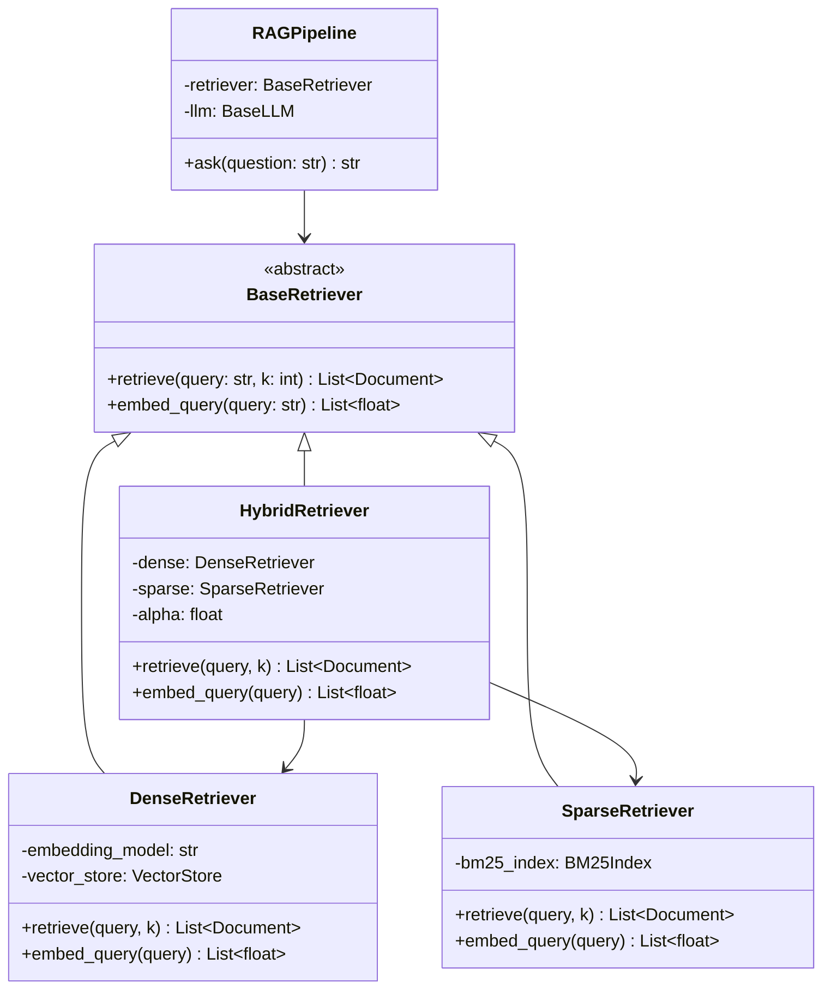

### Python's Method Resolution Order (MRO)

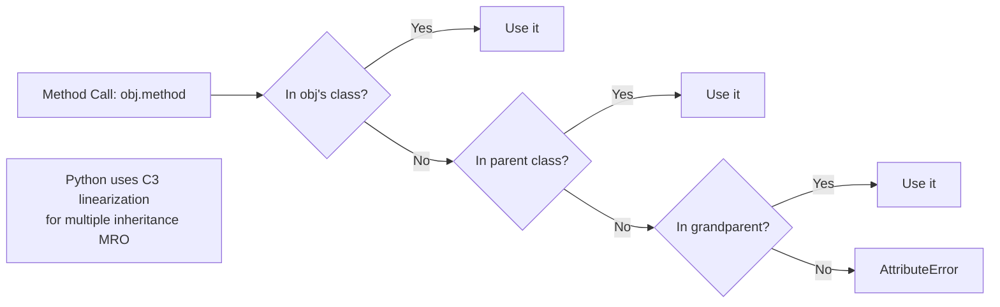

---

## 5. Internal Working

### The Python Data Model: Dunder Methods

Python's OOP power comes from "dunder" (double-underscore) methods that integrate with the language:

```python
class EmbeddingVector:
    """
    A custom embedding vector class that integrates with Python's operators.
    Demonstrates Python's data model.
    """
    
    def __init__(self, values: list[float]):
        self._values = list(values)
    
    def __repr__(self) -> str:
        """For developers: unambiguous representation."""
        return f"EmbeddingVector(dim={len(self._values)}, norm={self.norm:.4f})"
    
    def __str__(self) -> str:
        """For users: readable representation."""
        return f"[{', '.join(f'{v:.3f}' for v in self._values[:3])}...]"
    
    def __len__(self) -> int:
        """len(vector) returns the dimension."""
        return len(self._values)
    
    def __getitem__(self, index):
        """vector[i] returns the i-th dimension."""
        return self._values[index]
    
    def __iter__(self):
        """for v in vector: ... iterates over dimensions."""
        return iter(self._values)
    
    def __add__(self, other: 'EmbeddingVector') -> 'EmbeddingVector':
        """vector1 + vector2 adds element-wise."""
        if len(self) != len(other):
            raise ValueError(f"Dimension mismatch: {len(self)} vs {len(other)}")
        return EmbeddingVector([a + b for a, b in zip(self, other)])
    
    def __matmul__(self, other: 'EmbeddingVector') -> float:
        """vector1 @ vector2 computes dot product."""
        return sum(a * b for a, b in zip(self, other))
    
    def __eq__(self, other) -> bool:
        """vector1 == vector2 checks value equality."""
        if not isinstance(other, EmbeddingVector):
            return NotImplemented
        return self._values == other._values
    
    def __hash__(self) -> int:
        """Makes EmbeddingVector usable as dict key or in sets."""
        return hash(tuple(self._values))
    
    @property
    def norm(self) -> float:
        """Euclidean norm (magnitude) of the vector."""
        return sum(v ** 2 for v in self._values) ** 0.5
    
    def cosine_similarity(self, other: 'EmbeddingVector') -> float:
        """Cosine similarity between two embeddings."""
        dot = self @ other
        return dot / (self.norm * other.norm + 1e-10)
    
    def normalize(self) -> 'EmbeddingVector':
        """Return a unit vector."""
        n = self.norm
        return EmbeddingVector([v / n for v in self._values])
```

### Abstract Base Classes for AI Components

```python
from abc import ABC, abstractmethod
from typing import List, Optional
from dataclasses import dataclass

@dataclass
class Document:
    content: str
    metadata: dict
    score: float = 0.0

class BaseRetriever(ABC):
    """
    Abstract base class for all retriever implementations.
    
    Any class implementing this interface can be used anywhere
    a retriever is expected — this is polymorphism in action.
    """
    
    @abstractmethod
    def retrieve(self, query: str, k: int = 5) -> List[Document]:
        """Retrieve top-k documents relevant to the query."""
        ...
    
    @abstractmethod
    def add_documents(self, documents: List[Document]) -> None:
        """Add documents to the retriever's index."""
        ...
    
    def retrieve_with_threshold(
        self,
        query: str,
        k: int = 5,
        min_score: float = 0.5
    ) -> List[Document]:
        """
        Non-abstract method with default implementation.
        Subclasses get this for free.
        """
        results = self.retrieve(query, k=k * 2)  # Retrieve extra, then filter
        return [doc for doc in results if doc.score >= min_score][:k]
    
    def __call__(self, query: str, **kwargs) -> List[Document]:
        """Makes the retriever callable like a function."""
        return self.retrieve(query, **kwargs)


class DenseRetriever(BaseRetriever):
    """
    Vector similarity-based retrieval.
    Finds semantically similar documents even with different wording.
    """
    
    def __init__(self, embedding_model: str, vector_store):
        self.embedding_model = embedding_model
        self.vector_store = vector_store
        self._doc_count = 0
    
    def retrieve(self, query: str, k: int = 5) -> List[Document]:
        query_embedding = self._embed(query)
        return self.vector_store.similarity_search(query_embedding, k=k)
    
    def add_documents(self, documents: List[Document]) -> None:
        for doc in documents:
            embedding = self._embed(doc.content)
            self.vector_store.add(embedding, doc)
        self._doc_count += len(documents)
    
    def _embed(self, text: str) -> List[float]:
        """Private method — implementation detail, not part of the interface."""
        ...  # Call embedding API
    
    def __repr__(self) -> str:
        return f"DenseRetriever(model={self.embedding_model!r}, docs={self._doc_count})"


class HybridRetriever(BaseRetriever):
    """
    Combines dense (semantic) and sparse (keyword) retrieval.
    Uses Reciprocal Rank Fusion (RRF) to merge results.
    """
    
    def __init__(
        self,
        dense: BaseRetriever,  # Takes any retriever, not just DenseRetriever
        sparse: BaseRetriever,
        alpha: float = 0.5     # Weight: 0=all sparse, 1=all dense
    ):
        self.dense = dense
        self.sparse = sparse
        self.alpha = alpha
    
    def retrieve(self, query: str, k: int = 5) -> List[Document]:
        dense_results = self.dense.retrieve(query, k=k * 2)
        sparse_results = self.sparse.retrieve(query, k=k * 2)
        return self._reciprocal_rank_fusion(dense_results, sparse_results, k)
    
    def add_documents(self, documents: List[Document]) -> None:
        self.dense.add_documents(documents)
        self.sparse.add_documents(documents)
    
    def _reciprocal_rank_fusion(
        self,
        dense_docs: List[Document],
        sparse_docs: List[Document],
        k: int,
        rrf_k: int = 60
    ) -> List[Document]:
        """Merge two ranked lists using Reciprocal Rank Fusion."""
        scores: dict[str, float] = {}
        
        for rank, doc in enumerate(dense_docs):
            doc_id = doc.content[:100]  # Use content prefix as ID
            scores[doc_id] = scores.get(doc_id, 0) + self.alpha / (rrf_k + rank + 1)
        
        for rank, doc in enumerate(sparse_docs):
            doc_id = doc.content[:100]
            scores[doc_id] = scores.get(doc_id, 0) + (1 - self.alpha) / (rrf_k + rank + 1)
        
        # Sort by combined score
        all_docs = {doc.content[:100]: doc for doc in dense_docs + sparse_docs}
        sorted_ids = sorted(scores.keys(), key=lambda x: scores[x], reverse=True)
        
        return [all_docs[doc_id] for doc_id in sorted_ids[:k]]
```

### Design Patterns for AI Systems

```python
# ─── Pattern 1: Singleton (for expensive global resources) ─────────────────

class EmbeddingModelSingleton:
    """
    Ensures only one embedding model is loaded in memory.
    Loading a model (e.g., sentence-transformers) can take 2–10 seconds
    and use hundreds of MB — you don't want to do it per-request.
    """
    
    _instance: Optional['EmbeddingModelSingleton'] = None
    _model = None
    
    def __new__(cls):
        if cls._instance is None:
            cls._instance = super().__new__(cls)
        return cls._instance
    
    def __init__(self):
        if self._model is None:
            # Only loads on first instantiation
            from sentence_transformers import SentenceTransformer
            self._model = SentenceTransformer("all-MiniLM-L6-v2")
    
    def encode(self, texts: list[str]) -> list[list[float]]:
        return self._model.encode(texts).tolist()


# ─── Pattern 2: Strategy (swap algorithms at runtime) ──────────────────────

from abc import ABC, abstractmethod

class ChunkingStrategy(ABC):
    @abstractmethod
    def chunk(self, text: str) -> List[str]:
        ...

class FixedSizeChunker(ChunkingStrategy):
    def __init__(self, chunk_size: int = 500, overlap: int = 50):
        self.chunk_size = chunk_size
        self.overlap = overlap
    
    def chunk(self, text: str) -> List[str]:
        words = text.split()
        return [
            " ".join(words[i:i + self.chunk_size])
            for i in range(0, len(words), self.chunk_size - self.overlap)
        ]

class SemanticChunker(ChunkingStrategy):
    def chunk(self, text: str) -> List[str]:
        # Split on paragraph boundaries, semantic shifts
        import re
        paragraphs = re.split(r'\n{2,}', text)
        return [p.strip() for p in paragraphs if p.strip()]

class DocumentProcessor:
    def __init__(self, chunking_strategy: ChunkingStrategy):
        self.chunker = chunking_strategy  # Strategy injected at construction
    
    def process(self, text: str) -> List[str]:
        return self.chunker.chunk(text)
    
    def change_strategy(self, new_strategy: ChunkingStrategy):
        """Swap strategy at runtime."""
        self.chunker = new_strategy

# Usage
processor = DocumentProcessor(FixedSizeChunker(chunk_size=500))
chunks = processor.process(long_document)

# Switch to semantic chunking without changing the pipeline
processor.change_strategy(SemanticChunker())
chunks = processor.process(long_document)


# ─── Pattern 3: Observer (for monitoring and callbacks) ────────────────────

from typing import Callable

class LLMEventEmitter:
    """
    Observer pattern for LLM events.
    Allows monitoring, logging, and callbacks without coupling.
    """
    
    def __init__(self):
        self._handlers: dict[str, list[Callable]] = {}
    
    def on(self, event: str, handler: Callable):
        """Register a handler for an event."""
        self._handlers.setdefault(event, []).append(handler)
        return self  # Enable chaining: emitter.on("start", h1).on("end", h2)
    
    def emit(self, event: str, **data):
        """Fire all handlers for an event."""
        for handler in self._handlers.get(event, []):
            handler(**data)

# Usage
emitter = LLMEventEmitter()
emitter.on("llm_start", lambda prompt, **_: logger.info(f"LLM called with {len(prompt)} chars"))
emitter.on("llm_end", lambda response, latency, **_: logger.info(f"LLM responded in {latency:.2f}s"))
emitter.on("llm_error", lambda error, **_: logger.error(f"LLM failed: {error}"))
```

---

## 6. Production Architecture

### Dependency Injection for Testable AI Systems

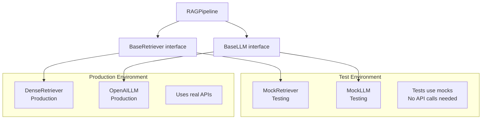

---

## 7. Tradeoffs

| OOP Concept | When to Use | When to Avoid |
|---|---|---|
| Inheritance | "Is-a" relationships, code reuse | Deep hierarchies (>3 levels), "has-a" relationships |
| Composition | "Has-a" relationships, flexibility | When you need all parent methods |
| Abstract classes | Enforce interface contracts | When Protocol (structural typing) is sufficient |
| Singleton | Global resources (DB conn, model) | When testability matters (hard to mock) |
| Dataclass | Plain data containers | Complex validation (use Pydantic) |

---

## 8. Common Mistakes

❌ **Using inheritance where composition fits**: If `HybridRetriever` inherits from both `DenseRetriever` and `SparseRetriever`, you inherit all their internals. Better: compose them as separate objects.

❌ **God classes**: One class that does everything (loads documents, embeds them, stores them, retrieves them, generates answers). Split into focused classes with single responsibilities.

❌ **Not implementing `__repr__`**: When debugging a production issue, `print(my_retriever)` shows `<DenseRetriever object at 0x7f123>` — useless. Always implement `__repr__`.

❌ **Mutating arguments in `__init__`**: `self._config = config` doesn't copy `config` — if the caller mutates their `config` dict later, your object is affected. Use `self._config = dict(config)` or Pydantic.

❌ **Overusing `@classmethod` and `@staticmethod`**: These should be rare. If a method doesn't use `self`, it might belong in a separate utility module.

---

## 9. Interview Preparation

**Junior**: "OOP organizes code into classes that bundle data and methods. The four pillars are encapsulation, inheritance, polymorphism, and abstraction. I use classes for LLM clients and retrievers."

**Mid-level**: "I apply OOP through composition over inheritance — a `HybridRetriever` contains a `DenseRetriever` and a `SparseRetriever` rather than inheriting from them. I use ABCs to define interfaces for retrievers, LLMs, and rerankers so implementations are swappable. Python's data model (dunder methods) lets me create domain-specific objects that feel native to the language."

**Senior**: "I use the Strategy pattern for swappable algorithms (chunking, ranking, embedding), Observer for monitoring hooks, and dependency injection for testability. Python's Protocol-based structural typing means I don't need explicit inheritance — any class with the right methods satisfies the interface. I implement `__repr__` on all domain objects, use properties for computed values, and slots for memory-critical objects."

**Principal**: "The most important OOP principle for AI systems is the Dependency Inversion Principle: high-level modules (RAGPipeline) should depend on abstractions (BaseRetriever), not implementations (DenseRetriever). This enables: swapping retrieval strategies without changing pipeline code, mocking in tests, A/B testing different implementations, and gradual migrations. I treat the class hierarchy as the most critical design decision — it should model the domain concepts, not the implementation details. For AI frameworks, I use the Component pattern: each pipeline stage is a composable unit with a standard interface."

---

## 10. Follow-up Questions

**Q1: Explain the difference between `@classmethod` and `@staticmethod`.**
> `@classmethod` receives the class as the first argument (`cls`). Used for factory methods that create instances: `LLMClient.from_env()`. `@staticmethod` receives no implicit argument — it's just a function in the class namespace, used for utilities that logically belong to the class: `TokenCounter.estimate_cost(tokens, model)`.

**Q2: What is Python's MRO and why does it matter?**
> MRO (Method Resolution Order) determines which class's method is called in multiple inheritance. Python uses C3 linearization: it builds a consistent ordering so each class appears before its parents. `ClassName.__mro__` shows the order. Matters when multiple parent classes define the same method — MRO determines which one is called.

**Q3: What is the difference between `__new__` and `__init__`?**
> `__new__` creates the instance (allocates memory). `__init__` initializes it (sets attributes). `__new__` is called first; it returns the new instance which is then passed to `__init__`. You rarely override `__new__` except for Singleton patterns, immutable types (like `int` subclasses), or metaclass-based object factories.

**Q4: How do properties work in Python?**
> `@property` defines a getter. `@property_name.setter` defines a setter. They let you implement attributes with computed values or validation logic while keeping the call syntax clean (`obj.temperature = 1.5` instead of `obj.set_temperature(1.5)`). For LLM configs, use properties to validate values on assignment.

**Q5: What is `__slots__` and when is it useful?**
> `__slots__ = ['x', 'y']` prevents the creation of a per-instance `__dict__`. This saves ~50 bytes per instance and speeds up attribute access. For AI systems that create millions of small objects (token records, chunk objects), `__slots__` can reduce memory usage by 40–60%.

---

## 11. Mini Project: Modular RAG Pipeline with Swappable Components

```python
"""
Modular RAG Pipeline demonstrating OOP best practices.
Components are composable, testable, and swappable.
"""

from abc import ABC, abstractmethod
from dataclasses import dataclass, field
from typing import List, Optional, Protocol, runtime_checkable
import asyncio

# ─── Domain Objects ────────────────────────────────────────────────────────

@dataclass
class Document:
    content: str
    source: str
    metadata: dict = field(default_factory=dict)
    score: float = 0.0
    
    def __repr__(self):
        return f"Document(source={self.source!r}, score={self.score:.3f}, len={len(self.content)})"

# ─── Interfaces (Protocols for structural typing) ──────────────────────────

@runtime_checkable
class Retriever(Protocol):
    def retrieve(self, query: str, k: int) -> List[Document]: ...

@runtime_checkable
class Reranker(Protocol):
    def rerank(self, query: str, docs: List[Document]) -> List[Document]: ...

@runtime_checkable  
class Generator(Protocol):
    async def generate(self, query: str, context: List[Document]) -> str: ...

# ─── Implementations ───────────────────────────────────────────────────────

class InMemoryRetriever:
    """Simple in-memory retriever for testing and small datasets."""
    
    def __init__(self):
        self._documents: List[Document] = []
    
    def add(self, documents: List[Document]):
        self._documents.extend(documents)
    
    def retrieve(self, query: str, k: int = 5) -> List[Document]:
        # Simple keyword overlap scoring (not semantic — use for demo/testing)
        query_words = set(query.lower().split())
        scored = []
        for doc in self._documents:
            doc_words = set(doc.content.lower().split())
            overlap = len(query_words & doc_words) / (len(query_words) + 1)
            scored.append(Document(**{**doc.__dict__, 'score': overlap}))
        scored.sort(key=lambda d: d.score, reverse=True)
        return scored[:k]
    
    def __repr__(self):
        return f"InMemoryRetriever(documents={len(self._documents)})"


class ScoreThresholdReranker:
    """Filters documents below a score threshold."""
    
    def __init__(self, threshold: float = 0.1):
        self.threshold = threshold
    
    def rerank(self, query: str, docs: List[Document]) -> List[Document]:
        return [d for d in docs if d.score >= self.threshold]


class OpenAIGenerator:
    """LLM-based answer generator."""
    
    def __init__(self, model: str = "gpt-4o", temperature: float = 0.1):
        from openai import AsyncOpenAI
        self.client = AsyncOpenAI()
        self.model = model
        self.temperature = temperature
    
    async def generate(self, query: str, context: List[Document]) -> str:
        context_text = "\n\n".join(
            f"[Source: {doc.source}]\n{doc.content}"
            for doc in context
        )
        
        response = await self.client.chat.completions.create(
            model=self.model,
            temperature=self.temperature,
            messages=[
                {
                    "role": "system",
                    "content": "Answer the question based solely on the provided context. Cite sources."
                },
                {
                    "role": "user",
                    "content": f"Context:\n{context_text}\n\nQuestion: {query}"
                }
            ]
        )
        return response.choices[0].message.content

# ─── Pipeline ──────────────────────────────────────────────────────────────

class RAGPipeline:
    """
    Composable RAG pipeline.
    Components are injected — easily swappable for testing or experimentation.
    """
    
    def __init__(
        self,
        retriever: Retriever,
        generator: Generator,
        reranker: Optional[Reranker] = None,
        top_k: int = 5
    ):
        # Runtime interface checks
        assert isinstance(retriever, Retriever), "retriever must implement Retriever Protocol"
        assert isinstance(generator, Generator), "generator must implement Generator Protocol"
        
        self.retriever = retriever
        self.generator = generator
        self.reranker = reranker
        self.top_k = top_k
    
    async def ask(self, question: str) -> dict:
        # Stage 1: Retrieve
        documents = self.retriever.retrieve(question, k=self.top_k)
        
        # Stage 2: Rerank (optional)
        if self.reranker:
            documents = self.reranker.rerank(question, documents)
        
        if not documents:
            return {
                "answer": "I couldn't find relevant information to answer this question.",
                "sources": [],
                "retrieved_count": 0
            }
        
        # Stage 3: Generate
        answer = await self.generator.generate(question, documents)
        
        return {
            "answer": answer,
            "sources": [doc.source for doc in documents],
            "retrieved_count": len(documents)
        }


# Demo
async def demo():
    # Build components
    retriever = InMemoryRetriever()
    retriever.add([
        Document("Python was created by Guido van Rossum in 1991.", "wiki/python"),
        Document("Python is widely used in machine learning and AI.", "wiki/python"),
        Document("Java was created by James Gosling at Sun Microsystems.", "wiki/java"),
    ])
    
    reranker = ScoreThresholdReranker(threshold=0.05)
    generator = OpenAIGenerator(model="gpt-4o-mini")
    
    pipeline = RAGPipeline(retriever, generator, reranker, top_k=3)
    
    result = await pipeline.ask("Who created Python and when?")
    print(f"Answer: {result['answer']}")
    print(f"Sources: {result['sources']}")

asyncio.run(demo())
```

---

---

# Chapter 3: Data Structures for AI Engineers

---

## 1. Introduction

### Why Data Structures Matter Specifically for AI Engineers

AI engineering is data engineering. Every step in an AI pipeline involves choosing the right data structure:

- **Storing 10 million document embeddings**: Array vs. hash map vs. specialized vector index
- **Looking up token counts**: Dict (O(1)) vs. list search (O(N))
- **Priority queue for beam search**: Heap (O(log N) push/pop)
- **Graph of document relationships**: Adjacency list vs. matrix
- **Deduplication of documents before indexing**: Set (O(1) lookup)
- **Sliding window over conversation history**: Deque (O(1) append/popleft)

Choosing the wrong data structure in an AI pipeline can turn a 10-minute task into a 10-hour task as data scales.

---

## 2. Real-World Analogy

Data structures are like **filing systems in a library**:

- **List/Array**: Books on a shelf in order — fast to access by position, slow to find a specific book
- **Dictionary/HashMap**: Card catalog indexed by title — fast to find by name
- **Set**: A book club's "already read" list — great for checking membership
- **Heap/Priority Queue**: A to-do list sorted by urgency — always gives you the most urgent item next
- **Graph**: A map of roads between cities — shows relationships and paths

---

## 3. Visual Mental Model

### Data Structure Decision Tree for AI

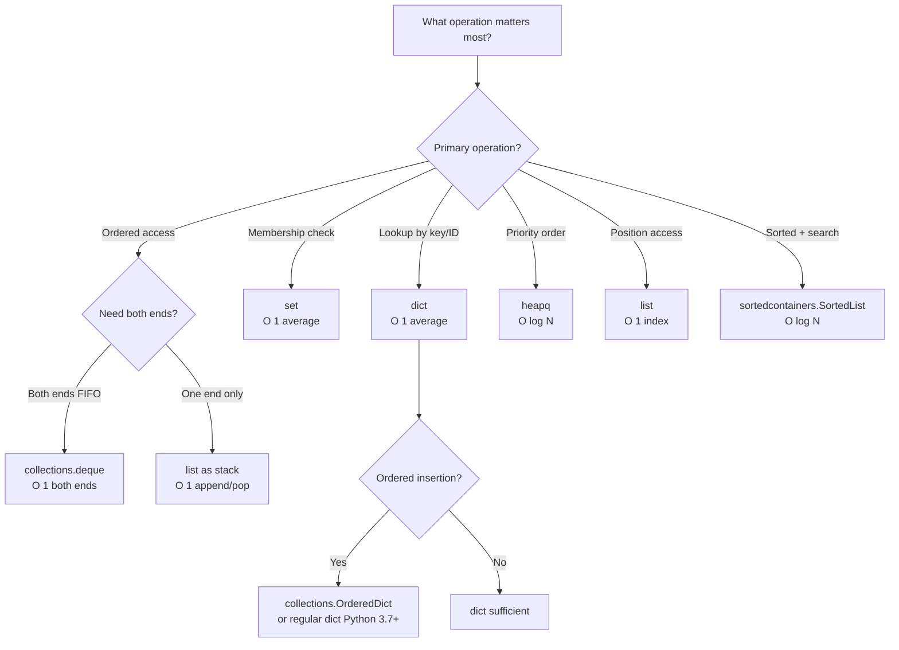

### Memory Layout Comparison

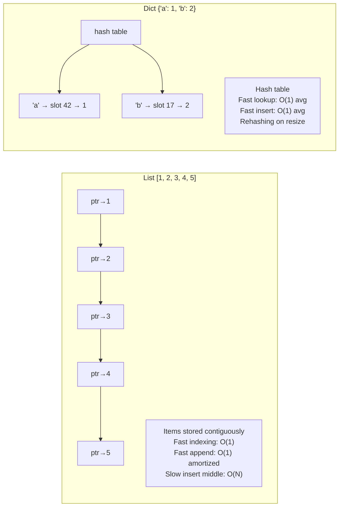

---

## 4. Internal Working

### Lists: Dynamic Arrays Under the Hood

```python
# Python lists are dynamic arrays — they over-allocate to avoid constant resizing
import sys

lst = []
prev_size = sys.getsizeof(lst)

for i in range(20):
    lst.append(i)
    new_size = sys.getsizeof(lst)
    if new_size != prev_size:
        print(f"Resized at length {len(lst)}: {prev_size} → {new_size} bytes")
        prev_size = new_size

# Output shows resizing at 0, 1, 5, 9, 14, 19...
# Python allocates extra space (1.125x growth factor) to amortize cost
```

### Dictionaries: Hash Tables

```python
# Python 3.7+ dicts maintain insertion order
# Python 3.6+ dicts use a compact representation (40% memory savings)

# Key insight: dict lookup is O(1) average but O(N) worst case (hash collisions)
# In practice, Python's hash function makes collisions rare for strings/ints

# Performance demonstration
import time

N = 1_000_000
data_list = list(range(N))
data_dict = {i: True for i in range(N)}
data_set = set(range(N))

target = N - 1  # Last element (worst case for list)

# List search: O(N)
start = time.perf_counter()
_ = target in data_list
print(f"List lookup: {(time.perf_counter() - start)*1000:.3f}ms")  # ~20ms

# Dict lookup: O(1)
start = time.perf_counter()
_ = target in data_dict
print(f"Dict lookup: {(time.perf_counter() - start)*1000:.6f}ms")  # ~0.001ms

# Set lookup: O(1)
start = time.perf_counter()
_ = target in data_set
print(f"Set lookup: {(time.perf_counter() - start)*1000:.6f}ms")   # ~0.001ms
```

### Deque: The Sliding Window Champion

```python
from collections import deque
from typing import List

class ConversationWindow:
    """
    Sliding window over conversation history using deque.
    Maintains last N messages in O(1) per operation.
    
    Critical for RAG pipelines and chatbots that need
    recent context without storing entire history.
    """
    
    def __init__(self, max_messages: int = 10):
        self._window: deque = deque(maxlen=max_messages)  # Auto-evicts oldest
    
    def add(self, message: dict):
        self._window.append(message)  # O(1)
        # If at capacity, oldest message is automatically discarded
    
    def get_recent(self, n: int = 5) -> List[dict]:
        """Get the n most recent messages."""
        return list(self._window)[-n:]  # O(N) where N is window size
    
    def __len__(self):
        return len(self._window)
    
    def __repr__(self):
        return f"ConversationWindow(messages={len(self)}, max={self._window.maxlen})"


# vs. naive list approach (DON'T DO THIS):
class NaiveConversationWindow:
    def __init__(self, max_messages: int = 10):
        self._messages = []
        self._max = max_messages
    
    def add(self, message: dict):
        self._messages.append(message)
        if len(self._messages) > self._max:
            self._messages.pop(0)  # O(N) — shifts all elements! Bad at scale.
```

### Heapq: Priority Queue for AI Tasks

```python
import heapq
from dataclasses import dataclass, field
from typing import Any

@dataclass(order=True)
class PrioritizedTask:
    priority: float
    task_id: str = field(compare=False)
    data: Any = field(compare=False)

class EmbeddingTaskQueue:
    """
    Priority queue for document embedding tasks.
    High-priority documents (e.g., new uploads) are embedded first.
    Implements a min-heap (lowest number = highest priority).
    """
    
    def __init__(self):
        self._heap: list = []
        self._counter = 0  # Tiebreaker for equal priorities
    
    def push(self, document: str, priority: float = 0.0):
        """Add document to queue. Lower priority = processed sooner."""
        task = PrioritizedTask(
            priority=priority,
            task_id=f"task_{self._counter}",
            data=document
        )
        heapq.heappush(self._heap, task)
        self._counter += 1
    
    def pop(self) -> PrioritizedTask:
        """Get highest-priority (lowest number) task."""
        return heapq.heappop(self._heap)
    
    def peek(self) -> PrioritizedTask:
        """Look at highest-priority task without removing."""
        return self._heap[0]
    
    def __len__(self):
        return len(self._heap)

# Usage
queue = EmbeddingTaskQueue()
queue.push("User's uploaded resume", priority=0.0)  # Urgent (just uploaded)
queue.push("Old archived document", priority=10.0)   # Less urgent

next_task = queue.pop()  # Gets the resume (priority 0.0 comes first)
```

---

## 5. Implementation

### Data Structures in a Production RAG Pipeline

```python
"""
Demonstrates optimal data structure choices for a RAG pipeline.
"""

from collections import defaultdict, deque, Counter
from typing import Dict, List, Set, Optional, Tuple
import heapq

class DocumentIndex:
    """
    Efficient document storage and retrieval for a RAG system.
    Uses multiple data structures, each chosen for specific operations.
    """
    
    def __init__(self):
        # dict: O(1) document lookup by ID
        self._docs: Dict[str, str] = {}
        
        # set: O(1) deduplication check
        self._doc_hashes: Set[str] = set()
        
        # defaultdict(list): group docs by category without KeyError
        self._by_category: Dict[str, List[str]] = defaultdict(list)
        
        # Counter: O(1) token frequency tracking
        self._token_counts: Counter = Counter()
        
        # deque: recent activity log with bounded memory
        self._recent_queries: deque = deque(maxlen=1000)
        
        # heapq: priority queue for re-indexing tasks
        self._reindex_queue: list = []
    
    def add_document(self, doc_id: str, content: str, category: str = "general") -> bool:
        """Add a document. Returns False if duplicate."""
        import hashlib
        content_hash = hashlib.md5(content.encode()).hexdigest()
        
        if content_hash in self._doc_hashes:
            return False  # Duplicate — skip
        
        self._docs[doc_id] = content                        # O(1) storage
        self._doc_hashes.add(content_hash)                  # O(1) dedup tracking
        self._by_category[category].append(doc_id)         # O(1) category grouping
        
        # Track token frequencies for TF-IDF style scoring
        tokens = content.lower().split()
        self._token_counts.update(tokens)                   # O(N) where N = tokens
        
        return True
    
    def get_document(self, doc_id: str) -> Optional[str]:
        """O(1) document retrieval."""
        return self._docs.get(doc_id)
    
    def get_by_category(self, category: str) -> List[str]:
        """O(1) category-based retrieval."""
        return self._by_category[category]
    
    def get_top_terms(self, n: int = 20) -> List[Tuple[str, int]]:
        """O(N log N) but N is vocabulary size — run infrequently."""
        return self._token_counts.most_common(n)
    
    def schedule_reindex(self, doc_id: str, priority: float):
        """Schedule document for re-indexing with priority."""
        heapq.heappush(self._reindex_queue, (priority, doc_id))  # O(log N)
    
    def next_reindex_task(self) -> Optional[str]:
        """Get highest-priority reindex task."""
        if self._reindex_queue:
            _, doc_id = heapq.heappop(self._reindex_queue)  # O(log N)
            return doc_id
        return None
    
    def log_query(self, query: str):
        """O(1) query logging with automatic old-entry eviction."""
        self._recent_queries.append(query)
    
    def get_recent_queries(self, n: int = 10) -> List[str]:
        """Get the N most recent queries."""
        return list(self._recent_queries)[-n:]
    
    @property
    def stats(self) -> dict:
        return {
            "total_documents": len(self._docs),
            "unique_hashes": len(self._doc_hashes),
            "categories": len(self._by_category),
            "vocabulary_size": len(self._token_counts),
            "pending_reindex": len(self._reindex_queue)
        }
```

---

## 6. Tradeoffs

| Data Structure | Lookup | Insert | Delete | Ordered | Memory |
|---|---|---|---|---|---|
| list | O(N) by value, O(1) by index | O(1) end, O(N) middle | O(N) | Yes | Low |
| dict | O(1) avg | O(1) avg | O(1) avg | Insertion order | Medium |
| set | O(1) avg | O(1) avg | O(1) avg | No | Medium |
| deque | O(N) | O(1) both ends | O(1) both ends | Yes | Low |
| heapq | O(1) min | O(log N) | O(log N) | Partial | Low |
| SortedList | O(log N) | O(log N) | O(log N) | Full | Medium |

---

## 7. Common Mistakes

❌ **Using a list for membership testing**: `if item in my_list` is O(N). If you need frequent membership tests, use a `set` or `dict`.

❌ **Using `list.pop(0)`**: This is O(N) because it shifts all elements. Use `deque.popleft()` which is O(1).

❌ **Using a dict for ordered top-k**: Dicts don't have inherent order by value. Use `heapq.nlargest()` or `Counter.most_common()`.

❌ **Assuming dict is thread-safe**: Dict operations are not atomic under the GIL in all cases. Use `threading.Lock` or `queue.Queue` for shared state between threads.

---

## 8. Interview Preparation

**Junior**: "I know when to use list (ordered, sequential), dict (key-value lookup), and set (unique membership). For conversation history I'd use a deque with maxlen."

**Mid-level**: "For AI pipelines: deque for sliding window over conversation history (O(1) both ends), Counter for token frequency (built-in most_common()), heapq for priority queues (beam search, reindex tasks), defaultdict to avoid KeyError when grouping documents. I always think about the primary operation — the right data structure makes O(N²) algorithms unnecessary."

**Senior**: "I profile data structure choices for AI workloads. For 10M embeddings: numpy arrays (contiguous memory, vectorized ops). For document ID → metadata: dict (O(1) lookup). For deduplication: set of content hashes. For BM25 inverted index: dict of term → sorted list of (doc_id, freq) pairs. Memory layout matters: Python objects have ~50 bytes overhead each; for millions of small objects, use numpy arrays or dataclasses with `__slots__`."

---

---

# Chapter 4: Algorithms for AI Engineers

---

## 1. Introduction

### Why Algorithms Matter for AI Engineers

AI engineers work with large-scale data. Algorithmic complexity separates systems that run in seconds from ones that run for hours.

The most critical algorithmic concepts for AI:
- **Sorting**: Ranking retrieved documents by relevance score
- **Binary search**: Finding the right chunk size or threshold
- **Sliding window**: Chunking documents with overlap
- **Two pointers**: Merging ranked lists (Reciprocal Rank Fusion)
- **Dynamic programming**: Optimal text chunking, edit distance
- **Graph traversal**: Knowledge graph navigation, dependency resolution
- **Hashing**: Deduplication, caching, approximate nearest neighbor

---

## 2. Implementation

### Core Algorithms in AI Context

```python
"""
Algorithms every AI engineer needs, demonstrated in AI contexts.
"""

import bisect
import heapq
from typing import List, Dict, Tuple, Optional

# ─── Algorithm 1: Binary Search for Threshold Finding ─────────────────────

def find_optimal_chunk_size(
    text: str,
    min_size: int = 100,
    max_size: int = 2000,
    target_chunks: int = 10
) -> int:
    """
    Use binary search to find chunk size that produces ~target_chunks chunks.
    O(log N) instead of O(N) linear scan.
    """
    def count_chunks(size: int) -> int:
        words = text.split()
        return max(1, len(words) // size)
    
    lo, hi = min_size, max_size
    
    while lo < hi:
        mid = (lo + hi) // 2
        chunks = count_chunks(mid)
        
        if chunks > target_chunks:
            lo = mid + 1   # Chunk too small — need bigger chunks
        else:
            hi = mid       # Chunk might be right or too big
    
    return lo


# ─── Algorithm 2: Sliding Window for Document Chunking ─────────────────────

def sliding_window_chunk(
    text: str,
    window_size: int = 500,
    step_size: int = 400,
) -> List[str]:
    """
    Chunk text with overlapping windows.
    Overlap ensures no context is cut at chunk boundaries.
    
    Time: O(N) | Space: O(N)
    """
    tokens = text.split()
    chunks = []
    
    for start in range(0, len(tokens), step_size):
        end = min(start + window_size, len(tokens))
        chunk = " ".join(tokens[start:end])
        
        if chunk:
            chunks.append(chunk)
        
        if end == len(tokens):
            break
    
    return chunks


# ─── Algorithm 3: Merge K Sorted Lists (for RAG result fusion) ─────────────

def merge_k_ranked_lists(
    lists: List[List[Tuple[float, str]]],  # [(score, doc_id), ...]
    k: int = 10
) -> List[Tuple[float, str]]:
    """
    Merge K sorted (by score) result lists into a single top-k list.
    Uses a min-heap for O(N log K) complexity.
    
    Used in: merging results from multiple vector DB shards,
    combining dense + sparse retrieval results.
    
    Time: O(N log K) | Space: O(K)
    """
    # Min-heap: (score, list_idx, item_idx, doc_id)
    # Negated score because Python heapq is min-heap but we want max scores
    heap = []
    
    for list_idx, sorted_list in enumerate(lists):
        if sorted_list:
            score, doc_id = sorted_list[0]
            heapq.heappush(heap, (-score, list_idx, 0, doc_id))
    
    result = []
    
    while heap and len(result) < k:
        neg_score, list_idx, item_idx, doc_id = heapq.heappop(heap)
        result.append((-neg_score, doc_id))
        
        # Push next item from the same list
        next_idx = item_idx + 1
        if next_idx < len(lists[list_idx]):
            next_score, next_doc = lists[list_idx][next_idx]
            heapq.heappush(heap, (-next_score, list_idx, next_idx, next_doc))
    
    return result


# ─── Algorithm 4: Reciprocal Rank Fusion ───────────────────────────────────

def reciprocal_rank_fusion(
    ranked_lists: List[List[str]],  # Each list is ranked doc_ids, best first
    k: int = 60
) -> List[Tuple[float, str]]:
    """
    Fuse multiple ranked lists using Reciprocal Rank Fusion.
    
    RRF score = Σ (1 / (k + rank_in_list_i))
    
    Used in hybrid search: combine dense + sparse retrieval rankings.
    Does NOT require score normalization — works with any ranking.
    
    Time: O(N × L) where N = docs per list, L = number of lists
    """
    scores: Dict[str, float] = {}
    
    for ranked_list in ranked_lists:
        for rank, doc_id in enumerate(ranked_list):
            scores[doc_id] = scores.get(doc_id, 0.0) + 1.0 / (k + rank + 1)
    
    # Sort by RRF score descending
    return sorted(scores.items(), key=lambda x: x[1], reverse=True)


# ─── Algorithm 5: Edit Distance (for fuzzy matching) ───────────────────────

def edit_distance(s1: str, s2: str) -> int:
    """
    Levenshtein edit distance between two strings.
    Used for: fuzzy matching of user queries to known entities,
    spell correction in RAG systems.
    
    Time: O(M × N) | Space: O(M × N) 
    (optimizable to O(min(M,N)) with rolling array)
    """
    m, n = len(s1), len(s2)
    
    # dp[i][j] = edit distance between s1[:i] and s2[:j]
    dp = [[0] * (n + 1) for _ in range(m + 1)]
    
    # Base cases: transforming to/from empty string
    for i in range(m + 1):
        dp[i][0] = i  # Delete all chars from s1
    for j in range(n + 1):
        dp[0][j] = j  # Insert all chars of s2
    
    for i in range(1, m + 1):
        for j in range(1, n + 1):
            if s1[i-1] == s2[j-1]:
                dp[i][j] = dp[i-1][j-1]  # No operation needed
            else:
                dp[i][j] = 1 + min(
                    dp[i-1][j],    # Delete from s1
                    dp[i][j-1],    # Insert into s1
                    dp[i-1][j-1]  # Substitute
                )
    
    return dp[m][n]


def fuzzy_match(
    query: str,
    candidates: List[str],
    max_distance: int = 3
) -> List[Tuple[int, str]]:
    """Find candidates within max_distance edits of query."""
    results = []
    for candidate in candidates:
        dist = edit_distance(query.lower(), candidate.lower())
        if dist <= max_distance:
            results.append((dist, candidate))
    return sorted(results, key=lambda x: x[0])  # Sort by closeness


# ─── Algorithm 6: Topological Sort (for agent DAG execution) ───────────────

def topological_sort(
    tasks: Dict[str, List[str]]  # task → list of dependencies
) -> List[str]:
    """
    Topological sort for determining agent task execution order.
    Ensures dependencies run before dependents.
    
    Used in: LangGraph, workflow orchestration, agent planning.
    
    Time: O(V + E) using Kahn's algorithm
    """
    from collections import deque
    
    # Count in-degrees (number of dependencies per task)
    in_degree: Dict[str, int] = {task: 0 for task in tasks}
    dependents: Dict[str, List[str]] = {task: [] for task in tasks}
    
    for task, deps in tasks.items():
        for dep in deps:
            if dep not in in_degree:
                in_degree[dep] = 0
                dependents[dep] = []
            dependents[dep].append(task)
            in_degree[task] += 1
    
    # Start with tasks that have no dependencies
    queue = deque([t for t, deg in in_degree.items() if deg == 0])
    result = []
    
    while queue:
        task = queue.popleft()
        result.append(task)
        
        for dependent in dependents[task]:
            in_degree[dependent] -= 1
            if in_degree[dependent] == 0:
                queue.append(dependent)
    
    if len(result) != len(in_degree):
        raise ValueError("Circular dependency detected!")
    
    return result


# Usage example
agent_tasks = {
    "retrieve_docs": [],                          # No deps
    "embed_query": [],                            # No deps
    "rank_results": ["retrieve_docs", "embed_query"],  # Needs both
    "generate_answer": ["rank_results"],          # Needs ranking
    "format_output": ["generate_answer"]          # Needs answer
}

execution_order = topological_sort(agent_tasks)
print(execution_order)
# → ['retrieve_docs', 'embed_query', 'rank_results', 'generate_answer', 'format_output']
```

---

## 3. Tradeoffs

| Algorithm | Time | Space | Best For |
|---|---|---|---|
| Linear search | O(N) | O(1) | Small lists, one-time operations |
| Binary search | O(log N) | O(1) | Sorted data, threshold finding |
| Hash lookup | O(1) avg | O(N) | Repeated key lookups |
| Heap sort top-k | O(N log K) | O(K) | Top-k from large lists |
| Merge K sorted | O(N log K) | O(K) | Multi-source result fusion |
| DP edit distance | O(M×N) | O(M×N) | String similarity, spell check |
| Topological sort | O(V+E) | O(V+E) | Task dependency ordering |

---

## 4. Interview Preparation

**Junior**: "I understand Big O notation. O(1) is constant time, O(N) is linear, O(N²) is quadratic. For lookups I use dicts, for sorted retrieval I use heaps."

**Mid-level**: "For AI specifically: sliding window for document chunking, RRF for hybrid search fusion, topological sort for agent DAGs, binary search for threshold finding. I profile before optimizing — often the bottleneck is I/O or API latency, not the algorithm."

**Senior**: "Algorithmic choices in AI systems compound — a O(N²) deduplication check that's fine for 1K documents fails catastrophically at 100K. I design for the scale the system will reach: for deduplication, hashing (O(N)), not pairwise comparison (O(N²)). For multi-source retrieval, I use the K-way merge heap pattern (O(N log K)) rather than concatenating and re-sorting (O(N log N))."

---

---

# Chapter 5: AsyncIO and Concurrency

---

## 1. Introduction

### What Is AsyncIO?

AsyncIO is Python's framework for writing **concurrent I/O-bound code** using a single thread. It allows your program to do other work while waiting for slow operations (LLM API calls, database queries, HTTP requests) to complete.

Without async: Call LLM API #1 → wait 2s → Call LLM API #2 → wait 2s → total: 4s
With async: Call LLM API #1 → while waiting, call LLM API #2 → wait for both → total: 2s

For AI engineers, AsyncIO is not optional — modern LLM applications make dozens of API calls per user request. Sequential execution is too slow.

### Why Not Threads?

Python's GIL prevents true parallel execution of Python code across threads. For CPU-bound tasks, threads don't help. For I/O-bound tasks (LLM APIs, vector DBs), threads do work, but they have high overhead (each thread takes ~1MB RAM) and are harder to reason about due to shared mutable state.

AsyncIO is cooperative multitasking: tasks explicitly yield control (via `await`) when waiting. This means:
- No GIL issues (single thread)
- Low overhead (thousands of coroutines cost less than dozens of threads)
- Explicit concurrency (you see exactly where context switches happen)

---

## 2. Historical Motivation

### Python's Concurrency Evolution

**Pre-2012**: Only threading and multiprocessing. Both have significant overhead for I/O-bound tasks.

**2012**: Python 3.4 added `asyncio` with generators-based coroutines.

**2015**: Python 3.5 introduced `async def` and `await` syntax — the modern API we use today.

**2019**: `asyncio.run()` made it easy to run async code from synchronous contexts.

The impetus: web servers need to handle thousands of concurrent connections. FastAPI, LangChain, and all modern LLM frameworks are built on AsyncIO.

---

## 3. Real-World Analogy

Async is like a **chef managing multiple dishes simultaneously**.

A synchronous chef: starts pasta water → stands and waits for boil → makes sauce → stands and waits for sauce → plates. Total: 25 minutes, most of it waiting.

An async chef: starts pasta water → while waiting, starts sauce → while both cook, preps salad → serves everything together. Total: 12 minutes.

The key insight: the chef didn't work faster — they eliminated idle waiting time by doing other things during waits. `asyncio` does the same for your code.

---

## 4. Visual Mental Model

### Sync vs. Async Execution

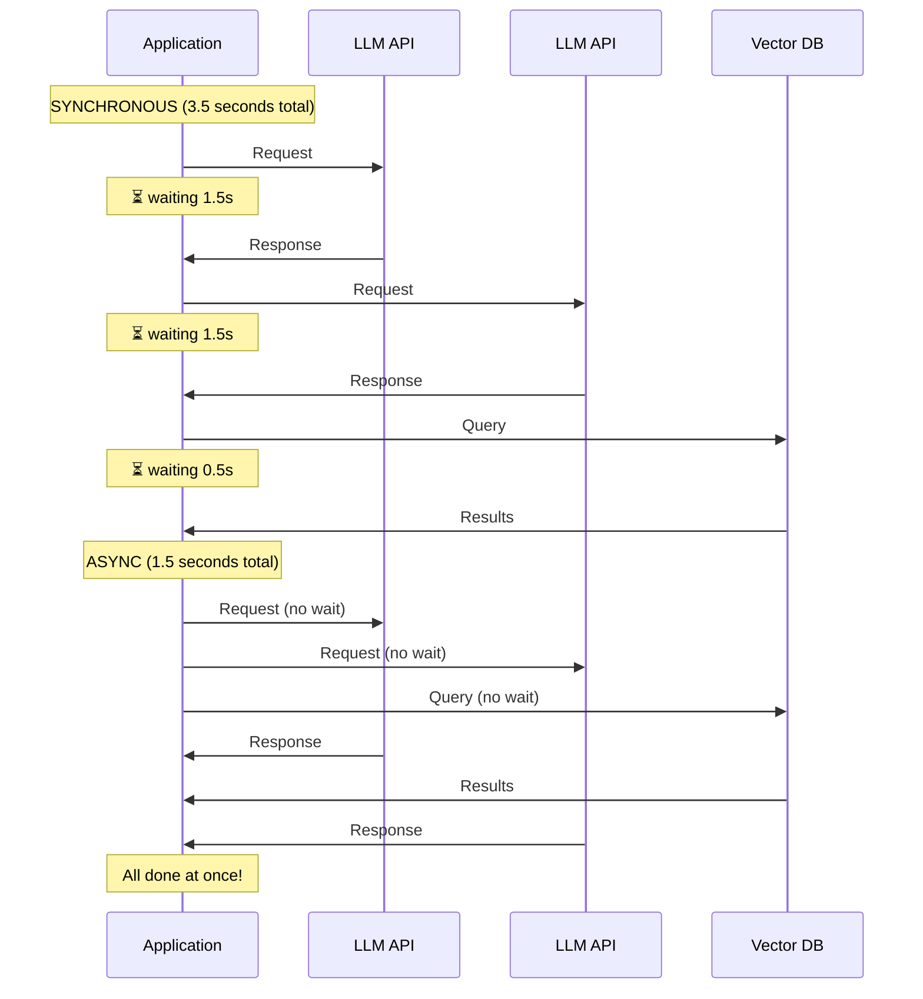

### The Event Loop

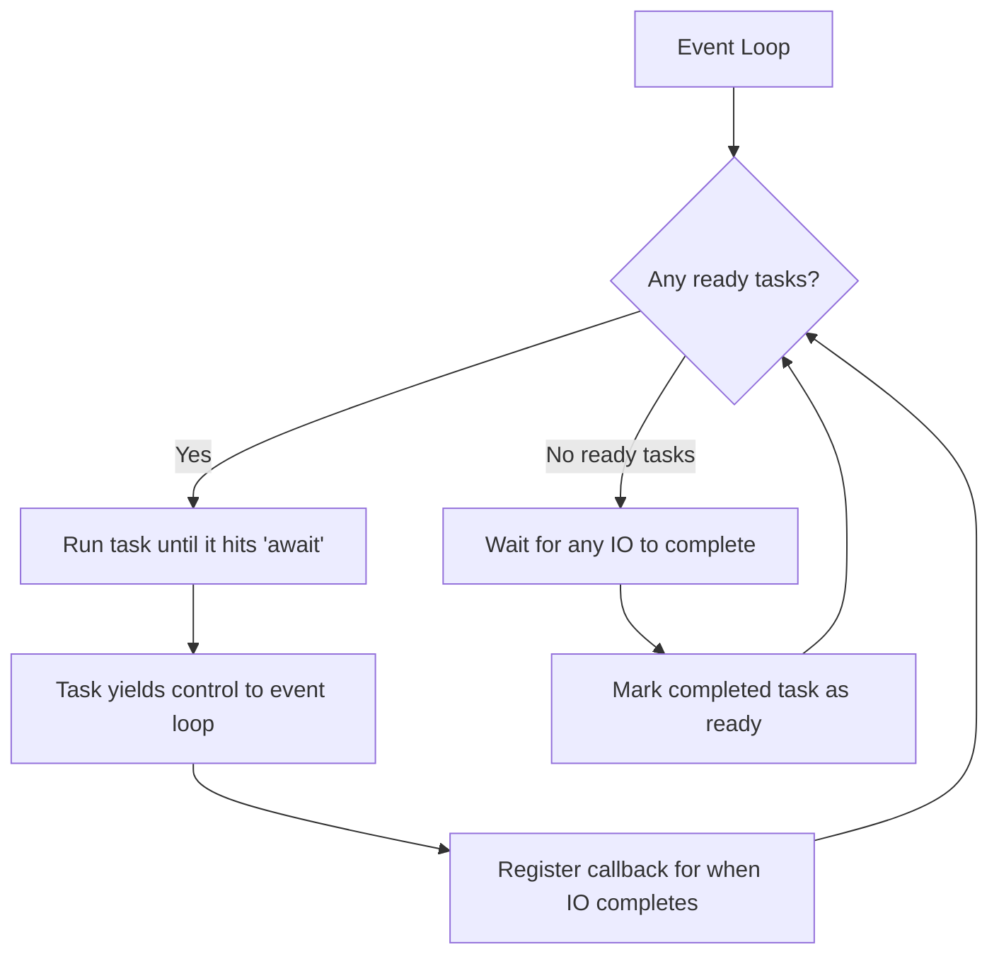

---

## 5. Internal Working

### Coroutines, Tasks, and Futures

```python
import asyncio
import time

# ─── Core Concepts ────────────────────────────────────────────────────────

# 1. COROUTINE: An async function. Not yet scheduled. Returns a coroutine object.
async def greet(name: str) -> str:
    await asyncio.sleep(1)  # Simulates waiting for API response
    return f"Hello, {name}!"

# Calling it doesn't execute it:
coro = greet("Alice")  # Just creates a coroutine object
print(coro)            # <coroutine object greet at 0x...>

# You must await it or schedule it:
result = await greet("Alice")  # Executes and waits for result

# 2. TASK: A scheduled coroutine. The event loop runs it concurrently.
task = asyncio.create_task(greet("Bob"))  # Scheduled immediately
result = await task  # Wait for it to complete

# 3. FUTURE: A placeholder for a result that doesn't exist yet.
# Tasks are a subclass of Future.


# ─── Key Patterns for LLM Applications ───────────────────────────────────

# Pattern 1: Parallel API calls with asyncio.gather
async def parallel_llm_calls():
    """Call multiple LLM endpoints simultaneously."""
    start = time.perf_counter()
    
    results = await asyncio.gather(
        call_llm_api("Summarize document 1"),
        call_llm_api("Summarize document 2"),
        call_llm_api("Summarize document 3"),
    )
    
    elapsed = time.perf_counter() - start
    print(f"3 parallel calls completed in {elapsed:.2f}s")
    return results


# Pattern 2: gather with error handling
async def parallel_with_error_handling():
    """Some calls may fail — handle errors without failing all."""
    results = await asyncio.gather(
        call_llm_api("Query 1"),
        call_llm_api("Query 2"),
        call_llm_api("This one might fail"),
        return_exceptions=True  # Don't raise, return exception as result
    )
    
    for i, result in enumerate(results):
        if isinstance(result, Exception):
            print(f"Call {i+1} failed: {result}")
        else:
            print(f"Call {i+1} succeeded: {result[:50]}...")


# Pattern 3: Timeout for reliability
async def call_with_timeout(query: str, timeout: float = 10.0) -> str:
    """Prevent hanging on slow LLM responses."""
    try:
        return await asyncio.wait_for(
            call_llm_api(query),
            timeout=timeout
        )
    except asyncio.TimeoutError:
        raise TimeoutError(f"LLM call timed out after {timeout}s")


# Pattern 4: Semaphore for rate limiting
async def rate_limited_embeddings(texts: list[str], max_concurrent: int = 10):
    """Limit concurrent API calls to avoid rate limit errors."""
    semaphore = asyncio.Semaphore(max_concurrent)
    
    async def embed_one(text: str):
        async with semaphore:  # Only max_concurrent will run at once
            return await call_embedding_api(text)
    
    return await asyncio.gather(*[embed_one(text) for text in texts])


# Pattern 5: Streaming with async generators
async def stream_llm_response(prompt: str):
    """Process LLM streaming responses token by token."""
    from openai import AsyncOpenAI
    client = AsyncOpenAI()
    
    async with client.chat.completions.stream(
        model="gpt-4o",
        messages=[{"role": "user", "content": prompt}]
    ) as stream:
        async for event in stream:
            if event.choices[0].delta.content:
                yield event.choices[0].delta.content  # async generator

# Consumer:
async def process_stream():
    buffer = []
    async for token in stream_llm_response("Tell me a story"):
        buffer.append(token)
        print(token, end="", flush=True)
    return "".join(buffer)
```

---

## 6. Implementation

### Production AsyncIO Patterns for LLM Systems

```python
"""
Production async patterns for LLM applications.
"""

import asyncio
import logging
from typing import List, AsyncIterator, TypeVar, Callable, Awaitable
from openai import AsyncOpenAI
import time

logger = logging.getLogger(__name__)
T = TypeVar('T')

client = AsyncOpenAI()

# ─── Retry with Exponential Backoff ────────────────────────────────────────

async def retry_async(
    func: Callable[..., Awaitable[T]],
    *args,
    max_retries: int = 3,
    base_delay: float = 1.0,
    max_delay: float = 30.0,
    exceptions: tuple = (Exception,),
    **kwargs
) -> T:
    """
    Generic async retry with exponential backoff and jitter.
    
    Jitter prevents thundering herd: when multiple clients all
    retry at the same time after a failure, they'd all hit the
    server simultaneously. Jitter spreads out the retries.
    """
    import random
    
    for attempt in range(max_retries + 1):
        try:
            return await func(*args, **kwargs)
        except exceptions as e:
            if attempt == max_retries:
                raise
            
            delay = min(base_delay * (2 ** attempt), max_delay)
            jitter = random.uniform(0, delay * 0.1)  # ±10% jitter
            wait = delay + jitter
            
            logger.warning(f"Attempt {attempt + 1}/{max_retries} failed: {e}. Retrying in {wait:.2f}s")
            await asyncio.sleep(wait)


# ─── Batch Processing with Concurrency Control ─────────────────────────────

async def process_in_batches(
    items: List[str],
    process_func: Callable[[str], Awaitable[T]],
    batch_size: int = 20,
    max_concurrent: int = 10
) -> List[T]:
    """
    Process items in batches with controlled concurrency.
    
    Use case: embedding 100K documents without hitting rate limits.
    batch_size: how many items per batch
    max_concurrent: how many coroutines run simultaneously
    """
    semaphore = asyncio.Semaphore(max_concurrent)
    results = [None] * len(items)
    
    async def process_with_index(index: int, item: str):
        async with semaphore:
            results[index] = await process_func(item)
    
    # Process all items concurrently (up to max_concurrent)
    tasks = [
        asyncio.create_task(process_with_index(i, item))
        for i, item in enumerate(items)
    ]
    
    await asyncio.gather(*tasks, return_exceptions=True)
    return results


# ─── Circuit Breaker Pattern ────────────────────────────────────────────────

from enum import Enum

class CircuitState(Enum):
    CLOSED = "closed"       # Normal operation
    OPEN = "open"           # Failing, rejecting requests
    HALF_OPEN = "half_open" # Testing if service recovered

class CircuitBreaker:
    """
    Circuit breaker for LLM API calls.
    
    Prevents cascading failures when the LLM API is down.
    After too many failures, 'opens' the circuit and returns
    errors immediately rather than hammering a failing service.
    """
    
    def __init__(
        self,
        failure_threshold: int = 5,
        recovery_timeout: float = 60.0,
        success_threshold: int = 2
    ):
        self.failure_threshold = failure_threshold
        self.recovery_timeout = recovery_timeout
        self.success_threshold = success_threshold
        
        self._state = CircuitState.CLOSED
        self._failure_count = 0
        self._success_count = 0
        self._last_failure_time: Optional[float] = None
    
    @property
    def state(self) -> CircuitState:
        if self._state == CircuitState.OPEN:
            # Check if recovery timeout has passed
            if time.monotonic() - self._last_failure_time > self.recovery_timeout:
                self._state = CircuitState.HALF_OPEN
                self._success_count = 0
        return self._state
    
    async def call(self, func: Callable[..., Awaitable[T]], *args, **kwargs) -> T:
        if self.state == CircuitState.OPEN:
            raise Exception("Circuit breaker is OPEN — service unavailable")
        
        try:
            result = await func(*args, **kwargs)
            self._on_success()
            return result
        except Exception as e:
            self._on_failure()
            raise
    
    def _on_success(self):
        self._failure_count = 0
        if self._state == CircuitState.HALF_OPEN:
            self._success_count += 1
            if self._success_count >= self.success_threshold:
                self._state = CircuitState.CLOSED
                logger.info("Circuit breaker CLOSED — service recovered")
    
    def _on_failure(self):
        self._failure_count += 1
        self._last_failure_time = time.monotonic()
        
        if self._failure_count >= self.failure_threshold:
            self._state = CircuitState.OPEN
            logger.warning(f"Circuit breaker OPEN after {self._failure_count} failures")


# ─── Complete Async LLM Pipeline ──────────────────────────────────────────

class AsyncLLMPipeline:
    """
    Production async pipeline for parallel LLM operations.
    """
    
    def __init__(self, model: str = "gpt-4o-mini"):
        self.model = model
        self.circuit_breaker = CircuitBreaker(failure_threshold=5)
    
    async def _call_llm(self, messages: list) -> str:
        response = await client.chat.completions.create(
            model=self.model,
            messages=messages,
            temperature=0.7
        )
        return response.choices[0].message.content
    
    async def call(self, messages: list) -> str:
        return await self.circuit_breaker.call(
            retry_async,
            self._call_llm,
            messages,
            max_retries=3
        )
    
    async def map(
        self,
        prompts: List[str],
        system: str = "",
        max_concurrent: int = 10
    ) -> List[str]:
        """Apply LLM to multiple prompts concurrently."""
        
        def make_messages(prompt: str) -> list:
            msgs = []
            if system:
                msgs.append({"role": "system", "content": system})
            msgs.append({"role": "user", "content": prompt})
            return msgs
        
        return await process_in_batches(
            items=prompts,
            process_func=lambda p: self.call(make_messages(p)),
            max_concurrent=max_concurrent
        )


# Demo
async def main():
    pipeline = AsyncLLMPipeline(model="gpt-4o-mini")
    
    documents = [
        "Document about machine learning...",
        "Document about neural networks...",
        "Document about transformers...",
    ]
    
    summaries = await pipeline.map(
        prompts=[f"Summarize in one sentence: {doc}" for doc in documents],
        system="You are a concise summarizer.",
        max_concurrent=5
    )
    
    for doc, summary in zip(documents, summaries):
        print(f"Summary: {summary}")

asyncio.run(main())
```

---

## 7. Tradeoffs

| Concurrency Model | CPU-Bound | IO-Bound | Memory | Complexity |
|---|---|---|---|---|
| `threading` | No (GIL) | Yes | ~1MB/thread | Medium |
| `multiprocessing` | Yes | Yes | High | High |
| `asyncio` | No | Yes (best for many IO tasks) | Very low | Medium |
| `concurrent.futures` | Both (via executor) | Yes | Medium | Low |

---

## 8. Common Mistakes

❌ **Blocking in async code**: `time.sleep(1)` inside an async function blocks the entire event loop. Use `await asyncio.sleep(1)` instead.

❌ **CPU-bound work in async**: Heavy computation (tokenization, data processing) inside `async def` blocks the event loop. Use `loop.run_in_executor()` to offload to a thread pool.

❌ **Forgetting `await`**: `response = call_llm_api(prompt)` returns a coroutine, not the result. You get no error, but `response` is unusable.

❌ **Creating tasks without keeping references**: `asyncio.create_task(my_coro())` — if you don't store the task, it may be garbage collected before completion.

❌ **Not handling `asyncio.CancelledError`**: When a task is cancelled (timeout, shutdown), it raises `CancelledError`. If your cleanup code catches `Exception`, it will swallow `CancelledError` and prevent clean shutdown.

---

## 9. Interview Preparation

**Junior**: "AsyncIO lets Python run multiple operations concurrently by using `async`/`await`. When a function hits an `await`, it gives control back to the event loop to run other code while waiting."

**Mid-level**: "For LLM applications, I use `asyncio.gather()` for parallel API calls, `asyncio.Semaphore` for rate limiting concurrent requests, and `asyncio.wait_for()` for timeouts. I understand the difference between coroutines (defined with `async def`, not scheduled), tasks (scheduled coroutines), and futures (results that aren't ready yet)."

**Senior**: "I design async systems with reliability patterns: circuit breaker for failing services, retry with exponential backoff + jitter for transient failures, and semaphore-controlled batch processing for throughput-limited APIs. For mixed CPU/IO workloads, I use `loop.run_in_executor()` with a ThreadPoolExecutor to offload CPU-bound preprocessing while keeping async IO."

**Principal**: "AsyncIO's event loop is single-threaded cooperative multitasking. Its strength is handling thousands of concurrent IO waits; its weakness is that any blocking call freezes all coroutines. In production LLM systems, I architect the async boundary carefully: FastAPI endpoints are async, LLM API calls are async, but vector store operations that use synchronous clients are offloaded to executors. I use `asyncio.TaskGroup` (Python 3.11+) for structured concurrency where the entire group fails if any task fails, which is safer than gather() for workflow orchestration."

---

---

# Chapter 6: FastAPI

---

## 1. Introduction

### What Is FastAPI?

FastAPI is a modern Python web framework for building APIs. It is:
- **Fast to develop**: Type hints → automatic validation, serialization, and documentation
- **Fast to run**: Built on Starlette (async ASGI framework) — performance comparable to Node.js
- **Production-ready**: Used by Microsoft, Uber, Netflix, and major AI companies

For AI engineers, FastAPI is the de facto framework for:
- Exposing LLM inference as a REST API
- Building RAG service endpoints
- Serving embedding models
- Creating webhook handlers for AI pipelines
- Building agent orchestration APIs

### Why FastAPI Over Flask or Django?

- **Flask**: Synchronous by default, no built-in validation, no automatic docs
- **Django**: Full-stack framework, too heavy for API services
- **FastAPI**: Async-first, Pydantic integration, automatic OpenAPI docs, type safety

---

## 2. Real-World Analogy

FastAPI is like a **smart restaurant ordering system**.

A waiter (your endpoint) takes orders (requests). They instantly validate the order — "We don't have that menu item" (validation error). They give you an automatic receipt (response schema). Multiple waiters handle orders simultaneously (async). The menu (API docs) is auto-generated from what the kitchen offers.

Flask is like a paper notepad — flexible but manual. FastAPI is like a POS terminal — structured, validated, and much faster.

---

## 3. Visual Mental Model

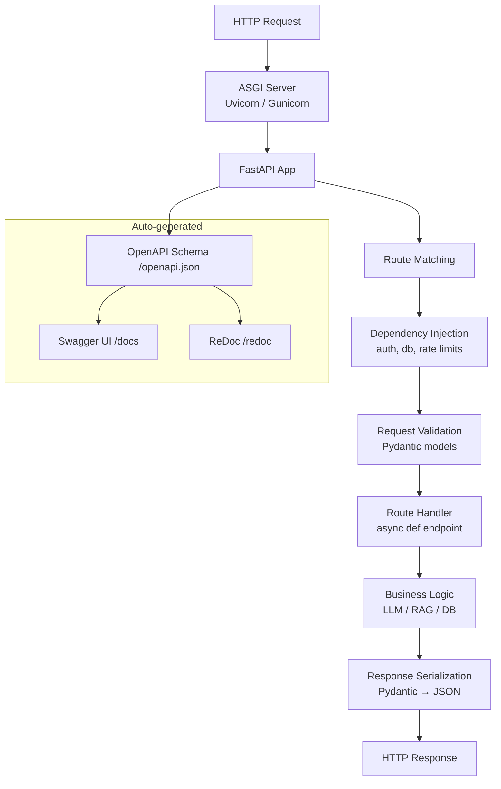

---

## 4. Implementation

### Production FastAPI Service for LLM Applications

```python
"""
Production FastAPI service for an LLM-powered question-answering system.
Demonstrates: routers, dependencies, middleware, error handling, streaming.
"""

from fastapi import FastAPI, HTTPException, Depends, BackgroundTasks, Request
from fastapi.middleware.cors import CORSMiddleware
from fastapi.middleware.trustedhost import TrustedHostMiddleware
from fastapi.responses import StreamingResponse, JSONResponse
from pydantic import BaseModel, Field, field_validator
from typing import Optional, AsyncGenerator, Annotated
from openai import AsyncOpenAI
import asyncio
import logging
import time
import uuid
from contextlib import asynccontextmanager

logger = logging.getLogger(__name__)
openai_client = AsyncOpenAI()

# ─── Application Lifespan ─────────────────────────────────────────────────

@asynccontextmanager
async def lifespan(app: FastAPI):
    """
    Startup and shutdown logic using lifespan context manager.
    Replaces deprecated on_event("startup") / on_event("shutdown").
    """
    # Startup: initialize connections, load models
    logger.info("Starting up AI service...")
    app.state.db_pool = await create_db_pool()
    app.state.embedding_model = await load_embedding_model()
    logger.info("AI service ready")
    
    yield  # Application runs here
    
    # Shutdown: clean up resources
    logger.info("Shutting down AI service...")
    await app.state.db_pool.close()
    logger.info("Shutdown complete")


# ─── App Creation ─────────────────────────────────────────────────────────

app = FastAPI(
    title="AI Question Answering Service",
    description="Production LLM-powered QA API with RAG capabilities",
    version="1.0.0",
    docs_url="/docs",
    redoc_url="/redoc",
    lifespan=lifespan
)

# ─── Middleware ────────────────────────────────────────────────────────────

app.add_middleware(
    CORSMiddleware,
    allow_origins=["https://app.company.com"],
    allow_credentials=True,
    allow_methods=["GET", "POST"],
    allow_headers=["*"]
)

@app.middleware("http")
async def add_request_id_and_timing(request: Request, call_next):
    """Add request ID for tracing and measure latency."""
    request_id = str(uuid.uuid4())
    request.state.request_id = request_id
    
    start = time.perf_counter()
    response = await call_next(request)
    duration = time.perf_counter() - start
    
    response.headers["X-Request-ID"] = request_id
    response.headers["X-Response-Time"] = f"{duration:.3f}s"
    
    logger.info(f"{request.method} {request.url.path} - {response.status_code} - {duration:.3f}s - {request_id}")
    return response


# ─── Request / Response Models ─────────────────────────────────────────────

class QuestionRequest(BaseModel):
    question: str = Field(
        ...,
        min_length=1,
        max_length=2000,
        description="The question to answer",
        examples=["What is the company's refund policy?"]
    )
    context_docs: Optional[list[str]] = Field(
        default=None,
        max_length=10,
        description="Optional pre-retrieved context documents"
    )
    model: str = Field(
        default="gpt-4o-mini",
        description="LLM model to use"
    )
    temperature: float = Field(
        default=0.7,
        ge=0.0,
        le=2.0,
        description="Sampling temperature"
    )
    stream: bool = Field(
        default=False,
        description="Whether to stream the response"
    )
    
    @field_validator("model")
    @classmethod
    def validate_model(cls, v: str) -> str:
        allowed = {"gpt-4o", "gpt-4o-mini", "gpt-3.5-turbo"}
        if v not in allowed:
            raise ValueError(f"Model must be one of {allowed}")
        return v


class QuestionResponse(BaseModel):
    answer: str
    model: str
    request_id: str
    usage: Optional[dict] = None
    sources: list[str] = []


# ─── Dependencies ──────────────────────────────────────────────────────────

async def get_api_key(request: Request) -> str:
    """Dependency: extract and validate API key."""
    api_key = request.headers.get("X-API-Key")
    if not api_key:
        raise HTTPException(status_code=401, detail="X-API-Key header required")
    if not is_valid_api_key(api_key):
        raise HTTPException(status_code=403, detail="Invalid API key")
    return api_key

async def get_rate_limiter(request: Request):
    """Dependency: rate limit check."""
    client_ip = request.client.host
    if await is_rate_limited(client_ip):
        raise HTTPException(
            status_code=429,
            detail="Rate limit exceeded. Please slow down.",
            headers={"Retry-After": "60"}
        )

# Type aliases for cleaner signatures
APIKey = Annotated[str, Depends(get_api_key)]
RateLimited = Annotated[None, Depends(get_rate_limiter)]


# ─── Routes ───────────────────────────────────────────────────────────────

@app.get("/health")
async def health_check():
    """Health check endpoint for load balancer probes."""
    return {"status": "healthy", "timestamp": time.time()}


@app.post(
    "/v1/answer",
    response_model=QuestionResponse,
    summary="Answer a question using RAG",
    response_description="The AI-generated answer with sources"
)
async def answer_question(
    request_data: QuestionRequest,
    background_tasks: BackgroundTasks,
    api_key: APIKey,
    _: RateLimited,
    http_request: Request
) -> QuestionResponse:
    """
    Answer a question using the LLM with optional RAG context.
    
    Supports both synchronous and streaming modes.
    """
    request_id = http_request.state.request_id
    
    # If streaming requested, use streaming endpoint
    if request_data.stream:
        raise HTTPException(
            status_code=400,
            detail="Use /v1/answer/stream for streaming responses"
        )
    
    # Build messages
    messages = []
    if request_data.context_docs:
        context = "\n\n".join(request_data.context_docs)
        messages.append({
            "role": "system",
            "content": f"Answer questions using only this context:\n\n{context}"
        })
    messages.append({"role": "user", "content": request_data.question})
    
    # Call LLM
    try:
        response = await openai_client.chat.completions.create(
            model=request_data.model,
            messages=messages,
            temperature=request_data.temperature,
            max_tokens=1000
        )
    except Exception as e:
        logger.error(f"LLM error for request {request_id}: {e}")
        raise HTTPException(status_code=502, detail=f"LLM service error: {str(e)}")
    
    answer = response.choices[0].message.content
    
    # Log usage asynchronously (non-blocking)
    background_tasks.add_task(
        log_usage,
        request_id=request_id,
        model=request_data.model,
        usage=response.usage.model_dump()
    )
    
    return QuestionResponse(
        answer=answer,
        model=request_data.model,
        request_id=request_id,
        usage=response.usage.model_dump(),
        sources=[]
    )


@app.post("/v1/answer/stream")
async def stream_answer(
    request_data: QuestionRequest,
    api_key: APIKey,
    _: RateLimited,
    http_request: Request
) -> StreamingResponse:
    """
    Stream an LLM response token by token using Server-Sent Events.
    """
    
    async def generate_tokens() -> AsyncGenerator[str, None]:
        messages = [{"role": "user", "content": request_data.question}]
        
        try:
            async with openai_client.chat.completions.stream(
                model=request_data.model,
                messages=messages,
                temperature=request_data.temperature
            ) as stream:
                async for event in stream:
                    if event.choices[0].delta.content:
                        token = event.choices[0].delta.content
                        # Server-Sent Events format
                        yield f"data: {token}\n\n"
            
            yield "data: [DONE]\n\n"
        
        except Exception as e:
            yield f"data: [ERROR] {str(e)}\n\n"
    
    return StreamingResponse(
        generate_tokens(),
        media_type="text/event-stream",
        headers={
            "Cache-Control": "no-cache",
            "X-Request-ID": http_request.state.request_id
        }
    )


# ─── Error Handlers ────────────────────────────────────────────────────────

@app.exception_handler(ValueError)
async def value_error_handler(request: Request, exc: ValueError):
    return JSONResponse(
        status_code=400,
        content={"error": "Invalid input", "detail": str(exc)}
    )

@app.exception_handler(Exception)
async def general_error_handler(request: Request, exc: Exception):
    logger.exception(f"Unhandled error for {request.url.path}: {exc}")
    return JSONResponse(
        status_code=500,
        content={"error": "Internal server error"}
    )


# ─── Router: Embeddings ────────────────────────────────────────────────────

from fastapi import APIRouter

embed_router = APIRouter(prefix="/v1/embeddings", tags=["Embeddings"])

class EmbedRequest(BaseModel):
    texts: list[str] = Field(..., max_length=100)
    model: str = "text-embedding-3-small"

class EmbedResponse(BaseModel):
    embeddings: list[list[float]]
    model: str
    token_count: int

@embed_router.post("", response_model=EmbedResponse)
async def create_embeddings(
    request_data: EmbedRequest,
    api_key: APIKey
) -> EmbedResponse:
    response = await openai_client.embeddings.create(
        input=request_data.texts,
        model=request_data.model
    )
    
    return EmbedResponse(
        embeddings=[item.embedding for item in sorted(response.data, key=lambda x: x.index)],
        model=request_data.model,
        token_count=response.usage.total_tokens
    )

app.include_router(embed_router)


# ─── Startup ───────────────────────────────────────────────────────────────

if __name__ == "__main__":
    import uvicorn
    uvicorn.run(
        "main:app",
        host="0.0.0.0",
        port=8000,
        reload=True,       # Only in development
        workers=1,         # Single worker for async; use multiple for sync
        log_level="info"
    )
```

---

## 5. Production Architecture

### FastAPI Deployment Architecture

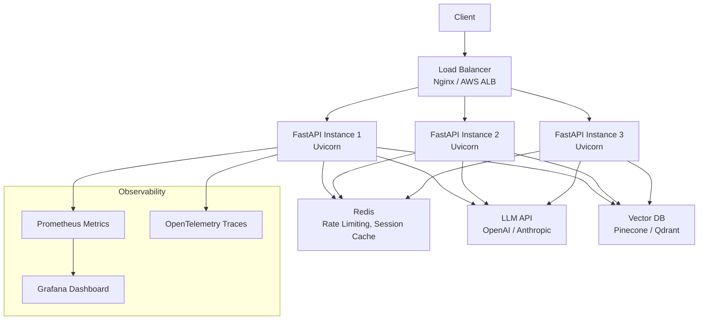

---

## 6. Common Mistakes

❌ **Using `def` instead of `async def`**: Synchronous route handlers block the event loop in FastAPI's async environment. Use `async def` for all routes.

❌ **Not using dependency injection**: Putting auth logic in every route handler creates duplication and makes testing hard. Use `Depends()`.

❌ **Not setting response models**: Without `response_model`, FastAPI can't validate your response or generate accurate docs.

❌ **Blocking calls in async routes**: `time.sleep()`, synchronous database calls, or `requests.get()` inside async routes blocks the event loop. Use async equivalents.

❌ **Running with `reload=True` in production**: Hot reload watches the filesystem and restarts on changes — a security and stability risk in production.

---

## 7. Interview Preparation

**Junior**: "FastAPI builds APIs using Python functions with type hints. Pydantic validates request/response data automatically. It generates OpenAPI docs at /docs."

**Mid-level**: "FastAPI uses dependency injection for cross-cutting concerns (auth, rate limiting, DB connections). Routes are async for concurrent request handling. I use BackgroundTasks for non-blocking post-processing and StreamingResponse for LLM token streaming."

**Senior**: "I structure FastAPI applications with routers (one per resource/domain), lifespan context managers for startup/shutdown, and middleware for observability (request IDs, timing). For LLM services specifically, I implement circuit breakers and timeouts as dependencies, use Server-Sent Events for streaming, and add Prometheus metrics middleware for monitoring token usage and latency."

---

---

# Chapter 7: Pydantic

---

## 1. Introduction

### What Is Pydantic?

Pydantic is a data validation library that uses Python type hints to define the shape and constraints of data. When you instantiate a Pydantic model, it automatically:
- Validates that all fields match their declared types
- Coerces compatible types (e.g., `"3"` → `3` for an int field)
- Raises informative errors for invalid data
- Serializes to/from JSON

For AI engineers, Pydantic is:
- The backbone of FastAPI's request/response validation
- The standard way to define structured LLM output schemas
- The tool for type-safe configuration of AI components
- The validator for tool call arguments in LLM agents

---

## 2. Real-World Analogy

Pydantic is like **a strict receptionist at an office**.

When you (data) arrive at the desk, the receptionist (Pydantic model):
1. Checks your ID (type validation)
2. Makes sure you have an appointment (required fields)
3. Corrects your name tag if it's in the wrong format (coercion)
4. Sends you away if you're missing required credentials (ValidationError)
5. Records your visit in the log system (serialization)

Without the receptionist (no Pydantic), anyone can walk in and claim to be anyone — and your system might trust them until something crashes hours later.

---

## 3. Implementation

### Pydantic for AI System Configuration and LLM Output

```python
"""
Pydantic v2 patterns for AI engineering.
"""

from pydantic import (
    BaseModel, Field, field_validator, model_validator,
    ConfigDict, computed_field
)
from pydantic import SecretStr, AnyHttpUrl, PositiveInt
from typing import Optional, Literal, Union, Any
from enum import Enum
import json

# ─── Configuration Models ─────────────────────────────────────────────────

class LLMProvider(str, Enum):
    OPENAI = "openai"
    ANTHROPIC = "anthropic"
    GOOGLE = "google"
    LOCAL = "local"

class LLMConfig(BaseModel):
    """
    Configuration for an LLM client.
    Validates all settings at startup — fail fast.
    """
    
    model_config = ConfigDict(
        str_strip_whitespace=True,  # Auto-strip whitespace from strings
        validate_assignment=True,   # Re-validate when attributes are set
        frozen=False,               # Allow mutation (use frozen=True for immutable configs)
        extra="forbid",             # Raise error if unknown fields are provided
    )
    
    provider: LLMProvider
    model: str = Field(..., min_length=1, description="Model identifier")
    api_key: SecretStr = Field(..., description="API key (never logged)")
    base_url: Optional[AnyHttpUrl] = Field(
        default=None,
        description="Custom API base URL for self-hosted models"
    )
    
    # Sampling parameters
    temperature: float = Field(default=0.7, ge=0.0, le=2.0)
    max_tokens: PositiveInt = Field(default=1000)
    top_p: float = Field(default=0.95, gt=0.0, le=1.0)
    
    # Rate limiting
    requests_per_minute: PositiveInt = Field(default=60)
    tokens_per_minute: PositiveInt = Field(default=90_000)
    
    @field_validator("model")
    @classmethod
    def validate_model_format(cls, v: str) -> str:
        if "/" not in v and "-" not in v:
            raise ValueError(f"Model '{v}' doesn't look like a valid model ID")
        return v.lower()
    
    @model_validator(mode="after")
    def validate_local_config(self) -> "LLMConfig":
        """Cross-field validation: local provider must have base_url."""
        if self.provider == LLMProvider.LOCAL and not self.base_url:
            raise ValueError("LOCAL provider requires base_url to be set")
        return self
    
    @computed_field
    @property
    def api_key_preview(self) -> str:
        """Safely show first 4 chars of API key for logging."""
        secret = self.api_key.get_secret_value()
        return secret[:4] + "..." if len(secret) > 4 else "****"
    
    def model_dump_safe(self) -> dict:
        """Dump config without exposing the API key."""
        data = self.model_dump(exclude={"api_key"})
        data["api_key_preview"] = self.api_key_preview
        return data


# ─── LLM Structured Output Schemas ────────────────────────────────────────

class StructuredQAResponse(BaseModel):
    """
    Schema for forcing structured LLM output.
    Use with OpenAI's response_format={"type": "json_schema"}.
    """
    answer: str = Field(..., description="The direct answer to the question")
    confidence: Literal["high", "medium", "low"] = Field(
        ...,
        description="Confidence level in the answer"
    )
    sources: list[str] = Field(
        default_factory=list,
        description="Document sources used to answer"
    )
    follow_up_questions: list[str] = Field(
        default_factory=list,
        max_length=3,
        description="Suggested follow-up questions"
    )
    requires_human_review: bool = Field(
        default=False,
        description="Whether this answer needs human verification"
    )


class ExtractedEntities(BaseModel):
    """Schema for LLM-based entity extraction."""
    
    class Entity(BaseModel):
        text: str
        type: Literal["PERSON", "ORG", "LOCATION", "DATE", "PRODUCT", "OTHER"]
        start_idx: int = Field(ge=0)
        confidence: float = Field(ge=0.0, le=1.0)
    
    entities: list[Entity]
    raw_text: str
    
    @computed_field
    @property
    def entity_count(self) -> int:
        return len(self.entities)
    
    def get_by_type(self, entity_type: str) -> list["ExtractedEntities.Entity"]:
        return [e for e in self.entities if e.type == entity_type]


# ─── Tool Call Schemas for LLM Agents ─────────────────────────────────────

class SearchToolInput(BaseModel):
    """Input schema for a web search tool."""
    query: str = Field(..., min_length=1, max_length=200)
    num_results: int = Field(default=5, ge=1, le=20)
    
class CodeExecutionInput(BaseModel):
    """Input schema for a code execution tool."""
    code: str = Field(..., description="Python code to execute")
    timeout_seconds: int = Field(default=30, ge=1, le=120)
    
class RAGQueryInput(BaseModel):
    """Input schema for a RAG retrieval tool."""
    query: str = Field(..., min_length=1)
    collection: str = Field(default="default")
    top_k: int = Field(default=5, ge=1, le=20)
    filters: dict[str, Any] = Field(default_factory=dict)


# Usage: Parse LLM JSON output into structured models
async def parse_llm_output(llm_response: str) -> StructuredQAResponse:
    """
    Parse and validate LLM JSON output.
    Raises ValidationError with clear messages if the LLM hallucinated wrong structure.
    """
    try:
        data = json.loads(llm_response)
        return StructuredQAResponse(**data)  # Validates structure
    except json.JSONDecodeError as e:
        raise ValueError(f"LLM returned invalid JSON: {e}")
    except Exception as e:  # Pydantic ValidationError
        raise ValueError(f"LLM output didn't match expected schema: {e}")


# ─── Settings with Environment Variables ───────────────────────────────────

from pydantic_settings import BaseSettings  # pip install pydantic-settings

class AppSettings(BaseSettings):
    """
    Application settings loaded from environment variables.
    Automatic type coercion: "3" → 3 for int fields.
    """
    
    model_config = ConfigDict(env_file=".env", env_file_encoding="utf-8")
    
    # LLM
    openai_api_key: SecretStr
    anthropic_api_key: Optional[SecretStr] = None
    default_model: str = "gpt-4o-mini"
    
    # Vector DB
    pinecone_api_key: Optional[SecretStr] = None
    pinecone_environment: str = "us-west1-gcp"
    
    # Service
    host: str = "0.0.0.0"
    port: int = Field(default=8000, ge=1, le=65535)
    debug: bool = False
    log_level: Literal["DEBUG", "INFO", "WARNING", "ERROR"] = "INFO"
    
    # Rate limits
    requests_per_minute: int = Field(default=60, gt=0)
    
    @computed_field
    @property
    def openai_api_key_value(self) -> str:
        return self.openai_api_key.get_secret_value()

# Load settings (automatically reads from .env file)
settings = AppSettings()
```

---

## 4. Tradeoffs

| Feature | Pydantic v2 | Pydantic v1 | dataclass | TypedDict |
|---|---|---|---|---|
| Validation | ✅ Runtime | ✅ Runtime | ❌ None | ❌ None |
| Performance | Very fast (Rust) | Fast | Fastest | Fastest |
| JSON serialization | ✅ Built-in | ✅ Built-in | Manual | Manual |
| Env var loading | ✅ pydantic-settings | ✅ | ❌ | ❌ |
| FastAPI integration | ✅ Native | ✅ Native | Partial | Partial |

---

## 5. Interview Preparation

**Junior**: "Pydantic validates data using type hints. I define a model with fields and their types, and Pydantic automatically validates and converts input data."

**Mid-level**: "I use Pydantic for request/response models in FastAPI, configuration management (settings from env vars with pydantic-settings), and structured LLM output parsing. `field_validator` for single-field rules, `model_validator` for cross-field rules. `SecretStr` for API keys so they never appear in logs."

**Senior**: "In production AI systems, Pydantic is the first line of defense against bad data. I define strict schemas for every LLM tool input, parse LLM JSON output through Pydantic models (catching hallucinated schemas early), and use `response_format=json_schema` with the Pydantic schema to force structured LLM output. `pydantic-settings` handles the 12-factor app config pattern with typed env var loading."

---

---

# Chapter 8: Testing

---

## 1. Introduction

### Why Testing Is Critical for AI Systems

AI systems introduce unique testing challenges:
- **Non-determinism**: LLM outputs vary across runs — you can't assert exact strings
- **External dependencies**: LLM APIs, vector databases, embedding services
- **Cost**: Running real LLM calls in tests is expensive
- **Latency**: Real API calls make test suites slow (minutes vs. seconds)
- **Hallucination detection**: Tests must verify factual accuracy, not just format

Despite these challenges, untested AI systems are dangerous in production. The solution is a layered testing strategy.

---

## 2. Real-World Analogy

Testing an AI system is like **quality control in a car factory**:

- **Unit tests**: Test each component (engine, brakes, steering) independently in a lab — no need to build the whole car
- **Integration tests**: Assemble components and test them together — does the engine work with the transmission?
- **Evaluation (LLM-specific)**: Test the whole car on a test track — does it handle corners correctly? This is qualitative, not just pass/fail

Each layer catches different kinds of problems.

---

## 3. Visual Mental Model

### Testing Pyramid for AI Systems

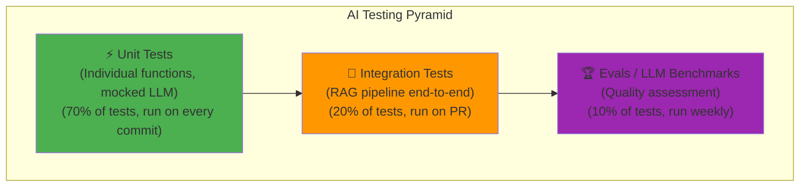

---

## 4. Implementation

### Complete Testing Suite for an AI System

```python
"""
Comprehensive testing patterns for AI/LLM systems.
File: tests/test_rag_pipeline.py
"""

import pytest
import pytest_asyncio
from unittest.mock import AsyncMock, MagicMock, patch
from typing import List
import json

# ─── Fixtures ──────────────────────────────────────────────────────────────

@pytest.fixture
def sample_documents():
    """Reusable test documents."""
    return [
        {"content": "Python was created by Guido van Rossum in 1991.", "source": "wiki/python"},
        {"content": "Python 3.0 was released in 2008 and broke backward compatibility.", "source": "wiki/python"},
        {"content": "Java was created by James Gosling at Sun Microsystems.", "source": "wiki/java"},
    ]

@pytest.fixture
def mock_openai_response():
    """Mock OpenAI API response — no real API calls."""
    response = MagicMock()
    response.choices = [MagicMock()]
    response.choices[0].message.content = "Python was created in 1991 by Guido van Rossum."
    response.usage.prompt_tokens = 100
    response.usage.completion_tokens = 25
    response.usage.total_tokens = 125
    return response

@pytest.fixture
def mock_embedding():
    """Deterministic mock embedding for testing."""
    return [0.1] * 1536  # Standard OpenAI embedding dimension

@pytest_asyncio.fixture
async def rag_pipeline(sample_documents):
    """Create a RAG pipeline with mocked external services."""
    from my_ai_service.pipeline import RAGPipeline
    from my_ai_service.retriever import InMemoryRetriever
    
    retriever = InMemoryRetriever()
    retriever.add_documents(sample_documents)
    
    pipeline = RAGPipeline(
        retriever=retriever,
        model="gpt-4o-mini",
        temperature=0.0
    )
    return pipeline


# ─── Unit Tests ────────────────────────────────────────────────────────────

class TestTokenCounter:
    """Unit tests for token counting utility."""
    
    def test_count_english_text(self):
        from my_ai_service.utils import count_tokens
        # "Hello, world!" is 4 tokens in cl100k_base
        assert count_tokens("Hello, world!") == 4
    
    def test_empty_string(self):
        from my_ai_service.utils import count_tokens
        assert count_tokens("") == 0
    
    def test_special_tokens_not_counted(self):
        from my_ai_service.utils import count_tokens
        # Verify we're not counting special tokens accidentally
        text = "Normal text without special tokens"
        count = count_tokens(text)
        assert count > 0
        assert count < len(text.split()) * 2  # Sanity bound


class TestDocumentChunker:
    """Unit tests for document chunking logic."""
    
    def test_basic_chunking(self):
        from my_ai_service.chunker import sliding_window_chunk
        text = " ".join([f"word{i}" for i in range(100)])
        chunks = sliding_window_chunk(text, window_size=20, step_size=10)
        
        assert len(chunks) > 0
        assert all(len(chunk.split()) <= 20 for chunk in chunks)
    
    def test_overlap_exists(self):
        """Verify overlap between consecutive chunks."""
        from my_ai_service.chunker import sliding_window_chunk
        text = "a b c d e f g h i j k l m n o p q r s t"
        chunks = sliding_window_chunk(text, window_size=10, step_size=5)
        
        assert len(chunks) >= 2
        # Check that chunk boundaries overlap
        words_1 = set(chunks[0].split())
        words_2 = set(chunks[1].split())
        assert len(words_1 & words_2) > 0
    
    def test_single_word_text(self):
        """Edge case: text shorter than chunk size."""
        from my_ai_service.chunker import sliding_window_chunk
        chunks = sliding_window_chunk("hello", window_size=500)
        assert len(chunks) == 1
        assert chunks[0] == "hello"
    
    def test_empty_text(self):
        from my_ai_service.chunker import sliding_window_chunk
        chunks = sliding_window_chunk("")
        assert chunks == []


# ─── Integration Tests with Mocked LLM ─────────────────────────────────────

class TestRAGPipeline:
    """Integration tests for the RAG pipeline."""
    
    @pytest.mark.asyncio
    async def test_answer_question_happy_path(
        self,
        rag_pipeline,
        mock_openai_response
    ):
        """Test successful question answering."""
        with patch("openai.AsyncOpenAI.chat.completions.create", 
                   return_value=mock_openai_response) as mock_call:
            
            result = await rag_pipeline.answer("Who created Python?")
            
            assert result["answer"] is not None
            assert len(result["answer"]) > 0
            assert result["sources"] is not None
            mock_call.assert_called_once()  # Exactly one LLM call
    
    @pytest.mark.asyncio
    async def test_retrieval_uses_correct_documents(self, rag_pipeline):
        """Test that relevant documents are retrieved."""
        retrieved = rag_pipeline.retriever.retrieve("Who created Python?", k=2)
        
        # Should retrieve Python-related documents, not Java
        sources = [doc["source"] for doc in retrieved]
        assert "wiki/python" in sources
    
    @pytest.mark.asyncio  
    async def test_llm_failure_raises_error(self, rag_pipeline):
        """Test error handling when LLM is unavailable."""
        with patch("openai.AsyncOpenAI.chat.completions.create",
                   side_effect=Exception("API rate limit exceeded")):
            
            with pytest.raises(Exception, match="API rate limit"):
                await rag_pipeline.answer("Test question")
    
    @pytest.mark.asyncio
    async def test_empty_retrieval_graceful_handling(self, rag_pipeline):
        """Test behavior when no relevant documents found."""
        with patch.object(rag_pipeline.retriever, "retrieve", return_value=[]):
            result = await rag_pipeline.answer("What is the meaning of life?")
            assert "couldn't find" in result["answer"].lower() or result["answer"]


# ─── Parametrized Tests ────────────────────────────────────────────────────

@pytest.mark.parametrize("temperature,expected_call_count", [
    (0.0, 1),
    (0.7, 1),
    (1.0, 1),
])
@pytest.mark.asyncio
async def test_temperature_variants(
    temperature, expected_call_count,
    rag_pipeline, mock_openai_response
):
    """Test that different temperature values all make exactly one LLM call."""
    rag_pipeline.temperature = temperature
    
    with patch("openai.AsyncOpenAI.chat.completions.create",
               return_value=mock_openai_response) as mock_call:
        
        await rag_pipeline.answer("Test question")
        assert mock_call.call_count == expected_call_count


# ─── Property-Based Testing ────────────────────────────────────────────────

from hypothesis import given, strategies as st, settings

class TestChunkerProperties:
    """Property-based tests for chunking invariants."""
    
    @given(
        text=st.text(min_size=1, max_size=1000),
        chunk_size=st.integers(min_value=10, max_value=500)
    )
    @settings(max_examples=100)
    def test_chunks_cover_all_content(self, text, chunk_size):
        """Property: all words in original text appear in some chunk."""
        from my_ai_service.chunker import sliding_window_chunk
        
        chunks = sliding_window_chunk(text, window_size=chunk_size, step_size=chunk_size)
        original_words = set(text.split())
        chunked_words = set(word for chunk in chunks for word in chunk.split())
        
        assert original_words.issubset(chunked_words)
    
    @given(chunk_size=st.integers(min_value=1, max_value=100))
    def test_chunk_size_respected(self, chunk_size):
        """Property: no chunk exceeds chunk_size words."""
        from my_ai_service.chunker import sliding_window_chunk
        
        text = " ".join([f"word{i}" for i in range(500)])
        chunks = sliding_window_chunk(text, window_size=chunk_size)
        
        for chunk in chunks:
            assert len(chunk.split()) <= chunk_size


# ─── LLM Evaluation Tests ─────────────────────────────────────────────────

class TestLLMOutputQuality:
    """
    Evaluations using LLM-as-judge.
    These are run separately from unit tests (expensive, slow).
    Run weekly or on major changes.
    """
    
    EVAL_DATASET = [
        {
            "question": "What year was Python created?",
            "expected_key_facts": ["1991", "Guido van Rossum"],
            "context": "Python was created by Guido van Rossum and first released in 1991."
        },
        {
            "question": "Who invented Java?",
            "expected_key_facts": ["James Gosling", "Sun Microsystems"],
            "context": "Java was developed by James Gosling at Sun Microsystems."
        }
    ]
    
    @pytest.mark.eval  # Custom marker — run with: pytest -m eval
    @pytest.mark.asyncio
    async def test_factual_accuracy(self, rag_pipeline):
        """Evaluate factual accuracy across test cases."""
        from openai import AsyncOpenAI
        judge = AsyncOpenAI()
        
        scores = []
        
        for case in self.EVAL_DATASET:
            answer = await rag_pipeline.answer(
                case["question"],
                context=[case["context"]]
            )
            
            # LLM-as-judge
            judge_response = await judge.chat.completions.create(
                model="gpt-4o",
                messages=[{
                    "role": "user",
                    "content": f"""Does this answer correctly address all key facts?

Question: {case['question']}
Required facts: {case['expected_key_facts']}
Answer: {answer['answer']}

Respond with JSON: {{"score": 0.0-1.0, "reasoning": "..."}}"""
                }],
                response_format={"type": "json_object"},
                temperature=0.0
            )
            
            result = json.loads(judge_response.choices[0].message.content)
            scores.append(result["score"])
        
        avg_score = sum(scores) / len(scores)
        assert avg_score >= 0.8, f"Average factual accuracy {avg_score:.2f} below threshold 0.8"


# ─── Pytest Configuration (conftest.py) ───────────────────────────────────

# conftest.py
import pytest

def pytest_configure(config):
    config.addinivalue_line(
        "markers",
        "eval: marks tests as expensive LLM evaluations (deselect with '-m not eval')"
    )
    config.addinivalue_line(
        "markers",
        "integration: marks integration tests that may call external services"
    )

@pytest.fixture(autouse=True)
def no_real_api_calls(monkeypatch, request):
    """
    Auto-fixture: prevent real API calls in unit tests.
    Integration and eval tests are exempt.
    """
    if "integration" in request.keywords or "eval" in request.keywords:
        return  # Allow real calls in integration/eval tests
    
    # For unit tests, patch out real API clients
    monkeypatch.setenv("OPENAI_API_KEY", "test-key-not-real")
```

---

## 5. Production Architecture

### CI/CD Testing Pipeline

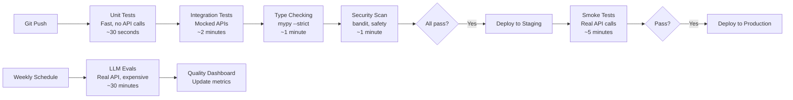

---

## 6. Common Mistakes

❌ **Making real LLM API calls in unit tests**: Tests become slow, expensive, and non-deterministic. Mock all external services in unit tests.

❌ **Testing exact LLM output strings**: `assert response == "Python was created in 1991"` fails on every temperature > 0. Test structure, key facts, or use LLM-as-judge for quality.

❌ **No test for error cases**: Only testing the happy path. Add tests for API failures, timeout, invalid input, empty retrieval, and edge cases.

❌ **Ignoring async in tests**: Using `pytest.mark.asyncio` without `pytest-asyncio` installed. Add to `pyproject.toml` and configure `asyncio_mode = "auto"`.

---

## 7. Interview Preparation

**Junior**: "I write pytest unit tests for my functions. I use `mock` to avoid real API calls in tests."

**Mid-level**: "I use a testing pyramid: 70% unit tests (mocked LLM), 20% integration tests, 10% evaluations. `@pytest.mark.parametrize` for testing multiple inputs. `hypothesis` for property-based testing. Fixtures for reusable test data. Separate markers for expensive eval tests."

**Senior**: "LLM systems need a specialized testing strategy. For unit tests: mock all external services, test all error paths, use parametrize for boundary conditions. For integration: test pipeline stages end-to-end with mocked LLMs. For quality: run LLM-as-judge evaluations on a held-out dataset weekly, alert on quality regression. I track faithfulness, relevance, and format compliance as quantitative metrics."

---

---

# Chapter 9: Packaging and Project Structure

---

## 1. Introduction

### What Is Python Packaging for AI Engineers?

Packaging means organizing your Python code so it can be:
- **Installed** as a library by other projects
- **Deployed** consistently across environments
- **Version-controlled** with locked dependencies
- **Distributed** to team members or as open-source

For AI engineers, proper packaging means:
- Your RAG pipeline code can be imported by multiple services
- Your embedding utilities can be shared across team projects
- Your production environment exactly matches your dev environment
- New team members can set up in minutes, not days

---

## 2. Implementation

### Modern Python Project Structure

```
ai-engineer-toolkit/
├── pyproject.toml           ← Single source of truth for project metadata + deps
├── uv.lock                  ← Locked dependency versions (commit this!)
├── .env.example             ← Template for environment variables
├── .gitignore
├── README.md
├── src/
│   └── ai_toolkit/
│       ├── __init__.py      ← Public API of the package
│       ├── py.typed         ← Marker: this package has type hints
│       ├── config.py        ← Settings (pydantic-settings)
│       ├── llm/
│       │   ├── __init__.py
│       │   ├── client.py    ← Async LLM client
│       │   ├── prompts.py   ← Prompt templates
│       │   └── streaming.py ← Streaming utilities
│       ├── rag/
│       │   ├── __init__.py
│       │   ├── retriever.py
│       │   ├── chunker.py
│       │   └── pipeline.py
│       └── utils/
│           ├── __init__.py
│           ├── tokens.py    ← Token counting
│           └── logging.py   ← Structured logging setup
├── tests/
│   ├── conftest.py          ← Shared fixtures
│   ├── unit/
│   │   ├── test_chunker.py
│   │   └── test_tokens.py
│   └── integration/
│       └── test_pipeline.py
└── scripts/
    ├── index_documents.py
    └── run_evals.py
```

### `pyproject.toml`: The Modern Standard

```toml
[build-system]
requires = ["hatchling"]
build-backend = "hatchling.build"

[project]
name = "ai-toolkit"
version = "1.0.0"
description = "Production AI engineering toolkit"
readme = "README.md"
requires-python = ">=3.11"
license = { text = "MIT" }

dependencies = [
    "openai>=1.30.0",
    "anthropic>=0.25.0",
    "fastapi>=0.111.0",
    "uvicorn[standard]>=0.29.0",
    "pydantic>=2.7.0",
    "pydantic-settings>=2.2.0",
    "tiktoken>=0.7.0",
    "langchain>=0.2.0",
    "langchain-openai>=0.1.0",
]

[project.optional-dependencies]
dev = [
    "pytest>=8.0.0",
    "pytest-asyncio>=0.23.0",
    "pytest-mock>=3.14.0",
    "hypothesis>=6.100.0",
    "mypy>=1.10.0",
    "ruff>=0.4.0",       # Fast linter + formatter (replaces black, flake8, isort)
    "httpx>=0.27.0",     # For testing FastAPI with TestClient
]

vector = [
    "pinecone-client>=4.0.0",
    "chromadb>=0.5.0",
    "faiss-cpu>=1.8.0",
]

all = ["ai-toolkit[dev,vector]"]

[project.scripts]
index-docs = "ai_toolkit.scripts.index_documents:main"
run-evals = "ai_toolkit.scripts.run_evals:main"

[tool.hatch.build.targets.wheel]
packages = ["src/ai_toolkit"]

[tool.pytest.ini_options]
asyncio_mode = "auto"
testpaths = ["tests"]
markers = [
    "eval: expensive LLM evaluation tests",
    "integration: tests that use real external services",
]

[tool.mypy]
strict = true
python_version = "3.11"
ignore_missing_imports = true

[tool.ruff]
target-version = "py311"
line-length = 100

[tool.ruff.lint]
select = ["E", "W", "F", "I", "N", "UP", "ANN", "B", "SIM"]
ignore = ["ANN101", "ANN102"]
```

### Dependency Management with `uv`

```bash
# uv is the fastest Python package manager (10-100x faster than pip)
# Installation
curl -LsSf https://astral.sh/uv/install.sh | sh

# Create new project
uv init ai-toolkit
cd ai-toolkit

# Add dependencies
uv add openai anthropic fastapi pydantic

# Add dev dependencies
uv add --dev pytest pytest-asyncio ruff mypy

# Create virtual environment and install all deps
uv sync

# Lock dependencies (commit uv.lock to git)
# (automatically done by uv sync)

# Run commands in the virtual environment
uv run pytest tests/
uv run mypy src/
uv run ruff check src/

# Install from pyproject.toml in another project
uv add git+https://github.com/yourcompany/ai-toolkit.git
```

### `__init__.py`: Defining the Public API

```python
# src/ai_toolkit/__init__.py
"""
AI Toolkit — Production tools for AI engineering.

Public API — these are the only things consumers should import directly:
    from ai_toolkit import LLMClient, RAGPipeline, EmbeddingService
"""

from ai_toolkit.llm.client import LLMClient
from ai_toolkit.rag.pipeline import RAGPipeline
from ai_toolkit.rag.retriever import DenseRetriever, SparseRetriever, HybridRetriever
from ai_toolkit.llm.streaming import stream_tokens

__version__ = "1.0.0"
__all__ = [
    "LLMClient",
    "RAGPipeline",
    "DenseRetriever",
    "SparseRetriever",
    "HybridRetriever",
    "stream_tokens",
]
```

---

## 3. Tradeoffs

| Tool | Use Case | Alternative |
|---|---|---|
| `uv` | Fast dependency management | `pip` + `pip-tools`, `poetry` |
| `ruff` | Linting + formatting (Rust-speed) | `black` + `flake8` + `isort` |
| `mypy --strict` | Static type checking | `pyright` (Microsoft) |
| `hatchling` | Build backend | `setuptools`, `flit` |
| `src/` layout | Prevents import confusion | Flat layout (simpler but has gotchas) |

---

---

# Chapter 10: Logging and Observability

---

## 1. Introduction

### What Is Observability for AI Systems?

Observability is the ability to understand what your AI system is doing in production — without needing to add more code or restart the service.

For AI engineers, observability is critical because:
- LLM behavior is non-deterministic — you can't reproduce exact failures without logs
- Token usage and cost need monitoring to prevent budget overruns
- Latency spikes in LLM calls need to be caught and alerted on
- Hallucination rates change when model versions change — you need to track this
- Retrieval quality is invisible without structured logging

Traditional logging (print statements, simple log messages) is insufficient. You need **structured observability**.

---

## 2. Visual Mental Model

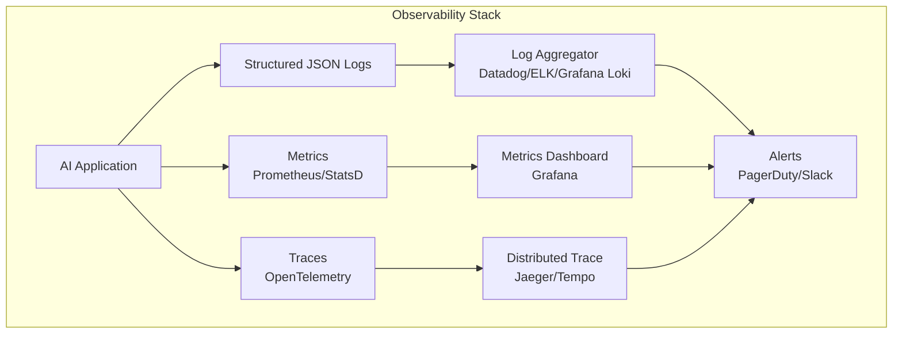

---

## 3. Implementation

### Structured Logging for AI Systems

```python
"""
Production logging setup for AI engineering systems.
Outputs structured JSON for log aggregators (Datadog, ELK, etc.)
"""

import logging
import json
import time
import uuid
from typing import Any, Optional
from contextlib import contextmanager
from functools import wraps

# ─── Structured JSON Formatter ────────────────────────────────────────────

class JSONFormatter(logging.Formatter):
    """
    Formats log records as JSON — machine-parseable by log aggregators.
    Every log entry is a structured event with consistent fields.
    """
    
    def format(self, record: logging.LogRecord) -> str:
        log_data = {
            "timestamp": self.formatTime(record),
            "level": record.levelname,
            "logger": record.name,
            "message": record.getMessage(),
            "module": record.module,
            "function": record.funcName,
            "line": record.lineno,
        }
        
        # Add any extra fields attached to the log record
        if hasattr(record, "extra"):
            log_data.update(record.extra)
        
        # Include exception info if present
        if record.exc_info:
            log_data["exception"] = self.formatException(record.exc_info)
        
        return json.dumps(log_data)


def setup_logging(
    level: str = "INFO",
    service_name: str = "ai-service",
    environment: str = "production"
) -> logging.Logger:
    """
    Configure application-wide logging with structured JSON output.
    Call once at application startup.
    """
    root_logger = logging.getLogger()
    root_logger.setLevel(getattr(logging, level.upper()))
    
    # Remove default handlers
    root_logger.handlers.clear()
    
    # Add JSON handler
    handler = logging.StreamHandler()
    handler.setFormatter(JSONFormatter())
    root_logger.addHandler(handler)
    
    # Add service context to all log records
    old_factory = logging.getLogRecordFactory()
    
    def record_factory(*args, **kwargs):
        record = old_factory(*args, **kwargs)
        record.service = service_name
        record.environment = environment
        return record
    
    logging.setLogRecordFactory(record_factory)
    
    return logging.getLogger(service_name)


# ─── LLM-Specific Logger ─────────────────────────────────────────────────

class LLMLogger:
    """
    Structured logger for LLM operations.
    Tracks: requests, responses, token usage, cost, latency.
    
    Every LLM call becomes a structured, searchable log event.
    """
    
    def __init__(self, logger: Optional[logging.Logger] = None):
        self.logger = logger or logging.getLogger("llm")
    
    def log_request(
        self,
        request_id: str,
        model: str,
        prompt_tokens: int,
        messages_count: int,
        temperature: float,
        **extra
    ):
        self.logger.info(
            "LLM request initiated",
            extra={
                "extra": {
                    "event": "llm_request",
                    "request_id": request_id,
                    "model": model,
                    "prompt_tokens": prompt_tokens,
                    "messages_count": messages_count,
                    "temperature": temperature,
                    **extra
                }
            }
        )
    
    def log_response(
        self,
        request_id: str,
        model: str,
        completion_tokens: int,
        total_tokens: int,
        latency_seconds: float,
        finish_reason: str,
        cost_usd: Optional[float] = None,
        **extra
    ):
        self.logger.info(
            "LLM request completed",
            extra={
                "extra": {
                    "event": "llm_response",
                    "request_id": request_id,
                    "model": model,
                    "completion_tokens": completion_tokens,
                    "total_tokens": total_tokens,
                    "latency_seconds": round(latency_seconds, 3),
                    "finish_reason": finish_reason,
                    "cost_usd": cost_usd,
                    **extra
                }
            }
        )
    
    def log_error(
        self,
        request_id: str,
        model: str,
        error_type: str,
        error_message: str,
        latency_seconds: float,
        **extra
    ):
        self.logger.error(
            f"LLM request failed: {error_message}",
            extra={
                "extra": {
                    "event": "llm_error",
                    "request_id": request_id,
                    "model": model,
                    "error_type": error_type,
                    "error_message": error_message,
                    "latency_seconds": round(latency_seconds, 3),
                    **extra
                }
            }
        )
    
    @contextmanager
    def trace_call(self, model: str, **extra):
        """Context manager that automatically logs LLM call start, end, and errors."""
        request_id = str(uuid.uuid4())
        start = time.perf_counter()
        
        self.logger.info(
            "LLM call started",
            extra={"extra": {"event": "llm_start", "request_id": request_id, "model": model, **extra}}
        )
        
        try:
            yield request_id
            latency = time.perf_counter() - start
            self.logger.info(
                "LLM call succeeded",
                extra={"extra": {"event": "llm_success", "request_id": request_id, "latency_seconds": round(latency, 3)}}
            )
        except Exception as e:
            latency = time.perf_counter() - start
            self.log_error(
                request_id=request_id,
                model=model,
                error_type=type(e).__name__,
                error_message=str(e),
                latency_seconds=latency
            )
            raise


# ─── Cost Tracker ─────────────────────────────────────────────────────────

class LLMCostTracker:
    """
    Track LLM API costs in production.
    Alerts when spend approaches budget limits.
    """
    
    MODEL_COSTS = {
        "gpt-4o": {"input": 0.005, "output": 0.015},           # per 1K tokens
        "gpt-4o-mini": {"input": 0.00015, "output": 0.0006},
        "gpt-3.5-turbo": {"input": 0.0005, "output": 0.0015},
        "claude-3-5-sonnet-20241022": {"input": 0.003, "output": 0.015},
        "text-embedding-3-small": {"input": 0.00002, "output": 0},
        "text-embedding-3-large": {"input": 0.00013, "output": 0},
    }
    
    def __init__(self, daily_budget_usd: float = 100.0):
        self.daily_budget = daily_budget_usd
        self.daily_spend = 0.0
        self.logger = logging.getLogger("cost_tracker")
    
    def calculate_cost(self, model: str, input_tokens: int, output_tokens: int) -> float:
        rates = self.MODEL_COSTS.get(model, {"input": 0.01, "output": 0.03})
        return (input_tokens / 1000) * rates["input"] + \
               (output_tokens / 1000) * rates["output"]
    
    def record_usage(self, model: str, input_tokens: int, output_tokens: int) -> float:
        cost = self.calculate_cost(model, input_tokens, output_tokens)
        self.daily_spend += cost
        
        # Log the cost event
        self.logger.info(
            "Token usage recorded",
            extra={
                "extra": {
                    "event": "token_usage",
                    "model": model,
                    "input_tokens": input_tokens,
                    "output_tokens": output_tokens,
                    "cost_usd": round(cost, 6),
                    "daily_spend_usd": round(self.daily_spend, 4),
                    "budget_utilization_pct": round(self.daily_spend / self.daily_budget * 100, 1)
                }
            }
        )
        
        # Alert at 80% budget
        if self.daily_spend >= self.daily_budget * 0.8:
            self.logger.warning(
                "Approaching daily budget limit",
                extra={
                    "extra": {
                        "event": "budget_warning",
                        "daily_spend_usd": round(self.daily_spend, 4),
                        "budget_usd": self.daily_budget,
                        "utilization_pct": round(self.daily_spend / self.daily_budget * 100, 1)
                    }
                }
            )
        
        return cost


# ─── Putting It All Together ───────────────────────────────────────────────

# In your main application startup:
logger = setup_logging(
    level="INFO",
    service_name="rag-api",
    environment="production"
)

llm_logger = LLMLogger()
cost_tracker = LLMCostTracker(daily_budget_usd=50.0)

# In your LLM wrapper:
async def call_llm_tracked(messages: list, model: str = "gpt-4o-mini") -> str:
    from openai import AsyncOpenAI
    client = AsyncOpenAI()
    
    with llm_logger.trace_call(model=model, message_count=len(messages)) as request_id:
        response = await client.chat.completions.create(
            model=model,
            messages=messages,
            temperature=0.7
        )
        
        cost = cost_tracker.record_usage(
            model=model,
            input_tokens=response.usage.prompt_tokens,
            output_tokens=response.usage.completion_tokens
        )
        
        llm_logger.log_response(
            request_id=request_id,
            model=model,
            completion_tokens=response.usage.completion_tokens,
            total_tokens=response.usage.total_tokens,
            latency_seconds=0,  # captured by trace_call context manager
            finish_reason=response.choices[0].finish_reason,
            cost_usd=cost
        )
        
        return response.choices[0].message.content
```

---

## 4. Production Architecture

### Observability Stack for AI Systems

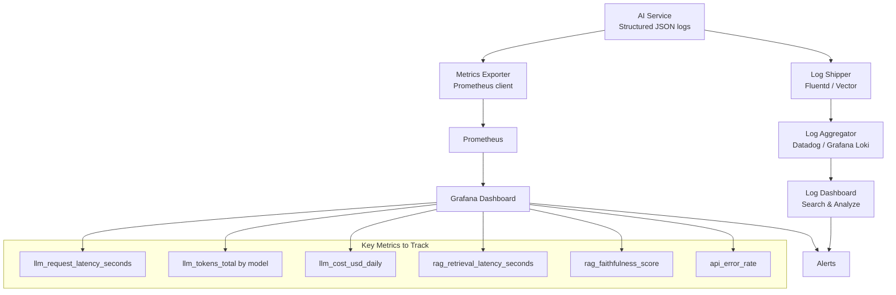

---

## 5. Common Mistakes

❌ **Using `print()` in production**: Not structured, not filterable, can't be aggregated, no log level.

❌ **Logging sensitive data**: API keys, user PII, query contents (which may be private) should never appear in logs. Use `SecretStr` and structured log schemas.

❌ **Not logging LLM token usage**: Without token tracking, you can't identify cost regressions or optimize expensive prompts.

❌ **Using string formatting instead of lazy evaluation**: `logger.info(f"Processing {len(docs)} documents")` — the f-string is evaluated even if the log level is disabled. Use `logger.info("Processing %d documents", len(docs))` for lazy evaluation.

❌ **Not differentiating log levels**: Everything at INFO is useless noise. Use DEBUG for detailed traces, INFO for key events, WARNING for degraded states, ERROR for failures.

---

## 6. Interview Preparation

**Junior**: "I use Python's logging module instead of print statements. Log levels (DEBUG, INFO, WARNING, ERROR) filter what gets shown."

**Mid-level**: "I set up structured JSON logging so log aggregators can parse and query logs efficiently. Every LLM call gets a unique request_id for tracing. I log token usage and cost for every API call and track daily spend against budget limits."

**Senior**: "Observability for AI systems requires tracking three pillars: logs (structured JSON events), metrics (token usage, latency, cost, quality scores), and traces (distributed request tracking with OpenTelemetry). I define standard event schemas for LLM requests/responses, retrieval events, and quality scores. Dashboards show p50/p95/p99 latency, error rates, and daily cost by model — with alerts at 80% budget. Anomaly detection on faithfulness scores catches model regressions automatically."

---

## 7. Mini Project: AI Observability Dashboard

Build a FastAPI service that:
1. Wraps an LLM client with full structured logging
2. Exposes a `/metrics` endpoint with Prometheus format
3. Provides a `/dashboard` endpoint with real-time stats
4. Alerts when daily budget exceeds 80%

```python
"""
AI Observability Service with Prometheus metrics.
pip install prometheus-client
"""

from fastapi import FastAPI
from prometheus_client import Counter, Histogram, Gauge, generate_latest, CONTENT_TYPE_LATEST
from fastapi.responses import Response
import time

app = FastAPI()

# ─── Prometheus Metrics ────────────────────────────────────────────────────

llm_requests_total = Counter(
    "llm_requests_total",
    "Total LLM API requests",
    ["model", "status"]  # Labels for filtering
)

llm_tokens_total = Counter(
    "llm_tokens_total",
    "Total tokens consumed",
    ["model", "token_type"]  # input or output
)

llm_latency_seconds = Histogram(
    "llm_latency_seconds",
    "LLM request latency",
    ["model"],
    buckets=[0.1, 0.5, 1.0, 2.0, 5.0, 10.0, 30.0]
)

llm_cost_usd = Counter(
    "llm_cost_usd_total",
    "Total estimated cost in USD",
    ["model"]
)

rag_faithfulness = Histogram(
    "rag_faithfulness_score",
    "RAG response faithfulness scores",
    buckets=[0.0, 0.2, 0.4, 0.6, 0.8, 0.9, 1.0]
)


@app.get("/metrics")
async def metrics():
    """Prometheus metrics endpoint."""
    return Response(
        content=generate_latest(),
        media_type=CONTENT_TYPE_LATEST
    )


async def tracked_llm_call(messages: list, model: str) -> str:
    """LLM call with full Prometheus instrumentation."""
    start = time.perf_counter()
    
    try:
        from openai import AsyncOpenAI
        client = AsyncOpenAI()
        response = await client.chat.completions.create(
            model=model, messages=messages
        )
        
        latency = time.perf_counter() - start
        
        # Record metrics
        llm_requests_total.labels(model=model, status="success").inc()
        llm_latency_seconds.labels(model=model).observe(latency)
        llm_tokens_total.labels(model=model, token_type="input").inc(response.usage.prompt_tokens)
        llm_tokens_total.labels(model=model, token_type="output").inc(response.usage.completion_tokens)
        
        return response.choices[0].message.content
    
    except Exception as e:
        llm_requests_total.labels(model=model, status="error").inc()
        raise
```

---

# Summary: Part 1 — Python for AI Engineers

This part established the Python foundation every AI engineer needs:

| Chapter | Core Insight |
|---|---|
| **1. Python Fundamentals** | Variables are references, not containers. Generators save memory. Closures power decorators. |
| **2. OOP** | Composition over inheritance. ABCs define interfaces. Dunder methods integrate with Python. |
| **3. Data Structures** | Choose based on primary operation. `dict`/`set` for O(1) lookup. `deque` for sliding windows. `heapq` for priority. |
| **4. Algorithms** | Binary search for thresholds. Sliding window for chunking. RRF for hybrid search. Topological sort for agent DAGs. |
| **5. AsyncIO** | Single-thread concurrency for IO-bound tasks. `gather` for parallel calls. Semaphore for rate limiting. Circuit breaker for reliability. |
| **6. FastAPI** | Async API framework with automatic validation and docs. Dependency injection for cross-cutting concerns. |
| **7. Pydantic** | Type-safe data validation at runtime. Essential for LLM output parsing and configuration. |
| **8. Testing** | Unit tests with mocked LLMs. Integration tests for pipelines. LLM-as-judge for quality evaluation. |
| **9. Packaging** | `pyproject.toml` + `uv` for modern dependency management. Proper project structure for maintainability. |
| **10. Logging** | Structured JSON logging. LLM-specific event schemas. Token cost tracking. Prometheus metrics. |

The connecting thread: **production AI engineering is software engineering first**. The best model in the world deployed on fragile Python code, with no observability, no tests, and no type safety, will fail in production. Master the craft — then master the AI.

---

*End of Part 1 — Python for AI Engineers*
