# Part 2: Machine Learning Fundamentals

> *"You don't need to be a machine learning researcher to be an AI engineer. But you need to understand ML well enough to know why your model is failing, when to trust its output, and how to make it better. That understanding starts here."*

---

## Table of Contents

- [Chapter 1: Supervised Learning](#chapter-1-supervised-learning)
- [Chapter 2: Unsupervised Learning](#chapter-2-unsupervised-learning)
- [Chapter 3: Reinforcement Learning](#chapter-3-reinforcement-learning)
- [Chapter 4: Bias and Variance](#chapter-4-bias-and-variance)
- [Chapter 5: Overfitting and Regularization](#chapter-5-overfitting-and-regularization)
- [Chapter 6: Evaluation Metrics](#chapter-6-evaluation-metrics)
- [Chapter 7: Feature Engineering](#chapter-7-feature-engineering)

---

# Chapter 1: Supervised Learning

---

## 1. Introduction

### What Is Supervised Learning?

Supervised learning is the most common type of machine learning. The word "supervised" means you are training a model with **labeled examples** — data where the correct answer is already known.

You give the model thousands of (input, correct-output) pairs. The model learns to predict the output for inputs it has never seen before.

Examples:
- (Email text → Spam / Not Spam)
- (House features → House price)
- (User review text → Positive / Negative sentiment)
- (Document → Relevant / Not relevant to query)
- (Code snippet → Bug / No bug)

### Why Does It Matter for AI Engineers?

Even if you work primarily with LLMs, supervised learning is everywhere in the AI stack:
- **Fine-tuning LLMs**: RLHF uses supervised learning (reward model trained on human preferences)
- **Embedding models**: Trained with supervised contrastive learning
- **Rerankers in RAG**: Cross-encoder rerankers are supervised classifiers
- **Intent classification**: Routing user queries to the right pipeline
- **Output classifiers**: Detecting hallucinations, toxicity, relevance

### Two Types of Problems

**Classification**: The output is a category
- Binary: Spam/Not Spam, Relevant/Not Relevant
- Multi-class: Sentiment (Positive/Negative/Neutral)
- Multi-label: A document can belong to multiple categories

**Regression**: The output is a continuous number
- Predicting relevance score (0.0–1.0)
- Estimating token count
- Forecasting API latency

---

## 2. Historical Motivation

### Before Machine Learning: Hand-Written Rules

In the 1980s and 1990s, AI systems used **expert systems** — large collections of if-then rules written by domain experts.

```python
# Spam detection circa 1990s
def is_spam(email: str) -> bool:
    if "FREE" in email.upper():
        return True
    if "CLICK HERE" in email.upper():
        return True
    if "MILLION DOLLARS" in email.upper():
        return True
    return False
```

**Problems**:
- Spammers adapt: they write "FR££" instead of "FREE"
- Impossible to maintain: language is too varied
- Experts make mistakes and miss patterns
- Rules generalize poorly to new types of spam

### The Machine Learning Revolution

The insight of supervised learning: **instead of writing the rules, show examples and let the algorithm discover the rules itself**.

Frank Rosenblatt's Perceptron (1958) was the first formal supervised learning algorithm. By the 1990s, Support Vector Machines (SVMs) dominated. By 2012, deep neural networks (AlexNet) crushed hand-crafted feature engineering in image recognition. By 2017, transformers made supervised learning work for text at unprecedented scale.

---

## 3. Real-World Analogy

Supervised learning is exactly like **how a student learns from a teacher**.

The teacher (training process) shows the student (model) thousands of math problems with their solutions (labeled data). The student practices, makes mistakes, gets corrections, and adjusts their understanding. After enough practice (training), the student can solve new problems they've never seen before (inference on new data).

Key parallel: just like a student who only sees addition problems can't suddenly do calculus, a model trained on one distribution of data struggles on data from a very different distribution (distribution shift).

---

## 4. Visual Mental Model

### The Supervised Learning Lifecycle

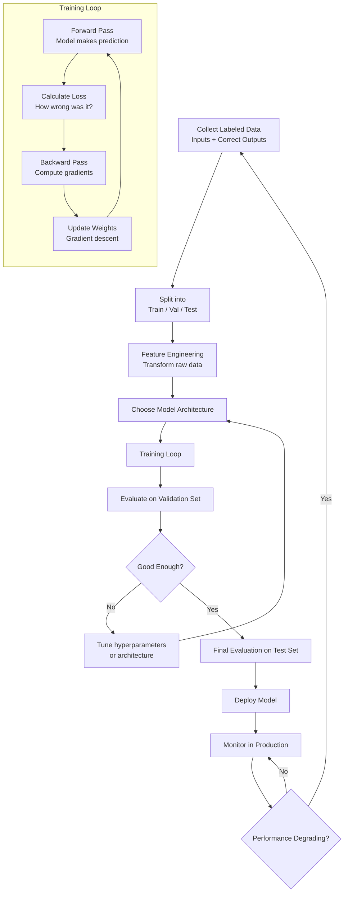

### Classification vs. Regression Decision Boundary

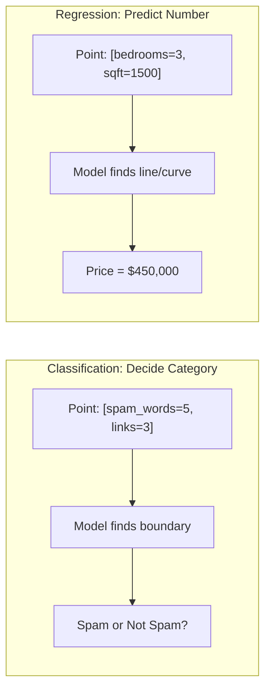

---

## 5. Internal Working

### The Training Loop in Detail

The core of supervised learning is a feedback loop:

**Step 1: Make a prediction (Forward Pass)**
The model takes an input X and produces a prediction ŷ (y-hat):
```
ŷ = model(X)
```

**Step 2: Measure error (Loss function)**
Compare the prediction ŷ to the true label y:
```
Loss = L(ŷ, y)
```
For classification: **Cross-Entropy Loss**
For regression: **Mean Squared Error (MSE)**

**Step 3: Understand which parameters caused the error (Backpropagation)**
The loss is differentiated with respect to every model parameter. This tells us: "which direction should each parameter move to reduce the loss?"

**Step 4: Update parameters (Gradient Descent)**
Move each parameter a small step in the direction that reduces the loss:
```
θ = θ - α × ∂L/∂θ
```
Where α (alpha) is the learning rate — how big a step to take.

**Step 5: Repeat**
Repeat this process thousands of times on thousands of examples until the model is good enough.

---

## 6. Mathematical Intuition

### The Loss Function: The Compass

The loss function is the model's north star — it defines what "wrong" means and therefore what "learning" means.

**Mean Squared Error (MSE)** — for regression:
```
MSE = (1/N) × Σ (yᵢ - ŷᵢ)²
```
- Squares the error → larger errors are penalized more heavily
- The square also makes the gradient well-behaved (differentiable everywhere)
- `N` = number of examples, `yᵢ` = true value, `ŷᵢ` = predicted value

**Cross-Entropy Loss** — for classification:
```
CE = -(1/N) × Σ [yᵢ × log(ŷᵢ) + (1-yᵢ) × log(1-ŷᵢ)]
```
- `yᵢ` = true label (0 or 1)
- `ŷᵢ` = predicted probability (0.0 to 1.0)
- When true label is 1 and prediction is 0.0001 → loss is huge: `-log(0.0001) ≈ 9.2`
- When true label is 1 and prediction is 0.9999 → loss is tiny: `-log(0.9999) ≈ 0.0001`

**Why log?** The log function penalizes confident wrong predictions catastrophically. If you say "I'm 99.9% sure this is not spam" and it is spam, you deserve a massive loss signal.

### Gradient Descent: Walking Downhill

Imagine the loss function as a mountain range. Your goal is to find the lowest valley (minimum loss).

Gradient descent does this:
1. Look at the slope of the mountain at your current position (gradient)
2. Take a step downhill (update parameters in negative gradient direction)
3. Repeat until you stop descending (converge)

```
New position = Current position − learning_rate × slope
θ_new = θ_old - α × ∇L(θ)
```

**Gradient Descent Variants**:
- **Batch GD**: Uses all N examples to compute one gradient. Accurate but slow.
- **SGD** (Stochastic): Uses 1 example per gradient step. Fast but noisy.
- **Mini-batch GD**: Uses B examples (batch size 32–512). Best of both worlds. Used in practice.

---

## 7. Implementation

### End-to-End Supervised Learning Example: RAG Reranker

```python
"""
Supervised learning example: Training a relevance classifier
for use as a reranker in a RAG pipeline.

This classifier takes (query, document) pairs and predicts
whether the document is relevant to the query (1) or not (0).
"""

import numpy as np
from sklearn.pipeline import Pipeline
from sklearn.linear_model import LogisticRegression
from sklearn.preprocessing import StandardScaler
from sklearn.model_selection import train_test_split, cross_val_score
from sklearn.metrics import classification_report, roc_auc_score
import joblib
from typing import List, Tuple, Dict
from dataclasses import dataclass

@dataclass
class TrainingExample:
    query: str
    document: str
    label: int  # 1 = relevant, 0 = not relevant
    relevance_score: float = 0.0  # Optional soft label

class RelevanceFeatureExtractor:
    """
    Extract features from (query, document) pairs for relevance classification.
    
    These are hand-crafted features — a simple but effective baseline
    before using neural embeddings.
    """
    
    def __init__(self, embedding_model=None):
        self.embedding_model = embedding_model
    
    def extract_lexical_features(self, query: str, document: str) -> Dict[str, float]:
        """Features based on word overlap."""
        query_words = set(query.lower().split())
        doc_words = set(document.lower().split())
        
        intersection = query_words & doc_words
        union = query_words | doc_words
        
        return {
            "jaccard_similarity": len(intersection) / len(union) if union else 0.0,
            "query_coverage": len(intersection) / len(query_words) if query_words else 0.0,
            "query_length": len(query_words),
            "doc_length": len(doc_words),
            "length_ratio": len(doc_words) / max(len(query_words), 1),
        }
    
    def extract_all_features(self, examples: List[TrainingExample]) -> np.ndarray:
        """Extract feature vectors for a list of examples."""
        features = []
        
        for ex in examples:
            lex = self.extract_lexical_features(ex.query, ex.document)
            feature_vector = list(lex.values())
            features.append(feature_vector)
        
        return np.array(features)


class RelevanceClassifier:
    """
    Supervised relevance classifier for RAG reranking.
    
    Trained on (query, document, is_relevant) triplets.
    Used to rerank retrieved documents before sending to LLM.
    """
    
    def __init__(self):
        self.pipeline = Pipeline([
            ("scaler", StandardScaler()),           # Normalize features
            ("classifier", LogisticRegression(
                C=1.0,                              # Regularization strength (1/C)
                max_iter=1000,
                class_weight="balanced",            # Handle class imbalance
                random_state=42
            ))
        ])
        self.feature_extractor = RelevanceFeatureExtractor()
        self.is_trained = False
    
    def train(
        self,
        examples: List[TrainingExample],
        validation_split: float = 0.2
    ) -> Dict[str, float]:
        """
        Train the classifier on labeled examples.
        Returns validation metrics.
        """
        # Extract features and labels
        X = self.feature_extractor.extract_all_features(examples)
        y = np.array([ex.label for ex in examples])
        
        # Split into train and validation
        X_train, X_val, y_train, y_val = train_test_split(
            X, y,
            test_size=validation_split,
            random_state=42,
            stratify=y  # Maintain class balance in both splits
        )
        
        # Train the model
        self.pipeline.fit(X_train, y_train)
        self.is_trained = True
        
        # Evaluate
        y_pred = self.pipeline.predict(X_val)
        y_prob = self.pipeline.predict_proba(X_val)[:, 1]
        
        metrics = {
            "val_accuracy": (y_pred == y_val).mean(),
            "val_roc_auc": roc_auc_score(y_val, y_prob),
            "train_samples": len(X_train),
            "val_samples": len(X_val),
        }
        
        print(classification_report(y_val, y_pred, target_names=["Not Relevant", "Relevant"]))
        return metrics
    
    def predict_relevance(self, query: str, documents: List[str]) -> List[float]:
        """
        Score documents for relevance to a query.
        Returns relevance scores (0.0–1.0) for each document.
        """
        if not self.is_trained:
            raise RuntimeError("Classifier must be trained before prediction")
        
        examples = [
            TrainingExample(query=query, document=doc, label=0)
            for doc in documents
        ]
        
        X = self.feature_extractor.extract_all_features(examples)
        scores = self.pipeline.predict_proba(X)[:, 1]
        return scores.tolist()
    
    def rerank(
        self,
        query: str,
        documents: List[str],
        top_k: int = 5
    ) -> List[Tuple[float, str]]:
        """Rerank documents by predicted relevance."""
        scores = self.predict_relevance(query, documents)
        ranked = sorted(zip(scores, documents), key=lambda x: x[0], reverse=True)
        return ranked[:top_k]
    
    def save(self, path: str):
        joblib.dump(self.pipeline, path)
    
    @classmethod
    def load(cls, path: str) -> "RelevanceClassifier":
        clf = cls()
        clf.pipeline = joblib.load(path)
        clf.is_trained = True
        return clf


# Neural version using embeddings (production-grade)
class NeuralRelevanceClassifier:
    """
    Embedding-based relevance classifier.
    Uses cosine similarity between query and document embeddings as features.
    Much more powerful than lexical features — handles semantic similarity.
    """
    
    def __init__(self, embedding_model: str = "text-embedding-3-small"):
        from openai import OpenAI
        self.client = OpenAI()
        self.embedding_model = embedding_model
        self.threshold = 0.7
    
    def _embed(self, texts: List[str]) -> np.ndarray:
        response = self.client.embeddings.create(
            input=texts,
            model=self.embedding_model
        )
        return np.array([item.embedding for item in sorted(response.data, key=lambda x: x.index)])
    
    def predict_relevance(self, query: str, documents: List[str]) -> List[float]:
        """Use cosine similarity as a zero-shot relevance score."""
        query_emb = self._embed([query])[0]
        doc_embs = self._embed(documents)
        
        # Cosine similarity for each document
        norms = np.linalg.norm(doc_embs, axis=1) * np.linalg.norm(query_emb)
        similarities = doc_embs @ query_emb / (norms + 1e-10)
        
        return similarities.tolist()
```

---

## 8. Production Architecture

### Supervised Model in a Production RAG Pipeline

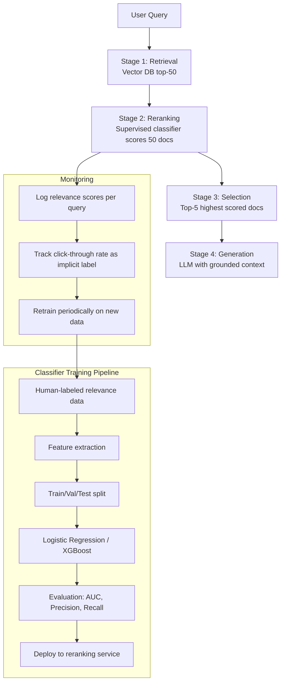

---

## 9. Tradeoffs

| Model | Interpretability | Training Speed | Accuracy | When to Use |
|---|---|---|---|---|
| Logistic Regression | High | Very fast | Low-Medium | Baseline, interpretability needed |
| Decision Tree | High | Fast | Medium | Non-linear data, explainability |
| Random Forest | Medium | Medium | High | Tabular data, robust baseline |
| XGBoost/LightGBM | Medium | Medium | Very High | Competitions, structured data |
| Neural Network | Low | Slow | Highest | Large data, complex patterns |
| Fine-tuned LLM | Very Low | Very slow | Highest | Text data, few-shot capable |

---

## 10. Common Mistakes

❌ **Not splitting train/test before any processing**: If you normalize using statistics from the entire dataset (including test), you've leaked test data into training. Always fit scalers on training data only.

❌ **Ignoring class imbalance**: In relevance classification, 95% not-relevant / 5% relevant is common. A model that predicts "not relevant" always gets 95% accuracy but is useless. Use `class_weight='balanced'`, F1, AUC, and precision-recall curves.

❌ **Evaluating on training data**: "Our model has 99% accuracy!" — if that's on training data, it's meaningless. Always evaluate on a held-out test set.

❌ **Treating model confidence as probability**: Scikit-learn's `predict_proba()` outputs are not true calibrated probabilities unless you apply Platt scaling or Isotonic regression. A model saying "95% confident" might only be right 70% of the time.

❌ **Not monitoring data drift**: A model trained on Q1 data might degrade in Q4 if user behavior or language patterns shift. Monitor input feature distributions and output distributions in production.

---

## 11. Interview Preparation

**Junior**: "Supervised learning trains a model on labeled examples. Classification predicts categories, regression predicts numbers. Training uses gradient descent to minimize a loss function."

**Mid-level**: "The training loop: forward pass (predict), compute loss (cross-entropy or MSE), backward pass (gradients), update weights. Key decisions: loss function, optimizer (Adam is standard), learning rate, batch size. I split data into train/validation/test, fit preprocessing on train only, and tune hyperparameters on validation. Final evaluation on test set."

**Senior**: "For production RAG, I use supervised learning for reranking — a trained cross-encoder (BERT-based) scores (query, document) pairs far more accurately than embedding cosine similarity alone. Training data comes from human relevance judgments plus implicit signals (click-through rate, dwell time). I monitor AUC and NDCG on a held-out evaluation set and alert on degradation. Class imbalance in relevance data (few relevant docs per query) is addressed with weighted loss."

**Principal**: "Supervised learning in LLM systems appears in: (1) reward models for RLHF (trained on human preference pairs); (2) cross-encoder rerankers for RAG; (3) hallucination detectors (trained on LLM output + label pairs); (4) intent classifiers for query routing; (5) guardrail classifiers for safety. Each is its own supervised problem. The common thread: you need labeled data, and the quality of labels determines the quality of the model. For LLM-adjacent tasks, I often use LLM-generated weak labels to bootstrap, then refine with human labels — this dramatically reduces annotation cost."

---

## 12. Follow-up Questions

**Q1: What is the difference between parameters and hyperparameters?**
> Parameters are learned from data during training: model weights and biases. Hyperparameters are set before training and control the training process: learning rate, batch size, number of layers, regularization strength. You tune hyperparameters on the validation set; the test set is untouched until final evaluation.

**Q2: What is the difference between a model and an algorithm in ML?**
> An algorithm (e.g., Logistic Regression, Random Forest) is the procedure for learning from data. A model is the result of applying that algorithm to a specific dataset — the learned parameters. "Training" runs the algorithm on data to produce a model.

**Q3: Why use mini-batch gradient descent instead of batch or SGD?**
> Batch GD: accurate gradients but requires loading all data into memory and is slow per step. SGD: fast but noisy — gradients from single examples are high variance. Mini-batch: balances accuracy and speed. Batch sizes 32–256 are standard. GPU memory constraints also dictate batch size. Mini-batch also adds regularization effect — the noise prevents overfitting.

**Q4: What is the learning rate and why does it matter?**
> The learning rate controls how large a step we take in gradient descent. Too high: overshoot the minimum and diverge (loss increases). Too low: take forever to converge or get stuck in local minima. Learning rate scheduling (warmup → cosine decay) helps. Adam optimizer adapts the learning rate per parameter, making it less sensitive to the initial learning rate choice.

**Q5: What is data augmentation and when is it used?**
> Artificially expanding the training dataset by creating modified versions of existing examples. For text: paraphrase, back-translation, synonym replacement. For images: rotation, flip, crop, brightness change. Used when labeled data is scarce. In LLM fine-tuning, asking an LLM to generate more training examples from a few seeds is a form of data augmentation.

**Q6: What is the difference between online and offline learning?**
> Offline (batch) learning: train on a fixed dataset, deploy static model, retrain periodically. Online learning: model updates continuously as new data arrives. For AI systems, most LLMs are offline-trained but may have online adaptation through RAG or few-shot examples in context.

**Q7: What is inductive bias?**
> Every learning algorithm makes assumptions about the form of the relationship between inputs and outputs. These assumptions are its inductive bias. A linear model assumes the relationship is linear. A neural network assumes smooth, hierarchical features. Without inductive bias, a model can't generalize beyond training data (no free lunch theorem). Choosing the right model architecture is choosing the right inductive bias.

**Q8: How do you handle missing features in production?**
> Three strategies: (1) Imputation: fill with mean, median, mode, or model-predicted values; (2) Indicator features: add a binary feature "was this feature missing?" — missing-ness can itself be informative; (3) Model tolerance: tree-based models can handle missing values natively. In LLM applications, "missing" context is handled by RAG retrieval — fill in missing knowledge before generation.

**Q9: What is transfer learning in the context of supervised learning?**
> Starting from a model pre-trained on a large dataset (ImageNet, Common Crawl) and fine-tuning it on your specific labeled dataset. The pre-trained model has already learned general representations — you only need labeled data to adapt the final layers. This is why fine-tuning GPT-4 on 1000 examples can outperform training a model from scratch on 100,000 examples.

**Q10: What is the difference between discriminative and generative models?**
> Discriminative: models the boundary between classes (predicts P(y|x)). Logistic Regression, SVM, BERT for classification. Generative: models the data distribution itself (learns P(x, y) or P(x|y)). Naive Bayes, VAEs, GPT. Discriminative models are generally better at classification; generative models can generate new data and work with missing labels.

---

## 13. Practical Scenario

### Scenario: Building a Query Intent Classifier for a Customer Support AI

**Context**: A large e-commerce company's AI customer support receives 500K queries/day. They want to route queries to the right LLM specialist (returns, shipping, billing, technical).

**Problem**: The first version routed everything to one general LLM. It worked but was expensive (GPT-4 for "where is my package?") and slow (complex billing questions mixed with simple tracking queries).

**Solution**: A lightweight intent classifier routes queries to the right specialist.

```python
from sklearn.pipeline import Pipeline
from sklearn.linear_model import LogisticRegression
from sklearn.feature_extraction.text import TfidfVectorizer
import json

# Training data (real scenario: thousands of human-labeled examples)
training_data = [
    ("Where is my order?", "shipping"),
    ("Track my package", "shipping"),
    ("I want to return this product", "returns"),
    ("How do I get a refund?", "returns"),
    ("My credit card was charged twice", "billing"),
    ("I can't log in to my account", "technical"),
    ("The app keeps crashing", "technical"),
    # ... thousands more
]

texts, labels = zip(*training_data)

# Simple but effective: TF-IDF + Logistic Regression
# This runs in <1ms at inference — much cheaper than LLM routing
intent_classifier = Pipeline([
    ("tfidf", TfidfVectorizer(
        ngram_range=(1, 2),     # Unigrams and bigrams
        max_features=10000,
        stop_words="english"
    )),
    ("clf", LogisticRegression(
        multi_class="multinomial",
        C=1.0,
        max_iter=500,
        class_weight="balanced"
    ))
])

intent_classifier.fit(texts, labels)

# Route query to specialist
def route_query(query: str) -> str:
    intent = intent_classifier.predict([query])[0]
    confidence = intent_classifier.predict_proba([query]).max()
    
    if confidence < 0.6:  # Low confidence → general specialist
        return "general"
    return intent
```

**Results**:
- Routing accuracy: 94.2% on held-out test set
- Cost reduction: 60% (simple queries now use GPT-3.5 instead of GPT-4)
- Latency reduction: 40% (specialized prompts are shorter)

**Lessons**:
1. Simple ML models (TF-IDF + Logistic Regression) can be better than LLMs for classification tasks when you have labeled data
2. Always include a "low confidence → fallback" path
3. Monitor classifier accuracy using implicit signals (did the user say "that's not what I asked"?)

---

## 14. Revision Sheet

### Key Points
- Supervised learning = learning from labeled (input, output) pairs
- Two types: Classification (category output) and Regression (numeric output)
- Training loop: Forward → Loss → Backward → Update → Repeat
- Loss function guides learning: MSE for regression, Cross-Entropy for classification
- Gradient descent finds parameters that minimize loss
- Always split: Train (fit model) → Validation (tune hyperparameters) → Test (final evaluation)

### Key Formulas
```
Gradient Descent:  θ = θ - α × ∇L(θ)
MSE Loss:          L = (1/N) × Σ (y - ŷ)²
Cross-Entropy:     L = -(1/N) × Σ y log(ŷ) + (1-y) log(1-ŷ)
```

### Common Interview Traps
- "High accuracy means good model" → Check class balance, might be always predicting majority
- "Use all data for training" → You need held-out test set for honest evaluation
- "Scikit-learn probabilities are calibrated" → They're not; use calibration if needed
- "More data always helps" → Only if it's representative. Garbage in → garbage out.

---

## 15. Hands-on Exercises

**Easy**: Train a Logistic Regression email spam classifier using sklearn. Report accuracy, precision, recall, and F1.

**Medium**: Build a query intent classifier for a RAG system with 5 categories. Use TF-IDF + Logistic Regression. Evaluate with confusion matrix.

**Hard**: Train a cross-encoder relevance classifier using a pre-trained BERT model (HuggingFace sentence-transformers) on a custom dataset of (query, document, label) triplets.

**Production**: Build a supervised hallucination detector: given (question, context, answer) triplets with human labels (hallucinated/faithful), train a classifier to detect hallucinations automatically.

---

---

# Chapter 2: Unsupervised Learning

---

## 1. Introduction

### What Is Unsupervised Learning?

Unsupervised learning finds **structure, patterns, and relationships** in data without any labels. You give the model data, and it discovers the organization on its own.

The model is not trying to predict a correct answer — there is no "correct answer." Instead, it's trying to understand the underlying structure of the data.

Key tasks:
- **Clustering**: Group similar documents together (without knowing the categories in advance)
- **Dimensionality reduction**: Compress high-dimensional data while preserving structure
- **Anomaly detection**: Find outliers — data points that don't fit the pattern
- **Topic modeling**: Discover themes in a corpus without labeled categories

### Why Does It Matter for AI Engineers?

Unsupervised learning is central to modern AI:
- **Training word embeddings** (Word2Vec): Learns word meanings from unlabeled text
- **Pre-training LLMs**: GPT's next-token prediction is unsupervised
- **Document clustering**: Organizing a knowledge base without manual categorization
- **Anomaly detection in LLM outputs**: Finding outlier responses that need review
- **Exploratory analysis**: Understanding a new corpus before labeling anything

---

## 2. Historical Motivation

### Why Unsupervised Learning Emerged

Labeling data is expensive and slow. For every supervised learning model, you need thousands of human-labeled examples. But language has billions of tokens of unlabeled text available freely on the internet.

The key insight: **unlabeled data contains implicit supervision**. If you learn to predict missing words in a sentence, you must learn grammar, semantics, and world knowledge. This is BERT's masked language modeling. If you learn to predict the next word, you must learn how sentences work. This is GPT.

Unsupervised pre-training on massive corpora followed by supervised fine-tuning on small labeled datasets became the dominant paradigm in modern NLP.

---

## 3. Real-World Analogy

Unsupervised learning is like **a new librarian organizing a room full of books without a catalog**.

The librarian (algorithm) doesn't know the categories. They start reading books and notice: "These five books all mention wars and politics — they're probably history." "These books use technical formulas — they're probably science." They discover natural groups (clusters) without being told what categories exist.

Later, when you ask "find me books about World War II," the librarian can quickly point to the history section.

This is exactly how LLMs develop "categories" in their embedding space — they're not programmed with categories, they emerge from the structure of language.

---

## 4. Visual Mental Model

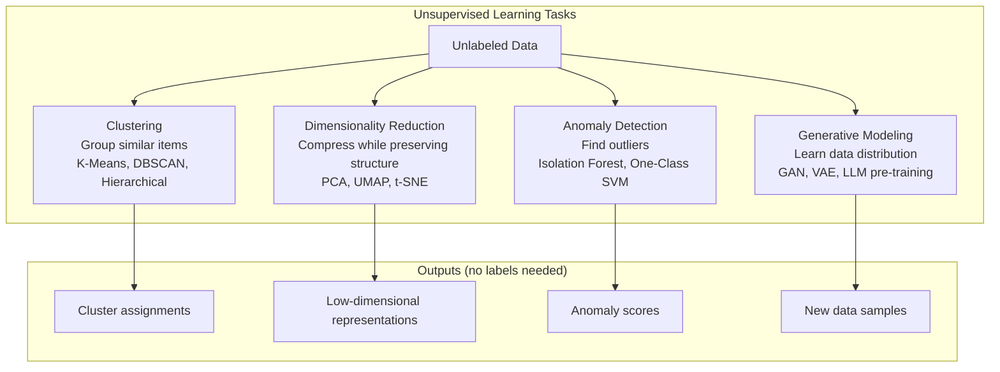

### K-Means Clustering Visualization

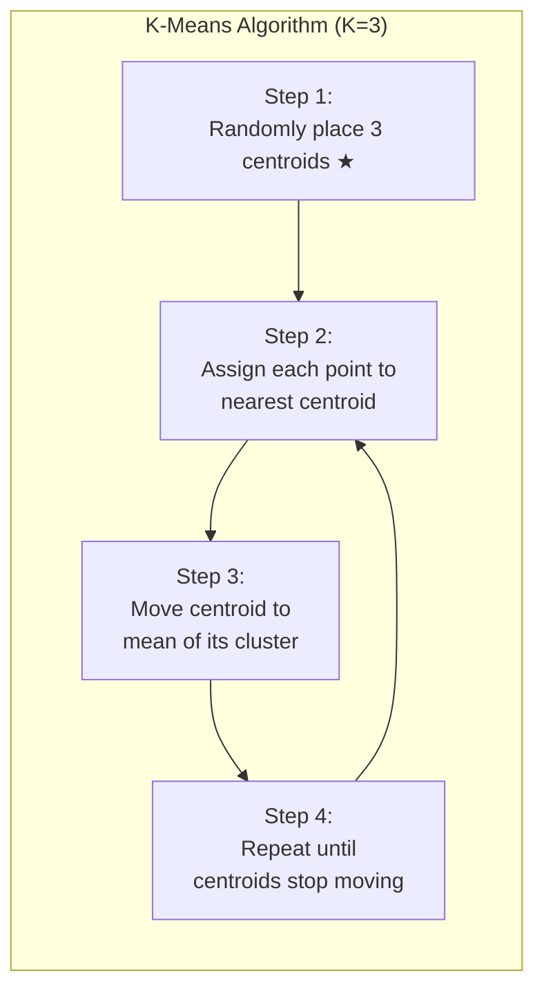

---

## 5. Internal Working

### K-Means: Step-by-Step

```python
import numpy as np
from typing import List, Tuple

def kmeans(
    X: np.ndarray,
    k: int,
    max_iterations: int = 100,
    tolerance: float = 1e-4,
    random_state: int = 42
) -> Tuple[np.ndarray, np.ndarray]:
    """
    K-Means clustering from scratch.
    
    Args:
        X: Data points (N, D) — N points in D dimensions
        k: Number of clusters
        max_iterations: Maximum number of update steps
        tolerance: Stop if centroid movement < tolerance
    
    Returns:
        centroids: (K, D) centroid positions
        assignments: (N,) cluster assignment for each point
    """
    np.random.seed(random_state)
    N, D = X.shape
    
    # Step 1: Initialize centroids randomly from data points
    indices = np.random.choice(N, k, replace=False)
    centroids = X[indices].copy()
    
    for iteration in range(max_iterations):
        # Step 2: Assign each point to nearest centroid
        # Compute squared distances: (N, K) matrix
        distances = np.sum((X[:, np.newaxis, :] - centroids[np.newaxis, :, :]) ** 2, axis=2)
        assignments = np.argmin(distances, axis=1)  # (N,)
        
        # Step 3: Update centroids to mean of assigned points
        new_centroids = np.array([
            X[assignments == i].mean(axis=0) if (assignments == i).any() else centroids[i]
            for i in range(k)
        ])
        
        # Step 4: Check convergence
        centroid_shift = np.max(np.linalg.norm(new_centroids - centroids, axis=1))
        centroids = new_centroids
        
        if centroid_shift < tolerance:
            print(f"Converged at iteration {iteration + 1}")
            break
    
    return centroids, assignments
```

### UMAP: Dimensionality Reduction for Embeddings

UMAP (Uniform Manifold Approximation and Projection) is used to reduce 1536-dimensional embedding vectors to 2D for visualization, or to lower dimensions for downstream clustering.

```python
import numpy as np
import umap
import matplotlib.pyplot as plt
from openai import OpenAI

client = OpenAI()

def visualize_document_clusters(
    documents: List[str],
    labels: List[str] = None
) -> None:
    """
    Visualize document embeddings in 2D using UMAP.
    Useful for understanding the structure of your knowledge base.
    """
    # Get embeddings (1536-dimensional)
    response = client.embeddings.create(
        input=documents,
        model="text-embedding-3-small"
    )
    embeddings = np.array([item.embedding for item in sorted(response.data, key=lambda x: x.index)])
    
    # Reduce to 2D with UMAP
    reducer = umap.UMAP(
        n_components=2,
        n_neighbors=15,      # Balance local vs. global structure
        min_dist=0.1,        # Minimum distance between points in 2D
        metric="cosine",     # Use cosine distance for embeddings
        random_state=42
    )
    embeddings_2d = reducer.fit_transform(embeddings)
    
    # Plot
    plt.figure(figsize=(12, 8))
    
    if labels:
        unique_labels = list(set(labels))
        colors = plt.cm.tab10(np.linspace(0, 1, len(unique_labels)))
        
        for label, color in zip(unique_labels, colors):
            mask = [l == label for l in labels]
            plt.scatter(
                embeddings_2d[mask, 0],
                embeddings_2d[mask, 1],
                label=label,
                color=color,
                alpha=0.7,
                s=50
            )
        plt.legend()
    else:
        plt.scatter(embeddings_2d[:, 0], embeddings_2d[:, 1], alpha=0.7)
    
    plt.title("Document Embeddings Visualization (UMAP)")
    plt.xlabel("UMAP Dimension 1")
    plt.ylabel("UMAP Dimension 2")
    plt.show()
```

---

## 6. Mathematical Intuition

### K-Means Objective Function

K-Means minimizes the **Within-Cluster Sum of Squares (WCSS)**:

```
WCSS = Σ_k Σ_{x ∈ Cluster_k} ||x - μ_k||²
```

Where:
- `μ_k` is the centroid (mean) of cluster k
- `||x - μ_k||²` is the squared Euclidean distance from point x to its centroid
- We sum over all clusters and all points in each cluster

The goal: find cluster assignments and centroids that minimize this.

**Why is K-Means hard?** This is an NP-hard optimization problem. K-Means finds a local minimum, not the global minimum. Different random initializations give different results. K-Means++ initialization (choose centroids far from each other) dramatically improves results.

### The Elbow Method: Choosing K

```
WCSS decreases as K increases (K=N gives WCSS=0)
Plot WCSS vs K — look for the "elbow" where benefit of adding one more cluster diminishes sharply.
```

---

## 7. Implementation

### Unsupervised Document Organization for RAG

```python
"""
Unsupervised clustering of documents for RAG knowledge base organization.
Discovers natural topic groups without requiring labeled categories.
"""

import numpy as np
from sklearn.cluster import KMeans, DBSCAN
from sklearn.metrics import silhouette_score
from sklearn.preprocessing import normalize
from typing import List, Dict, Tuple, Optional
from dataclasses import dataclass, field
from openai import OpenAI

client = OpenAI()

@dataclass
class DocumentCluster:
    cluster_id: int
    documents: List[str]
    centroid: np.ndarray
    label: str = ""  # Discovered topic label (set by LLM after clustering)
    
    @property
    def size(self) -> int:
        return len(self.documents)

class DocumentOrganizer:
    """
    Automatically organizes a document collection into topics
    using unsupervised clustering on embeddings.
    
    Use case: You have 10,000 support articles and want to
    automatically discover and organize topic areas.
    """
    
    def __init__(self, embedding_model: str = "text-embedding-3-small"):
        self.embedding_model = embedding_model
        self.kmeans = None
        self.embeddings = None
        self.clusters: List[DocumentCluster] = []
    
    def embed_documents(self, documents: List[str]) -> np.ndarray:
        """Get embeddings for all documents."""
        # Batch in groups of 2048 (API limit)
        all_embeddings = []
        
        for i in range(0, len(documents), 2048):
            batch = documents[i:i + 2048]
            response = client.embeddings.create(
                input=batch,
                model=self.embedding_model
            )
            batch_embeddings = [item.embedding for item in sorted(response.data, key=lambda x: x.index)]
            all_embeddings.extend(batch_embeddings)
        
        embeddings = np.array(all_embeddings)
        # L2 normalize so cosine similarity = dot product
        return normalize(embeddings, norm="l2")
    
    def find_optimal_k(
        self,
        embeddings: np.ndarray,
        k_range: range = range(2, 20)
    ) -> int:
        """Find optimal number of clusters using silhouette score."""
        best_k = k_range.start
        best_score = -1
        
        for k in k_range:
            kmeans = KMeans(n_clusters=k, random_state=42, n_init=10)
            labels = kmeans.fit_predict(embeddings)
            
            # Silhouette score: -1 to 1, higher is better
            score = silhouette_score(embeddings, labels, metric="cosine")
            
            if score > best_score:
                best_score = score
                best_k = k
        
        print(f"Optimal k={best_k} with silhouette score={best_score:.4f}")
        return best_k
    
    def cluster(
        self,
        documents: List[str],
        n_clusters: Optional[int] = None,
        auto_label: bool = True
    ) -> List[DocumentCluster]:
        """
        Cluster documents into topic groups.
        
        Args:
            documents: List of document texts
            n_clusters: Number of clusters (auto-detected if None)
            auto_label: Use LLM to generate topic labels for each cluster
        """
        print(f"Embedding {len(documents)} documents...")
        self.embeddings = self.embed_documents(documents)
        
        # Auto-detect optimal k if not specified
        if n_clusters is None:
            k_max = min(20, len(documents) // 10)
            n_clusters = self.find_optimal_k(
                self.embeddings,
                k_range=range(2, k_max + 1)
            )
        
        # Cluster
        print(f"Clustering into {n_clusters} groups...")
        self.kmeans = KMeans(
            n_clusters=n_clusters,
            random_state=42,
            n_init=10
        )
        cluster_labels = self.kmeans.fit_predict(self.embeddings)
        
        # Build cluster objects
        self.clusters = []
        for i in range(n_clusters):
            mask = cluster_labels == i
            cluster_docs = [doc for doc, m in zip(documents, mask) if m]
            centroid = self.kmeans.cluster_centers_[i]
            
            self.clusters.append(DocumentCluster(
                cluster_id=i,
                documents=cluster_docs,
                centroid=centroid
            ))
        
        # Auto-generate topic labels using LLM
        if auto_label:
            self._generate_topic_labels()
        
        return self.clusters
    
    def _generate_topic_labels(self):
        """Use LLM to generate a descriptive topic label for each cluster."""
        for cluster in self.clusters:
            # Sample up to 5 documents to represent the cluster
            sample = cluster.documents[:5]
            sample_text = "\n".join(f"- {doc[:200]}" for doc in sample)
            
            response = client.chat.completions.create(
                model="gpt-4o-mini",
                messages=[{
                    "role": "user",
                    "content": f"""Based on these document samples, generate a concise 2-4 word topic label:

{sample_text}

Respond with ONLY the topic label, nothing else."""
                }],
                temperature=0.1,
                max_tokens=20
            )
            
            cluster.label = response.choices[0].message.content.strip()
    
    def find_cluster(self, query: str) -> DocumentCluster:
        """Find the most relevant cluster for a new query."""
        if not self.kmeans:
            raise RuntimeError("Must call cluster() first")
        
        query_emb = self.embed_documents([query])
        cluster_id = self.kmeans.predict(query_emb)[0]
        return self.clusters[cluster_id]
    
    def get_summary(self) -> Dict:
        return {
            "n_clusters": len(self.clusters),
            "cluster_sizes": {c.label or f"Cluster {c.cluster_id}": c.size for c in self.clusters},
            "total_documents": sum(c.size for c in self.clusters)
        }


# Anomaly Detection: Find outlier LLM outputs
class LLMOutputAnomalyDetector:
    """
    Detect anomalous/unusual LLM outputs that might indicate:
    - Prompt injection attacks
    - Hallucinations (unusual content)
    - Jailbreak attempts succeeding
    - System malfunctions
    """
    
    def __init__(self, contamination: float = 0.05):
        """
        contamination: Expected fraction of anomalies (default 5%)
        """
        from sklearn.ensemble import IsolationForest
        self.detector = IsolationForest(
            contamination=contamination,
            random_state=42
        )
        self.embedding_model = "text-embedding-3-small"
        self.is_fitted = False
    
    def fit(self, normal_outputs: List[str]):
        """Train on a collection of known-normal LLM outputs."""
        embeddings = self._embed(normal_outputs)
        self.detector.fit(embeddings)
        self.is_fitted = True
    
    def score(self, output: str) -> float:
        """
        Anomaly score. More negative = more anomalous.
        Scores < -0.1 typically indicate anomalies.
        """
        if not self.is_fitted:
            raise RuntimeError("Fit the detector on normal outputs first")
        
        emb = self._embed([output])
        return float(self.detector.score_samples(emb)[0])
    
    def is_anomalous(self, output: str, threshold: float = -0.1) -> bool:
        return self.score(output) < threshold
    
    def _embed(self, texts: List[str]) -> np.ndarray:
        response = client.embeddings.create(input=texts, model=self.embedding_model)
        return np.array([item.embedding for item in sorted(response.data, key=lambda x: x.index)])
```

---

## 8. Tradeoffs

| Algorithm | Cluster Shape | Scalability | Noise Handling | Key Parameter |
|---|---|---|---|---|
| K-Means | Spherical only | O(N×K×I) — fast | Poor (assigns all) | K (number of clusters) |
| DBSCAN | Any shape | O(N log N) | Excellent (marks noise) | eps, min_samples |
| Hierarchical | Any shape | O(N²) — slow | Poor | Linkage method |
| Gaussian Mixture | Elliptical | Medium | Medium | K, covariance type |

---

## 9. Interview Preparation

**Junior**: "Unsupervised learning finds patterns without labels. K-Means clusters data by grouping similar points around centroids. PCA reduces dimensions."

**Mid-level**: "I use unsupervised learning for: clustering documents to discover topics before building a search index; using UMAP/t-SNE to visualize high-dimensional embeddings; anomaly detection on LLM outputs with Isolation Forest. K-Means requires choosing K — I use the elbow method or silhouette score."

**Senior**: "LLM pre-training (next-token prediction, masked LM) is unsupervised learning at scale — the implicit labels come from the text itself. For practical RAG systems, I cluster embeddings to create hierarchical indexes (cluster-first retrieval), use UMAP to identify problematic regions in embedding space (near-duplicate documents, query distribution analysis), and use anomaly detection to flag unusual LLM outputs for human review."

---

---

# Chapter 3: Reinforcement Learning

---

## 1. Introduction

### What Is Reinforcement Learning?

Reinforcement Learning (RL) is learning by **trial and error with reward feedback**. An **agent** takes **actions** in an **environment**, receives **rewards** or **penalties**, and learns to maximize cumulative reward.

There are no labeled examples. The agent figures out what to do by experiencing consequences.

Key components:
- **Agent**: The learner/decision maker (e.g., an LLM)
- **Environment**: What the agent interacts with (e.g., a user conversation)
- **State**: Current situation (e.g., conversation so far)
- **Action**: What the agent does (e.g., the next token generated)
- **Reward**: Feedback signal (e.g., human rating of response quality)
- **Policy**: The agent's strategy for choosing actions given state

### Why RL Matters for AI Engineers

RL is the heart of modern LLM training:
- **RLHF** (Reinforcement Learning from Human Feedback): How GPT-4, Claude, and Gemini are aligned
- **RLAIF** (RL from AI Feedback): Constitutional AI — using AI to provide the feedback
- **Tool use**: LLMs learning to use tools through reinforcement
- **Reasoning**: Chain-of-thought emerges partly from RL on reasoning benchmarks

---

## 2. Historical Motivation

### Before RLHF: The Instruction Following Gap

GPT-3 (2020) was a powerful text completer. But text completion and following instructions are different tasks.

If you say "Write a helpful, harmless, and honest response to: what is 2+2?", a pure language model predicts what text would likely follow this in the training corpus — which might be anything.

RLHF (Christiano et al., 2017; then applied to InstructGPT, 2022) solved this by:
1. Fine-tune the LLM on demonstrations from human contractors (supervised warm-up)
2. Train a reward model on human preference pairs (which of these two responses is better?)
3. Use PPO (Proximal Policy Optimization) to fine-tune the LLM to maximize reward

This created the "assistant" behavior we know today.

---

## 3. Real-World Analogy

RL is like **training a dog**.

You don't give the dog a manual explaining what "sit" means. You:
1. Say "sit" (state/context)
2. The dog tries various actions (sits, lies down, runs away)
3. When the dog sits correctly, you give a treat (positive reward)
4. When the dog does something else, no treat (neutral/negative reward)
5. Over many trials, the dog learns: "sit" → "sit down" → "treat"

The dog is the agent. "Sit" is the state. Sitting/lying down is the action. The treat is the reward. The behavior learned is the policy.

For RLHF: the "dog" is the LLM, the "sitting" is generating a helpful response, and the "treat" is the human preference rating.

---

## 4. Visual Mental Model

### The RL Loop

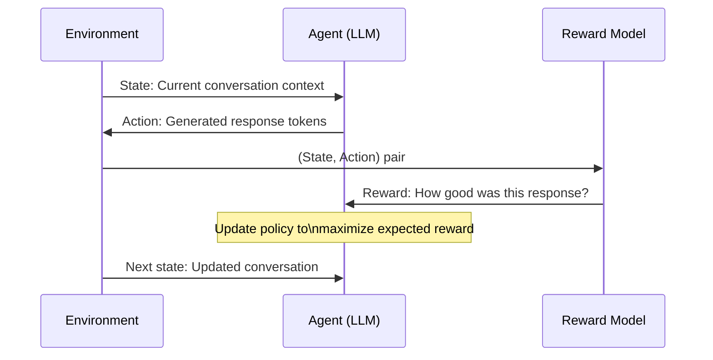

### RLHF Pipeline

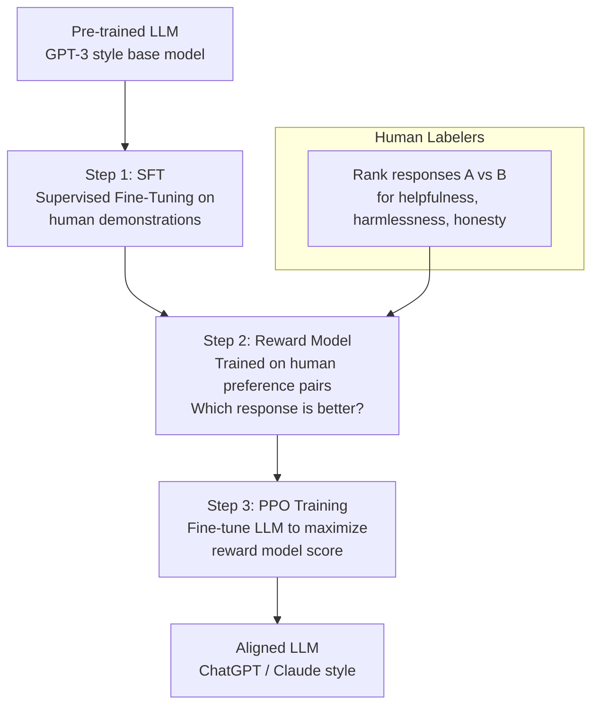

---

## 5. Internal Working

### RLHF Step by Step

**Step 1: Supervised Fine-Tuning (SFT)**
Human contractors write high-quality demonstrations of ideal responses. The LLM is fine-tuned on these demonstrations:
```
Input: "Explain quantum computing to a 10-year-old"
Output: "Imagine you have a magical coin that can be heads AND tails at the same time..."
```
This gives the model a good starting point for instruction following.

**Step 2: Reward Model Training**
Human labelers compare pairs of responses and choose the better one:
```
Response A: "Quantum computing is a type of computation..."  [More technical]
Response B: "Imagine a magical coin..."                      [More accessible]
Human preference: B > A for this prompt

Reward model learns: assign higher reward to responses like B
```

The reward model is trained on thousands of such comparisons. It learns to predict: "how much would a human prefer this response?"

**Step 3: PPO Fine-tuning**
The LLM's policy (its tendency to generate certain responses) is updated using Proximal Policy Optimization:
- The LLM generates a response
- The reward model scores it
- PPO updates the LLM weights to increase the probability of generating higher-reward responses
- A KL-divergence penalty prevents the LLM from drifting too far from its original behavior (avoiding "reward hacking")

---

## 6. Mathematical Intuition

### The RL Objective

The RL objective is to maximize expected cumulative reward:

```
J(π) = E[Σ_t γ^t × r_t]
```

Where:
- `π` is the policy (the model's strategy)
- `γ` (gamma) is the discount factor (0–1): how much we value future rewards vs. immediate rewards
- `r_t` is the reward at time step t

### KL Penalty in RLHF

RLHF adds a KL divergence penalty to prevent the model from gaming the reward:

```
Objective = E[r(x, y)] - β × KL[π_RL(y|x) || π_SFT(y|x)]
```

Where:
- `r(x, y)` = reward model score for response y given prompt x
- `π_RL` = current RL policy
- `π_SFT` = SFT base policy
- `β` = penalty coefficient
- `KL divergence` = how different the RL policy is from the SFT policy

Without the KL penalty, the model would find ways to maximize the reward that look very different from normal language — "reward hacking." The penalty keeps the model grounded.

---

## 7. Implementation

### Reward Model Training (Simplified)

```python
"""
Simplified reward model for response quality scoring.
Used in RLHF-style fine-tuning pipelines.

In production (OpenAI/Anthropic), this is a full neural network
fine-tuned from a pre-trained LLM. Here we show the concept
with a simpler classifier.
"""

from dataclasses import dataclass
from typing import List, Tuple
import numpy as np
from sklearn.linear_model import LogisticRegression
from openai import OpenAI

client = OpenAI()

@dataclass
class PreferencePair:
    """A human preference comparison between two responses."""
    prompt: str
    response_a: str
    response_b: str
    preferred: str  # "a" or "b"
    
    @property
    def winner(self) -> str:
        return self.response_a if self.preferred == "a" else self.response_b
    
    @property
    def loser(self) -> str:
        return self.response_b if self.preferred == "a" else self.response_a


class SimpleRewardModel:
    """
    A simple reward model trained on human preference pairs.
    
    Production reward models (OpenAI's RM) are fine-tuned LLMs.
    This demonstrates the concept with embedding-based features.
    """
    
    def __init__(self):
        self.classifier = LogisticRegression(C=1.0)
        self.is_trained = False
    
    def _get_features(self, prompt: str, response: str) -> np.ndarray:
        """
        Extract features for the reward prediction.
        In production: use the LLM's hidden states.
        Here: use embeddings as a proxy.
        """
        # Embed prompt + response concatenation
        text = f"Prompt: {prompt}\n\nResponse: {response}"
        response_emb = client.embeddings.create(
            input=text,
            model="text-embedding-3-small"
        )
        return np.array(response_emb.data[0].embedding)
    
    def train(self, preference_pairs: List[PreferencePair]):
        """
        Train on preference pairs.
        For each pair: winner gets label 1, loser gets label 0.
        """
        features = []
        labels = []
        
        for pair in preference_pairs:
            # Winner: positive example
            winner_features = self._get_features(pair.prompt, pair.winner)
            features.append(winner_features)
            labels.append(1)
            
            # Loser: negative example
            loser_features = self._get_features(pair.prompt, pair.loser)
            features.append(loser_features)
            labels.append(0)
        
        X = np.array(features)
        y = np.array(labels)
        
        self.classifier.fit(X, y)
        self.is_trained = True
    
    def score(self, prompt: str, response: str) -> float:
        """
        Score a response (0.0 = terrible, 1.0 = excellent).
        """
        features = self._get_features(prompt, response).reshape(1, -1)
        return float(self.classifier.predict_proba(features)[0, 1])
    
    def compare(self, prompt: str, response_a: str, response_b: str) -> str:
        """Which response is better?"""
        score_a = self.score(prompt, response_a)
        score_b = self.score(prompt, response_b)
        return "a" if score_a > score_b else "b"


# Using LLM-as-judge as an AI reward signal (RLAIF)
async def llm_reward_judge(
    prompt: str,
    response: str,
    criteria: List[str] = None
) -> float:
    """
    Use a powerful LLM as a reward model.
    This is the RLAIF approach — AI feedback instead of human feedback.
    """
    from openai import AsyncOpenAI
    import json
    
    client_a = AsyncOpenAI()
    
    if criteria is None:
        criteria = ["helpfulness", "accuracy", "clarity", "safety"]
    
    criteria_list = "\n".join(f"- {c}" for c in criteria)
    
    judge_response = await client_a.chat.completions.create(
        model="gpt-4o",
        messages=[{
            "role": "user",
            "content": f"""Rate this AI response on a scale of 1-10 for each criterion.

PROMPT: {prompt}
RESPONSE: {response}

Rate on:
{criteria_list}

Respond with JSON:
{{
    "scores": {{"helpfulness": 8, "accuracy": 9, "clarity": 7, "safety": 10}},
    "overall": 8.5,
    "reasoning": "brief explanation"
}}"""
        }],
        response_format={"type": "json_object"},
        temperature=0.0
    )
    
    result = json.loads(judge_response.choices[0].message.content)
    return result["overall"] / 10.0  # Normalize to 0-1
```

---

## 8. Tradeoffs

| RL Approach | Data Required | Computational Cost | Quality | Risk |
|---|---|---|---|---|
| RLHF | Human preference labels | Very high | Highest | Reward hacking |
| RLAIF | AI-generated preferences | High | High | AI bias amplification |
| Direct Preference Optimization (DPO) | Preference pairs | Lower than PPO | High | Simpler but less flexible |
| Constitutional AI | Rules + AI self-critique | Medium | High | Dependent on rule quality |

---

## 9. Interview Preparation

**Junior**: "RL learns through trial and error with rewards. RLHF uses human feedback to teach LLMs to be more helpful and aligned."

**Mid-level**: "RLHF has three stages: SFT on demonstrations, reward model training on preference pairs, and PPO fine-tuning to maximize the reward model. The KL divergence penalty prevents reward hacking. DPO is a simpler alternative to PPO that directly optimizes on preference data without a separate reward model."

**Senior**: "RLHF's reward hacking problem: if the reward model is imperfect (it is), the LLM will find responses that score high but aren't actually good — like being verbose, sycophantic, or confidently wrong. The KL penalty bounds this. Constitutional AI (Anthropic) adds an intermediate step where the model critiques and revises its own outputs before human/AI judgment. In practice, I understand that RLHF is why ChatGPT gives long, structured responses — it was rewarded for that pattern by labelers who liked it."

---

---

# Chapter 4: Bias and Variance

---

## 1. Introduction

### What Is the Bias-Variance Tradeoff?

The bias-variance tradeoff is one of the most fundamental concepts in machine learning. It explains why machine learning is hard and what goes wrong when a model doesn't generalize.

**Bias**: How far off are the model's predictions on average? High bias = the model consistently predicts wrong. The model is too simple to capture the true pattern.

**Variance**: How much do predictions vary if we train on different samples of data? High variance = the model is too sensitive to the specific training data. Small changes in training data cause large changes in predictions.

Every model has some combination of bias and variance, and reducing one often increases the other. This is the tradeoff.

---

## 2. Historical Motivation

### Why This Concept Was Formalized

In the 1990s, machine learning researchers noticed a puzzling phenomenon: complex models (neural networks, high-degree polynomials) often did worse on test data than on training data. Simple models generalized better in some cases.

Stuart Geman (1992) formally decomposed prediction error into three components:
1. **Irreducible error**: Noise in the data that no model can remove
2. **Bias**: Error from wrong assumptions
3. **Variance**: Error from sensitivity to training set fluctuations

This framework became the foundation for understanding overfitting and underfitting.

---

## 3. Real-World Analogy

Imagine you're trying to predict where a dart will land. You throw 10 darts and observe where they hit.

**High Bias, Low Variance** (Underfitting): All darts cluster together, but they all consistently miss the bullseye by the same amount. The thrower has a systematic error — they always aim left.

**Low Bias, High Variance** (Overfitting): The darts are centered around the bullseye on average, but they're scattered all over the board. Sometimes great, sometimes terrible — no consistency.

**Low Bias, Low Variance** (Goal): All darts cluster tightly around the bullseye. Accurate and consistent.

**High Bias, High Variance** (Worst case): Darts are scattered everywhere AND systematically off-center.

---

## 4. Visual Mental Model

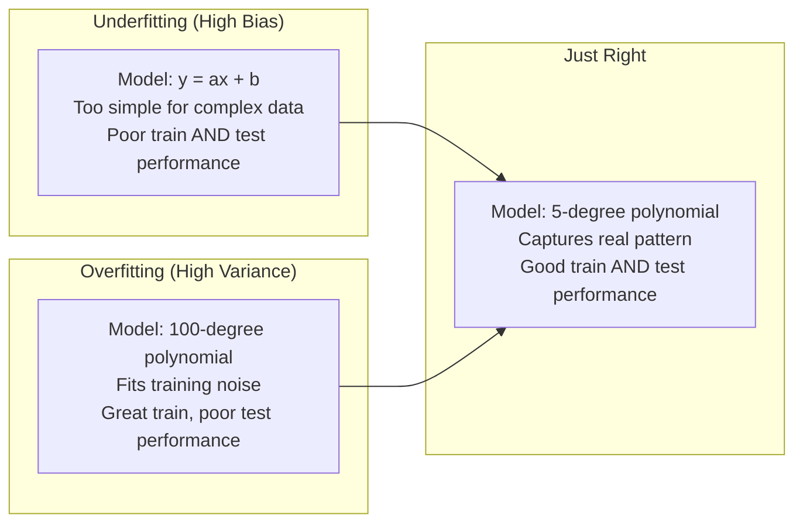

### Bias-Variance Decomposition

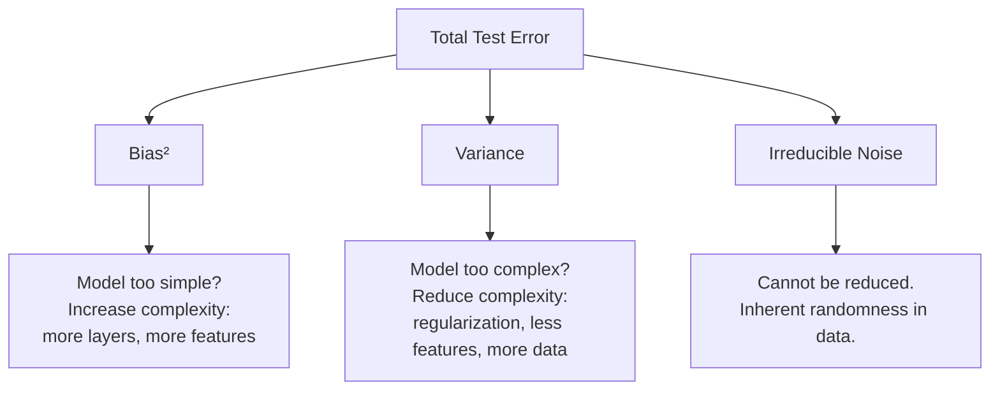

---

## 5. Internal Working

### Understanding Through the Bias-Variance Math

```python
"""
Demonstrating bias-variance tradeoff empirically.
We train models of different complexity and measure bias and variance.
"""

import numpy as np
import matplotlib.pyplot as plt
from sklearn.linear_model import LinearRegression
from sklearn.preprocessing import PolynomialFeatures
from sklearn.pipeline import Pipeline

def generate_data(n_samples: int = 100, noise: float = 0.5, seed: int = None) -> tuple:
    """Generate data from y = sin(x) + noise."""
    if seed:
        np.random.seed(seed)
    X = np.linspace(0, 2 * np.pi, n_samples).reshape(-1, 1)
    y = np.sin(X.ravel()) + np.random.normal(0, noise, n_samples)
    return X, y

def make_polynomial_model(degree: int) -> Pipeline:
    return Pipeline([
        ("poly", PolynomialFeatures(degree=degree, include_bias=False)),
        ("linear", LinearRegression())
    ])

def estimate_bias_variance(
    degree: int,
    n_experiments: int = 50,
    n_train: int = 50,
    n_test: int = 200
) -> tuple:
    """
    Estimate bias and variance empirically.
    
    Bias: average squared difference between mean prediction and true value
    Variance: average variance of predictions across experiments
    """
    X_test, y_true = generate_data(n_test, noise=0.0, seed=0)  # True function, no noise
    y_true = np.sin(X_test.ravel())
    
    all_predictions = []
    
    for i in range(n_experiments):
        # Different training set each time
        X_train, y_train = generate_data(n_train, noise=0.5, seed=i)
        
        model = make_polynomial_model(degree)
        model.fit(X_train, y_train)
        
        y_pred = model.predict(X_test)
        all_predictions.append(y_pred)
    
    all_predictions = np.array(all_predictions)  # (n_experiments, n_test)
    
    # Mean prediction across all experiments
    mean_prediction = all_predictions.mean(axis=0)
    
    # Bias²: how far is the mean prediction from truth?
    bias_squared = np.mean((mean_prediction - y_true) ** 2)
    
    # Variance: how much do predictions vary across experiments?
    variance = np.mean(all_predictions.var(axis=0))
    
    return bias_squared, variance

# Demonstrate the tradeoff
degrees = [1, 2, 3, 5, 10, 15, 20]
results = []

for degree in degrees:
    bias2, var = estimate_bias_variance(degree)
    results.append({
        "degree": degree,
        "bias_squared": bias2,
        "variance": var,
        "total_error": bias2 + var
    })
    print(f"Degree {degree:2d}: Bias²={bias2:.4f}, Variance={var:.4f}, Total={bias2+var:.4f}")
```

---

## 6. Mathematical Intuition

### The Formal Decomposition

For a model making predictions at point x, the expected test error is:

```
E[(y - ŷ)²] = Bias(ŷ)² + Var(ŷ) + σ²

Where:
  Bias(ŷ)  = E[ŷ] - f(x)          — how far is the average prediction from truth?
  Var(ŷ)   = E[(ŷ - E[ŷ])²]       — how much do predictions vary across training sets?
  σ²       = E[(y - f(x))²]        — irreducible noise in the data

Key insight:
  - Bias and Variance are not controllable independently
  - Reducing one (by changing model complexity) usually increases the other
  - More data helps: it reduces variance without increasing bias
  - The optimal model is where Bias² + Variance is minimized
```

---

## 7. Application to LLMs

### Bias and Variance in LLM Context

| Concept | Traditional ML | LLMs |
|---|---|---|
| High Bias | Underfitting, simple model | Model too small, undertrained, poor instruction following |
| High Variance | Overfitting, complex model | High temperature, sensitive to prompt wording |
| Reducing Bias | More complexity, more features | More parameters, more data, RLHF |
| Reducing Variance | Regularization, more data | Lower temperature, better prompt design, few-shot examples |

Temperature is essentially a variance control for LLMs:
- Temperature = 0: Zero variance (deterministic), but maximum bias toward the most common pattern
- Temperature = 1: Model variance matches training distribution
- Temperature > 1: Amplified variance

---

## 8. Interview Preparation

**Junior**: "Bias is when the model is systematically wrong. Variance is when the model is unstable — different training data gives very different results. Underfitting = high bias, overfitting = high variance."

**Mid-level**: "The bias-variance tradeoff means you can't simultaneously minimize both. More complex models reduce bias but increase variance. Adding more training data reduces variance without increasing bias — so more data is always good. For LLMs, temperature controls output variance; model size and training time control bias."

**Senior**: "In production AI systems, bias-variance manifests as: (1) Retrieval bias — RAG retrievers that systematically miss certain topic areas (high bias); (2) Generation variance — LLM outputs vary significantly for similar inputs (high variance); (3) Evaluation variance — LLM-as-judge scores vary depending on the order of presented options. Mitigations: bias → better retrieval evaluation + diverse training; variance → lower temperature, structured prompts, multiple samples + voting."

---

---

# Chapter 5: Overfitting and Regularization

---

## 1. Introduction

### What Is Overfitting?

Overfitting happens when a model learns the training data **too well** — including the random noise and peculiarities that exist only in the training set, not in the real world.

An overfitted model:
- Performs excellently on training data (memorizes it)
- Performs poorly on new, unseen data (doesn't generalize)

Think of a student who memorized every question from last year's exam. They ace last year's test. But they fail this year's test because the questions are slightly different and they never actually understood the material.

**Underfitting** is the opposite: the model is too simple to capture even the basic patterns in the training data. Poor on both training and test.

### Why Does It Happen?

Overfitting happens when:
1. **Model is too complex** relative to the amount of data
2. **Training for too many iterations** — the model has time to memorize
3. **Training data is unrepresentative** — doesn't cover the full distribution
4. **Features are too specific** — leak future information or are too granular

---

## 2. Real-World Analogy

Imagine hiring a customer service rep who memorizes every exact complaint they've ever received and its resolution.

A known customer asks: "My order arrived late." They reply perfectly — they memorize this case.

A new customer asks: "My delivery was delayed." They're stumped — this is "new" to them, even though it means the same thing.

An overfitted model is this rep. A well-generalized model understands "late delivery" as a concept and handles any phrasing of it.

---

## 3. Visual Mental Model

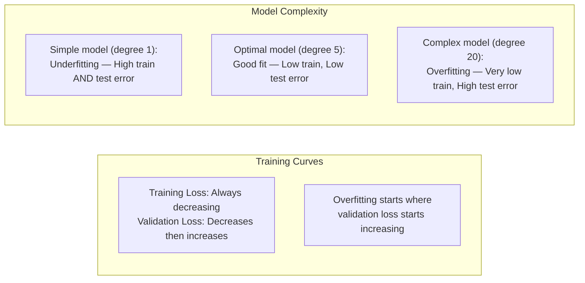

### Regularization Techniques

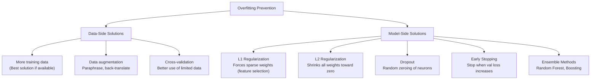

---

## 4. Internal Working

### Regularization in Detail

**L2 Regularization (Ridge)**
Add a penalty to the loss function for large weights:
```
L_reg = L_original + λ × Σ w²ᵢ
```

- The λ (lambda) controls how much we penalize large weights
- Large weights → overfitting (model is very specific to training data)
- L2 forces weights to be small, preventing any one feature from dominating
- Equivalent to placing a Gaussian prior on weights (Bayesian interpretation)

**L1 Regularization (Lasso)**
```
L_reg = L_original + λ × Σ |wᵢ|
```

- L1 pushes some weights to exactly zero → automatic feature selection
- Good when many features are irrelevant — L1 eliminates them
- L2 shrinks all weights; L1 eliminates some entirely

**Dropout (Neural Networks)**
During training, randomly set a fraction p of neurons to zero each forward pass.
- Forces the network to learn redundant representations
- No single neuron can rely on others being present → prevents co-adaptation
- At inference, multiply all weights by (1-p) to compensate

**Early Stopping**
Monitor validation loss during training. Stop when validation loss starts consistently increasing, even if training loss is still decreasing.

---

## 5. Implementation

```python
"""
Demonstrating overfitting detection and regularization techniques.
"""

import numpy as np
from sklearn.linear_model import Ridge, Lasso, LinearRegression
from sklearn.model_selection import cross_val_score, learning_curve
from sklearn.preprocessing import PolynomialFeatures
from sklearn.pipeline import Pipeline
import matplotlib.pyplot as plt

def train_with_regularization(X_train, y_train, X_test, y_test):
    """Compare models with different regularization strengths."""
    
    results = {}
    
    # No regularization (likely to overfit with complex features)
    no_reg = Pipeline([
        ("poly", PolynomialFeatures(degree=10)),
        ("linear", LinearRegression())
    ])
    no_reg.fit(X_train, y_train)
    results["No regularization"] = {
        "train_score": no_reg.score(X_train, y_train),
        "test_score": no_reg.score(X_test, y_test)
    }
    
    # Ridge (L2)
    for alpha in [0.1, 1.0, 10.0]:
        ridge = Pipeline([
            ("poly", PolynomialFeatures(degree=10)),
            ("linear", Ridge(alpha=alpha))
        ])
        ridge.fit(X_train, y_train)
        results[f"Ridge α={alpha}"] = {
            "train_score": ridge.score(X_train, y_train),
            "test_score": ridge.score(X_test, y_test)
        }
    
    # Lasso (L1)
    for alpha in [0.01, 0.1, 1.0]:
        lasso = Pipeline([
            ("poly", PolynomialFeatures(degree=10)),
            ("linear", Lasso(alpha=alpha, max_iter=10000))
        ])
        lasso.fit(X_train, y_train)
        results[f"Lasso α={alpha}"] = {
            "train_score": lasso.score(X_train, y_train),
            "test_score": lasso.score(X_test, y_test)
        }
    
    print(f"{'Model':<25} {'Train R²':>10} {'Test R²':>10}")
    print("-" * 47)
    for name, scores in results.items():
        print(f"{name:<25} {scores['train_score']:>10.4f} {scores['test_score']:>10.4f}")
    
    return results


def plot_learning_curves(model, X, y, model_name: str):
    """
    Learning curves show how model performance changes with training data size.
    
    Key insights:
    - Both train and test converge? → Properly fitted
    - Large gap between train and test? → Overfitting
    - Both curves high and flat? → Underfitting (need more complex model)
    """
    train_sizes, train_scores, val_scores = learning_curve(
        model, X, y,
        train_sizes=np.linspace(0.1, 1.0, 10),
        cv=5,
        scoring="neg_mean_squared_error",
        n_jobs=-1
    )
    
    train_mean = -train_scores.mean(axis=1)
    val_mean = -val_scores.mean(axis=1)
    
    plt.figure(figsize=(10, 6))
    plt.plot(train_sizes, train_mean, label="Training MSE", marker="o")
    plt.plot(train_sizes, val_mean, label="Validation MSE", marker="s")
    plt.fill_between(train_sizes, 
                     train_mean - train_scores.std(axis=1),
                     train_mean + train_scores.std(axis=1), alpha=0.1)
    plt.xlabel("Training Set Size")
    plt.ylabel("MSE")
    plt.title(f"Learning Curves: {model_name}")
    plt.legend()
    plt.show()


# Overfitting in LLM context: detecting over-fine-tuning
class FineTuningMonitor:
    """
    Monitor for overfitting during LLM fine-tuning.
    
    In LLM fine-tuning, overfitting signs:
    - Training loss decreasing but validation loss increasing
    - Model starts generating training examples verbatim
    - Performance on held-out test prompts degrades
    """
    
    def __init__(self, patience: int = 3):
        self.patience = patience
        self.best_val_loss = float("inf")
        self.epochs_without_improvement = 0
        self.train_losses = []
        self.val_losses = []
    
    def update(self, train_loss: float, val_loss: float, epoch: int) -> bool:
        """
        Update monitor with latest epoch metrics.
        Returns True if training should continue, False to stop (early stopping).
        """
        self.train_losses.append(train_loss)
        self.val_losses.append(val_loss)
        
        if val_loss < self.best_val_loss:
            self.best_val_loss = val_loss
            self.epochs_without_improvement = 0
            print(f"Epoch {epoch}: New best val_loss={val_loss:.4f} ✓")
            return True
        else:
            self.epochs_without_improvement += 1
            print(f"Epoch {epoch}: val_loss={val_loss:.4f} (no improvement for {self.epochs_without_improvement} epochs)")
            
            if self.epochs_without_improvement >= self.patience:
                print(f"Early stopping triggered! Val loss hasn't improved for {self.patience} epochs.")
                return False
        
        return True
    
    @property
    def is_overfitting(self) -> bool:
        """Check if current training shows overfitting signs."""
        if len(self.val_losses) < 3:
            return False
        recent_val = self.val_losses[-3:]
        return all(recent_val[i] < recent_val[i+1] for i in range(len(recent_val) - 1))
```

---

## 6. Tradeoffs

| Technique | Reduces Variance | Increases Bias | Computational Cost | Best Use Case |
|---|---|---|---|---|
| More data | Yes | No | High (collection cost) | Always the best if available |
| L1 (Lasso) | Yes | Slight | Low | Many irrelevant features |
| L2 (Ridge) | Yes | Slight | Low | All features relevant |
| Dropout | Yes | Slight | Medium | Neural networks |
| Early stopping | Yes | Slight | Low | Neural network training |
| Ensemble/Bagging | Yes | No | High | Tabular data, random forest |
| Cross-validation | Better estimation | None | Medium | Model selection |

---

## 7. Interview Preparation

**Junior**: "Overfitting is when the model memorizes training data but fails on new data. We detect it by comparing train vs. validation performance. We fix it with more data, regularization, or simpler models."

**Mid-level**: "Overfitting signs: train loss much lower than val loss; model performs perfectly on training set but poorly on held-out data. Solutions by priority: (1) More data — always the best; (2) Reduce model complexity; (3) L1/L2 regularization — penalizes large weights; (4) Dropout — forces redundant representations; (5) Early stopping — stop when validation degrades. For LLM fine-tuning, I track train loss vs. eval loss per epoch and apply early stopping with patience=3."

**Senior**: "In LLM fine-tuning, overfitting manifests as 'catastrophic forgetting' (model loses general ability by over-specializing) and 'memorization' (model repeats training examples). Mitigations: low learning rate to limit deviation from pre-trained weights, KL penalty (RLHF PPO), LoRA/adapters that modify only a small number of parameters, diverse training data to avoid distributional narrowing. I track: ROUGE/BERTScore on held-out eval set, diversity of generations, and performance on general capability benchmarks."

---

---

# Chapter 6: Evaluation Metrics

---

## 1. Introduction

### What Are Evaluation Metrics?

Evaluation metrics are how you measure a model's performance. They convert model outputs into numbers you can track, compare, and optimize.

Choosing the wrong metric can be catastrophic:
- Optimizing accuracy on imbalanced data → model that predicts the majority class always
- Optimizing BLEU for generation → stilted, unnatural text
- Optimizing perplexity alone → fluent but factually wrong LLM

The choice of metric must reflect your actual business objective.

### Two Categories

**Classification Metrics**: For models that output categories
- Accuracy, Precision, Recall, F1, AUC-ROC

**Regression Metrics**: For models that output numbers
- MAE, MSE, RMSE, R²

**Generation Metrics** (specific to LLMs):
- BLEU, ROUGE, BERTScore, Perplexity
- Faithfulness, Relevance, Coherence (LLM-as-judge)

---

## 2. Real-World Analogy

Imagine you're a doctor screening patients for a rare disease that affects 1% of the population.

**Accuracy**: "My model is 99% accurate!" — The model predicts "healthy" for everyone. 99% correct. But it catches zero sick patients. Useless.

**Precision**: "Of the patients I said were sick, 90% actually were." — How trustworthy are my positive predictions?

**Recall**: "Of all actually sick patients, I caught 80% of them." — How many sick patients did I miss?

**F1**: Balances precision and recall — the harmonic mean.

For disease screening, **recall** is critical (missing a sick patient is very bad). For spam detection, **precision** might matter more (putting a legitimate email in spam is very annoying).

The point: different use cases require different metrics.

---

## 3. Visual Mental Model

### The Confusion Matrix

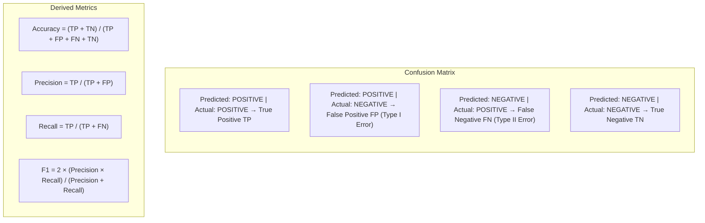

### The Precision-Recall Tradeoff

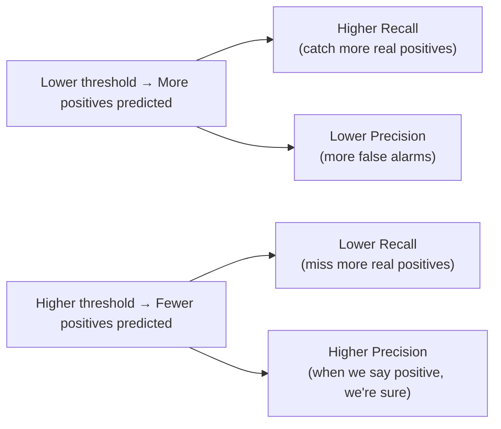

---

## 4. Mathematical Intuition

### All Classification Metrics Explained

```
Given: TP=90, FP=10, FN=20, TN=880 (disease screening example)
Total = 1000 patients

Accuracy    = (TP + TN) / Total = (90 + 880) / 1000 = 97.0%
              ↑ Misleading! 99% of predictions are TN.

Precision   = TP / (TP + FP) = 90 / (90 + 10) = 90.0%
              "Of patients we said are sick, 90% are"

Recall      = TP / (TP + FN) = 90 / (90 + 20) = 81.8%
(Sensitivity)  "We caught 81.8% of all sick patients"

Specificity = TN / (TN + FP) = 880 / (880 + 10) = 98.9%
              "Of healthy patients, we correctly identified 98.9%"

F1 Score    = 2 × (Precision × Recall) / (Precision + Recall)
            = 2 × (0.9 × 0.818) / (0.9 + 0.818) = 85.7%
              "Harmonic mean of Precision and Recall"

AUC-ROC:    Area Under the ROC Curve
            ROC curve: True Positive Rate vs. False Positive Rate at different thresholds
            AUC = 1.0: Perfect classifier
            AUC = 0.5: Random classifier
            AUC = 0.0: Perfectly wrong classifier (useful if inverted!)
```

### Regression Metrics

```
Given: True values y = [3, 4, 5], Predictions ŷ = [2.5, 4.2, 4.8]

MAE = (1/N) × Σ |y - ŷ| = (0.5 + 0.2 + 0.2) / 3 = 0.3
      "On average, we're off by 0.3 units"
      Less sensitive to outliers than MSE.

MSE = (1/N) × Σ (y - ŷ)² = (0.25 + 0.04 + 0.04) / 3 = 0.11
      "Average squared error"
      Penalizes large errors heavily.

RMSE = √MSE = √0.11 ≈ 0.33
       "Typical error in same units as target"

R² = 1 - (Σ(y - ŷ)²) / (Σ(y - ȳ)²)
   "What fraction of variance is explained by the model?"
   R²=1.0: Perfect. R²=0: No better than predicting the mean. R²<0: Worse than the mean.
```

---

## 5. Implementation

### Evaluation Suite for AI Systems

```python
"""
Comprehensive evaluation suite for AI/LLM systems.
Covers classification, regression, and generation metrics.
"""

import numpy as np
from typing import List, Dict, Optional, Callable
from sklearn.metrics import (
    classification_report, roc_auc_score,
    precision_recall_curve, average_precision_score,
    mean_absolute_error, mean_squared_error, r2_score,
    confusion_matrix
)
import json
import asyncio
from openai import AsyncOpenAI

# ─── Classification Evaluation ─────────────────────────────────────────────

def evaluate_classifier(
    y_true: List[int],
    y_pred: List[int],
    y_prob: Optional[List[float]] = None,
    class_names: Optional[List[str]] = None
) -> Dict:
    """
    Comprehensive classifier evaluation.
    
    Args:
        y_true: True labels
        y_pred: Predicted labels
        y_prob: Predicted probabilities for positive class (for AUC)
        class_names: Names for each class
    """
    results = {}
    
    # Basic metrics
    cm = confusion_matrix(y_true, y_pred)
    tn, fp, fn, tp = cm.ravel() if cm.shape == (2, 2) else (None,)*4
    
    if tp is not None:
        results["true_positives"] = int(tp)
        results["false_positives"] = int(fp)
        results["false_negatives"] = int(fn)
        results["true_negatives"] = int(tn)
        results["precision"] = tp / (tp + fp) if (tp + fp) > 0 else 0.0
        results["recall"] = tp / (tp + fn) if (tp + fn) > 0 else 0.0
        results["f1"] = (2 * results["precision"] * results["recall"]) / \
                       (results["precision"] + results["recall"]) \
                       if (results["precision"] + results["recall"]) > 0 else 0.0
    
    results["accuracy"] = np.mean(np.array(y_true) == np.array(y_pred))
    
    # AUC-ROC (requires probability scores)
    if y_prob is not None:
        results["roc_auc"] = roc_auc_score(y_true, y_prob)
        results["avg_precision"] = average_precision_score(y_true, y_prob)
    
    # Detailed per-class report
    results["classification_report"] = classification_report(
        y_true, y_pred,
        target_names=class_names,
        output_dict=True
    )
    
    return results


# ─── Retrieval Evaluation (for RAG) ────────────────────────────────────────

def precision_at_k(relevant: List[str], retrieved: List[str], k: int) -> float:
    """
    Precision@K: Of the top K retrieved documents, what fraction are relevant?
    """
    retrieved_at_k = set(retrieved[:k])
    relevant_set = set(relevant)
    return len(retrieved_at_k & relevant_set) / k if k > 0 else 0.0

def recall_at_k(relevant: List[str], retrieved: List[str], k: int) -> float:
    """
    Recall@K: Of all relevant documents, what fraction are in top K?
    """
    retrieved_at_k = set(retrieved[:k])
    relevant_set = set(relevant)
    return len(retrieved_at_k & relevant_set) / len(relevant_set) if relevant_set else 0.0

def mean_reciprocal_rank(relevant: List[str], retrieved: List[str]) -> float:
    """
    MRR: Reciprocal of the rank of the first relevant document.
    MRR=1.0: Relevant doc is at rank 1
    MRR=0.5: Relevant doc is at rank 2
    MRR=0.33: Relevant doc is at rank 3
    """
    for i, doc_id in enumerate(retrieved):
        if doc_id in relevant:
            return 1.0 / (i + 1)
    return 0.0

def ndcg_at_k(relevant: List[str], retrieved: List[str], k: int) -> float:
    """
    NDCG@K: Normalized Discounted Cumulative Gain.
    Penalizes relevant documents appearing later in the ranked list.
    Standard metric for search/retrieval quality.
    """
    def dcg(retrieved_k):
        score = 0.0
        for i, doc in enumerate(retrieved_k[:k]):
            relevance = 1.0 if doc in relevant else 0.0
            score += relevance / np.log2(i + 2)  # +2 because log2(1) = 0
        return score
    
    actual_dcg = dcg(retrieved)
    ideal_retrieved = [doc for doc in relevant if doc in retrieved] + \
                      [doc for doc in retrieved if doc not in relevant]
    ideal_dcg = dcg(ideal_retrieved)
    
    return actual_dcg / ideal_dcg if ideal_dcg > 0 else 0.0

def evaluate_retrieval(
    queries: List[Dict],  # [{"query": str, "relevant_doc_ids": List[str]}]
    retriever_fn: Callable,
    k_values: List[int] = [1, 5, 10]
) -> Dict:
    """
    Evaluate a retriever across multiple queries.
    """
    all_results = {f"P@{k}": [] for k in k_values}
    all_results.update({f"R@{k}": [] for k in k_values})
    all_results.update({f"NDCG@{k}": [] for k in k_values})
    all_results["MRR"] = []
    
    for query_item in queries:
        query = query_item["query"]
        relevant = query_item["relevant_doc_ids"]
        
        retrieved = retriever_fn(query)  # Returns list of doc IDs
        
        all_results["MRR"].append(mean_reciprocal_rank(relevant, retrieved))
        
        for k in k_values:
            all_results[f"P@{k}"].append(precision_at_k(relevant, retrieved, k))
            all_results[f"R@{k}"].append(recall_at_k(relevant, retrieved, k))
            all_results[f"NDCG@{k}"].append(ndcg_at_k(relevant, retrieved, k))
    
    # Average across all queries
    return {metric: np.mean(values) for metric, values in all_results.items()}


# ─── LLM Generation Evaluation ─────────────────────────────────────────────

class LLMEvaluator:
    """
    Evaluation suite for LLM-generated outputs.
    Combines automatic metrics with LLM-as-judge.
    """
    
    def __init__(self, judge_model: str = "gpt-4o"):
        self.client = AsyncOpenAI()
        self.judge_model = judge_model
    
    def compute_rouge_scores(self, reference: str, hypothesis: str) -> Dict:
        """
        ROUGE: Recall-Oriented Understudy for Gisting Evaluation.
        Measures n-gram overlap between reference and generated text.
        pip install rouge-score
        """
        from rouge_score import rouge_scorer
        
        scorer = rouge_scorer.RougeScorer(
            ["rouge1", "rouge2", "rougeL"],
            use_stemmer=True
        )
        scores = scorer.score(reference, hypothesis)
        
        return {
            "rouge1_precision": scores["rouge1"].precision,
            "rouge1_recall": scores["rouge1"].recall,
            "rouge1_f1": scores["rouge1"].fmeasure,
            "rouge2_f1": scores["rouge2"].fmeasure,
            "rougeL_f1": scores["rougeL"].fmeasure,
        }
    
    async def llm_judge(
        self,
        question: str,
        reference_answer: str,
        generated_answer: str,
        criteria: List[str] = None
    ) -> Dict:
        """
        Use an LLM to judge the quality of generated answers.
        More nuanced than ROUGE — captures semantic quality.
        """
        if criteria is None:
            criteria = ["faithfulness", "relevance", "completeness", "clarity"]
        
        prompt = f"""You are an expert evaluator. Score the Generated Answer against the Reference Answer.

QUESTION: {question}
REFERENCE ANSWER: {reference_answer}
GENERATED ANSWER: {generated_answer}

Score each criterion from 0.0 to 1.0:
{json.dumps(criteria)}

Return ONLY valid JSON:
{{
    "scores": {{{', '.join(f'"{c}": 0.0' for c in criteria)}}},
    "overall": 0.0,
    "feedback": "brief explanation of scores"
}}"""
        
        response = await self.client.chat.completions.create(
            model=self.judge_model,
            messages=[{"role": "user", "content": prompt}],
            response_format={"type": "json_object"},
            temperature=0.0
        )
        
        return json.loads(response.choices[0].message.content)
    
    async def evaluate_rag_pipeline(
        self,
        test_cases: List[Dict],  # [{"question", "reference_answer", "context"}]
        pipeline_fn: Callable
    ) -> Dict:
        """
        Comprehensive RAG pipeline evaluation.
        Runs all test cases and aggregates metrics.
        """
        all_scores = []
        all_rouge = []
        
        for case in test_cases:
            # Get pipeline output
            generated = await pipeline_fn(case["question"], case.get("context", ""))
            
            # LLM Judge
            judge_scores = await self.llm_judge(
                question=case["question"],
                reference_answer=case["reference_answer"],
                generated_answer=generated
            )
            all_scores.append(judge_scores["scores"])
            
            # ROUGE
            rouge = self.compute_rouge_scores(
                reference=case["reference_answer"],
                hypothesis=generated
            )
            all_rouge.append(rouge)
        
        # Aggregate
        criteria = list(all_scores[0].keys()) if all_scores else []
        
        avg_judge_scores = {
            criterion: np.mean([s[criterion] for s in all_scores])
            for criterion in criteria
        }
        
        avg_rouge = {
            metric: np.mean([r[metric] for r in all_rouge])
            for metric in (all_rouge[0].keys() if all_rouge else [])
        }
        
        return {
            "llm_judge_scores": avg_judge_scores,
            "rouge_scores": avg_rouge,
            "n_test_cases": len(test_cases)
        }
```

---

## 6. Production Architecture

### Evaluation Pipeline for Production AI Systems

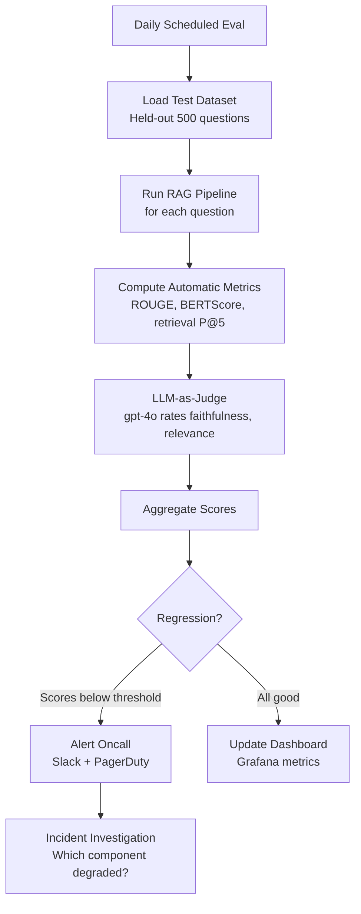

---

## 7. Key Metrics Reference

| Task | Primary Metric | Secondary Metrics | Why |
|---|---|---|---|
| Binary classification | F1 or AUC-ROC | Precision, Recall | Handles class imbalance |
| Multi-class classification | Macro F1 | Per-class F1 | Equal weight per class |
| Regression | MAE | RMSE, R² | MAE is more interpretable |
| Information retrieval | NDCG@10 | P@K, MRR | Standard search metric |
| Summarization | ROUGE-L | BERTScore | Measures coverage and fluency |
| LLM QA | Faithfulness (LLM judge) | Relevance, ROUGE | Most business-critical |
| Similarity/ranking | Spearman correlation | Kendall's tau | Rank correlation |

---

## 8. Common Mistakes

❌ **Using accuracy for imbalanced classification**: If 99% of examples are class 0, a model predicting 0 always gets 99% accuracy. Use F1, AUC, or precision-recall curves.

❌ **Using BLEU/ROUGE as the only generation metric**: These measure n-gram overlap, not semantic quality. A response can be semantically correct but have low BLEU (different wording). Always combine with LLM-as-judge.

❌ **Evaluating on training data**: Your model has memorized training data. It's not a real performance estimate.

❌ **Not separating development and test sets**: If you tune your model based on test set performance, you've overfitted to the test set. Keep it untouched until final evaluation.

❌ **Ignoring confidence calibration**: A model that's right 70% of the time when it says "99% confident" is poorly calibrated. In AI systems, wrong but confident outputs are more dangerous than uncertain ones.

---

## 9. Interview Preparation

**Junior**: "Accuracy is how often the model is correct. Precision is how often positive predictions are actually positive. Recall is how often actual positives are caught. F1 balances precision and recall."

**Mid-level**: "I choose metrics based on the business objective. For spam detection: high precision (don't put real emails in spam). For disease screening: high recall (don't miss sick patients). For RAG evaluation: faithfulness (LLM-as-judge), NDCG@10 for retrieval. I always look at the full precision-recall curve, not just a single threshold."

**Senior**: "For production AI systems, I define three evaluation layers: (1) Automated metrics run on CI (ROUGE, retrieval metrics, latency); (2) LLM-as-judge evaluations on a held-out test set (faithfulness, relevance, coherence) run daily; (3) Human evaluation benchmarks quarterly for deep quality assessment. Regression alerts fire when any metric drops >5% from baseline. I instrument each pipeline component separately — so I can isolate whether a quality drop comes from retrieval, reranking, or generation."

---

---

# Chapter 7: Feature Engineering

---

## 1. Introduction

### What Is Feature Engineering?

Feature engineering is the process of transforming raw data into representations that machine learning algorithms can use effectively.

A raw data point (an email text, a user query, a document) is not directly usable by most traditional ML algorithms. Feature engineering converts it into numbers that capture the relevant patterns.

For AI engineers, feature engineering matters because:
- Traditional ML models (for intent classification, reranking) need features
- Embedding models are a form of automated feature engineering
- RAG pipeline metadata filtering uses engineered features
- LLM fine-tuning data preparation involves feature engineering choices
- Understanding feature engineering helps you understand what embeddings are doing

### Types of Features

- **Lexical features**: Word counts, n-gram frequencies, TF-IDF
- **Semantic features**: Embedding vectors, topic distributions
- **Statistical features**: Mean, variance, length, entropy
- **Structural features**: HTML tags, code syntax, heading depth
- **Temporal features**: Day of week, recency, trending

---

## 2. Historical Motivation

### The Pre-Embedding Era

Before neural embeddings (pre-2013), feature engineering was the entire job of an NLP engineer. Good features meant good models.

**Bag of Words (BoW)**: Represent a document as a vector of word counts. Simple but loses order. A document with "not good" and "good not" looks the same.

**TF-IDF**: Weight words by how often they appear in this document vs. all documents. "the" appears everywhere → low weight. "transformer" appears rarely → high weight if in a document.

**N-grams**: Sequences of N words. "machine learning" as a bigram captures the phrase's meaning that "machine" and "learning" separately don't.

Neural networks and embeddings automated much of this feature engineering. But the concepts still underpin how embeddings work and why they're powerful.

---

## 3. Real-World Analogy

Feature engineering is like **preparing ingredients before cooking**.

Raw data is like raw vegetables. You can't put a whole carrot in a soup — you chop it (tokenize), maybe peel it (clean text), cut it into consistent sizes (normalize), and maybe roast it first to enhance flavor (create derived features).

The same carrot prepared differently gives completely different results in the final dish. Feature engineering is what separates a good ML system from a great one — even with the same model.

---

## 4. Visual Mental Model

### Feature Engineering Pipeline

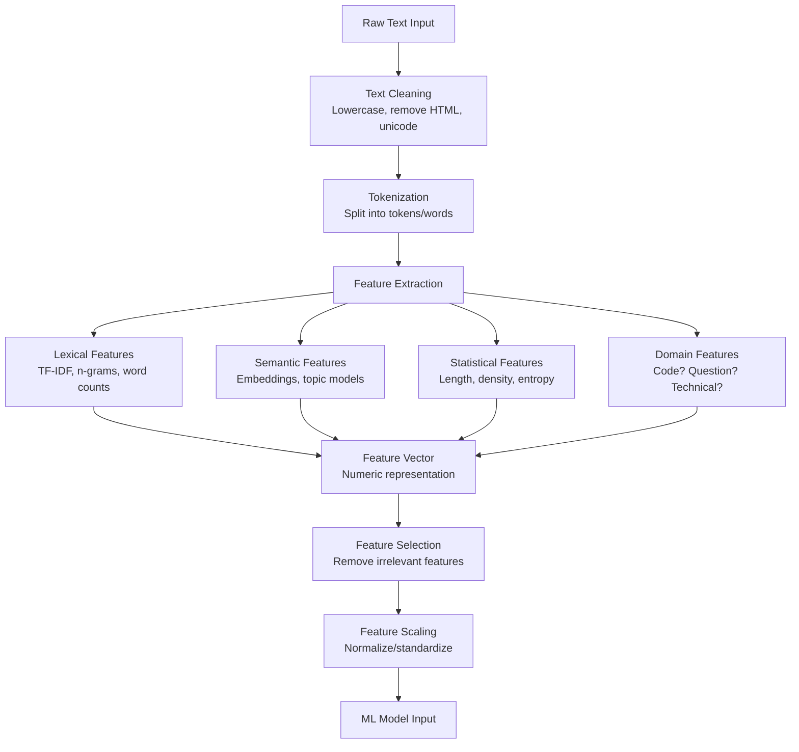

---

## 5. Implementation

### Comprehensive Feature Engineering for RAG Systems

```python
"""
Feature engineering for AI/RAG applications.
Demonstrates: TF-IDF, embeddings, hybrid features.
"""

import re
import math
import numpy as np
from typing import List, Dict, Optional, Tuple
from collections import Counter
from dataclasses import dataclass, field
from sklearn.feature_extraction.text import TfidfVectorizer
from sklearn.preprocessing import StandardScaler, MinMaxScaler

@dataclass
class DocumentFeatures:
    """Structured feature set for a document."""
    
    # Lexical features
    word_count: int = 0
    unique_word_count: int = 0
    avg_word_length: float = 0.0
    vocabulary_richness: float = 0.0  # unique_words / total_words
    
    # Content features
    contains_code: bool = False
    contains_urls: int = 0
    contains_numbers: int = 0
    question_count: int = 0
    
    # Quality signals
    has_headers: bool = False
    bullet_point_count: int = 0
    paragraph_count: int = 0
    
    # TF-IDF features (sparse — many dimensions)
    tfidf_vector: Optional[np.ndarray] = field(default=None, repr=False)
    
    # Dense semantic embedding
    embedding: Optional[np.ndarray] = field(default=None, repr=False)

class TextFeatureEngineer:
    """
    Comprehensive text feature engineering for AI applications.
    
    Produces both sparse (TF-IDF) and dense (embedding) features,
    plus hand-crafted statistical features.
    """
    
    def __init__(
        self,
        max_tfidf_features: int = 10000,
        embedding_model: Optional[str] = "text-embedding-3-small"
    ):
        self.tfidf = TfidfVectorizer(
            max_features=max_tfidf_features,
            ngram_range=(1, 2),        # Unigrams and bigrams
            stop_words="english",
            sublinear_tf=True,         # Use log(1 + tf) instead of raw tf
            min_df=2,                  # Ignore terms appearing in < 2 docs
            max_df=0.95                # Ignore terms in > 95% of docs
        )
        self.scaler = StandardScaler()
        self.embedding_model = embedding_model
        self.is_fitted = False
    
    def clean_text(self, text: str) -> str:
        """Basic text cleaning pipeline."""
        # Remove HTML tags
        text = re.sub(r"<[^>]+>", " ", text)
        # Normalize whitespace
        text = re.sub(r"\s+", " ", text)
        # Normalize quotes
        text = text.replace("\u201c", '"').replace("\u201d", '"')
        return text.strip()
    
    def extract_statistical_features(self, text: str) -> Dict[str, float]:
        """Extract hand-crafted statistical features."""
        words = text.lower().split()
        sentences = re.split(r"[.!?]+", text)
        
        features = {}
        
        # Word-level
        features["word_count"] = len(words)
        features["unique_word_ratio"] = len(set(words)) / max(len(words), 1)
        features["avg_word_length"] = np.mean([len(w) for w in words]) if words else 0
        
        # Sentence-level
        features["sentence_count"] = len([s for s in sentences if s.strip()])
        features["avg_sentence_length"] = len(words) / max(features["sentence_count"], 1)
        
        # Content type signals
        features["contains_code"] = float(bool(re.search(r"```|def |class |import |print\(", text)))
        features["url_count"] = len(re.findall(r"http[s]?://\S+", text))
        features["question_count"] = text.count("?")
        features["exclamation_count"] = text.count("!")
        
        # Formatting signals
        features["has_headers"] = float(bool(re.search(r"^#{1,6}\s", text, re.MULTILINE)))
        features["bullet_count"] = len(re.findall(r"^[-*•]\s", text, re.MULTILINE))
        features["number_count"] = len(re.findall(r"\b\d+\b", text))
        
        # Lexical diversity (vocabulary richness)
        if words:
            features["type_token_ratio"] = len(set(words)) / len(words)
        else:
            features["type_token_ratio"] = 0.0
        
        return features
    
    def fit(self, documents: List[str]) -> "TextFeatureEngineer":
        """Fit TF-IDF and scaler on training corpus."""
        cleaned = [self.clean_text(doc) for doc in documents]
        
        # Fit TF-IDF
        self.tfidf.fit(cleaned)
        
        # Fit scaler on statistical features
        stat_features = [
            list(self.extract_statistical_features(doc).values())
            for doc in cleaned
        ]
        self.scaler.fit(stat_features)
        
        self.is_fitted = True
        return self
    
    def transform(
        self,
        documents: List[str],
        use_embeddings: bool = True
    ) -> np.ndarray:
        """
        Transform documents into feature vectors.
        
        Combines:
        1. Statistical features (scaled)
        2. TF-IDF sparse features (dense top-N)
        3. Dense embeddings (optional, requires API call)
        """
        if not self.is_fitted:
            raise RuntimeError("Call fit() first")
        
        cleaned = [self.clean_text(doc) for doc in documents]
        
        # 1. Statistical features
        stat_features = np.array([
            list(self.extract_statistical_features(doc).values())
            for doc in cleaned
        ])
        stat_scaled = self.scaler.transform(stat_features)
        
        # 2. TF-IDF features (sparse, convert to dense via truncation)
        tfidf_matrix = self.tfidf.transform(cleaned).toarray()
        
        # Combine
        combined = np.hstack([stat_scaled, tfidf_matrix])
        
        # 3. Optionally add dense embeddings
        if use_embeddings and self.embedding_model:
            from openai import OpenAI
            client = OpenAI()
            response = client.embeddings.create(
                input=cleaned,
                model=self.embedding_model
            )
            embeddings = np.array([
                item.embedding for item in sorted(response.data, key=lambda x: x.index)
            ])
            combined = np.hstack([combined, embeddings])
        
        return combined
    
    def get_top_tfidf_terms(
        self,
        document: str,
        top_n: int = 10
    ) -> List[Tuple[str, float]]:
        """Get the most important TF-IDF terms for a document."""
        cleaned = self.clean_text(document)
        vector = self.tfidf.transform([cleaned])
        
        feature_names = self.tfidf.get_feature_names_out()
        scores = vector.toarray()[0]
        
        top_indices = np.argsort(scores)[-top_n:][::-1]
        return [(feature_names[i], scores[i]) for i in top_indices if scores[i] > 0]


# ─── Feature Engineering for Query-Document Pairs (RAG) ────────────────────

class QueryDocumentFeatureEngineer:
    """
    Engineer features for (query, document) relevance prediction.
    
    Used to train supervised rerankers in RAG pipelines.
    """
    
    def extract_interaction_features(
        self,
        query: str,
        document: str
    ) -> Dict[str, float]:
        """
        Features that capture the relationship between query and document.
        These are the most important features for relevance prediction.
        """
        q_words = set(query.lower().split())
        d_words = set(document.lower().split())
        
        # Lexical overlap features
        intersection = q_words & d_words
        union = q_words | d_words
        
        features = {
            # Query coverage: how much of the query appears in the document?
            "query_coverage": len(intersection) / max(len(q_words), 1),
            
            # Document coverage: how much of the document is about the query?
            "document_coverage": len(intersection) / max(len(d_words), 1),
            
            # Jaccard similarity
            "jaccard": len(intersection) / max(len(union), 1),
            
            # Document length features
            "doc_word_count": len(d_words),
            "query_word_count": len(q_words),
            "length_ratio": len(d_words) / max(len(q_words), 1),
            
            # Query term density in document
            "query_term_density": sum(
                document.lower().count(word)
                for word in q_words
            ) / max(len(document.split()), 1),
            
            # Position of first query term in document (earlier = more relevant)
            "first_match_position": self._first_match_position(q_words, document),
        }
        
        return features
    
    def _first_match_position(self, query_words: set, document: str) -> float:
        """Normalized position (0-1) of first query word in document."""
        doc_words = document.lower().split()
        for i, word in enumerate(doc_words):
            if word in query_words:
                return i / max(len(doc_words), 1)
        return 1.0  # No match found → end of document
    
    def bm25_score(
        self,
        query: str,
        document: str,
        corpus_stats: Dict,
        k1: float = 1.5,
        b: float = 0.75
    ) -> float:
        """
        BM25 (Best Match 25) relevance score.
        
        The gold standard sparse retrieval algorithm.
        Better than simple TF-IDF because it:
        1. Saturates term frequency (diminishing returns)
        2. Normalizes by document length
        """
        q_terms = query.lower().split()
        d_terms = document.lower().split()
        d_len = len(d_terms)
        avg_d_len = corpus_stats.get("avg_doc_length", 100)
        N = corpus_stats.get("n_documents", 1000)
        
        term_freq = Counter(d_terms)
        score = 0.0
        
        for term in q_terms:
            tf = term_freq.get(term, 0)
            df = corpus_stats.get("doc_freq", {}).get(term, 0)
            
            if df == 0 or tf == 0:
                continue
            
            # IDF component
            idf = math.log((N - df + 0.5) / (df + 0.5) + 1)
            
            # TF component with saturation and length normalization
            tf_normalized = tf * (k1 + 1) / (tf + k1 * (1 - b + b * d_len / avg_d_len))
            
            score += idf * tf_normalized
        
        return score
```

---

## 6. Tradeoffs

| Feature Type | Captures | Misses | Cost | Best For |
|---|---|---|---|---|
| Bag of Words | Keyword presence | Order, semantics | None | Fast baseline |
| TF-IDF | Importance weighting | Semantics, context | None | Lexical search |
| N-grams | Phrases | Long-range context | Storage | Phrase matching |
| BM25 | Length-normalized TF-IDF | Semantics | None | Keyword retrieval |
| Dense Embeddings | Semantic similarity | Exact keywords | API cost | Semantic search |
| Hybrid | Both lexical + semantic | Very little | Medium | Production RAG |

---

## 7. Interview Preparation

**Junior**: "Feature engineering transforms raw data into numbers. TF-IDF weighs words by how unique they are to a document. Embeddings capture semantic meaning."

**Mid-level**: "For RAG, I use BM25 for sparse retrieval (lexical match) combined with dense embeddings for semantic retrieval — hybrid search. For reranking, I engineer interaction features: query coverage (how much of the query appears in the doc), BM25 score, and cosine similarity between embeddings. Feature scaling is critical — StandardScaler before training linear models."

**Senior**: "Feature engineering choices determine model ceiling. For LLM-adjacent tasks: embeddings are automated feature engineering that captures semantics. But for structured signals (document freshness, source authority, user history), hand-crafted features still outperform pure embedding approaches. In production RAG, I combine embedding similarity, BM25 score, document recency, source authority rank, and user interaction history as features for a learned reranker — each captures different relevance signals that embeddings alone miss."

---

## 8. Follow-up Questions

**Q1: What is the difference between TF-IDF and BM25?**
> TF-IDF weights terms by their document frequency but doesn't normalize for document length. Long documents get artificially high TF scores. BM25 adds: (1) TF saturation — doubling term frequency doesn't double score; (2) document length normalization — longer documents are penalized. BM25 is empirically better for most retrieval tasks and is the default in Elasticsearch.

**Q2: What is feature scaling and why is it necessary?**
> Scaling transforms features to the same magnitude range. Without it: word count (0–10,000) dominates distance calculations over binary features (0 or 1). StandardScaler: subtract mean, divide by std. MinMaxScaler: scale to [0,1]. Tree models (Random Forest, XGBoost) don't need scaling. Distance/gradient-based models (Logistic Regression, SVM, KNN, Neural Networks) require it.

**Q3: What is the curse of dimensionality?**
> As the number of features (dimensions) grows, the volume of the space grows exponentially. Data becomes increasingly sparse. "Nearest neighbors" in 1000 dimensions are almost as far as "farthest neighbors" — distance becomes meaningless. Solution: dimensionality reduction (PCA, UMAP), feature selection, or use algorithms designed for high dimensions (tree-based models, neural networks).

**Q4: What is feature leakage and why is it catastrophic?**
> Feature leakage is when features contain information from the future or from the test set, creating artificially high training metrics that don't hold in production. Example: including "was this query answered successfully?" as a feature when predicting "will this query be answered successfully?" The label leaked into the features. Always check: could this feature have existed at prediction time?

**Q5: How do you handle categorical features with many unique values (high cardinality)?**
> Options: (1) Target encoding: replace category with mean target value (risk: leakage); (2) Embedding: learn a dense representation (modern approach); (3) Hashing: deterministically map categories to a fixed number of buckets; (4) Frequency encoding: replace with category frequency; (5) Rare category grouping: group low-frequency categories into "other". For LLM applications, text categories are usually handled by embeddings.

---

## 9. Practical Scenario

### Scenario: Building Hybrid Search for an Enterprise RAG System

**Context**: A law firm's AI assistant must retrieve case law relevant to user queries. Pure semantic search misses exact statute references. Pure BM25 misses synonyms.

**Solution**: Feature engineering for hybrid retrieval.

```python
class LegalDocumentRetriever:
    """
    Hybrid retriever combining BM25 (lexical) + embeddings (semantic)
    with legal-domain-specific features.
    """
    
    def __init__(self):
        from rank_bm25 import BM25Okapi  # pip install rank-bm25
        self.bm25_index = None
        self.embeddings_index = None
        self.documents = []
        
        # Legal-domain features
        self.statute_pattern = re.compile(r"\d+\s+U\.?S\.?C\.?\s+§+\s*\d+")
        self.citation_pattern = re.compile(r"\d+\s+[A-Z][a-z]+\.?\s+\d+")
    
    def index(self, documents: List[str]):
        from rank_bm25 import BM25Okapi
        
        tokenized = [doc.lower().split() for doc in documents]
        self.bm25_index = BM25Okapi(tokenized)
        self.documents = documents
    
    def extract_legal_features(self, query: str, document: str) -> Dict[str, float]:
        """Legal-domain-specific features that embeddings miss."""
        return {
            # Exact statute citation match
            "statute_match": float(
                bool(self.statute_pattern.search(query)) and
                bool(self.statute_pattern.search(document))
            ),
            # Case citation overlap
            "citation_overlap": len(
                set(self.citation_pattern.findall(query)) &
                set(self.citation_pattern.findall(document))
            ),
        }
    
    def retrieve(self, query: str, top_k: int = 10) -> List[Tuple[float, str]]:
        # BM25 scores (lexical)
        tokenized_query = query.lower().split()
        bm25_scores = self.bm25_index.get_scores(tokenized_query)
        
        # Normalize BM25 scores to [0, 1]
        bm25_norm = (bm25_scores - bm25_scores.min()) / \
                    (bm25_scores.max() - bm25_scores.min() + 1e-10)
        
        # Combine (in production: use learned weights from training data)
        final_scores = 0.5 * bm25_norm  # + 0.5 * semantic_scores when embeddings available
        
        top_indices = np.argsort(final_scores)[-top_k:][::-1]
        return [(final_scores[i], self.documents[i]) for i in top_indices]
```

**Results**: 
- BM25 alone: P@10 = 0.45 (misses semantic matches)
- Embedding alone: P@10 = 0.52 (misses exact citations)  
- Hybrid with legal features: P@10 = 0.71 (best of both)

---

## 10. Revision Sheet

### Key Points
- Feature engineering = transforming raw data into ML-usable numbers
- TF-IDF: weighs words by uniqueness to document; good for lexical search
- BM25: TF-IDF with saturation + length normalization; better retrieval
- Embeddings: automated, dense, semantic feature engineering
- Feature scaling: required for distance-based and gradient-based models
- Feature leakage: catastrophic, always check that features exist at prediction time
- Hybrid features: combine sparse (BM25) + dense (embeddings) for best retrieval

### Common Interview Traps
- "Embeddings replace feature engineering" → Wrong! Hand-crafted features (recency, authority, domain signals) still matter
- "More features always better" → Curse of dimensionality; irrelevant features hurt distance models
- "Skip scaling for tree models" → Correct! Trees don't use distances; scaling doesn't help them
- "Use all data for fitting TF-IDF" → Wrong! Fit on training data only, transform test data

---

# Summary: Part 2 — Machine Learning Fundamentals

This part built the ML foundation every AI engineer needs to understand — from the algorithms that power LLM training to the metrics that define production quality:

| Chapter | Core Insight |
|---|---|
| **1. Supervised Learning** | Learn from labeled examples. The training loop: predict → loss → gradients → update. Every LLM alignment technique is supervised learning. |
| **2. Unsupervised Learning** | Find structure without labels. K-Means clusters, UMAP visualizes, Isolation Forest detects anomalies. LLM pre-training is unsupervised learning at scale. |
| **3. Reinforcement Learning** | Learn from reward signals. RLHF aligns LLMs through human preferences. PPO + KL penalty + reward model = modern instruction-following LLMs. |
| **4. Bias and Variance** | Every model has systematic error (bias) and instability (variance). More data reduces variance. Better architecture reduces bias. Temperature controls LLM output variance. |
| **5. Overfitting** | Memorizing training data kills generalization. Regularization (L1/L2, dropout, early stopping) prevents it. Monitor train vs. validation loss curves. |
| **6. Evaluation Metrics** | The metric you optimize is what you get. Choose based on business objective. For RAG: faithfulness, NDCG@K. For classification: F1, AUC. Never use accuracy on imbalanced data. |
| **7. Feature Engineering** | Transform raw data into ML-usable representations. TF-IDF for lexical. Embeddings for semantic. BM25 for retrieval. Hybrid for production RAG. |

The connecting thread: **ML is about learning patterns that generalize**. Every concept in this part — bias, variance, overfitting, metrics, features — is about ensuring your model works on real-world data, not just on your training set. This is the difference between a demo and a production system.

---

*End of Part 2 — Machine Learning Fundamentals*
