# Part 3: Deep Learning

> *"Deep learning is not magic. It is a systematic method for learning hierarchical representations from data. Once you understand how a single neuron learns, you understand how GPT-4 learns — the principles scale, only the engineering changes."*

---

## Table of Contents

- [Chapter 1: Neural Networks](#chapter-1-neural-networks)
- [Chapter 2: Backpropagation](#chapter-2-backpropagation)
- [Chapter 3: Convolutional Neural Networks (CNN)](#chapter-3-convolutional-neural-networks-cnn)
- [Chapter 4: Recurrent Neural Networks (RNN)](#chapter-4-recurrent-neural-networks-rnn)
- [Chapter 5: Long Short-Term Memory (LSTM)](#chapter-5-long-short-term-memory-lstm)
- [Chapter 6: Gated Recurrent Units (GRU)](#chapter-6-gated-recurrent-units-gru)
- [Chapter 7: Attention Mechanism](#chapter-7-attention-mechanism)

---

# Chapter 1: Neural Networks

---

## 1. Introduction

### What Is a Neural Network?

A neural network is a computational system loosely inspired by the human brain. It consists of **layers of neurons** where each neuron takes inputs, applies a mathematical transformation, and passes the result to the next layer.

But forget the biology for a moment. A neural network is, at its core, a **universal function approximator**. Given enough neurons and layers, it can approximate any continuous function. It learns this function from data.

When you train GPT-4, you're training a very deep neural network — a transformer — to approximate the function:
```
f(text so far) → probability distribution over next token
```

Every LLM, every image classifier, every speech recognizer is a neural network learning some complex function from data.

### Why Neural Networks Over Traditional ML?

Traditional ML requires **hand-crafted features**. For image classification, you might manually engineer edge detectors, color histograms, and texture descriptors.

Neural networks learn features automatically. The first layers learn simple patterns (edges, curves). Middle layers combine them into shapes. Deep layers recognize objects. **No human engineering required** — the network discovers what matters.

This automatic feature learning is why neural networks dominate computer vision, NLP, speech, and virtually every AI domain today.

---

## 2. Historical Motivation

### The Perceptron (1958)

Frank Rosenblatt's perceptron was the first formal model of a neuron:

```
output = step_function(w₁x₁ + w₂x₂ + ... + wₙxₙ + bias)
```

It could learn to separate linearly separable data. Exciting — but Minsky and Papert (1969) proved it couldn't solve XOR (a simple non-linear problem). Neural network research stalled for a decade.

### The Multi-Layer Perceptron and Backpropagation (1986)

Rumelhart, Hinton, and Williams showed that adding hidden layers and using backpropagation (Chapter 2) allowed networks to learn non-linear functions. XOR solved.

### Deep Learning (2006–present)

Hinton et al. showed that very deep networks, trained with enough data and compute, dramatically outperform shallow networks. The ImageNet breakthrough (2012) by Krizhevsky with AlexNet — a 8-layer CNN that halved the error rate — started the modern deep learning era.

Since then: ResNets (152 layers), BERT (12–24 layers), GPT-4 (unknown but likely 96+ layers). Depth = representational power.

---

## 3. Real-World Analogy

Think of a neural network as a **factory assembly line**.

Raw material (input data) enters at the start. Each station (layer) does a specific transformation. Workers at each station (neurons) perform small, well-defined tasks. The final station produces the finished product (output prediction).

No single worker knows how to make the final product. But their combined, coordinated work does. And crucially — after you inspect the final product and say "this is wrong," the feedback ripples backward through the line, adjusting each worker's behavior slightly.

This backward adjustment is backpropagation.

---

## 4. Visual Mental Model

### A 3-Layer Neural Network

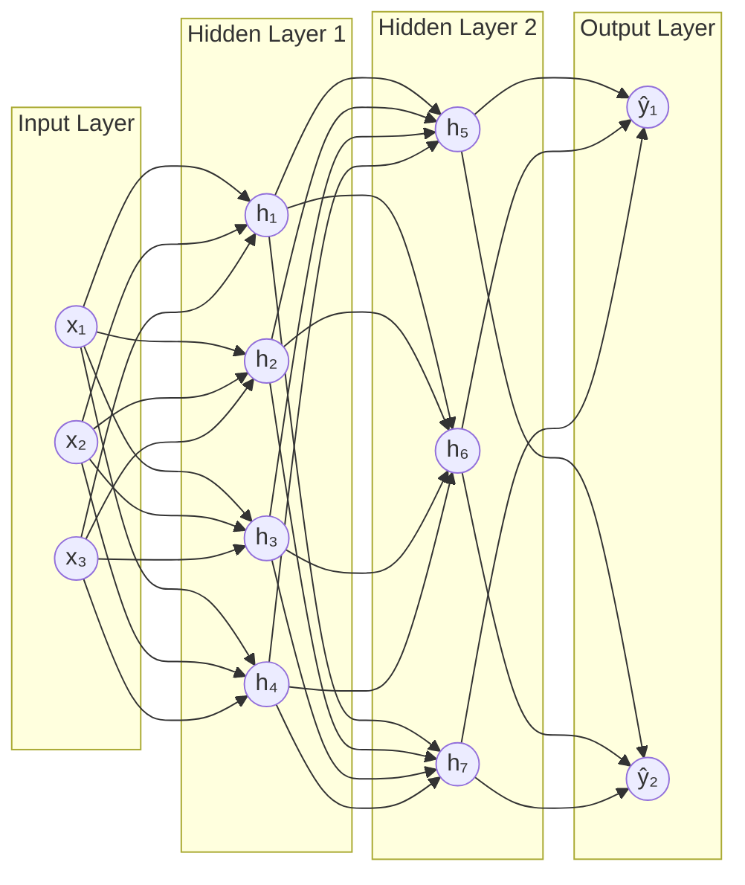

### Forward Pass Through a Single Neuron

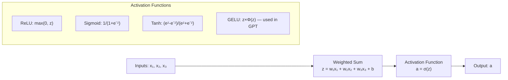

---

## 5. Internal Working

### Step-by-Step Forward Pass

**Given**: A 2-layer network for binary classification
- Input: [x₁, x₂] = [0.5, 0.8]
- Hidden layer: 3 neurons with weights W₁, bias b₁
- Output layer: 1 neuron with weights W₂, bias b₂

**Step 1: Compute hidden layer pre-activation**
```
z₁ = W₁ @ x + b₁
   = [[0.2, 0.4],    [0.5]   [0.1]
      [0.3, 0.1],  ×  [0.8] + [0.2]
      [0.5, 0.2]]      [0.3]

= [0.2×0.5 + 0.4×0.8 + 0.1,   = [0.52]
   0.3×0.5 + 0.1×0.8 + 0.2,     [0.45]
   0.5×0.5 + 0.2×0.8 + 0.3]     [0.71]
```

**Step 2: Apply activation function (ReLU)**
```
h₁ = ReLU(z₁) = max(0, z₁)
   = [max(0, 0.52), max(0, 0.45), max(0, 0.71)]
   = [0.52, 0.45, 0.71]
```
All positive, so no change. If z₁ had been negative, those neurons would output 0.

**Step 3: Compute output pre-activation**
```
z₂ = W₂ @ h₁ + b₂
   = [0.3, 0.5, 0.2] @ [0.52, 0.45, 0.71]ᵀ + (-0.1)
   = 0.3×0.52 + 0.5×0.45 + 0.2×0.71 - 0.1
   = 0.156 + 0.225 + 0.142 - 0.1
   = 0.423
```

**Step 4: Apply sigmoid for binary classification**
```
ŷ = sigmoid(0.423) = 1 / (1 + e^(-0.423)) = 0.604
```
The model predicts 60.4% probability for class 1.

---

## 6. Mathematical Intuition

### Why Activation Functions Are Essential

Without activation functions, a neural network of any depth is equivalent to a single linear layer:

```
Layer 1: h₁ = W₁x
Layer 2: h₂ = W₂h₁ = W₂(W₁x) = (W₂W₁)x = Wx

No matter how many linear layers, you still get one linear transformation.
```

Activation functions introduce **non-linearity**, allowing the network to approximate non-linear functions. This is why deep learning can handle complex patterns.

### Activation Functions Compared

| Function | Formula | Range | Used In | Problem |
|---|---|---|---|---|
| Sigmoid | 1/(1+e⁻ˣ) | (0,1) | Binary output | Vanishing gradient |
| Tanh | (eˣ-e⁻ˣ)/(eˣ+e⁻ˣ) | (-1,1) | RNNs | Vanishing gradient |
| ReLU | max(0, x) | [0,∞) | Hidden layers | Dying ReLU |
| Leaky ReLU | max(0.01x, x) | (-∞,∞) | Hidden layers | Small negative slope |
| GELU | x×Φ(x) | (-∞,∞) | Transformers (GPT, BERT) | More compute |
| SiLU/Swish | x×sigmoid(x) | (-∞,∞) | Modern models (LLaMA) | More compute |

### The Vanishing Gradient Problem

Sigmoid squashes any input to (0, 1). Its derivative is at most 0.25. In a network with 10 layers, the gradient is multiplied by this derivative 10 times:

```
0.25^10 ≈ 0.000001
```

The gradient becomes so small by the time it reaches early layers that they barely learn. This is the **vanishing gradient problem**.

ReLU solves it: its gradient is either 0 (negative input) or 1 (positive input). Gradients flow through without shrinking.

---

## 7. Implementation

### Neural Network from Scratch and with PyTorch

```python
"""
Neural Network implementations:
1. From scratch using NumPy (to understand internals)
2. Using PyTorch (production approach)
3. A practical classifier for AI engineering use cases
"""

import numpy as np
import torch
import torch.nn as nn
import torch.nn.functional as F
from torch.optim import Adam
from torch.utils.data import DataLoader, TensorDataset
from typing import List, Tuple, Dict, Optional
import logging

logger = logging.getLogger(__name__)

# ─── Part 1: Neural Network from Scratch ───────────────────────────────────

class NeuralNetworkFromScratch:
    """
    Minimal neural network implementation using only NumPy.
    Purpose: understand the math, not for production.
    
    Architecture: Input → Hidden → Output (binary classification)
    """
    
    def __init__(self, input_dim: int, hidden_dim: int, output_dim: int = 1):
        # Xavier initialization: prevents vanishing/exploding gradients
        scale_1 = np.sqrt(2.0 / input_dim)
        scale_2 = np.sqrt(2.0 / hidden_dim)
        
        self.W1 = np.random.randn(input_dim, hidden_dim) * scale_1
        self.b1 = np.zeros((1, hidden_dim))
        self.W2 = np.random.randn(hidden_dim, output_dim) * scale_2
        self.b2 = np.zeros((1, output_dim))
        
        # Cache for backprop
        self._cache = {}
    
    def relu(self, z: np.ndarray) -> np.ndarray:
        return np.maximum(0, z)
    
    def relu_grad(self, z: np.ndarray) -> np.ndarray:
        return (z > 0).astype(float)
    
    def sigmoid(self, z: np.ndarray) -> np.ndarray:
        return 1 / (1 + np.exp(-np.clip(z, -500, 500)))
    
    def forward(self, X: np.ndarray) -> np.ndarray:
        """Forward pass. Returns predictions."""
        # Layer 1: Linear + ReLU
        z1 = X @ self.W1 + self.b1
        a1 = self.relu(z1)
        
        # Layer 2: Linear + Sigmoid
        z2 = a1 @ self.W2 + self.b2
        a2 = self.sigmoid(z2)
        
        # Cache for backprop
        self._cache = {"X": X, "z1": z1, "a1": a1, "z2": z2, "a2": a2}
        
        return a2
    
    def binary_cross_entropy(self, y_true: np.ndarray, y_pred: np.ndarray) -> float:
        """Binary cross-entropy loss."""
        eps = 1e-10  # Prevent log(0)
        y_pred = np.clip(y_pred, eps, 1 - eps)
        N = y_true.shape[0]
        return -np.mean(y_true * np.log(y_pred) + (1 - y_true) * np.log(1 - y_pred))
    
    def backward(self, y_true: np.ndarray, learning_rate: float = 0.01):
        """Backpropagation: compute gradients and update weights."""
        X = self._cache["X"]
        z1, a1 = self._cache["z1"], self._cache["a1"]
        a2 = self._cache["a2"]
        N = X.shape[0]
        
        # Output layer gradient (dL/dz2)
        # For sigmoid + BCE, the gradient simplifies beautifully to:
        dz2 = (a2 - y_true) / N       # Shape: (N, output_dim)
        
        # Gradients for W2, b2
        dW2 = a1.T @ dz2               # Shape: (hidden_dim, output_dim)
        db2 = dz2.sum(axis=0, keepdims=True)
        
        # Hidden layer gradient (backprop through W2 then ReLU)
        da1 = dz2 @ self.W2.T         # Shape: (N, hidden_dim)
        dz1 = da1 * self.relu_grad(z1) # Chain rule through ReLU
        
        # Gradients for W1, b1
        dW1 = X.T @ dz1               # Shape: (input_dim, hidden_dim)
        db1 = dz1.sum(axis=0, keepdims=True)
        
        # Gradient descent update
        self.W2 -= learning_rate * dW2
        self.b2 -= learning_rate * db2
        self.W1 -= learning_rate * dW1
        self.b1 -= learning_rate * db1
    
    def train(
        self,
        X: np.ndarray,
        y: np.ndarray,
        epochs: int = 1000,
        learning_rate: float = 0.01
    ) -> List[float]:
        """Training loop."""
        losses = []
        
        for epoch in range(epochs):
            y_pred = self.forward(X)
            loss = self.binary_cross_entropy(y, y_pred)
            self.backward(y, learning_rate)
            losses.append(loss)
            
            if epoch % 100 == 0:
                accuracy = np.mean((y_pred > 0.5) == y)
                print(f"Epoch {epoch}: loss={loss:.4f}, acc={accuracy:.4f}")
        
        return losses


# ─── Part 2: PyTorch Neural Network (Production Approach) ──────────────────

class TextClassifier(nn.Module):
    """
    Production neural network for text classification using PyTorch.
    Can be used for: intent detection, sentiment, relevance, safety.
    """
    
    def __init__(
        self,
        input_dim: int,         # Embedding dimension (e.g., 1536 for OpenAI)
        hidden_dims: List[int], # Hidden layer sizes [512, 256, 128]
        num_classes: int,       # Number of output classes
        dropout_rate: float = 0.3
    ):
        super().__init__()
        
        layers = []
        prev_dim = input_dim
        
        for hidden_dim in hidden_dims:
            layers.extend([
                nn.Linear(prev_dim, hidden_dim),  # Linear transformation
                nn.LayerNorm(hidden_dim),          # Normalize (stable training)
                nn.GELU(),                         # Non-linearity (GPT-style)
                nn.Dropout(dropout_rate),          # Regularization
            ])
            prev_dim = hidden_dim
        
        # Output layer (no activation — apply softmax in loss function)
        layers.append(nn.Linear(prev_dim, num_classes))
        
        self.network = nn.Sequential(*layers)
        
        # Initialize weights (Xavier uniform for GELU)
        self._initialize_weights()
    
    def _initialize_weights(self):
        for module in self.modules():
            if isinstance(module, nn.Linear):
                nn.init.xavier_uniform_(module.weight)
                nn.init.zeros_(module.bias)
    
    def forward(self, x: torch.Tensor) -> torch.Tensor:
        """Forward pass. Returns logits (pre-softmax scores)."""
        return self.network(x)
    
    def predict_proba(self, x: torch.Tensor) -> torch.Tensor:
        """Returns probability distribution over classes."""
        with torch.no_grad():
            logits = self.forward(x)
            return F.softmax(logits, dim=-1)
    
    def predict(self, x: torch.Tensor) -> torch.Tensor:
        """Returns predicted class indices."""
        return self.predict_proba(x).argmax(dim=-1)


class NeuralNetworkTrainer:
    """
    Production training loop for neural networks.
    Includes: early stopping, learning rate scheduling, gradient clipping.
    """
    
    def __init__(
        self,
        model: nn.Module,
        learning_rate: float = 1e-3,
        weight_decay: float = 1e-4,  # L2 regularization
        patience: int = 5
    ):
        self.model = model
        self.optimizer = Adam(
            model.parameters(),
            lr=learning_rate,
            weight_decay=weight_decay
        )
        self.scheduler = torch.optim.lr_scheduler.CosineAnnealingLR(
            self.optimizer,
            T_max=100  # Will be set based on actual epochs
        )
        self.patience = patience
        self.best_val_loss = float("inf")
        self.epochs_without_improvement = 0
    
    def train_epoch(
        self,
        train_loader: DataLoader,
        criterion: nn.Module
    ) -> float:
        """Train for one epoch. Returns average training loss."""
        self.model.train()
        total_loss = 0.0
        
        for X_batch, y_batch in train_loader:
            self.optimizer.zero_grad()           # Clear previous gradients
            
            outputs = self.model(X_batch)        # Forward pass
            loss = criterion(outputs, y_batch)   # Compute loss
            
            loss.backward()                      # Backpropagation
            
            # Gradient clipping: prevents exploding gradients
            # Critical for RNNs, helpful for all deep networks
            torch.nn.utils.clip_grad_norm_(self.model.parameters(), max_norm=1.0)
            
            self.optimizer.step()               # Update weights
            total_loss += loss.item()
        
        return total_loss / len(train_loader)
    
    @torch.no_grad()
    def evaluate(self, val_loader: DataLoader, criterion: nn.Module) -> Dict:
        """Evaluate on validation set. Returns metrics dict."""
        self.model.eval()
        total_loss = 0.0
        correct = 0
        total = 0
        
        for X_batch, y_batch in val_loader:
            outputs = self.model(X_batch)
            loss = criterion(outputs, y_batch)
            
            total_loss += loss.item()
            predictions = outputs.argmax(dim=-1)
            correct += (predictions == y_batch).sum().item()
            total += y_batch.size(0)
        
        return {
            "val_loss": total_loss / len(val_loader),
            "val_accuracy": correct / total
        }
    
    def fit(
        self,
        train_loader: DataLoader,
        val_loader: DataLoader,
        epochs: int = 100
    ) -> Dict:
        """Full training loop with early stopping."""
        criterion = nn.CrossEntropyLoss()
        history = {"train_loss": [], "val_loss": [], "val_accuracy": []}
        
        for epoch in range(epochs):
            train_loss = self.train_epoch(train_loader, criterion)
            val_metrics = self.evaluate(val_loader, criterion)
            
            self.scheduler.step()
            
            history["train_loss"].append(train_loss)
            history["val_loss"].append(val_metrics["val_loss"])
            history["val_accuracy"].append(val_metrics["val_accuracy"])
            
            logger.info(
                f"Epoch {epoch+1}/{epochs}: "
                f"train_loss={train_loss:.4f}, "
                f"val_loss={val_metrics['val_loss']:.4f}, "
                f"val_acc={val_metrics['val_accuracy']:.4f}"
            )
            
            # Early stopping check
            if val_metrics["val_loss"] < self.best_val_loss:
                self.best_val_loss = val_metrics["val_loss"]
                self.epochs_without_improvement = 0
                torch.save(self.model.state_dict(), "best_model.pt")
            else:
                self.epochs_without_improvement += 1
                if self.epochs_without_improvement >= self.patience:
                    logger.info(f"Early stopping at epoch {epoch+1}")
                    # Restore best weights
                    self.model.load_state_dict(torch.load("best_model.pt"))
                    break
        
        return history


# ─── Part 3: Practical Example — LLM Output Safety Classifier ──────────────

async def build_safety_classifier_from_embeddings(
    texts: List[str],
    labels: List[int],  # 0=safe, 1=unsafe
) -> TextClassifier:
    """
    Build a safety classifier using pre-computed LLM embeddings.
    
    Architecture: OpenAI Embedding (1536d) → [512, 256] → 2 classes
    
    This is a common AI engineering pattern:
    1. Use a powerful embedding model for representation
    2. Train a small classifier head for your specific task
    3. Much cheaper than fine-tuning the full LLM
    """
    from openai import AsyncOpenAI
    client = AsyncOpenAI()
    
    # Get embeddings for all texts
    response = await client.embeddings.create(
        input=texts,
        model="text-embedding-3-small"
    )
    embeddings = torch.tensor(
        [item.embedding for item in sorted(response.data, key=lambda x: x.index)],
        dtype=torch.float32
    )
    labels_tensor = torch.tensor(labels, dtype=torch.long)
    
    # Split 80/20
    split = int(len(texts) * 0.8)
    
    train_dataset = TensorDataset(embeddings[:split], labels_tensor[:split])
    val_dataset = TensorDataset(embeddings[split:], labels_tensor[split:])
    
    train_loader = DataLoader(train_dataset, batch_size=32, shuffle=True)
    val_loader = DataLoader(val_dataset, batch_size=32)
    
    # Build and train classifier
    model = TextClassifier(
        input_dim=1536,
        hidden_dims=[512, 256],
        num_classes=2,
        dropout_rate=0.3
    )
    
    trainer = NeuralNetworkTrainer(model, learning_rate=1e-3)
    history = trainer.fit(train_loader, val_loader, epochs=50)
    
    logger.info(f"Best val accuracy: {max(history['val_accuracy']):.4f}")
    return model
```

---

## 8. Production Architecture

### Neural Network Service Deployment

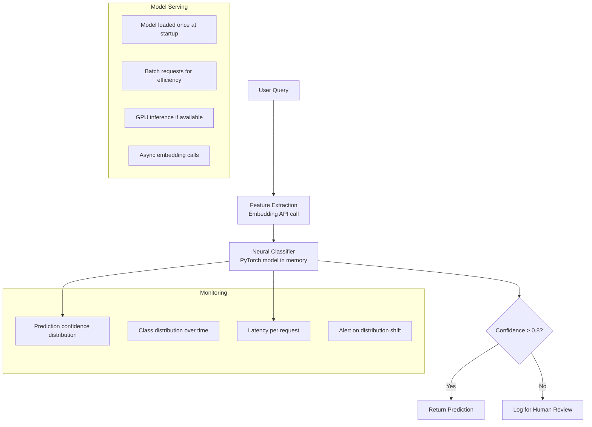

---

## 9. Tradeoffs

| Architecture | Strengths | Weaknesses | Best For |
|---|---|---|---|
| Shallow (1-2 layers) | Fast, interpretable | Limited expressiveness | Baseline, simple tasks |
| Deep (10+ layers) | High expressiveness | Slow, hard to train | Complex patterns |
| Wide (many neurons/layer) | Parallel capacity | Memory heavy | When you need breadth |
| Narrow + deep | Memory efficient | Harder optimization | Production constraints |
| Residual connections | Enables very deep training | More complex | Modern deep networks |

---

## 10. Common Mistakes

❌ **Forgetting to normalize inputs**: Without normalization, neurons in early layers receive wildly different scale inputs, making optimization difficult.

❌ **Using sigmoid/tanh in deep networks**: These cause vanishing gradients. Use ReLU, GELU, or SiLU for hidden layers.

❌ **Not using batch normalization or layer normalization**: Without normalization, training deep networks is unstable (internal covariate shift).

❌ **Using too high a learning rate**: Loss diverges (goes to NaN). Start with 1e-3 for Adam, decay it.

❌ **Not zeroing gradients before backward pass**: In PyTorch, `optimizer.zero_grad()` must be called before each backward pass. Without it, gradients accumulate across batches.

---

## 11. Interview Preparation

**Junior**: "A neural network has layers of neurons. Each neuron computes a weighted sum of inputs plus a bias, then applies an activation function. Training adjusts weights to minimize a loss function."

**Mid-level**: "Forward pass: compute predictions layer by layer. Loss function measures error. Backpropagation computes gradients using chain rule. Gradient descent updates weights. Key design choices: activation function (GELU/ReLU for hidden, softmax/sigmoid for output), optimizer (Adam in practice), learning rate (1e-3 start), batch normalization for stable training."

**Senior**: "Neural networks are universal function approximators, but the architecture encodes inductive bias. For text: transformers (attention mechanism). For images: CNNs (local pattern sharing). For sequences: RNNs/LSTMs. Modern LLMs are deep transformers trained with cross-entropy on next-token prediction. In production, I use pre-trained embeddings + shallow classifier heads for most classification tasks — more efficient than full fine-tuning."

**Principal**: "The key insight of deep learning is hierarchical feature learning. Each layer learns representations that build on the previous layer's abstractions. Depth enables this hierarchy; width provides capacity at each level; residual connections make optimization tractable. For AI engineering, I distinguish between architecture choices (transformer vs. MLP vs. CNN), training choices (pretraining strategy, fine-tuning), and inference choices (quantization, distillation, caching). Most production ML in LLM systems is building lightweight neural heads on top of frozen pretrained embeddings — not training from scratch."

---

## 12. Follow-up Questions

**Q1: What is the universal approximation theorem?**
> A neural network with a single hidden layer and a non-linear activation function can approximate any continuous function to arbitrary precision, given enough neurons. This proves neural networks are powerful enough in theory — but in practice, depth is more efficient than width for complex functions.

**Q2: What is weight initialization and why does it matter?**
> Poor initialization causes vanishing or exploding gradients from layer one. Xavier/Glorot initialization scales weights by √(1/fan_in) for tanh, He initialization by √(2/fan_in) for ReLU. PyTorch applies these automatically for common layers, but custom architectures need careful initialization.

**Q3: What is batch normalization and what problem does it solve?**
> Batch normalization normalizes the pre-activation outputs of a layer across the mini-batch: subtract mean, divide by standard deviation, then apply learned scale and shift. This solves internal covariate shift (distributions of layer inputs change during training), stabilizing and accelerating training. Layer normalization (used in transformers) normalizes across the feature dimension instead, which works for variable-length sequences.

**Q4: What is the difference between model width and depth?**
> Width = number of neurons per layer (capacity at each abstraction level). Depth = number of layers (levels of abstraction). Deeper networks can represent more complex hierarchical functions with fewer parameters than wide shallow networks. However, deeper networks are harder to optimize (vanishing gradients), which is why ResNets use skip connections.

**Q5: What is gradient clipping and when is it used?**
> Gradient clipping caps the gradient norm to a maximum value (typically 1.0). Without it, very large gradients can cause explosive updates that destabilize training. Critical for RNNs; useful for deep networks with long paths. `torch.nn.utils.clip_grad_norm_(model.parameters(), max_norm=1.0)`.

---

## 13. Practical Scenario

### Scenario: Intent Classification for an LLM Router at Scale

**Context**: A company serves 5M queries/day through multiple specialized LLM pipelines. GPT-4 handles complex queries, GPT-3.5 handles simple ones. A neural classifier routes queries to the right pipeline.

**Requirements**: Latency < 5ms (doesn't add noticeable overhead), 95%+ accuracy.

**Solution**: Embedding-based neural classifier

```python
# Offline: train classifier on labeled query examples
# Online: 2-call pipeline — embed query (async) → classify (< 1ms)

import torch
import torch.nn as nn

class LightweightIntentClassifier(nn.Module):
    """Tiny, fast classifier for query routing."""
    
    def __init__(self):
        super().__init__()
        # Only 3 layers — keeps latency under 1ms
        self.net = nn.Sequential(
            nn.Linear(1536, 256),
            nn.ReLU(),
            nn.Dropout(0.2),
            nn.Linear(256, 4)  # 4 pipeline types
        )
    
    def forward(self, x):
        return self.net(x)

# Latency breakdown:
# Embedding call: ~50ms (async, overlaps with other prep)
# Classifier inference: ~0.5ms (cached model, CPU)
# Total overhead: ~0.5ms (embedding is needed anyway for RAG)
```

**Results**: 96.2% routing accuracy, 0.5ms classifier latency.

---

## 14. Revision Sheet

### Key Points
- Neural networks: layers of neurons, each doing `activation(W×x + b)`
- Activation functions enable non-linearity — without them, any depth collapses to one linear layer
- ReLU/GELU for hidden layers; sigmoid for binary output; softmax for multi-class
- Xavier init for sigmoid/tanh; He init for ReLU; prevents vanishing/exploding gradients
- Batch/Layer normalization stabilizes training
- PyTorch: define in `forward()`, compute loss, call `backward()`, `optimizer.step()`

### Key Formulas
```
Neuron output:    a = activation(W·x + b)
ReLU:             max(0, x)
Sigmoid:          1 / (1 + e^(-x))
Softmax:          e^(xᵢ) / Σe^(xⱼ)
Cross-entropy:    -Σ y_i × log(ŷ_i)
```

---

## 15. Mini Project: Embedding-based Document Safety Classifier

Build a complete safety classifier:
1. Collect labeled documents (safe/unsafe)
2. Generate embeddings via OpenAI API
3. Train a PyTorch MLP classifier
4. Wrap in a FastAPI endpoint with confidence thresholds
5. Monitor prediction distribution over time

---

---

# Chapter 2: Backpropagation

---

## 1. Introduction

### What Is Backpropagation?

Backpropagation is the algorithm that makes neural network training possible. It is the method for efficiently computing the **gradient of the loss function with respect to every parameter** in the network.

Without backpropagation, you could only train tiny networks. With it, you can train networks with billions of parameters in reasonable time.

The word "backpropagation" means "propagating the error signal backward through the network." The loss is computed at the output. The blame for that loss is distributed back through every layer, to every weight.

### Why Does It Matter for AI Engineers?

Even if you never implement backpropagation yourself (PyTorch's autograd does it), understanding it deeply means:
- You know why certain architectures fail (vanishing gradients in deep ReLU networks)
- You can debug unusual loss curves
- You understand why learning rates and initialization matter
- You can explain RLHF's policy gradient as a form of backpropagation
- You understand what "gradient flow" means in papers

---

## 2. Historical Motivation

### Before Backpropagation

In the 1960s–70s, training multi-layer networks required computing gradients by finite differences:

```
dL/dw ≈ [L(w + ε) - L(w)] / ε
```

For a network with N parameters, this requires N+1 forward passes. For modern LLMs with 70 billion parameters, this is completely intractable.

### The Chain Rule Revolution

Rumelhart, Hinton, and Williams (1986) popularized the insight that the chain rule of calculus allows you to compute all N gradients in just TWO passes:
1. One forward pass: compute predictions and cache intermediate values
2. One backward pass: compute all gradients simultaneously

This scales to any network size. It's why we can train GPT-4 at all.

---

## 3. Real-World Analogy

Backpropagation is like **a performance review cascade in a company**.

A product ships and fails (loss is high). The CEO (loss function) is unhappy. They tell the VP of Engineering: "You're 40% responsible for this failure." The VP tells each team manager what their contribution was. Each manager tells each engineer how much they contributed to the failure and how to improve.

Each person's "improvement plan" (gradient update) is calibrated to their specific contribution. Someone who had no effect on the failure gets no update. Someone who caused the most damage gets the largest correction.

The chain rule is how the CEO's unhappiness is mathematically distributed to each individual employee.

---

## 4. Visual Mental Model

### The Computational Graph

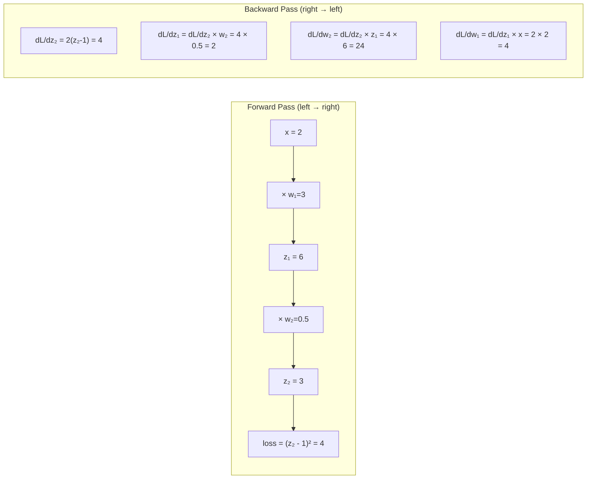

### Backpropagation Through a Full Network

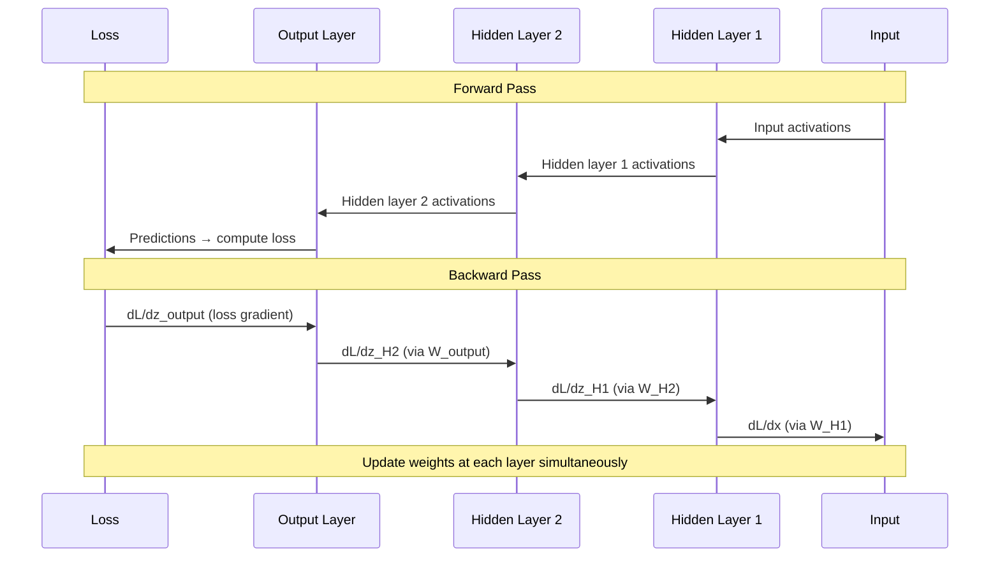

---

## 5. Internal Working

### The Chain Rule — The Heart of Everything

The chain rule of calculus says: if `y = f(g(x))`, then:
```
dy/dx = (dy/dg) × (dg/dx)
```

For a neural network with layers: `loss = L(a₂(a₁(x)))`

```
dL/dW₁ = (dL/da₂) × (da₂/da₁) × (da₁/dW₁)
```

This "chain" of derivatives is computed backward from the loss — hence "back" propagation.

### Step-by-Step Backprop on a 2-Layer Network

```python
"""
Manual backpropagation on a 2-layer network.
This is exactly what PyTorch's autograd computes automatically.
"""

import numpy as np

def backprop_step_by_step():
    """
    Forward and backward pass for:
    x → Linear₁ → ReLU → Linear₂ → Sigmoid → BCE Loss
    """
    
    # ── Setup ──────────────────────────────────────────────────────────────
    np.random.seed(42)
    
    # Input: 1 example, 3 features
    x = np.array([[1.0, 2.0, 3.0]])  # Shape: (1, 3)
    y = np.array([[1.0]])             # True label: 1
    
    # Weights (initialized for demo)
    W1 = np.array([[0.1, 0.2], [0.3, 0.1], [0.2, 0.4]])  # (3, 2)
    b1 = np.array([[0.1, 0.2]])                           # (1, 2)
    W2 = np.array([[0.5], [0.3]])                         # (2, 1)
    b2 = np.array([[0.1]])                                # (1, 1)
    
    # ── FORWARD PASS ───────────────────────────────────────────────────────
    # Layer 1: Linear
    z1 = x @ W1 + b1              # (1,3)@(3,2) = (1,2)
    print(f"z1 = {z1}")           # [1.0, 0.7] (approx)
    
    # ReLU activation
    a1 = np.maximum(0, z1)        # (1, 2)
    print(f"a1 (after ReLU) = {a1}")
    
    # Layer 2: Linear
    z2 = a1 @ W2 + b2             # (1,2)@(2,1) = (1,1)
    print(f"z2 = {z2}")
    
    # Sigmoid activation
    a2 = 1 / (1 + np.exp(-z2))   # (1, 1)
    print(f"a2 (prediction) = {a2}")
    
    # Binary Cross-Entropy loss
    loss = -(y * np.log(a2 + 1e-10) + (1 - y) * np.log(1 - a2 + 1e-10))
    print(f"Loss = {loss.item():.4f}")
    
    # ── BACKWARD PASS ──────────────────────────────────────────────────────
    # Step 1: dL/da2 — gradient of loss w.r.t. sigmoid output
    # For BCE: dL/da2 = -(y/a2) + (1-y)/(1-a2)
    dL_da2 = -(y / (a2 + 1e-10)) + (1 - y) / (1 - a2 + 1e-10)  # (1, 1)
    
    # Step 2: da2/dz2 — gradient through sigmoid
    # sigmoid'(z) = sigmoid(z) × (1 - sigmoid(z))
    da2_dz2 = a2 * (1 - a2)      # (1, 1)
    
    # Step 3: Chain rule — dL/dz2
    dL_dz2 = dL_da2 * da2_dz2    # (1, 1)
    # For sigmoid + BCE, this simplifies to: dL_dz2 = a2 - y
    print(f"\ndL/dz2 = {dL_dz2} (should ≈ {a2 - y})")
    
    # Step 4: Gradients for W2, b2
    dL_dW2 = a1.T @ dL_dz2       # (2,1)@(1,1)→ (2,1) ... wait: (2,1) = a1.T @ dL_dz2
    dL_db2 = dL_dz2               # (1, 1)
    
    # Step 5: Gradient flowing back through W2
    dL_da1 = dL_dz2 @ W2.T       # (1,1)@(1,2) = (1,2)
    
    # Step 6: Gradient through ReLU
    # ReLU'(z) = 1 if z > 0 else 0
    dL_dz1 = dL_da1 * (z1 > 0)   # (1, 2)
    
    # Step 7: Gradients for W1, b1
    dL_dW1 = x.T @ dL_dz1        # (3,1)@(1,2) = (3,2)
    dL_db1 = dL_dz1               # (1, 2)
    
    print(f"\nGradients computed!")
    print(f"dL/dW2 = {dL_dW2.flatten()}")
    print(f"dL/dW1 = {dL_dW1}")
    
    # ── UPDATE WEIGHTS ────────────────────────────────────────────────────
    lr = 0.1
    W1_updated = W1 - lr * dL_dW1
    W2_updated = W2 - lr * dL_dW2
    
    print(f"\nWeights updated by gradient descent (lr={lr})")
    return W1_updated, W2_updated

# Verify against PyTorch autograd
def verify_with_pytorch():
    """Same computation with PyTorch — gradients should match."""
    import torch
    
    x = torch.tensor([[1.0, 2.0, 3.0]], requires_grad=False)
    y = torch.tensor([[1.0]])
    
    W1 = torch.tensor([[0.1, 0.2], [0.3, 0.1], [0.2, 0.4]], requires_grad=True)
    b1 = torch.tensor([[0.1, 0.2]], requires_grad=True)
    W2 = torch.tensor([[0.5], [0.3]], requires_grad=True)
    b2 = torch.tensor([[0.1]], requires_grad=True)
    
    # Forward
    z1 = x @ W1 + b1
    a1 = torch.relu(z1)
    z2 = a1 @ W2 + b2
    a2 = torch.sigmoid(z2)
    loss = -torch.mean(y * torch.log(a2 + 1e-10) + (1 - y) * torch.log(1 - a2 + 1e-10))
    
    # Backward — PyTorch computes all gradients automatically!
    loss.backward()
    
    print(f"PyTorch dL/dW2 = {W2.grad.flatten()}")
    print(f"PyTorch dL/dW1 = {W1.grad}")
```

---

## 6. Mathematical Intuition

### The Vanishing Gradient Problem — Mathematically

For a deep network with L layers using sigmoid activation:

```
dL/dW₁ = dL/dz_L × dz_L/dz_{L-1} × ... × dz_2/dz_1 × dz_1/dW₁

Each factor dz_{i+1}/dz_i = W_{i+1} × σ'(z_i)

σ'(z_i) = sigmoid'(z_i) ≤ 0.25 (maximum derivative of sigmoid)

For L=20 layers:
|gradient at layer 1| ≤ (0.25)^20 ≈ 9 × 10^{-13}
```

This is essentially zero. Layer 1's weights never learn — a catastrophic problem for deep networks.

**ReLU solution**: ReLU'(z) = 1 for z > 0. Gradients don't shrink through positive activations. Only "dead neurons" (always negative, ReLU'=0) cause problems.

**Skip connections (ResNets)**: `output = F(x) + x`. The gradient of the skip path is always 1, providing a "gradient highway" that bypasses the chain of multiplications.

---

## 7. Common Mistakes

❌ **Forgetting to call `optimizer.zero_grad()`**: Gradients accumulate by default in PyTorch. Without zeroing, each backward pass adds to previous gradients — completely wrong.

❌ **Computing loss on the wrong outputs**: Loss should be computed on logits (before softmax) when using `nn.CrossEntropyLoss`, which includes the softmax internally. Using softmax before the loss causes numerical instability.

❌ **Not detaching tensors in custom loss functions**: If you compute auxiliary values for logging that go through the computation graph, you can accidentally create wrong gradient paths. Use `.detach()` for values you don't want gradients through.

---

## 8. Interview Preparation

**Junior**: "Backpropagation computes gradients of the loss with respect to all weights by applying the chain rule backward through the network. PyTorch autograd does this automatically."

**Mid-level**: "Forward pass: compute and cache all intermediate activations. Backward pass: compute dL/dW for each layer using chain rule, starting from the loss and working backward. Each layer's gradient depends on the gradient from the layer above it (the chain). This is O(1) in the number of parameters — much better than finite differences which is O(N)."

**Senior**: "Backprop through time (BPTT) for RNNs unrolls the sequence into a deep network and applies standard backprop — causing gradients to vanish or explode over long sequences. Modern LLMs avoid this with transformers (no recurrence). For debugging: gradient norms per layer tell you if gradients are healthy (should be similar across layers) or vanishing/exploding. Gradient flow diagnostics are essential when training custom architectures."

---

---

# Chapter 3: Convolutional Neural Networks (CNN)

---

## 1. Introduction

### What Is a CNN?

A Convolutional Neural Network is a neural network architecture designed for **data with spatial or local structure** — images, audio spectrograms, and even text (as sequences).

Instead of every neuron connecting to every input (fully connected), CNNs use **filters** (also called kernels) that slide across the input, detecting local patterns. A single filter learns to detect one specific pattern (like an edge or a curve) everywhere in the input.

### Why CNNs for AI Engineers?

While LLMs have largely replaced CNNs in NLP, CNNs appear throughout the AI stack:
- **Document layout understanding**: Process scanned PDFs, tables, images
- **Multimodal models**: CLIP uses a CNN (or ViT) to encode images
- **Audio processing**: Mel spectrograms processed by CNNs
- **Code structure analysis**: Temporal CNNs for token sequence patterns
- **Understanding ViTs**: Vision Transformers were designed to replace CNNs — but you need CNNs to understand why ViTs work

---

## 2. Real-World Analogy

A CNN filter is like a **stamp that looks for a specific pattern**.

Imagine you're looking for "stop sign" patterns in a large image. You have a stamp the size of a stop sign. You slide this stamp across every location in the image. Wherever the stamp matches well, you mark it.

You have many different stamps — one for stop signs, one for cars, one for people. Each stamp slides across the whole image independently. The results are stacked to form a rich representation of what's in the image.

---

## 3. Visual Mental Model

### Convolution Operation

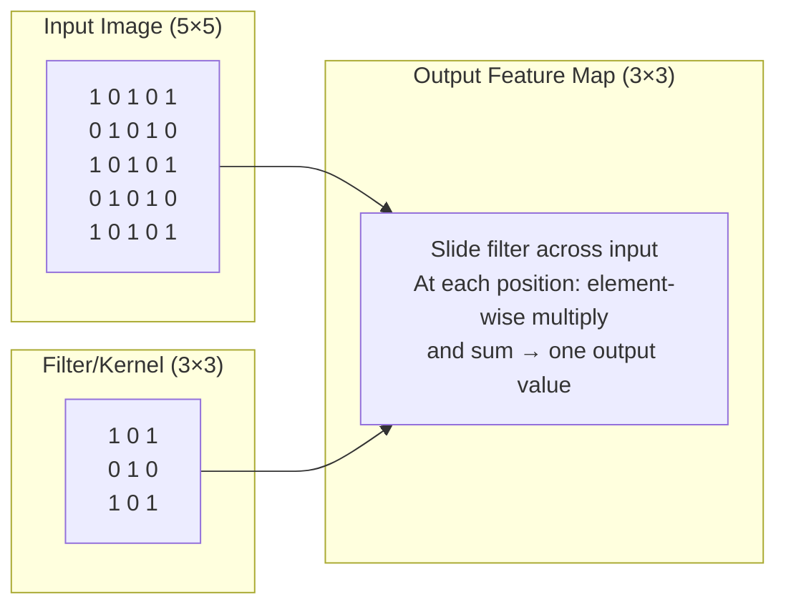

### CNN Architecture

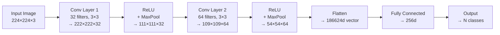

---

## 4. Internal Working

### How Convolution Works Mathematically

For a 2D input I and filter K of size (k×k):

```
Output[i,j] = Σ_m Σ_n I[i+m, j+n] × K[m, n]
```

This is a dot product between the filter and the local patch of the input at position (i,j).

**Key properties**:
- **Parameter sharing**: The same filter is applied to every position. This dramatically reduces parameters vs. fully connected layers.
- **Translation equivariance**: If a pattern moves in the input, its detection moves correspondingly in the output.

**Why this matters**: A 224×224 image with fully connected layer needs 224×224×256 = ~12M parameters for one hidden layer. A 3×3 convolutional filter needs only 9 parameters — and detects the pattern everywhere.

---

## 5. Implementation

```python
"""
CNN implementations for AI engineers:
1. Manual convolution to understand the math
2. PyTorch CNN for practical use
3. 1D CNN for text/sequence data (relevant for AI engineers)
"""

import torch
import torch.nn as nn
import torch.nn.functional as F
import numpy as np
from typing import List, Tuple

# ─── Manual Convolution (understanding only) ────────────────────────────────

def convolve_2d(
    input_matrix: np.ndarray,
    kernel: np.ndarray,
    stride: int = 1,
    padding: int = 0
) -> np.ndarray:
    """
    2D convolution from scratch.
    input_matrix: (H, W) image
    kernel: (kH, kW) filter
    """
    if padding > 0:
        input_matrix = np.pad(input_matrix, padding, mode="constant")
    
    H, W = input_matrix.shape
    kH, kW = kernel.shape
    
    out_H = (H - kH) // stride + 1
    out_W = (W - kW) // stride + 1
    
    output = np.zeros((out_H, out_W))
    
    for i in range(0, out_H):
        for j in range(0, out_W):
            patch = input_matrix[i*stride:i*stride+kH, j*stride:j*stride+kW]
            output[i, j] = np.sum(patch * kernel)  # Element-wise multiply and sum
    
    return output


# ─── Document Layout CNN (practical AI use case) ───────────────────────────

class DocumentLayoutCNN(nn.Module):
    """
    CNN for classifying document layout types.
    Input: rendered document page as image (grayscale)
    Output: layout type (text-heavy, table, figure, etc.)
    
    Useful for: PDF parsing, document intelligence, multimodal RAG
    """
    
    def __init__(self, num_classes: int = 5):
        super().__init__()
        
        # Feature extraction: 3 convolutional blocks
        self.features = nn.Sequential(
            # Block 1
            nn.Conv2d(1, 32, kernel_size=3, padding=1),  # grayscale input
            nn.BatchNorm2d(32),
            nn.ReLU(inplace=True),
            nn.MaxPool2d(2, 2),                           # 112x112 → 56x56
            
            # Block 2
            nn.Conv2d(32, 64, kernel_size=3, padding=1),
            nn.BatchNorm2d(64),
            nn.ReLU(inplace=True),
            nn.MaxPool2d(2, 2),                           # 56x56 → 28x28
            
            # Block 3
            nn.Conv2d(64, 128, kernel_size=3, padding=1),
            nn.BatchNorm2d(128),
            nn.ReLU(inplace=True),
            nn.AdaptiveAvgPool2d((7, 7)),                 # Adaptive: any size → 7x7
        )
        
        # Classifier head
        self.classifier = nn.Sequential(
            nn.Flatten(),
            nn.Linear(128 * 7 * 7, 256),
            nn.ReLU(inplace=True),
            nn.Dropout(0.5),
            nn.Linear(256, num_classes)
        )
    
    def forward(self, x: torch.Tensor) -> torch.Tensor:
        features = self.features(x)
        return self.classifier(features)


# ─── 1D CNN for Text/Sequence Data ─────────────────────────────────────────

class TextCNN(nn.Module):
    """
    1D CNN for text classification.
    
    Uses multiple filter sizes to capture different n-gram patterns.
    Filter size 2 → bigrams, size 3 → trigrams, size 5 → 5-grams.
    
    Surprisingly effective for short text classification tasks.
    Faster than transformers for simple classification.
    """
    
    def __init__(
        self,
        vocab_size: int,
        embed_dim: int = 128,
        filter_sizes: List[int] = [2, 3, 4, 5],
        num_filters: int = 128,
        num_classes: int = 2,
        dropout: float = 0.5,
        max_seq_len: int = 512
    ):
        super().__init__()
        
        self.embedding = nn.Embedding(vocab_size, embed_dim, padding_idx=0)
        
        # One convolutional layer per filter size
        self.convolutions = nn.ModuleList([
            nn.Conv1d(
                in_channels=embed_dim,
                out_channels=num_filters,
                kernel_size=fs
            )
            for fs in filter_sizes
        ])
        
        self.dropout = nn.Dropout(dropout)
        self.fc = nn.Linear(len(filter_sizes) * num_filters, num_classes)
    
    def forward(self, x: torch.Tensor) -> torch.Tensor:
        """
        x: (batch_size, seq_len) token indices
        """
        # Embed tokens: (batch, seq_len, embed_dim)
        embedded = self.embedding(x)
        
        # CNN expects: (batch, channels, seq_len) — transpose
        embedded = embedded.permute(0, 2, 1)  # (batch, embed_dim, seq_len)
        
        # Apply each filter size, then global max pooling
        pooled_outputs = []
        for conv in self.convolutions:
            # Apply conv: (batch, num_filters, seq_len - filter_size + 1)
            conv_out = F.relu(conv(embedded))
            
            # Global max pooling: take max across sequence
            # (batch, num_filters, 1) → (batch, num_filters)
            pooled = F.adaptive_max_pool1d(conv_out, 1).squeeze(2)
            pooled_outputs.append(pooled)
        
        # Concatenate all filter outputs
        concatenated = torch.cat(pooled_outputs, dim=1)  # (batch, len(filters) × num_filters)
        
        # Classify
        dropped = self.dropout(concatenated)
        return self.fc(dropped)
```

---

## 6. Key Concepts

### Pooling

After convolution, spatial dimensions are reduced by pooling:
- **Max pooling**: Take the maximum value in each patch → detects if a feature is present anywhere in the patch
- **Average pooling**: Take the average → smooth representation
- **Global Average Pooling**: Reduce entire feature map to a single value per channel → used before the classifier head

### Stride and Padding

- **Stride**: How many pixels the filter moves each step. Stride=2 halves spatial dimensions.
- **Padding**: Zeros added around the border. `padding=1` with `kernel_size=3` keeps the same spatial dimensions.

Formula for output size:
```
output_size = floor((input_size + 2×padding - kernel_size) / stride) + 1
```

---

## 7. Tradeoffs

| Property | CNN | Fully Connected | Transformer |
|---|---|---|---|
| Parameter count | Low (shared) | High | Medium-High |
| Translation invariance | ✅ Built-in | ❌ None | ❌ Needs position encoding |
| Global context | ❌ Local only | ✅ Global | ✅ Global (attention) |
| Sequence length scaling | O(N) | O(N²) | O(N²) |
| Best data type | Spatial data, sequences | Fixed-size vectors | Sequences, long-range deps |

---

## 8. Interview Preparation

**Junior**: "CNNs use filters that slide across an image to detect local patterns. The same filter detects the same pattern everywhere (translation equivariance). Max pooling reduces spatial dimensions."

**Mid-level**: "CNNs have parameter sharing — a 3×3 filter has only 9 parameters regardless of image size. Multiple filters learn different patterns. Depth creates hierarchical features: edges → shapes → objects. For text, 1D CNNs can capture n-gram patterns efficiently."

**Senior**: "CNNs are largely replaced by Vision Transformers (ViT) for image understanding in modern multimodal models (CLIP, Flamingo, GPT-4V). However, convolutional operations appear in audio processing (Wav2Vec), document understanding, and as efficient alternatives to attention for 1D sequences. The key innovation: convolutions are efficient because of parameter sharing and their inductive bias for local structure, which is appropriate for images and many sequence tasks."

---

---

# Chapter 4: Recurrent Neural Networks (RNN)

---

## 1. Introduction

### What Is an RNN?

A Recurrent Neural Network is designed to process **sequential data** where the order matters — text, time series, audio, video.

Unlike feedforward networks that process each input independently, RNNs maintain a **hidden state** that carries information from previous time steps. Each step reads the current input AND the previous hidden state to produce a new hidden state.

This hidden state is the RNN's "memory."

### Why RNNs Matter for Understanding LLMs

RNNs were the dominant NLP architecture before transformers. Understanding them deeply reveals:
- **Why transformers were invented** (RNN limitations)
- **What sequential processing means**
- **Why LSTMs exist** (solving RNN's vanishing gradient over sequences)
- **What "hidden state" means** — a concept that reappears in memory systems, agent state, and even the KV cache in transformers

---

## 2. Historical Motivation

### The Problem with Feedforward Networks for Text

A feedforward network processes fixed-size inputs. For text, this means either:
1. Fixed-length input: "window of 10 words" — loses context beyond the window
2. Bag-of-words: loses word order entirely

Neither is good for understanding "The man who wore the hat that I bought yesterday walked into the store that was closed" — you need to track that "walked" refers to "man", not "hat", despite the long distance between them.

### The RNN Solution (1986–2017)

Rumelhart, Hinton, and Williams (1986) proposed RNNs. The key insight: instead of feeding only the current input, feed the current input AND the previous hidden state. This lets information flow forward through the sequence.

RNNs powered machine translation, sentiment analysis, and language models from 1990s–2017. Then transformers arrived and largely replaced them for NLP — but understanding RNNs is essential for understanding the transformers that replaced them.

---

## 3. Real-World Analogy

An RNN is like a **person reading a book while taking notes**.

At each word (time step), they:
1. Read the current word (input xₜ)
2. Look at their current notes (hidden state hₜ₋₁)
3. Update their notes based on what they just read (new hidden state hₜ)

The notes carry forward everything important from past words. When they reach the end of the book, their notes (final hidden state) summarize the entire content.

The problem: if the book is very long, early chapters' details get overwritten by later ones. This is the vanishing gradient problem in practice.

---

## 4. Visual Mental Model

### RNN Unrolled Through Time

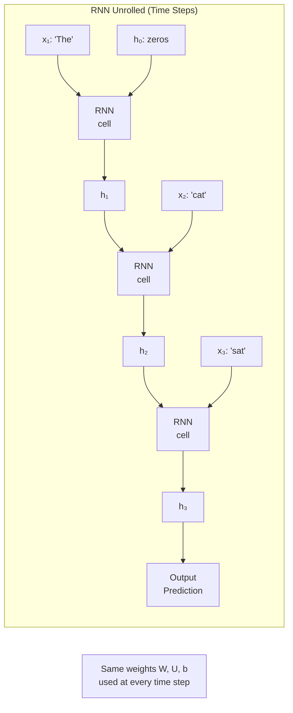

### The Vanishing Gradient in RNNs

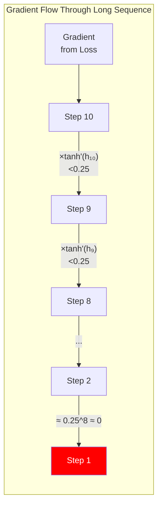

---

## 5. Internal Working

### The RNN Cell Equation

At each time step t:

```
hₜ = tanh(Wₓ × xₜ + Wₕ × hₜ₋₁ + b)
yₜ = Wᵧ × hₜ + bᵧ   (optional output at each step)
```

Where:
- `xₜ` = input at time t (word embedding)
- `hₜ₋₁` = previous hidden state
- `hₜ` = new hidden state (current "memory")
- `Wₓ, Wₕ, b` = learned parameters (SAME at every time step)
- `tanh` = activation function (squashes to [-1, 1])

**Key insight**: The same `Wₓ` and `Wₕ` are used for every time step. This is **parameter sharing through time** — just as CNN parameter sharing is across space.

---

## 6. Implementation

```python
"""
RNN implementations for understanding sequential processing.
"""

import torch
import torch.nn as nn
import numpy as np
from typing import Optional, Tuple

# ─── RNN Cell from Scratch ──────────────────────────────────────────────────

class RNNCellFromScratch:
    """
    Minimal RNN cell implementation using NumPy.
    Educational — to understand the exact computation.
    """
    
    def __init__(self, input_dim: int, hidden_dim: int):
        # Xavier initialization
        scale = np.sqrt(2.0 / (input_dim + hidden_dim))
        
        self.Wx = np.random.randn(input_dim, hidden_dim) * scale    # Input weights
        self.Wh = np.random.randn(hidden_dim, hidden_dim) * scale   # Hidden weights
        self.b  = np.zeros(hidden_dim)                               # Bias
    
    def forward(
        self,
        x: np.ndarray,       # Current input: (input_dim,)
        h_prev: np.ndarray   # Previous hidden state: (hidden_dim,)
    ) -> np.ndarray:
        """One RNN step."""
        z = x @ self.Wx + h_prev @ self.Wh + self.b
        h_new = np.tanh(z)
        return h_new
    
    def process_sequence(
        self,
        sequence: np.ndarray  # (seq_len, input_dim)
    ) -> Tuple[np.ndarray, np.ndarray]:
        """Process entire sequence. Returns all hidden states + final state."""
        hidden_dim = self.Wx.shape[1]
        seq_len = sequence.shape[0]
        
        h = np.zeros(hidden_dim)       # Initialize hidden state
        all_hidden = np.zeros((seq_len, hidden_dim))
        
        for t in range(seq_len):
            h = self.forward(sequence[t], h)
            all_hidden[t] = h
        
        return all_hidden, h  # (seq_len, hidden_dim), (hidden_dim,)


# ─── PyTorch RNN for Sequence Classification ────────────────────────────────

class SequenceClassifierRNN(nn.Module):
    """
    RNN for classifying sequences (e.g., sentiment, intent).
    Uses the final hidden state as the sequence representation.
    """
    
    def __init__(
        self,
        vocab_size: int,
        embed_dim: int = 128,
        hidden_dim: int = 256,
        num_layers: int = 2,
        num_classes: int = 2,
        dropout: float = 0.3,
        bidirectional: bool = True   # Process sequence in both directions
    ):
        super().__init__()
        
        self.embedding = nn.Embedding(vocab_size, embed_dim, padding_idx=0)
        
        # PyTorch's optimized RNN implementation
        self.rnn = nn.RNN(
            input_size=embed_dim,
            hidden_size=hidden_dim,
            num_layers=num_layers,
            batch_first=True,            # Expect (batch, seq, features)
            dropout=dropout if num_layers > 1 else 0,
            bidirectional=bidirectional  # Run forward AND backward
        )
        
        # Bidirectional doubles the hidden size
        direction_factor = 2 if bidirectional else 1
        
        self.classifier = nn.Sequential(
            nn.Dropout(dropout),
            nn.Linear(hidden_dim * direction_factor, 64),
            nn.ReLU(),
            nn.Linear(64, num_classes)
        )
    
    def forward(self, x: torch.Tensor, lengths: Optional[torch.Tensor] = None) -> torch.Tensor:
        """
        x: (batch, seq_len) token indices
        lengths: actual lengths for packing (handles variable-length sequences)
        """
        # Embed: (batch, seq_len) → (batch, seq_len, embed_dim)
        embedded = self.embedding(x)
        
        if lengths is not None:
            # Pack padded sequences for efficiency (skip padding in RNN)
            packed = nn.utils.rnn.pack_padded_sequence(
                embedded, lengths.cpu(), batch_first=True, enforce_sorted=False
            )
            output, hidden = self.rnn(packed)
            output, _ = nn.utils.rnn.pad_packed_sequence(output, batch_first=True)
        else:
            output, hidden = self.rnn(embedded)
        
        # Use final hidden state as sequence representation
        # For bidirectional: concatenate forward and backward final states
        if self.rnn.bidirectional:
            # hidden: (num_layers * 2, batch, hidden_dim)
            # Take the last layer's forward and backward states
            forward_h = hidden[-2]   # Last layer, forward direction
            backward_h = hidden[-1]  # Last layer, backward direction
            final_hidden = torch.cat([forward_h, backward_h], dim=-1)
        else:
            final_hidden = hidden[-1]  # Last layer's hidden state
        
        return self.classifier(final_hidden)


# ─── Sequence-to-Sequence RNN (encoder-decoder) ─────────────────────────────

class Seq2SeqRNN(nn.Module):
    """
    Encoder-Decoder RNN for sequence-to-sequence tasks.
    Historical architecture that preceded transformers for translation/summarization.
    Understanding this helps you understand cross-attention in transformers.
    """
    
    def __init__(
        self,
        src_vocab: int,
        tgt_vocab: int,
        embed_dim: int = 256,
        hidden_dim: int = 512,
        num_layers: int = 2,
        dropout: float = 0.3
    ):
        super().__init__()
        
        # Encoder
        self.src_embedding = nn.Embedding(src_vocab, embed_dim, padding_idx=0)
        self.encoder = nn.LSTM(
            embed_dim, hidden_dim, num_layers,
            batch_first=True, dropout=dropout
        )
        
        # Decoder
        self.tgt_embedding = nn.Embedding(tgt_vocab, embed_dim, padding_idx=0)
        self.decoder = nn.LSTM(
            embed_dim, hidden_dim, num_layers,
            batch_first=True, dropout=dropout
        )
        self.output_proj = nn.Linear(hidden_dim, tgt_vocab)
    
    def encode(self, src: torch.Tensor) -> Tuple:
        """Encode source sequence. Returns final hidden state."""
        embedded = self.src_embedding(src)
        _, (hidden, cell) = self.encoder(embedded)
        return hidden, cell
    
    def decode_step(
        self,
        tgt_token: torch.Tensor,    # (batch,) current token
        hidden: torch.Tensor,       # Decoder hidden state
        cell: torch.Tensor          # Decoder cell state (LSTM)
    ) -> Tuple:
        """One decoder step. Returns logits + updated state."""
        embedded = self.tgt_embedding(tgt_token.unsqueeze(1))  # (batch, 1, embed)
        output, (hidden, cell) = self.decoder(embedded, (hidden, cell))
        logits = self.output_proj(output.squeeze(1))  # (batch, tgt_vocab)
        return logits, hidden, cell
```

---

## 7. Tradeoffs

| Property | Vanilla RNN | LSTM | GRU | Transformer |
|---|---|---|---|---|
| Vanishing gradient | Severe | Solved | Mostly solved | Not an issue |
| Long-range dependencies | Poor | Good | Good | Excellent |
| Training speed | Fast | Medium | Fast | Slow (parallel) |
| Parallelization | None (sequential) | None | None | Full (parallel) |
| Memory usage | Low | Medium | Low-medium | High |
| Interpretability | Medium | Lower | Lower | Attention maps |

---

## 8. Interview Preparation

**Junior**: "RNNs process sequences step by step, maintaining a hidden state that carries information from previous steps. They're good for text, time series, and other sequential data."

**Mid-level**: "RNNs use the same weights at every time step (parameter sharing through time). The vanishing gradient problem limits their ability to capture long-range dependencies — gradients shrink through tanh activation at each step. Bidirectional RNNs process sequences in both directions, capturing past and future context. LSTMs and GRUs were designed to solve the vanishing gradient problem."

**Senior**: "RNNs were replaced by transformers for NLP because: (1) transformers parallelize across the sequence while RNNs are sequential; (2) transformers handle long-range dependencies better through direct attention rather than through hidden state propagation; (3) transformers scale better with data and compute. However, RNNs are still used in: streaming applications (process one token at a time), edge devices (low memory), and hybrid architectures like Mamba (linear recurrence with selective state spaces)."

---

---

# Chapter 5: Long Short-Term Memory (LSTM)

---

## 1. Introduction

### What Is an LSTM?

The LSTM (Long Short-Term Memory) is an advanced RNN cell that solves the vanishing gradient problem through a clever gating mechanism.

The key innovation: instead of one hidden state that must do everything, LSTMs have **two tracks**:
1. **Cell state (C)**: Long-term memory — flows almost unchanged through time unless explicitly modified
2. **Hidden state (h)**: Short-term working memory — used for current output

Three **gates** control what information flows through:
- **Forget gate**: What to erase from long-term memory
- **Input gate**: What new information to add to long-term memory
- **Output gate**: What to output right now (based on both tracks)

### Why LSTMs Matter

LSTMs powered the first great wave of deep learning for NLP (2013–2017):
- Google Translate (2016): LSTM seq2seq
- Google Smart Reply: LSTM
- Apple Siri: LSTM
- Amazon Alexa: LSTM

Understanding LSTMs means understanding:
- How gating controls information flow (concept reused in transformers)
- Why cell state enables long-range memory
- What the GRU simplifies
- What problems transformers ultimately solved better

---

## 2. Historical Motivation

### Why Simple RNNs Fail at Long Sequences

Consider the sentence: "The cat that the dog that the boy owned chased sat on the mat."

To understand that "sat" goes with "cat," you need to maintain "cat" in memory through three levels of nested clauses.

In a vanilla RNN, the hidden state passes through tanh at each step. After 10 steps: `0.9^10 = 0.35`. After 20 steps: `0.9^20 = 0.12`. The signal is essentially gone.

Hochreiter and Schmidhuber (1997) published the LSTM to solve this. The cell state is an **additive path** — information is added or removed, not repeatedly multiplied, avoiding gradient shrinkage.

---

## 3. Real-World Analogy

An LSTM cell is like **a skilled executive assistant** managing your memory.

**Cell state** = the filing cabinet (long-term memory)
**Hidden state** = what's on your current desk (working memory)

The assistant has three tools:
1. **Forget gate**: "Should I shred old files from the cabinet?" Decides what to erase from long-term memory.
2. **Input gate**: "Should I file this new document?" Decides what new information to add to long-term memory.
3. **Output gate**: "What should I put on your desk right now for this task?" Decides what to output from memory.

The filing cabinet (cell state) persists perfectly across time — nothing is lost unless the forget gate deliberately erases it.

---

## 4. Visual Mental Model

### LSTM Cell Internals

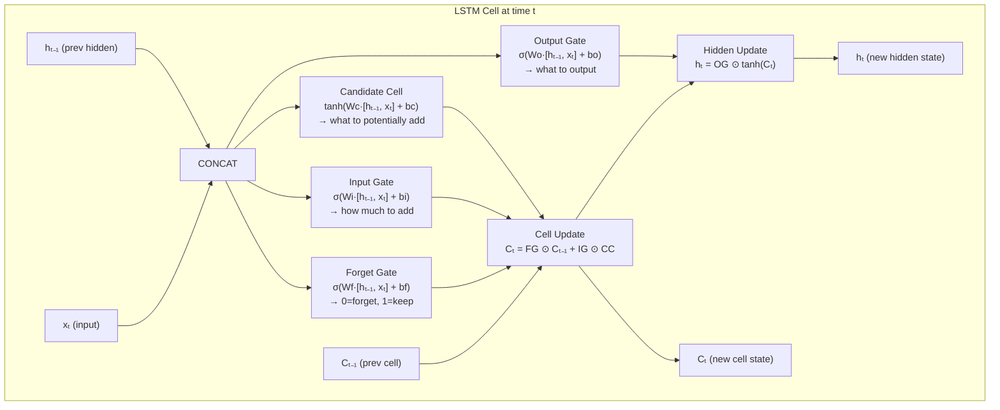

---

## 5. Mathematical Intuition

### The LSTM Equations

At each time step, given input xₜ and previous states (hₜ₋₁, Cₜ₋₁):

```
Concatenate input and hidden: [hₜ₋₁, xₜ]

Forget gate:    fₜ = σ(Wf · [hₜ₋₁, xₜ] + bf)    — 0=forget all, 1=keep all
Input gate:     iₜ = σ(Wi · [hₜ₋₁, xₜ] + bi)    — what to add
Candidate:      C̃ₜ = tanh(Wc · [hₜ₋₁, xₜ] + bc) — what to potentially add
Output gate:    oₜ = σ(Wo · [hₜ₋₁, xₜ] + bo)    — what to output

Cell update:    Cₜ = fₜ ⊙ Cₜ₋₁ + iₜ ⊙ C̃ₜ
                  ↑ forget past    ↑ add new info

Hidden update:  hₜ = oₜ ⊙ tanh(Cₜ)
```

**Why this solves vanishing gradients**:

The cell update is: `Cₜ = fₜ ⊙ Cₜ₋₁ + iₜ ⊙ C̃ₜ`

The gradient through time is:
```
∂Cₜ/∂Cₜ₋₁ = fₜ
```

If the forget gate is near 1, the gradient flows through unchanged! The cell state provides a **gradient highway** — no repeated multiplication by < 1.

---

## 6. Implementation

```python
"""
LSTM implementations:
1. LSTM cell from scratch (educational)
2. PyTorch LSTM for practical use
3. Named Entity Recognition with LSTM (real AI use case)
"""

import torch
import torch.nn as nn
import numpy as np
from typing import Optional, Tuple, List

# ─── LSTM Cell from Scratch ──────────────────────────────────────────────────

class LSTMCellFromScratch:
    """LSTM cell implementation for educational understanding."""
    
    def __init__(self, input_dim: int, hidden_dim: int):
        # 4 gates: forget, input, candidate, output
        # Each gate has input weights, hidden weights, and bias
        self.hidden_dim = hidden_dim
        
        def init_weights(in_dim, out_dim):
            scale = np.sqrt(2.0 / (in_dim + out_dim))
            return np.random.randn(in_dim + out_dim, out_dim) * scale
        
        # Concatenate all gate weights for efficiency
        combined_dim = input_dim + hidden_dim
        self.W = np.random.randn(combined_dim, 4 * hidden_dim) * 0.01
        self.b = np.zeros(4 * hidden_dim)
        
        # Initialize forget gate bias to 1 — encourages initial memory retention
        # This is a best practice for LSTM training stability
        self.b[hidden_dim:2*hidden_dim] = 1.0
    
    def sigmoid(self, x):
        return 1 / (1 + np.exp(-np.clip(x, -500, 500)))
    
    def forward(
        self,
        x: np.ndarray,      # (input_dim,)
        h_prev: np.ndarray, # (hidden_dim,)
        c_prev: np.ndarray  # (hidden_dim,)
    ) -> Tuple[np.ndarray, np.ndarray]:
        """One LSTM step. Returns (h_new, c_new)."""
        
        # Concatenate input and previous hidden state
        combined = np.concatenate([x, h_prev])  # (input_dim + hidden_dim,)
        
        # Compute all gates in one matrix multiplication
        gates = combined @ self.W + self.b  # (4 * hidden_dim,)
        
        # Split into individual gates
        h = self.hidden_dim
        f_raw = gates[:h]        # Forget gate
        i_raw = gates[h:2*h]     # Input gate
        c_raw = gates[2*h:3*h]   # Candidate cell
        o_raw = gates[3*h:]      # Output gate
        
        # Apply activations
        f = self.sigmoid(f_raw)   # 0 to 1 — how much to forget
        i = self.sigmoid(i_raw)   # 0 to 1 — how much to input
        c̃ = np.tanh(c_raw)        # -1 to 1 — candidate values
        o = self.sigmoid(o_raw)   # 0 to 1 — how much to output
        
        # Update cell and hidden state
        c_new = f * c_prev + i * c̃   # Forget old + add new
        h_new = o * np.tanh(c_new)   # Output based on new cell
        
        return h_new, c_new


# ─── Named Entity Recognition with Bidirectional LSTM ─────────────────────

class BiLSTMNER(nn.Module):
    """
    Named Entity Recognition using Bidirectional LSTM.
    
    NER is useful for AI systems:
    - Extract entities from user queries (company names, dates, products)
    - Improve RAG by indexing entities separately
    - Power knowledge graph construction
    
    For each token, predict: B-PER, I-PER, B-ORG, I-ORG, B-LOC, I-LOC, O
    (BIO tagging scheme: Beginning, Inside, Outside of entity)
    """
    
    def __init__(
        self,
        vocab_size: int,
        embed_dim: int = 128,
        hidden_dim: int = 256,
        num_tags: int = 7,          # B-PER, I-PER, B-ORG, I-ORG, B-LOC, I-LOC, O
        num_layers: int = 2,
        dropout: float = 0.3
    ):
        super().__init__()
        
        self.embedding = nn.Embedding(vocab_size, embed_dim, padding_idx=0)
        
        self.lstm = nn.LSTM(
            input_size=embed_dim,
            hidden_size=hidden_dim,
            num_layers=num_layers,
            batch_first=True,
            dropout=dropout,
            bidirectional=True      # Essential for NER: context from both sides
        )
        
        # CRF layer would improve accuracy here for sequence labeling
        # For simplicity: direct linear projection
        self.tag_projection = nn.Linear(hidden_dim * 2, num_tags)
        self.dropout = nn.Dropout(dropout)
    
    def forward(
        self,
        tokens: torch.Tensor,       # (batch, seq_len)
        lengths: torch.Tensor       # Actual sequence lengths (no padding)
    ) -> torch.Tensor:
        """
        Returns: (batch, seq_len, num_tags) — tag logits for each position
        """
        embedded = self.dropout(self.embedding(tokens))
        
        # Pack for efficiency with variable-length sequences
        packed = nn.utils.rnn.pack_padded_sequence(
            embedded, lengths.cpu(), batch_first=True, enforce_sorted=False
        )
        lstm_out, _ = self.lstm(packed)
        lstm_out, _ = nn.utils.rnn.pad_packed_sequence(lstm_out, batch_first=True)
        
        # (batch, seq_len, hidden*2) → (batch, seq_len, num_tags)
        logits = self.tag_projection(self.dropout(lstm_out))
        return logits
    
    def predict(self, tokens: torch.Tensor, lengths: torch.Tensor) -> List[List[int]]:
        """Predict tag sequences for a batch."""
        with torch.no_grad():
            logits = self.forward(tokens, lengths)
            predictions = logits.argmax(dim=-1)
        
        # Remove padding
        result = []
        for i, length in enumerate(lengths):
            result.append(predictions[i, :length].tolist())
        return result


# ─── Language Model with LSTM ─────────────────────────────────────────────

class LSTMLanguageModel(nn.Module):
    """
    LSTM-based language model — historical predecessor to transformers.
    
    Predicts the next token given all previous tokens.
    Conceptually similar to GPT but uses sequential LSTM instead of attention.
    
    Understanding this helps you appreciate:
    - Why transformers needed to replace RNNs (parallelization, long range)
    - How language modeling works in principle
    """
    
    def __init__(
        self,
        vocab_size: int,
        embed_dim: int = 256,
        hidden_dim: int = 512,
        num_layers: int = 3,
        dropout: float = 0.3
    ):
        super().__init__()
        
        self.embedding = nn.Embedding(vocab_size, embed_dim)
        self.dropout = nn.Dropout(dropout)
        
        self.lstm = nn.LSTM(
            embed_dim, hidden_dim, num_layers,
            batch_first=True, dropout=dropout
        )
        
        # Weight tying: use same weights for embedding and output projection
        # This is also done in modern transformers (GPT uses weight tying)
        self.output = nn.Linear(hidden_dim, vocab_size, bias=False)
        
        # Tie embedding and output weights
        if embed_dim == hidden_dim:
            self.output.weight = self.embedding.weight
    
    def forward(
        self,
        tokens: torch.Tensor,              # (batch, seq_len)
        hidden: Optional[Tuple] = None     # Previous LSTM state for incremental generation
    ) -> Tuple[torch.Tensor, Tuple]:
        """
        Returns:
        - logits: (batch, seq_len, vocab_size)
        - hidden: LSTM state for next call (important for generation!)
        """
        embedded = self.dropout(self.embedding(tokens))
        lstm_out, hidden = self.lstm(embedded, hidden)
        logits = self.output(self.dropout(lstm_out))
        return logits, hidden
    
    @torch.no_grad()
    def generate(
        self,
        prompt_tokens: List[int],
        max_new_tokens: int = 50,
        temperature: float = 0.8
    ) -> List[int]:
        """Autoregressive text generation with LSTM."""
        tokens = torch.tensor([prompt_tokens])
        hidden = None
        generated = list(prompt_tokens)
        
        # Process the prompt
        _, hidden = self.forward(tokens, hidden)
        
        # Generate token by token
        current_token = torch.tensor([[prompt_tokens[-1]]])
        
        for _ in range(max_new_tokens):
            logits, hidden = self.forward(current_token, hidden)
            
            # Apply temperature
            next_token_logits = logits[0, -1] / temperature
            probs = torch.softmax(next_token_logits, dim=-1)
            
            # Sample
            next_token = torch.multinomial(probs, num_samples=1).item()
            generated.append(next_token)
            current_token = torch.tensor([[next_token]])
        
        return generated
```

---

## 7. Tradeoffs

| Property | LSTM | GRU | Transformer |
|---|---|---|---|
| Parameters | 4× hidden_dim² | 3× hidden_dim² | O(L × d²) |
| Long-range memory | Good (cell state) | Good (reset gate) | Excellent (direct attention) |
| Training speed | Sequential | Sequential | Parallel |
| Implementation complexity | High | Medium | High |
| Streaming inference | ✅ Natural | ✅ Natural | ❌ Needs KV cache |

---

## 8. Common Mistakes

❌ **Forgetting to initialize forget gate bias to 1**: This best practice (Jozefowicz et al., 2015) dramatically improves training stability. The forget gate should initially be "remember everything" and learn to forget selectively.

❌ **Not using packed sequences for variable-length batches**: Padding affects the LSTM state. Use `pack_padded_sequence` and `pad_packed_sequence` for correct behavior.

❌ **Using final hidden state for sequence tasks with padding**: The final hidden state includes processing of padding tokens. Use lengths to extract the hidden state at the actual end of each sequence.

---

## 9. Interview Preparation

**Junior**: "LSTM solves the vanishing gradient problem in RNNs by using a cell state (long-term memory) controlled by gates. Forget gate decides what to erase, input gate decides what to add, output gate decides what to output."

**Mid-level**: "The cell state provides an additive gradient path — `∂Cₜ/∂Cₜ₋₁ = fₜ` — which doesn't suffer from repeated multiplication unlike vanilla RNN. Key design choices: bidirectional LSTM for tasks needing both past and future context; initialize forget gate bias to 1 for training stability; use packed sequences for variable-length data. LSTMs were replaced by transformers for NLP because transformers parallelize training and handle longer dependencies."

**Senior**: "The core LSTM insight — selective read/write/forget through learned gates — reappears in transformer attention. The softmax attention weights are analogous to input gate (how much to read from each position); the attention output is analogous to the hidden state. Transformers replace the sequential gating with parallel attention, solving the training speed bottleneck. In 2024, architectures like Mamba revive recurrence with selective state spaces — similar gating concept but with hardware-aware implementation."

---

---

# Chapter 6: Gated Recurrent Units (GRU)

---

## 1. Introduction

### What Is a GRU?

The Gated Recurrent Unit (GRU), introduced by Cho et al. (2014), is a simplified version of the LSTM. It achieves similar performance with fewer parameters and less computation.

Key simplification: the GRU has **two gates** (instead of three) and **one state** (instead of two):
- **Reset gate**: How much past state to forget when computing new state
- **Update gate**: How much of the previous state to keep vs. replace

The LSTM's separate cell state and hidden state are merged into one. This reduces parameters and speeds up training, often with minimal performance loss.

---

## 2. Real-World Analogy

If LSTM is a **detailed executive assistant with three different filing systems**, GRU is a **smart notebook with two simple rules**:

1. **Reset rule**: "For this new thought, should I start fresh or build on what I already wrote?" (Reset gate)
2. **Update rule**: "How much should my current understanding change based on this new information?" (Update gate)

Simpler, but covers the essential needs for most tasks.

---

## 3. Visual Mental Model

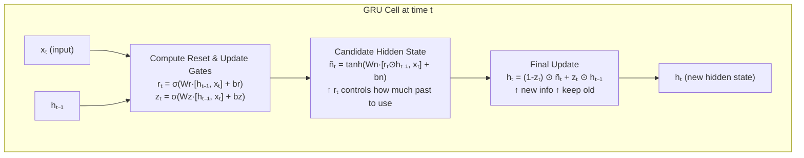

---

## 4. Mathematical Intuition

### GRU Equations

```
Reset gate:    rₜ = σ(Wr · [hₜ₋₁, xₜ] + br)
               — Controls: how much past hidden state to use for candidate

Update gate:   zₜ = σ(Wz · [hₜ₋₁, xₜ] + bz)
               — Controls: how much of the past to carry forward (zₜ=1: ignore new input)

Candidate:     ñₜ = tanh(Wn · [rₜ ⊙ hₜ₋₁, xₜ] + bn)
               — New candidate hidden state, using reset-filtered past

New state:     hₜ = (1 - zₜ) ⊙ ñₜ + zₜ ⊙ hₜ₋₁
               — Interpolation: blend new candidate with old state
```

**The update gate as an interpolation**: When zₜ → 1, hₜ ≈ hₜ₋₁ (keep old state, ignore input — like LSTM's forget gate = 1).
When zₜ → 0, hₜ ≈ ñₜ (completely replace with new candidate).

---

## 5. Implementation

```python
"""
GRU implementations for practical AI applications.
"""

import torch
import torch.nn as nn
import numpy as np
from typing import Tuple, Optional, List

# ─── GRU Cell from Scratch ──────────────────────────────────────────────────

class GRUCellFromScratch:
    """GRU cell implemented in NumPy for educational understanding."""
    
    def __init__(self, input_dim: int, hidden_dim: int):
        self.hidden_dim = hidden_dim
        combined = input_dim + hidden_dim
        scale = np.sqrt(2.0 / combined)
        
        # Reset and update gate weights (combined for efficiency)
        self.W_rz = np.random.randn(combined, 2 * hidden_dim) * scale
        self.b_rz = np.zeros(2 * hidden_dim)
        
        # Candidate hidden state weights
        self.W_n = np.random.randn(combined, hidden_dim) * scale
        self.b_n = np.zeros(hidden_dim)
    
    def sigmoid(self, x):
        return 1 / (1 + np.exp(-np.clip(x, -500, 500)))
    
    def forward(
        self,
        x: np.ndarray,       # (input_dim,)
        h_prev: np.ndarray   # (hidden_dim,)
    ) -> np.ndarray:
        combined = np.concatenate([h_prev, x])
        
        # Gates
        gates = combined @ self.W_rz + self.b_rz
        h = self.hidden_dim
        r = self.sigmoid(gates[:h])   # Reset gate
        z = self.sigmoid(gates[h:])   # Update gate
        
        # Candidate (uses reset gate to filter past)
        combined_reset = np.concatenate([r * h_prev, x])
        n = np.tanh(combined_reset @ self.W_n + self.b_n)
        
        # New hidden state: interpolation
        h_new = (1 - z) * n + z * h_prev
        
        return h_new


# ─── GRU for Streaming Chat Summary ─────────────────────────────────────────

class ConversationSummaryGRU(nn.Module):
    """
    GRU for maintaining a running summary of conversation state.
    
    Practical use: in LLM chatbot systems, instead of sending full
    conversation history (expensive), maintain a compressed GRU state
    that summarizes the conversation so far.
    
    Processes one message at a time (streaming-friendly).
    """
    
    def __init__(
        self,
        vocab_size: int,
        embed_dim: int = 128,
        hidden_dim: int = 512,
        summary_dim: int = 256     # Compressed summary dimension
    ):
        super().__init__()
        
        self.embed = nn.Embedding(vocab_size, embed_dim, padding_idx=0)
        
        # GRU is often faster than LSTM with similar quality for this task
        self.gru = nn.GRU(
            input_size=embed_dim,
            hidden_size=hidden_dim,
            num_layers=2,
            batch_first=True,
            dropout=0.2,
            bidirectional=False    # Causal — can't look at future
        )
        
        # Compress GRU state to summary embedding
        self.summary_proj = nn.Sequential(
            nn.Linear(hidden_dim, summary_dim),
            nn.Tanh()
        )
        
        # Decode summary to natural language (simplified)
        self.summary_head = nn.Linear(summary_dim, vocab_size)
    
    def forward(
        self,
        tokens: torch.Tensor,              # (batch, seq_len)
        hidden: Optional[torch.Tensor] = None  # Previous GRU state
    ) -> Tuple[torch.Tensor, torch.Tensor]:
        """
        Process a message and update conversation state.
        
        Returns:
        - summary_embedding: (batch, summary_dim) — compressed conversation state
        - hidden: updated GRU hidden state for next message
        """
        embedded = self.embed(tokens)                  # (batch, seq, embed)
        gru_out, hidden = self.gru(embedded, hidden)  # (batch, seq, hidden)
        
        # Use last token's hidden state as conversation summary
        last_hidden = gru_out[:, -1, :]                # (batch, hidden)
        summary = self.summary_proj(last_hidden)        # (batch, summary_dim)
        
        return summary, hidden
    
    @torch.no_grad()
    def update_state(
        self,
        message_tokens: List[int],
        current_hidden: Optional[torch.Tensor] = None
    ) -> Tuple[np.ndarray, torch.Tensor]:
        """
        Process one message and return updated conversation summary.
        Called once per new message in the conversation.
        """
        tokens = torch.tensor([message_tokens])
        summary, new_hidden = self.forward(tokens, current_hidden)
        return summary.numpy()[0], new_hidden


# ─── GRU vs. LSTM Performance Comparison ───────────────────────────────────

class GRUClassifier(nn.Module):
    """Minimal GRU classifier for benchmarking against LSTM."""
    
    def __init__(self, vocab_size, embed_dim=128, hidden_dim=256, num_classes=2):
        super().__init__()
        self.embed = nn.Embedding(vocab_size, embed_dim, padding_idx=0)
        self.gru = nn.GRU(embed_dim, hidden_dim, num_layers=2,
                          batch_first=True, dropout=0.3, bidirectional=True)
        self.fc = nn.Linear(hidden_dim * 2, num_classes)
        self.dropout = nn.Dropout(0.3)
    
    def forward(self, x):
        embedded = self.dropout(self.embed(x))
        _, hidden = self.gru(embedded)
        # Concatenate last layer forward and backward states
        final = torch.cat([hidden[-2], hidden[-1]], dim=-1)
        return self.fc(self.dropout(final))
    
    def parameter_count(self) -> int:
        return sum(p.numel() for p in self.parameters())
```

---

## 7. GRU vs. LSTM: When to Use Which

| Consideration | Choose GRU | Choose LSTM |
|---|---|---|
| Training speed | GRU (25% fewer params) | LSTM |
| Long sequences (>500 steps) | LSTM | LSTM |
| Dataset size | Small: GRU (less overfit) | Large: similar |
| Memory constraints | GRU (one state) | LSTM (two states) |
| Empirical performance | Similar — test both | Similar |

**Practical advice**: On most modern NLP tasks, neither. Use a transformer. But for streaming, edge devices, or when you need explicit sequential state: GRU is a strong, simpler choice than LSTM.

---

## 8. Interview Preparation

**Junior**: "GRU is a simplified version of LSTM with two gates instead of three. It's faster and has fewer parameters, with similar performance on most tasks."

**Mid-level**: "GRU combines LSTM's cell and hidden states into one. The update gate is a linear interpolation between old and new state: `hₜ = (1-z)×new + z×old`. This is cleaner than LSTM but loses the explicit memory separation. GRU trains faster because it has ~25% fewer parameters. Both are largely replaced by transformers for NLP, but remain useful for streaming and edge applications."

**Senior**: "GRU and LSTM represent a design spectrum for recurrent sequence models. Both solve vanilla RNN's vanishing gradient through learned gating of state updates. The empirical preference between them is task-dependent — LSTMs generally perform better on tasks requiring very long-range memory (>100 steps), GRUs on shorter sequences. In modern AI systems, I'd reach for transformers first. For streaming inference where you need O(1) memory per step, GRU/LSTM remain relevant. The Mamba architecture (2023) revives the GRU concept with selective state spaces and hardware-aware computation, achieving transformer-level performance with linear complexity."

---

---

# Chapter 7: Attention Mechanism

---

## 1. Introduction

### What Is Attention?

The attention mechanism allows a neural network to **focus on the most relevant parts of the input** when producing each element of the output.

Before attention, seq2seq models (encoder-decoder RNNs) compressed the entire input into a single fixed-size vector. This bottleneck caused quality degradation for long sequences — critical information was lost.

Attention solves this: instead of compressing everything into one vector, the decoder at each step can **look back at all encoder outputs** and weight them by relevance. This is attention — the ability to selectively focus.

### Why Attention Is the Most Important Concept in Modern AI

The attention mechanism became the foundation of transformers, which became the foundation of every modern LLM. When you understand attention:
- You understand how GPT processes a prompt (self-attention)
- You understand how BERT understands context bidirectionally
- You understand cross-attention in diffusion models and multimodal systems
- You understand why transformers replaced RNNs
- You are ready for Part 4 (Transformer Architecture) of this handbook

---

## 2. Historical Motivation

### The Context Vector Bottleneck

In Bahdanau et al. (2014)'s time, seq2seq models for machine translation worked like this:

```
Input: "The cat sat on the mat"
           ↓ (encoder)
     Single vector: [0.2, -0.5, 0.8, ...] (512 dimensions)
           ↓ (decoder)
Output: "Le chat était assis sur le tapis"
```

For a 30-word sentence, all information must be compressed into 512 numbers. Long sentences lost crucial details.

### The Attention Breakthrough

Bahdanau et al. (2014): "What if the decoder could look at all encoder hidden states, not just the last one?"

At each decoding step, compute a **weighted average of all encoder states**, where the weights depend on how relevant each encoder position is for the current decoder step.

When translating "mat" → "tapis": attend heavily to the encoder's representation of "mat."
When translating "chat" → "chat": attend heavily to the encoder's representation of "cat."

This simple idea revolutionized NLP. Vaswani et al. (2017) then asked: "What if we use attention everywhere — not just for decoder-to-encoder?" That was the transformer.

---

## 3. Real-World Analogy

Attention is like **looking up information in a library using relevance matching**.

You have a **query** (what you're looking for).
The library has many **keys** (catalog descriptions) and **values** (the actual books).

You compare your query to every key. The more similar your query is to a key, the more weight you give to its corresponding value. Your answer is a weighted combination of all values, where weights reflect relevance.

This is exactly the Query-Key-Value (QKV) formulation of attention — the formulation used in every modern transformer.

In a sentence: "The animal didn't cross the street because **it** was too tired."
- **Query**: the representation of "it" — "what does 'it' refer to?"
- **Keys**: representations of all previous words
- **Values**: information content of each word
- **Result**: "it" attends most to "animal" — understanding the reference.

---

## 4. Visual Mental Model

### Attention Score Computation

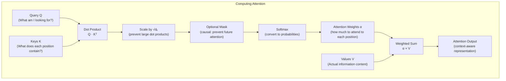

### Self-Attention in a Sentence

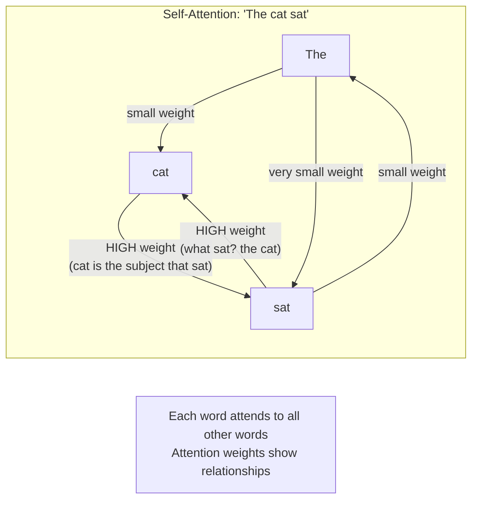

---

## 5. Internal Working

### Step-by-Step: Scaled Dot-Product Attention

Given a sequence of tokens with embedding dimension d_model:

**Step 1: Create Q, K, V matrices**
Each token's embedding is linearly projected into three spaces:
```python
Q = X @ W_Q    # (seq_len, d_k) — what each position is looking for
K = X @ W_K    # (seq_len, d_k) — what each position can offer
V = X @ W_V    # (seq_len, d_v) — what each position actually contains
```

**Step 2: Compute attention scores**
```python
scores = Q @ K.T / sqrt(d_k)    # (seq_len, seq_len)
```
Each element `scores[i,j]` = how much position i should attend to position j.

Division by `√d_k`: Without scaling, dot products grow with dimension (√d_k expected magnitude). Large values push softmax into extreme regions with tiny gradients.

**Step 3: Softmax to get attention weights**
```python
weights = softmax(scores)    # (seq_len, seq_len) — rows sum to 1
```

**Step 4: Weighted sum of values**
```python
output = weights @ V    # (seq_len, d_v)
```

Each output position is a weighted mixture of all value vectors.

---

## 6. Mathematical Intuition

### The Attention Formula

```
Attention(Q, K, V) = softmax(Q × Kᵀ / √dₖ) × V
```

Let's unpack every part:

**Q × Kᵀ**: Dot product similarity between every query and every key.
- High dot product = query and key point in similar direction = high relevance
- This is a `(seq_len × dₖ) × (dₖ × seq_len) = (seq_len × seq_len)` matrix

**÷ √dₖ**: Scale factor.
- Without scaling: in 512 dimensions, dot products can be ~22 (√512)
- Large values → softmax saturates → near one-hot → gradients vanish
- Dividing by √dₖ keeps values in a reasonable range

**softmax(...)**: Normalize to probability distribution (rows sum to 1).

**× V**: Weighted average of value vectors.
- High weight → that value contributes more to the output
- This retrieves relevant information from each position

### Why Dot Product for Similarity?

The dot product between two vectors measures their alignment:
```
a · b = |a| × |b| × cos(θ)
```

When both Q and K have unit norm (after proper initialization), `a · b = cos(θ)` — pure cosine similarity.

Two position representations are "similar" (high attention weight) when they're about the same concept — the network learns to make Q and K point in the same direction for semantically related positions.

---

## 7. Implementation

### Complete Attention Implementation

```python
"""
Attention mechanism implementations:
1. Bahdanau (additive) attention — historical
2. Scaled dot-product attention — used in transformers
3. Multi-head attention — the full transformer component
4. Causal (masked) attention — for autoregressive generation (GPT-style)
"""

import torch
import torch.nn as nn
import torch.nn.functional as F
import math
from typing import Optional, Tuple

# ─── Scaled Dot-Product Attention ─────────────────────────────────────────

def scaled_dot_product_attention(
    Q: torch.Tensor,   # (batch, heads, seq_q, d_k)
    K: torch.Tensor,   # (batch, heads, seq_k, d_k)
    V: torch.Tensor,   # (batch, heads, seq_k, d_v)
    mask: Optional[torch.Tensor] = None,   # (batch, 1, seq_q, seq_k)
    dropout: float = 0.0
) -> Tuple[torch.Tensor, torch.Tensor]:
    """
    Scaled dot-product attention.
    
    This is the core operation inside every transformer.
    Returns: (attention output, attention weights)
    """
    d_k = Q.size(-1)
    
    # Attention scores: (batch, heads, seq_q, seq_k)
    scores = torch.matmul(Q, K.transpose(-2, -1)) / math.sqrt(d_k)
    
    # Apply mask (for causal attention or padding)
    if mask is not None:
        # Fill masked positions with very large negative value
        # After softmax, these become ~0
        scores = scores.masked_fill(mask == 0, -1e9)
    
    # Softmax over the key dimension
    weights = F.softmax(scores, dim=-1)
    
    # Apply dropout to attention weights
    if dropout > 0.0 and torch.is_tensor(weights):
        weights = F.dropout(weights, p=dropout, training=True)
    
    # Weighted sum of values
    output = torch.matmul(weights, V)  # (batch, heads, seq_q, d_v)
    
    return output, weights


# ─── Multi-Head Attention ──────────────────────────────────────────────────

class MultiHeadAttention(nn.Module):
    """
    Multi-head attention as described in "Attention Is All You Need" (2017).
    
    The key insight: instead of one attention function with d_model dimensions,
    run h attention functions in parallel with d_model/h dimensions each.
    
    Why multi-head?
    - Different heads can attend to different types of relationships simultaneously
    - Head 1 might attend to syntactic structure, Head 2 to semantic similarity
    - h heads × d_model/h dimensions = same total computation but richer representations
    """
    
    def __init__(
        self,
        d_model: int,      # Total model dimension (e.g., 512)
        num_heads: int,    # Number of attention heads (e.g., 8)
        dropout: float = 0.1
    ):
        super().__init__()
        
        assert d_model % num_heads == 0, "d_model must be divisible by num_heads"
        
        self.d_model = d_model
        self.num_heads = num_heads
        self.d_k = d_model // num_heads  # Dimension per head
        
        # Linear projections for Q, K, V
        # Note: W_Q, W_K, W_V are (d_model → d_model) but logically split into heads
        self.W_Q = nn.Linear(d_model, d_model, bias=False)
        self.W_K = nn.Linear(d_model, d_model, bias=False)
        self.W_V = nn.Linear(d_model, d_model, bias=False)
        
        # Output projection — recombines all heads
        self.W_O = nn.Linear(d_model, d_model, bias=False)
        
        self.dropout = dropout
    
    def split_heads(self, x: torch.Tensor) -> torch.Tensor:
        """
        Split the last dimension into (num_heads, d_k).
        x: (batch, seq_len, d_model)
        → (batch, num_heads, seq_len, d_k)
        """
        batch, seq_len, d_model = x.size()
        x = x.view(batch, seq_len, self.num_heads, self.d_k)
        return x.transpose(1, 2)  # (batch, num_heads, seq_len, d_k)
    
    def combine_heads(self, x: torch.Tensor) -> torch.Tensor:
        """
        Reverse of split_heads.
        x: (batch, num_heads, seq_len, d_k)
        → (batch, seq_len, d_model)
        """
        batch, num_heads, seq_len, d_k = x.size()
        x = x.transpose(1, 2).contiguous()  # (batch, seq_len, num_heads, d_k)
        return x.view(batch, seq_len, self.d_model)
    
    def forward(
        self,
        query: torch.Tensor,    # (batch, seq_q, d_model)
        key: torch.Tensor,      # (batch, seq_k, d_model)
        value: torch.Tensor,    # (batch, seq_k, d_model)
        mask: Optional[torch.Tensor] = None
    ) -> Tuple[torch.Tensor, torch.Tensor]:
        """
        Multi-head attention forward pass.
        
        For self-attention: query = key = value = x
        For cross-attention: query from decoder, key/value from encoder
        """
        batch = query.size(0)
        
        # 1. Project to Q, K, V
        Q = self.W_Q(query)  # (batch, seq_q, d_model)
        K = self.W_K(key)    # (batch, seq_k, d_model)
        V = self.W_V(value)  # (batch, seq_k, d_model)
        
        # 2. Split into heads
        Q = self.split_heads(Q)  # (batch, heads, seq_q, d_k)
        K = self.split_heads(K)  # (batch, heads, seq_k, d_k)
        V = self.split_heads(V)  # (batch, heads, seq_k, d_k)
        
        # 3. Compute scaled dot-product attention
        attn_output, attn_weights = scaled_dot_product_attention(
            Q, K, V, mask, self.dropout if self.training else 0.0
        )
        # attn_output: (batch, heads, seq_q, d_k)
        
        # 4. Combine heads
        combined = self.combine_heads(attn_output)  # (batch, seq_q, d_model)
        
        # 5. Final linear projection
        output = self.W_O(combined)  # (batch, seq_q, d_model)
        
        return output, attn_weights


# ─── Causal (Masked) Self-Attention for Autoregressive Models ──────────────

class CausalSelfAttention(nn.Module):
    """
    Causal self-attention — the core of GPT-style models.
    
    "Causal" means position i can only attend to positions ≤ i.
    Future tokens are masked out — the model can't cheat by looking ahead.
    
    This is what allows autoregressive text generation:
    generate token 1, feed it back, generate token 2, etc.
    """
    
    def __init__(self, d_model: int, num_heads: int, max_seq_len: int = 2048, dropout: float = 0.1):
        super().__init__()
        
        self.attention = MultiHeadAttention(d_model, num_heads, dropout)
        
        # Pre-compute causal mask (triangular)
        # mask[i,j] = 1 if position i CAN attend to position j, else 0
        causal_mask = torch.tril(torch.ones(max_seq_len, max_seq_len))
        # Register as buffer — not a parameter, but part of model state
        self.register_buffer("causal_mask", causal_mask)
    
    def forward(self, x: torch.Tensor) -> Tuple[torch.Tensor, torch.Tensor]:
        """
        x: (batch, seq_len, d_model)
        Self-attention: query = key = value = x
        """
        batch, seq_len, _ = x.size()
        
        # Get causal mask for current sequence length
        mask = self.causal_mask[:seq_len, :seq_len]
        mask = mask.unsqueeze(0).unsqueeze(0)  # (1, 1, seq_len, seq_len)
        
        # Self-attention: Q, K, V all come from x
        return self.attention(x, x, x, mask)


# ─── Cross-Attention (Encoder-Decoder Attention) ───────────────────────────

class CrossAttention(nn.Module):
    """
    Cross-attention for encoder-decoder architectures.
    
    Query comes from the decoder (what we're looking for).
    Key and Value come from the encoder (what the source contains).
    
    This is how seq2seq transformers (T5, BART) translate:
    the decoder asks "what source information do I need for this target word?"
    
    Also used in:
    - Multimodal models (CLIP-like): text queries attend to image patches
    - RAG with cross-encoder reranking
    """
    
    def __init__(self, d_model: int, num_heads: int, dropout: float = 0.1):
        super().__init__()
        self.attention = MultiHeadAttention(d_model, num_heads, dropout)
    
    def forward(
        self,
        decoder_hidden: torch.Tensor,   # (batch, tgt_len, d_model) — the query
        encoder_output: torch.Tensor,    # (batch, src_len, d_model) — keys & values
        src_mask: Optional[torch.Tensor] = None  # Mask padding in source
    ) -> Tuple[torch.Tensor, torch.Tensor]:
        """
        Cross-attention:
        Q = decoder_hidden (what the decoder is looking for)
        K = V = encoder_output (what the encoder found in the source)
        """
        return self.attention(
            query=decoder_hidden,
            key=encoder_output,
            value=encoder_output,
            mask=src_mask
        )


# ─── Visualizing Attention ─────────────────────────────────────────────────

def visualize_attention_weights(
    tokens: list[str],
    attention_weights: torch.Tensor,  # (heads, seq_len, seq_len)
    head: int = 0
):
    """
    Print attention weights as a heatmap in the terminal.
    Useful for understanding what the model is attending to.
    """
    weights = attention_weights[head].detach().numpy()
    
    # Header
    print(f"\nAttention Head {head}:")
    print("       " + "  ".join(f"{t[:6]:>6}" for t in tokens))
    
    for i, row_token in enumerate(tokens):
        row = f"{row_token[:6]:>6} "
        for j in range(len(tokens)):
            intensity = weights[i, j]
            if intensity > 0.5:
                row += "  ████"
            elif intensity > 0.25:
                row += "  ▓▓▓▓"
            elif intensity > 0.1:
                row += "  ▒▒▒▒"
            elif intensity > 0.05:
                row += "  ░░░░"
            else:
                row += "  ····"
        print(row)


# ─── Practical: Attention-based Sentence Similarity ────────────────────────

class AttentionSimilarityModel(nn.Module):
    """
    Cross-sentence attention for semantic similarity.
    
    Use case: reranking in RAG — compute how relevant a document
    is to a query using cross-attention between them.
    
    This is the "cross-encoder" architecture used by:
    - BGE-reranker, cross-encoder/ms-marco models
    - Cohere Rerank API (internally)
    """
    
    def __init__(self, d_model: int = 256, num_heads: int = 4):
        super().__init__()
        
        self.cross_attn_1 = CrossAttention(d_model, num_heads)
        self.cross_attn_2 = CrossAttention(d_model, num_heads)
        
        self.similarity_head = nn.Sequential(
            nn.Linear(d_model * 2, 64),
            nn.ReLU(),
            nn.Linear(64, 1),
            nn.Sigmoid()
        )
    
    def forward(
        self,
        query_embed: torch.Tensor,    # (batch, q_len, d_model)
        doc_embed: torch.Tensor       # (batch, d_len, d_model)
    ) -> torch.Tensor:
        """
        Compute relevance score using cross-attention.
        Returns: (batch,) relevance scores in [0, 1]
        """
        # Query attends to document
        q_attended, _ = self.cross_attn_1(query_embed, doc_embed)
        
        # Document attends to query
        d_attended, _ = self.cross_attn_2(doc_embed, query_embed)
        
        # Pool to fixed-size representations
        q_repr = q_attended.mean(dim=1)    # (batch, d_model)
        d_repr = d_attended.mean(dim=1)    # (batch, d_model)
        
        # Compute similarity
        combined = torch.cat([q_repr, d_repr], dim=-1)
        return self.similarity_head(combined).squeeze(-1)
```

---

## 8. Production Architecture

### Attention in Production Systems

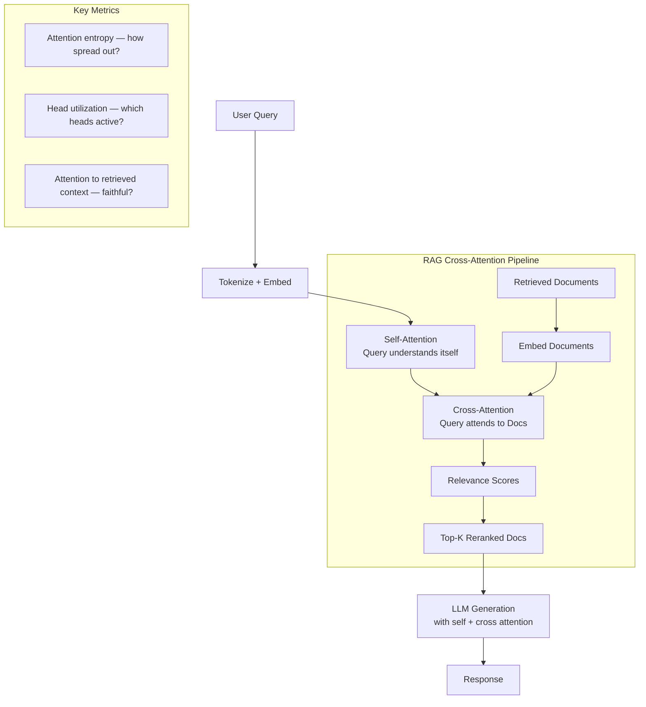

---

## 9. Tradeoffs

| Attention Type | Complexity | Use Case | Key Property |
|---|---|---|---|
| Bahdanau (additive) | O(N×M) | Seq2seq, historical | Learned compatibility |
| Scaled dot-product | O(N²) | All transformers | Simple, parallelizable |
| Multi-head | O(h × (N/h)²) = O(N²) | All transformers | Multiple relationship types |
| Sparse attention | O(N√N) | Very long sequences | Reduces quadratic cost |
| Flash Attention | O(N²) compute, O(N) memory | Modern LLMs | Memory-efficient implementation |
| Linear attention | O(N) | Efficient transformers | Approximates softmax attention |

---

## 10. Common Mistakes

❌ **Not scaling by √d_k**: Without scaling, attention scores become very large in high dimensions → softmax saturates → near-uniform or near-one-hot attention → poor training.

❌ **Confusing self-attention and cross-attention**: Self-attention: Q, K, V all from the same sequence. Cross-attention: Q from one sequence, K and V from another. Cross-attention is how the decoder looks at the encoder in seq2seq.

❌ **Not masking padding in attention**: Padding tokens should have zero attention weight. Without padding masks, the model learns from meaningless positions.

❌ **Using causal mask in encoder**: Encoders (BERT) should attend to all positions — no causal mask. Decoders (GPT) need causal masks. Mixing these causes subtle bugs.

---

## 11. Interview Preparation

**Junior**: "Attention lets the model focus on relevant parts of the input. It computes scores between a query and all keys, converts to probabilities with softmax, then uses them to weighted-average values."

**Mid-level**: "Scaled dot-product attention: compute Q×Kᵀ/√d_k, apply softmax, multiply by V. Multi-head attention runs H parallel attention functions with smaller dimensions, concatenates, and projects — capturing multiple relationship types. Causal mask prevents GPT from attending to future tokens."

**Senior**: "The Q-K-V formulation is a differentiable soft lookup table: Q=query, K=index, V=content to retrieve. This is more expressive than RNN hidden states because: (1) any position can directly interact with any other position in O(1) steps rather than O(N) sequential steps; (2) the computation is fully parallel; (3) attention weights are interpretable (we can visualize what the model attends to). In RAG systems, I use cross-encoder attention (query attends to each document) for reranking — it's more accurate than embedding cosine similarity because it directly computes query-document interaction."

**Principal**: "The attention mechanism is a content-addressable memory with soft retrieval. The fundamental insight is that token representations should be context-dependent — the word 'bank' should have different representations in 'river bank' vs. 'bank account'. Attention achieves this by making each token's representation a weighted mixture of all other tokens' value vectors. Flash Attention (Dao et al., 2022) doesn't change the mathematical result but changes the memory access pattern — tiling keeps intermediate results in SRAM instead of writing to HBM, giving 2-4× speedup. Multi-query attention (Shazeer, 2019) and grouped-query attention (GQA, Ainslie et al., 2023) reduce KV cache memory by sharing K and V across heads — critical for long-context inference efficiency."

---

## 12. Follow-up Questions

**Q1: What is the difference between self-attention and cross-attention?**
> Self-attention: Q, K, V all derived from the same sequence X. Each position can attend to every other position in the same sequence. Used in: BERT encoder, GPT decoder, all single-sequence processing. Cross-attention: Q comes from sequence A, K and V from sequence B. Sequence A attends to sequence B. Used in: encoder-decoder seq2seq (decoder queries the encoder), multimodal models (text queries image patches), RAG cross-encoders.

**Q2: Why does multi-head attention work better than single-head?**
> Different attention heads learn to represent different types of relationships: one head might track subject-verb agreement, another tracks coreference, another tracks positional proximity. With one head, the model must represent all these with the same parameters. With multiple heads, specialization naturally emerges. Research (Voita et al., 2019) shows heads are interpretable and specializable.

**Q3: What is Flash Attention and why is it important?**
> Flash Attention (Dao et al., 2022) is a rewrite of the attention computation that avoids materializing the full N×N attention matrix in GPU HBM (high bandwidth memory). Instead, it tiles the computation so intermediate results stay in fast SRAM. Result: 2-4× speedup, O(N) memory instead of O(N²), enabling much longer context windows. Flash Attention 2 and 3 further improved parallelism. All modern LLMs use Flash Attention.

**Q4: What is the KV cache and how does attention enable it?**
> During autoregressive generation, the K and V matrices for already-processed tokens don't change. KV caching saves these matrices so they don't need to be recomputed for every new token. This reduces generation from O(N²) total work to O(N) after prefill. The Q must change at each step (new token queries previous ones), but K and V are cached. Memory cost: O(N × num_layers × d_model) — grows with sequence length, which limits practical batch sizes.

**Q5: What is the relationship between attention and retrieval systems?**
> Attention is essentially a differentiable soft retrieval: given a query Q, retrieve the most relevant values V using key matching K. This is identical in concept to a vector database retrieval. The difference: attention is trained end-to-end within the model (the Q, K, V matrices are learned parameters), while RAG retrieval uses a frozen embedding model and approximate nearest neighbor search. The conceptual alignment is why "attention is all you need" — it's a learned retrieval mechanism.

**Q6: What is sparse attention and when is it used?**
> Sparse attention restricts each token to attend to only a subset of other tokens (e.g., nearby tokens, or tokens within the same chunk). This reduces O(N²) to O(N×k) where k is the attention neighborhood size. Used in: Longformer (local + global attention), BigBird (random + local + global). Trades some quality for the ability to handle very long sequences (tens of thousands of tokens).

**Q7: Explain the intuition behind positional encoding and its relationship to attention.**
> Attention is permutation-equivariant — it produces the same output regardless of token order (just with reordered results). This is wrong for language: "cat sat mat" and "mat sat cat" should mean different things. Positional encodings add position information to token embeddings so the attention mechanism can distinguish "token at position 5" from "same token at position 50." Sinusoidal encodings (original transformer) are fixed; learned encodings (GPT) are parameters; RoPE (Llama) rotates Q and K vectors by an angle proportional to position, encoding relative positions directly in the attention scores.

---

## 13. Practical Scenario

### Scenario: Building an Attention-Based Document Reranker

**Context**: A legal AI startup's RAG system retrieves 50 documents per query using vector similarity. But many retrieved documents are topically adjacent but not actually relevant. They need a reranker.

**Solution**: Cross-attention based reranker using a pre-trained sentence transformer.

```python
"""
Production reranker using cross-attention.
Uses sentence-transformers library with cross-encoder model.
"""

from sentence_transformers import CrossEncoder
from typing import List, Tuple
import asyncio

class AttentionReranker:
    """
    Cross-encoder reranker using attention to score (query, document) pairs.
    
    vs. Bi-encoder (embedding cosine similarity):
    - Slower (processes each query-doc pair separately)
    - More accurate (attention directly computes query-doc interaction)
    - Not scalable to millions of docs — use after initial retrieval
    """
    
    def __init__(self, model_name: str = "cross-encoder/ms-marco-MiniLM-L-6-v2"):
        self.model = CrossEncoder(model_name, max_length=512)
    
    def rerank(
        self,
        query: str,
        documents: List[str],
        top_k: int = 5
    ) -> List[Tuple[float, str]]:
        """
        Rerank documents using cross-attention relevance scores.
        
        Returns top_k (score, document) pairs sorted by relevance.
        """
        # Create (query, document) pairs
        pairs = [(query, doc) for doc in documents]
        
        # Score each pair using cross-encoder attention
        scores = self.model.predict(pairs)
        
        # Sort by score descending
        scored = list(zip(scores, documents))
        scored.sort(key=lambda x: x[0], reverse=True)
        
        return scored[:top_k]
    
    def batch_rerank(
        self,
        queries: List[str],
        documents_per_query: List[List[str]],
        top_k: int = 5
    ) -> List[List[Tuple[float, str]]]:
        """Batch reranking for multiple queries."""
        return [
            self.rerank(query, docs, top_k)
            for query, docs in zip(queries, documents_per_query)
        ]


# Comparison: Bi-encoder vs Cross-encoder reranking
async def compare_retrieval_approaches():
    """
    Demonstrates the quality improvement from reranking.
    """
    from openai import AsyncOpenAI
    import numpy as np
    
    client = AsyncOpenAI()
    
    query = "What are the penalties for breach of fiduciary duty?"
    
    documents = [
        "Fiduciary duty requires acting in the best interest of the client.",
        "Breach of fiduciary duty can result in compensatory damages, disgorgement of profits, and injunctive relief.",
        "The statute of limitations for fiduciary duty claims is typically 3-6 years.",
        "Contract law governs most business relationships.",
        "Securities regulations require disclosure of material information.",
    ]
    
    # Bi-encoder: compute cosine similarity
    response = await client.embeddings.create(
        input=[query] + documents,
        model="text-embedding-3-small"
    )
    embeddings = np.array([item.embedding for item in sorted(response.data, key=lambda x: x.index)])
    
    query_emb = embeddings[0]
    doc_embs = embeddings[1:]
    
    cosine_scores = doc_embs @ query_emb / (
        np.linalg.norm(doc_embs, axis=1) * np.linalg.norm(query_emb)
    )
    
    print("Bi-encoder (cosine similarity) ranking:")
    for score, doc in sorted(zip(cosine_scores, documents), reverse=True):
        print(f"  [{score:.3f}] {doc[:60]}...")
    
    # Cross-encoder: attention-based reranking
    reranker = AttentionReranker()
    reranked = reranker.rerank(query, documents, top_k=5)
    
    print("\nCross-encoder (attention) reranking:")
    for score, doc in reranked:
        print(f"  [{score:.3f}] {doc[:60]}...")
```

**Results in practice**: Cross-encoder reranking improves NDCG@5 by 15–25% on most legal and technical retrieval benchmarks, at the cost of ~50ms extra latency per query.

---

## 14. Revision Sheet

### Key Points
- Attention = soft, differentiable information retrieval: Q queries, K indexes, V provides content
- Scaled dot-product: scores = Q×Kᵀ/√d_k → softmax → weighted sum of V
- Scale by √d_k to prevent softmax saturation in high dimensions
- Multi-head: h parallel attention functions → richer representations, different relationship types
- Self-attention: Q=K=V=same sequence → any position attends to any other
- Cross-attention: Q from sequence A, K/V from sequence B → sequence A queries sequence B
- Causal mask: future positions set to -∞ → enables autoregressive generation
- Flash Attention: memory-efficient implementation, O(N) memory instead of O(N²)

### Key Formulas
```
Attention(Q,K,V) = softmax(QKᵀ / √dₖ) × V
Multi-head: Concat(head₁, ..., headₕ) × Wₒ
Each head: head_i = Attention(QWᵢQ, KWᵢK, VWᵢV)
Causal mask: scores[i,j] = -∞ if j > i
```

### Common Interview Traps
- "Attention is O(N log N)" → It's O(N²) — quadratic in sequence length
- "KV cache stores all computations" → Only K and V; Q changes each step
- "Multi-head is slower than single-head" → Same total FLOPS, but richer representations
- "Self-attention and cross-attention use same weights" → No — different projection matrices

---

## 15. Hands-on Exercises

**Easy**: Implement `scaled_dot_product_attention` from scratch. Verify your outputs match `F.scaled_dot_product_attention` (PyTorch built-in).

**Medium**: Implement `MultiHeadAttention` from scratch. Test on a simple sequence labeling task.

**Hard**: Build a cross-attention based reranker. Train it on MS MARCO relevance judgments. Evaluate using NDCG@10.

**Production**: Integrate a CrossEncoder reranker into a RAG pipeline. Measure latency impact and NDCG improvement. Optimize batch size for your latency/quality tradeoff.

---

## 16. Mini Project: Attention Visualizer for RAG Debugging

Build a tool that:
1. Takes a user query and retrieved documents as input
2. Runs them through a cross-encoder with `output_attentions=True`
3. Visualizes which parts of the document the model attended to for the query
4. Helps identify why a document was ranked high or low

```python
"""
Attention visualization for RAG debugging.
Uses HuggingFace cross-encoder with attention output.
"""

from transformers import AutoTokenizer, AutoModelForSequenceClassification
import torch
import numpy as np

def visualize_cross_encoder_attention(
    query: str,
    document: str,
    model_name: str = "cross-encoder/ms-marco-MiniLM-L-6-v2"
) -> dict:
    """
    Run cross-encoder and extract attention weights.
    Shows which parts of the document the model focused on for the query.
    """
    tokenizer = AutoTokenizer.from_pretrained(model_name)
    model = AutoModelForSequenceClassification.from_pretrained(
        model_name,
        output_attentions=True
    )
    model.eval()
    
    # Tokenize (query, document) pair
    inputs = tokenizer(
        query, document,
        return_tensors="pt",
        truncation=True,
        max_length=512
    )
    
    with torch.no_grad():
        outputs = model(**inputs)
    
    # Relevance score
    score = float(outputs.logits[0])
    
    # Attention from last layer (most task-relevant)
    # Shape: (1, num_heads, seq_len, seq_len)
    last_layer_attn = outputs.attentions[-1][0]  # (heads, seq, seq)
    
    # Average across heads
    avg_attn = last_layer_attn.mean(dim=0)  # (seq, seq)
    
    # Get tokens
    tokens = tokenizer.convert_ids_to_tokens(inputs["input_ids"][0])
    
    # Find which tokens are from query vs. document
    sep_positions = [i for i, t in enumerate(tokens) if t == "[SEP]"]
    
    return {
        "score": score,
        "tokens": tokens,
        "attention_matrix": avg_attn.numpy(),
        "query_len": sep_positions[0] if sep_positions else 0,
        "sep_positions": sep_positions
    }
```

---

# Summary: Part 3 — Deep Learning

This part built the deep learning foundation that every AI engineer must understand — from how a single neuron learns to how attention enables transformers:

| Chapter | Core Insight |
|---|---|
| **1. Neural Networks** | Universal function approximators. Each layer learns increasingly abstract representations. Activation functions enable non-linearity. PyTorch autograd handles gradients. |
| **2. Backpropagation** | The chain rule applied backward through the computational graph. Two passes compute all N gradients. Vanishing gradients in deep sigmoid networks solved by ReLU and skip connections. |
| **3. CNNs** | Parameter sharing through space: one filter detects a pattern everywhere. Hierarchical features: edges → shapes → objects. Still relevant for documents, audio, and multimodal AI. |
| **4. RNNs** | Parameter sharing through time: same weights process each step. Maintains hidden state for sequence memory. Fundamental limitation: sequential computation prevents parallelization. |
| **5. LSTMs** | Cell state provides additive gradient path, solving vanishing gradients. Three gates control information flow. Foundation for NLP 2014–2017. |
| **6. GRUs** | Simplified LSTM with two gates, one state. 25% fewer parameters, comparable performance. Better for streaming and edge deployment. |
| **7. Attention** | Soft, differentiable retrieval: Q queries, K indexes, V provides content. Scores = QKᵀ/√d_k. Multi-head = multiple relationship types simultaneously. The foundation of every modern LLM. |

The connecting thread: every architecture in deep learning is a different answer to the same question — **how do we build representations that capture the right information for the task?** CNNs captured spatial locality. RNNs captured temporal sequences. LSTMs captured long-range temporal dependencies. Attention captures arbitrary relationships between any positions. That's why transformers won — they captured the most general relationships.

Now you're ready for Part 4: Transformer Architecture, where these concepts are combined into the engine that powers GPT, Claude, and Gemini.

---

*End of Part 3 — Deep Learning*
