# Part 4 – Transformer Architecture
## AI Engineer Handbook

---

> **How to read this part**: Every chapter builds on the last. Read them in order the first time. After that, use the Revision Sheets as quick-reference cards before interviews.

---

# Table of Contents

1. [Self-Attention](#chapter-1-self-attention)
2. [Cross-Attention](#chapter-2-cross-attention)
3. [QKV — Queries, Keys, Values](#chapter-3-qkv)
4. [Multi-Head Attention](#chapter-4-multi-head-attention)
5. [Positional Encoding](#chapter-5-positional-encoding)
6. [The Encoder](#chapter-6-the-encoder)
7. [The Decoder](#chapter-7-the-decoder)
8. [BERT](#chapter-8-bert)
9. [GPT](#chapter-9-gpt)
10. [T5](#chapter-10-t5)
11. [RoPE — Rotary Positional Embedding](#chapter-11-rope)
12. [Flash Attention](#chapter-12-flash-attention)
13. [KV Cache](#chapter-13-kv-cache)

---

# Chapter 1: Self-Attention

## 1. Introduction

**What is it?**

Self-attention is the mechanism that allows every word in a sentence to look at every other word in the same sentence and decide how much each other word matters for understanding *itself*.

Before self-attention existed, models read text like a person walking through a dark tunnel with a tiny flashlight — they could only see the word immediately in front of them. Self-attention is the moment someone turned the lights on in the whole room. Every word can now see the entire sentence at once.

**Why does it exist?**

Language is full of long-range dependencies. Consider:

> *"The animal didn't cross the street because it was too tired."*

What does *"it"* refer to? The animal, not the street. But "animal" and "it" are separated by five words. A model that can only look at nearby words will guess wrong. Self-attention solves this by letting "it" reach all the way back to "animal" and form a strong connection.

**What problem does it solve?**

| Problem | Old Solution | Self-Attention Solution |
|---|---|---|
| Long-range dependencies | RNNs forget distant context | Every token attends to every token |
| Sequential processing | RNNs process one word at a time | All tokens processed in parallel |
| Fixed context window | LSTMs had vanishing gradients | Attention is direct, no gradient decay |

**Where is it used?**

Self-attention is the core building block of every modern Transformer: GPT, BERT, T5, LLaMA, Claude, Gemini, and hundreds more.

---

## 2. Historical Motivation

**What existed before?**

Before 2017, the dominant sequence models were:

- **RNNs (Recurrent Neural Networks)**: processed tokens one at a time, passing a hidden state forward. Think of it as a game of telephone — information degrades with each pass.
- **LSTMs (Long Short-Term Memory)**: added gates to remember or forget information. Better, but still sequential, and still struggled with very long sequences.
- **CNNs applied to text**: could capture local patterns but not distant relationships.

**Why was this insufficient?**

RNNs and LSTMs have three fundamental problems:

1. **Sequential computation**: Token 5 can't be computed until Token 4 is done. This prevents parallelization on GPUs. Training on millions of documents becomes impossibly slow.

2. **Gradient vanishing**: When you backpropagate error through 500 timesteps, the gradient (the signal that teaches the model) shrinks exponentially. The model simply stops learning from distant context.

3. **Fixed-size hidden state bottleneck**: The entire history of the sequence must be compressed into one vector. For long documents, this is like trying to summarize a novel into a single sentence.

**Why was self-attention invented?**

In 2017, Vaswani et al. published *"Attention Is All You Need."* The insight was radical: instead of sequentially passing state, let every token communicate directly with every other token in a single step. No bottleneck. No sequential constraint. Full parallelism.

---

## 3. Real-World Analogy

**The Library Committee Meeting**

Imagine a room of 10 librarians, each holding a different book. You walk in and say: *"I need information about ancient Rome."*

- In the **RNN world**: Librarian 1 whispers to Librarian 2, who whispers to Librarian 3… by the time the message reaches Librarian 10, the details are garbled. This is the information bottleneck.

- In the **Self-Attention world**: All 10 librarians hear your question simultaneously. Each one independently decides how relevant *their* book is to your query. The librarian with the Roman history book raises their hand high (high attention weight). The librarian with the cookbook barely raises theirs (low attention weight). You collect the weighted input from all of them and synthesize the answer.

Every word in a sentence is simultaneously a librarian (holding information) AND a person asking a question AND a topic that other librarians evaluate relevance against. This three-role identity — Query, Key, Value — is the heart of attention.

---

## 4. Visual Mental Model

### The Self-Attention Flow

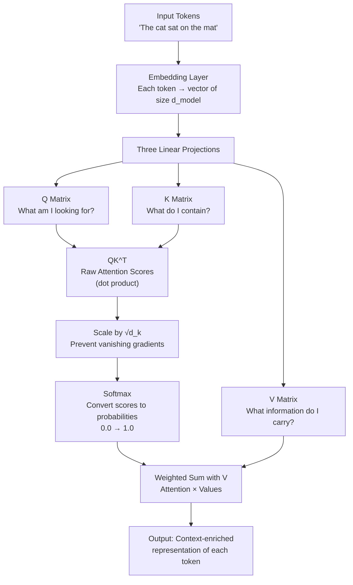

### Attention Score Matrix for a 4-Token Sentence

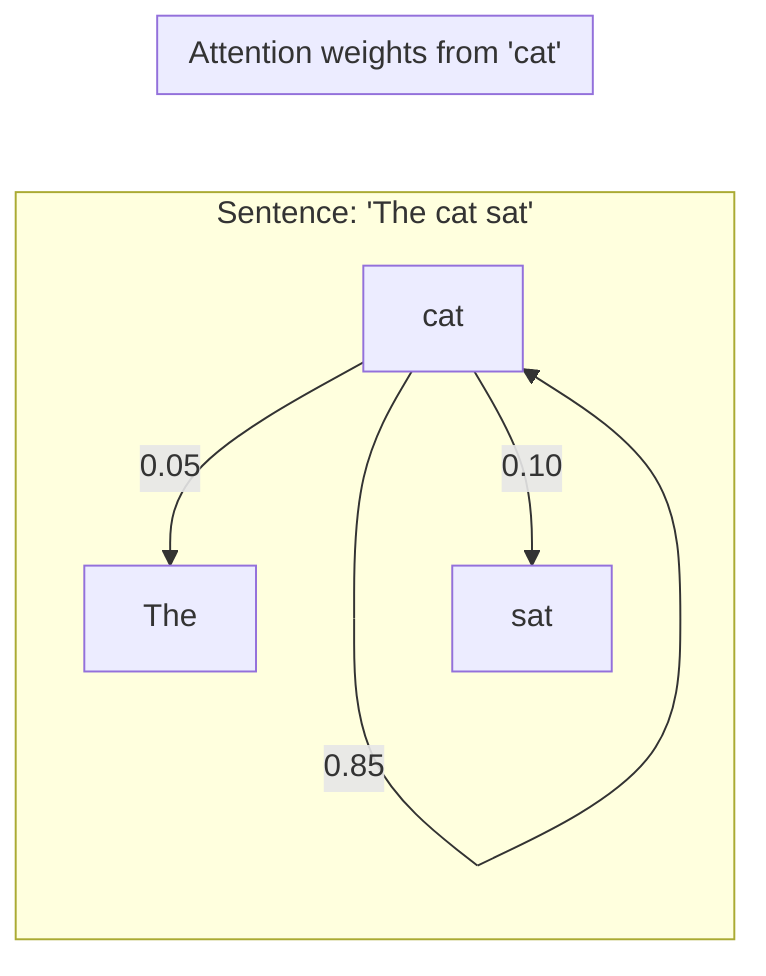

This shows that when processing "cat," the model pays 85% attention to itself, 10% to "sat" (the action), and 5% to "The" (low relevance).

---

## 5. Internal Working

Let's trace a complete forward pass through self-attention, step by step.

**Input**: The sentence *"The cat sat"* with 3 tokens. Each token has been converted to an embedding vector of dimension `d_model = 4` (simplified; real models use 768 or 4096).

```
X = [[1.0, 0.2, 0.8, 0.1],   ← "The"
     [0.3, 1.0, 0.5, 0.9],   ← "cat"
     [0.7, 0.4, 0.2, 0.6]]   ← "sat"
```

**Step 1: Create Q, K, V matrices**

Three weight matrices `W_Q`, `W_K`, `W_V` are learned during training. They are of shape `[d_model, d_k]` where `d_k` is the dimension of each head.

```
Q = X @ W_Q   ← Query: "What am I looking for?"
K = X @ W_K   ← Key:   "What can I offer?"
V = X @ W_V   ← Value: "What information do I carry?"
```

Each of Q, K, V is a matrix of shape `[seq_len, d_k]`. Here, `[3, d_k]`.

**Step 2: Compute raw attention scores**

```
scores = Q @ K^T
```

This gives a `[3, 3]` matrix. Entry `[i, j]` is the dot product between the query of token `i` and the key of token `j`. A high value means token `i` "resonates" with token `j`.

**Step 3: Scale the scores**

```
scores = scores / sqrt(d_k)
```

Without scaling, large `d_k` values cause extremely large dot products, which push softmax into regions where gradients become near-zero (the softmax "saturates"). Dividing by `sqrt(d_k)` keeps scores in a numerically healthy range.

**Step 4: Apply Softmax (row-wise)**

```
attention_weights = softmax(scores, axis=-1)
```

Each row now sums to 1.0. These are the attention probabilities. Row `i` tells us: "How much should token `i` attend to every other token?"

**Step 5: Weighted sum of Values**

```
output = attention_weights @ V
```

For each token, we compute a weighted average of all Value vectors. The output is a new `[3, d_k]` matrix where each row is a context-enriched representation of each token.

**Why is this so powerful?** Because the representation of "cat" now contains a blend of information from ALL tokens in the sentence, weighted by how relevant each one is.

---

## 6. Mathematical Intuition

The complete self-attention formula is:

```
Attention(Q, K, V) = softmax( QK^T / √d_k ) × V
```

Let's unpack every piece:

| Symbol | Meaning | Why it's there |
|---|---|---|
| `Q` | Query matrix | Represents what each token is searching for |
| `K` | Key matrix | Represents what each token is advertising |
| `K^T` | Transpose of K | Needed to compute pairwise dot products |
| `QK^T` | Raw score matrix | Measures alignment between every Q and every K |
| `d_k` | Head dimension | The size of Q and K vectors |
| `√d_k` | Scaling factor | Prevents softmax saturation |
| `softmax()` | Normalizer | Converts scores into a probability distribution |
| `V` | Value matrix | The actual content to be mixed and returned |

**The dot product as similarity**: The dot product `q · k` is maximized when two vectors point in the same direction. So `QK^T` is essentially computing: "How similar is what token `i` is looking for to what token `j` has?" The more aligned, the higher the score, the more attention.

**Why softmax and not something simpler?** Softmax does two things: it (1) amplifies differences — a score of 5 vs 4 becomes a probability of 0.73 vs 0.27, making the winner clearer — and (2) ensures all weights sum to 1, making the output a proper weighted average.

---

## 7. Implementation

```python
import torch
import torch.nn as nn
import torch.nn.functional as F
import math


class SelfAttention(nn.Module):
    """
    Scaled Dot-Product Self-Attention.
    
    This is the fundamental building block of every Transformer model.
    Production-quality implementation with masking support.
    """

    def __init__(self, d_model: int, d_k: int):
        """
        Args:
            d_model: Dimension of input embeddings (e.g., 768 for BERT-base)
            d_k: Dimension of Q, K, V projections (usually d_model // num_heads)
        """
        super().__init__()
        self.d_k = d_k

        # Three learnable linear projections
        self.W_q = nn.Linear(d_model, d_k, bias=False)
        self.W_k = nn.Linear(d_model, d_k, bias=False)
        self.W_v = nn.Linear(d_model, d_k, bias=False)

    def forward(
        self,
        x: torch.Tensor,
        mask: torch.Tensor | None = None
    ) -> tuple[torch.Tensor, torch.Tensor]:
        """
        Args:
            x:    Input tensor of shape [batch_size, seq_len, d_model]
            mask: Optional boolean mask [batch_size, seq_len, seq_len]
                  True = masked out (do not attend)
        
        Returns:
            output:  Context-enriched tensor [batch_size, seq_len, d_k]
            weights: Attention weight matrix [batch_size, seq_len, seq_len]
        """
        # Step 1: Project to Q, K, V
        Q = self.W_q(x)  # [batch, seq_len, d_k]
        K = self.W_k(x)  # [batch, seq_len, d_k]
        V = self.W_v(x)  # [batch, seq_len, d_k]

        # Step 2: Compute raw scores — QK^T
        # [batch, seq_len, d_k] @ [batch, d_k, seq_len] = [batch, seq_len, seq_len]
        scores = torch.bmm(Q, K.transpose(1, 2))

        # Step 3: Scale
        scores = scores / math.sqrt(self.d_k)

        # Step 4: Apply mask (e.g., causal mask for GPT, padding mask)
        if mask is not None:
            scores = scores.masked_fill(mask, float('-inf'))

        # Step 5: Softmax to get attention weights
        weights = F.softmax(scores, dim=-1)  # [batch, seq_len, seq_len]

        # Step 6: Weighted sum of values
        output = torch.bmm(weights, V)  # [batch, seq_len, d_k]

        return output, weights


# --- Quick test ---
if __name__ == "__main__":
    batch_size, seq_len, d_model, d_k = 2, 6, 64, 32
    x = torch.randn(batch_size, seq_len, d_model)

    attn = SelfAttention(d_model=d_model, d_k=d_k)
    output, weights = attn(x)

    print(f"Input shape:   {x.shape}")           # [2, 6, 64]
    print(f"Output shape:  {output.shape}")       # [2, 6, 32]
    print(f"Weights shape: {weights.shape}")      # [2, 6, 6]
    print(f"Weights sum (should be 1.0): {weights[0].sum(dim=-1)}")
```

---

## 8. Production Architecture

**Scalability**

Self-attention has `O(n²)` complexity in sequence length `n`. A sequence of 1,000 tokens requires 1,000,000 attention score computations. At 100,000 tokens (book-length), this becomes 10 billion — computationally brutal. Solutions include:
- **Flash Attention** (Chapter 12): Tiled computation to reduce memory
- **Sparse Attention**: Only attend to a subset of tokens
- **Linear Attention**: Approximate attention in O(n)

**Memory**

The attention matrix `[batch, heads, seq_len, seq_len]` is the largest memory consumer. For seq_len=4096, heads=32, batch=8: `4096 × 4096 × 32 × 8 × 2 bytes = 8.6 GB` just for attention weights.

**Latency**

- Prefill phase (processing prompt): `O(n²)` — the bottleneck
- Decode phase (generating tokens): `O(n)` per new token with KV cache

**Caching**

KV Cache (Chapter 13) stores computed K and V matrices during generation so they don't need to be recomputed for each new token.

**Numerical Stability**

Always use `float32` for attention score computation even in mixed-precision training. `bfloat16` scores cause overflow. PyTorch's `scaled_dot_product_attention` handles this correctly.

---

## 9. Tradeoffs

| Aspect | Self-Attention | RNN/LSTM |
|---|---|---|
| Long-range dependencies | ✅ Perfect (direct connections) | ❌ Degrades with distance |
| Parallelism | ✅ Full parallel computation | ❌ Sequential |
| Memory | ❌ O(n²) for long sequences | ✅ O(n) |
| Short sequences | ✅ Overkill but fine | ✅ Efficient |
| Interpretability | ✅ Attention weights are visualizable | ❌ Hidden state is opaque |
| Positional awareness | ❌ Needs explicit position encoding | ✅ Inherently sequential |

**When NOT to use self-attention**:
- Very long documents (100K+ tokens) without Flash Attention
- Extremely latency-sensitive applications on small sequences where RNNs are faster

---

## 10. Common Mistakes

**Interview Mistakes**
- Saying "attention is just dot product similarity" — it's similarity *plus* learned projection. The projections are what make it powerful.
- Forgetting the `√d_k` scaling and not being able to explain why it exists.
- Confusing self-attention (token attends to its own sequence) with cross-attention (token attends to a different sequence).

**Implementation Mistakes**
- Forgetting to transpose K: `Q @ K` instead of `Q @ K^T`. This gives a `[d_k, d_k]` instead of `[seq_len, seq_len]` matrix.
- Applying softmax on the wrong dimension (axis=0 vs axis=-1). Must be row-wise (axis=-1).
- Not masking padding tokens — padding tokens contribute to attention, polluting representations.

**Production Mistakes**
- Not using KV cache during inference — causes 10-100× speed degradation.
- Computing attention in `float16` without careful numerics — leads to NaN in attention weights.
- Ignoring the quadratic memory cost for long documents in production.

---

## 11. Interview Preparation

**Junior Engineer Answer**:
> "Self-attention lets every word in a sentence look at every other word to decide which ones are most important for understanding itself. It computes a score between each pair of words and uses those scores to create a weighted combination of all the word representations."

**Mid-Level Engineer Answer**:
> "Self-attention projects input embeddings into three spaces — Query, Key, Value — then computes scaled dot-product similarity between Q and K. The softmax of these scores gives attention weights, which are used to create a weighted sum of V. This runs in parallel for all tokens, solving the sequential bottleneck of RNNs and enabling O(1) information flow between any two tokens regardless of distance."

**Senior Engineer Answer**:
> "Self-attention is `softmax(QK^T/√d_k)V` where Q, K, V are learned linear projections of the same input sequence. The scaling by `√d_k` prevents softmax saturation in high-dimensional spaces. The quadratic `O(n²)` cost is the primary bottleneck for long-context models, addressed by Flash Attention's IO-aware tiled computation. In production, the KV cache eliminates recomputation of K and V during autoregressive decoding."

**Staff Engineer Answer**:
> "Self-attention can be seen as a differentiable, content-based memory lookup. The Q-K dot product performs a soft nearest-neighbor search over the sequence. The learned projections W_Q, W_K, W_V implement feature selection — they extract task-relevant subspaces from the full embedding. Multiple heads (Chapter 4) run this in parallel across different subspaces, capturing syntactic, semantic, and positional relationships simultaneously. The key insight from 'Attention Is All You Need' is that sequence-to-sequence transduction doesn't require recurrence — just pairwise token communication."

**Principal Engineer Answer**:
> "Self-attention's power lies in the composition of learned projections with content-based routing. W_Q and W_K learn to extract features that determine *relevance*, while W_V learns what *information* to propagate given that relevance. The softmax routing is differentiable, enabling end-to-end training. At scale, the practical constraints are: (1) O(n²) memory requiring Flash Attention for sequences >8K; (2) KV cache memory being a significant serving cost — at LLaMA-2 70B with 4K context, KV cache is 80GB per request; (3) attention heads becoming redundant in large models, motivating MQA/GQA for inference efficiency. The fundamental research question today is whether attention can be replaced with linear alternatives (state space models like Mamba) without quality loss."

---

## 12. Follow-up Questions

**Q1: Why do we scale by `√d_k` and not `d_k`?**

As `d_k` grows, the variance of the dot product `q·k` grows proportionally to `d_k` (since each element has variance 1 and we sum `d_k` of them). Dividing by `√d_k` normalizes the variance back to 1. This keeps softmax in a gradient-friendly regime.

**Q2: What happens if you don't scale?**

With high `d_k` (e.g., 64+), raw dot products become very large. Softmax of large values pushes one element to near-1 and all others to near-0. This is called *peaky* attention — the model attends to exactly one token. Gradients from softmax become near-zero, and training stalls.

**Q3: Can attention weights be negative?**

No. Softmax always outputs values in (0, 1) and they sum to 1. However, the raw scores before softmax (logits) can be negative.

**Q4: What is causal masking?**

In autoregressive models (GPT), token at position `i` must not see tokens at positions `j > i` (future tokens). Causal masking sets scores for future positions to `-inf` before softmax, ensuring their weights become 0.

**Q5: What is padding masking?**

Batches contain sequences of different lengths padded with dummy tokens. Padding tokens should not receive attention. A padding mask sets scores from/to padding positions to `-inf`.

**Q6: How does self-attention achieve permutation equivariance?**

If you shuffle the input tokens, self-attention produces the same outputs (just in a different order). This is because attention is a set operation — it treats the input as an unordered set. This is why positional encoding (Chapter 5) is necessary.

**Q7: What is the difference between encoder self-attention and decoder self-attention?**

Encoder: bidirectional (full attention matrix, all tokens see all tokens). Decoder: causal/autoregressive (lower triangular mask, each token only sees previous tokens).

**Q8: What are "attention patterns"?**

Different heads learn different patterns: some heads track syntactic dependencies (verb-subject), others track co-reference ("it" → "animal"), others track positional patterns (adjacent tokens). This emergent specialization is fascinating and not explicitly programmed.

**Q9: Why is self-attention permutation equivariant but position-sensitive after adding positional encoding?**

Without positional encoding, the model has no way to distinguish "dog bites man" from "man bites dog." Adding positional information (sinusoidal or learned) breaks the symmetry. The model can then learn position-sensitive patterns.

**Q10: What is sparse attention?**

Instead of each token attending to all n tokens (O(n²)), sparse attention patterns (sliding window, global tokens, random tokens) reduce cost to O(n√n) or O(n log n). Used in Longformer, BigBird.

**Q11: What is linear attention?**

Linear attention approximates softmax(QK^T)V using a kernel trick to rewrite it as Q(K^TV), reducing complexity from O(n²d) to O(nd²). Trades some quality for O(n) scaling.

**Q12: What is the rank of the attention matrix?**

For softmax attention, the attention matrix is full-rank but "approximately low-rank" — the eigenvalue spectrum decays quickly. This is exploited by low-rank approximation methods.

**Q13: Can transformers process variable-length sequences?**

Yes. The attention mechanism has no fixed sequence length — it's defined for any n. Positional encodings can be extended or interpolated.

**Q14: How is attention used in image models (ViT)?**

Images are split into fixed-size patches (e.g., 16×16 pixels). Each patch becomes a token. Self-attention then operates over patches, letting the model relate distant image regions.

**Q15: What is "attention entropy"?**

The entropy of an attention distribution `-Σ p_i log p_i`. High entropy = spread attention (attending to many tokens equally). Low entropy = focused attention. A model collapsing to low-entropy (attending to only one or two tokens) is a sign of training instability.

**Q16: What is "attention sink"?**

Observed in large language models: the first token (often `<BOS>`) receives disproportionately high attention in deep layers, even when it's semantically irrelevant. This "sink" token absorbs attention that would otherwise cause numerical issues. StreamingLLM exploits this to enable infinite context.

**Q17: What is dot-product attention vs additive attention?**

Dot-product (Luong): `score = q · k` — fast, GPU-parallelizable.  
Additive (Bahdanau): `score = v^T tanh(W_q q + W_k k)` — uses a small neural network, historically first, more expressive but slower.

**Q18: How does attention differ from convolution?**

Convolution: fixed, local, position-relative receptive field. Attention: dynamic, global, content-determined receptive field. Convolution is O(n) but can't see far. Attention is O(n²) but sees everything.

**Q19: What is "grouped query attention" (GQA)?**

A variant where multiple query heads share a single key-value head. Reduces the KV cache size proportionally while maintaining most of the expressiveness. Used in LLaMA-2 and Mistral.

**Q20: What would happen if W_Q = W_K = W_V = Identity?**

Each token would attend to itself most strongly (its own embedding has the highest dot product with itself), and the output would be a smoothed version of the inputs. This is a degenerate case with no learned behavior — it demonstrates why the learned projections are essential.

---

## 13. Practical Scenario

**Company**: A legal tech startup building a contract analysis system.  
**Problem**: The model needs to identify whether an indemnification clause in a 50-page contract refers back to a definition established 40 pages earlier.  
**RNN Approach (Failed)**: The LSTM's hidden state couldn't carry the precise definition across 10,000 tokens. It simply forgot by the time it reached the clause.  
**Transformer Approach (Success)**: With self-attention and sufficient context window (8K+ tokens), the model could directly connect the clause to its definition regardless of distance.  
**Architecture**: BERT-based encoder with 8K context via RoPE. The attention pattern for the indemnification clause directly lit up the definition paragraph 40 pages back.  
**Lesson Learned**: Self-attention's O(n²) cost was worth paying for legal documents. For 50-page documents (~12K tokens), Flash Attention was essential to fit in GPU memory.

---

## 14. Revision Sheet

### Key Formula
```
Attention(Q, K, V) = softmax( QK^T / √d_k ) × V
```

### Key Points
- Self-attention: every token attends to every token in the **same** sequence
- Projections Q, K, V are learned during training
- Scale by `√d_k` to prevent softmax saturation
- O(n²) time and space complexity
- Enables full parallelism (unlike RNNs)
- Requires positional encoding (no inherent order)

### Key Formulas
| Operation | Formula |
|---|---|
| Raw scores | `S = QK^T` |
| Scaled scores | `S_scaled = S / √d_k` |
| Attention weights | `A = softmax(S_scaled)` |
| Output | `Z = A × V` |

### Common Traps
- Forgetting the transpose: `Q @ K` ≠ `Q @ K^T`
- Softmax on wrong axis (must be last axis, row-wise)
- Confusing self-attention with cross-attention
- Not scaling → peaky attention → training instability
- Not masking padding tokens in batched inference

---

## 15. Hands-on Exercises

**Easy**: Implement `scaled_dot_product` as a standalone function. Verify the output sums to 1 along the last dimension.

**Medium**: Implement a causal mask and verify that token at position 3 cannot attend to tokens at positions 4, 5, etc.

**Hard**: Implement full self-attention with variable-length sequences and proper padding masks. Handle the case where all valid weights become -inf (all padding).

**Production**: Profile self-attention for sequences of length [128, 512, 1024, 4096]. Plot memory usage and compute time. Identify the breakeven point where Flash Attention becomes necessary. Compare with PyTorch's `F.scaled_dot_product_attention`.

---

## 16. Mini Project

**Build an Attention Visualizer**

Create a small tool that:
1. Takes any sentence as input
2. Runs it through a pre-trained BERT model
3. Extracts attention weight matrices from each layer and head
4. Visualizes them as heatmaps (use matplotlib or seaborn)
5. Lets the user highlight a specific word and see what it attends to

**Starter code**:
```python
from transformers import BertTokenizer, BertModel
import torch
import matplotlib.pyplot as plt
import seaborn as sns

def visualize_attention(sentence: str, layer: int = 0, head: int = 0):
    tokenizer = BertTokenizer.from_pretrained('bert-base-uncased')
    model = BertModel.from_pretrained('bert-base-uncased', output_attentions=True)
    
    inputs = tokenizer(sentence, return_tensors='pt')
    tokens = tokenizer.convert_ids_to_tokens(inputs['input_ids'][0])
    
    with torch.no_grad():
        outputs = model(**inputs)
    
    # outputs.attentions: tuple of [batch, heads, seq, seq] per layer
    attn = outputs.attentions[layer][0, head].numpy()
    
    plt.figure(figsize=(10, 8))
    sns.heatmap(attn, xticklabels=tokens, yticklabels=tokens, cmap='Blues')
    plt.title(f"Attention weights — Layer {layer}, Head {head}")
    plt.tight_layout()
    plt.savefig("attention_map.png", dpi=150)
    plt.show()

visualize_attention("The animal didn't cross the street because it was too tired")
```

**Extension**: Build a Streamlit app that lets users toggle between layers and heads interactively.

---

---

# Chapter 2: Cross-Attention

## 1. Introduction

**What is it?**

Cross-attention is attention where the Query comes from one sequence and the Keys and Values come from a *different* sequence. It is the mechanism by which a decoder "looks at" an encoder's output while generating its response.

If self-attention is a person re-reading their own notes, cross-attention is a person reading notes written by someone else.

**Why does it exist?**

Tasks like translation require a model to hold two sequences simultaneously: the source (French: "Je t'aime") and the target (English: "I love you"). While generating each English word, the decoder must refer back to the French input. Cross-attention is the bridge.

**Where is it used?**

- Encoder-decoder Transformers (T5, original Transformer, BART)
- Text-to-image models (DALL-E, Stable Diffusion — image generation cross-attends to text embeddings)
- Speech recognition (Whisper — audio encoder output is cross-attended by text decoder)
- Multimodal models

---

## 2. Historical Motivation

Cross-attention was actually invented *before* self-attention. Bahdanau et al. (2014) introduced attention to improve neural machine translation. The problem was the encoder-decoder bottleneck: the encoder had to compress the entire French sentence into a single fixed-size vector. Long sentences were destroyed in compression.

Bahdanau's solution: let the decoder look at ALL of the encoder's hidden states at each decoding step, weighted by relevance. This was cross-attention — the decoder queries the encoder's outputs.

The 2017 Transformer paper then added self-attention as a complement, creating the full encoder-decoder architecture.

---

## 3. Real-World Analogy

**The Simultaneous Interpreter**

A UN interpreter sits in a booth with headphones (the source language) and a microphone (the target language). As they speak each English word, they're constantly scanning back through what they just heard in French, looking for the matching phrase.

They're not re-reading their own English output (that would be self-attention). They're *cross-referencing* between two entirely different streams: the French input and the English output being generated.

The Query is "what I'm about to say in English." The Key-Value is "what was said in French." Cross-attention is the process of asking: "Which part of the French input is most relevant to the English word I'm generating right now?"

---

## 4. Visual Mental Model

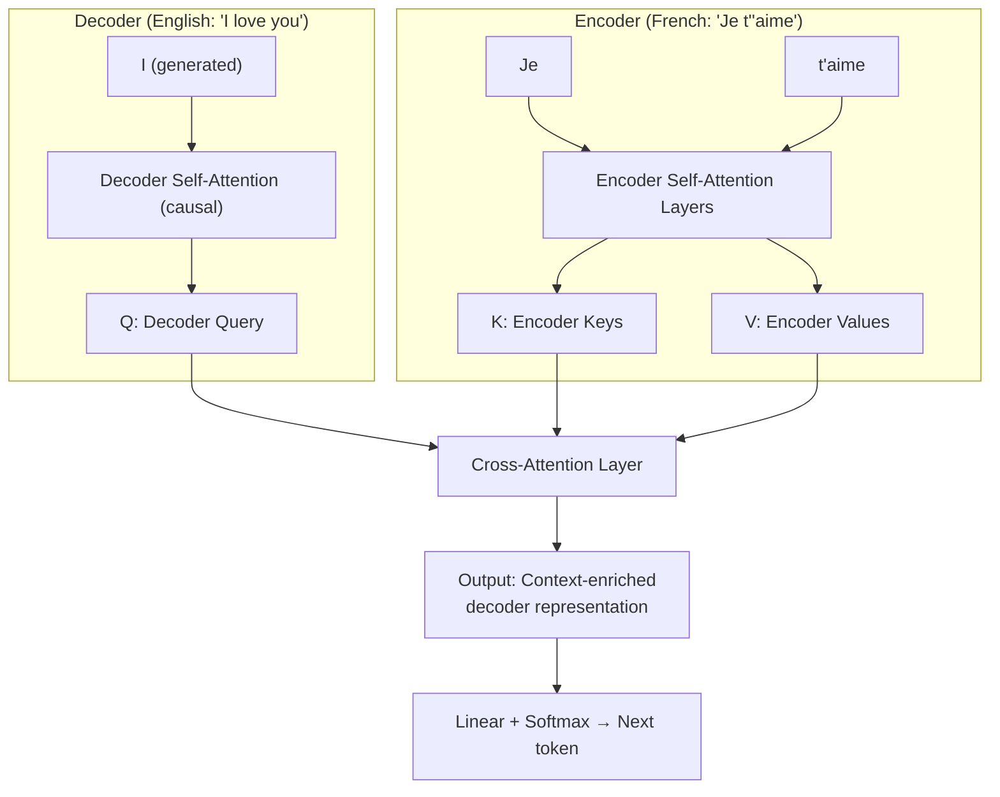

---

## 5. Internal Working

**Step 1**: The encoder processes the full source sequence and produces a sequence of hidden states `encoder_output` of shape `[batch, src_len, d_model]`.

**Step 2**: The decoder processes the target sequence generated so far. At each decoder layer, it produces a query `Q` from its own representation.

**Step 3**: Cross-attention computes:
```
Q = decoder_hidden_state @ W_Q    # from decoder
K = encoder_output @ W_K          # from encoder
V = encoder_output @ W_V          # from encoder

cross_attention_output = softmax(QK^T / √d_k) @ V
```

The critical distinction: **Q is always from the decoder, K and V are always from the encoder.**

**Step 4**: The cross-attention output enriches the decoder's representation with source-side context before producing the next token.

---

## 6. Mathematical Intuition

The formula is identical to self-attention:

```
CrossAttention(Q, K, V) = softmax( QK^T / √d_k ) × V
```

The *only* difference is the *source* of each matrix:

| Matrix | Source (Self-Attention) | Source (Cross-Attention) |
|---|---|---|
| Q | Same sequence (decoder) | Decoder |
| K | Same sequence (encoder) | Encoder |
| V | Same sequence (encoder) | Encoder |

The shapes may differ. Q might be `[batch, tgt_len, d_k]` while K, V are `[batch, src_len, d_k]`. The resulting attention matrix is `[batch, tgt_len, src_len]` — rectangular, not square.

---

## 7. Implementation

```python
import torch
import torch.nn as nn
import torch.nn.functional as F
import math


class CrossAttention(nn.Module):
    """
    Cross-Attention: Q from target sequence, K/V from source sequence.
    Used in encoder-decoder architectures (T5, original Transformer, etc.)
    """

    def __init__(self, d_model: int, d_k: int):
        super().__init__()
        self.d_k = d_k

        # Query comes from decoder side
        self.W_q = nn.Linear(d_model, d_k, bias=False)

        # Keys and Values come from encoder side
        self.W_k = nn.Linear(d_model, d_k, bias=False)
        self.W_v = nn.Linear(d_model, d_k, bias=False)

    def forward(
        self,
        decoder_hidden: torch.Tensor,   # [batch, tgt_len, d_model]
        encoder_output: torch.Tensor,   # [batch, src_len, d_model]
        src_mask: torch.Tensor | None = None  # [batch, tgt_len, src_len]
    ) -> tuple[torch.Tensor, torch.Tensor]:
        
        # Q from decoder
        Q = self.W_q(decoder_hidden)    # [batch, tgt_len, d_k]

        # K, V from encoder
        K = self.W_k(encoder_output)    # [batch, src_len, d_k]
        V = self.W_v(encoder_output)    # [batch, src_len, d_k]

        # Attention scores: [batch, tgt_len, d_k] @ [batch, d_k, src_len]
        # = [batch, tgt_len, src_len]
        scores = torch.bmm(Q, K.transpose(1, 2)) / math.sqrt(self.d_k)

        if src_mask is not None:
            scores = scores.masked_fill(src_mask, float('-inf'))

        weights = F.softmax(scores, dim=-1)  # [batch, tgt_len, src_len]
        output = torch.bmm(weights, V)       # [batch, tgt_len, d_k]

        return output, weights


# --- Test ---
if __name__ == "__main__":
    batch, src_len, tgt_len, d_model, d_k = 2, 10, 6, 64, 32

    encoder_output = torch.randn(batch, src_len, d_model)
    decoder_hidden = torch.randn(batch, tgt_len, d_model)

    cross_attn = CrossAttention(d_model=d_model, d_k=d_k)
    out, w = cross_attn(decoder_hidden, encoder_output)

    print(f"Encoder output: {encoder_output.shape}")   # [2, 10, 64]
    print(f"Decoder input:  {decoder_hidden.shape}")   # [2, 6, 64]
    print(f"Cross-attn out: {out.shape}")              # [2, 6, 32]
    print(f"Attn weights:   {w.shape}")                # [2, 6, 10]
```

---

## 8. Production Architecture

**Caching in cross-attention**: In inference, the encoder output is computed *once* and cached. All decoder steps re-use the same K and V matrices. This is much cheaper than self-attention's KV cache because the encoder is static.

**Stable Diffusion's cross-attention**: Text embeddings from CLIP/T5 are projected to K, V. Image (latent space) features generate Q. Cross-attention lets each image patch "ask" the text: "What should I look like?" This is how text prompts guide image generation.

**Whisper (OpenAI)**: Audio encoder produces mel-spectrogram representations. Text decoder cross-attends to find which part of the audio corresponds to each generated text token. The cross-attention weights literally show you the audio-text alignment.

---

## 9. Tradeoffs

| Aspect | Cross-Attention | Self-Attention |
|---|---|---|
| Use case | Two-sequence tasks (translation, captioning) | Single-sequence understanding |
| Memory | O(src_len × tgt_len) for attention matrix | O(n²) |
| Caching | Encoder K, V cached once (efficient) | Must recompute for every new token |
| Interpretability | Directly shows source-target alignment | Shows within-sequence relationships |

---

## 10. Common Mistakes

- **Passing the wrong tensor as Q**: Q must always come from the sequence you're *generating* (decoder), K/V from the sequence you're *reading* (encoder).
- **Not caching encoder K/V**: Re-computing encoder output at every decode step wastes massive compute.
- **Incorrect mask shapes**: Cross-attention mask is `[batch, tgt_len, src_len]` (rectangular), not square.
- **Confusing cross-attention with self-attention in decoder**: Decoder has BOTH self-attention (causal, over target so far) AND cross-attention (over encoder output). These are separate layers.

---

## 11. Interview Preparation

**Junior**: "Cross-attention is like self-attention but the query comes from the decoder and the keys/values come from the encoder. It lets the decoder look at the source sequence while generating output."

**Senior**: "Cross-attention has Q from the decoder's current state and K, V from the encoder's output. The attention matrix is rectangular `[tgt_len × src_len]`. In inference, encoder K and V are computed once and cached — only decoder Q changes at each step. This is why encoder-decoder models can be more efficient than pure decoders for certain tasks."

**Principal**: "Cross-attention is the architectural primitive for conditioning generation on a separate sequence. It generalizes naturally to multi-modal settings — Stable Diffusion's cross-attention between image latents (Q) and text embeddings (K, V) is mechanically identical to machine translation's cross-attention. The key insight is that cross-attention learns *selective alignment* — which source elements are relevant at each generation step — rather than just reading the full source representation."

---

## 12. Follow-up Questions (Selected)

**Q: How many cross-attention layers does a Transformer decoder have?**  
One per decoder block. In the original Transformer with 6 decoder layers, there are 6 cross-attention sub-layers, one in each layer.

**Q: Can cross-attention be used without an encoder?**  
Yes. You can cross-attend from any sequence to any other. Retrieval-augmented decoders cross-attend from the generation to retrieved documents, with no traditional encoder.

**Q: What does the cross-attention weight matrix show in translation?**  
It shows the alignment between source and target tokens. If you visualize it, you can see the model learning that "liebe" (German) aligns to "love" (English). This was one of the first explainability tools in NLP.

---

---

# Chapter 3: QKV — Queries, Keys, and Values

## 1. Introduction

**What is it?**

QKV stands for **Query**, **Key**, and **Value** — the three roles that every token simultaneously plays in the attention mechanism. Understanding QKV deeply is understanding *why* attention works at all.

QKV is not just a notation. It is an information retrieval system, a routing mechanism, and a content-delivery protocol — all implemented as three simple matrix multiplications.

**Why does it exist?**

When a token in a sequence wants to gather information from other tokens, it needs three things:
1. A way to **express what it's looking for** (Query)
2. A way for other tokens to **advertise what they have** (Key)
3. A way for other tokens to **deliver their content** (Value)

Separating these three functions into different learned projections gives the model enormous flexibility. The Keys can specialize in "being findable" while the Values specialize in "being useful once found."

---

## 2. Historical Motivation

The QKV abstraction was borrowed from information retrieval. In a database:
- You submit a **query** (what you want)
- The database has **keys** (index of what it contains)
- When you find a match, you retrieve the **value** (actual content)

Classic database lookup is hard — a key either matches or it doesn't. Attention makes this *soft* — every key partially matches every query, and you get a weighted blend of all values.

---

## 3. Real-World Analogy

**The YouTube Recommendation System**

Imagine YouTube as an attention mechanism:

- **Your search term** ("python tutorial for beginners") is the **Query**. It represents what *you* want.
- **Each video's metadata** (title, tags, category) is the **Key**. It represents how each video *presents itself* for discovery.
- **The actual video content** is the **Value**. It's what you actually *receive* when you click.

The recommendation algorithm computes the similarity between your Query and every video's Key. High similarity → high attention score. The videos with the highest scores contribute most to your homepage (weighted sum of Values).

Notice:
- A video's **Key** (how it titles itself) can be different from its **Value** (what it contains). A clickbait video has a misleading Key. The model learns to align Keys with Values during training.
- The **Query** doesn't have to look like a video — it's your intent, which is something different from any particular video.

This is exactly why W_Q, W_K, W_V are *different* learned matrices. They're learning three different "languages": the language of seeking, the language of advertising, and the language of content.

---

## 4. Visual Mental Model

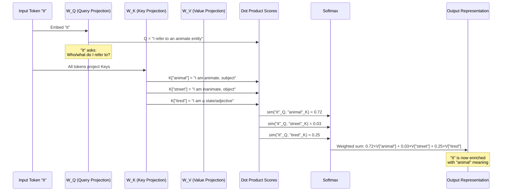

---

## 5. Internal Working

Let's make QKV concrete with numbers.

**Scenario**: One token "bank" in the sentence "river bank." `d_model = 4`, `d_k = 2`.

**Input embedding of "bank"**:
```
x_bank = [0.8, 0.3, 0.9, 0.1]
```

**Learned weight matrices** (trained over millions of examples):
```
W_Q = [[0.1, 0.5],   W_K = [[0.4, 0.2],   W_V = [[0.3, 0.7],
       [0.6, 0.2],          [0.8, 0.1],          [0.1, 0.4],
       [0.3, 0.8],          [0.2, 0.9],          [0.6, 0.2],
       [0.9, 0.1]]          [0.5, 0.3]]          [0.8, 0.5]]
```

**Computing Q, K, V** (each token computes its own):
```
Q_bank = x_bank @ W_Q = [0.8×0.1 + 0.3×0.6 + 0.9×0.3 + 0.1×0.9, ...] = [0.62, 0.71]
K_bank = x_bank @ W_K = [...]
V_bank = x_bank @ W_V = [...]
```

**The three roles**: "bank" simultaneously:
1. Uses its Q vector to *ask*: "Am I a financial institution or geographical feature?"
2. Uses its K vector to *say*: "I am a polysemous noun; match me to context"
3. Uses its V vector to *deliver*: "Here's everything I know about banks (both kinds)"

The context ("river" nearby) will produce a K vector that has high dot product with Q vectors that are seeking geographical meanings. The softmax will then blend "bank"'s own V with "river"'s V, producing a context-enriched representation that leans toward the geographical meaning.

---

## 6. Mathematical Intuition

**Why three matrices instead of one?**

With one matrix `W`, you'd compute: `score(token_i, token_j) = (x_i W) · (x_j W)`. This forces the same transformation to serve both "I'm looking for X" and "I contain X" — they'd have to speak the same language.

With two matrices `W_Q` and `W_K`, you can have:
- Queries say: "I'm looking for tokens that match [feature_A]"
- Keys say: "I match [feature_B]"
- And the model learns to align feature_A with feature_B

With three matrices (adding `W_V`), you additionally decouple *what makes a token findable* (K) from *what the token actually contributes* (V). This is crucial — a token like a stop word ("the") might have a very low K score (not useful to attend to) but carry grammatical information in V.

**The information-theoretic view**:
```
Q: "I want information about X"
K: "I have information relevant to Y"  
V: "Here is my actual information"

Attention weight(i→j) = alignment(Q_i, K_j)
Output(i) = Σ_j [ alignment(Q_i, K_j) × V_j ]
```

---

## 7. Implementation

```python
import torch
import torch.nn as nn


class QKVProjection(nn.Module):
    """
    Demonstrates QKV computation in complete isolation.
    Usually embedded within attention modules, but shown here for clarity.
    """
    
    def __init__(self, d_model: int, d_k: int):
        super().__init__()
        self.d_model = d_model
        self.d_k = d_k
        
        # Option 1: Three separate linear layers (most explicit)
        self.W_q = nn.Linear(d_model, d_k, bias=False)
        self.W_k = nn.Linear(d_model, d_k, bias=False)
        self.W_v = nn.Linear(d_model, d_k, bias=False)
        
        # Option 2: Fused QKV projection (more memory-efficient, used in practice)
        # self.qkv = nn.Linear(d_model, 3 * d_k, bias=False)

    def forward(self, x: torch.Tensor) -> tuple:
        """
        Args:
            x: [batch, seq_len, d_model]
        
        Returns:
            (Q, K, V) each of shape [batch, seq_len, d_k]
        """
        Q = self.W_q(x)
        K = self.W_k(x)
        V = self.W_v(x)
        return Q, K, V
    
    def forward_fused(self, x: torch.Tensor) -> tuple:
        """
        Fused version: single matmul then split (used in production for GPU efficiency)
        """
        # In practice, use a single large linear for better GPU utilization
        qkv = self.qkv(x)  # [batch, seq_len, 3*d_k]
        Q, K, V = qkv.chunk(3, dim=-1)
        return Q, K, V
    
    def inspect_projections(self, token_embedding: torch.Tensor) -> None:
        """Debug helper: show what Q, K, V look like for a single token"""
        Q, K, V = self.forward(token_embedding.unsqueeze(0).unsqueeze(0))
        print(f"Input embedding: {token_embedding.shape}")
        print(f"Q (what I seek): {Q.squeeze()[:4]}...")
        print(f"K (what I am):   {K.squeeze()[:4]}...")
        print(f"V (what I give): {V.squeeze()[:4]}...")
        print(f"Q·K similarity: {(Q * K).sum().item():.4f}")


# Analysis: How QKV projections change during training
def compare_qkv_norms(model: QKVProjection) -> None:
    """Inspect how much Q, K, V weights have diverged from initialization"""
    print("Weight matrix norms:")
    print(f"  W_Q: {model.W_q.weight.norm().item():.4f}")
    print(f"  W_K: {model.W_k.weight.norm().item():.4f}")
    print(f"  W_v: {model.W_v.weight.norm().item():.4f}")
    
    # Cosine similarity between W_Q and W_K
    cos = nn.CosineSimilarity(dim=1)
    sim = cos(model.W_q.weight, model.W_k.weight).mean().item()
    print(f"  W_Q/W_K cosine similarity: {sim:.4f}")
    print(f"  (Low similarity = Q and K have specialized into different functions)")
```

---

## 9. Tradeoffs

**Symmetric vs Asymmetric QKV**

| Design | Description | Used in |
|---|---|---|
| Q=K=V (no projection) | Degenerate; attends to self most | Not used |
| Separate W_Q, W_K (W_V=I) | Learns to route but not transform values | Some research |
| Full QKV projection | Standard; full expressiveness | All modern Transformers |
| Fused QKV (one big linear) | Same math, better GPU utilization | Production models |
| Multi-Query Attention (MQA) | Single K, V shared across all Q heads | Falcon, Mistral |
| Grouped Query Attention (GQA) | Groups of Q share K, V | LLaMA-2, Mistral |

**Multi-Query Attention (MQA)**: Instead of `num_heads` sets of K and V, use just ONE. All query heads compute their Q differently, but they all look up the same K and V. This reduces KV cache size by `num_heads×`, dramatically improving inference efficiency. Quality drops slightly.

**Grouped Query Attention (GQA)**: A middle ground — `G` groups of Q heads (e.g., 4 groups for 32 heads means 8 heads share each K/V pair). Used in LLaMA-2 70B.

---

## 14. Revision Sheet

### Core Concept
QKV separates the three roles of a token in attention:
- **Q**: "What am I looking for?" (query, from the *seeking* token)
- **K**: "What can I be found for?" (key, from the *responding* token)  
- **V**: "What do I actually give when found?" (value, from the *responding* token)

### Why Three Matrices
- Decouples "being findable" from "being useful once found"
- Allows Q and K to develop specialized representations
- Full expressiveness: model can learn to separate which tokens to attend to from what to extract from them

### Production Variants
| Variant | K/V Heads | KV Cache Cost | Quality |
|---|---|---|---|
| MHA | Same as Q heads | 100% | Best |
| GQA | Fewer (grouped) | G×smaller | Near-MHA |
| MQA | 1 per layer | `num_heads`× smaller | Slightly lower |

---

---

# Chapter 4: Multi-Head Attention

## 1. Introduction

**What is it?**

Multi-Head Attention (MHA) runs several attention computations in parallel — each with different learned Q, K, V projection matrices — then combines their outputs. Each parallel run is called an "attention head."

Think of it as having multiple experts in a room, each looking at the same sentence through a different lens. One expert focuses on grammar (which words agree with which). Another focuses on semantic meaning (which concepts are related). Another focuses on coreference (which pronouns refer to which nouns). Then all experts vote, and their combined verdict is the final representation.

**Why does it exist?**

A single attention head produces one weighted sum. But language is rich — a word can relate to others in many ways simultaneously. With a single head, you might capture either syntactic or semantic relationships, but not both.

Multi-head attention provides multiple "representation subspaces." Each head learns to extract a different type of information from the same sequence.

---

## 2. Historical Motivation

The original 2017 Transformer paper made a surprising observation: when they visualized attention weights for individual heads, different heads had learned different roles spontaneously. Some heads tracked direct objects. Others tracked prepositional phrases. Others tracked co-reference chains.

This emergent specialization was unplanned — it arose from training signal alone. But the architecture explicitly supported it by giving each head its own independent projection matrices.

The alternative — one very large attention layer — would require the single set of weights to simultaneously solve all relationship types, which is much harder.

---

## 3. Real-World Analogy

**The Hospital Diagnostic Panel**

A patient comes in with symptoms. Instead of one generalist doctor, a panel of specialists examines the patient simultaneously:

- **Cardiologist**: Looks at heart-related symptoms (chest pain, pulse)
- **Neurologist**: Looks at neurological symptoms (dizziness, memory)
- **Orthopedist**: Looks at structural symptoms (joint pain, mobility)
- **Immunologist**: Looks at immune markers (inflammation, fever)

Each specialist (head) produces an independent assessment. The hospital board (concatenation + linear projection) then combines all assessments into a final diagnosis.

Multi-head attention works identically. Each head examines the sentence from a different "specialty" — one for syntax, one for semantics, one for entity relationships. The final linear layer combines all these perspectives.

---

## 4. Visual Mental Model

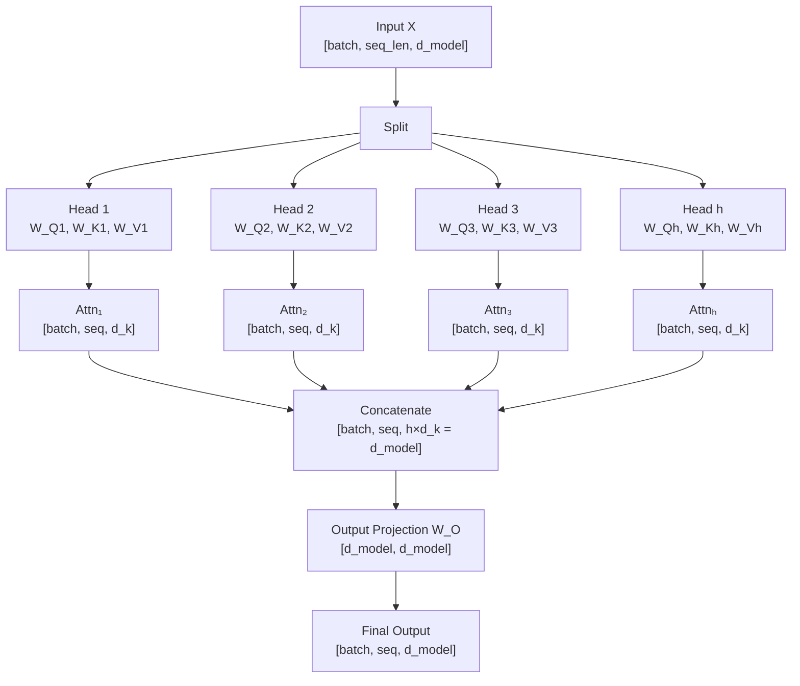

---

## 5. Internal Working

**Setup**: `d_model = 512`, `num_heads = 8`, so `d_k = d_model / num_heads = 64`.

**Step 1: Project to h sets of Q, K, V**

For each head `i` from 1 to 8:
```
Q_i = X @ W_Q_i   # [batch, seq, 64]
K_i = X @ W_K_i   # [batch, seq, 64]
V_i = X @ W_V_i   # [batch, seq, 64]
```

Each `W_Q_i` is a `[512, 64]` matrix — projecting down from full model dimension to per-head dimension.

**Step 2: Run attention for each head independently**

```
head_i = Attention(Q_i, K_i, V_i)   # [batch, seq, 64]
```

**Step 3: Concatenate all heads**

```
MultiHead = Concat([head_1, head_2, ..., head_8])  # [batch, seq, 512]
```

**Step 4: Final linear projection**

```
Output = MultiHead @ W_O   # [batch, seq, 512]
```

`W_O` is `[512, 512]`. This final projection mixes information across all heads, allowing the model to synthesize the different relationship types into a unified representation.

**Key insight**: The total parameter count for multi-head attention is the same as one large attention layer! `h × (3 × d_k × d_model) + d_model²` for MHA vs `3 × d_model² + d_model²` for single head — they're equal when `d_k = d_model / h`. You're not adding parameters; you're distributing them more cleverly.

---

## 6. Mathematical Intuition

```
MultiHead(Q, K, V) = Concat(head_1, ..., head_h) × W_O

where head_i = Attention(X W_Qi, X W_Ki, X W_Vi)
```

The `W_O` output projection is key. Without it, you'd just have h separate attention outputs stacked together — each living in its own subspace. `W_O` learns to *integrate* these subspaces, learning how syntactic findings (from head 1) should be combined with semantic findings (from head 3).

**Dimensionality constraint**: `d_k = d_model / num_heads` ensures the total computation stays constant. Increasing heads = smaller per-head dimension = each head sees a lower-dimensional slice of the representation space.

---

## 7. Implementation

```python
import torch
import torch.nn as nn
import torch.nn.functional as F
import math


class MultiHeadAttention(nn.Module):
    """
    Multi-Head Attention as in 'Attention Is All You Need' (Vaswani et al., 2017).
    
    Production-quality implementation with:
    - Efficient fused QKV projection
    - Proper head splitting/merging
    - Dropout on attention weights
    - Optional causal masking
    """

    def __init__(
        self,
        d_model: int,
        num_heads: int,
        dropout: float = 0.1,
    ):
        super().__init__()
        assert d_model % num_heads == 0, \
            f"d_model ({d_model}) must be divisible by num_heads ({num_heads})"

        self.d_model = d_model
        self.num_heads = num_heads
        self.d_k = d_model // num_heads  # per-head dimension

        # Fused QKV projection for efficiency (one matmul instead of three)
        self.qkv_proj = nn.Linear(d_model, 3 * d_model, bias=False)

        # Output projection to mix head outputs
        self.out_proj = nn.Linear(d_model, d_model, bias=False)

        self.dropout = nn.Dropout(dropout)
        self.scale = math.sqrt(self.d_k)

    def _split_heads(self, x: torch.Tensor) -> torch.Tensor:
        """
        Reshape [batch, seq, d_model] → [batch, num_heads, seq, d_k]
        for parallel head computation.
        """
        batch, seq_len, _ = x.shape
        x = x.view(batch, seq_len, self.num_heads, self.d_k)
        return x.transpose(1, 2)  # [batch, num_heads, seq, d_k]

    def _merge_heads(self, x: torch.Tensor) -> torch.Tensor:
        """
        Reshape [batch, num_heads, seq, d_k] → [batch, seq, d_model]
        to concatenate all heads.
        """
        batch, _, seq_len, _ = x.shape
        x = x.transpose(1, 2)  # [batch, seq, num_heads, d_k]
        return x.contiguous().view(batch, seq_len, self.d_model)

    def forward(
        self,
        x: torch.Tensor,
        mask: torch.Tensor | None = None,
        is_causal: bool = False
    ) -> tuple[torch.Tensor, torch.Tensor]:
        """
        Args:
            x:         [batch, seq_len, d_model]
            mask:      Optional attention mask
            is_causal: If True, applies causal (lower-triangular) mask
        
        Returns:
            output:  [batch, seq_len, d_model]
            weights: [batch, num_heads, seq_len, seq_len]
        """
        batch, seq_len, _ = x.shape

        # Step 1: Fused QKV projection + split
        qkv = self.qkv_proj(x)                     # [batch, seq, 3*d_model]
        Q, K, V = qkv.chunk(3, dim=-1)              # each [batch, seq, d_model]

        # Step 2: Split into heads
        Q = self._split_heads(Q)  # [batch, heads, seq, d_k]
        K = self._split_heads(K)
        V = self._split_heads(V)

        # Step 3: Scaled dot-product attention (all heads in parallel)
        scores = torch.matmul(Q, K.transpose(-2, -1)) / self.scale
        # scores: [batch, heads, seq, seq]

        # Step 4: Causal masking (for GPT-style decoders)
        if is_causal:
            causal_mask = torch.triu(
                torch.ones(seq_len, seq_len, dtype=torch.bool, device=x.device),
                diagonal=1
            )
            scores = scores.masked_fill(causal_mask.unsqueeze(0).unsqueeze(0), float('-inf'))

        if mask is not None:
            scores = scores.masked_fill(mask, float('-inf'))

        # Step 5: Softmax + dropout
        weights = F.softmax(scores, dim=-1)
        weights = self.dropout(weights)

        # Step 6: Weighted sum of values
        output = torch.matmul(weights, V)  # [batch, heads, seq, d_k]

        # Step 7: Merge heads + output projection
        output = self._merge_heads(output)    # [batch, seq, d_model]
        output = self.out_proj(output)        # [batch, seq, d_model]

        return output, weights


# --- Test ---
if __name__ == "__main__":
    batch, seq_len, d_model, num_heads = 4, 32, 512, 8

    mha = MultiHeadAttention(d_model=d_model, num_heads=num_heads)
    x = torch.randn(batch, seq_len, d_model)

    output, weights = mha(x, is_causal=True)

    print(f"Input:   {x.shape}")           # [4, 32, 512]
    print(f"Output:  {output.shape}")      # [4, 32, 512]
    print(f"Weights: {weights.shape}")     # [4, 8, 32, 32]
    
    # Verify causal masking: upper triangle should be ~0
    upper_triangle = weights[0, 0].triu(diagonal=1)
    print(f"Max weight in future positions (should be ~0): {upper_triangle.max().item():.6f}")
    
    # Parameter count
    params = sum(p.numel() for p in mha.parameters())
    print(f"Parameters: {params:,}")  # ~1.05M for d_model=512
```

---

## 8. Production Architecture

**Head Pruning**: Research (Michel et al., 2019) shows that in trained large models, many heads are redundant. Up to 20% of heads can be pruned with minimal quality loss, reducing inference compute.

**Number of Heads in Practice**:
| Model | d_model | Heads | d_k |
|---|---|---|---|
| BERT-base | 768 | 12 | 64 |
| BERT-large | 1024 | 16 | 64 |
| GPT-3 | 12288 | 96 | 128 |
| LLaMA-2 70B | 8192 | 64 | 128 |

**Flash Attention for MHA**: Flash Attention (Chapter 12) is an IO-aware kernel that computes MHA without materializing the full `[batch, heads, seq, seq]` attention matrix in HBM (GPU main memory). Essential for long contexts.

**Flash Attention 2 further optimizations**:
1. Reduces non-matmul FLOPs (they're slower per FLOP than matmuls)
2. Better work partitioning across thread blocks
3. Achieves ~70% of theoretical GPU peak throughput

---

## 9. Tradeoffs

| num_heads more | num_heads fewer |
|---|---|
| More representational diversity | Each head has more dimensions to work with |
| Smaller d_k (may lose expressiveness per head) | More parameter-efficient per head |
| More parallelism potential | Simpler to train |
| Higher memory for KV cache | Smaller KV cache |

**Empirical finding**: For most tasks, `d_k = 64` seems to be a sweet spot. Models tend to use `num_heads = d_model / 64`.

---

## 10. Common Mistakes

- **Not ensuring `d_model % num_heads == 0`**: Will cause incorrect reshape operations.
- **Forgetting the output projection `W_O`**: MHA without `W_O` doesn't mix information across heads.
- **Applying causal masking in encoder self-attention**: Encoder should be fully bidirectional. Only decoder uses causal masking.
- **Not initializing W_O to small values**: Large initial W_O can cause training instability. `xavier_uniform_` is standard.

---

## 11. Interview Preparation

**Junior**: "Multi-head attention runs self-attention multiple times in parallel with different weight matrices. Each 'head' learns to focus on different types of relationships. The results are concatenated and projected to get the final output."

**Senior**: "MHA runs h attention operations over lower-dimensional projections (d_k = d_model/h). The key design principle is that same total parameters as single-head attention, but distributed across heads that can specialize. The output projection W_O integrates information across all heads. In practice, different heads empirically learn syntactic, semantic, and positional patterns."

**Principal**: "MHA is an ensemble of soft nearest-neighbor searches in different subspaces of the representation. The critical architectural choice is d_k: too small (d_k < 32) and heads can't express complex relationships; too large and you reduce the number of heads/perspectives. The W_O projection is not just recombination — it's a learned integration function that can suppress conflicting signals across heads. Production optimization: GQA reduces KV cache by grouping queries to share key-value pairs, preserving most of MHA's quality while dramatically reducing inference memory."

---

## 12. Follow-up Questions (Selected)

**Q: What does each attention head learn?**  
Heads specialize emergently. Studies show heads tracking: (1) direct syntactic dependencies (subject-verb), (2) positional patterns (attending to previous/next token), (3) coreference (pronoun→antecedent), (4) rare word dependencies. This specialization varies by model and layer.

**Q: What is the W_O projection for?**  
W_O mixes information across heads. Without it, each head's contribution is independent and summed linearly. W_O learns which head's information to amplify or suppress for each output dimension.

**Q: Can you use different d_k for different heads?**  
Technically yes, but practically never done — it complicates concatenation. Some research models (e.g., "Mixture of Attentions") use variable head sizes.

**Q: What is the attention head "collapse" problem?**  
During training, heads can collapse to attend to the same patterns, losing diversity. This is prevented by proper initialization, learning rate schedules, and sometimes explicitly diversity-encouraging losses.

---

## 16. Mini Project

**Head Analysis Dashboard**

Load a pre-trained GPT-2 and:
1. Feed it 20 different sentences
2. Extract attention weights from all 12 layers × 12 heads
3. Cluster heads by their attention pattern similarity
4. For each cluster, find representative sentences that make the cluster pattern most visible
5. Label each cluster with what linguistic phenomenon it likely tracks

This reproduces the seminal "Are Sixteen Heads Really Better than One?" paper's analysis.

---

---

# Chapter 5: Positional Encoding

## 1. Introduction

**What is it?**

Positional encoding is the mechanism that tells a Transformer model *where* in the sequence each token appears. Without it, the model has no concept of order — "dog bites man" and "man bites dog" would look identical.

This is one of the most elegant and thought-provoking aspects of the Transformer. The attention mechanism treats input as a *set* (unordered), not a *sequence* (ordered). We must inject order information explicitly.

**Why does it exist?**

Self-attention computes token relationships purely from *content* (the embedding vectors). If you shuffle all tokens and re-run self-attention, you get the same attention weights — just for the wrong token pairs. Positional encoding breaks this symmetry by making the representation of "word at position 5" different from "word at position 15," even if the word is identical.

---

## 2. Historical Motivation

RNNs naturally encoded position because they processed tokens sequentially — the 5th token was processed after the 4th. When Transformers abandoned sequential processing, they lost this implicit ordering.

The 2017 paper introduced sinusoidal positional encoding. The choice of sinusoids was motivated by the desire for the model to easily learn relative positions — a property that sinusoids provide through their addition formula.

Later work discovered that *learned* positional embeddings work just as well for fixed-length sequences. And still later, relative position encodings (like RoPE) were invented to handle variable-length sequences better.

---

## 3. Real-World Analogy

**The Numbered Seats in a Cinema**

Imagine a cinema where every seat is identical. You have a ticket but the seats aren't numbered. How do you find your row and column? You can't.

Now add seat numbers. The content (the movie, the viewing angle) doesn't change, but you've added positional information. Now "Row A, Seat 1" and "Row Z, Seat 50" are distinct even if the seat *itself* is the same physical object.

Positional encoding does exactly this — it adds a "seat number" to each token embedding. The word "bank" at position 3 and "bank" at position 15 will have different representations, even though the word is the same.

The sinusoidal approach is like numbering seats using a code based on musical frequencies — every position gets a unique "chord" of sine waves.

---

## 4. Visual Mental Model

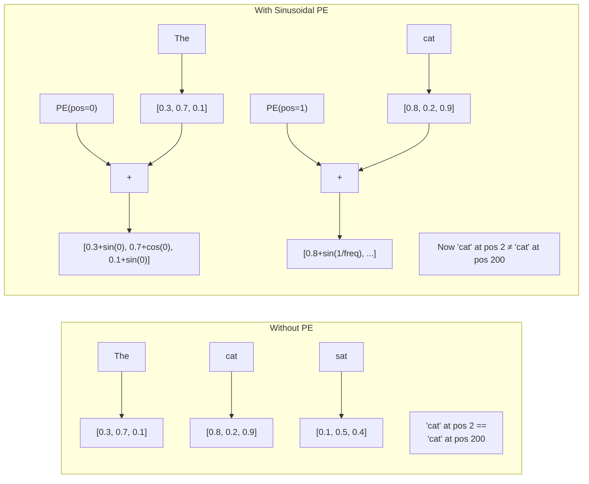

### Sinusoidal Pattern Visualization

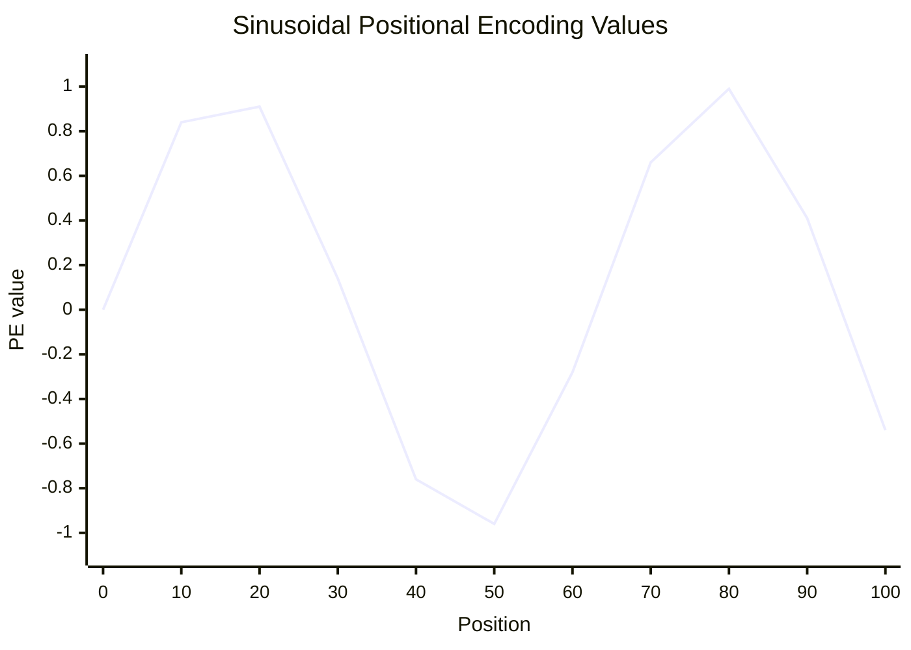

---

## 5. Internal Working

**Sinusoidal Positional Encoding**

For a token at position `pos` and for each dimension `i` in the embedding:

```
PE(pos, 2i)   = sin( pos / 10000^(2i / d_model) )
PE(pos, 2i+1) = cos( pos / 10000^(2i / d_model) )
```

Each pair of dimensions `(2i, 2i+1)` uses a different frequency. Dimension 0-1 uses a very fast-changing frequency (completes a cycle in ~6 positions). Dimension 511-512 (for `d_model=512`) uses an extremely slow frequency (barely changes over thousands of positions).

**Why this works**:
1. Every position gets a unique pattern of sine and cosine values — a unique "fingerprint."
2. The dot product between PE(pos) and PE(pos+k) depends only on `k`, not on absolute position. This means the model can learn relative position patterns that generalize.
3. It can extrapolate to longer sequences than seen during training (sinusoids are defined for any input).

**Step-by-step**:
```
Token embedding: "cat" = [0.8, 0.2, 0.9, 0.4, ...]   (d_model values)

PE(pos=2) = [sin(2/10000^0),    cos(2/10000^0),
             sin(2/10000^(2/d)), cos(2/10000^(2/d)),
             ...] 
           = [0.91, -0.42, 0.02, 1.00, ...]

Final input = embedding + PE = [0.8+0.91, 0.2+(-0.42), 0.9+0.02, 0.4+1.00, ...]
                              = [1.71, -0.22, 0.92, 1.40, ...]
```

---

## 6. Mathematical Intuition

**Why 10000?** It's a chosen constant that creates frequencies spanning a huge range. With `d_model=512` and base=10000, the frequencies range from 1 to 1/10000^(512/512) = 1/10000. This ensures even the slowest-changing dimension shows meaningful variation over sequences up to ~10,000 tokens.

**Why addition (not concatenation)?** Adding PE to the embedding mixes positional information with semantic information in the same space. The model can then learn to separate them (since it's trained end-to-end). Concatenation would double the dimensionality.

**The key property: PE(pos+k) is a linear function of PE(pos)**

For any fixed offset `k`, there exists a matrix `M_k` such that:
```
M_k × PE(pos) = PE(pos+k)
```

This means the model can learn to "look k positions back" by learning a rotation. The model doesn't need to compute absolute positions — it can learn relative offsets directly.

---

## 7. Implementation

```python
import torch
import torch.nn as nn
import math
import matplotlib.pyplot as plt


class SinusoidalPositionalEncoding(nn.Module):
    """
    Fixed sinusoidal positional encoding from 'Attention Is All You Need'.
    Not learned — computed analytically from position and dimension index.
    """

    def __init__(self, d_model: int, max_seq_len: int = 5000, dropout: float = 0.1):
        super().__init__()
        self.dropout = nn.Dropout(p=dropout)

        # Precompute PE for all positions up to max_seq_len
        pe = torch.zeros(max_seq_len, d_model)  # [max_seq, d_model]

        position = torch.arange(0, max_seq_len, dtype=torch.float).unsqueeze(1)
        # position: [max_seq, 1]

        # Compute the denominator: 10000^(2i/d_model) for each i
        div_term = torch.exp(
            torch.arange(0, d_model, 2, dtype=torch.float) *
            (-math.log(10000.0) / d_model)
        )
        # div_term: [d_model/2]

        # Apply sin to even indices, cos to odd indices
        pe[:, 0::2] = torch.sin(position * div_term)   # even dims
        pe[:, 1::2] = torch.cos(position * div_term)   # odd dims

        # Register as buffer (not a parameter — not trained)
        # Shape: [1, max_seq, d_model] for broadcasting
        self.register_buffer('pe', pe.unsqueeze(0))

    def forward(self, x: torch.Tensor) -> torch.Tensor:
        """
        Args:
            x: [batch, seq_len, d_model]
        Returns:
            x + positional_encoding: same shape
        """
        seq_len = x.size(1)
        x = x + self.pe[:, :seq_len, :]
        return self.dropout(x)


class LearnedPositionalEncoding(nn.Module):
    """
    Learned positional embeddings (used in BERT, GPT-2).
    Each position gets its own learned vector.
    Simpler but doesn't extrapolate beyond training length.
    """

    def __init__(self, d_model: int, max_seq_len: int = 512, dropout: float = 0.1):
        super().__init__()
        self.dropout = nn.Dropout(p=dropout)
        self.pos_embedding = nn.Embedding(max_seq_len, d_model)

    def forward(self, x: torch.Tensor) -> torch.Tensor:
        batch, seq_len, _ = x.shape
        positions = torch.arange(seq_len, device=x.device).unsqueeze(0)  # [1, seq_len]
        x = x + self.pos_embedding(positions)
        return self.dropout(x)


def visualize_positional_encoding(d_model: int = 64, max_seq: int = 100) -> None:
    """Visualize the sinusoidal PE matrix as a heatmap"""
    pe_layer = SinusoidalPositionalEncoding(d_model=d_model, max_seq_len=max_seq)
    pe_matrix = pe_layer.pe[0].numpy()  # [max_seq, d_model]

    plt.figure(figsize=(15, 6))
    plt.imshow(pe_matrix[:50, :], cmap='RdBu', aspect='auto', vmin=-1, vmax=1)
    plt.colorbar()
    plt.xlabel("Embedding Dimension")
    plt.ylabel("Position")
    plt.title("Sinusoidal Positional Encoding Matrix")
    plt.tight_layout()
    plt.savefig("positional_encoding.png", dpi=150)


# --- Test ---
if __name__ == "__main__":
    pe = SinusoidalPositionalEncoding(d_model=512, max_seq_len=1000)
    x = torch.zeros(2, 10, 512)  # zero embeddings to see pure PE
    out = pe(x)
    
    print(f"Input shape:  {x.shape}")
    print(f"Output shape: {out.shape}")  # [2, 10, 512]
    
    # Verify uniqueness: each position should have different PE
    pos0 = out[0, 0]
    pos1 = out[0, 1]
    print(f"PE(0) == PE(1): {torch.allclose(pos0, pos1)}")  # False
    
    # Verify relative position property
    # PE(3) - PE(2) should have similar structure to PE(13) - PE(12)
    diff_early = out[0, 3] - out[0, 2]
    diff_late = out[0, 13] - out[0, 12]
    print(f"Relative consistency (should be similar): {(diff_early - diff_late).abs().mean():.4f}")
```

---

## 8. Production Architecture

**Learned PE (BERT, GPT-2)**:
- Simple: just an embedding table
- Works best within training sequence lengths
- Common choice when sequence length is fixed

**Sinusoidal PE (original Transformer)**:
- Generalizes beyond training length
- No parameters to learn
- Frequency structure may not be optimal for all tasks

**Relative PE (Shaw et al., 2018)**:
- Directly encodes *relative* distances between tokens
- Better for tasks where relative order matters more than absolute position
- Slightly more complex to implement

**RoPE (Chapter 11)**:
- Best of all worlds: relative, efficient, theoretically motivated
- Used in LLaMA, GPT-NeoX, Mistral, Gemma
- Handles long context extension beautifully

**ALiBi (Attention with Linear Biases)**:
- Doesn't modify embeddings — instead adds a linear bias to attention scores
- Strong length extrapolation
- Used in BLOOM, MPT

---

## 9. Tradeoffs

| Method | Extrapolation | Parameters | Relative PE | Production Use |
|---|---|---|---|---|
| Sinusoidal | ✅ Yes | 0 | ❌ Absolute | Rare (classic) |
| Learned | ❌ No (poor) | max_seq × d_model | ❌ Absolute | BERT, GPT-2 |
| Relative (Shaw) | ✅ Yes | Small | ✅ Relative | Some models |
| RoPE | ✅ Yes (with YaRN) | 0 | ✅ Relative | LLaMA, Mistral |
| ALiBi | ✅ Strong | 0 | ✅ Relative | BLOOM, MPT |

---

## 10. Common Mistakes

- **Forgetting PE entirely**: The model will still train (it learns some positional signal from data), but performance degrades significantly on order-sensitive tasks.
- **Adding PE after (not before) the first layer**: PE must be added before any attention computation. Some implementations accidentally add it after the first layer.
- **Not scaling PE to match embedding magnitude**: If embeddings have std=0.02 and PE has values in [-1, 1], PE dominates. Some models scale embeddings by `sqrt(d_model)` first.
- **Using learned PE and then testing on longer sequences**: Will fail — the position embedding table doesn't have entries for positions > max_seq_len.

---

## 11. Interview Preparation

**Junior**: "Positional encoding tells the model where each word is in the sentence. Without it, 'dog bites man' would be the same as 'man bites dog.' The original Transformer used sine and cosine waves at different frequencies."

**Senior**: "Sinusoidal PE uses `sin(pos/10000^(2i/d))` and `cos(...)` to create unique fingerprints per position. Key properties: (1) unique per position, (2) bounded in [-1, 1], (3) relative offsets are learnable via linear transformations. Production models increasingly use RoPE because it naturally encodes relative positions and extends to longer sequences via interpolation."

**Principal**: "The choice of positional encoding is now one of the most consequential architectural decisions for long-context models. ALiBi and RoPE both achieve relative position encoding but through different mechanisms: ALiBi biases attention logits with -distance×slope (simple, strong extrapolation); RoPE rotates Q and K vectors in complex space so their dot product depends only on relative position (zero overhead, theoretically elegant). RoPE has become the de facto standard. For context extension beyond training length, YaRN (RoPE with temperature scaling) achieves 4× context extension with ~0.5% quality loss."

---

## 12. Follow-up Questions (Selected)

**Q: Why does a Transformer need positional encoding but an RNN doesn't?**  
RNNs process tokens sequentially — position is implicitly encoded in the order of computation. The LSTM hidden state at step 5 is structurally different from at step 1 because it's been updated 5 times. Transformers process all tokens simultaneously, losing this implicit ordering.

**Q: Can you train a Transformer without positional encoding?**  
Yes, but it becomes a "bag-of-words Transformer" — order-insensitive. Works fine for some tasks (document classification where order matters less) but fails at language generation, translation, and anything requiring precise order.

**Q: How does relative positional encoding work?**  
Instead of adding a positional vector to the embedding, relative PE modifies the attention score to include a learned bias based on the distance between positions: `score(i,j) = (q_i + r_{i-j}) · k_j`. The model learns how to weight different relative distances.

**Q: What is context length extension?**  
Modern LLMs are trained with limited context (e.g., 4K tokens) but need to handle longer inputs at inference. RoPE interpolation techniques (YaRN, LongRoPE) rescale or modify the RoPE frequencies to cover longer ranges without full retraining.

---

## 16. Mini Project

**PE Comparison Experiment**

Train a small Transformer (2 layers, 128 d_model) on a sequence ordering task using:
1. No positional encoding
2. Sinusoidal PE
3. Learned PE
4. ALiBi

Evaluate on sequences of length 32 (in-distribution) and 64 (out-of-distribution). Compare accuracy and plot the degradation curve. This will demonstrate why RoPE and ALiBi were invented.

---

---

# Chapter 6: The Encoder

## 1. Introduction

**What is it?**

The Transformer Encoder is a stack of identical layers, each containing a Self-Attention block and a Feed-Forward Network (FFN) block. Its job is to read and understand a sequence, producing a rich, context-aware representation of every token.

The encoder doesn't generate output — it *comprehends* input. Think of it as the "reading" half of a read-write machine.

**Why does it exist?**

Many tasks require understanding an entire input before producing an output: sentiment analysis of a full review, question answering over a document, named entity recognition. The encoder specializes in this bidirectional understanding.

**Where is it used?**

- BERT and its variants (encoding-only models for classification, NER, QA)
- The encoder half of T5, BART, original Transformer
- Embedding models (sentence transformers use encoder outputs as embeddings)
- RAG retrieval encoders

---

## 2. Historical Motivation

Before Transformers, the "reading" problem was solved by bidirectional RNNs (BiLSTMs). A forward LSTM read left-to-right; a backward LSTM read right-to-left. Their hidden states were concatenated. This was expensive, hard to parallelize, and still bottlenecked by the hidden state size.

The Transformer encoder replaced this with a simpler idea: run fully parallel self-attention over all tokens, repeated for N layers. No directionality needed — every token sees every other token at every layer.

---

## 3. Real-World Analogy

**The Research Team Reading a Paper**

A research team of 12 scientists (12 encoder layers) is given a dense paper to understand. Each scientist reads the *entire* paper simultaneously. After reading, they discuss amongst themselves (self-attention), then individually process what they've learned (FFN). After each round of discussion, their understanding deepens.

After all 12 rounds, every scientist (every token) has a rich, context-aware understanding of their specific part of the paper, informed by the whole paper's content.

---

## 4. Visual Mental Model

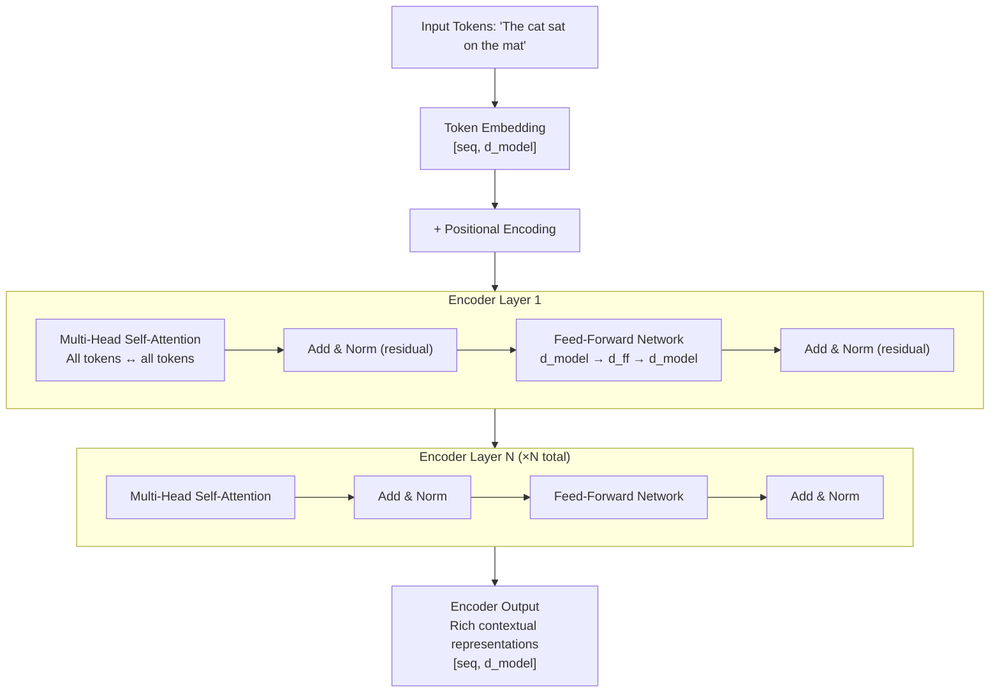

---

## 5. Internal Working

**A single encoder layer** processes the sequence through two sub-layers:

**Sub-layer 1: Multi-Head Self-Attention**
```
attention_output = MultiHeadAttention(Q=x, K=x, V=x)
x = LayerNorm(x + attention_output)   # Residual connection + normalize
```

**Sub-layer 2: Position-wise Feed-Forward Network**
```
ffn_output = FFN(x) = Linear2(ReLU(Linear1(x)))
x = LayerNorm(x + ffn_output)         # Residual connection + normalize
```

**The Residual Connection (Add)**

Every sub-layer computes `output = LayerNorm(x + sublayer(x))`. The `x` (original input) is added back to the output. This creates a "highway" for gradients — they can flow directly back through the residual path without passing through the attention or FFN computations. Without residual connections, deep Transformers (>6 layers) are nearly untrainable.

**The Feed-Forward Network**

```
FFN(x) = W_2 × ReLU(W_1 × x + b_1) + b_2
```

- `W_1`: `[d_model, d_ff]` — expands from model dimension to feed-forward dimension (typically 4× larger)
- `W_2`: `[d_ff, d_model]` — contracts back

For BERT-base: `d_model=768`, `d_ff=3072` (4×). The FFN is where most of the model's "memory" lives — factual knowledge stored in weights is retrievable via the FFN's key-value store structure.

**Layer Normalization**

LayerNorm normalizes across the feature dimension (not the batch dimension like BatchNorm). For each token independently:
```
LayerNorm(x) = (x - mean(x)) / std(x) × γ + β
```

`γ` and `β` are learned scaling and shifting parameters. This keeps activations in a healthy numerical range as depth increases.

---

## 6. Mathematical Intuition

**Why residual connections work**: Deep networks suffer from the "degradation problem" — adding more layers makes training harder, not easier. The residual `x + f(x)` ensures that even if `f(x)` learns to output zero (the identity), the layer is at least as good as not having that layer at all.

**Why FFN with expansion**: The FFN with d_ff = 4×d_model acts as a "transition space." Research by Geva et al. (2021) shows that FFN layers act as key-value memories — each row of W_1 is a "key pattern" and the corresponding row of W_2 is the "value" to emit when that pattern is active.

**Why Layer Normalization**: Training deep networks is hard because activations can explode or vanish. LayerNorm normalizes each token's representation to have zero mean and unit variance. This dramatically stabilizes training and allows higher learning rates.

---

## 7. Implementation

```python
import torch
import torch.nn as nn
import torch.nn.functional as F


class FeedForwardNetwork(nn.Module):
    """
    Position-wise Feed-Forward Network in Transformer Encoder.
    Applied identically and independently to each position.
    """

    def __init__(self, d_model: int, d_ff: int, dropout: float = 0.1):
        super().__init__()
        self.linear1 = nn.Linear(d_model, d_ff)
        self.linear2 = nn.Linear(d_ff, d_model)
        self.dropout = nn.Dropout(dropout)

    def forward(self, x: torch.Tensor) -> torch.Tensor:
        # Expand → Activate → Contract
        x = self.linear1(x)
        x = F.gelu(x)  # GELU instead of ReLU (modern practice)
        x = self.dropout(x)
        x = self.linear2(x)
        return x


class EncoderLayer(nn.Module):
    """Single Transformer Encoder Layer"""

    def __init__(
        self,
        d_model: int,
        num_heads: int,
        d_ff: int,
        dropout: float = 0.1,
    ):
        super().__init__()
        self.self_attn = MultiHeadAttention(d_model, num_heads, dropout)
        self.ffn = FeedForwardNetwork(d_model, d_ff, dropout)
        self.norm1 = nn.LayerNorm(d_model)
        self.norm2 = nn.LayerNorm(d_model)
        self.dropout = nn.Dropout(dropout)

    def forward(
        self,
        x: torch.Tensor,
        src_mask: torch.Tensor | None = None
    ) -> torch.Tensor:
        # Sub-layer 1: Self-Attention with residual
        attn_out, _ = self.self_attn(x, mask=src_mask)
        x = self.norm1(x + self.dropout(attn_out))

        # Sub-layer 2: FFN with residual
        ffn_out = self.ffn(x)
        x = self.norm2(x + self.dropout(ffn_out))

        return x


class TransformerEncoder(nn.Module):
    """
    Full Transformer Encoder: stack of N EncoderLayers.
    """

    def __init__(
        self,
        vocab_size: int,
        d_model: int,
        num_heads: int,
        num_layers: int,
        d_ff: int,
        max_seq_len: int,
        dropout: float = 0.1,
        padding_idx: int = 0,
    ):
        super().__init__()
        self.token_embedding = nn.Embedding(vocab_size, d_model, padding_idx=padding_idx)
        self.pos_encoding = SinusoidalPositionalEncoding(d_model, max_seq_len, dropout)

        self.layers = nn.ModuleList([
            EncoderLayer(d_model, num_heads, d_ff, dropout)
            for _ in range(num_layers)
        ])

        self.norm = nn.LayerNorm(d_model)  # Final normalization

        # Initialize weights
        self._init_weights()

    def _init_weights(self) -> None:
        for module in self.modules():
            if isinstance(module, nn.Linear):
                nn.init.xavier_uniform_(module.weight)
                if module.bias is not None:
                    nn.init.zeros_(module.bias)
            elif isinstance(module, nn.Embedding):
                nn.init.normal_(module.weight, std=0.02)

    def forward(
        self,
        src_tokens: torch.Tensor,     # [batch, src_len] — token IDs
        src_key_padding_mask: torch.Tensor | None = None  # [batch, src_len]
    ) -> torch.Tensor:
        """
        Returns encoder output: [batch, src_len, d_model]
        """
        # Embed + positional encode
        x = self.token_embedding(src_tokens)  # [batch, src_len, d_model]
        x = self.pos_encoding(x)

        # Create attention mask from padding mask
        if src_key_padding_mask is not None:
            # Expand to [batch, 1, 1, src_len] for broadcasting with attention
            attn_mask = src_key_padding_mask.unsqueeze(1).unsqueeze(2)
        else:
            attn_mask = None

        # Pass through N encoder layers
        for layer in self.layers:
            x = layer(x, src_mask=attn_mask)

        return self.norm(x)


# --- Complete Example with Sentence Classification ---
class SentenceClassifier(nn.Module):
    """
    A classification model using TransformerEncoder.
    Uses [CLS] token's representation for classification (BERT-style).
    """

    def __init__(self, vocab_size: int, num_classes: int, **encoder_kwargs):
        super().__init__()
        self.encoder = TransformerEncoder(vocab_size=vocab_size, **encoder_kwargs)
        self.classifier = nn.Linear(encoder_kwargs['d_model'], num_classes)

    def forward(self, tokens: torch.Tensor, padding_mask: torch.Tensor | None = None):
        encoder_out = self.encoder(tokens, padding_mask)
        # Take [CLS] token (position 0) for classification
        cls_repr = encoder_out[:, 0, :]
        logits = self.classifier(cls_repr)
        return logits
```

---

## 8. Production Architecture

**BERT-base Configuration**:
- 12 encoder layers
- d_model = 768
- num_heads = 12
- d_ff = 3072
- Total parameters: ~110M

**Scaling Laws**: Encoder performance scales predictably with model size, data, and compute. Chinchilla law: for optimal training, parameters and training tokens should both scale proportionally.

**Distillation**: Large encoders (BERT-large) can be distilled into smaller ones (DistilBERT) with 60% fewer parameters and 40% faster inference, retaining ~97% of performance.

---

## 9. Tradeoffs

| Encoder | Decoder | Encoder-Decoder |
|---|---|---|
| Bidirectional (sees full context) | Autoregressive (causal masking) | Both |
| Best for: classification, NER, QA | Best for: generation | Best for: translation, summarization |
| Fast: one forward pass | Slow: O(n) decode steps | Medium: encode once, decode |
| Examples: BERT, RoBERTa | Examples: GPT | Examples: T5, BART |

---

## 11. Interview Preparation

**Junior**: "The encoder reads the input and creates rich representations of each token that capture context from the whole sequence. Each encoder layer has self-attention and a feed-forward network. BERT uses only the encoder."

**Senior**: "The encoder alternates between self-attention (which mixes information across tokens) and FFN layers (which apply learned transformations per-token independently). Residual connections enable deep stacking by creating gradient highways. Layer normalization keeps activations stable. The encoder produces contextualized token embeddings — the same word 'bank' will have different representations depending on surrounding context."

**Principal**: "The encoder's two-module design (attention + FFN) captures two distinct types of computation: attention performs content-based routing of information across positions (a relational computation), while the FFN performs position-independent feature transformation (analogous to pattern-matching lookup). Research shows FFN parameters store factual knowledge (Geva et al.) while attention heads store structural/syntactic patterns. This separation is why simply scaling encoder size translates to predictable quality improvements — each component has a clear, non-overlapping role."

---

---

# Chapter 7: The Decoder

## 1. Introduction

**What is it?**

The Transformer Decoder generates output sequences, one token at a time. It contains three sub-layers per block: (1) Masked Self-Attention over the partially-generated output, (2) Cross-Attention over the encoder's output, and (3) a Feed-Forward Network.

The decoder is the "writing" half of the read-write machine. It reads the encoder's understanding of the input and autoregressively produces the output sequence.

**Why does it exist?**

Generation is fundamentally different from understanding. A classifier can see the entire input and produce one output. A generator must produce a sequence of outputs, each informed by all previous outputs. The decoder's causal (masked) self-attention enables this while preventing cheating by looking at future tokens.

---

## 2. Real-World Analogy

**The Live Translator**

A translator is simultaneously:
1. **Listening to the original French speech** (cross-attention to encoder output — reading the source)
2. **Remembering what they've already said in English** (causal self-attention — tracking their own output)
3. **Formulating the next English word** (FFN + output projection — generating)

The "causal" constraint is crucial: the translator can only refer to what they've *already* said, not what they *will* say. This is exactly what the causal mask enforces in the decoder.

---

## 3. Visual Mental Model

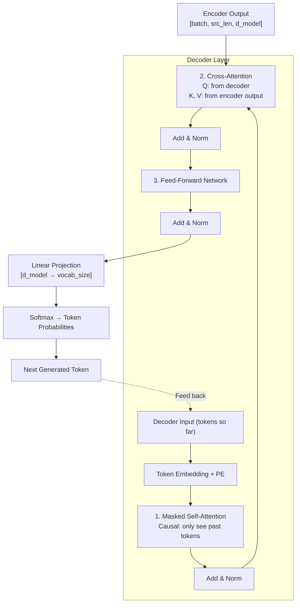

---

## 4. Internal Working

**The Three Sub-Layers in Detail**:

**Sub-layer 1: Masked (Causal) Self-Attention**

The decoder has seen tokens `[y_1, y_2, ..., y_t-1]`. When computing the representation of `y_t`, it can only attend to `y_1` through `y_t` — not `y_t+1` onwards (future tokens it hasn't generated yet).

This is enforced with a lower-triangular mask applied to the attention score matrix. The upper triangle is filled with `-inf`, which becomes `0` after softmax.

```
Causal mask for seq_len=4:
       y1    y2    y3    y4
y1  [  0,  -inf, -inf, -inf ]
y2  [  0,    0,  -inf, -inf ]
y3  [  0,    0,    0,  -inf ]
y4  [  0,    0,    0,    0  ]
```

**Sub-layer 2: Cross-Attention**

After masked self-attention, the decoder's representation is used as Query. The encoder's output is used as Key and Value. This is where the decoder "reads" the source sequence to inform its generation.

```
Q = decoder_state @ W_Q     # from decoder
K = encoder_output @ W_K    # from encoder
V = encoder_output @ W_V    # from encoder
cross_attn_out = softmax(QK^T / √d_k) @ V
```

**Sub-layer 3: FFN (Same as Encoder)**

Identical in structure to the encoder's FFN.

**Output Projection**

After all N decoder layers, a linear layer projects from `d_model` to `vocab_size`, followed by softmax:
```
logits = decoder_output @ W_output   # [batch, seq, vocab_size]
probs = softmax(logits)
next_token = argmax(probs)           # greedy decoding
```

---

## 5. Mathematical Intuition

The decoder generates `P(y_t | y_1, ..., y_{t-1}, X)` — the probability of the next token given all previous tokens and the source.

This factorization (chain rule of probability) is why generation is sequential — each step conditions on all previous steps. The causal mask implements this factorization architecturally by ensuring `y_t` only has access to `y_1...y_{t-1}`.

Teacher forcing during training: instead of feeding the model's own predictions back, we feed the ground-truth tokens. This prevents error accumulation during training. During inference, we feed model predictions (autoregressive generation).

---

## 6. Implementation

```python
import torch
import torch.nn as nn


class DecoderLayer(nn.Module):
    """Single Transformer Decoder Layer with three sub-layers"""

    def __init__(self, d_model: int, num_heads: int, d_ff: int, dropout: float = 0.1):
        super().__init__()

        # Sub-layer 1: Masked self-attention (causal)
        self.self_attn = MultiHeadAttention(d_model, num_heads, dropout)
        self.norm1 = nn.LayerNorm(d_model)

        # Sub-layer 2: Cross-attention (encoder-decoder attention)
        self.cross_attn = MultiHeadAttention(d_model, num_heads, dropout)
        self.norm2 = nn.LayerNorm(d_model)

        # Sub-layer 3: FFN
        self.ffn = FeedForwardNetwork(d_model, d_ff, dropout)
        self.norm3 = nn.LayerNorm(d_model)

        self.dropout = nn.Dropout(dropout)

    def forward(
        self,
        x: torch.Tensor,               # Decoder input [batch, tgt_len, d_model]
        encoder_output: torch.Tensor,  # Encoder output [batch, src_len, d_model]
        tgt_mask: torch.Tensor | None = None,  # Causal mask [tgt_len, tgt_len]
        src_mask: torch.Tensor | None = None,  # Padding mask [batch, 1, 1, src_len]
    ) -> torch.Tensor:

        # Sub-layer 1: Causal self-attention
        sa_out, _ = self.self_attn(x, mask=tgt_mask, is_causal=True)
        x = self.norm1(x + self.dropout(sa_out))

        # Sub-layer 2: Cross-attention
        # Q from decoder (x), K/V from encoder
        ca_out, attn_weights = self.cross_attn(
            x,                          # Q source
            encoder_output=encoder_output,  # K, V source
            mask=src_mask
        )
        x = self.norm2(x + self.dropout(ca_out))

        # Sub-layer 3: FFN
        ffn_out = self.ffn(x)
        x = self.norm3(x + self.dropout(ffn_out))

        return x


class TransformerDecoder(nn.Module):
    """Full Transformer Decoder: stack of N DecoderLayers"""

    def __init__(
        self,
        vocab_size: int,
        d_model: int,
        num_heads: int,
        num_layers: int,
        d_ff: int,
        max_seq_len: int,
        dropout: float = 0.1,
    ):
        super().__init__()
        self.token_embedding = nn.Embedding(vocab_size, d_model)
        self.pos_encoding = SinusoidalPositionalEncoding(d_model, max_seq_len, dropout)

        self.layers = nn.ModuleList([
            DecoderLayer(d_model, num_heads, d_ff, dropout)
            for _ in range(num_layers)
        ])

        self.norm = nn.LayerNorm(d_model)
        self.output_projection = nn.Linear(d_model, vocab_size, bias=False)

    @torch.no_grad()
    def generate(
        self,
        encoder_output: torch.Tensor,
        bos_token_id: int,
        eos_token_id: int,
        max_new_tokens: int = 100,
        temperature: float = 1.0,
        top_p: float = 0.9,
    ) -> list[int]:
        """
        Autoregressive generation with temperature and top-p sampling.
        """
        batch_size = encoder_output.size(0)
        generated = torch.tensor([[bos_token_id]] * batch_size, device=encoder_output.device)

        for _ in range(max_new_tokens):
            # Forward pass through decoder
            x = self.token_embedding(generated)
            x = self.pos_encoding(x)

            for layer in self.layers:
                x = layer(x, encoder_output)

            x = self.norm(x)
            logits = self.output_projection(x[:, -1, :])  # Last token's logits

            # Apply temperature
            logits = logits / temperature

            # Top-p (nucleus) sampling
            sorted_logits, sorted_indices = torch.sort(logits, descending=True)
            cumulative_probs = torch.cumsum(torch.softmax(sorted_logits, dim=-1), dim=-1)
            sorted_indices_to_remove = cumulative_probs > top_p
            sorted_logits[sorted_indices_to_remove] = float('-inf')
            probs = torch.softmax(sorted_logits, dim=-1)
            next_token_sorted = torch.multinomial(probs, 1)
            next_token = sorted_indices.gather(-1, next_token_sorted)

            generated = torch.cat([generated, next_token], dim=-1)

            if (next_token == eos_token_id).all():
                break

        return generated[0].tolist()
```

---

## 8. Production Architecture

**Prefill vs Decode**:
- **Prefill**: Process the entire prompt in parallel (like encoder). Fast: `O(n²)` once.
- **Decode**: Generate tokens one by one. Slow: `O(n)` per token, repeated `m` times for `m` generated tokens.

**KV Cache**: Store K and V from all previous tokens so they don't need recomputation. See Chapter 13.

**Speculative Decoding**: Use a fast draft model to generate 5 tokens, then verify with the large model in parallel. Can achieve 3-4× speedup.

**Batched Decoding**: Different prompts in a batch may have different lengths. **Continuous batching** (PagedAttention) packs multiple requests efficiently, dramatically improving GPU utilization.

---

## 11. Interview Preparation

**Senior**: "The decoder has three sub-layers: (1) causal self-attention with a lower-triangular mask to prevent attending to future tokens, (2) cross-attention where Q comes from decoder state and K/V from encoder output, (3) FFN. Autoregressive generation means each token is generated conditioned on all previous tokens. The key production optimization is KV cache — storing all K/V from previous steps avoids O(n²) recomputation."

**Principal**: "The decoder implements conditional language modeling: P(y_t | y_<t, X) where X is the encoder's output. The cross-attention mechanism is what makes sequence-to-sequence tasks tractable — the decoder can selectively focus on different parts of the source for each generated token. Production systems separate the prefill phase (parallel, compute-bound) from the decode phase (sequential, memory-bandwidth-bound). Modern architectures like Speculative Decoding address the memory-bandwidth bottleneck by using a small draft model and a large verification model in parallel."

---

---

# Chapter 8: BERT

## 1. Introduction

**What is it?**

BERT (Bidirectional Encoder Representations from Transformers) is a pre-trained Transformer encoder model introduced by Google in 2018. It fundamentally changed NLP by showing that a single pre-trained model, fine-tuned on task-specific data, could achieve state-of-the-art performance on a wide range of NLP tasks.

BERT's key innovation: **bidirectional pre-training**. Unlike GPT, which reads left-to-right, BERT reads in *both* directions simultaneously during pre-training.

**Why does it exist?**

Before BERT, the dominant paradigm was task-specific models trained from scratch. Each new NLP task required a new model architecture and extensive labeled data. BERT introduced **transfer learning for NLP** — pre-train a general-purpose language model on enormous unlabeled text, then fine-tune it cheaply on any downstream task.

---

## 2. Historical Motivation

**The Word2Vec era (2013-2017)**: Static word embeddings. "Bank" had one vector regardless of context. Couldn't distinguish "river bank" from "savings bank."

**ELMo (2018)**: Contextualized embeddings from bidirectional LSTM. Better than Word2Vec but still sequential, hard to transfer.

**GPT-1 (2018)**: Unidirectional Transformer language model. Good at generation but uses only left context. Not ideal for understanding tasks that require full bidirectional context.

**BERT (2018)**: Bidirectional Transformer encoder pre-trained on masked language modeling. Crushed all NLP benchmarks simultaneously.

---

## 3. Real-World Analogy

**The Professional Who Reads the Whole Email**

Imagine GPT as a person who reads email left-to-right and must decide what each word means as they go, without looking ahead. When they read "I saw the crane," they must interpret "crane" (bird or machine?) before reading the rest of the sentence.

BERT is a professional who reads the ENTIRE email before interpreting anything. They see: "I saw the crane lifting steel beams at the construction site." Now "crane" is unambiguous — the whole context is available simultaneously.

This is what "bidirectional" means. BERT pre-trains by randomly masking words and predicting them from full context — left AND right context simultaneously.

---

## 4. Visual Mental Model

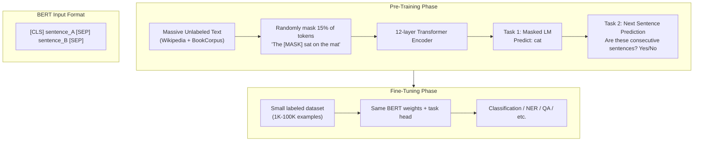

---

## 5. Internal Working

**Pre-Training Tasks**

**Task 1: Masked Language Model (MLM)**

For each batch of text:
- 15% of tokens are selected for masking
  - 80% of those are replaced with `[MASK]`
  - 10% are replaced with a random token
  - 10% are left unchanged

The model must predict the original token for each masked position. This forces the model to learn bidirectional context — to predict a masked word, it must understand the whole sentence.

**Task 2: Next Sentence Prediction (NSP)**

Given two sentences A and B:
- 50% of the time: B follows A in the original text (IsNext)
- 50% of the time: B is a random sentence (NotNext)

The model predicts IsNext/NotNext using the `[CLS]` token representation. (Note: Later research showed NSP is not actually very helpful — RoBERTa dropped it.)

**Special Tokens**:
- `[CLS]`: Added at the start of every input. Its final representation is used for classification tasks.
- `[SEP]`: Separates sentence pairs. Also marks end of single sentences.
- `[MASK]`: Replaces masked tokens during pre-training.
- `[PAD]`: Padding for batch alignment.

**Segment Embeddings**:
BERT adds a learned "segment" embedding to each token: Embedding_A for tokens in sentence A, Embedding_B for tokens in sentence B. This lets the model distinguish between the two input sentences.

**Final input**: `token_embedding + positional_embedding + segment_embedding`

---

## 6. Mathematical Intuition

**Why 15% masking?** Empirically optimal. Too low → too easy, model doesn't learn enough. Too high → too much context is missing, prediction is impossible.

**Why the 80/10/10 split?** If you always masked with `[MASK]`, the model would learn to only focus on `[MASK]` tokens during pre-training but `[MASK]` doesn't appear during fine-tuning — a train/inference mismatch. The 10% unchanged tokens force the model to learn good representations for all tokens, not just masked ones.

**MLM Loss**:
```
L_MLM = -Σ_{masked positions} log P(x_i | context)
```

Only the loss from masked positions counts. The model isn't penalized for predictions at non-masked positions.

---

## 7. Implementation

```python
from transformers import BertTokenizer, BertModel, BertForSequenceClassification
import torch
from torch.utils.data import DataLoader, Dataset


# --- Using Pre-trained BERT for Sentence Classification ---
class SentimentClassifier:
    """
    Production-quality BERT fine-tuning for binary sentiment classification.
    Uses HuggingFace transformers library.
    """

    def __init__(self, model_name: str = "bert-base-uncased", num_labels: int = 2):
        self.tokenizer = BertTokenizer.from_pretrained(model_name)
        self.model = BertForSequenceClassification.from_pretrained(
            model_name,
            num_labels=num_labels
        )
        self.device = torch.device("cuda" if torch.cuda.is_available() else "cpu")
        self.model.to(self.device)

    def tokenize(self, texts: list[str], max_length: int = 128) -> dict:
        return self.tokenizer(
            texts,
            truncation=True,
            padding='max_length',
            max_length=max_length,
            return_tensors='pt'
        )

    def predict(self, texts: list[str]) -> list[int]:
        self.model.eval()
        inputs = self.tokenize(texts)
        inputs = {k: v.to(self.device) for k, v in inputs.items()}

        with torch.no_grad():
            outputs = self.model(**inputs)

        logits = outputs.logits
        predictions = torch.argmax(logits, dim=-1)
        return predictions.cpu().tolist()

    def fine_tune(
        self,
        train_texts: list[str],
        train_labels: list[int],
        epochs: int = 3,
        lr: float = 2e-5,
        batch_size: int = 16,
    ) -> None:
        """Fine-tune BERT on classification task"""
        from transformers import AdamW, get_linear_schedule_with_warmup

        optimizer = AdamW(self.model.parameters(), lr=lr, weight_decay=0.01)

        total_steps = len(train_texts) // batch_size * epochs
        scheduler = get_linear_schedule_with_warmup(
            optimizer,
            num_warmup_steps=total_steps // 10,
            num_training_steps=total_steps
        )

        self.model.train()
        for epoch in range(epochs):
            epoch_loss = 0.0
            for i in range(0, len(train_texts), batch_size):
                batch_texts = train_texts[i:i+batch_size]
                batch_labels = torch.tensor(train_labels[i:i+batch_size]).to(self.device)

                inputs = self.tokenize(batch_texts)
                inputs = {k: v.to(self.device) for k, v in inputs.items()}

                outputs = self.model(**inputs, labels=batch_labels)
                loss = outputs.loss

                optimizer.zero_grad()
                loss.backward()
                torch.nn.utils.clip_grad_norm_(self.model.parameters(), 1.0)
                optimizer.step()
                scheduler.step()

                epoch_loss += loss.item()

            print(f"Epoch {epoch+1}/{epochs} — Loss: {epoch_loss:.4f}")


# --- BERT for Feature Extraction (Embeddings) ---
def get_bert_embeddings(
    texts: list[str],
    model_name: str = "bert-base-uncased",
    pooling: str = "cls"  # "cls" or "mean"
) -> torch.Tensor:
    """
    Extract BERT sentence embeddings for downstream tasks (e.g., semantic search)
    """
    tokenizer = BertTokenizer.from_pretrained(model_name)
    model = BertModel.from_pretrained(model_name)
    model.eval()

    inputs = tokenizer(
        texts,
        padding=True,
        truncation=True,
        max_length=512,
        return_tensors='pt'
    )

    with torch.no_grad():
        outputs = model(**inputs)

    if pooling == "cls":
        # Use [CLS] token representation
        embeddings = outputs.last_hidden_state[:, 0, :]
    elif pooling == "mean":
        # Average all non-padding token representations
        attention_mask = inputs['attention_mask']
        token_embeddings = outputs.last_hidden_state
        mask_expanded = attention_mask.unsqueeze(-1).float()
        embeddings = (token_embeddings * mask_expanded).sum(1) / mask_expanded.sum(1)

    return embeddings  # [batch, 768]


# --- Example Usage ---
if __name__ == "__main__":
    texts = [
        "This movie was absolutely fantastic!",
        "Terrible product, completely useless.",
        "The weather is nice today."
    ]

    embeddings = get_bert_embeddings(texts, pooling="mean")
    print(f"Embeddings shape: {embeddings.shape}")  # [3, 768]

    # Cosine similarity between first two sentences
    cos_sim = torch.nn.functional.cosine_similarity(
        embeddings[0].unsqueeze(0),
        embeddings[1].unsqueeze(0)
    )
    print(f"Cosine similarity (positive vs negative): {cos_sim.item():.4f}")
```

---

## 8. Production Architecture

**BERT Variants**:
| Model | Params | Layers | d_model | Use Case |
|---|---|---|---|---|
| BERT-base | 110M | 12 | 768 | General use |
| BERT-large | 340M | 24 | 1024 | Best quality |
| DistilBERT | 66M | 6 | 768 | Fast inference |
| RoBERTa | 125M | 12 | 768 | Better trained BERT |
| DeBERTa-v3 | 183M | 24 | 1024 | SOTA on many tasks |

**RoBERTa improvements over BERT**:
1. Removed NSP (hurt performance)
2. Trained longer with more data
3. Dynamic masking (different tokens masked each epoch)
4. Larger batch sizes
5. Full-word masking instead of subword masking

**Sentence-BERT**: Fine-tunes BERT with a siamese network structure for semantic sentence similarity. Use this when you need fast, high-quality sentence embeddings.

---

## 9. Tradeoffs

| BERT | GPT |
|---|---|
| Bidirectional (sees full context) | Unidirectional (left-to-right only) |
| Excellent for understanding tasks | Excellent for generation tasks |
| [MASK] token not used at inference | No train/inference mismatch |
| Slower inference (full context needed) | Can generate incrementally |
| Best: classification, NER, QA, embeddings | Best: text generation, chatbots |

---

## 10. Common Mistakes

- **Using BERT for generation**: BERT is an encoder. It cannot generate text autoregressively. Use GPT for generation.
- **Forgetting the `[CLS]` token**: BERT expects `[CLS]` as the first token for classification. If you skip it, the classification head has nothing to use.
- **Not fine-tuning all layers**: Freezing BERT and only training the classification head gives mediocre results. Fine-tune all layers with a small learning rate (1e-5 to 5e-5).
- **Using max_length=512 for all inputs**: Increases memory usage 4× vs max_length=128 for short texts. Dynamic padding saves significant compute.

---

## 12. Follow-up Questions (Selected)

**Q: Why doesn't BERT use a causal mask?**  
BERT is an encoder used for understanding, not generation. Seeing both left and right context simultaneously (bidirectional) produces better representations for comprehension tasks. The causal mask is only needed for autoregressive generation.

**Q: What is the "pre-training objective" and why does it matter?**  
The pre-training objective shapes what the model learns. MLM forces the model to learn rich contextual representations because predicting a masked word requires understanding the full sentence structure. This makes the learned representations useful for many downstream tasks.

**Q: Can you fine-tune only the top layers?**  
Yes, layer-wise learning rate decay is common — lower learning rates for lower (more general) layers, higher for top (more task-specific) layers. But freezing all BERT layers is usually suboptimal.

**Q: What is BERT's maximum sequence length and why?**  
512 tokens. This is due to the learned positional embeddings — the model has no PE for positions > 512. You can truncate longer sequences or use sliding window approaches.

---

## 14. Revision Sheet

### BERT Key Facts
- 12 layers (base) / 24 layers (large)
- Bidirectional: attends to full sequence in both directions
- Pre-training: Masked LM + Next Sentence Prediction
- Special tokens: `[CLS]`, `[SEP]`, `[MASK]`, `[PAD]`
- Max sequence length: 512 tokens
- Input = token embedding + positional embedding + segment embedding

### Fine-tuning Tips
- Learning rate: 1e-5 to 5e-5 with linear warmup
- Fine-tune ALL layers (not just the head)
- Use `[CLS]` representation for classification
- Dynamic padding to save compute
- Few epochs (2-4) to prevent catastrophic forgetting

---

---

# Chapter 9: GPT

## 1. Introduction

**What is it?**

GPT (Generative Pre-trained Transformer) is a decoder-only Transformer model trained on autoregressive language modeling — predicting the next word given all previous words. It is the architectural foundation of ChatGPT, GPT-4, and the majority of today's conversational AI systems.

GPT is the engine of generation. Where BERT reads and understands, GPT reads and writes.

**Why does it exist?**

The insight behind GPT: if a model can predict the next word in any sentence, it must have internalized grammar, facts, reasoning patterns, and language style. Autoregressive language modeling on internet-scale text is a surprisingly powerful pre-training objective.

GPT demonstrated that with enough scale and data, a single pre-trained language model can perform many tasks *without fine-tuning* — just by being prompted correctly.

---

## 2. Historical Motivation

**n-gram models (pre-2010)**: Predicted the next word based on the previous 2-3 words. No deep understanding.

**RNN language models (2010-2017)**: Better long-range dependencies but hard to scale and slow to train.

**GPT-1 (2018)**: First Transformer-based language model. 117M parameters. Showed pre-training + fine-tuning works for language generation.

**GPT-2 (2019)**: 1.5B parameters. So capable that OpenAI initially withheld release, fearing misuse. Showed few-shot in-context learning emerges at scale.

**GPT-3 (2020)**: 175B parameters. Zero/few-shot performance rivaled fine-tuned smaller models. Changed the paradigm from "fine-tune for every task" to "prompt the large model."

**InstructGPT/ChatGPT (2022)**: GPT-3 + RLHF (Reinforcement Learning from Human Feedback). Aligned GPT to follow instructions and be helpful, harmless, honest.

---

## 3. Real-World Analogy

**The Expert Who Writes Everything**

Imagine a person who has read the entire internet — every book, article, forum post, code repository, and conversation. When asked to write something, they draw on all of that context.

When given the prompt "Translate this French sentence: 'Bonjour le monde' →", they continue with "Hello world" — not because they were explicitly programmed to translate, but because they've seen millions of translation examples and understand the pattern.

This is GPT: a universal pattern completer that can perform any task expressed as "continue this text."

---

## 4. Visual Mental Model

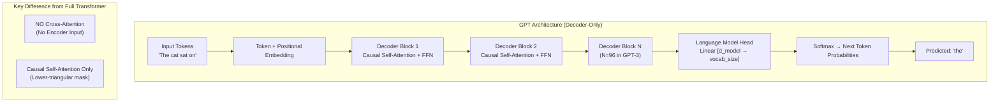

### GPT vs BERT Architecture Comparison

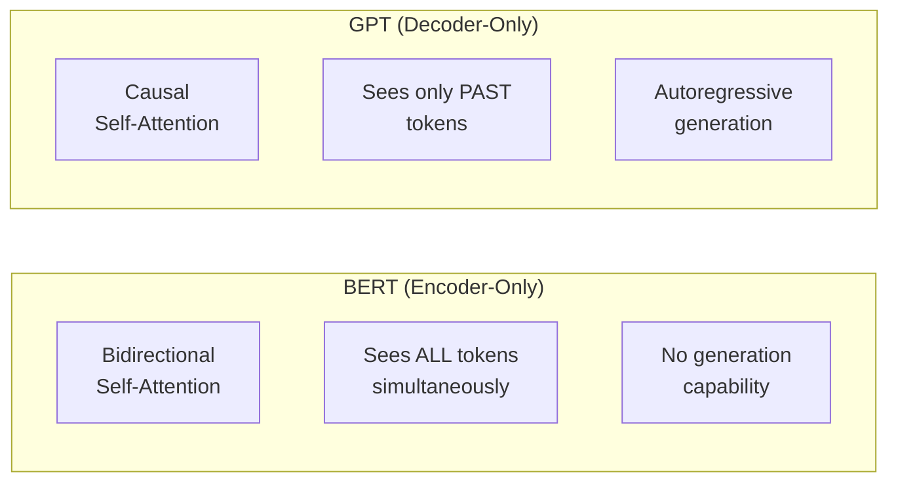

---

## 5. Internal Working

**GPT is a Transformer Decoder without cross-attention.**

Since GPT has no encoder, there's nothing to cross-attend to. Each decoder block contains only two sub-layers:
1. Causal Multi-Head Self-Attention
2. Feed-Forward Network

**Training Objective: Next Token Prediction**

Given a sequence `[t_1, t_2, t_3, ..., t_n]`, predict `[t_2, t_3, t_4, ..., t_{n+1}]`.

```
L = -Σ_{i=1}^{n} log P(t_i | t_1, t_2, ..., t_{i-1})
```

Every token position simultaneously predicts the next token. Training is efficient — one forward pass gives you `seq_len` training examples.

**In-Context Learning (ICL)**

GPT's most surprising capability. Given a few input-output examples in the prompt, GPT can perform a new task without any gradient updates:

```
Sentiment: I love this → positive
Sentiment: I hate this → negative
Sentiment: This is okay → neutral
Sentiment: This is amazing →  [GPT generates: positive]
```

GPT is not "learning" during inference — it's pattern-matching from its training distribution. ICL works because massive pre-training has exposed GPT to countless task patterns.

---

## 6. Mathematical Intuition

**Autoregressive probability factorization**:
```
P(x_1, x_2, ..., x_n) = P(x_1) × P(x_2|x_1) × P(x_3|x_1,x_2) × ... × P(x_n|x_1,...,x_{n-1})
```

This is the chain rule of probability. GPT models each conditional term. Training via teacher forcing means we provide the true `x_1,...,x_{i-1}` at each step (not the model's predictions), which stabilizes training.

**Why causal masking and not bidirectional?** For generation, you can't "see" tokens you haven't generated yet. Using bidirectional attention at training would create a trivial task — the model can just look at the answer — but at inference you wouldn't have future tokens. Causal masking creates a train/inference consistent setup.

---

## 7. Implementation

```python
import torch
import torch.nn as nn
import torch.nn.functional as F
from dataclasses import dataclass


@dataclass
class GPTConfig:
    """Configuration matching GPT-2 small"""
    vocab_size: int = 50257
    max_seq_len: int = 1024
    d_model: int = 768
    num_heads: int = 12
    num_layers: int = 12
    d_ff: int = 3072
    dropout: float = 0.1


class GPTBlock(nn.Module):
    """Single GPT Decoder Block: Causal MHA + FFN"""

    def __init__(self, config: GPTConfig):
        super().__init__()
        self.ln1 = nn.LayerNorm(config.d_model)
        self.attn = MultiHeadAttention(config.d_model, config.num_heads, config.dropout)
        self.ln2 = nn.LayerNorm(config.d_model)
        self.ffn = FeedForwardNetwork(config.d_model, config.d_ff, config.dropout)

    def forward(self, x: torch.Tensor) -> torch.Tensor:
        # Pre-norm architecture (GPT-2 style, more stable than post-norm)
        attn_out, _ = self.attn(self.ln1(x), is_causal=True)
        x = x + attn_out
        x = x + self.ffn(self.ln2(x))
        return x


class GPT(nn.Module):
    """
    GPT Language Model — Production Implementation.
    Matches GPT-2 architecture with pre-layer normalization.
    """

    def __init__(self, config: GPTConfig):
        super().__init__()
        self.config = config

        self.token_embedding = nn.Embedding(config.vocab_size, config.d_model)
        self.pos_embedding = nn.Embedding(config.max_seq_len, config.d_model)
        self.dropout = nn.Dropout(config.dropout)

        self.blocks = nn.ModuleList([GPTBlock(config) for _ in range(config.num_layers)])
        self.ln_final = nn.LayerNorm(config.d_model)

        # Weight tying: output projection shares weights with token embedding
        # This is critical for performance and parameter efficiency
        self.lm_head = nn.Linear(config.d_model, config.vocab_size, bias=False)
        self.lm_head.weight = self.token_embedding.weight  # Weight tying!

        # Initialize weights
        self.apply(self._init_weights)

    def _init_weights(self, module: nn.Module) -> None:
        if isinstance(module, nn.Linear):
            nn.init.normal_(module.weight, std=0.02)
            if module.bias is not None:
                nn.init.zeros_(module.bias)
        elif isinstance(module, nn.Embedding):
            nn.init.normal_(module.weight, std=0.02)
        elif isinstance(module, nn.LayerNorm):
            nn.init.zeros_(module.bias)
            nn.init.ones_(module.weight)

    def forward(
        self,
        input_ids: torch.Tensor,   # [batch, seq_len]
        labels: torch.Tensor | None = None,   # [batch, seq_len] for training
    ) -> dict:
        batch, seq_len = input_ids.shape
        assert seq_len <= self.config.max_seq_len

        # Token + positional embeddings
        token_embeds = self.token_embedding(input_ids)
        pos_ids = torch.arange(seq_len, device=input_ids.device)
        pos_embeds = self.pos_embedding(pos_ids)
        x = self.dropout(token_embeds + pos_embeds)

        # Forward through all blocks
        for block in self.blocks:
            x = block(x)

        x = self.ln_final(x)
        logits = self.lm_head(x)  # [batch, seq_len, vocab_size]

        loss = None
        if labels is not None:
            # Shift: logits predict next token
            # logits[:-1] predicts labels[1:]
            shift_logits = logits[:, :-1, :].contiguous()
            shift_labels = labels[:, 1:].contiguous()
            loss = F.cross_entropy(
                shift_logits.view(-1, self.config.vocab_size),
                shift_labels.view(-1),
                ignore_index=-100  # Ignore padding positions
            )

        return {'logits': logits, 'loss': loss}

    @torch.no_grad()
    def generate(
        self,
        prompt_ids: torch.Tensor,   # [1, prompt_len]
        max_new_tokens: int = 50,
        temperature: float = 0.8,
        top_k: int = 40,
    ) -> torch.Tensor:
        """Greedy/top-k sampling generation"""
        for _ in range(max_new_tokens):
            # Crop to max context if needed
            ctx = prompt_ids[:, -self.config.max_seq_len:]

            outputs = self(ctx)
            logits = outputs['logits'][:, -1, :]  # Last token's logits

            logits = logits / temperature

            # Top-k filtering
            if top_k > 0:
                top_k_vals, _ = torch.topk(logits, top_k)
                logits[logits < top_k_vals[:, -1:]] = float('-inf')

            probs = F.softmax(logits, dim=-1)
            next_token = torch.multinomial(probs, num_samples=1)
            prompt_ids = torch.cat([prompt_ids, next_token], dim=-1)

        return prompt_ids
```

---

## 8. Production Architecture

**Serving GPT at Scale**:

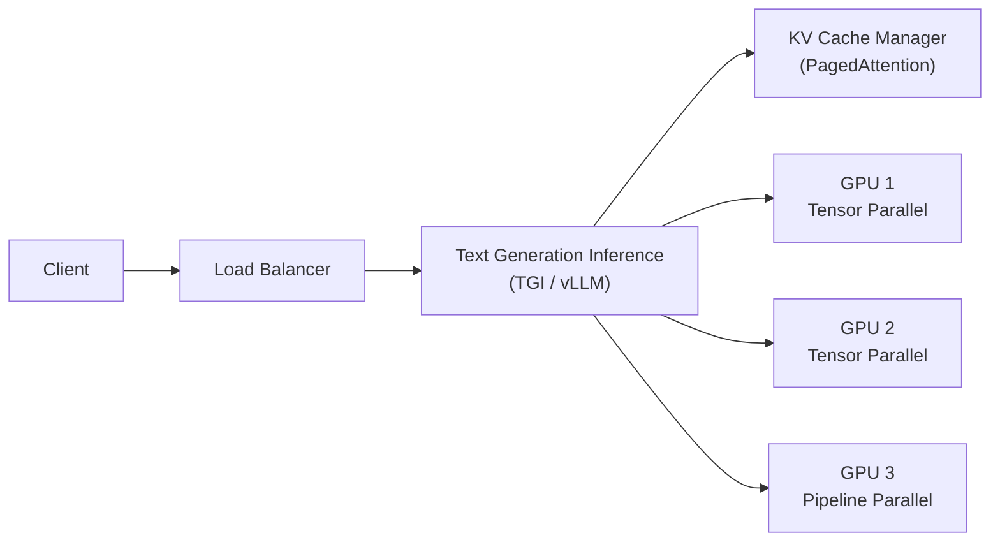

**vLLM's PagedAttention**: Instead of allocating a large contiguous KV cache per request, PagedAttention allocates KV cache in pages (like OS virtual memory). Multiple requests share GPU memory efficiently, improving throughput 24× vs naive implementations.

**Tensor Parallelism**: Split each attention head across GPUs. Head 1-8 on GPU 1, Head 9-16 on GPU 2. All GPUs work in parallel, all-reduce at the end.

**Pipeline Parallelism**: Layer 1-12 on GPU 1, Layer 13-24 on GPU 2. Micro-batches flow through the pipeline.

---

## 9. Tradeoffs

| GPT Advantage | GPT Disadvantage |
|---|---|
| Excellent generation (fluent, coherent) | Weak at structured extraction (vs fine-tuned BERT) |
| In-context learning (no fine-tuning needed) | Slow sequential generation |
| Unified model for many tasks | Quadratic cost for long prompts |
| Scales well with parameters | Prone to hallucination |
| Aligns well with RLHF | Requires careful prompt engineering |

---

## 10. Common Mistakes

- **Not using weight tying**: Tying lm_head weights to token embeddings is critical. Without it, you have double the parameters for the same vocab representation and worse performance.
- **Forgetting causal masking**: Leaking future tokens during training causes inflated perplexity on in-distribution data but poor generation quality.
- **Ignoring the shift in loss computation**: Logits at position `i` predict token at position `i+1`. Off-by-one errors in loss computation are common.
- **Not applying gradient clipping**: GPT training is sensitive to gradient explosions, especially at high learning rates. `clip_grad_norm_(params, 1.0)` is essential.

---

## 12. Follow-up Questions (Selected)

**Q: What is perplexity and how is it measured for GPT?**  
Perplexity = `exp(cross_entropy_loss)`. Lower is better. Perplexity of 20 means the model is as surprised as if it were randomly choosing between 20 equally likely tokens at each step. GPT-3 achieves ~20 perplexity on standard benchmarks.

**Q: What is RLHF and why does GPT need it?**  
Reinforcement Learning from Human Feedback. A GPT trained purely on next-token prediction is a distribution sampler — it continues text in any direction, including harmful or unhelpful ones. RLHF fine-tunes the model to maximize human preference scores, making it helpful and aligned. This is how ChatGPT differs from base GPT-3.5.

**Q: What is the difference between base GPT and instruct-tuned GPT?**  
Base GPT: complete text patterns. "Summarize this article:" might generate more article text.  
Instruct GPT: follows instructions. "Summarize this article:" will produce a summary.  
Instruction tuning requires fine-tuning on instruction-response pairs.

**Q: How does GPT handle very long contexts?**  
Standard GPT has a fixed context window (e.g., 4K or 8K tokens). Solutions: (1) sliding window attention, (2) RoPE interpolation/extrapolation (Chapter 11), (3) retrieval-augmented generation (add relevant context via search), (4) memory mechanisms.

---

---

# Chapter 10: T5

## 1. Introduction

**What is it?**

T5 (Text-to-Text Transfer Transformer) is an encoder-decoder Transformer introduced by Google in 2019. Its radical insight: **every NLP task can be framed as a text-to-text problem.** Translation, summarization, question answering, classification, sentiment analysis — all become "given this text input, produce this text output."

T5 is the unifying architecture. It speaks a single language: text in, text out.

**Why does it exist?**

Before T5, different task types required different model architectures and output mechanisms:
- Classification → encoder + linear head
- Generation → decoder
- Translation → encoder-decoder

T5 asked: "What if we didn't make these architectural distinctions?" If everything is text-to-text, one model can do everything.

---

## 2. Real-World Analogy

**The Universal Translator at the UN**

At the UN, different tasks require different specialists: translators, stenographers, summarizers, analysts. Each has their own tools and workflows.

T5 is like having a single incredibly versatile professional who can do all of these tasks, because they've been trained to convert any language/format input into any language/format output. You prefix their task: "Translate French to English: [text]" or "Summarize: [text]" or "Classify sentiment: [text]" — and they deliver in text.

---

## 3. Visual Mental Model

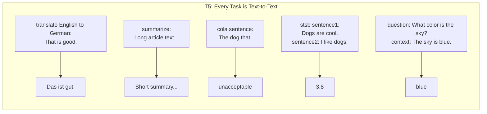

---

## 4. Internal Working

**Architecture**: Standard encoder-decoder Transformer (Chapters 6-7) with modifications:

1. **Relative Position Encoding** (not sinusoidal): Each attention layer learns position biases based on relative distance. Buckets of distances share parameters.

2. **No bias parameters**: T5 removes bias terms from all linear layers and layer norms (simplification with no quality loss).

3. **Pre-norm**: Layer normalization before each sub-layer (like GPT-2), not after.

4. **Shared embedding matrix**: Token embeddings are shared between encoder, decoder, and output projection (weight tying across all three).

**Pre-training: Span Corruption**

T5's pre-training objective is span corruption (a generalization of BERT's MLM):
- Randomly sample spans of tokens (average length 3)
- Replace each span with a single sentinel token `<extra_id_0>`, `<extra_id_1>`, etc.
- The decoder must reconstruct all the original spans

Input: `"The [X] sat on [Y] mat"`  
Target: `"[X] cat [Y] the </s>"`

This is more efficient than BERT's MLM because the decoder generates the spans, not just individual tokens.

---

## 5. Implementation

```python
from transformers import T5Tokenizer, T5ForConditionalGeneration
import torch


class T5Tasks:
    """
    Demonstrates T5's unified text-to-text paradigm for multiple tasks.
    """

    def __init__(self, model_name: str = "t5-base"):
        self.tokenizer = T5Tokenizer.from_pretrained(model_name)
        self.model = T5ForConditionalGeneration.from_pretrained(model_name)
        self.device = torch.device("cuda" if torch.cuda.is_available() else "cpu")
        self.model.to(self.device)
        self.model.eval()

    def run_task(
        self,
        task_prefix: str,
        input_text: str,
        max_new_tokens: int = 200,
        num_beams: int = 4,
    ) -> str:
        """Universal task runner — just change the prefix"""
        full_input = f"{task_prefix}: {input_text}"

        inputs = self.tokenizer(
            full_input,
            return_tensors="pt",
            max_length=512,
            truncation=True
        ).to(self.device)

        with torch.no_grad():
            outputs = self.model.generate(
                **inputs,
                max_new_tokens=max_new_tokens,
                num_beams=num_beams,
                early_stopping=True,
            )

        return self.tokenizer.decode(outputs[0], skip_special_tokens=True)

    def translate(self, text: str, target_lang: str = "German") -> str:
        return self.run_task(f"translate English to {target_lang}", text)

    def summarize(self, text: str) -> str:
        return self.run_task("summarize", text)

    def classify_sentiment(self, text: str) -> str:
        return self.run_task("sst2 sentence", text)

    def answer_question(self, question: str, context: str) -> str:
        return self.run_task("question", f"{question} context: {context}")


# --- Fine-tuning T5 for Custom Tasks ---
class T5FineTuner:
    """Production T5 fine-tuning with proper tokenization and training loop"""

    def __init__(self, model_name: str = "t5-small", task_prefix: str = "classify"):
        self.tokenizer = T5Tokenizer.from_pretrained(model_name)
        self.model = T5ForConditionalGeneration.from_pretrained(model_name)
        self.task_prefix = task_prefix

    def prepare_batch(
        self,
        inputs: list[str],
        targets: list[str],
        max_input_len: int = 512,
        max_target_len: int = 128,
    ) -> dict:
        input_texts = [f"{self.task_prefix}: {inp}" for inp in inputs]

        input_enc = self.tokenizer(
            input_texts,
            max_length=max_input_len,
            padding='max_length',
            truncation=True,
            return_tensors='pt'
        )
        target_enc = self.tokenizer(
            targets,
            max_length=max_target_len,
            padding='max_length',
            truncation=True,
            return_tensors='pt'
        )

        # T5 uses -100 as ignore index for padding in targets
        labels = target_enc.input_ids.clone()
        labels[labels == self.tokenizer.pad_token_id] = -100

        return {
            'input_ids': input_enc.input_ids,
            'attention_mask': input_enc.attention_mask,
            'labels': labels,
        }


# --- Example Usage ---
if __name__ == "__main__":
    t5 = T5Tasks("t5-small")

    print(t5.translate("The house is wonderful."))
    print(t5.summarize("The Tower of London was built in the 11th century by William the Conqueror."))
    print(t5.answer_question(
        "What color is the sky?",
        "The sky appears blue due to Rayleigh scattering of sunlight."
    ))
```

---

## 6. Tradeoffs

| T5 | BERT | GPT |
|---|---|---|
| Encoder-decoder | Encoder only | Decoder only |
| Text-to-text (any task) | Understanding tasks | Generation tasks |
| Bidirectional encoder | Bidirectional | Unidirectional |
| Can generate AND encode | Cannot generate | Cannot encode effectively |
| Slower inference (encoder+decoder) | Fastest inference | Medium inference |

---

## 11. Interview Preparation

**Senior**: "T5 frames every NLP task as text-to-text, enabling a single model for classification, translation, QA, and generation. It uses a standard encoder-decoder with span corruption pre-training (replacing random spans with sentinel tokens). The key insight is that output format flexibility comes from the decoder's generative capability, while input understanding comes from the bidirectional encoder."

**Principal**: "T5's text-to-text framing has two important consequences: (1) You can fine-tune on any task without architectural changes — just change the task prefix and target format. (2) It enables multi-task training by mixing different tasks in the same batch. The encoder-decoder overhead vs. decoder-only GPT is significant for generation tasks, but encoder-decoder is often better for conditional generation (summarization, translation) because the encoder can form a rich input representation without being constrained by causal masking."

---

---

# Chapter 11: RoPE — Rotary Positional Embedding

## 1. Introduction

**What is it?**

RoPE (Rotary Position Embedding) is a technique for encoding positional information that multiplies query and key vectors by complex rotation matrices that depend on their positions. The result: the dot product `Q_i · K_j` naturally depends only on the *relative* position `(i - j)`, not absolute positions `i` or `j`.

RoPE has become the dominant positional encoding in modern LLMs: LLaMA, Mistral, Qwen, Falcon, Phi, GPT-NeoX, and more.

**Why does it exist?**

Sinusoidal PE and learned PE both encode absolute position. This creates a problem: a model trained on sequences up to length 2K struggles to generalize to length 8K, because it has never seen position 5000 during training. Relative PE schemes are better for generalization.

RoPE achieves relative PE elegantly — without any additional parameters — by rotating Q and K vectors in a high-dimensional complex space.

---

## 2. Historical Motivation

The quest for better positional encoding:

1. **Sinusoidal PE (2017)**: Fixed, absolute. Generalizes OK but not great.
2. **Learned PE (2018)**: Flexible but doesn't extrapolate beyond training length.
3. **Relative PE (Shaw, 2018)**: Encodes relative distance but adds significant complexity.
4. **ALiBi (2021)**: Adds linear biases to attention scores based on distance. Simple, strong extrapolation.
5. **RoPE (2022, Su et al.)**: Encodes relative position through rotation. Theoretically elegant, no parameters, excellent extrapolation with modifications.

---

## 3. Real-World Analogy

**The Clock Face**

Imagine positions as angles on a clock face. Each position `p` corresponds to an angle `θ_p`. When you want to compute the "relationship" between position 3 and position 7, you don't need to know that they're at 3 o'clock and 7 o'clock — you just need to know the *angular difference* of 4 hours.

RoPE does exactly this: it rotates Q and K vectors by their position angle. When you compute `Q_i · K_j`, the positional contribution is only `θ_i - θ_j` (the relative angle). The absolute positions cancel out.

---

## 4. Visual Mental Model

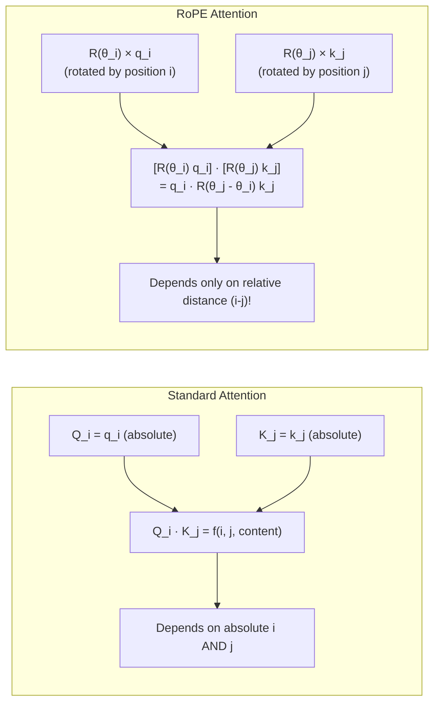

---

## 5. Internal Working

**The Core Idea**: Represent 2D vectors as complex numbers. Rotation by angle `θ` corresponds to multiplication by `e^{iθ} = cos(θ) + i·sin(θ)`.

**For a 2D vector pair `(x_1, x_2)`**:

The rotated version at position `m` is:
```
RoPE(x, m) = [x_1 cos(mθ) - x_2 sin(mθ),
              x_1 sin(mθ) + x_2 cos(mθ)]
```

**For d-dimensional vectors**: Split into d/2 pairs of 2D vectors. Apply a different frequency `θ_k` to each pair, just like sinusoidal PE.

```
θ_k = 1 / (10000 ^ (2k / d))   for k = 0, 1, ..., d/2 - 1
```

**Why does relative position emerge?**

For two vectors at positions `m` and `n`:
```
(R_m × q) · (R_n × k) = q · R_{n-m} · k
```

The product only involves `n-m` (the relative distance). This is the mathematical magic: the rotation matrices compose in a way that absolute positions cancel, leaving only relative distance.

---

## 6. Mathematical Intuition

The key rotation matrix for position `m` in 2D is:
```
R_m = [[cos(mθ),  -sin(mθ)],
       [sin(mθ),   cos(mθ)]]
```

For the full d-dimensional case, R_m is block-diagonal with d/2 such 2×2 rotation blocks, each using a different frequency θ_k.

**Properties**:
- `R_m` is orthogonal: `R_m^T × R_m = I` (preserves vector lengths)
- `R_m × R_n = R_{m+n}` (rotations compose additively — this is why relative position emerges)
- `(R_m × q) · (R_n × k) = q^T × R_m^T × R_n × k = q^T × R_{n-m} × k`

**Long-context extension (YaRN)**:

To extend a model trained on context 4K to 32K without full retraining:
- Scale the RoPE frequencies: divide `θ_k` by a scaling factor `s`
- The model "thinks" position 32000 is like position 4000 from its training
- Fine-tune for a few steps to adapt
- Quality loss: <0.5% on most benchmarks

---

## 7. Implementation

```python
import torch
import torch.nn as nn
import math


def precompute_rope_freqs(
    d_k: int,
    max_seq_len: int,
    base: float = 10000.0,
) -> tuple[torch.Tensor, torch.Tensor]:
    """
    Precompute cosine and sine tables for RoPE.
    
    Returns:
        cos: [max_seq_len, d_k // 2]
        sin: [max_seq_len, d_k // 2]
    """
    # Frequencies for each dimension pair
    # θ_k = 1 / (base ^ (2k / d_k))
    dim_indices = torch.arange(0, d_k, 2, dtype=torch.float)
    freqs = 1.0 / (base ** (dim_indices / d_k))  # [d_k // 2]

    # Positions
    positions = torch.arange(max_seq_len, dtype=torch.float)  # [max_seq_len]

    # Outer product: angle for each (position, dimension) pair
    angles = torch.outer(positions, freqs)  # [max_seq_len, d_k // 2]

    cos_vals = torch.cos(angles)  # [max_seq_len, d_k // 2]
    sin_vals = torch.sin(angles)  # [max_seq_len, d_k // 2]

    return cos_vals, sin_vals


def apply_rope(
    x: torch.Tensor,                  # [batch, heads, seq_len, d_k]
    cos_vals: torch.Tensor,           # [seq_len, d_k // 2]
    sin_vals: torch.Tensor,           # [seq_len, d_k // 2]
) -> torch.Tensor:
    """
    Apply Rotary Position Embedding to query or key tensor.
    
    The rotation is applied to each 2D pair of dimensions independently.
    """
    seq_len = x.size(2)
    cos = cos_vals[:seq_len].unsqueeze(0).unsqueeze(0)  # [1, 1, seq_len, d_k//2]
    sin = sin_vals[:seq_len].unsqueeze(0).unsqueeze(0)

    # Split x into even and odd dimensions (each pair forms a 2D vector)
    x_even = x[..., 0::2]  # [batch, heads, seq_len, d_k//2]
    x_odd  = x[..., 1::2]

    # Apply 2D rotation:
    # [x_even, x_odd] → [x_even*cos - x_odd*sin, x_even*sin + x_odd*cos]
    x_rotated_even = x_even * cos - x_odd * sin
    x_rotated_odd  = x_even * sin + x_odd * cos

    # Interleave back to original shape
    # Stack and reshape: [batch, heads, seq_len, d_k//2, 2] → [batch, heads, seq_len, d_k]
    x_rotated = torch.stack([x_rotated_even, x_rotated_odd], dim=-1)
    x_rotated = x_rotated.flatten(-2)

    return x_rotated


class RoPEMultiHeadAttention(nn.Module):
    """
    Multi-Head Attention with Rotary Position Embedding.
    This is how LLaMA, Mistral, and most modern LLMs implement attention.
    """

    def __init__(self, d_model: int, num_heads: int, max_seq_len: int = 4096):
        super().__init__()
        self.d_model = d_model
        self.num_heads = num_heads
        self.d_k = d_model // num_heads

        self.qkv_proj = nn.Linear(d_model, 3 * d_model, bias=False)
        self.out_proj = nn.Linear(d_model, d_model, bias=False)

        # Precompute RoPE tables
        cos_vals, sin_vals = precompute_rope_freqs(self.d_k, max_seq_len)
        self.register_buffer('cos_vals', cos_vals)
        self.register_buffer('sin_vals', sin_vals)

    def forward(
        self,
        x: torch.Tensor,          # [batch, seq_len, d_model]
        is_causal: bool = True,
    ) -> torch.Tensor:
        batch, seq_len, _ = x.shape

        # Project to Q, K, V and split heads
        qkv = self.qkv_proj(x)
        Q, K, V = qkv.chunk(3, dim=-1)

        # Reshape to [batch, heads, seq_len, d_k]
        Q = Q.view(batch, seq_len, self.num_heads, self.d_k).transpose(1, 2)
        K = K.view(batch, seq_len, self.num_heads, self.d_k).transpose(1, 2)
        V = V.view(batch, seq_len, self.num_heads, self.d_k).transpose(1, 2)

        # Apply RoPE to Q and K (not V)
        Q = apply_rope(Q, self.cos_vals, self.sin_vals)
        K = apply_rope(K, self.cos_vals, self.sin_vals)

        # Standard scaled dot-product attention
        scale = math.sqrt(self.d_k)
        scores = torch.matmul(Q, K.transpose(-2, -1)) / scale

        if is_causal:
            mask = torch.triu(torch.ones(seq_len, seq_len, device=x.device, dtype=torch.bool), diagonal=1)
            scores = scores.masked_fill(mask.unsqueeze(0).unsqueeze(0), float('-inf'))

        weights = torch.softmax(scores, dim=-1)
        output = torch.matmul(weights, V)

        # Merge heads
        output = output.transpose(1, 2).contiguous().view(batch, seq_len, self.d_model)
        return self.out_proj(output)


# --- Verify relative position property ---
def verify_rope_relative_property():
    """
    Verify that RoPE-encoded dot products depend only on relative position.
    """
    d_k = 64
    cos_vals, sin_vals = precompute_rope_freqs(d_k, max_seq_len=100)

    q = torch.randn(1, 1, 1, d_k)  # [batch=1, heads=1, seq=1, d_k]
    k = torch.randn(1, 1, 1, d_k)

    # Compute dot products at positions (3, 7) and (13, 17) — both offset by 4
    cos_3 = cos_vals[3:4].unsqueeze(0).unsqueeze(0)
    sin_3 = sin_vals[3:4].unsqueeze(0).unsqueeze(0)
    cos_7 = cos_vals[7:8].unsqueeze(0).unsqueeze(0)
    sin_7 = sin_vals[7:8].unsqueeze(0).unsqueeze(0)
    cos_13 = cos_vals[13:14].unsqueeze(0).unsqueeze(0)
    sin_13 = sin_vals[13:14].unsqueeze(0).unsqueeze(0)
    cos_17 = cos_vals[17:18].unsqueeze(0).unsqueeze(0)
    sin_17 = sin_vals[17:18].unsqueeze(0).unsqueeze(0)

    # Apply rotation
    def rot(x, c, s):
        x_even, x_odd = x[..., 0::2], x[..., 1::2]
        e = x_even * c - x_odd * s
        o = x_even * s + x_odd * c
        return torch.stack([e, o], dim=-1).flatten(-2)

    q_3 = rot(q, cos_3, sin_3)
    k_7 = rot(k, cos_7, sin_7)
    dot_3_7 = (q_3 * k_7).sum().item()

    q_13 = rot(q, cos_13, sin_13)
    k_17 = rot(k, cos_17, sin_17)
    dot_13_17 = (q_13 * k_17).sum().item()

    print(f"dot(Q@pos3, K@pos7)  = {dot_3_7:.6f}")
    print(f"dot(Q@pos13, K@pos17) = {dot_13_17:.6f}")
    print(f"Are they equal (relative offset=4)? {abs(dot_3_7 - dot_13_17) < 1e-5}")


if __name__ == "__main__":
    verify_rope_relative_property()
```

---

## 8. Production Architecture

**Context Extension with YaRN**:

```python
def apply_yarn_rope(
    x: torch.Tensor,
    cos_vals: torch.Tensor,
    sin_vals: torch.Tensor,
    scale_factor: float = 8.0,  # Extend 4K → 32K
) -> torch.Tensor:
    """
    YaRN: Apply RoPE with frequency scaling for context extension.
    Scale factor = new_ctx / training_ctx
    """
    # The key idea: interpolate the angle instead of extrapolating
    # angle_new = angle_training / scale_factor
    # This "squeezes" the position space so position 32000 maps to ~4000
    scaled_cos = cos_vals  # Pre-computed with scaled freqs
    scaled_sin = sin_vals
    return apply_rope(x, scaled_cos, scaled_sin)
```

**LLaMA's Implementation**: LLaMA applies RoPE inside the attention computation, pre-caches the cos/sin tables, and uses optimized CUDA kernels (via FlashAttention-2) for the rotation.

---

## 9. Tradeoffs

| PE Method | Parameters | Extrapolation | Relative | Implementation |
|---|---|---|---|---|
| Sinusoidal | 0 | Moderate | ❌ | Simple |
| Learned | max_seq × d | None | ❌ | Simple |
| ALiBi | O(heads) | Excellent | ✅ | Simple |
| RoPE | 0 | Good (excellent with YaRN) | ✅ | Moderate |

**RoPE advantages**:
- Zero extra parameters
- Relative position information naturally
- Theoretically motivated (rotation group structure)
- Can be extended with YaRN/LongRoPE

**RoPE disadvantage**:
- Only applied to Q and K (not V) — a slight asymmetry
- The rotation adds computational overhead (though small)
- Context extension requires careful frequency interpolation

---

## 11. Interview Preparation

**Junior**: "RoPE is a positional encoding that rotates query and key vectors by an angle based on their position. The math works out so that only the relative distance between two positions affects their attention score."

**Senior**: "RoPE encodes position by rotating Q and K vectors. The rotation at position m uses angle mθ_k for each frequency θ_k = 1/base^(2k/d). Because rotations compose multiplicatively and (R_m q) · (R_n k) = q · R_{n-m} k, the dot product depends only on the offset (n-m). This naturally implements relative positional encoding with zero parameters. Modern LLMs (LLaMA, Mistral) prefer it because of its excellent generalization and extendability."

**Principal**: "RoPE has become the standard because it uniquely satisfies all desirable properties: (1) zero parameters, (2) relative position encoding, (3) theoretically sound (rotation group), (4) compatible with Flash Attention, (5) extendable via frequency interpolation. YaRN extends context 4-8× by scaling RoPE frequencies and adding a small attention temperature factor. LongRoPE (Microsoft) extends to 2M tokens by identifying and modifying non-uniform optimal rescaling factors for different frequency components."

---

---

# Chapter 12: Flash Attention

## 1. Introduction

**What is it?**

Flash Attention is an *IO-aware* exact attention algorithm that computes the same mathematical result as standard attention but avoids materializing the full `[seq_len × seq_len]` attention matrix in GPU High Bandwidth Memory (HBM). Instead, it tiles the computation into blocks that fit in fast SRAM (on-chip memory), dramatically reducing memory usage and improving speed.

Flash Attention doesn't change *what* is computed — it changes *how* it's computed. The output is mathematically identical to standard attention.

**Why does it exist?**

The attention matrix for a sequence of length `n` requires `O(n²)` memory. For `n = 16,384` tokens, the attention matrix is `16384² × 4 bytes ≈ 1 GB` — just for one head, one layer, one sample. A 32-head model in a batch of 8 would require `256 GB` just for attention matrices. This is physically impossible.

Flash Attention made long-context transformers viable by reducing memory from `O(n²)` to `O(n)`.

---

## 2. Historical Motivation

The GPU memory hierarchy is critical to understand here:

| Memory Type | Size | Speed | Bandwidth |
|---|---|---|---|
| Registers | ~MB | Fastest | — |
| SRAM (shared memory) | ~20 MB | Very fast | ~20 TB/s |
| HBM (GPU main memory) | 24-80 GB | Slower | ~3 TB/s |

Standard attention writes the full attention matrix to HBM multiple times:
1. Write `QK^T` to HBM → Read back for softmax
2. Write softmax output to HBM → Read back for multiplication with V

For long sequences, these HBM reads/writes dominate the computation time. GPUs are often 50-80% idle waiting for memory.

Flash Attention (Dao et al., 2022) recognized that attention is **memory-bandwidth-bound**, not **compute-bound**. The solution: compute attention in tiles, keeping intermediate results in SRAM, never writing the full matrix to HBM.

---

## 3. Real-World Analogy

**The Student Study Method**

**Standard Attention = Bad Study Method**:
A student studying for an exam copies their entire notebook (QK^T) to a new piece of paper, then reads through it to normalize (softmax), then copies the result again. They're doing massive amounts of writing and reading.

**Flash Attention = Smart Study Method**:
The student studies chapter by chapter. For each chapter, they hold everything in their head (SRAM), compute their understanding (partial attention), and only write the final answer. No intermediate transcription.

The smart student does the same amount of *thinking* (FLOPs) but far less *writing* (memory bandwidth), finishing much faster.

---

## 4. Visual Mental Model

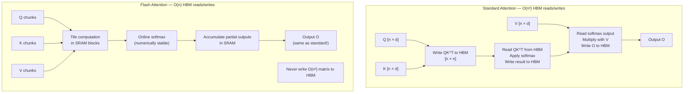

---

## 5. Internal Working

**The Tiling Algorithm**

Flash Attention divides Q, K, V into blocks of size `B` (chosen to fit in SRAM):

```
Q_blocks = split(Q, block_size=B)   # Q_1, Q_2, ..., Q_{n/B}
K_blocks = split(K, block_size=B)   
V_blocks = split(V, block_size=B)   
```

**The Online Softmax Trick**

The challenge: softmax requires seeing the full row to compute the denominator `Σ exp(s_j)`. Flash Attention uses an online algorithm to update softmax incrementally:

For each block of Q (outer loop), for each block of K (inner loop):
1. Compute tile of scores: `S_tile = Q_i @ K_j^T / √d_k`
2. Update running max: `m_new = max(m_old, row_max(S_tile))`
3. Recompute scaling factor: `exp(m_old - m_new)`
4. Update running sum: `l_new = exp(m_old - m_new) * l_old + row_sum(exp(S_tile - m_new))`
5. Update output accumulator: `O_new = (exp(m_old - m_new) * O_old + exp(S_tile - m_new) @ V_j) / l_new`

At the end, `O` contains the exact same result as standard softmax(QK^T/√d_k)V, but computed entirely in SRAM.

**Memory**: Instead of O(n²) for the full attention matrix, only O(n) for Q, K, V, O.

---

## 6. Mathematical Intuition

**Why can softmax be computed online?**

For numerical stability, softmax subtracts the max:
```
softmax(s) = exp(s - max(s)) / Σ exp(s_j - max(s))
```

When new elements arrive in a stream, you can update the running max and rescale previous exponentials:
```
If new_max > old_max:
    exp(old values) → exp(old values) × exp(old_max - new_max)
    (rescale by exp(shift) to match new denominator)
```

This decomposition is what makes tiled computation possible. Flash Attention's key contribution is making this rescaling exact and efficient in GPU hardware.

**Flash Attention 2 improvements (2023)**:
1. Reduces non-matmul FLOPs by reorganizing loops
2. Parallelizes across the sequence length dimension (not just batch and heads)
3. Within each thread block, distributes work more evenly
4. Achieves ~72% of A100's theoretical peak matmul FLOPS

---

## 7. Implementation

```python
# Flash Attention is implemented as a CUDA kernel — you don't implement it in Python.
# You USE it through the flash_attn library or PyTorch's built-in implementation.

import torch
import torch.nn.functional as F


# Method 1: PyTorch built-in (PyTorch >= 2.0)
def attention_with_torch_sdpa(
    Q: torch.Tensor,
    K: torch.Tensor,
    V: torch.Tensor,
    is_causal: bool = False,
    dropout_p: float = 0.0,
) -> torch.Tensor:
    """
    Uses PyTorch's scaled_dot_product_attention which automatically
    selects Flash Attention when available (CUDA, appropriate dtypes).
    
    This is the recommended production approach.
    """
    return F.scaled_dot_product_attention(
        Q, K, V,
        attn_mask=None,
        dropout_p=dropout_p if torch.is_grad_enabled() else 0.0,
        is_causal=is_causal,
        scale=None,  # Defaults to 1/sqrt(d_k)
    )


# Method 2: flash_attn library (more control)
try:
    from flash_attn import flash_attn_qkvpacked_func, flash_attn_func

    def attention_with_flash_attn(
        Q: torch.Tensor,  # [batch, seq, heads, d_k]
        K: torch.Tensor,
        V: torch.Tensor,
        causal: bool = False,
        dropout_p: float = 0.0,
    ) -> torch.Tensor:
        """
        Direct Flash Attention 2 usage.
        Expects inputs in [batch, seq, heads, d_k] format (different from PyTorch!).
        """
        return flash_attn_func(Q, K, V, dropout_p=dropout_p, causal=causal)

except ImportError:
    print("flash_attn not installed. Install with: pip install flash-attn --no-build-isolation")


# Method 3: Production MHA with automatic Flash Attention selection
class ProductionMultiHeadAttention(torch.nn.Module):
    """
    Multi-Head Attention that automatically uses Flash Attention when available.
    Falls back to standard attention with a warning.
    """

    def __init__(self, d_model: int, num_heads: int, dropout: float = 0.0):
        super().__init__()
        self.d_model = d_model
        self.num_heads = num_heads
        self.d_k = d_model // num_heads
        self.dropout = dropout

        self.qkv_proj = torch.nn.Linear(d_model, 3 * d_model, bias=False)
        self.out_proj = torch.nn.Linear(d_model, d_model, bias=False)

        # Check if Flash Attention is available
        self._use_flash = self._check_flash_available()

    def _check_flash_available(self) -> bool:
        if not torch.cuda.is_available():
            return False
        # PyTorch 2.0+ has built-in Flash Attention support
        return hasattr(F, 'scaled_dot_product_attention')

    def forward(
        self,
        x: torch.Tensor,
        is_causal: bool = False,
    ) -> torch.Tensor:
        batch, seq_len, _ = x.shape

        qkv = self.qkv_proj(x)
        Q, K, V = qkv.chunk(3, dim=-1)

        # Reshape for multi-head: [batch, seq, d_model] → [batch, heads, seq, d_k]
        def reshape(t):
            return t.view(batch, seq_len, self.num_heads, self.d_k).transpose(1, 2)

        Q, K, V = reshape(Q), reshape(K), reshape(V)

        if self._use_flash:
            # Flash Attention path (automatic IO-aware computation)
            output = F.scaled_dot_product_attention(
                Q, K, V,
                dropout_p=self.dropout if self.training else 0.0,
                is_causal=is_causal,
            )
        else:
            # Standard attention fallback
            import math
            scores = torch.matmul(Q, K.transpose(-2, -1)) / math.sqrt(self.d_k)
            if is_causal:
                mask = torch.triu(torch.ones(seq_len, seq_len, device=x.device, dtype=torch.bool), 1)
                scores.masked_fill_(mask, float('-inf'))
            output = torch.softmax(scores, dim=-1) @ V

        # Merge heads: [batch, heads, seq, d_k] → [batch, seq, d_model]
        output = output.transpose(1, 2).contiguous().view(batch, seq_len, self.d_model)
        return self.out_proj(output)


# --- Benchmarking Flash Attention ---
def benchmark_attention(seq_len: int, d_model: int = 512, num_heads: int = 8):
    """Compare memory and speed of standard vs Flash Attention"""
    import time

    device = torch.device('cuda' if torch.cuda.is_available() else 'cpu')
    batch = 4
    d_k = d_model // num_heads

    Q = torch.randn(batch, num_heads, seq_len, d_k, device=device, dtype=torch.float16)
    K = torch.randn_like(Q)
    V = torch.randn_like(Q)

    # Standard attention
    torch.cuda.synchronize()
    start = time.time()
    mem_before = torch.cuda.memory_allocated()

    scores = torch.matmul(Q, K.transpose(-2, -1)) / (d_k ** 0.5)
    weights = torch.softmax(scores, dim=-1)
    out_standard = torch.matmul(weights, V)

    torch.cuda.synchronize()
    mem_standard = torch.cuda.memory_allocated() - mem_before
    time_standard = time.time() - start

    # Flash Attention
    torch.cuda.synchronize()
    mem_before = torch.cuda.memory_allocated()
    start = time.time()

    out_flash = F.scaled_dot_product_attention(Q, K, V, is_causal=False)

    torch.cuda.synchronize()
    mem_flash = torch.cuda.memory_allocated() - mem_before
    time_flash = time.time() - start

    print(f"\nseq_len={seq_len}")
    print(f"Standard: {time_standard*1000:.1f}ms, {mem_standard/1e6:.1f}MB")
    print(f"Flash:    {time_flash*1000:.1f}ms, {mem_flash/1e6:.1f}MB")
    print(f"Memory reduction: {mem_standard/max(mem_flash,1):.1f}x")
    print(f"Speed improvement: {time_standard/max(time_flash,0.001):.1f}x")


if __name__ == "__main__":
    if torch.cuda.is_available():
        for seq_len in [512, 1024, 2048, 4096]:
            benchmark_attention(seq_len)
```

---

## 8. Production Architecture

**When to use Flash Attention**:
- Always, if sequences > 512 tokens and GPU is available
- Flash Attention 2 is the default in vLLM, TGI, Hugging Face
- Not needed for very short sequences (<128 tokens) — standard attention is fine

**Flash Attention 3 (2024)**: Targets H100 GPUs specifically. Overlaps GEMM (matrix multiply) and softmax operations using H100's asynchronous instruction execution. Achieves 1.5-2× speedup over FA2 on H100.

**Compatibility**:
- Requires CUDA
- Works with bfloat16 and float16
- Requires head dimension d_k ≤ 256
- Supports variable-length sequences (varlens) for efficient batching

---

## 9. Tradeoffs

| Aspect | Standard Attention | Flash Attention |
|---|---|---|
| Memory | O(n²) | O(n) |
| Compute FLOPs | Same | Same |
| Speed | Memory-bound (slow) | Compute-bound (fast) |
| Implementation complexity | Simple | Complex CUDA kernel |
| Portability | Works everywhere | CUDA only |
| Gradient computation | Straightforward | Requires recomputation trick |

**Flash Attention backward pass**: To avoid storing the O(n²) attention matrix for backward, FA recomputes the attention matrix during the backward pass from stored Q, K, V. This trades compute for memory.

---

## 10. Common Mistakes

- **Using Flash Attention on CPU**: FA is a CUDA kernel. It will fall back to standard attention on CPU — always check.
- **Wrong dtype**: FA requires float16 or bfloat16. Float32 is not supported in most implementations.
- **Wrong input format**: The flash_attn library expects `[batch, seq, heads, d_k]` while PyTorch convention is `[batch, heads, seq, d_k]`. This transpose confusion causes incorrect outputs.
- **Not benchmarking**: FA is always faster for long sequences, but for seq_len < 128, standard attention may be faster due to kernel launch overhead.

---

## 11. Interview Preparation

**Junior**: "Flash Attention computes the same result as regular attention but uses less memory by processing the input in tiles that fit in GPU fast memory, never writing the full attention matrix."

**Senior**: "Flash Attention is IO-aware: it recognizes that standard attention is memory-bandwidth-bound due to repeated reads/writes of the O(n²) attention matrix. By tiling the computation into blocks that fit in SRAM and using an online softmax algorithm (which correctly maintains running max and sum), FA computes exact attention with O(n) memory instead of O(n²). Memory reduction: from 1GB to 20MB for n=16K. Speed: 2-4× faster on A100 for long sequences."

**Principal**: "Flash Attention's innovation is rooted in a careful IO complexity analysis. Standard attention performs O(n²/B) memory operations at bandwidth B. FA reduces this to O(n·d/B) by tiling. The online softmax is the algorithmic key — the recurrence `(m_new, l_new, O_new) = update(m_old, l_old, O_old, new_block)` makes this incremental computation exact. In practice, FA2 achieves ~70% of A100 peak FLOPS for batch×seq configurations relevant to LLM training. The recomputation in the backward pass trades ~30% more FLOPs for 3-4× memory reduction — a worthwhile tradeoff. FA3 targets H100's async execution units to overlap softmax with GEMM, achieving another 1.5-2× speedup."

---

---

# Chapter 13: KV Cache

## 1. Introduction

**What is it?**

The KV Cache is an optimization that stores the computed Key and Value matrices from previously processed tokens during autoregressive generation, so they don't need to be recomputed for each new token.

Without KV cache, generating the 100th token would require processing all 100 tokens through the entire model — O(n²) work per step. With KV cache, generating each new token only requires processing that one new token — O(n) total for n generated tokens.

KV Cache is perhaps the most impactful inference optimization in LLMs. Without it, generating a 1,000-token response would take thousands of times longer than it does.

**Why does it exist?**

Autoregressive generation has a fundamental inefficiency: to compute the attention for the new token `t`, you need Q, K, V for all previous tokens. But their K and V don't change from step to step! Only the new token adds new K and V vectors. Computing them again is pure waste.

---

## 2. Historical Motivation

Early Transformer inference implementations naively re-ran the full forward pass for every generated token. For GPT-2 generating 200 tokens with a 100-token prompt, this meant processing 100+1, 100+2, ..., 100+200 tokens = over 30,000 total token-passes. The quadratic cost made interactive generation essentially impossible.

KV Cache was the obvious optimization, adopted quickly after the first Transformer inference systems. Today, it's fundamental to every production LLM serving system.

---

## 3. Real-World Analogy

**The Note-Taking Student**

A student attends a lecture where a professor builds on previous slides. Each new slide references earlier content.

**Without KV Cache**: The professor re-reads ALL previous slides before discussing the new one. Lecture gets exponentially longer.

**With KV Cache**: The student takes notes (K, V matrices) for each slide as it appears. When the professor discusses the new slide, the student already has all previous notes available — they only need to process the new slide and look up relevant notes.

The notes (KV cache) grow by one entry per new slide (token). Looking up previous notes is instant. This is O(n) total work vs O(n²).

---

## 4. Visual Mental Model

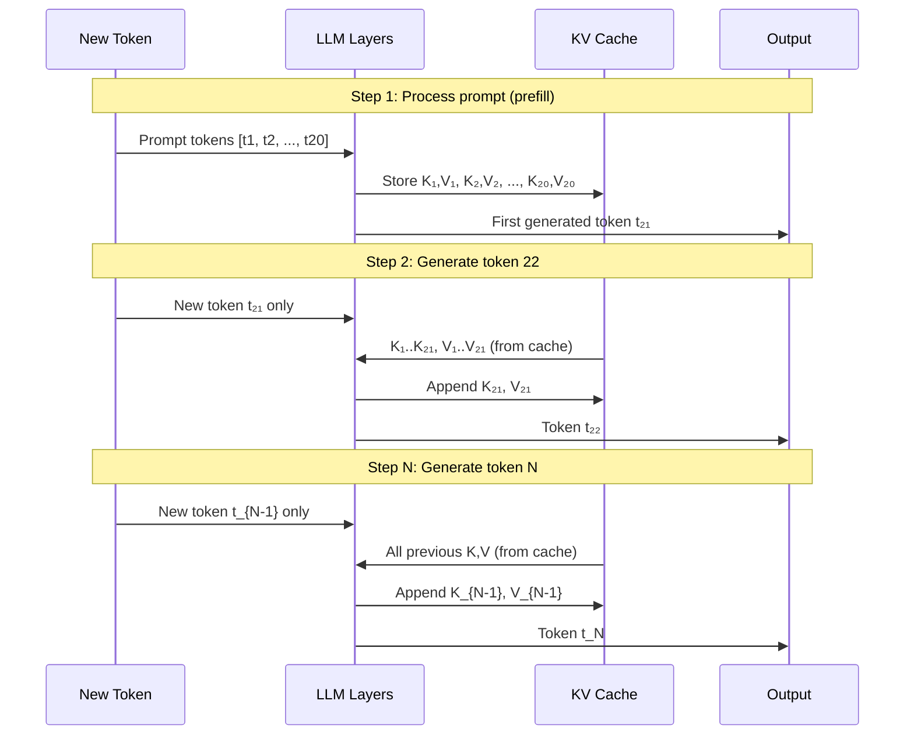

---

## 5. Internal Working

**Pre-KV-Cache (naive)**:

At step `t` (generating token `t`):
```
input = [t_1, ..., t_{t-1}, t_t]   # all tokens
Q, K, V = compute_qkv(input)        # O(t) computation
output = attention(Q, K, V)          # O(t²) attention
new_token_logits = output[-1]        # use last position only
```

Total work for generating n tokens: `O(1² + 2² + ... + n²) = O(n³)`.

**With KV Cache**:

During prefill (first pass):
```
input = [t_1, ..., t_{prompt_len}]
Q, K, V = compute_qkv(input)
cache['K'] = K   # Store K for all prompt tokens
cache['V'] = V   # Store V for all prompt tokens
```

During decode step `t`:
```
input = [t_t]   # Only the new token!
Q_new = compute_q(t_t)   # [1, d_k] — just one vector
K_new = compute_k(t_t)   # [1, d_k]
V_new = compute_v(t_t)   # [1, d_k]

# Extend cache
cache['K'] = cat([cache['K'], K_new])   # [t, d_k]
cache['V'] = cat([cache['V'], V_new])   # [t, d_k]

# Attend the new token against ALL previous K, V
output = attention(Q_new, cache['K'], cache['V'])   # Cross-attend: [1, d_k] against [t, d_k]
```

Total work: O(prompt_len²) for prefill + O(n × context_len) for decode = O(n) per step.

---

## 6. Mathematical Intuition

The attention at decode step t:
```
Q_t = x_t W_Q     # Only the new token [1, d_k]
K_all = X W_K     # All tokens [t, d_k] — from cache
V_all = X W_V     # All tokens [t, d_k] — from cache

A_t = softmax(Q_t K_all^T / √d_k) × V_all
    = softmax([s_1, s_2, ..., s_t]) × [V_1; V_2; ...; V_t]
```

`Q_t` is `[1, d_k]`, `K_all^T` is `[d_k, t]`, so the score vector is `[1, t]`. This is O(t) computation — linear in sequence length.

**KV Cache Memory Cost**:

For each layer:
```
KV memory = 2 × seq_len × d_model × num_bytes_per_element
```

For LLaMA-2 70B:
- 80 layers
- d_model = 8192
- 2 matrices (K and V)
- Context = 4096 tokens
- bfloat16 (2 bytes)

```
KV memory = 80 × 4096 × 8192 × 2 × 2 bytes = 8.6 GB per request
```

At 10 concurrent users: 86 GB just for KV cache. This is the main memory bottleneck in LLM serving.

---

## 7. Implementation

```python
import torch
import torch.nn as nn
from dataclasses import dataclass, field


@dataclass
class KVCacheEntry:
    """Stores K and V for one layer"""
    keys: torch.Tensor | None = None       # [batch, heads, seq_so_far, d_k]
    values: torch.Tensor | None = None     # [batch, heads, seq_so_far, d_k]


class KVCache:
    """
    KV Cache manager for a full Transformer model.
    Handles incremental updates during autoregressive generation.
    """

    def __init__(self, num_layers: int, device: torch.device):
        self.num_layers = num_layers
        self.device = device
        self._cache: list[KVCacheEntry] = [KVCacheEntry() for _ in range(num_layers)]

    def update(
        self,
        layer_idx: int,
        new_keys: torch.Tensor,      # [batch, heads, new_tokens, d_k]
        new_values: torch.Tensor,    # [batch, heads, new_tokens, d_k]
    ) -> tuple[torch.Tensor, torch.Tensor]:
        """
        Append new K, V to cache and return the full cached K, V.
        
        Returns:
            (full_keys, full_values) including all tokens seen so far
        """
        entry = self._cache[layer_idx]

        if entry.keys is None:
            # First tokens (prefill phase)
            entry.keys = new_keys
            entry.values = new_values
        else:
            # Subsequent tokens (decode phase)
            entry.keys = torch.cat([entry.keys, new_keys], dim=2)
            entry.values = torch.cat([entry.values, new_values], dim=2)

        return entry.keys, entry.values

    def get_seq_len(self, layer_idx: int = 0) -> int:
        """How many tokens are in the cache?"""
        if self._cache[layer_idx].keys is None:
            return 0
        return self._cache[layer_idx].keys.size(2)

    def clear(self) -> None:
        """Clear cache (start new generation)"""
        self._cache = [KVCacheEntry() for _ in range(self.num_layers)]

    def memory_usage_mb(self) -> float:
        """Calculate total KV cache memory in MB"""
        total_bytes = 0
        for entry in self._cache:
            if entry.keys is not None:
                total_bytes += entry.keys.nelement() * entry.keys.element_size()
                total_bytes += entry.values.nelement() * entry.values.element_size()
        return total_bytes / 1e6


class CachedMultiHeadAttention(nn.Module):
    """
    Multi-Head Attention that supports KV caching for efficient generation.
    During prefill: processes all tokens at once.
    During decode: processes only the new token, reads history from cache.
    """

    def __init__(self, d_model: int, num_heads: int):
        super().__init__()
        self.d_model = d_model
        self.num_heads = num_heads
        self.d_k = d_model // num_heads

        self.qkv_proj = nn.Linear(d_model, 3 * d_model, bias=False)
        self.out_proj = nn.Linear(d_model, d_model, bias=False)

    def forward(
        self,
        x: torch.Tensor,              # [batch, new_tokens, d_model]
        kv_cache: KVCache | None = None,
        layer_idx: int = 0,
        is_prefill: bool = True,
    ) -> torch.Tensor:
        batch, new_tokens, _ = x.shape

        # Compute Q, K, V for new tokens only
        qkv = self.qkv_proj(x)
        Q, K_new, V_new = qkv.chunk(3, dim=-1)

        # Reshape to [batch, heads, seq, d_k]
        def split_heads(t):
            return t.view(batch, new_tokens, self.num_heads, self.d_k).transpose(1, 2)

        Q = split_heads(Q)
        K_new = split_heads(K_new)
        V_new = split_heads(V_new)

        # Update and retrieve cache
        if kv_cache is not None:
            K_full, V_full = kv_cache.update(layer_idx, K_new, V_new)
        else:
            K_full, V_full = K_new, V_new

        # Attention: Q is [batch, heads, new_tokens, d_k]
        #            K_full, V_full are [batch, heads, all_tokens, d_k]
        import torch.nn.functional as F
        output = F.scaled_dot_product_attention(
            Q, K_full, V_full,
            is_causal=is_prefill  # Causal only during prefill (new tokens can't see future)
        )

        # Merge heads
        output = output.transpose(1, 2).contiguous().view(batch, new_tokens, self.d_model)
        return self.out_proj(output)


# --- Production KV Cache with PagedAttention (simplified concept) ---
class PagedKVCache:
    """
    Simplified PagedAttention-style KV Cache.
    
    Instead of contiguous per-request tensors, allocates from a pool of pages.
    Allows multiple requests to share GPU memory efficiently.
    
    (Full PagedAttention requires custom CUDA kernels — this illustrates the concept)
    """

    PAGE_SIZE = 16  # Tokens per page

    def __init__(self, num_layers: int, num_heads: int, d_k: int, total_pages: int, device: torch.device):
        self.num_layers = num_layers
        self.total_pages = total_pages
        self.device = device

        # Pre-allocate a pool of pages
        # Each page holds PAGE_SIZE tokens of K and V
        self.k_pool = torch.zeros(total_pages, self.PAGE_SIZE, num_heads, d_k, device=device)
        self.v_pool = torch.zeros_like(self.k_pool)

        self.free_pages: list[int] = list(range(total_pages))
        self.request_page_tables: dict[str, list[int]] = {}  # request_id → page indices

    def allocate_pages(self, request_id: str, num_tokens: int) -> None:
        """Allocate pages for a request"""
        pages_needed = (num_tokens + self.PAGE_SIZE - 1) // self.PAGE_SIZE
        if len(self.free_pages) < pages_needed:
            raise RuntimeError("KV cache OOM: no free pages")
        allocated = [self.free_pages.pop() for _ in range(pages_needed)]
        self.request_page_tables[request_id] = allocated

    def free_pages(self, request_id: str) -> None:
        """Release pages when request completes"""
        if request_id in self.request_page_tables:
            self.free_pages.extend(self.request_page_tables.pop(request_id))

    @property
    def utilization(self) -> float:
        return 1.0 - len(self.free_pages) / self.total_pages


# --- Memory calculator ---
def calculate_kv_cache_memory(
    num_layers: int,
    d_model: int,
    num_kv_heads: int,  # For GQA, may be fewer than total heads
    context_length: int,
    batch_size: int,
    dtype_bytes: int = 2,  # bfloat16
) -> dict:
    d_k = d_model // num_kv_heads  # This isn't exactly right but approximates
    # Actually: d_k = d_model // num_total_heads, and we have num_kv_heads KV matrices
    bytes_per_token_per_layer = 2 * num_kv_heads * (d_model // 32) * dtype_bytes  # approx
    total_bytes = num_layers * context_length * batch_size * 2 * d_model * dtype_bytes // 32

    # More accurate:
    kv_head_dim = d_model // 32  # typical: d_model/num_heads
    total_bytes_accurate = (
        num_layers       # layers
        * 2              # K and V
        * num_kv_heads   # KV heads (for GQA)
        * kv_head_dim    # head dimension
        * context_length # sequence length
        * batch_size     # batch
        * dtype_bytes    # bytes per element
    )

    return {
        'total_gb': total_bytes_accurate / 1e9,
        'per_request_gb': total_bytes_accurate / (batch_size * 1e9),
        'per_token_mb': total_bytes_accurate / (batch_size * context_length * 1e6),
    }


if __name__ == "__main__":
    # LLaMA-2 70B KV cache memory
    result = calculate_kv_cache_memory(
        num_layers=80,
        d_model=8192,
        num_kv_heads=8,   # GQA in LLaMA-2 70B
        context_length=4096,
        batch_size=1,
        dtype_bytes=2,
    )
    print(f"LLaMA-2 70B KV cache per request: {result['per_request_gb']:.2f} GB")
    print(f"Per token: {result['per_token_mb']:.2f} MB")
```

---

## 8. Production Architecture

**KV Cache Memory Management**:

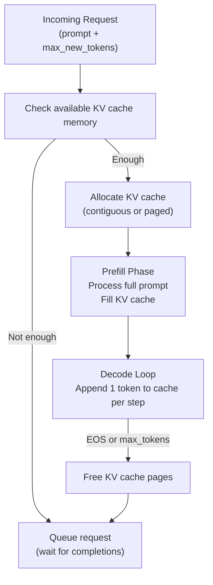

**Continuous Batching (vLLM)**:
- Multiple requests at different decode steps are batched together
- When one request finishes (EOS), its pages are freed immediately
- New requests can start using those freed pages
- GPU utilization: ~70-80% vs ~20% with naive batching

**Quantization of KV Cache (fp8 or int8)**:
- Quantize K and V to 8-bit integers
- Halves KV cache memory
- Slight quality loss (especially for long contexts)
- Used in production by Meta, Microsoft, and others

**Prefix Caching / Prompt Caching**:
- Cache K, V for commonly reused prefixes (system prompts)
- If 1000 users share the same system prompt, compute KV for it once
- 90%+ cache hit rates common for chatbot-style applications

---

## 9. Tradeoffs

| Aspect | KV Cache | No KV Cache |
|---|---|---|
| Decode speed | O(n) per step | O(n²) per step |
| Memory usage | O(n × layers) growing | No extra memory |
| Max batch size | Reduced (cache takes GPU RAM) | Higher |
| Long sequences | Cache can exhaust GPU RAM | Unusable anyway |
| Parallel prefill | Same | Same |

**The Memory-Compute Tradeoff**:
KV cache trades memory for speed. With limited GPU memory, you either:
1. Use quantized KV cache (fp8) → 2× more concurrent users, slight quality drop
2. Use GQA → fewer KV heads → smaller cache → more users
3. Use sliding window attention → fixed cache size → loses long context
4. Use PagedAttention → near-optimal memory utilization

---

## 10. Common Mistakes

- **Not clearing KV cache between requests**: Previous user's context leaks into next user's generation. Security vulnerability AND incorrect outputs.
- **Cache growing unbounded**: For very long conversations, cache can exhaust GPU memory. Implement a sliding window or max-length eviction policy.
- **Incorrect cache indexing**: Off-by-one errors when extending the cache. Token at position `i` must use cache index `i` exactly.
- **Not handling batch size changes**: KV cache is allocated for a specific batch size. Dynamic batching requires careful cache management.
- **Forgetting causal mask alignment**: When using the cache during decode, the attention must be computed correctly — new Q attending to ALL cached K, V, not just the new K, V.

---

## 11. Interview Preparation

**Junior**: "KV cache saves the key and value matrices from all previously processed tokens so we don't recompute them when generating the next token. Without it, each new token would require processing the entire sequence again."

**Senior**: "KV cache reduces decode-phase complexity from O(n²) per step to O(n) total. During prefill, we compute K and V for all prompt tokens and cache them. During decode, we compute Q, K, V for only the new token, append K and V to the cache, and compute attention between the new Q and all cached K, V. Memory cost: O(n × layers × d_model). For LLaMA-2 70B at 4K context, this is ~8.6 GB per request, making the cache the primary serving bottleneck."

**Principal**: "KV cache is the central serving bottleneck for large LLMs. The memory pressure drives all major inference optimizations: (1) GQA/MQA reduces KV head count, shrinking cache proportionally; (2) PagedAttention (vLLM) uses virtual memory-style page tables to eliminate fragmentation, enabling 24× throughput improvement; (3) fp8 KV quantization halves cache size with <0.5% quality loss; (4) prefix caching reuses cached prefixes across requests. The fundamental tension: longer context = more capability but exponentially more KV memory. Production systems set context length limits based on GPU memory and target concurrent user count."

---

## 12. Follow-up Questions (Selected)

**Q: How does KV cache work with beam search?**  
Each beam maintains its own KV cache. For beam width B and sequence length n, cache memory is B× larger. In practice, beam search is rarely used in modern LLMs — sampling (top-p/top-k) is preferred.

**Q: What is a "cache hit" in prefix caching?**  
If a new request starts with a prefix identical to a previously cached request (e.g., the same system prompt), the KV cache for that prefix can be reused directly. No recomputation needed. Dramatically reduces latency for repeated system prompts.

**Q: How does KV cache affect multi-GPU inference?**  
With tensor parallelism, each GPU stores a shard of the KV cache corresponding to the attention heads it manages. No cross-GPU KV communication is needed during decode — the cache is partitioned naturally.

**Q: What is "KV cache compression"?**  
Research techniques that reduce KV cache size beyond quantization:
- **StreamingLLM**: Keep only the first few tokens (attention sinks) and recent tokens. Infinite context with bounded memory.
- **H2O**: Evict KV pairs based on attention score statistics.
- **MagicPruning**: Prune KV entries for tokens that rarely receive attention.

**Q: How does speculative decoding interact with KV cache?**  
Draft model generates K tokens quickly. Verifier model checks them in parallel. If accepted, KV cache advances by K tokens at once. Rejected tokens' KV entries are discarded and regenerated. Cache management gets more complex but the approach still works.

---

## 13. Practical Scenario

**Production Chatbot at Scale**

**Company**: An enterprise AI company deploying a customer support chatbot.  
**Model**: LLaMA-2 70B (8192 tokens context window).  
**Problem**: Serving 1000 concurrent users on 8× A100 80GB GPUs (640 GB total GPU memory).

**Naive approach (no optimization)**:
- Model weights: ~140 GB
- KV cache per user: 8.6 GB × 1000 users = 8.6 TB 
- **Impossible.**

**Optimized approach**:
1. GQA reduces KV heads from 64 to 8 → KV cache: 8× smaller = 1.07 GB per user
2. fp8 quantization → another 2× reduction = 0.54 GB per user
3. Average conversation length: 512 tokens (not 8192) = 0.54 × (512/8192) = 0.034 GB per user
4. 1000 users × 0.034 GB = 34 GB for KV cache
5. Model weights: 35 GB (int4 quantized)
6. Total: 69 GB out of 640 GB available → 9× headroom for batching

With PagedAttention (continuous batching), achieve ~80 requests/second throughput.

**Lessons**:
- GQA is not optional for serving large models — it's a necessity
- Average sequence length matters far more than max sequence length
- PagedAttention's memory utilization improvement is essential for concurrent serving

---

## 14. Revision Sheet

### KV Cache Key Facts
- Stores K and V matrices from all previous tokens
- Grows by 1 entry per generated token per layer
- Reduces decode from O(n²) to O(n) complexity
- Memory cost: `num_layers × 2 × num_kv_heads × d_k × seq_len × dtype_bytes`
- Must be cleared between requests (security + correctness)

### Memory Reduction Techniques
| Technique | Memory Reduction | Quality Impact |
|---|---|---|
| GQA | 4-8× | Minimal |
| MQA | num_heads× | Slight |
| fp8 quantization | 2× | Minimal |
| int4 quantization | 4× | Small |
| Sliding window | Fixed size | Loses long context |
| Prefix caching | Reuse (not reduce) | None |

### Common Traps
- Forgetting to clear cache between users
- Not accounting for KV memory when estimating serving capacity
- Confusing prefill (parallel) with decode (sequential + cache) phases
- Assuming KV cache is small — for large models with long contexts it dominates GPU memory

---

## 15. Hands-on Exercises

**Easy**: Implement a simple KVCache class that stores K, V tensors and has an `update(layer_idx, K_new, V_new)` method. Write a test that verifies the cache grows correctly.

**Medium**: Implement a GPT-style model that uses KV cache during generation. Verify that outputs are identical to a naive (no-cache) implementation.

**Hard**: Implement multi-request batching with a shared KV cache pool. Handle variable-length sequences in the batch with proper masking.

**Production**: Deploy a vLLM-served LLaMA model. Use the vLLM API to control the `max_model_len` and observe how KV cache memory changes. Benchmark throughput vs. number of concurrent requests.

---

## 16. Mini Project

**Build a KV Cache Memory Dashboard**

Create a Python tool that:
1. Takes model config as input (num_layers, d_model, num_heads, context_len, dtype)
2. Simulates serving N concurrent users with varying conversation lengths
3. Tracks KV cache memory per request over time
4. Visualizes which requests are using the most cache
5. Implements a simple eviction policy (evict the request that hasn't generated a new token most recently)
6. Shows maximum theoretical throughput for a given GPU memory budget

This gives you a concrete understanding of the serving economics of KV cache.

---

---

# Final Summary: The Transformer Big Picture

After working through all 13 chapters, here is how everything connects:

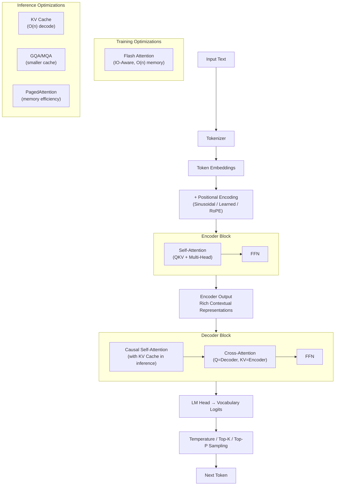

| Architecture | Attention Type | PE | Use Case |
|---|---|---|---|
| BERT | Bidirectional self-attention | Learned | Understanding, classification, embeddings |
| GPT | Causal self-attention | Learned/RoPE | Generation, chat |
| T5 | Encoder bidirectional + Decoder causal + Cross | Relative | Translation, summarization, multi-task |

The Transformer is not one thing — it is a family of architectures built from the same fundamental primitives: QKV attention, multi-head parallelism, residual connections, layer normalization, and feed-forward networks. Mastering these primitives means mastering the entire modern AI landscape.

---

*End of Part 4 — Transformer Architecture*

*Next: Part 5 — Large Language Models*
