# Part 6: Embeddings

> *"An embedding is the most fundamental concept in modern AI. When you understand how a model represents meaning as a point in space, you understand the engine that powers search, recommendations, RAG, and every LLM. Everything in AI engineering leads back to this one idea."*

---

## Table of Contents

- [Chapter 1: Embedding Models](#chapter-1-embedding-models)
- [Chapter 2: Similarity Metrics](#chapter-2-similarity-metrics)
- [Chapter 3: Dense Embeddings](#chapter-3-dense-embeddings)
- [Chapter 4: Sparse Embeddings](#chapter-4-sparse-embeddings)
- [Chapter 5: Hybrid Retrieval](#chapter-5-hybrid-retrieval)

---

# Chapter 1: Embedding Models

---

## 1. Introduction

### What Is an Embedding?

An **embedding** is a dense, fixed-size numerical vector that represents the meaning of something — a word, a sentence, a document, an image, a user, a product — in a high-dimensional geometric space.

The key property: **things with similar meaning are placed close together in this space**.

```
"dog"   → [0.21, -0.45, 0.87, 0.12, ...]   (1536 numbers)
"puppy" → [0.19, -0.41, 0.85, 0.15, ...]   (1536 numbers, very close!)
"cat"   → [0.18, -0.38, 0.80, 0.09, ...]   (nearby, also animal)
"bank"  → [0.55,  0.22, 0.15, 0.77, ...]   (far away, different domain)
```

A computer cannot compare strings like a human. But it CAN compute the distance between two vectors. Embeddings are the bridge: they convert semantic meaning into geometric distance.

### What Problem Does It Solve?

Before embeddings, computer systems could only match text by **exact keyword overlap**. If you searched for "automobile repair," you would miss documents about "car maintenance" — even though they mean the same thing.

Embeddings solve this by placing synonyms, paraphrases, and semantically related concepts near each other in the same geometric space. Now "automobile repair" and "car maintenance" are close vectors, and a similarity search finds both.

### Where Are Embeddings Used?

- **RAG retrieval**: Embed user query → find nearest document chunks
- **Semantic search**: "Show me shoes similar to this photo"
- **Recommendation**: "Users whose taste vector is near yours also liked..."
- **Duplicate detection**: "These two support tickets are about the same issue"
- **Clustering**: "Group these 10,000 news articles by topic"
- **Reranking**: Score how relevant a document is to a query
- **LLM Fine-tuning**: Contrastive learning to adjust model representations

---

## 2. Historical Motivation

### The Bag-of-Words Era (pre-2013)

Before embeddings, the dominant text representation was **Bag of Words (BoW)**: represent a document as a sparse vector where each dimension corresponds to a word in the vocabulary, and the value is the word's count.

For a vocabulary of 100,000 words, every document becomes a vector of 100,000 numbers — almost all of which are zero. This has devastating problems:

1. **No semantic understanding**: "happy" and "joyful" are completely unrelated dimensions.
2. **Dimensionality curse**: Sparse, 100K-dimensional vectors are inefficient to compute with.
3. **No context**: "Apple announced new products" and "The apple fell from the tree" have the same "apple" vector, despite completely different meanings.

### Word2Vec: The First Breakthrough (2013)

Tomas Mikolov at Google published **Word2Vec** in 2013. The insight was revolutionary: **you can learn word meaning from context**.

The model was trained to predict: *"Given the words surrounding a word, what is the word?"* (CBOW model) or *"Given a word, what words surround it?"* (Skip-gram).

After training on billions of sentences, the model learned:
- "king" - "man" + "woman" ≈ "queen" (vector arithmetic!)
- Words in similar contexts get similar vectors
- The vectors are only 300 dimensions — dense and computable

This was the birth of the modern embedding era.

### From Words to Sentences: GloVe, FastText, ELMo (2013–2018)

Word2Vec had a fatal flaw: one word, one vector. The word "bank" always had the same vector regardless of whether it meant a financial institution or a river bank.

**ELMo (2018)** introduced **contextual embeddings**: the vector for a word changes depending on the surrounding sentence. This was a transformer before transformers.

### The Transformer Revolution: BERT and Beyond (2018–present)

**BERT (2018)** used the full transformer encoder architecture and was trained on masked language modeling. Its representations were far richer than anything before. However, BERT was designed for classification, not for computing sentence similarity directly.

**Sentence-BERT (2019)** fine-tuned BERT using **Siamese networks** to produce semantically meaningful sentence embeddings — making it practical for semantic search.

**OpenAI's text-embedding-ada-002 (2022)** and **text-embedding-3-small/large (2024)** brought powerful general-purpose embeddings as a managed API, making high-quality embeddings accessible without training your own models.

Today's best embedding models (BGE, E5, GTE, Cohere Embed) achieve remarkable performance by training on billions of (query, document, label) triplets using contrastive learning.

---

## 3. Real-World Analogy

### The Library Map

Imagine a vast library with millions of books. Instead of organizing by alphabetical title, a brilliant librarian organizes the *entire library by meaning*.

Physics books are in the northeast corner. History books are in the southwest. Near the physics section, you find engineering books. Near engineering, you find mathematics. There are no clear borders — proximity means similarity.

An **embedding** is like the (x, y, z) GPS coordinate of a book in this 3D meaning-space. Except instead of 3 dimensions, we have 1536 dimensions. And instead of a physical location, it represents the semantic content of the book.

When you walk into the library and ask: "I'm interested in stellar nucleosynthesis," the librarian converts your question into coordinates and walks you directly to the corner where books with the nearest coordinates are stored — nuclear astrophysics, cosmochemistry, particle physics.

The librarian doesn't read every book to find yours. They just compute distances between your coordinate and every book's coordinate. The closest ones are your answer.

---

## 4. Visual Mental Model

### Embedding Space Visualization

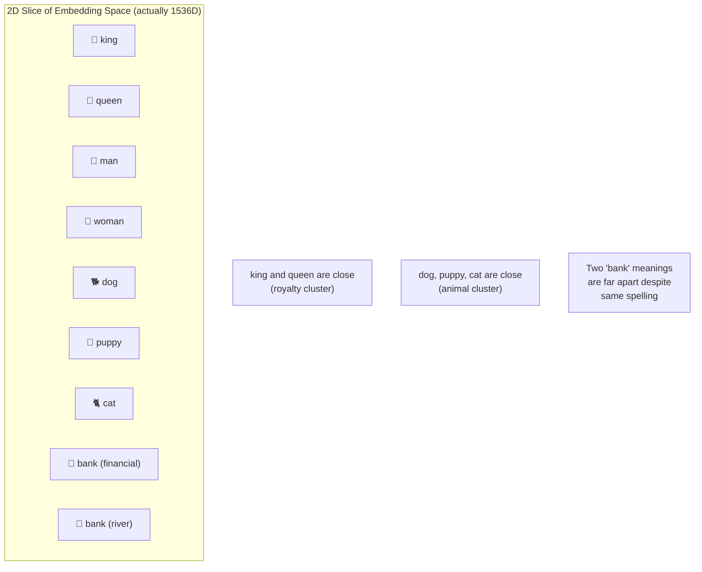

### How an Embedding Model Produces a Vector

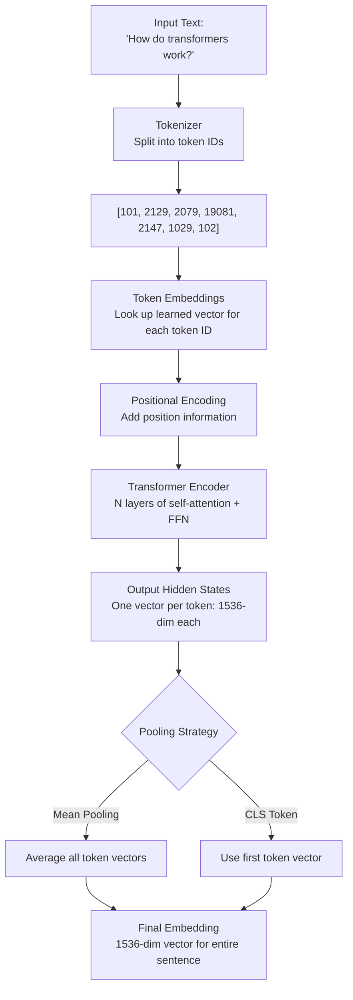

### The Embedding Pipeline in a RAG System

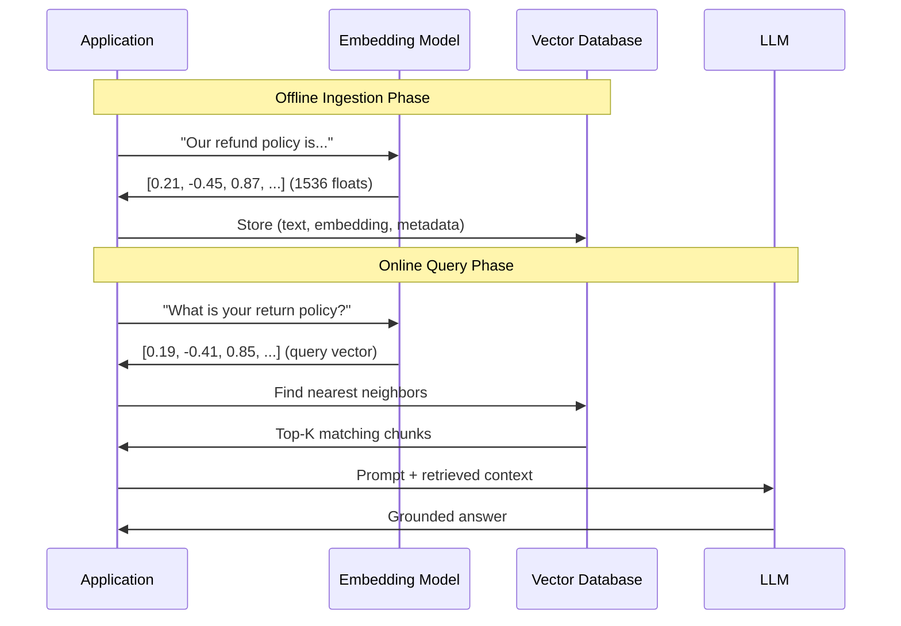

---

## 5. Internal Working

### How Embedding Models Are Trained: Contrastive Learning

You cannot hand-label which sentences are semantically similar. The training data comes from two main sources:

1. **Supervised pairs**: Natural Language Inference (NLI) datasets where human annotators labeled pairs as Entailment (similar), Contradiction (dissimilar), or Neutral.

2. **Weak supervision**: Pairs mined from the web — (question, FAQ answer), (anchor text, linked article), (search query, clicked result).

The training objective is **Contrastive Loss** — specifically, **Multiple Negatives Ranking Loss**:

For a batch of (anchor, positive) pairs:
- The positive pair should have a HIGH similarity score.
- Every *other* positive in the batch serves as a *hard negative*.
- The loss pushes positives together and negatives apart.

```mermaid
flowchart TD
    subgraph "Contrastive Training Step"
        A["Anchor:\n'What is the return policy?'"] --> EM1[Encoder]
        B["Positive:\n'Our return policy is 30 days'"] --> EM2[Encoder]
        C["Negative:\n'We offer free shipping'"] --> EM3[Encoder]
        
        EM1 --> VA[Vector A]
        EM2 --> VP[Vector P]
        EM3 --> VN[Vector N]
        
        VA --> LOSS[Loss]
        VP --> LOSS
        VN --> LOSS
        
        LOSS --> |Push CLOSE| PAIR1[sim(A, P) → 1.0]
        LOSS --> |Push APART| PAIR2[sim(A, N) → 0.0]
    end
```

### Step-by-Step: OpenAI Embedding API

```
1. User provides text: "What is machine learning?"
2. Text is tokenized into token IDs (BPE tokenization)
3. Token IDs passed through the transformer model (GPT-based encoder)
4. The model produces hidden states for each token position
5. Mean pooling: average all token hidden states into one vector
6. L2 normalization: divide by vector magnitude so ||v|| = 1
7. Return 1536-float vector (text-embedding-3-small) or 3072-float (text-embedding-3-large)
```

The L2 normalization is critical: it means cosine similarity and dot product become mathematically equivalent, and vectors lie on the surface of a unit hypersphere.

---

## 6. Mathematical Intuition

### What a Vector Represents

A 1536-dimensional vector is a point in $\mathbb{R}^{1536}$. Each dimension does not correspond to a human-interpretable feature. Instead, the dimensions collectively encode meaning through their *relationship* to other vectors.

The actual learning: during training, the transformer adjusts its weights so that similar texts produce similar activation patterns in its final layers. These activation patterns are the embeddings.

### The Embedding Projection: Matryoshka Representation Learning (MRL)

OpenAI's `text-embedding-3` models use **Matryoshka Representation Learning**. The model is trained so that the first $d$ dimensions of a 1536-dimensional vector are still a meaningful embedding.

This means you can truncate:
- Full 1536-dim: maximum accuracy
- 512-dim: good accuracy, 3× less memory and compute
- 256-dim: decent accuracy, 6× less memory

```
Full vector:   [v₁, v₂, v₃, ..., v₁₅₃₆]
Truncated 256: [v₁, v₂, v₃, ..., v₂₅₆]  ← still meaningful!
```

This is done by training with a loss that simultaneously optimizes all prefix dimensions.

### Why Normalized Vectors?

After L2 normalization, every vector satisfies $||\mathbf{v}||_2 = 1$.

The dot product of two normalized vectors equals their cosine similarity:
$$\mathbf{a} \cdot \mathbf{b} = ||\mathbf{a}|| \cdot ||\mathbf{b}|| \cdot \cos(\theta) = 1 \cdot 1 \cdot \cos(\theta) = \cos(\theta)$$

This is important because:
1. Vector databases can use fast inner product (BLAS operations) instead of computing norms
2. HNSW and IVF indexes are optimized for dot product search
3. You don't need to normalize at query time separately

---

## 7. Implementation

### Production Embedding Service

```python
"""
Production-grade embedding service with:
- Async batch processing
- Rate limiting and retry logic
- Caching for repeated texts
- Support for multiple embedding providers
- Type-safe Pydantic models
"""

import asyncio
import hashlib
import json
import logging
from enum import Enum
from functools import lru_cache
from typing import List, Optional

import numpy as np
from openai import AsyncOpenAI
from pydantic import BaseModel, Field
from tenacity import retry, stop_after_attempt, wait_exponential

logger = logging.getLogger(__name__)


class EmbeddingModel(str, Enum):
    """Supported embedding models."""
    OPENAI_SMALL = "text-embedding-3-small"      # 1536-dim, fast, cheap
    OPENAI_LARGE = "text-embedding-3-large"      # 3072-dim, highest quality
    OPENAI_ADA   = "text-embedding-ada-002"      # 1536-dim, legacy, still reliable


class EmbeddingConfig(BaseModel):
    """Configuration for the embedding service."""
    model: EmbeddingModel = EmbeddingModel.OPENAI_SMALL
    dimensions: Optional[int] = None  # For MRL truncation (None = full)
    batch_size: int = Field(default=512, ge=1, le=2048)
    normalize: bool = True            # L2 normalize output


class EmbeddingResult(BaseModel):
    """Result of an embedding operation."""
    embeddings: List[List[float]]
    model: str
    total_tokens: int
    dimensions: int


class EmbeddingService:
    """
    Production-ready embedding service.
    
    Features:
    - Automatic batching to respect API limits
    - Retry with exponential backoff
    - SHA-256 content hashing for cache keys
    - Async-native for high concurrency
    """

    def __init__(self, config: EmbeddingConfig):
        self.config = config
        self.client = AsyncOpenAI()
        self._cache: dict[str, List[float]] = {}

    def _cache_key(self, text: str) -> str:
        """Deterministic cache key from text content."""
        return hashlib.sha256(text.encode()).hexdigest()

    @retry(
        stop=stop_after_attempt(3),
        wait=wait_exponential(multiplier=1, min=2, max=10)
    )
    async def _call_api(self, texts: List[str]) -> EmbeddingResult:
        """Direct API call with retry logic."""
        kwargs = {
            "input": texts,
            "model": self.config.model.value,
        }
        # MRL truncation: only supported by text-embedding-3 models
        if self.config.dimensions and "3" in self.config.model.value:
            kwargs["dimensions"] = self.config.dimensions

        response = await self.client.embeddings.create(**kwargs)

        embeddings = [
            item.embedding
            for item in sorted(response.data, key=lambda x: x.index)
        ]

        if self.config.normalize:
            embeddings = self._normalize_batch(embeddings)

        return EmbeddingResult(
            embeddings=embeddings,
            model=response.model,
            total_tokens=response.usage.total_tokens,
            dimensions=len(embeddings[0]) if embeddings else 0,
        )

    def _normalize_batch(self, embeddings: List[List[float]]) -> List[List[float]]:
        """L2-normalize a batch of embeddings."""
        arr = np.array(embeddings, dtype=np.float32)
        norms = np.linalg.norm(arr, axis=1, keepdims=True)
        # Avoid division by zero for zero vectors
        norms = np.where(norms == 0, 1.0, norms)
        normalized = arr / norms
        return normalized.tolist()

    async def embed(self, texts: List[str]) -> List[List[float]]:
        """
        Embed a list of texts, using cache for repeated content.
        Automatically batches large inputs.
        """
        if not texts:
            return []

        # Check cache first
        results: dict[int, List[float]] = {}
        uncached_indices: List[int] = []
        uncached_texts: List[str] = []

        for i, text in enumerate(texts):
            key = self._cache_key(text)
            if key in self._cache:
                results[i] = self._cache[key]
            else:
                uncached_indices.append(i)
                uncached_texts.append(text)

        # Batch API calls for uncached texts
        if uncached_texts:
            all_new_embeddings: List[List[float]] = []

            for start in range(0, len(uncached_texts), self.config.batch_size):
                batch = uncached_texts[start : start + self.config.batch_size]
                logger.debug(f"Embedding batch of {len(batch)} texts")
                result = await self._call_api(batch)
                all_new_embeddings.extend(result.embeddings)

            # Store in cache and results
            for original_idx, embedding in zip(uncached_indices, all_new_embeddings):
                key = self._cache_key(texts[original_idx])
                self._cache[key] = embedding
                results[original_idx] = embedding

        # Return in original order
        return [results[i] for i in range(len(texts))]

    async def embed_single(self, text: str) -> List[float]:
        """Convenience wrapper for a single text."""
        embeddings = await self.embed([text])
        return embeddings[0]


# ─── Sentence Transformers (Local, No API Cost) ─────────────────────────────

class LocalEmbeddingService:
    """
    Local embedding service using sentence-transformers.
    
    Advantages: No API cost, no latency for network, full privacy.
    Use: BGE-M3, E5-large, all-mpnet-base-v2.
    
    Ideal for: Private data, high-throughput offline ingestion.
    """

    def __init__(self, model_name: str = "BAAI/bge-m3"):
        from sentence_transformers import SentenceTransformer
        self.model = SentenceTransformer(model_name)
        self.model_name = model_name

    def embed(self, texts: List[str], batch_size: int = 64) -> np.ndarray:
        """
        Embed texts locally. Returns (N, D) float32 array.
        BGE-M3 is a multilingual model supporting dense, sparse, and
        multi-vector (ColBERT-style) retrieval from the same model.
        """
        embeddings = self.model.encode(
            texts,
            batch_size=batch_size,
            normalize_embeddings=True,  # L2 normalize
            show_progress_bar=len(texts) > 100,
        )
        return embeddings.astype(np.float32)

    def embed_single(self, text: str) -> np.ndarray:
        return self.embed([text])[0]


# ─── Embedding Fine-tuning Prep ─────────────────────────────────────────────

class ContrastiveTrainingDataPreparer:
    """
    Prepares (anchor, positive, negative) training triplets for
    fine-tuning an embedding model on domain-specific data.
    
    Use case: You have a company Q&A corpus.
    Fine-tuning the embedding model on (Question, Answer) pairs
    dramatically improves RAG retrieval for your specific domain.
    """

    def __init__(self, embedding_service: LocalEmbeddingService):
        self.service = embedding_service

    def mine_hard_negatives(
        self,
        anchors: List[str],
        positives: List[str],
        corpus: List[str],
        top_k: int = 10,
    ) -> List[dict]:
        """
        Mine hard negatives: documents that are SEMANTICALLY CLOSE to the
        anchor but are NOT the correct positive.
        
        Hard negatives force the model to learn subtle distinctions,
        resulting in much better embeddings than random negatives.
        """
        from sklearn.metrics.pairwise import cosine_similarity

        anchor_embs   = self.service.embed(anchors)     # (N, D)
        positive_embs = self.service.embed(positives)   # (N, D)
        corpus_embs   = self.service.embed(corpus)      # (M, D)

        triplets = []
        sim_matrix = cosine_similarity(anchor_embs, corpus_embs)  # (N, M)

        for i, (anchor, positive) in enumerate(zip(anchors, positives)):
            sims = sim_matrix[i]
            # Get top-K most similar corpus docs (excluding the true positive)
            top_k_indices = np.argsort(sims)[-top_k - 1 :][::-1]

            for idx in top_k_indices:
                candidate = corpus[idx]
                if candidate == positive:
                    continue  # Skip the actual positive
                triplets.append({
                    "anchor":   anchor,
                    "positive": positive,
                    "negative": candidate,  # Hard negative!
                    "neg_sim":  float(sims[idx]),
                })
                break

        return triplets
```

---

## 8. Production Architecture

### Embedding Infrastructure for Enterprise RAG

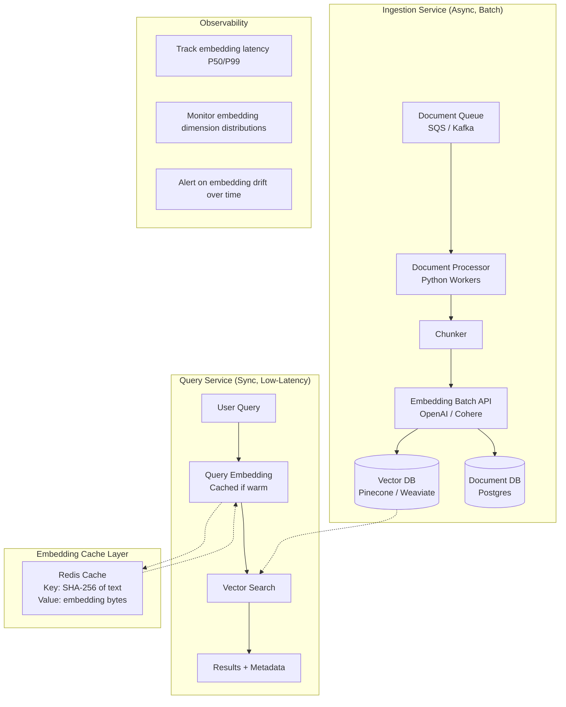

### Cost and Latency Reference (OpenAI, mid-2024)

| Model | Dimensions | Cost (per 1M tokens) | Relative Quality | Best For |
|---|---|---|---|---|
| text-embedding-3-small | 1536 | $0.02 | Strong | Production RAG, high volume |
| text-embedding-3-large | 3072 | $0.13 | State-of-the-art | Highest-stakes retrieval |
| text-embedding-ada-002 | 1536 | $0.10 | Good | Legacy systems |
| BGE-M3 (local) | 1024 | $0 (compute) | SOTA | Private data, offline |

---

## 9. Tradeoffs

| Consideration | API Embeddings (OpenAI) | Local Embeddings (BGE, E5) |
|---|---|---|
| Quality | Very high | Comparable, domain-tunable |
| Latency | ~100ms (network) | ~5-50ms (GPU/CPU) |
| Cost | $0.02-$0.13 per 1M tokens | Infrastructure cost |
| Privacy | Data leaves your premises | Fully private |
| Fine-tuning | Not supported | Fully supported |
| Maintenance | None | Model updates needed |
| Multilingual | Strong | BGE-M3 is industry-best |

**When NOT to use API embeddings**:
- Regulated industries (healthcare, finance) with strict data residency
- Very high throughput (>10M docs/day) where compute cost beats API cost
- When you need domain-specific fine-tuning

---

## 10. Common Mistakes

❌ **Using different embedding models for ingestion and query**: If you embed documents with `text-embedding-3-small` and embed queries with `text-embedding-ada-002`, the resulting vectors live in completely different geometric spaces. Cosine similarity between them is meaningless. Always use the same model and same dimension for both.

❌ **Not L2-normalizing embeddings before cosine search**: Some vector databases expect normalized vectors. If you store un-normalized vectors but use cosine similarity, distances can be dominated by vector magnitude rather than direction (semantic content).

❌ **Embedding excessively long chunks**: OpenAI's embedding models have an 8192 token limit. Beyond that, text is truncated. More importantly, very long chunks produce "diluted" embeddings that are poor at exact retrieval. Keep chunks under 512 tokens for best retrieval performance.

❌ **Assuming embeddings capture exact factual knowledge**: An embedding captures semantic similarity, not factual precision. "The CEO is John Smith" and "The CEO is Jane Doe" will have nearly identical embeddings — both talk about "the CEO." Embeddings cannot distinguish these two facts. Use metadata filtering for exact factual queries.

❌ **Not versioning your embedding model**: When you upgrade from `text-embedding-ada-002` to `text-embedding-3-small`, all existing vectors in your database must be regenerated. Storing the model name and version as metadata alongside every embedding is mandatory for production systems.

---

## 11. Interview Preparation

**Junior**: "An embedding is a numerical vector that represents the meaning of text. Similar texts have similar vectors. We use them to find semantically relevant documents in a vector database. OpenAI provides embedding APIs that convert text into 1536-dimensional vectors."

**Mid-level**: "Embeddings are trained using contrastive learning — the model is trained to produce similar vectors for semantically similar texts and different vectors for dissimilar texts. The key training objective is Multiple Negatives Ranking Loss. In production RAG, I embed both documents at ingestion and queries at runtime using the same model. I L2-normalize all vectors, which makes cosine similarity equivalent to dot product for efficient BLAS computation. I use text-embedding-3-small for cost efficiency and cache query embeddings in Redis."

**Senior**: "The quality of embeddings sets the ceiling for all downstream RAG performance. I evaluate embedding models on my domain-specific data using MTEB benchmark tasks similar to my use case. For enterprise RAG, I often fine-tune a base embedding model on (query, positive_document) pairs mined from user click logs or LLM-judged relevance — this 10-30% domain-specific fine-tuning typically improves NDCG@10 by 15-20% compared to off-the-shelf models. I implement Matryoshka embeddings where possible, allowing dimension reduction from 1536 to 512 for ANN index to cut storage and search latency by 3× with minimal quality loss."

**Staff Engineer**: "At scale, embedding infrastructure has two separate optimization problems: ingestion throughput and query latency. For ingestion, I maximize GPU utilization through large batch sizes (512-1024 texts per batch), async job queues, and horizontal scaling. For queries, the critical path is TTFT (Time to First Token). I aggressively cache embeddings for known queries using semantic deduplication — if two queries have cosine similarity > 0.98, serve the cached result. For the embedding model itself, I maintain a governance process: model upgrades require A/B testing on held-out retrieval benchmarks before any production vector DB reindexing, which for 50M+ document corpora is a significant operational event."

**Principal Engineer**: "Embeddings are ultimately a compression of information into a fixed-size representation that preserves task-relevant structure. The choice of embedding model and dimensionality is a point in a cost-quality Pareto curve. At Google/Meta scale, you might train custom embedding models on proprietary data with billions of parameters — the public OpenAI/Cohere models are distillations of those. The key architectural insight is that embeddings are not a solved problem: they fail for (1) exact fact retrieval — use sparse search for that; (2) complex multi-hop reasoning — use LLMs in the loop; (3) modality mismatch — use separate domain-specific models. I architect systems with multiple embedding spaces: one for semantic search, one for code, one for tables, with a routing layer that determines which space to query."

---

## 12. Follow-up Questions

**Q1: What is the difference between word embeddings and sentence embeddings?**
> Word embeddings (Word2Vec, GloVe) produce one vector per word, static across all contexts. "Bank" always has the same vector regardless of financial vs. river meaning. Sentence embeddings (BERT, Sentence-BERT) are contextual — every word's representation is influenced by its surrounding words. Additionally, sentence embeddings aggregate all token representations into one fixed-size vector for the entire sentence, enabling sentence-level similarity comparison.

**Q2: Why do transformers produce better embeddings than Word2Vec?**
> Three fundamental improvements: (1) Context-sensitivity: transformers compute attention over all surrounding tokens, so "bank" in "bank account" and "bank of a river" produce different vectors; (2) Bidirectionality: BERT-style encoders attend to both past and future context; (3) Pretraining scale: transformers are trained on vastly more data with richer objectives (masked language modeling, next sentence prediction). Word2Vec was trained with a shallow, single-layer model.

**Q3: What is MTEB and why does it matter for choosing an embedding model?**
> MTEB (Massive Text Embedding Benchmark) is the standard evaluation suite for embedding models, covering 56 datasets across 8 task types: Classification, Clustering, Pair Classification, Reranking, Retrieval, STS (Semantic Textual Similarity), Summarization, and Bitext Mining. When choosing an embedding model, you should look at the MTEB retrieval subset (BEIR benchmark) as it is most relevant to RAG use cases. The MTEB leaderboard at huggingface.co/spaces/mteb/leaderboard is the definitive source.

**Q4: What is the "embedding space drift" problem in production?**
> Over time, the language and concepts in your documents may drift — new product names, new jargon, new topics. But your embedding model was fixed at training time. Documents about new concepts get embeddings in "empty" regions of the space, and retrieval degrades. Solution: (1) Periodic model re-evaluation using a held-out retrieval benchmark; (2) Monitor retrieval quality metrics (MRR, NDCG) on a fixed test set monthly; (3) When drift is detected, reindex all documents with an updated model. This is called embedding model rotation.

**Q5: Explain Matryoshka Representation Learning (MRL).**
> MRL (Kusupati et al., 2022) trains a model with a loss function that simultaneously optimizes all prefix dimensions of the embedding. For a 1536-dim model, the training loss ensures that the first 64 dimensions are a good embedding, the first 128 are better, ..., and all 1536 are best. This allows trading off embedding quality for storage and compute at inference time by simply truncating the vector. OpenAI's text-embedding-3 models implement MRL — you can pass `dimensions=512` to get a 512-dim embedding that is nearly as good as the full 1536-dim version.

**Q6: How do you measure the quality of your embedding model for a specific domain?**
> Create a domain-specific evaluation set: sample 100-300 real user queries, and for each query manually label which documents in your corpus are relevant (ground truth). Then compute NDCG@10 and MRR. Run this evaluation for the embedding models you're comparing. This beats using public benchmarks because your data distribution is always different from benchmark data.

**Q7: What are "instruction-following" embedding models?**
> Models like E5 (Microsoft) and GTE (Alibaba) support prepending an instruction to the query, e.g., `"Represent this sentence for searching relevant passages: What is RAG?"`. The instruction tells the model what kind of embedding to produce. For retrieval, you prepend one instruction to queries and a different instruction to documents, nudging the model to optimize for asymmetric query-document matching rather than symmetric sentence similarity.

**Q8: What is the difference between asymmetric and symmetric embedding?**
> Symmetric: The query and the documents are the same type (e.g., sentence-to-sentence similarity: "How are you?" vs "How are you doing?"). Use for duplicate detection, paraphrase mining. Asymmetric: The query is a short question, and the document is a long passage with the answer. The model must bridge the modality gap between a question and a statement. Most RAG use cases are asymmetric, which is why query instructions ("Represent this question for passage retrieval: ...") improve performance.

**Q9: What is cross-modal embedding and when is it used?**
> Cross-modal embeddings map different data types (text, images, audio) into the SAME vector space, enabling cross-modal similarity search. CLIP (OpenAI) embeds both images and text into a shared space, so "a dog running in a park" (text) is near photos of dogs in parks (images). This powers multimodal RAG: users can query with text to find relevant images, or query with images to find relevant text documents.

**Q10: What is the "position of the document in the corpus" problem?**
> Some embedding models confuse the frequency with which a phrase appears in training data with its semantic importance. Very common phrases in the training corpus (e.g., "terms and conditions") might cluster tightly regardless of the actual document's content. Solution: instruction-tuned embeddings, or fine-tuning on your domain where you deliberately include rare but important domain-specific concepts.

**Q11: How do you handle multilingual embeddings?**
> Options: (1) Translate all documents to English first, then use an English embedding model — simple but expensive and loses nuance; (2) Use a multilingual model (BGE-M3 supports 100+ languages, mE5, multilingual-e5-large) — more complex but avoids translation; (3) Use language-specific models — best quality per language but more models to manage. BGE-M3 is the current state-of-the-art for multilingual RAG.

**Q12: What is the "anisotropy" problem in embeddings?**
> Research (Ethayarajh, 2019) found that many embedding models produce vectors that are highly anisotropic — they all cluster in a narrow cone of the high-dimensional space rather than being uniformly distributed. This means cosine similarity between random pairs is very high (0.8+), degrading the discriminability of the similarity score. Sentence-BERT and most modern models address this with whitening or contrastive objectives that explicitly spread embeddings across the space.

**Q13: How do code embeddings differ from text embeddings?**
> Code embedding models (CodeBERT, UniXCoder, voyage-code-2 from Voyage AI) are trained on code-specific data (GitHub repositories) and understand programming language syntax, semantics, and cross-language equivalence. A general text embedding model will fail to recognize that a Python `for` loop and a Java `for` loop are semantically equivalent. For code search in engineering assistants, always use code-specific embedding models.

**Q14: What happens when your embedding model's max token length is exceeded?**
> OpenAI's models silently truncate input to 8192 tokens. The resulting embedding represents only the first 8192 tokens of the document, ignoring the rest. This means the vector may miss key information from the later parts of a long document. Solution: (1) Always chunk documents to be well under the limit before embedding; (2) Use late chunking — embed the full document using a long-context model, then use token-level embeddings for the chunks (ColBERT style).

**Q15: What is ColBERT and how does it differ from standard bi-encoders?**
> ColBERT (Contextual Late Interaction BERT) produces a vector for every token in the query and document separately (like a bi-encoder), but computes similarity through MaxSim: for each query token, find its maximum cosine similarity with any document token, then sum these max-similarities. This provides bi-encoder speed at indexing but cross-encoder-like interaction at query time. BGE-M3's multi-vector mode implements ColBERT-style retrieval.

**Q16: How do you fine-tune an embedding model on domain data?**
> The standard approach: (1) Collect (query, positive_document) pairs from your domain — from user click logs, LLM-judged relevance, or expert labels; (2) Mine hard negatives — use the current embedding model to find semantically similar but incorrect documents; (3) Fine-tune with Multiple Negatives Ranking Loss using sentence-transformers library; (4) Evaluate on your held-out retrieval benchmark before deploying. Training for 1-3 epochs on 10K-100K pairs typically yields significant improvement.

**Q17: What is binary quantization of embeddings?**
> Instead of storing each embedding dimension as a float32 (4 bytes), binary quantization converts each dimension to a single bit based on its sign (+1 or -1). A 1536-dim float32 embedding takes 6KB; binary-quantized, it takes 192 bytes — a 32× compression. Hamming distance (XOR + popcount) can be computed extremely fast on CPU. OpenAI's text-embedding-3 models are specifically trained to be robust to binary quantization, maintaining ~95% of retrieval quality at 1/32 the storage.

**Q18: Explain the "lost in the middle" problem for embeddings.**
> This is distinct from the LLM context problem. In embedding space: if a document chunk contains information from multiple topics (beginning, middle, end), the embedding vector represents the average meaning of all those topics. A query about any one specific topic will have a lower similarity score than if the chunk had only been about that topic. This is why smaller, focused chunks (100-200 tokens) often outperform large chunks (1000+ tokens) for retrieval, despite giving less context per retrieved document.

**Q19: What is the embedding cache invalidation strategy for production systems?**
> Document embeddings: invalidate on document content change (use content hash as cache key — if hash changes, re-embed). Query embeddings: TTL-based (5-15 minutes, as the same user may rephrase within a session). Model version changes: invalidate all embeddings — store embedding model name + version as metadata alongside every stored vector; on model upgrade, trigger async re-indexing jobs. Monitor cache hit rates — if below 40%, increase TTL or pre-compute embeddings for common queries.

**Q20: How do you debug poor retrieval results?**
> Systematic debugging process: (1) Inspect the raw cosine scores — are scores uniformly low (poor model/domain fit) or clustered high (anisotropy)? (2) Visualize embeddings with UMAP — do query and document embeddings cluster separately (bad) or interleave (good)? (3) Check chunk quality — is your chunker producing coherent chunks? (4) Compute on your evaluation set: NDCG@10, MRR — localize whether failures are at specific query types; (5) Check if BM25 finds the right document but dense search misses it — if so, you need a keyword match fix (sparse retrieval or hybrid). Fixing retrieval almost always has more impact than upgrading the LLM.

---

## 13. Practical Scenario

### Scenario: E-commerce Semantic Product Search

**Context**: A large e-commerce company has 5 million product listings. Their existing keyword search (Elasticsearch) fails when a user searches "comfortable walking shoes for seniors" — missing products described as "orthopedic footwear for elderly" despite perfect relevance.

**Architecture**:

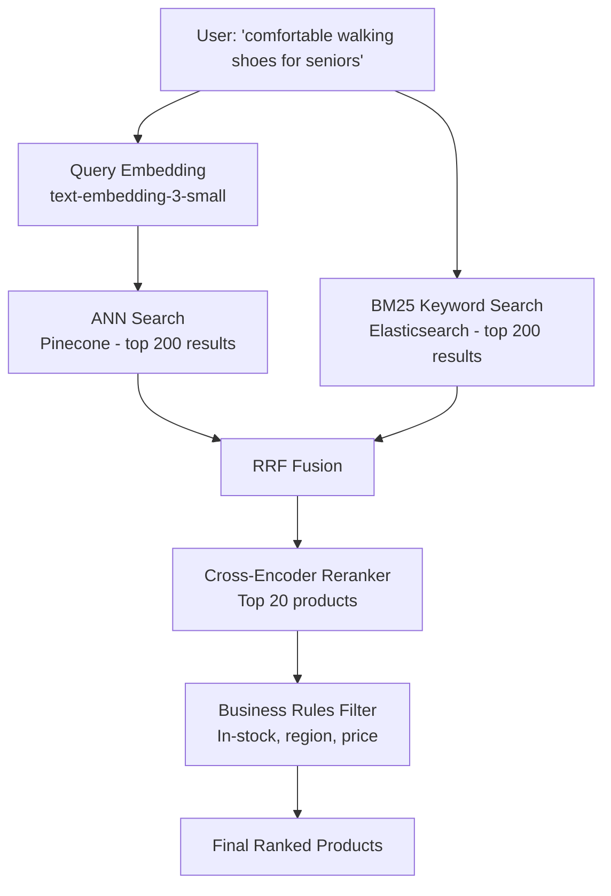

**What Changed**:
1. Each product title + description + key attributes embedded with `text-embedding-3-small`
2. Embeddings stored in Pinecone alongside product metadata
3. Query time: embed user query, search Pinecone for top 200, combine with Elasticsearch BM25 top 200 via RRF
4. Re-rank top 50 with cross-encoder model fine-tuned on product click data

**Results**:
- Conversion rate increased 23% for long-tail queries
- "Zero result" searches dropped from 8% to 0.3%
- P50 search latency: 180ms (acceptable), P99: 420ms

**Lessons Learned**:
- Product attribute embeddings (brand + category + material) embedded separately from description improved attribute-based search by 18%
- Seasonal query drift required quarterly re-indexing with refreshed product embeddings
- Category-specific fine-tuning of the embedding model (shoes corpus) outperformed general model by 15% NDCG

---

## 14. Revision Sheet

### Key Points
- **Embedding**: Dense vector representing semantic meaning; similar meaning = close vectors
- **Training**: Contrastive learning with (anchor, positive, hard_negative) triplets
- **Normalization**: L2 normalize all vectors; cosine similarity = dot product for unit vectors
- **MRL**: Matryoshka embeddings allow truncation — first D dimensions are still meaningful
- **Model choice**: Same model must be used for ingestion and query
- **Cache**: Cache by SHA-256 of text content; invalidate on model version upgrade
- **Evaluation**: Build domain-specific test set; measure NDCG@10, MRR

### Key Formulas
```
L2 Norm:           ||v|| = √(v₁² + v₂² + ... + vₙ²)
Cosine Similarity: cos(a, b) = (a · b) / (||a|| × ||b||)
Normalized vectors: cos(a, b) = a · b  (since ||a|| = ||b|| = 1)
```

### Common Traps
- "I'll use different models for documents and queries" → Completely breaks retrieval
- "Larger chunk = better context in embedding" → Larger chunks = diluted vectors = poor retrieval
- "Embeddings store facts precisely" → They capture semantics, not exact facts
- "One embedding model fits all tasks" → Code, multilingual, asymmetric need specialized models

---

## 15. Hands-on Exercises

**Easy**: Use the OpenAI embeddings API to embed 10 sentences. Compute cosine similarity between all pairs. Verify that semantically similar sentences have high scores.

**Medium**: Build a simple semantic search engine over 1000 Wikipedia paragraphs. Embed all paragraphs, store in a NumPy array, and implement cosine similarity search. Compare results with BM25 keyword search.

**Hard**: Fine-tune a sentence-transformers model on a domain-specific dataset using the MultipleNegativesRankingLoss. Evaluate before and after fine-tuning using a held-out test set.

**Production**: Build an embedding service as a FastAPI microservice with Redis caching, health checks, and Prometheus metrics for latency and cache hit rate.

---

## 16. Mini Project: Domain-Specific Embedding Fine-tuner

Build a pipeline that:
1. Takes a directory of domain-specific PDFs
2. Parses and chunks them
3. Uses an LLM to generate 200 synthetic (question, answer_chunk) pairs
4. Fine-tunes `BAAI/bge-base-en-v1.5` on these pairs using sentence-transformers
5. Evaluates fine-tuned model vs. base model on a 50-question held-out test
6. Exports the fine-tuned model for use in a RAG pipeline

---

---

# Chapter 2: Similarity Metrics

---

## 1. Introduction

### What Is a Similarity Metric?

Once you have embeddings — vectors in high-dimensional space — you need a way to measure how "close" two vectors are. This measurement is a **similarity metric** or **distance metric**.

The choice of similarity metric fundamentally affects which documents get retrieved. Two vectors that seem close under one metric may seem far under another.

For AI engineers, understanding similarity metrics means:
- Knowing why your vector database uses inner product instead of Euclidean distance
- Understanding why you must L2-normalize vectors before cosine search
- Knowing which metric to choose for different types of embeddings

---

## 2. Historical Motivation

In traditional Information Retrieval, text matching was done with exact string comparison or TF-IDF scores. When distributed representations (embeddings) arrived, engineers needed a way to compare these floating-point vectors.

The earliest instinct was Euclidean distance — borrowed from classical geometry. But embeddings from deep neural networks have a crucial property: their *direction* (the angle between vectors) encodes meaning, while their *magnitude* (vector length) often reflects superficial properties like document length.

This led to the dominance of **cosine similarity**: ignore magnitude, measure only the angle between vectors. For normalized vectors, this became equivalent to dot product — cheap and fast.

---

## 3. Real-World Analogy

Imagine you're at an airport, and you're trying to find passengers heading to the same destination as you.

**Euclidean Distance**: Measures the straight-line distance between two people's physical positions in the terminal. But a person at Gate A5 heading to Tokyo and a person at Gate A6 heading to New York are close in Euclidean distance but completely different destinations. Physical position ≠ destination.

**Cosine Similarity**: Measures the *direction* each person is walking. You and another passenger walking in exactly the same direction are going to the same gate — regardless of where you started. This is semantic similarity: same direction = same meaning, regardless of vector magnitude.

**Dot Product**: Multiply the direction alignment by how strongly each person is walking (magnitude). A person striding confidently toward Tokyo "agrees more" with you than someone ambling in the same direction. This makes dot product sensitive to both direction and confidence.

---

## 4. Visual Mental Model

### Comparing Metrics in 2D Space

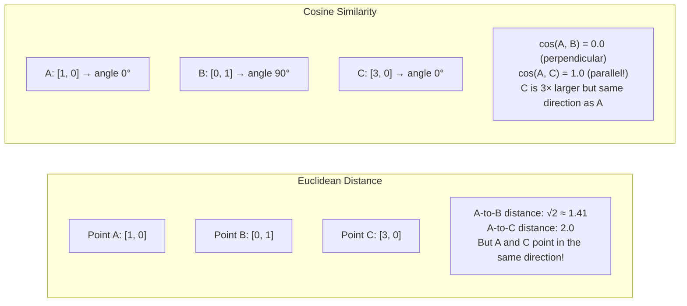

### When to Use Which Metric

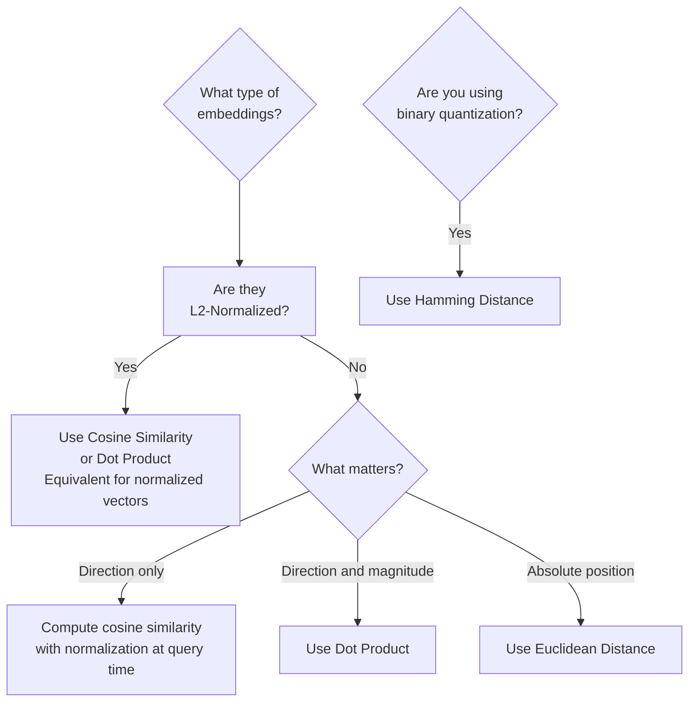

---

## 5. Internal Working

### The Three Primary Metrics

#### 1. Cosine Similarity
Measures the **cosine of the angle** between two vectors.

$$\text{cosine\_sim}(\mathbf{a}, \mathbf{b}) = \frac{\mathbf{a} \cdot \mathbf{b}}{||\mathbf{a}|| \cdot ||\mathbf{b}||}$$

- **Range**: -1 to 1 (for embeddings: typically 0 to 1 since they are non-negative after training)
- **Interpretation**: 1 = identical direction (semantically identical), 0 = perpendicular (unrelated), -1 = opposite direction (polar opposites)
- **Invariant to**: Vector magnitude (document length, repetition frequency)

#### 2. Dot Product (Inner Product)
The raw **sum of element-wise products** of two vectors.

$$\text{dot\_product}(\mathbf{a}, \mathbf{b}) = \mathbf{a} \cdot \mathbf{b} = \sum_{i=1}^{n} a_i b_i$$

- **Range**: Unbounded
- **Key property**: For L2-normalized vectors, dot product = cosine similarity
- **Advantage**: Computationally the cheapest similarity metric (pure BLAS operation, highly SIMD-optimizable)
- **Why used by ANN indexes**: HNSW and IVF are most efficient with dot product; that's why you normalize first

#### 3. Euclidean Distance (L2 Distance)
Measures the **straight-line distance** between two points in n-dimensional space.

$$d(\mathbf{a}, \mathbf{b}) = ||\mathbf{a} - \mathbf{b}||_2 = \sqrt{\sum_{i=1}^{n} (a_i - b_i)^2}$$

- **Range**: 0 to ∞
- **Interpretation**: 0 = identical vectors
- **Disadvantage for embeddings**: Sensitive to vector magnitude. Two documents with identical meaning but different lengths may have different magnitude vectors and thus a non-zero Euclidean distance.
- **When to use**: When magnitude carries meaning (e.g., user activity vectors where a power user has high magnitude)

---

## 6. Mathematical Intuition

### The Geometric Relationship Between Metrics

For two L2-normalized vectors $\mathbf{a}$ and $\mathbf{b}$ (i.e., $||\mathbf{a}|| = ||\mathbf{b}|| = 1$):

$$||\mathbf{a} - \mathbf{b}||^2 = ||\mathbf{a}||^2 - 2\mathbf{a}\cdot\mathbf{b} + ||\mathbf{b}||^2 = 2 - 2\cos(\theta)$$

Therefore: $\text{Euclidean Distance} = \sqrt{2 - 2 \cdot \text{cosine\_similarity}}$

For normalized vectors, **Euclidean distance and cosine similarity are monotonically related**. This is why vector databases only need to support one of them — if you normalize your vectors, inner product search produces the same ranking as cosine similarity and Euclidean search.

### Why Cosine Is the Default for Text Embeddings

Text documents vary in length. A 10-word query has a shorter embedding vector (lower magnitude) than a 1000-word document with the same meaning.

With Euclidean distance, the shorter query vector and the longer document vector would be far apart just because of length, not because of semantic difference.

Cosine similarity removes this magnitude effect — it only measures whether two vectors point in the same direction in semantic space.

---

## 7. Implementation

### Similarity Metrics from Scratch and with NumPy

```python
"""
Similarity metrics for embeddings.
Understanding these from scratch builds the intuition for why
vector databases are designed the way they are.
"""

import numpy as np
from typing import List, Tuple
import time


def cosine_similarity(a: np.ndarray, b: np.ndarray) -> float:
    """
    Cosine similarity between two vectors.
    
    The most common metric for text embeddings.
    Invariant to vector magnitude (document length, repetition).
    """
    dot_product = np.dot(a, b)
    magnitude_a = np.linalg.norm(a)
    magnitude_b = np.linalg.norm(b)
    
    if magnitude_a == 0 or magnitude_b == 0:
        return 0.0  # Zero vector has no direction
    
    return dot_product / (magnitude_a * magnitude_b)


def dot_product_similarity(a: np.ndarray, b: np.ndarray) -> float:
    """
    Dot product (inner product).
    
    For L2-normalized vectors: identical to cosine similarity.
    Much faster than computing cosine explicitly.
    This is why we normalize embeddings before storing them.
    """
    return float(np.dot(a, b))


def euclidean_distance(a: np.ndarray, b: np.ndarray) -> float:
    """
    Euclidean (L2) distance between two vectors.
    
    Measures absolute geometric distance.
    NOT invariant to vector magnitude.
    """
    return float(np.linalg.norm(a - b))


def batch_cosine_similarity(
    query: np.ndarray,      # (D,) single query vector
    documents: np.ndarray,  # (N, D) matrix of document vectors
) -> np.ndarray:
    """
    Efficient batch cosine similarity using vectorized operations.
    
    This is what FAISS does internally on CPU.
    Uses BLAS (Basic Linear Algebra Subprograms) for maximum speed.
    
    Returns: (N,) array of similarity scores.
    """
    # Normalize the query
    query_norm = query / (np.linalg.norm(query) + 1e-10)
    
    # Normalize all documents (vectorized)
    doc_norms = np.linalg.norm(documents, axis=1, keepdims=True)  # (N, 1)
    doc_norms = np.where(doc_norms == 0, 1.0, doc_norms)
    docs_normalized = documents / doc_norms                         # (N, D)
    
    # Compute dot products (cosine similarity for normalized vectors)
    # This is pure matrix-vector multiplication — BLAS-optimized
    similarities = docs_normalized @ query_norm                     # (N,)
    
    return similarities


def top_k_search(
    query: np.ndarray,
    documents: np.ndarray,
    k: int = 5,
) -> List[Tuple[int, float]]:
    """
    Naive exact top-K similarity search.
    O(N×D) — correct but not scalable to millions of docs.
    
    Returns: list of (index, score) tuples, sorted by score descending.
    """
    scores = batch_cosine_similarity(query, documents)
    
    # Get top-k indices efficiently
    # np.argpartition is O(N) vs O(N log N) for full sort
    top_k_indices = np.argpartition(scores, -k)[-k:]
    top_k_indices = top_k_indices[np.argsort(scores[top_k_indices])[::-1]]
    
    return [(int(idx), float(scores[idx])) for idx in top_k_indices]


# ─── Similarity Demonstration ────────────────────────────────────────────────

def demonstrate_similarity_metrics():
    """
    Shows how different metrics behave on simple vectors.
    Essential intuition for understanding vector database behavior.
    """
    # Simulate text embeddings (in 4D for readability)
    dog    = np.array([0.9, 0.1, 0.0, 0.0])  # "dog" — strongly in animal dimension
    puppy  = np.array([0.8, 0.2, 0.0, 0.0])  # "puppy" — similar to dog
    cat    = np.array([0.7, 0.3, 0.0, 0.0])  # "cat" — animal, different from dog
    bank   = np.array([0.0, 0.0, 0.9, 0.1])  # "bank" — finance dimension
    
    # Long dog description (same direction, higher magnitude)
    long_dog_desc = dog * 5.0  # "The dog is a loyal, friendly animal..."

    pairs = [
        ("dog", "puppy",         dog, puppy),
        ("dog", "cat",           dog, cat),
        ("dog", "bank",          dog, bank),
        ("dog", "long_dog_desc", dog, long_dog_desc),  # Same meaning, different length!
    ]
    
    print(f"{'Pair':<30} {'Cosine':>8} {'Dot Product':>12} {'Euclidean':>10}")
    print("-" * 65)
    
    for name_a, name_b, a, b in pairs:
        cos  = cosine_similarity(a, b)
        dot  = dot_product_similarity(a, b)
        euc  = euclidean_distance(a, b)
        
        label = f"({name_a}, {name_b})"
        print(f"{label:<30} {cos:>8.3f} {dot:>12.3f} {euc:>10.3f}")
    
    print("\nKey observation:")
    print("Cosine(dog, long_dog_desc) = 1.000 — Same direction!")
    print("Euclidean(dog, long_dog_desc) = LARGE — Different magnitude!")
    print("This is why we use cosine similarity for text.")


# ─── Hamming Distance for Binary Embeddings ─────────────────────────────────

def binary_quantize(embeddings: np.ndarray) -> np.ndarray:
    """
    Convert float32 embeddings to binary (0/1) by sign.
    Reduces 1536-dim float32 (6KB) to 192 bytes (32× compression).
    """
    return (embeddings > 0).astype(np.uint8)


def hamming_distance(a: np.ndarray, b: np.ndarray) -> int:
    """
    Hamming distance between two binary vectors.
    = Number of positions where they differ.
    
    On CPUs with POPCNT instruction, XOR + popcount is extremely fast.
    This is what enables billion-scale binary embedding search.
    """
    return int(np.sum(a != b))


def hamming_similarity(a: np.ndarray, b: np.ndarray) -> float:
    """
    Hamming similarity (normalized to [0,1]).
    1.0 = identical, 0.0 = maximally different.
    """
    dim = len(a)
    return 1.0 - hamming_distance(a, b) / dim
```

---

## 8. Production Architecture

### Metric Selection by Vector Database

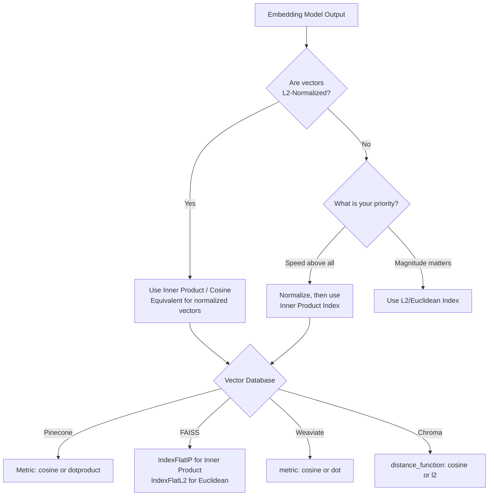

---

## 9. Tradeoffs

| Metric | Computation Cost | Magnitude Invariance | When to Use |
|---|---|---|---|
| Cosine Similarity | Medium (requires norm computation) | ✅ Yes | Text, doc embeddings of varying length |
| Dot Product | Low (pure multiply-add) | ❌ No | Normalized vectors (after L2 normalization) |
| Euclidean (L2) | Medium | ❌ No | When magnitude carries meaning; image features |
| Hamming | Very Low (XOR + popcount) | N/A (binary) | Binary-quantized embeddings at billion scale |
| Manhattan (L1) | Medium | ❌ No | Rare; some sparse vector applications |

---

## 10. Interview Preparation

**Junior**: "Cosine similarity measures the angle between two vectors. Values close to 1.0 mean similar, close to 0 means unrelated. It's the most common metric for text embedding search because it ignores the length of the text."

**Mid-level**: "I always L2-normalize my embeddings before storage. This makes dot product mathematically equivalent to cosine similarity but much faster to compute — it's pure matrix multiplication with BLAS. For my vector database configuration, I set the index to use inner product (IP) metric, which correctly handles normalized vectors. For binary-quantized embeddings, I use Hamming distance with XOR operations, which gives 32× memory reduction with ~95% of retrieval quality."

**Senior**: "The choice of similarity metric is tied to the choice of loss function used to train the embedding model. Models trained with softmax (classification) or cosine similarity objective naturally produce vectors where cosine similarity is the correct metric. Models trained with dot product objectives (MIPS — Maximum Inner Product Search) need un-normalized dot product. In production, I validate the correct metric by checking the model card and empirically verifying on a test set that higher scores correspond to expected semantic matches."

---

## 11. Follow-up Questions

**Q1: If dot product and cosine similarity are equivalent for normalized vectors, why do some vector databases have separate metric options?**
> For un-normalized vectors, they are completely different. Dot product rewards both direction alignment and vector magnitude (longer vectors have higher dot products). Cosine only rewards direction. Many embedding models do not normalize their outputs (e.g., some image embedding models), so the database must handle both cases.

**Q2: What is MIPS (Maximum Inner Product Search) and when is it used?**
> MIPS is the retrieval problem where you want to find the vector with the maximum dot product with a query — not cosine similarity, but raw inner product. This is used in recommendation systems where item embeddings have magnitude that encodes popularity or quality. User embeddings and item embeddings are trained jointly with dot product objective. Retrieval must maximize dot product, not cosine similarity.

**Q3: How does metric choice affect HNSW graph construction?**
> HNSW (Hierarchical Navigable Small World) builds its graph using the same metric that will be used at query time. If you build the graph with Euclidean distance but query with cosine, the graph's navigation heuristics break and you get poor recall. Always build the index with the metric you'll use at query time.

---

## 12. Practical Scenario

### Scenario: Debugging Wrong Retrieval Results

**Problem**: A RAG system retrieving customer FAQ answers consistently returns wrong results despite using "high quality" embeddings.

**Diagnosis**: 
1. Inspection reveals the embedding service was returning un-normalized vectors
2. The vector database was configured with `metric="cosine"` 
3. But the un-normalized vectors meant Euclidean distance dominated, and longer FAQ answers (high magnitude) were ranked higher regardless of relevance

**Fix**:
```python
# Before (wrong): unnormalized + cosine metric = incorrect
embeddings = model.encode(texts)  # not normalized!

# After (correct): normalize before storing
embeddings = model.encode(texts, normalize_embeddings=True)  # Force L2 norm
```

**Result**: After normalization, NDCG@5 on evaluation set improved from 0.42 to 0.71.

---

## 13. Revision Sheet

### Key Points
- **Cosine Similarity**: Angle between vectors; invariant to magnitude; range -1 to 1
- **Dot Product**: Sum of element products; = cosine for normalized vectors; fastest to compute
- **Euclidean**: Straight-line distance; sensitive to magnitude; use when magnitude matters
- **Hamming**: For binary embeddings; XOR + popcount; 32× memory savings
- **Gold Rule**: L2-normalize all text embeddings, then use dot product / inner product index

### Key Formulas
```
Cosine:    cos(a,b) = (a·b) / (||a||×||b||)
Dot:       a·b = Σ aᵢbᵢ
Euclidean: ||a-b||₂ = √Σ(aᵢ-bᵢ)²

For normalized vectors (||a||=||b||=1):
cosine(a,b) = dot(a,b) = 1 - (euclidean(a,b)²/2)
```

---

---

# Chapter 3: Dense Embeddings

---

## 1. Introduction

### What Are Dense Embeddings?

A **dense embedding** is a vector where every dimension has a non-zero value. The information about semantic meaning is distributed across ALL dimensions simultaneously, with no single dimension being interpretable in isolation.

In contrast to sparse representations (where most values are zero), dense embeddings pack rich semantic information into compact vectors.

When people say "embeddings" in the context of AI engineering, they almost always mean dense embeddings — the output of transformer encoder models like BERT, Sentence-BERT, or OpenAI's embedding API.

### Why Dense?

Because density enables generalization. Sparse representations (TF-IDF, BM25) only fire for exact word matches. Dense embeddings fire for semantic similarity — "automobile" and "car" activate overlapping patterns across many dimensions, producing similar vectors.

---

## 2. Historical Motivation

Word2Vec (2013) produced the first dense embeddings, but they were shallow and context-free.

BERT (2018) produced deep, contextual, dense representations — but the [CLS] token embedding wasn't good for semantic similarity.

Sentence-BERT (SBERT, 2019) was the breakthrough for practical dense embeddings. It used a **Siamese network** architecture: the same BERT model processes two sentences independently, and a contrastive loss function trains the model to produce similar embeddings for semantically similar sentences.

SBERT made dense embedding search practical at scale, enabling semantic search systems that were impossible before.

---

## 3. Real-World Analogy

Dense embeddings are like **a person's personality fingerprint**.

Psychologists might measure someone on 1536 different personality traits (empathy level, risk tolerance, creativity, ...). The exact score on any single trait is meaningless alone. But the entire profile together uniquely identifies a person's personality in a way that groups similar people together.

Two people with similar personalities have similar fingerprints (high cosine similarity). Two very different people have dissimilar fingerprints (low cosine similarity). No single dimension determines similarity — all 1536 together do.

---

## 4. Visual Mental Model

### The Bi-Encoder Architecture (Dense Retrieval)

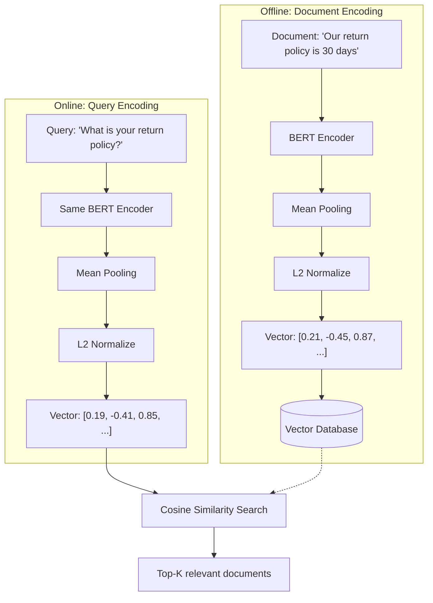

---

## 5. Internal Working

### The Bi-Encoder: Separate Encoding for Speed

Dense retrieval uses a **Bi-Encoder** architecture:

1. **Document encoding (offline)**: Pass each document through the encoder once, store the resulting vector.
2. **Query encoding (online)**: At search time, encode only the query.
3. **Search**: Compute similarity between the query vector and all stored document vectors.

**Why "bi"?** Two separate forward passes through the encoder — one for the document, one for the query. They don't see each other.

**Advantage**: Document vectors are pre-computed and cached. At search time, you only need one encoder forward pass (for the query) plus a fast vector search. This is O(1) neural network computations at query time, plus O(log N) for the ANN search.

**Disadvantage**: Because query and document are encoded independently, the model cannot directly compare individual words between them. "bank" in "bank of a river" and "bank" in "bank account" may map to different vectors, but the model doesn't "see" the document when encoding the query.

### The Contrastive Loss: Teaching Dense Embedding Distance

```python
"""
Multiple Negatives Ranking Loss — the backbone of SBERT training.
Every positive pair's negative is every other positive in the batch.
"""

import torch
import torch.nn.functional as F


def multiple_negatives_ranking_loss(
    anchors: torch.Tensor,    # (B, D) — B anchor embeddings
    positives: torch.Tensor,  # (B, D) — B positive embeddings
    temperature: float = 0.07
) -> torch.Tensor:
    """
    Multiple Negatives Ranking Loss (in-batch negatives).
    
    For each anchor-positive pair (i), all other positives (j ≠ i)
    in the batch serve as hard negatives.
    
    The model is trained to maximize similarity between anchor[i]
    and positive[i], while minimizing similarity with positive[j≠i].
    
    This is the training objective for most state-of-the-art
    embedding models including BGE, E5, GTE.
    """
    # L2 normalize
    anchors  = F.normalize(anchors, dim=-1)   # (B, D)
    positives = F.normalize(positives, dim=-1) # (B, D)
    
    # Similarity matrix: (B, B)
    # sim[i][j] = cosine similarity between anchor[i] and positive[j]
    sim_matrix = torch.matmul(anchors, positives.T) / temperature
    
    # Target: anchor[i] should match positive[i] (diagonal)
    labels = torch.arange(len(anchors), device=anchors.device)
    
    # Cross-entropy loss: pull diagonal (true positives) high,
    # push off-diagonal (in-batch negatives) low
    loss = F.cross_entropy(sim_matrix, labels)
    
    return loss
```

---

## 6. Mathematical Intuition

### Why In-Batch Negatives Are Powerful

For a batch of size $B = 32$, each anchor sees $B - 1 = 31$ negatives per training step. With 1000 steps per epoch and 100 epochs: each anchor sees approximately $31 \times 1000 \times 100 = 3.1$ million negative examples over training.

Crucially, in-batch negatives are "hard" negatives — they were selected because they are similar in topic or domain (likely from the same corpus). This forces the model to learn fine-grained distinctions, producing much better embeddings than random negatives.

### The Temperature Parameter ($\tau$)

$$\text{softmax}(s_{ij} / \tau)$$

- **Small $\tau$ (0.01-0.05)**: Sharp distribution — the model is very confident about its top choice. High gradient signal for clear positives.
- **Large $\tau$ (0.1-0.5)**: Smooth distribution — the model distributes probability more evenly.

In practice, $\tau = 0.07$ is a common default for embedding training. OpenAI CLIP uses $\tau = 0.07$ learned as a parameter.

---

## 7. Implementation

### End-to-End Dense Retrieval System

```python
"""
Production-grade dense retrieval system.
Uses FAISS for approximate nearest neighbor search.
"""

import numpy as np
import faiss
from dataclasses import dataclass, field
from typing import List, Dict, Optional, Tuple
import json
import logging

logger = logging.getLogger(__name__)


@dataclass
class DenseDocument:
    """A document with its dense embedding."""
    doc_id: str
    text: str
    metadata: Dict
    embedding: Optional[np.ndarray] = field(default=None, repr=False)


class DenseRetriever:
    """
    Dense retrieval system using FAISS for approximate nearest neighbor search.
    
    Supports:
    - Exact search (IndexFlatIP) for small corpora (<100K docs)
    - Approximate search (IndexHNSWFlat) for large corpora
    - Metadata filtering before/after retrieval
    """

    def __init__(
        self,
        dimension: int = 1536,
        use_approximate: bool = True,
        hnsw_m: int = 32,          # HNSW connectivity parameter
        hnsw_ef_construction: int = 200,  # Build-time accuracy
        hnsw_ef_search: int = 64,  # Query-time accuracy
    ):
        self.dimension = dimension
        self.documents: Dict[int, DenseDocument] = {}
        self._counter = 0

        if use_approximate:
            # HNSW: fast approximate nearest neighbor
            # M=32: each node connects to 32 neighbors (higher = more accurate, more memory)
            self.index = faiss.IndexHNSWFlat(dimension, hnsw_m, faiss.METRIC_INNER_PRODUCT)
            self.index.hnsw.efConstruction = hnsw_ef_construction
            self.index.hnsw.efSearch = hnsw_ef_search
            logger.info(f"Using HNSW index: M={hnsw_m}")
        else:
            # Exact flat index — 100% recall but O(N) search
            self.index = faiss.IndexFlatIP(dimension)
            logger.info("Using exact flat index")

    def add_documents(self, documents: List[DenseDocument]):
        """Add documents with pre-computed embeddings to the index."""
        if not documents:
            return

        embeddings = np.array(
            [doc.embedding for doc in documents], dtype=np.float32
        )

        # FAISS requires L2-normalized vectors for inner product search
        faiss.normalize_L2(embeddings)

        self.index.add(embeddings)

        for doc in documents:
            self.documents[self._counter] = doc
            self._counter += 1

        logger.info(f"Added {len(documents)} documents. Total: {self._counter}")

    def search(
        self,
        query_embedding: np.ndarray,
        top_k: int = 5,
        metadata_filter: Optional[Dict] = None,
    ) -> List[Tuple[DenseDocument, float]]:
        """
        Search for the top-K most similar documents.
        
        Args:
            query_embedding: Query vector (D,)
            top_k: Number of results to return
            metadata_filter: Optional dict of {field: value} to filter results
        
        Returns: List of (document, score) tuples sorted by score descending
        """
        query = query_embedding.astype(np.float32).reshape(1, -1)
        faiss.normalize_L2(query)

        # Retrieve more than top_k if filtering, to ensure enough pass the filter
        fetch_k = top_k * 5 if metadata_filter else top_k

        distances, indices = self.index.search(query, fetch_k)

        results = []
        for dist, idx in zip(distances[0], indices[0]):
            if idx == -1:
                continue

            doc = self.documents.get(idx)
            if doc is None:
                continue

            # Apply metadata filter if provided
            if metadata_filter:
                if not all(doc.metadata.get(k) == v for k, v in metadata_filter.items()):
                    continue

            results.append((doc, float(dist)))

            if len(results) >= top_k:
                break

        return results

    def search_with_diversity(
        self,
        query_embedding: np.ndarray,
        top_k: int = 5,
        diversity_threshold: float = 0.85,
    ) -> List[Tuple[DenseDocument, float]]:
        """
        Maximal Marginal Relevance (MMR) search.
        Balances relevance with diversity — avoids retrieving near-duplicate chunks.
        
        Algorithm:
        1. Get top 4×K candidates
        2. Greedily select the next document that is (1) relevant to the query
           AND (2) not too similar to already-selected documents
        """
        # Get more candidates than needed
        candidates = self.search(query_embedding, top_k=top_k * 4)

        selected: List[Tuple[DenseDocument, float]] = []
        candidate_embeddings = np.array(
            [c[0].embedding for c in candidates], dtype=np.float32
        )
        faiss.normalize_L2(candidate_embeddings)

        selected_embeddings: List[np.ndarray] = []

        for doc, score in candidates:
            if len(selected) >= top_k:
                break

            if not selected_embeddings:
                # First document: always select the most relevant
                selected.append((doc, score))
                selected_embeddings.append(doc.embedding)
                continue

            # Check similarity to already-selected documents
            selected_arr = np.array(selected_embeddings, dtype=np.float32)
            faiss.normalize_L2(selected_arr)
            doc_emb = doc.embedding.astype(np.float32).reshape(1, -1)
            faiss.normalize_L2(doc_emb)

            max_sim_to_selected = float(np.max(selected_arr @ doc_emb.T))

            if max_sim_to_selected < diversity_threshold:
                selected.append((doc, score))
                selected_embeddings.append(doc.embedding)

        return selected

    def get_stats(self) -> Dict:
        return {
            "total_documents": self._counter,
            "index_type": type(self.index).__name__,
            "dimension": self.dimension,
        }
```

---

## 8. Tradeoffs

| Property | Dense Embeddings | Sparse (BM25) |
|---|---|---|
| Semantic understanding | ✅ Excellent | ❌ Keyword only |
| Exact term matching | ❌ Can miss exact terms | ✅ Perfect |
| Storage per document | High (D × 4 bytes) | Low (sparse, mostly zeros) |
| Compute (indexing) | High (encoder forward pass) | Very low (counting) |
| Compute (search) | O(log N) ANN or O(N) exact | O(log N) inverted index |
| Multi-language | ✅ With multilingual model | Language-specific |
| Fine-tuning possible | ✅ Yes | ❌ No (BM25 is not learned) |

---

## 9. Interview Preparation

**Junior**: "Dense embeddings are vectors from transformer models where every dimension has a value. They capture semantic meaning, so similar texts have similar vectors. We use them for semantic search in RAG."

**Mid-level**: "Dense retrieval uses a bi-encoder: documents are encoded offline and stored in a vector database; queries are encoded at runtime. The model is trained with contrastive loss (Multiple Negatives Ranking Loss) which pushes semantically similar texts together and dissimilar texts apart. In production, I use FAISS with HNSW for approximate nearest neighbor search for O(log N) query latency."

**Senior**: "The bi-encoder's limitation is that it cannot model fine-grained token-level interactions between query and document at retrieval time — that requires a cross-encoder (reranker). My production pipeline uses a bi-encoder for high-recall retrieval (top 50) followed by a cross-encoder for high-precision reranking (top 5). For diversity in retrieved documents, I implement Maximal Marginal Relevance to avoid retrieving semantically duplicate chunks, which wastes LLM context window."

---

## 10. Revision Sheet

- **Dense**: All dimensions non-zero; distributed representation; captures semantics
- **Bi-Encoder**: Encodes query and doc separately; enables pre-computation; O(1) neural net at query time
- **Training**: Contrastive loss, in-batch negatives, temperature scaling
- **FAISS**: IndexFlatIP for exact (small corpus), IndexHNSWFlat for ANN (large corpus)
- **MMR**: Retrieves diverse, non-duplicate results using greedy selection

---

---

# Chapter 4: Sparse Embeddings

---

## 1. Introduction

### What Are Sparse Embeddings?

A **sparse embedding** is a vector where the vast majority of dimensions are zero. Only a small number of dimensions have non-zero values. These non-zero values typically correspond to specific terms or features.

The classic example: a **TF-IDF vector** with 100,000 dimensions (vocabulary size), where most values are 0 and non-zero values correspond to words actually present in the document.

Modern sparse embeddings like **SPLADE** (Sparse Lexical and Expansion Model) are learned sparse representations that go beyond simple TF-IDF — the model learns which terms to "expand" a document with, effectively reasoning about synonyms and related concepts while maintaining sparsity.

### Why Sparse Embeddings Exist Alongside Dense

Dense embeddings are phenomenal at semantic similarity but have a critical blind spot: **exact term matching**.

If a user searches for "Error Code 491-B" or "CVE-2023-44487", a dense model may embed this as semantically related to "error" and "security vulnerability" in general — completely missing the specific identifier.

Sparse embeddings excel precisely where dense embeddings fail: they match the exact tokens that appear in the query.

---

## 2. Historical Motivation

### BM25: The King of Keyword Search (1994–present)

BM25 (Best Match 25) was published by Robertson et al. in the mid-1990s and remains the dominant algorithm in search engines today. Elasticsearch and Apache Solr use BM25 as their default ranking function.

BM25 is a bag-of-words retrieval function. It scores documents based on:
1. **Term Frequency (TF)**: How many times does the query term appear in the document?
2. **Inverse Document Frequency (IDF)**: How rare is this term across all documents? Rare terms are more informative.
3. **Document length normalization**: Penalize very long documents for having high TF by chance.

BM25 has no notion of semantics. "automobile" and "car" are completely unrelated in BM25's world. But its precision on exact keyword matches is unmatched.

### SPLADE: Learned Sparse Representations (2021)

SPLADE (Formal et al., 2021) was the breakthrough that created **learned sparse representations**. Instead of counting exact terms, a transformer model learns to assign importance weights to terms — and critically, to *expand* documents with related terms.

A document about "automobile" might have SPLADE assign non-zero weights to "car", "vehicle", "engine" as well — effectively bridging the gap between sparse precision and dense semantics.

---

## 3. Real-World Analogy

Sparse embeddings are like a **library catalog card with keywords**.

When a librarian catalogs a book about "Type 2 Diabetes management", they write on the card: `[diabetes, type-2, insulin, blood-sugar, management]`. Most of the catalog vocabulary (100,000 words) is blank on this card — that is the sparsity.

When you search for "Type 2 Diabetes", the catalog finds this card because it has exact keyword matches.

**BM25**: The librarian only writes the words literally in the book.
**SPLADE**: The librarian also writes synonyms and related terms they know about, even if they don't appear in the book — "hyperglycemia", "glucometer", "endocrinology". This is learned term expansion.

---

## 4. Visual Mental Model

### BM25 vs SPLADE

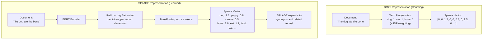

---

## 5. Internal Working

### BM25 Step by Step

Given a query Q with terms $q_1, q_2, ..., q_n$ and a document D:

$$\text{BM25}(D, Q) = \sum_{q \in Q} \text{IDF}(q) \cdot \frac{f(q, D) \cdot (k_1 + 1)}{f(q, D) + k_1 \cdot (1 - b + b \cdot \frac{|D|}{\text{avgdl}})}$$

Where:
- $f(q, D)$ = frequency of query term $q$ in document $D$
- $|D|$ = document length (number of terms)
- $\text{avgdl}$ = average document length across corpus
- $k_1$ = term frequency saturation parameter (typically 1.2–2.0)
- $b$ = length normalization parameter (typically 0.75)
- $\text{IDF}(q) = \log\frac{N - n(q) + 0.5}{n(q) + 0.5}$ where $N$ = total documents, $n(q)$ = documents containing $q$

### SPLADE's FLOPS Loss (Regularization for Sparsity)

SPLADE must be explicitly trained to be sparse — otherwise a neural network would happily assign non-zero weights to all vocabulary terms.

The **FLOPS loss** penalizes non-sparsity:

$$\mathcal{L}_{\text{FLOPS}} = \sum_{j} \left( \sum_{i} |w_{ij}| \right)^2$$

This encourages the model to concentrate weight on a small number of dimensions, maintaining sparsity while allowing the selected non-zero terms to have significant weights.

---

## 6. Mathematical Intuition

### Why BM25 Saturates TF

Without saturation, a document mentioning "machine learning" 100 times would get 100× the score of a document mentioning it once — even if the once-mentioned document is more relevant overall.

BM25's TF component:
$$\frac{f \cdot (k_1 + 1)}{f + k_1}$$

When $f = 0$: result = 0 (no match)
When $f = 1$: result ≈ 1 (some match)
When $f = 10$: result ≈ 1.6 (more match, but not 10×)
When $f → ∞$: result → $k_1 + 1 ≈ 3.2$ (saturates)

This **saturation** prevents term spamming (the reason early search engines were fooled by "blue blue blue blue" stuffed in white text).

---

## 7. Implementation

### BM25 and SPLADE in Python

```python
"""
Sparse retrieval implementations:
1. BM25 from scratch (understanding the algorithm)
2. BM25 with rank-bm25 library (production)
3. SPLADE using transformers (modern learned sparse)
"""

import math
import numpy as np
from typing import List, Dict, Tuple
from collections import Counter, defaultdict


# ─── BM25 from Scratch ───────────────────────────────────────────────────────

class BM25:
    """
    BM25 retrieval from scratch.
    
    Parameters:
    - k1: Term frequency saturation (1.2 to 2.0). Lower = more saturation.
    - b: Document length normalization (0.0 = no normalization, 1.0 = full).
    """

    def __init__(self, k1: float = 1.5, b: float = 0.75):
        self.k1 = k1
        self.b = b
        self.corpus: List[List[str]] = []
        self.doc_freqs: Dict[str, int] = defaultdict(int)  # # docs containing term
        self.doc_lengths: List[int] = []
        self.avgdl: float = 0.0
        self.N: int = 0  # Total number of documents

    def _tokenize(self, text: str) -> List[str]:
        """Simple whitespace tokenizer. Replace with NLTK/spaCy in production."""
        return text.lower().split()

    def fit(self, corpus: List[str]):
        """Build BM25 index from a list of documents."""
        self.corpus = [self._tokenize(doc) for doc in corpus]
        self.N = len(self.corpus)
        self.doc_lengths = [len(doc) for doc in self.corpus]
        self.avgdl = sum(self.doc_lengths) / self.N if self.N > 0 else 1

        # Count how many documents contain each term (for IDF)
        for tokenized_doc in self.corpus:
            for term in set(tokenized_doc):  # set() to count each term once per doc
                self.doc_freqs[term] += 1

    def _idf(self, term: str) -> float:
        """
        Inverse Document Frequency.
        
        Rare terms (appear in few documents) get high IDF.
        Common terms like "the", "is" get low IDF.
        """
        n = self.doc_freqs.get(term, 0)
        # BM25+ IDF formula (handles zero-count terms with +0.5 smoothing)
        return math.log((self.N - n + 0.5) / (n + 0.5) + 1)

    def score(self, query: str, doc_idx: int) -> float:
        """BM25 score for a single (query, document) pair."""
        query_terms = self._tokenize(query)
        doc = self.corpus[doc_idx]
        doc_len = self.doc_lengths[doc_idx]
        term_freq = Counter(doc)

        score = 0.0
        for term in query_terms:
            if term not in term_freq:
                continue

            f = term_freq[term]  # Term frequency in this document
            idf = self._idf(term)

            # BM25 TF component with saturation and length normalization
            numerator = f * (self.k1 + 1)
            denominator = f + self.k1 * (1 - self.b + self.b * doc_len / self.avgdl)
            score += idf * (numerator / denominator)

        return score

    def get_top_k(self, query: str, k: int = 5) -> List[Tuple[int, float]]:
        """Return top-K document indices and scores for a query."""
        scores = [(idx, self.score(query, idx)) for idx in range(self.N)]
        scores.sort(key=lambda x: x[1], reverse=True)
        return scores[:k]


# ─── Production BM25 with rank-bm25 ─────────────────────────────────────────

class ProductionBM25Retriever:
    """
    Production BM25 retriever using rank-bm25 library.
    
    rank-bm25 is a fast, well-tested Python BM25 implementation.
    For even higher performance: use Elasticsearch or OpenSearch.
    """

    def __init__(self):
        from rank_bm25 import BM25Okapi  # pip install rank-bm25
        self.BM25Class = BM25Okapi
        self.bm25 = None
        self.documents: List[str] = []

    def _tokenize(self, text: str) -> List[str]:
        """
        Tokenization matters more for BM25 than for dense embeddings.
        Simple split works, but NLTK word_tokenize + stopword removal is better.
        """
        import re
        # Lowercase, remove punctuation, split
        text = text.lower()
        text = re.sub(r'[^\w\s]', ' ', text)
        return text.split()

    def index(self, documents: List[str]):
        """Build BM25 index from documents."""
        self.documents = documents
        tokenized = [self._tokenize(doc) for doc in documents]
        self.bm25 = self.BM25Class(tokenized)

    def search(self, query: str, top_k: int = 10) -> List[Tuple[str, float]]:
        """Search for top-K documents matching the query."""
        if self.bm25 is None:
            raise RuntimeError("Call index() before search()")

        tokenized_query = self._tokenize(query)
        scores = self.bm25.get_scores(tokenized_query)

        # Get top-k indices
        top_k_indices = np.argsort(scores)[-top_k:][::-1]

        return [
            (self.documents[i], float(scores[i]))
            for i in top_k_indices
            if scores[i] > 0  # Only return docs with non-zero score
        ]


# ─── SPLADE (Learned Sparse Embeddings) ─────────────────────────────────────

class SPLADERetriever:
    """
    SPLADE retrieval using a pre-trained SPLADE model.
    
    SPLADE produces learned sparse representations that combine:
    - Exact term matching (like BM25)
    - Term expansion (like dense, but in sparse space)
    
    pip install transformers torch
    Model: naver/splade-cocondenser-ensembledistil (state-of-the-art)
    """

    def __init__(self, model_name: str = "naver/splade-cocondenser-ensembledistil"):
        from transformers import AutoTokenizer, AutoModelForMaskedLM
        import torch

        self.tokenizer = AutoTokenizer.from_pretrained(model_name)
        self.model = AutoModelForMaskedLM.from_pretrained(model_name)
        self.model.eval()
        self.device = "cuda" if torch.cuda.is_available() else "cpu"
        self.model.to(self.device)

    def encode(self, texts: List[str]) -> List[Dict[int, float]]:
        """
        Encode texts into sparse SPLADE vectors.
        
        Returns list of sparse vectors as {token_id: weight} dicts.
        Most token_ids will have weight 0 (sparse).
        """
        import torch

        sparse_vectors = []

        for text in texts:
            inputs = self.tokenizer(
                text,
                return_tensors="pt",
                padding=True,
                truncation=True,
                max_length=512,
            ).to(self.device)

            with torch.no_grad():
                outputs = self.model(**inputs)

            # SPLADE pooling: ReLU + log saturation + max-pool across tokens
            # relu(log(1 + relu(logits))) — ensures non-negative log-compressed weights
            logits = outputs.logits  # (1, seq_len, vocab_size)
            relu_log = torch.log(1 + torch.relu(logits))
            # Max-pool across the sequence dimension
            vec, _ = torch.max(relu_log, dim=1)  # (1, vocab_size)
            vec = vec.squeeze(0).cpu().numpy()

            # Convert to sparse dict (only non-zero entries)
            sparse_vec = {
                int(idx): float(val)
                for idx, val in enumerate(vec)
                if val > 0.01  # Threshold to control sparsity
            }
            sparse_vectors.append(sparse_vec)

        return sparse_vectors

    def sparse_dot_product(
        self,
        query_vec: Dict[int, float],
        doc_vec: Dict[int, float]
    ) -> float:
        """Dot product between two sparse vectors."""
        score = 0.0
        # Iterate over the shorter vector for efficiency
        for term_id, weight in query_vec.items():
            if term_id in doc_vec:
                score += weight * doc_vec[term_id]
        return score
```

---

## 8. Tradeoffs

| Property | BM25 | SPLADE (Learned Sparse) | Dense |
|---|---|---|---|
| Exact term matching | ✅ Perfect | ✅ Very good | ❌ Can miss |
| Semantic understanding | ❌ None | ✅ Through expansion | ✅ Excellent |
| Interpretability | ✅ Fully interpretable | ✅ Inspectable terms | ❌ Black box |
| Index size | Small (sparse) | Small (sparse) | Large (D × 4 bytes) |
| Training needed | ❌ None | ✅ Needs fine-tuning | ✅ Needs fine-tuning |
| Multilingual | Depends on tokenizer | With multilingual model | ✅ Standard |

---

## 9. Interview Preparation

**Junior**: "Sparse embeddings are like word frequency vectors — most values are zero, and non-zero values represent words in the document. BM25 is the classic algorithm. It's still used in Elasticsearch because it's great at finding exact keywords."

**Mid-level**: "BM25 scores documents by term frequency (with saturation) × inverse document frequency (how rare the term is) × length normalization. It's perfect for exact keyword search. SPLADE is a neural model that produces learned sparse embeddings, expanding documents with related terms. I use sparse retrieval alongside dense retrieval in hybrid search."

**Senior**: "BM25 is essential for AI systems that need exact term matching — product SKUs, error codes, person names, medical terminology. Dense embeddings alone fail catastrophically on these. SPLADE bridges the gap by producing sparse representations with term expansion. However, SPLADE has higher indexing cost than BM25 and requires storing sparse vectors in systems that support efficient sparse dot products (Pinecone, Vespa, Qdrant with sparse vectors). For most production RAG systems, I use BM25 from Elasticsearch for sparse retrieval and FAISS/Pinecone for dense, combined with Reciprocal Rank Fusion."

---

## 10. Revision Sheet

- **Sparse**: Mostly zeros; non-zero values = term weights
- **BM25**: TF saturation × IDF × length normalization; exact term matching
- **SPLADE**: Learned sparse via BERT + ReLU + log; term expansion; bridges sparse and dense
- **Key BM25 params**: k1 (1.2-2.0) controls TF saturation; b (0.75) controls length normalization
- **When to use**: Always use sparse alongside dense; especially critical for exact identifiers

---

---

# Chapter 5: Hybrid Retrieval

---

## 1. Introduction

### What Is Hybrid Retrieval?

Hybrid retrieval combines **dense** (semantic) search with **sparse** (keyword) search to leverage the strengths of both and compensate for each other's weaknesses.

The fundamental insight: there is no single retrieval algorithm that is best for all query types.

- **Dense search excels at**: "What are the benefits of taking vitamin D?" (semantic match)
- **Sparse search excels at**: "vitamin D3 2000 IU cholecalciferol" (exact term match)

Hybrid retrieval runs both searches simultaneously and fuses the results.

---

## 2. Historical Motivation

In 2020, when vector databases became practical, there was an exciting narrative: "Dense embeddings will replace keyword search forever!" Semantic understanding would make BM25 obsolete.

Reality check from benchmarks (BEIR, 2021): On many retrieval tasks — especially those requiring exact term matching — BM25 outperformed early dense embedding models. In fact, the best results came from combining both.

Benchmarks showed:
- BM25 alone: 0.42 NDCG@10
- Dense alone: 0.44 NDCG@10
- Hybrid (BM25 + Dense): 0.52 NDCG@10 — a 20% improvement!

This led to the now-standard wisdom: **always use hybrid retrieval in production RAG systems**.

---

## 3. Real-World Analogy

### The Expert Research Team

Imagine you're hiring two expert researchers to answer a question:

**Researcher 1 (Dense / Semantic)**: An expert reader who has understood thousands of books. They read your question, understand your intent, and recall documents about similar topics even if they use completely different words. They're bad at finding exact quotes or specific codes.

**Researcher 2 (Sparse / BM25)**: A master indexer with perfect memory for exact words. They can instantly find every document containing "Error Code 491-B" or "Article III Section 2 Clause 1". They're bad at understanding what you actually meant beyond the words you typed.

**Hybrid**: Let both researchers search simultaneously. Take the best results from each and present them, prioritizing documents that both researchers agreed on.

---

## 4. Visual Mental Model

### The Hybrid Retrieval Pipeline

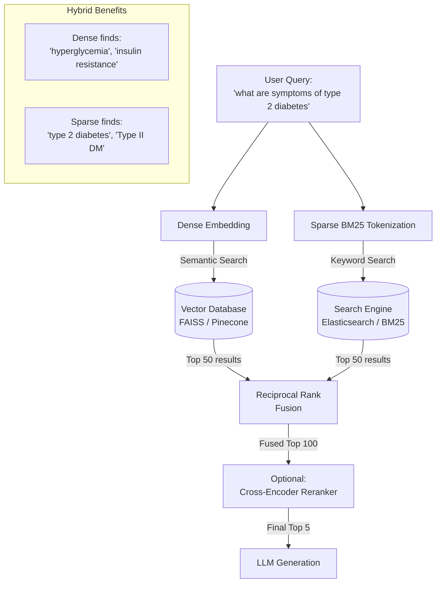

### Reciprocal Rank Fusion Visualization

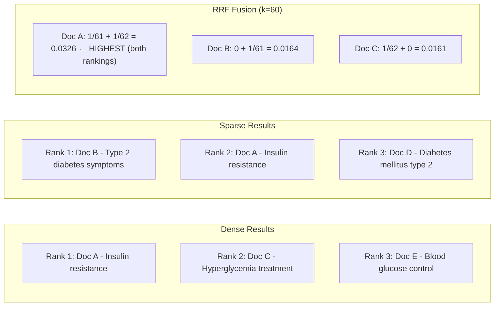

---

## 5. Internal Working

### Reciprocal Rank Fusion (RRF) in Detail

RRF was proposed by Gordon V. Cormack et al. (2009) as a simple but remarkably effective method to combine multiple ranked lists without requiring score normalization.

**The Algorithm**:

For each document $d$ that appears in any of the $R$ ranked lists:
$$\text{RRF}(d) = \sum_{r \in R} \frac{1}{k + \text{rank}_r(d)}$$

Where:
- $k = 60$ is the standard smoothing constant (makes the formula less sensitive to top-1 rank vs top-2 rank differences)
- $\text{rank}_r(d)$ is the position of document $d$ in ranker $r$ (1-indexed)
- If document $d$ does not appear in ranker $r$'s results, its contribution is 0

**Why k=60?**
The parameter $k$ was empirically chosen in the original paper. A value of 60 means that rank 1 gets weight $1/61 ≈ 0.016$ and rank 60 gets weight $1/120 ≈ 0.008$ — a 2× difference, not 60×. This "smooths" the importance of rank differences and reduces sensitivity to top rank.

**Why RRF instead of score combination?**
Dense scores (cosine similarity: 0.0-1.0) and BM25 scores (typically 0-20) are on completely different scales. Simply adding them would let BM25 dominate. RRF uses only rank positions, which are always on the same scale (1, 2, 3, ...) regardless of the underlying score distribution.

---

## 6. Mathematical Intuition

### The RRF Formula Explained

$$\text{RRF}(d) = \sum_{r \in R} \frac{1}{k + \text{rank}_r(d)}$$

**Example** with $k = 60$ and 2 rankers (dense, sparse):

| Document | Dense Rank | Sparse Rank | Dense Score | Sparse Score | RRF Score |
|---|---|---|---|---|---|
| Doc A | 1 | 2 | 1/(60+1)=0.0164 | 1/(60+2)=0.0161 | **0.0325** |
| Doc B | 3 | 1 | 1/(60+3)=0.0159 | 1/(60+1)=0.0164 | **0.0323** |
| Doc C | 2 | Not in list | 1/(60+2)=0.0161 | 0 | **0.0161** |

Doc A and Doc B are close because they appear in both lists. Doc C only appears in dense results, so it scores lower despite being rank 2.

**Key Insight**: A document consistently ranked in both lists will almost always outperform a document that ranks #1 in only one list. This rewards *consensus* across retrieval methods.

---

## 7. Implementation

### Complete Hybrid Retrieval System

```python
"""
Production-grade Hybrid Retrieval with RRF.
Combines FAISS dense retrieval + BM25 sparse retrieval.
"""

import asyncio
import numpy as np
from typing import List, Dict, Tuple, Optional
from dataclasses import dataclass
import logging
from openai import AsyncOpenAI

logger = logging.getLogger(__name__)


@dataclass
class HybridDocument:
    doc_id: str
    text: str
    metadata: Dict
    embedding: Optional[np.ndarray] = None


def reciprocal_rank_fusion(
    ranked_lists: List[List[str]],  # Each is an ordered list of doc_ids
    k: int = 60,
) -> List[Tuple[str, float]]:
    """
    Reciprocal Rank Fusion: combine multiple ranked doc_id lists.
    
    Args:
        ranked_lists: Each inner list is a ranked list of doc_ids (best first)
        k: Smoothing constant (default 60 is standard)
    
    Returns: List of (doc_id, rrf_score) tuples, sorted by score descending
    """
    scores: Dict[str, float] = {}

    for ranked_list in ranked_lists:
        for rank, doc_id in enumerate(ranked_list):
            if doc_id not in scores:
                scores[doc_id] = 0.0
            scores[doc_id] += 1.0 / (k + rank + 1)  # rank is 0-indexed

    return sorted(scores.items(), key=lambda x: x[1], reverse=True)


class HybridRetriever:
    """
    Production hybrid retrieval combining dense and sparse search.
    
    Architecture:
    - Dense: FAISS with HNSW for approximate nearest neighbor
    - Sparse: rank-bm25 for keyword retrieval
    - Fusion: RRF to combine both result lists
    """

    def __init__(
        self,
        embedding_model: str = "text-embedding-3-small",
        dense_weight: float = 0.5,   # For weighted scoring (alternative to RRF)
        sparse_weight: float = 0.5,
        top_k_per_source: int = 50,  # Retrieve 50 from each before fusion
    ):
        import faiss
        from rank_bm25 import BM25Okapi

        self.client = AsyncOpenAI()
        self.embedding_model = embedding_model
        self.top_k_per_source = top_k_per_source

        # Dense index
        self.faiss_index = faiss.IndexHNSWFlat(1536, 32, faiss.METRIC_INNER_PRODUCT)
        self.faiss_index.hnsw.efSearch = 64

        # Sparse index
        self.bm25 = None
        self.BM25Class = BM25Okapi

        # Document store
        self.documents: Dict[str, HybridDocument] = {}
        self.doc_id_to_faiss_id: Dict[str, int] = {}
        self.faiss_id_to_doc_id: Dict[int, str] = {}
        self._faiss_counter = 0

    def _tokenize(self, text: str) -> List[str]:
        import re
        return re.sub(r'[^\w\s]', ' ', text.lower()).split()

    async def _get_embeddings(self, texts: List[str]) -> np.ndarray:
        """Get embeddings from OpenAI API."""
        response = await self.client.embeddings.create(
            input=texts,
            model=self.embedding_model,
        )
        embs = np.array(
            [item.embedding for item in sorted(response.data, key=lambda x: x.index)],
            dtype=np.float32,
        )
        import faiss
        faiss.normalize_L2(embs)
        return embs

    async def index(self, documents: List[HybridDocument]):
        """
        Index documents for both dense and sparse retrieval.
        """
        import faiss

        logger.info(f"Indexing {len(documents)} documents...")

        # Embed all documents (dense)
        texts = [doc.text for doc in documents]
        embeddings = await self._get_embeddings(texts)

        # Add to FAISS
        self.faiss_index.add(embeddings)

        # Build BM25 index
        tokenized = [self._tokenize(doc.text) for doc in documents]
        self.bm25 = self.BM25Class(tokenized)

        # Store mappings
        for i, doc in enumerate(documents):
            faiss_id = self._faiss_counter + i
            self.documents[doc.doc_id] = doc
            self.doc_id_to_faiss_id[doc.doc_id] = faiss_id
            self.faiss_id_to_doc_id[faiss_id] = doc.doc_id

        self._faiss_counter += len(documents)
        logger.info("Indexing complete.")

    async def search(
        self,
        query: str,
        top_k: int = 5,
        metadata_filter: Optional[Dict] = None,
    ) -> List[Tuple[HybridDocument, float]]:
        """
        Hybrid search: run dense and sparse in parallel, fuse with RRF.
        """
        import faiss

        # 1. Dense retrieval
        query_emb = await self._get_embeddings([query])

        dense_distances, dense_indices = self.faiss_index.search(
            query_emb, self.top_k_per_source
        )
        dense_doc_ids = [
            self.faiss_id_to_doc_id[int(idx)]
            for idx in dense_indices[0]
            if int(idx) != -1 and int(idx) in self.faiss_id_to_doc_id
        ]

        # 2. Sparse (BM25) retrieval
        tokenized_query = self._tokenize(query)
        bm25_scores = self.bm25.get_scores(tokenized_query)
        bm25_top_k = np.argsort(bm25_scores)[-self.top_k_per_source:][::-1]
        bm25_doc_ids = [
            self.faiss_id_to_doc_id.get(int(idx), "")
            for idx in bm25_top_k
            if bm25_scores[idx] > 0
        ]
        bm25_doc_ids = [d for d in bm25_doc_ids if d]

        # 3. Fuse with RRF
        fused = reciprocal_rank_fusion([dense_doc_ids, bm25_doc_ids])

        # 4. Apply metadata filter and return top_k
        results = []
        for doc_id, rrf_score in fused:
            if len(results) >= top_k:
                break

            doc = self.documents.get(doc_id)
            if doc is None:
                continue

            if metadata_filter:
                if not all(doc.metadata.get(k) == v for k, v in metadata_filter.items()):
                    continue

            results.append((doc, rrf_score))

        return results

    async def search_with_stats(
        self,
        query: str,
        top_k: int = 5,
    ) -> Dict:
        """
        Search with retrieval provenance tracking.
        Tells you which source (dense/sparse) contributed each result.
        """
        import faiss

        query_emb = await self._get_embeddings([query])

        # Dense
        _, dense_indices = self.faiss_index.search(query_emb, self.top_k_per_source)
        dense_ids = [
            self.faiss_id_to_doc_id.get(int(i), "")
            for i in dense_indices[0]
            if int(i) != -1
        ]

        # Sparse
        bm25_scores = self.bm25.get_scores(self._tokenize(query))
        top_sparse = np.argsort(bm25_scores)[-self.top_k_per_source:][::-1]
        sparse_ids = [
            self.faiss_id_to_doc_id.get(int(i), "")
            for i in top_sparse
            if bm25_scores[i] > 0
        ]

        fused = reciprocal_rank_fusion([dense_ids, sparse_ids])[:top_k]

        # Track provenance
        dense_set = set(dense_ids[:20])
        sparse_set = set(sparse_ids[:20])

        return {
            "results": fused,
            "provenance": {
                doc_id: {
                    "in_dense": doc_id in dense_set,
                    "in_sparse": doc_id in sparse_set,
                    "source": "both" if doc_id in dense_set and doc_id in sparse_set
                              else ("dense" if doc_id in dense_set else "sparse"),
                }
                for doc_id, _ in fused
            },
        }
```

---

## 8. Production Architecture

### Enterprise Hybrid Search Stack

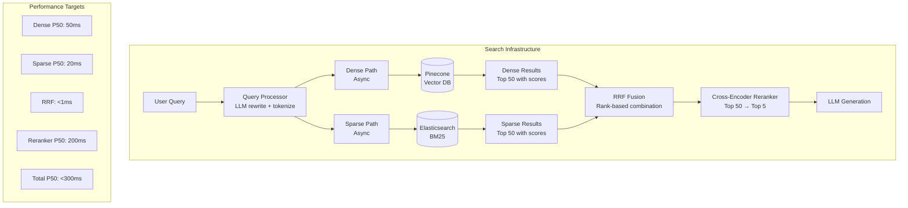

---

## 9. Tradeoffs

| Approach | Recall | Precision | Latency | Cost | Use When |
|---|---|---|---|---|---|
| Dense only | High | Medium | Low | Medium | Semantic queries |
| Sparse only | Medium | High (for keywords) | Very low | Low | Exact term queries |
| Hybrid (RRF) | Very High | High | Medium | Medium | Production default |
| Hybrid + Reranker | Highest | Highest | Highest | High | High-stakes retrieval |

---

## 10. Common Mistakes

❌ **Using score combination instead of RRF**: Adding dense scores (0.0-1.0) to BM25 scores (0-30) directly is mathematically wrong. Use RRF which is scale-invariant.

❌ **Same top_k from both sources**: If BM25 returns many results (because the query has many exact matches) and dense returns few, you need balanced candidate lists. Set `top_k_per_source` consistently.

❌ **Not running dense and sparse in parallel**: These are independent operations. Running them sequentially doubles latency unnecessarily. Use `asyncio.gather()`.

❌ **Forgetting that RRF needs enough candidates**: If your vector DB only returns top-5, RRF has only 5 items to fuse. Always retrieve 50-100 candidates per source before RRF, then filter to final top-5.

---

## 11. Interview Preparation

**Junior**: "Hybrid retrieval combines vector (semantic) search with keyword (BM25) search. Dense search understands meaning; sparse search finds exact words. Combining them gives better results than either alone."

**Mid-level**: "I implement hybrid search with FAISS for dense retrieval and rank-bm25 (or Elasticsearch) for sparse. Both run in parallel using asyncio.gather. Results are fused using Reciprocal Rank Fusion (RRF), which combines the ranked lists using 1/(k + rank) scores — this is scale-invariant and doesn't require normalizing the scores from different sources. After RRF I apply a cross-encoder reranker."

**Senior**: "In production, the split between dense and sparse contribution varies by query type. For technical documentation RAG, sparse search dominates (40-60% of final relevant results come from sparse) because technical terms don't generalize well in embedding space. For conversational Q&A, dense dominates. I instrument retrieval provenance — tracking which source contributed each final result — to continuously calibrate the system. When sparse contribution drops below 20% of final results, it usually indicates that our BM25 index is stale or the query distribution has shifted toward more semantic queries."

**Staff Engineer**: "The architecture decision I care about most is whether to co-locate dense and sparse search or separate them. Running BM25 in Elasticsearch and FAISS in a separate service adds network hops and increases failure modes. For services under 50M documents, I prefer a single-service architecture using hnswlib for dense and a BM25 implementation like rank-bm25 or Tantivy, with a unified retrieval API. This halves p99 latency and eliminates distributed transaction issues. Above 50M documents, the operational benefits of managed vector DBs (Pinecone, Weaviate) and dedicated search engines (Elasticsearch, OpenSearch) outweigh the architectural complexity."

---

## 12. Follow-up Questions

**Q1: What is the difference between late fusion (RRF) and early fusion?**
> Early fusion: combine dense and sparse representations into a single vector before search (e.g., concatenate dense and sparse vectors). Late fusion: run separate searches, then combine the result lists. Late fusion (RRF) is far more practical because it doesn't require modifying the index structure or the embedding model.

**Q2: When should I use weighted score fusion instead of RRF?**
> Weighted score fusion (e.g., `0.7 × normalized_dense_score + 0.3 × normalized_bm25_score`) requires careful score normalization and the weights must be tuned per query type. It can slightly outperform RRF when you have strong priors about which source is more reliable. But RRF is more robust and requires no tuning, which is why it's the default in production.

**Q3: Can I use hybrid search with just one vector database, without a separate search engine?**
> Yes. Weaviate, Qdrant, and MongoDB Atlas support hybrid search natively — they run both BM25 and vector search internally and return fused results. This simplifies the architecture significantly at the cost of less configurability.

**Q4: How does Late Interaction (ColBERT) differ from hybrid retrieval?**
> ColBERT is a different architecture, not a fusion strategy. ColBERT encodes every token in the query and document into separate vectors. At retrieval, it uses MaxSim: for each query token, find the maximum similarity with any document token. This is expensive to compute naively but captures fine-grained token-level interactions — more than bi-encoder cosine similarity but faster than cross-encoder full attention. It's a "third way" between bi-encoder and cross-encoder, not a replacement for hybrid retrieval.

**Q5: What is Vespa and how does it enable hybrid retrieval at scale?**
> Vespa.ai is an open-source serving engine purpose-built for hybrid retrieval at large scale. Unlike using FAISS + Elasticsearch as separate services, Vespa handles both dense (HNSW) and sparse (BM25) search in a unified system with native RRF support. At large scale (billions of documents), Vespa's sharding and real-time index update capabilities make it superior to separate services. Companies like Spotify, Yahoo, and Airbnb use it for search and recommendation.

---

## 13. Practical Scenario

### Scenario: Enterprise Customer Support RAG with Hybrid Search

**Context**: A B2B software company's support AI system must answer questions from 5,000 enterprise clients. The knowledge base includes API documentation (technical specs), case studies, and FAQ articles.

**Problem with dense-only**: When a client asks "Why does Error Code 4291 occur?", the dense model retrieves articles about "common errors" and "troubleshooting" — completely missing the specific article about error 4291.

**Problem with sparse-only**: When a client asks "What's the difference between the standard and premium tier?", BM25 retrieves every document containing "standard" or "premium" regardless of relevance.

**Hybrid solution architecture**:
```
Query: "Why does Error Code 4291 occur?"

Dense results:    [error handling guide, troubleshooting doc, error codes overview]
Sparse results:   [Error Code 4291 reference, Error Code 4291 KB article, ...]

RRF fusion:       Error Code 4291 KB article is #1 (sparse-dominant)

Query: "Difference between standard and premium tier?"

Dense results:    [pricing comparison, tier features doc, upgrade guide, ...]
Sparse results:   [every document with "standard" or "premium"]

RRF fusion:       pricing comparison and tier features doc rise to top (dense-dominant)
```

**Results after 3 months**:
- CSAT (Customer Satisfaction) for AI-answered questions: 78% → 91%
- Escalation rate (AI can't answer → human): 34% → 12%
- Key driver: Hybrid retrieval fixed all exact-identifier failures that were driving escalations

---

## 14. Revision Sheet

### Key Points
- **Hybrid**: Dense (semantic) + Sparse (keyword) always beats either alone
- **RRF Formula**: `RRF(d) = Σ 1/(k + rank_r(d))` where k=60 is standard
- **Why RRF over score fusion**: Scale invariant — no normalization needed
- **Architecture**: Run dense and sparse in parallel, fuse results with RRF
- **Top candidates**: Retrieve 50-100 per source before RRF, filter to 5-10 after

### Key Formula
```
RRF(d) = Σ_{r ∈ Rankers} 1 / (60 + rank_r(d))

Example: Rank 1 in Dense, Rank 2 in Sparse:
RRF = 1/(60+1) + 1/(60+2) = 0.01639 + 0.01613 = 0.03252
```

### Common Traps
- "Dense search is so good now that sparse is unnecessary" → Always test hybrid
- "Add BM25 scores to cosine scores directly" → Different scales → Wrong. Use RRF.
- "Run searches sequentially to save complexity" → Run in parallel to save latency
- "Retrieve 5 from each source then fuse" → Retrieve 50+, fuse, then filter to 5

---

## 15. Hands-on Exercises

**Easy**: Implement RRF from scratch. Given two ranked lists `[A, B, C]` and `[B, A, D]`, compute the RRF score for each document with k=60.

**Medium**: Build a hybrid retriever using rank-bm25 and FAISS. Index 100 Wikipedia paragraphs. Compare NDCG@5 for dense-only, sparse-only, and hybrid on 20 test queries.

**Hard**: Instrument your hybrid retriever to track provenance: for each query, record whether the final top-5 results came from dense, sparse, or both. Analyze patterns across query types.

**Production**: Build a FastAPI service with hybrid retrieval, health checks, observability (log dense and sparse query latency separately), and a `/stats` endpoint reporting cache hit rates and source contribution ratios.

---

## 16. Mini Project: Enterprise Knowledge Base Search API

Build a production-ready search API:
1. FastAPI service with `/ingest` and `/search` endpoints
2. Hybrid search: FAISS + BM25 with RRF
3. Metadata filtering (date range, document type)
4. Result provenance tracking (dense/sparse/both)
5. Redis cache for repeated queries
6. Prometheus metrics: latency, cache hit rate, source contribution
7. Docker deployment with health checks

---

# Summary: Part 6 — Embeddings

This part built the complete understanding of embeddings — the foundational technology that connects meaning to mathematics:

| Chapter | Core Insight |
|---|---|
| **1. Embedding Models** | Transformers convert text to dense vectors via contrastive training. Same model must be used for ingestion and query. Evaluate on MTEB retrieval tasks. |
| **2. Similarity Metrics** | L2-normalize all embeddings; then cosine similarity = dot product. Dense → cosine/dot product; magnitude matters → dot product; binary → Hamming. |
| **3. Dense Embeddings** | Bi-encoder architecture enables pre-computation. Trained with Multiple Negatives Ranking Loss. Use HNSW for O(log N) ANN search. |
| **4. Sparse Embeddings** | BM25 for exact term matching; SPLADE for learned sparse with term expansion. Sparse is essential for codes, identifiers, proper nouns. |
| **5. Hybrid Retrieval** | Dense + Sparse via Reciprocal Rank Fusion always outperforms either alone. RRF is scale-invariant and requires no tuning. Run in parallel, retrieve 50+ per source, fuse, rerank to 5. |

The connecting thread: **embeddings are a geometric representation of meaning**. Every chapter in this part is about how to build, compare, and retrieve these representations effectively. The whole RAG pipeline (Part 8) depends on embedding quality. The choice of embedding strategy — dense, sparse, or hybrid — determines the ceiling of your AI system's accuracy more than any other single architectural decision.

---

*End of Part 6 — Embeddings*
