# Part 7: Vector Databases

> *"A vector database is not just a database that stores vectors. It is an entirely new class of data infrastructure built around one primitive: approximate nearest neighbor search. Understanding it from the algorithm up — from HNSW graph construction to Pinecone's distributed architecture — separates engineers who use vector databases from engineers who master them."*

---

## Table of Contents

- [Chapter 1: FAISS](#chapter-1-faiss)
- [Chapter 2: HNSW — Hierarchical Navigable Small World](#chapter-2-hnsw)
- [Chapter 3: IVF — Inverted File Index](#chapter-3-ivf)
- [Chapter 4: Pinecone](#chapter-4-pinecone)
- [Chapter 5: Chroma](#chapter-5-chroma)
- [Chapter 6: Weaviate](#chapter-6-weaviate)
- [Chapter 7: Milvus](#chapter-7-milvus)

---

# Chapter 1: FAISS

---

## 1. Introduction

### What Is FAISS?

**FAISS** (Facebook AI Similarity Search) is an open-source library developed by Meta AI Research for efficient similarity search and clustering of dense vectors. It is the foundational layer of nearly every vector database on the market — Pinecone, Weaviate, Milvus, and Chroma all use FAISS (or its algorithms) internally.

FAISS is not a full database. It has no persistent storage, no metadata filtering, no API server, no authentication. It is a pure, highly optimized **in-memory indexing and search library** written in C++ with Python bindings.

Understanding FAISS is understanding the engine underneath all vector databases. When an interview asks "How does your vector database work?", this is the level of depth they want.

### What Problem Does It Solve?

Given $N$ vectors of dimension $D$ and a query vector $q$, find the $K$ vectors in the corpus most similar to $q$.

**Naive solution**: Compute cosine similarity between $q$ and every one of $N$ vectors. This is $O(N \times D)$ — exact but linear. For $N = 10$ million, $D = 1536$: approximately **15 billion multiply-add operations per query**. At 100 queries/second this requires dedicated GPU clusters just for search.

**FAISS solution**: Build an index structure that allows approximate nearest neighbor (ANN) search in $O(\log N)$ or $O(\sqrt{N})$ time, trading a small amount of recall for orders-of-magnitude speedup.

### Key Index Types in FAISS

| Index | Type | Best For |
|---|---|---|
| `IndexFlatL2` / `IndexFlatIP` | Exact (brute-force) | < 100K vectors, baseline |
| `IndexIVFFlat` | Approximate (IVF) | 1M–100M vectors |
| `IndexHNSWFlat` | Approximate (HNSW graph) | 100K–50M vectors, fast query |
| `IndexIVFPQ` | Approximate + quantized | Billions of vectors, memory constrained |
| `IndexIVFSQ` | Approximate + scalar quantized | Good quality/memory tradeoff |

---

## 2. Historical Motivation

### The Vector Search Problem Before FAISS

Before FAISS (published 2017), engineers who needed similarity search used one of:

1. **k-d trees**: Work in 2D–20D but suffer from the "curse of dimensionality." In 128+ dimensions, k-d tree search degenerates to linear scan.

2. **LSH (Locality Sensitive Hashing)**: Hash similar vectors to the same bucket with high probability. Suffers from poor recall for high-dimensional vectors and requires many hash tables.

3. **Annoy** (Spotify, 2013): Binary space partitioning trees. Good for read-only indexes but no GPU support and limited scalability.

Meta's recommendation and content understanding systems needed to search billions of embeddings in milliseconds. No existing library could do this efficiently at scale. Johnson, Douze, and Jégou built FAISS to solve Meta's production problem, then open-sourced it in 2017.

FAISS introduced key innovations:
- **GPU acceleration**: First library to run ANN search natively on GPUs (100× faster than CPU for flat search)
- **Product Quantization (PQ)**: Compress vectors from 1536 float32 (6KB) to 12 bytes while preserving search quality
- **IVF (Inverted File Index)**: Scale to billions of vectors with sub-linear search

---

## 3. Real-World Analogy

### The Phonebook Problem

Imagine you have a phonebook with 10 million names (vectors) and you want to find the 5 people whose names are most similar to "Jonathan Smith" (query vector).

**Brute force (IndexFlatIP)**: Read every single name in the phonebook, compute a similarity score, find the top 5. Accurate but takes hours.

**IVF approach**: First, organize the phonebook into 1000 geographic sections (clusters). "Jonathan Smith" is from Chicago, so only look at the Chicago section (one cluster). Find the 5 most similar names in Chicago. Fast, but might miss a "John Smyth" in a nearby section — slight recall loss.

**HNSW approach**: Build a smart multi-level directory. First look at the country-level list, narrow to state, narrow to city, narrow to neighborhood, find the best match. Each level dramatically narrows the search space. This is the graph navigation metaphor.

---

## 4. Visual Mental Model

### FAISS Index Selection Decision Tree

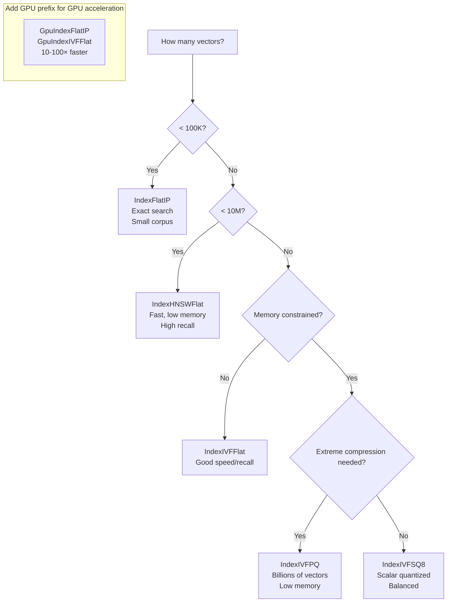

### FAISS Architecture: What Happens During a Search

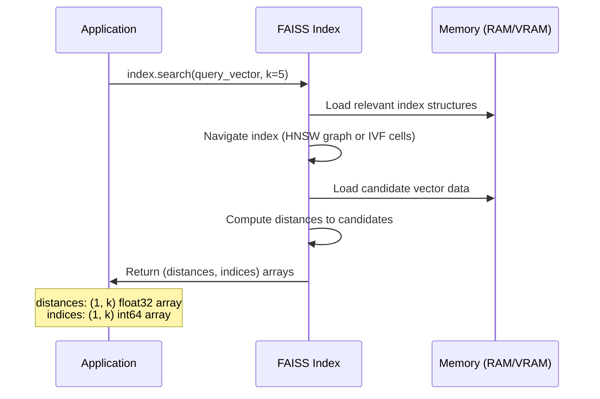

---

## 5. Internal Working

### FAISS Index Lifecycle

Every FAISS index follows the same lifecycle:

```python
import faiss
import numpy as np

# 1. CREATE: Define index type and dimension
dimension = 1536
index = faiss.IndexFlatIP(dimension)          # Exact inner product search

# 2. TRAIN (some indexes require training)
# IVF indexes must first learn cluster centroids from a sample
# index.train(training_vectors)  # Required for IVF, not Flat

# 3. ADD: Insert vectors
vectors = np.random.rand(100000, dimension).astype(np.float32)
faiss.normalize_L2(vectors)        # Normalize for cosine similarity
index.add(vectors)                 # Add to index
print(f"Index contains {index.ntotal} vectors")

# 4. SEARCH: Query
query = np.random.rand(1, dimension).astype(np.float32)
faiss.normalize_L2(query)
distances, indices = index.search(query, k=5)
# distances: cosine similarities (since vectors are normalized)
# indices: positions in the original `vectors` array

# 5. SAVE / LOAD (for persistence)
faiss.write_index(index, "my_index.faiss")
loaded_index = faiss.read_index("my_index.faiss")
```

### Understanding FAISS Metrics

FAISS uses two primary distance metrics:

- **`METRIC_L2`**: Euclidean (L2) distance. Lower = more similar.
- **`METRIC_INNER_PRODUCT`**: Dot product. Higher = more similar.

**Why this matters**: For L2-normalized embeddings, inner product equals cosine similarity. Always:
1. L2-normalize your vectors before adding to FAISS
2. Use `IndexFlatIP` / `METRIC_INNER_PRODUCT`
3. Search returns higher scores for more similar vectors ✓

---

## 6. Mathematical Intuition

### Product Quantization: How FAISS Compresses Vectors

The most important FAISS technique for scale is **Product Quantization (PQ)**, used in `IndexIVFPQ`.

A 1536-dimensional float32 vector takes $1536 \times 4 = 6144$ bytes (6 KB). For 100 million vectors: **614 GB**. Impossible to fit in RAM.

PQ compresses this to as low as **16 bytes** per vector (384× compression) while maintaining reasonable search quality.

**How PQ works**:

1. **Split**: Divide the 1536-dimensional vector into $M$ equal sub-vectors of size $1536/M$ each.
   - Example: $M = 96$ subspaces, each of size 16 dimensions

2. **Quantize each subspace**: For each subspace, train a codebook of $K^* = 256$ centroids using k-means.
   - Each sub-vector is replaced by its nearest centroid's 8-bit code (0–255)

3. **Result**: Original 1536-dim float32 vector → 96 bytes (one byte per subspace)

$$\text{Vector: } [v_1...v_{16}\ |\ v_{17}...v_{32}\ |\ ...\ |\ v_{1521}...v_{1536}]$$
$$\downarrow \text{PQ Encode}$$
$$[\text{code}_1, \text{code}_2, ..., \text{code}_{96}] \quad \text{(96 bytes)}$$

**Distance computation with PQ**: Use precomputed distance tables between query sub-vectors and all 256 centroids in each subspace. The approximate distance is the sum of table lookups — extremely fast.

**Recall vs. Compression Tradeoff**:
- Higher $M$ (more subspaces) = better recall but more memory
- PQ with $M=8$: ~16-byte vectors, ~85% recall
- PQ with $M=64$: ~64-byte vectors, ~95% recall

---

## 7. Implementation

### Complete FAISS Usage: All Major Index Types

```python
"""
Comprehensive FAISS index demonstration.
Covers all major index types with performance comparisons.
"""
import time
import numpy as np
import faiss
from dataclasses import dataclass
from typing import List, Tuple, Dict, Optional
import logging

logger = logging.getLogger(__name__)


def generate_test_data(
    n_docs: int = 100_000,
    n_queries: int = 100,
    dim: int = 1536,
    seed: int = 42
) -> Tuple[np.ndarray, np.ndarray]:
    """Generate normalized random vectors for testing."""
    rng = np.random.default_rng(seed)
    docs = rng.standard_normal((n_docs, dim)).astype(np.float32)
    queries = rng.standard_normal((n_queries, dim)).astype(np.float32)
    faiss.normalize_L2(docs)
    faiss.normalize_L2(queries)
    return docs, queries


@dataclass
class SearchResult:
    index_type: str
    build_time_s: float
    search_time_ms: float
    memory_mb: float
    recall_at_1: float  # % of queries where exact top-1 was found


class FAISSBenchmark:
    """
    Benchmark different FAISS index types on the same dataset.
    Use this to choose the right index for your scale.
    """

    def __init__(self, dim: int = 1536):
        self.dim = dim

    def get_ground_truth(
        self,
        queries: np.ndarray,
        docs: np.ndarray,
        k: int = 5
    ) -> np.ndarray:
        """Exact search for ground truth (for recall computation)."""
        exact_index = faiss.IndexFlatIP(self.dim)
        exact_index.add(docs)
        _, indices = exact_index.search(queries, k)
        return indices  # (n_queries, k)

    def benchmark_flat(
        self, docs: np.ndarray, queries: np.ndarray
    ) -> Tuple[faiss.Index, float, float]:
        """IndexFlatIP: exact brute-force search."""
        t0 = time.time()
        index = faiss.IndexFlatIP(self.dim)
        index.add(docs)
        build_time = time.time() - t0

        t0 = time.time()
        index.search(queries, k=5)
        search_time = (time.time() - t0) / len(queries) * 1000  # ms per query

        return index, build_time, search_time

    def benchmark_hnsw(
        self,
        docs: np.ndarray,
        queries: np.ndarray,
        M: int = 32,
        ef_construction: int = 200,
        ef_search: int = 64,
    ) -> Tuple[faiss.Index, float, float]:
        """IndexHNSWFlat: graph-based ANN search."""
        t0 = time.time()
        index = faiss.IndexHNSWFlat(self.dim, M, faiss.METRIC_INNER_PRODUCT)
        index.hnsw.efConstruction = ef_construction
        index.add(docs)
        build_time = time.time() - t0

        index.hnsw.efSearch = ef_search
        t0 = time.time()
        index.search(queries, k=5)
        search_time = (time.time() - t0) / len(queries) * 1000

        return index, build_time, search_time

    def benchmark_ivf_flat(
        self,
        docs: np.ndarray,
        queries: np.ndarray,
        n_lists: int = 1024,
        n_probe: int = 32,
    ) -> Tuple[faiss.Index, float, float]:
        """
        IndexIVFFlat: Inverted file index.
        n_lists: number of Voronoi cells (clusters).
        n_probe: how many cells to search at query time.
        """
        t0 = time.time()
        quantizer = faiss.IndexFlatIP(self.dim)
        index = faiss.IndexIVFFlat(
            quantizer, self.dim, n_lists, faiss.METRIC_INNER_PRODUCT
        )
        # IVF MUST be trained before adding vectors
        index.train(docs)
        index.add(docs)
        build_time = time.time() - t0

        index.nprobe = n_probe
        t0 = time.time()
        index.search(queries, k=5)
        search_time = (time.time() - t0) / len(queries) * 1000

        return index, build_time, search_time

    def benchmark_ivf_pq(
        self,
        docs: np.ndarray,
        queries: np.ndarray,
        n_lists: int = 1024,
        m_subvectors: int = 64,  # Number of PQ subspaces
        n_bits: int = 8,          # Bits per subspace (256 centroids)
        n_probe: int = 32,
    ) -> Tuple[faiss.Index, float, float]:
        """
        IndexIVFPQ: IVF + Product Quantization.
        Extreme memory compression. For billions of vectors.
        
        Memory per vector: m_subvectors bytes (vs dim*4 for flat)
        """
        t0 = time.time()
        quantizer = faiss.IndexFlatIP(self.dim)
        index = faiss.IndexIVFPQ(
            quantizer, self.dim, n_lists, m_subvectors, n_bits
        )
        index.train(docs)
        index.add(docs)
        build_time = time.time() - t0

        index.nprobe = n_probe
        t0 = time.time()
        index.search(queries, k=5)
        search_time = (time.time() - t0) / len(queries) * 1000

        return index, build_time, search_time

    def compute_recall(
        self,
        index: faiss.Index,
        queries: np.ndarray,
        ground_truth: np.ndarray,
        k: int = 5
    ) -> float:
        """Recall@K: fraction of queries where true top-1 is in top-K results."""
        _, retrieved = index.search(queries, k)
        true_top1 = ground_truth[:, 0]
        found = np.any(retrieved == true_top1[:, np.newaxis], axis=1)
        return float(found.mean())


# ─── Production FAISS Wrapper ────────────────────────────────────────────────

class FAISSVectorStore:
    """
    Production-ready FAISS vector store with:
    - Metadata storage (separate from FAISS index)
    - Persistence (save/load)
    - Metadata filtering post-search
    - ID management
    """

    def __init__(self, dim: int = 1536, index_type: str = "hnsw"):
        self.dim = dim
        self._metadata: Dict[int, Dict] = {}  # faiss_id → metadata
        self._texts: Dict[int, str] = {}       # faiss_id → raw text
        self._counter = 0

        if index_type == "flat":
            self.index = faiss.IndexFlatIP(dim)
        elif index_type == "hnsw":
            self.index = faiss.IndexHNSWFlat(dim, 32, faiss.METRIC_INNER_PRODUCT)
            self.index.hnsw.efConstruction = 200
            self.index.hnsw.efSearch = 64
        elif index_type == "ivf":
            quantizer = faiss.IndexFlatIP(dim)
            self.index = faiss.IndexIVFFlat(quantizer, dim, 1024, faiss.METRIC_INNER_PRODUCT)
            # Note: train() must be called before add()
        else:
            raise ValueError(f"Unknown index type: {index_type}")

    def add(
        self,
        texts: List[str],
        embeddings: np.ndarray,
        metadatas: Optional[List[Dict]] = None,
    ) -> List[int]:
        """
        Add vectors with associated text and metadata.
        Returns list of assigned FAISS IDs.
        """
        embeddings = embeddings.astype(np.float32)
        faiss.normalize_L2(embeddings)

        start_id = self._counter
        self.index.add(embeddings)

        for i, (text, emb) in enumerate(zip(texts, embeddings)):
            fid = self._counter + i
            self._texts[fid] = text
            self._metadata[fid] = metadatas[i] if metadatas else {}

        self._counter += len(texts)
        return list(range(start_id, self._counter))

    def search(
        self,
        query_embedding: np.ndarray,
        k: int = 5,
        metadata_filter: Optional[Dict] = None,
    ) -> List[Dict]:
        """
        Search with optional metadata post-filtering.
        
        Note: metadata_filter is applied AFTER search (post-filter).
        For large corpora with restrictive filters, consider pre-filter
        by building separate indexes per segment.
        """
        query = query_embedding.astype(np.float32).reshape(1, -1)
        faiss.normalize_L2(query)

        # Over-fetch if filtering to ensure enough pass filter
        fetch_k = k * 10 if metadata_filter else k
        fetch_k = min(fetch_k, self.index.ntotal)

        distances, indices = self.index.search(query, fetch_k)

        results = []
        for dist, idx in zip(distances[0], indices[0]):
            if idx == -1 or idx not in self._texts:
                continue

            metadata = self._metadata.get(idx, {})

            # Apply post-filter
            if metadata_filter:
                if not all(metadata.get(key) == val for key, val in metadata_filter.items()):
                    continue

            results.append({
                "id": int(idx),
                "text": self._texts[idx],
                "metadata": metadata,
                "score": float(dist),
            })

            if len(results) >= k:
                break

        return results

    def save(self, path: str):
        """Persist index to disk. Metadata saved separately."""
        import pickle, os
        faiss.write_index(self.index, f"{path}.faiss")
        with open(f"{path}.meta.pkl", "wb") as f:
            pickle.dump({
                "texts": self._texts,
                "metadata": self._metadata,
                "counter": self._counter,
                "dim": self.dim,
            }, f)
        logger.info(f"Saved index ({self.index.ntotal} vectors) to {path}")

    @classmethod
    def load(cls, path: str) -> "FAISSVectorStore":
        import pickle
        index = faiss.read_index(f"{path}.faiss")
        with open(f"{path}.meta.pkl", "rb") as f:
            meta = pickle.load(f)

        store = cls.__new__(cls)
        store.index = index
        store.dim = meta["dim"]
        store._texts = meta["texts"]
        store._metadata = meta["metadata"]
        store._counter = meta["counter"]
        return store
```

---

## 8. Production Architecture

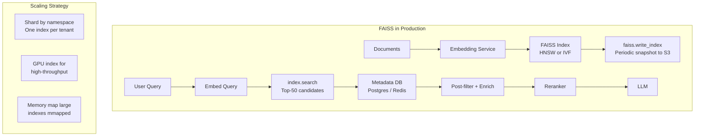

---

## 9. Tradeoffs

| Index Type | Build Time | Search Time | Memory | Recall | Use Case |
|---|---|---|---|---|---|
| `IndexFlatIP` | Very fast | Slow (linear) | High | 100% | Dev/testing, < 100K vecs |
| `IndexHNSWFlat` | Slow | Very fast | High | 95–99% | Production, 100K–50M |
| `IndexIVFFlat` | Medium | Fast | Medium | 90–98% | 1M–100M vectors |
| `IndexIVFPQ` | Slow (train+compress) | Very fast | Tiny | 85–95% | Billions of vectors |
| `IndexIVFSQ8` | Medium | Fast | Low | 92–97% | Balanced option |

---

## 10. Common Mistakes

❌ **Forgetting to L2-normalize before inner product search**: Unnormalized vectors with `IndexFlatIP` computes dot product, not cosine similarity. Magnitude differences dominate results.

❌ **Not training IVF indexes before adding vectors**: `index.train(data)` MUST be called before `index.add(data)`. Skipping it causes an error or silently broken results.

❌ **Setting `nprobe` too low on IVF indexes**: Default `nprobe=1` means only one Voronoi cell is searched — terrible recall. Set `nprobe` to at least `n_lists / 32` to get reasonable recall.

❌ **HNSW indexes cannot be removed from (no delete support)**: FAISS HNSW does not support vector deletion. If your data changes frequently, use IVF (supports remove_ids) or a managed vector DB.

❌ **Saving only the FAISS index but losing metadata**: FAISS stores only vectors and their integer indices (0, 1, 2, ...). You must maintain a separate mapping from FAISS integer ID to your document ID, text, and metadata. If you lose this mapping, your index is useless.

---

## 11. Interview Preparation

**Junior**: "FAISS is a library from Meta for fast vector similarity search. It has different index types: flat for exact search, HNSW for fast approximate search. We use it when we need to find the nearest vectors to a query."

**Mid-level**: "FAISS provides multiple index types with different speed/recall/memory tradeoffs. IndexFlatIP is exact but O(N). IndexHNSWFlat uses a graph structure for O(log N) approximate search with 95–99% recall. IndexIVFFlat clusters vectors into Voronoi cells and only searches the closest n_probe cells. IndexIVFPQ adds Product Quantization for extreme memory compression — 1536-dim vectors compressed to 64 bytes. I always L2-normalize vectors before inner product search to get cosine similarity."

**Senior**: "FAISS is the compute engine; managing it in production requires building the surrounding system: metadata storage in Postgres/Redis keyed by FAISS integer ID, periodic snapshots to S3 with `faiss.write_index`, shard-per-namespace for multi-tenant isolation, and GPU indexes for high-throughput scenarios where FAISS-GPU gives 10–100× speedup. For corpora over 100M vectors, I move to managed solutions (Pinecone, Milvus) because FAISS's lack of real-time CRUD, distributed sharding, and built-in metadata filtering becomes operational pain that consumes more engineering time than the savings from self-hosting."

---

## 12. Follow-up Questions

**Q1: What is the difference between IndexFlatL2 and IndexFlatIP?**
> `IndexFlatL2` computes Euclidean (L2) distance — lower score = more similar. `IndexFlatIP` computes dot product (inner product) — higher score = more similar. For L2-normalized vectors, inner product equals cosine similarity. Always normalize and use `IndexFlatIP` for text embeddings.

**Q2: Can FAISS delete vectors?**
> HNSW indexes cannot delete vectors at all — this is a fundamental limitation of the algorithm. IVF-based indexes support `remove_ids()` but it is slow and leaves gaps that accumulate over time, requiring periodic index rebuilds. Managed vector DBs handle deletions much more gracefully.

**Q3: What is `efConstruction` and `efSearch` in HNSW?**
> `efConstruction` is the size of the dynamic candidate list used when building the graph — higher values build a higher-quality graph but take more time. `efSearch` is the size of the candidate list used during search — higher values give better recall but slower queries. They are independent: you set `efConstruction` once at build time and can change `efSearch` between queries.

**Q4: How many IVF lists (n_lists) should I use?**
> Rule of thumb: $n\_lists \approx \sqrt{N}$ where $N$ is the number of vectors. For 1M vectors: ~1024 lists. For 10M vectors: ~4096 lists. Each list should contain roughly 1000–10000 vectors. Too few lists = large cells = slow search. Too many lists = small cells = poor recall at low nprobe.

**Q5: What training data should I use for IVF?**
> IVF training learns the cluster centroids using k-means. Use a representative random sample of your corpus — typically 50–256 × n_lists vectors. More training data = better clusters = better recall.

---

## 13. Practical Scenario

### Scenario: Startup RAG System — Local to Production Migration

**Context**: A startup builds a RAG chatbot using FAISS locally. It works perfectly for 10K documents. They grow to 2M documents and face three problems: (1) FAISS index takes 12GB RAM — exceeds their server; (2) No delete support — outdated documents pollute search; (3) No metadata filtering — returning documents from wrong departments.

**Solution Path**:
1. **Compress**: Migrate from `IndexFlatIP` to `IndexIVFPQ` — reduces 2M × 1536-dim vectors from 12GB to ~128MB
2. **Filter**: Add a Postgres table mapping FAISS IDs to metadata; apply post-search filter
3. **Delete**: Switch to `IndexIVFFlat` with `remove_ids()` and rebuild nightly
4. **Long-term**: Migrate to Pinecone for managed CRUD, filtering, and horizontal scaling

---

## 14. Revision Sheet

### Key Points
- **FAISS = C++ library for in-memory ANN search; no persistence, no API, no metadata**
- `IndexFlatIP` = exact, O(N), 100% recall; use for baseline and small corpora
- `IndexHNSWFlat` = graph ANN, O(log N), 95-99% recall; production default
- `IndexIVFFlat` = cluster-then-search, supports deletion, good for 1M-100M
- `IndexIVFPQ` = IVF + compression, 96% memory reduction, for billions of vectors
- Always `faiss.normalize_L2()` before inner product search
- Store metadata in Postgres/Redis separately; FAISS only knows integer IDs

### Key Parameters
```
HNSW: M (connectivity, 16-64), efConstruction (build quality, 100-400), efSearch (query quality, 32-128)
IVF:  n_lists (√N rule), nprobe (search width, n_lists/32 minimum)
PQ:   M (subspaces, 8-96), nbits (centroid bits, 8=256 centroids)
```

---

## 15. Hands-on Exercises

**Easy**: Create a FAISS `IndexFlatIP` for 10K 128-dim random vectors. Query with 10 random queries and print the top-5 results with their scores.

**Medium**: Compare `IndexFlatIP`, `IndexHNSWFlat`, and `IndexIVFFlat` on 500K vectors. Measure build time, query latency (ms/query), and recall@5 against exact search ground truth.

**Hard**: Implement `FAISSVectorStore` fully: async embedding via OpenAI API, HNSW index, Postgres metadata, save/load to S3. Wrap in a FastAPI service.

**Production**: Benchmark `IndexIVFPQ` with varying M (8, 16, 32, 64, 96) on 2M vectors. Plot recall vs. memory usage tradeoff curve.

---

## 16. Mini Project: FAISS-Powered Semantic Search CLI

Build a command-line semantic search tool:
1. Index a directory of text files into FAISS HNSW
2. Store metadata (filename, date, size) in SQLite
3. Search with natural language queries
4. Print top-5 results with cosine similarity scores and file excerpts
5. Support `--reindex` flag to rebuild the index
6. Support `--filter filename_contains=pattern` for metadata filtering

---

---

# Chapter 2: HNSW

---

## 1. Introduction

### What Is HNSW?

**HNSW** (Hierarchical Navigable Small World) is an approximate nearest neighbor (ANN) algorithm and graph structure that enables extremely fast, high-recall vector similarity search. It is the default ANN algorithm in nearly every modern vector database — FAISS, Pinecone, Weaviate, Qdrant, Milvus, and pgvector all use HNSW.

Understanding HNSW deeply is one of the most valuable things you can learn as an AI engineer, because it directly explains:
- Why your vector DB is fast
- What tradeoff parameters (M, efConstruction, efSearch) mean
- When retrieval recall degrades and how to fix it
- Why vector DB build times are slower than expected

### Why Does HNSW Exist?

Before HNSW (Malkov and Yashunin, 2016), the best ANN algorithms for high-dimensional data were either fast but low-recall (LSH) or high-recall but slow (IVF with high nprobe). No algorithm dominated across all metrics.

HNSW simultaneously achieves:
- **State-of-the-art recall**: 99%+ at practical settings
- **Logarithmic query time**: $O(\log N)$
- **No training required**: Unlike IVF, HNSW builds incrementally without pretraining

---

## 2. Historical Motivation

### The "Small World" Graph Phenomenon

HNSW is built on two foundational ideas from graph theory and network science:

**1. Skip Lists (Pugh, 1990)**: A probabilistic data structure that maintains multiple levels of sorted linked lists. Higher levels are "express lanes" that jump over many nodes. Searching takes $O(\log N)$ — you start at the top, use express lanes to get close, then drop to lower levels for precision.

**2. Small World Networks (Watts and Strogatz, 1998)**: Real-world networks (social networks, internet topology) have a property: you can reach any node from any other in very few hops. This is the "six degrees of separation" phenomenon. Networks with short average path lengths and high local clustering are called "small world" networks.

HNSW combines these: build a multilevel graph where each level is a navigable small-world network. Higher levels have fewer nodes (like skip list express lanes) and enable fast long-range navigation. The lowest level has all nodes and dense local connections for precise nearest-neighbor finding.

---

## 3. Real-World Analogy

### The Metro System

Imagine a city with millions of residents (vectors) spread across the city. You want to find the 5 residents nearest to a given location (query).

**Level 2 (top layer)**: Express metro lines connecting only major hubs — 10 stations across the whole city. Jump between hubs instantly.

**Level 1 (middle layer)**: Local metro lines connecting neighborhoods — 100 stations. Still fast, more granular.

**Level 0 (base layer)**: Walking paths connecting everyone to their immediate neighbors — all residents. Most precise.

**HNSW search**: Start at level 2, take the express metro to the nearest hub to your destination. Drop to level 1, take local metro to the nearest neighborhood station. Drop to level 0, walk through local connections to find the exact nearest neighbors.

You searched millions of residents but only visited a tiny fraction. This is $O(\log N)$ navigation.

---

## 4. Visual Mental Model

### HNSW Multi-Layer Structure

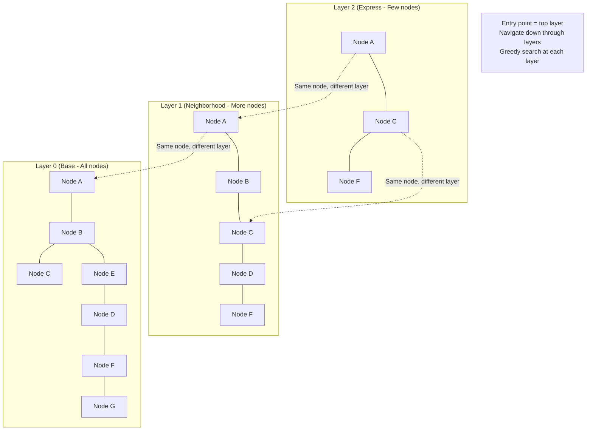

### HNSW Insert and Search Flow

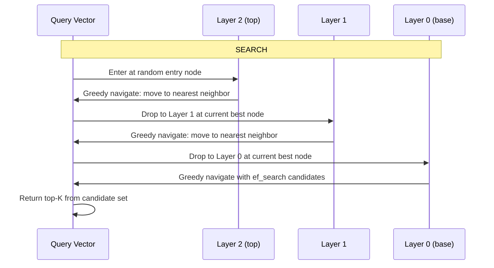

---

## 5. Internal Working

### HNSW Construction Algorithm

**Step 1: Determine the layer for a new node**

When inserting a new vector, its maximum layer is drawn from an exponential distribution:
$$l = \lfloor -\ln(\text{rand}()) \times m_L \rfloor$$

Where $m_L = 1/\ln(M)$ is the level multiplier. This ensures most nodes appear only at layer 0, fewer at layer 1, even fewer at layer 2, etc. — like a skip list distribution.

**Step 2: Find entry point and navigate down**

Start from the top layer's entry point. Navigate greedily to the nearest node at each layer. At the node's insertion layer, stop navigating and start building connections.

**Step 3: Connect to M nearest neighbors at each layer**

At each layer $\ell \leq l_{new}$, find the $M_{construction}$ nearest neighbors (using `efConstruction` candidates). Connect the new node bidirectionally to these neighbors.

If a node already has $M_{max}$ connections, prune the weakest connection using the **heuristic selection algorithm** (select connections that maximize coverage of different directions, not just the closest ones).

**Key Parameters**:
- `M`: Maximum number of connections per node per layer. Higher M = better recall, more memory and build time. Typical: 16–64.
- `efConstruction`: Size of the dynamic candidate list during build. Higher = better graph quality, slower build. Typical: 100–400.
- `efSearch`: Size of the candidate list during query. Higher = better recall, slower query. Typical: 16–128.

---

## 6. Mathematical Intuition

### Why HNSW Is O(log N)

In a well-constructed HNSW graph, the expected number of distance computations per query is:

$$C_{search} \approx \frac{1}{2} \log_{1/m_L}(N) \times C_{layer} + C_{base}$$

Where $C_{layer}$ is the cost to navigate one layer (approximately constant, depends on M) and $C_{base}$ is the cost to search layer 0 with $ef_{search}$ candidates.

The logarithmic term $\log(N)$ appears because the number of layers grows logarithmically with $N$: the probability of a node being in the top layer decreases exponentially with each higher layer.

**Recall–Speed Tradeoff**:
$$\text{Recall} \approx 1 - e^{-ef_{search} / k}$$

Increasing `efSearch` improves recall but linearly increases query time. The sweet spot for most applications is `efSearch = 64` (99%+ recall, 2–5ms queries on 1M vectors on CPU).

---

## 7. Implementation

### HNSW from Scratch (Simplified) and with hnswlib

```python
"""
HNSW understanding:
1. Conceptual Python implementation showing the key ideas
2. hnswlib usage (production C++ library)
3. Tuning guide with benchmarking
"""

import numpy as np
import hnswlib  # pip install hnswlib
from typing import List, Tuple, Dict, Optional
import time


# ─── hnswlib: The Best Pure HNSW Library ─────────────────────────────────────

class HNSWIndex:
    """
    Production HNSW index using hnswlib.
    
    hnswlib is a header-only C++ library with Python bindings.
    It is 2-3× faster than FAISS HNSW for typical workloads
    and supports incremental inserts and removes.
    
    Used internally by: ChromaDB, some Weaviate configurations.
    """

    def __init__(
        self,
        dim: int = 1536,
        max_elements: int = 1_000_000,
        M: int = 32,
        ef_construction: int = 200,
        ef_search: int = 64,
        metric: str = "cosine",
    ):
        self.dim = dim
        self.metric = metric
        self.ef_search = ef_search

        # Initialize HNSW index
        self.index = hnswlib.Index(space=metric, dim=dim)
        self.index.init_index(
            max_elements=max_elements,
            M=M,
            ef_construction=ef_construction,
            random_seed=42,
        )
        self.index.set_ef(ef_search)

        # Metadata store
        self._texts: Dict[int, str] = {}
        self._metadata: Dict[int, Dict] = {}

    def add(
        self,
        ids: List[int],
        embeddings: np.ndarray,
        texts: Optional[List[str]] = None,
        metadatas: Optional[List[Dict]] = None,
    ):
        """
        Add vectors with integer IDs.
        
        Note: hnswlib uses your provided integer IDs directly,
        unlike FAISS which uses sequential 0-based IDs.
        This makes ID management much simpler.
        """
        embeddings = embeddings.astype(np.float32)
        self.index.add_items(embeddings, ids)

        for i, doc_id in enumerate(ids):
            if texts:
                self._texts[doc_id] = texts[i]
            if metadatas:
                self._metadata[doc_id] = metadatas[i]

    def search(
        self,
        query: np.ndarray,
        k: int = 5,
    ) -> List[Tuple[int, float, str, Dict]]:
        """
        Search for k nearest neighbors.
        Returns list of (id, score, text, metadata) tuples.
        """
        query = query.astype(np.float32).reshape(1, -1)
        labels, distances = self.index.knn_query(query, k=k)

        results = []
        for label, dist in zip(labels[0], distances[0]):
            # hnswlib with cosine metric returns (1 - cosine_sim) as distance
            score = 1.0 - float(dist) if self.metric == "cosine" else -float(dist)
            results.append((
                int(label),
                score,
                self._texts.get(int(label), ""),
                self._metadata.get(int(label), {}),
            ))

        return results

    def delete(self, doc_id: int):
        """
        Mark a vector as deleted.
        hnswlib supports soft deletion — the vector stays in the graph
        but is excluded from search results.
        """
        self.index.mark_deleted(doc_id)
        self._texts.pop(doc_id, None)
        self._metadata.pop(doc_id, None)

    def save(self, path: str):
        self.index.save_index(f"{path}.hnsw")
        import pickle
        with open(f"{path}.meta.pkl", "wb") as f:
            pickle.dump({"texts": self._texts, "metadata": self._metadata}, f)

    @classmethod
    def load(cls, path: str, dim: int, max_elements: int) -> "HNSWIndex":
        import pickle
        obj = cls.__new__(cls)
        obj.index = hnswlib.Index(space="cosine", dim=dim)
        obj.index.load_index(f"{path}.hnsw", max_elements=max_elements)
        obj.index.set_ef(64)
        obj.dim = dim
        obj.metric = "cosine"
        obj.ef_search = 64
        with open(f"{path}.meta.pkl", "rb") as f:
            meta = pickle.load(f)
        obj._texts = meta["texts"]
        obj._metadata = meta["metadata"]
        return obj


# ─── HNSW Tuning Benchmarker ─────────────────────────────────────────────────

def benchmark_hnsw_parameters(
    docs: np.ndarray,
    queries: np.ndarray,
    ground_truth: np.ndarray,
    param_grid: List[Dict],
) -> List[Dict]:
    """
    Find optimal M and ef_search for your data.
    
    param_grid example:
    [
        {"M": 16, "ef_construction": 100, "ef_search": 32},
        {"M": 32, "ef_construction": 200, "ef_search": 64},
        {"M": 64, "ef_construction": 400, "ef_search": 128},
    ]
    """
    results = []
    n_docs, dim = docs.shape

    for params in param_grid:
        # Build index
        t0 = time.time()
        idx = hnswlib.Index(space="cosine", dim=dim)
        idx.init_index(
            max_elements=n_docs,
            M=params["M"],
            ef_construction=params["ef_construction"],
            random_seed=42,
        )
        idx.add_items(docs, list(range(n_docs)))
        build_time = time.time() - t0

        # Search
        idx.set_ef(params["ef_search"])
        t0 = time.time()
        labels, _ = idx.knn_query(queries, k=5)
        search_time_ms = (time.time() - t0) / len(queries) * 1000

        # Recall@1
        recall = np.mean(labels[:, 0] == ground_truth[:, 0])

        results.append({
            **params,
            "build_time_s": round(build_time, 2),
            "search_ms_per_query": round(search_time_ms, 3),
            "recall_at_1": round(recall, 4),
            "memory_mb": round(
                # Approximate: each node stores M connections at ~8 bytes each
                n_docs * params["M"] * 8 / 1e6, 1
            ),
        })

    return results
```

---

## 8. Tradeoffs

| Parameter | ↑ Increases | ↓ Decreases | Default |
|---|---|---|---|
| `M` | Recall, Memory, Build time | — | 32 |
| `efConstruction` | Graph quality, Build time | — | 200 |
| `efSearch` | Recall | Query speed | 64 |

**The fundamental HNSW tradeoff**: You set `efConstruction` once. You can tune `efSearch` at any time without rebuilding. This makes HNSW adaptable: build once with high `efConstruction`, then tune `efSearch` to meet your latency SLO.

---

## 9. Common Mistakes

❌ **Setting efSearch too low**: Default in many libraries is `ef=10`. This gives poor recall (< 90%). Always set `ef_search >= 64` for production.

❌ **Not pre-allocating `max_elements`**: hnswlib requires pre-declaring the maximum number of elements. Exceeding this causes an error. Set it 20% higher than your current corpus size.

❌ **Using HNSW for frequently changing data**: HNSW deletion is "soft" (marks as deleted, wastes graph space). Frequent deletions degrade the graph structure over time. Rebuild the index periodically.

---

## 10. Interview Preparation

**Junior**: "HNSW is a graph-based algorithm for fast approximate nearest neighbor search. It builds multiple layers, like a metro system — upper layers for fast long-range navigation, bottom layer for precise local search."

**Mid-level**: "HNSW builds a hierarchical graph using exponentially distributed node layer assignments. Each node connects to M nearest neighbors per layer. Search starts at the top layer, greedily navigates to the best node, then drops down. The key parameters are M (connectivity), efConstruction (build quality), and efSearch (query quality). Higher efSearch = better recall but slower queries. For production, I tune efSearch until I hit my p99 latency budget."

**Senior**: "HNSW is the right algorithm for 100K to 50M vectors with high recall requirements. Its O(log N) average query time and no-training requirement make it operationally simple. The critical failure mode: the graph degrades over many insertions and soft deletions, reducing recall. I implement periodic index rebuilds (nightly for high-churn corpora) and monitor recall drift using a held-out benchmark set — alert if recall drops more than 2% from baseline."

---

## 11. Practical Scenario

### Scenario: Real-Time Document Insertion

**Challenge**: A legal firm ingests new case documents throughout the day. They need a vector index that supports real-time insertions with consistent query latency.

**HNSW advantage**: Unlike IVF which requires retraining to handle new data well, HNSW supports incremental `add_items()` without retraining. New documents are immediately searchable.

**Implementation**:
```python
# Real-time insert pattern
async def ingest_new_document(doc: Document, index: HNSWIndex, embedding_service):
    embedding = await embedding_service.embed_single(doc.text)
    index.add(
        ids=[doc.id],
        embeddings=np.array([embedding]),
        texts=[doc.text],
        metadatas=[doc.metadata],
    )
    # Immediately searchable — no rebuild needed
```

---

## 12. Revision Sheet

- **HNSW** = multi-layer navigable small-world graph for ANN search
- **O(log N)** query time; **no training** needed; **incremental** inserts
- **M**: connections per node; **efConstruction**: build quality; **efSearch**: query quality
- **Deletion**: soft only (mark deleted); rebuild periodically for high-churn data
- **Recall**: 99%+ achievable with `efSearch=64`, `M=32`, `efConstruction=200`

---

---

# Chapter 3: IVF

---

## 1. Introduction

### What Is IVF?

**IVF** (Inverted File Index) is an approximate nearest neighbor algorithm that works by partitioning the vector space into a set of Voronoi cells (clusters), then at query time searching only the cells closest to the query vector.

The name "Inverted File" comes from Information Retrieval: the structure inverts the problem from "which cell does this vector belong to?" to "which vectors belong to this cell?" — just like an inverted index maps terms to documents.

IVF is the backbone of FAISS's production indexes (`IndexIVFFlat`, `IndexIVFPQ`, `IndexIVFSQ`) and is used in Milvus and pgvector for large-scale deployments.

### When to Use IVF vs HNSW

| Scenario | Use |
|---|---|
| < 50M vectors, high recall priority | HNSW |
| 50M–1B+ vectors | IVF (especially with PQ) |
| Frequent deletions | IVF (`remove_ids` supported) |
| Memory is severely constrained | IVF + PQ |
| GPU acceleration | IVF (FAISS-GPU is optimized for IVF) |

---

## 2. Historical Motivation

HNSW was published in 2016. IVF has been in FAISS since 2017 and was designed for a specific challenge HNSW struggles with: **billion-scale vectors on GPU**.

At Facebook/Meta scale — searching billions of video embeddings — HNSW's high memory overhead (storing the graph structure) becomes prohibitive. IVF with Product Quantization can compress 1 billion 128-dim float32 vectors from **512 GB** (flat) to **~15 GB** (IVF+PQ) while maintaining reasonable recall.

---

## 3. Real-World Analogy

### The Postal System

Imagine a country with 10 million addresses (vectors). You want to find the 5 addresses closest to a given location.

**IVF construction**: The postal service divides the country into 1000 postal zones (Voronoi cells). Each zone has a centroid — a representative city.

**IVF search**: Given your destination address (query), find the 3 nearest postal zone centroids. Look up all addresses in those 3 zones. Find the 5 closest addresses among them.

You searched 3 zones (~30,000 addresses) instead of all 10 million. The risk: if your destination is on the border between zones, you might miss the true nearest address in an adjacent zone. That's the recall loss of approximate search.

Increasing `nprobe` (checking more zones) reduces this risk at the cost of speed.

---

## 4. Visual Mental Model

### IVF: Clustering + Selective Search

```mermaid
flowchart TD
    subgraph "IVF Construction (Offline)"
        A[All Vectors] --> B[k-means clustering\nLearn n_lists centroids]
        B --> C[Assign each vector\nto nearest centroid]
        C --> D[Inverted lists:\ncentroid_i → [vec_a, vec_b, ...]]
    end

    subgraph "IVF Search (Online)"
        E[Query Vector] --> F[Find n_probe nearest\ncentroids to query]
        F --> G[Retrieve all vectors\nfrom those n_probe cells]
        G --> H[Brute-force search\nwithin retrieved vectors]
        H --> I[Top-K results]
    end
```

### Voronoi Cell Visualization

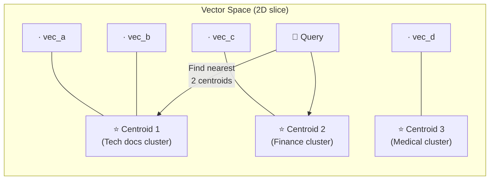

---

## 5. Internal Working

### IVF Step-by-Step

**Construction**:
1. Run k-means on a sample of your vectors to learn `n_lists` cluster centroids
2. Assign every vector to its nearest centroid
3. For each centroid, store an "inverted list" — a list of vector IDs assigned to it

**Search**:
1. Compute distance from query to all `n_lists` centroids
2. Select the `nprobe` closest centroids
3. Retrieve all vectors from those `nprobe` inverted lists
4. Brute-force search within the retrieved candidate set
5. Return top-K

**Recall vs Speed**:
- `nprobe=1`: Search only 1 cluster. Very fast, poor recall (~70%)
- `nprobe=8`: Search 8 clusters. Good speed, decent recall (~90%)
- `nprobe=n_lists`: Search all clusters. Same as flat search, 100% recall but slow

---

## 6. Mathematical Intuition

### Why k-means for IVF Training?

k-means minimizes the within-cluster sum of squared distances:
$$\text{WCSS} = \sum_{k=1}^{K} \sum_{x \in S_k} ||x - \mu_k||^2$$

This partitioning ensures that vectors within the same cluster are geometrically close. Therefore, the nearest neighbors of a query vector are likely in the same cluster as the query (or adjacent clusters). This is why IVF works: good clustering makes the partition structure meaningful.

**Critical training rule**: You need at least `39 × n_lists` vectors for training to produce good centroids. For `n_lists=4096` clusters: at least 160K training vectors.

---

## 7. Implementation

```python
"""
IVF index: the production choice for 1M-100M vector corpora.
"""
import numpy as np
import faiss
import time
from typing import List, Optional, Dict


class IVFVectorStore:
    """
    Production IVF vector store with automatic n_lists selection,
    nprobe tuning, and support for the three main IVF variants.
    """

    @staticmethod
    def recommended_n_lists(n_vectors: int) -> int:
        """
        Rule of thumb: n_lists ≈ sqrt(n_vectors).
        Capped at practical limits.
        """
        return min(4096, max(64, int(n_vectors ** 0.5)))

    def __init__(
        self,
        dim: int,
        n_vectors_expected: int,
        variant: str = "flat",   # "flat", "pq", "sq8"
        m_subvectors: int = 64,  # For PQ variant
    ):
        self.dim = dim
        n_lists = self.recommended_n_lists(n_vectors_expected)
        quantizer = faiss.IndexFlatIP(dim)

        if variant == "flat":
            self.index = faiss.IndexIVFFlat(
                quantizer, dim, n_lists, faiss.METRIC_INNER_PRODUCT
            )
        elif variant == "pq":
            # Product Quantization: extreme compression
            # m_subvectors bytes per vector (vs dim*4 for flat)
            assert dim % m_subvectors == 0, f"dim ({dim}) must be divisible by m ({m_subvectors})"
            self.index = faiss.IndexIVFPQ(quantizer, dim, n_lists, m_subvectors, 8)
        elif variant == "sq8":
            # Scalar Quantization 8-bit: 4× compression, minimal quality loss
            self.index = faiss.IndexIVFScalarQuantizer(
                quantizer, dim, n_lists,
                faiss.ScalarQuantizer.QT_8bit,
                faiss.METRIC_INNER_PRODUCT
            )

        self.n_lists = n_lists
        self.variant = variant
        self._trained = False
        self._metadata: Dict[int, Dict] = {}
        self._texts: Dict[int, str] = {}
        self._counter = 0

    def train(self, training_vectors: np.ndarray):
        """
        Train the IVF index.
        MUST be called before add().
        Requires at least 39 × n_lists vectors for good centroids.
        """
        min_train = 39 * self.n_lists
        if len(training_vectors) < min_train:
            print(f"WARNING: Training with {len(training_vectors)} vectors, "
                  f"recommended minimum is {min_train}")

        training_vectors = training_vectors.astype(np.float32)
        faiss.normalize_L2(training_vectors)

        t0 = time.time()
        self.index.train(training_vectors)
        print(f"Training complete in {time.time() - t0:.1f}s")
        self._trained = True

    def add(
        self,
        texts: List[str],
        embeddings: np.ndarray,
        metadatas: Optional[List[Dict]] = None,
    ):
        if not self._trained:
            raise RuntimeError("Call train() before add()")

        embeddings = embeddings.astype(np.float32)
        faiss.normalize_L2(embeddings)
        self.index.add(embeddings)

        for i, text in enumerate(texts):
            fid = self._counter + i
            self._texts[fid] = text
            self._metadata[fid] = metadatas[i] if metadatas else {}
        self._counter += len(texts)

    def search(
        self,
        query: np.ndarray,
        k: int = 5,
        nprobe: int = 32,
    ) -> List[Dict]:
        """
        Search with configurable nprobe.
        
        nprobe tradeoff:
        - nprobe = 1:          ~0.2ms, ~70% recall
        - nprobe = 16:         ~1ms,   ~92% recall
        - nprobe = n_lists:    ~50ms,  100% recall
        """
        self.index.nprobe = nprobe
        query = query.astype(np.float32).reshape(1, -1)
        faiss.normalize_L2(query)

        distances, indices = self.index.search(query, k)

        return [
            {
                "id": int(idx),
                "text": self._texts.get(int(idx), ""),
                "metadata": self._metadata.get(int(idx), {}),
                "score": float(d),
            }
            for d, idx in zip(distances[0], indices[0])
            if idx != -1
        ]

    def tune_nprobe(
        self,
        queries: np.ndarray,
        ground_truth: np.ndarray,
        target_recall: float = 0.95,
    ) -> int:
        """
        Find the minimum nprobe that achieves target_recall.
        Run this during development to calibrate nprobe for your data.
        """
        for nprobe in [1, 2, 4, 8, 16, 32, 64, 128, self.n_lists]:
            self.index.nprobe = nprobe
            _, retrieved = self.index.search(queries, 1)
            recall = np.mean(retrieved[:, 0] == ground_truth[:, 0])
            print(f"nprobe={nprobe:4d}: recall@1={recall:.3f}")
            if recall >= target_recall:
                print(f"✓ Target {target_recall} achieved at nprobe={nprobe}")
                return nprobe

        return self.n_lists
```

---

## 8. Tradeoffs

| IVF Variant | Memory per Vector | Recall | Build Time | Best For |
|---|---|---|---|---|
| IVFFlat | `dim × 4` bytes (full) | 98%+ | Medium | 1M-50M vecs, GPU |
| IVFSQ8 | `dim × 1` byte (4× compress) | 96%+ | Medium | Balanced compression |
| IVFPQ | M bytes (96× compress) | 85-95% | Slow | Billions of vectors |

---

## 9. Interview Preparation

**Junior**: "IVF clusters vectors into groups and only searches the nearest clusters at query time. The `nprobe` parameter controls how many clusters to search — higher nprobe means better recall but slower search."

**Mid-level**: "IVF requires training to learn cluster centroids before adding vectors. The number of lists (`n_lists`) should be approximately √N for N vectors. At query time, `nprobe` controls the recall-speed tradeoff. IVF+PQ is the go-to for billions of vectors — PQ compresses vectors from 6KB to 64 bytes using quantized subspace codes."

**Senior**: "I choose IVF over HNSW for corpora above 100M vectors, GPU-accelerated workloads (FAISS-GPU is most optimized for IVF), or when frequent deletions are needed (`remove_ids()`). The critical operational task is nprobe calibration: I run a nprobe sweep against a held-out benchmark to find the minimum nprobe achieving 95% recall, then monitor whether recall drifts as the corpus grows."

---

---

# Chapter 4: Pinecone

---

## 1. Introduction

### What Is Pinecone?

**Pinecone** is a fully managed, cloud-native vector database designed specifically for production AI applications. It abstracts away all the operational complexity of FAISS — no index tuning, no servers to manage, no HNSW parameters to configure.

Pinecone offers:
- **Serverless indexes**: Auto-scaling, pay per usage
- **Pod-based indexes**: Dedicated compute for predictable performance
- **Real-time CRUD**: Insert, update, delete vectors immediately
- **Metadata filtering**: Filter by any metadata field at query time
- **Namespaces**: Logical multi-tenancy within one index
- **Hybrid search**: Dense + sparse (BM25) in one API call

---

## 2. Historical Motivation

After FAISS proved the power of vector search, teams building production AI systems encountered a painful reality: FAISS is a library, not a production system.

Managing FAISS in production requires:
- Building custom persistence (S3 snapshots)
- Managing ID-to-metadata mapping separately
- Implementing metadata filtering post-search
- Building distributed sharding for large corpora
- Handling concurrent read/write with locking
- Monitoring index health and recall drift

Pinecone launched in 2021 to solve exactly this: "What if FAISS was a production database service?" — with CRUD, filtering, multi-tenancy, monitoring, and horizontal scaling built in.

---

## 3. Real-World Analogy

FAISS is like having a powerful search engine algorithm in a C++ library. You still have to build the building around it — the server, the disk storage, the API, the access control, the monitoring.

Pinecone is like **Elasticsearch for vectors** — the algorithm plus the complete production infrastructure, accessible via a REST API. You focus on your application; they handle the infrastructure.

---

## 4. Visual Mental Model

### Pinecone Architecture

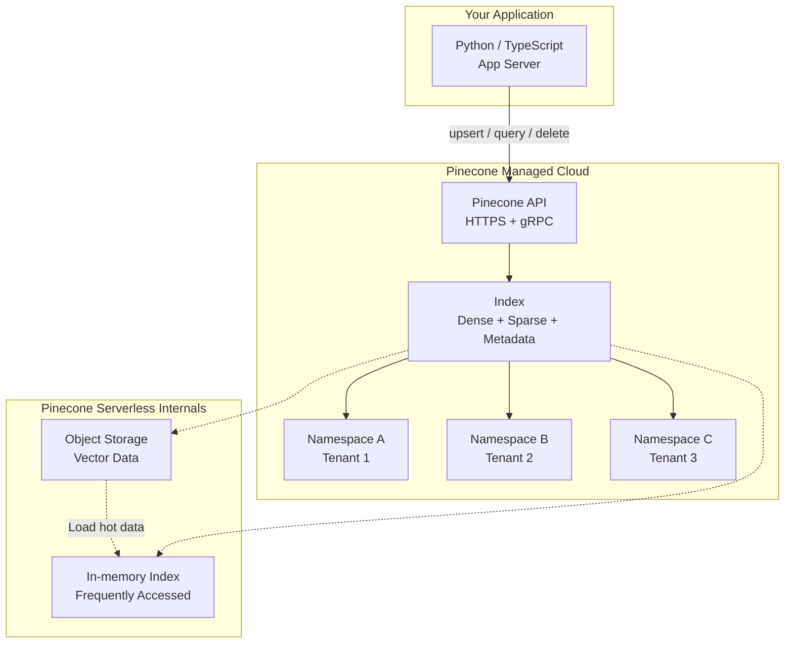

### Pinecone Index Namespace Pattern (Multi-tenancy)

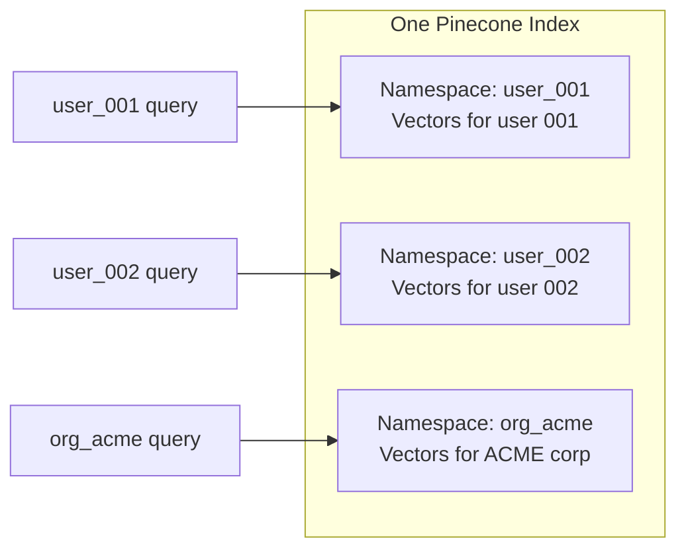

---

## 5. Internal Working

### Pinecone Index Types

**Serverless Indexes** (2024+):
- Scales to zero when idle; pay per query and storage
- Uses a tiered storage architecture: hot vectors in memory, cold in object storage
- Best for development, intermittent workloads, cost optimization

**Pod-based Indexes**:
- Dedicated compute pods (s1, p1, p2) with predictable latency
- s1 pods: storage-optimized (more vectors per pod)
- p1 pods: performance-optimized (lower latency)
- p2 pods: highest throughput

---

## 6. Implementation

### Production Pinecone RAG Integration

```python
"""
Production-grade Pinecone integration for RAG systems.
Covers: upsert, query, delete, namespace isolation, hybrid search.
"""
import asyncio
from typing import List, Dict, Optional, Tuple
from dataclasses import dataclass

import numpy as np
from pinecone import Pinecone, ServerlessSpec
from openai import AsyncOpenAI
from pydantic import BaseModel
import logging

logger = logging.getLogger(__name__)


class DocumentRecord(BaseModel):
    """Structured document record for Pinecone upsert."""
    id: str
    text: str
    namespace: str = "default"
    metadata: Dict = {}


class PineconeRAGService:
    """
    Production Pinecone service for RAG.

    Patterns demonstrated:
    - Namespace-based multi-tenancy
    - Async batch embedding with rate limiting
    - Metadata filtering at query time
    - Hybrid dense+sparse search
    - Upsert idempotency (safe to re-run ingestion)
    """

    EMBEDDING_MODEL = "text-embedding-3-small"
    EMBEDDING_DIM = 1536
    UPSERT_BATCH_SIZE = 100  # Pinecone max per upsert

    def __init__(
        self,
        api_key: str,
        index_name: str,
        cloud: str = "aws",
        region: str = "us-east-1",
    ):
        self.pc = Pinecone(api_key=api_key)
        self.index_name = index_name
        self.oai = AsyncOpenAI()

        # Create index if it doesn't exist
        if index_name not in [idx.name for idx in self.pc.list_indexes()]:
            self.pc.create_index(
                name=index_name,
                dimension=self.EMBEDDING_DIM,
                metric="cosine",
                spec=ServerlessSpec(cloud=cloud, region=region),
            )
            logger.info(f"Created Pinecone index: {index_name}")

        self.index = self.pc.Index(index_name)

    async def _embed_batch(self, texts: List[str]) -> np.ndarray:
        """Embed a batch of texts via OpenAI API."""
        response = await self.oai.embeddings.create(
            input=texts,
            model=self.EMBEDDING_MODEL,
        )
        return np.array(
            [item.embedding for item in sorted(response.data, key=lambda x: x.index)],
            dtype=np.float32,
        )

    async def ingest(self, documents: List[DocumentRecord]):
        """
        Ingest documents into Pinecone.

        - Processes in batches to respect API limits
        - Upsert is idempotent: re-running with same IDs updates vectors
        - Namespace isolates documents per tenant/user/project
        """
        logger.info(f"Ingesting {len(documents)} documents...")

        # Group by namespace for efficient upsert
        ns_groups: Dict[str, List[DocumentRecord]] = {}
        for doc in documents:
            ns_groups.setdefault(doc.namespace, []).append(doc)

        for namespace, ns_docs in ns_groups.items():
            # Process in embedding batches
            for i in range(0, len(ns_docs), self.UPSERT_BATCH_SIZE):
                batch = ns_docs[i : i + self.UPSERT_BATCH_SIZE]
                texts = [doc.text for doc in batch]
                embeddings = await self._embed_batch(texts)

                # Pinecone upsert format: list of (id, vector, metadata)
                vectors = [
                    {
                        "id": doc.id,
                        "values": emb.tolist(),
                        "metadata": {
                            **doc.metadata,
                            "text": doc.text,  # Store text in metadata for retrieval
                        },
                    }
                    for doc, emb in zip(batch, embeddings)
                ]

                self.index.upsert(vectors=vectors, namespace=namespace)
                logger.debug(f"Upserted {len(vectors)} vectors to namespace={namespace}")

        logger.info("Ingestion complete.")

    async def query(
        self,
        query_text: str,
        namespace: str = "default",
        top_k: int = 5,
        metadata_filter: Optional[Dict] = None,
        include_text: bool = True,
    ) -> List[Dict]:
        """
        Query Pinecone with optional metadata filtering.

        Metadata filter examples (Pinecone filter syntax):
        - {"source": "confluence"}
        - {"date": {"$gte": "2024-01-01"}}
        - {"department": {"$in": ["engineering", "product"]}}
        """
        query_emb = await self._embed_batch([query_text])
        query_vector = query_emb[0].tolist()

        response = self.index.query(
            vector=query_vector,
            top_k=top_k,
            namespace=namespace,
            filter=metadata_filter,
            include_metadata=True,
            include_values=False,  # Don't return raw vectors (saves bandwidth)
        )

        results = []
        for match in response.matches:
            result = {
                "id": match.id,
                "score": match.score,
                "metadata": match.metadata,
            }
            if include_text:
                result["text"] = match.metadata.get("text", "")
            results.append(result)

        return results

    async def delete(self, doc_ids: List[str], namespace: str = "default"):
        """Delete vectors by ID. Supports real-time deletion."""
        self.index.delete(ids=doc_ids, namespace=namespace)
        logger.info(f"Deleted {len(doc_ids)} vectors from namespace={namespace}")

    async def delete_namespace(self, namespace: str):
        """Delete all vectors in a namespace (e.g., when a user deletes their account)."""
        self.index.delete(delete_all=True, namespace=namespace)
        logger.info(f"Deleted all vectors in namespace={namespace}")

    def get_stats(self) -> Dict:
        """Get index statistics."""
        stats = self.index.describe_index_stats()
        return {
            "total_vectors": stats.total_vector_count,
            "namespaces": {
                ns: info.vector_count
                for ns, info in stats.namespaces.items()
            },
            "dimension": stats.dimension,
        }


# ─── Pinecone + Hybrid Search (Dense + Sparse) ───────────────────────────────

class PineconeHybridSearch:
    """
    Pinecone's native hybrid search combining dense + sparse vectors.
    Requires a Pinecone index with dotproduct metric.
    
    Uses BM25 for sparse vectors (pinecone-text library).
    """

    def __init__(self, api_key: str, index_name: str):
        from pinecone_text.sparse import BM25Encoder

        self.pc = Pinecone(api_key=api_key)
        self.index = self.pc.Index(index_name)
        self.bm25 = BM25Encoder()
        self.oai = AsyncOpenAI()

    def fit_bm25(self, corpus: List[str]):
        """Fit BM25 encoder on your corpus (call once during ingestion setup)."""
        self.bm25.fit(corpus)

    async def upsert_hybrid(self, texts: List[str], ids: List[str], metadatas: List[Dict]):
        """Upsert with both dense and sparse vectors."""
        # Dense embeddings
        response = await self.oai.embeddings.create(
            input=texts, model="text-embedding-3-small"
        )
        dense_vecs = [item.embedding for item in sorted(response.data, key=lambda x: x.index)]

        # Sparse BM25 encodings
        sparse_vecs = self.bm25.encode_documents(texts)

        vectors = [
            {
                "id": doc_id,
                "values": dense,
                "sparse_values": sparse,
                "metadata": {**meta, "text": text},
            }
            for doc_id, dense, sparse, text, meta
            in zip(ids, dense_vecs, sparse_vecs, texts, metadatas)
        ]

        self.index.upsert(vectors=vectors)

    async def hybrid_query(
        self,
        query: str,
        top_k: int = 5,
        alpha: float = 0.5,  # 0=pure sparse, 1=pure dense
    ) -> List[Dict]:
        """
        Hybrid query with alpha-weighted combination.
        alpha=0.5 is a neutral starting point.
        Tune alpha towards 1.0 for semantic queries, 0.0 for keyword queries.
        """
        # Dense query
        resp = await self.oai.embeddings.create(input=[query], model="text-embedding-3-small")
        dense_vec = resp.data[0].embedding

        # Sparse query
        sparse_vec = self.bm25.encode_queries([query])[0]

        # Pinecone hybrid query with alpha weighting
        result = self.index.query(
            vector=dense_vec,
            sparse_vector=sparse_vec,
            top_k=top_k,
            include_metadata=True,
            alpha=alpha,
        )

        return [
            {"id": m.id, "score": m.score, "text": m.metadata.get("text", "")}
            for m in result.matches
        ]
```

---

## 7. Tradeoffs

| Feature | Pinecone Serverless | Pinecone Pods | Self-hosted FAISS |
|---|---|---|---|
| Operational burden | None | None | High |
| Cold start latency | Yes (serverless) | No | No |
| Cost model | Per query + storage | Fixed (pod cost) | Infrastructure only |
| Metadata filtering | Native, fast | Native, fast | Post-filter only |
| Max scale | Billions (serverless) | Pod-limited | RAM-limited |
| Data residency | Cloud (compliance risk) | Cloud | On-prem possible |
| Fine-grained control | Low | Medium | Full |

---

## 8. Common Mistakes

❌ **Using one namespace for all tenants**: All vectors share search space, causing cross-tenant contamination. Use `namespace=user_id` for strict isolation.

❌ **Not setting metadata filters appropriately**: Without metadata filters, a query may return vectors from completely different contexts. Always filter by at least `tenant_id` or `project_id`.

❌ **Storing the full document text in metadata**: Pinecone metadata has a 40KB limit per vector. Store only the chunk text and a document reference. Retrieve full documents from a separate database (Postgres, S3).

---

## 9. Interview Preparation

**Junior**: "Pinecone is a managed cloud vector database. You upsert vectors with IDs and metadata, then query with a vector and optionally filter by metadata. It handles all the scaling and infrastructure."

**Mid-level**: "I use Pinecone namespaces for multi-tenant RAG — each user or organization gets their own namespace, so their vectors don't mix with others. Pinecone's metadata filtering runs server-side (not post-search), so it's efficient even at large scale. I use the Pinecone serverless tier for development and low-volume production, and pod-based for latency-critical high-volume workloads."

**Senior**: "The architectural decision between Pinecone and self-hosted (FAISS/Milvus) comes down to: (1) Data residency — regulated industries may require on-prem; (2) Cost at scale — Pinecone can be expensive at billion-vector scale; (3) Engineering bandwidth — Pinecone eliminates vector DB ops overhead worth ~0.5 FTE. I use Pinecone for initial production, measure actual query volume costs, and migrate to Milvus if Pinecone costs exceed the ops overhead of self-hosting."

---

## 10. Revision Sheet

- **Pinecone** = managed vector DB; no ops; CRUD; metadata filtering; namespaces
- **Serverless**: auto-scale, pay-per-use; **Pods**: predictable latency, fixed cost
- **Namespaces**: logical isolation within one index (multi-tenancy pattern)
- **Metadata filters**: server-side filtering using Pinecone filter syntax
- **Hybrid search**: native dense+sparse support with alpha weighting

---

---

# Chapter 5: Chroma

---

## 1. Introduction

### What Is Chroma?

**ChromaDB** is an open-source, AI-native vector database designed for simplicity and developer experience. It is the most popular choice for local development and prototyping, and can be deployed as a standalone server for production use.

Chroma's philosophy: **get from idea to working prototype in minutes**, not days. Zero configuration required for getting started.

Key features:
- **Ephemeral (in-memory)** or **Persistent** (SQLite-backed) modes
- **Built-in embedding**: Pass raw text, Chroma handles embedding automatically
- **Multi-modal**: Text, images, and custom embeddings
- **Filtering**: Metadata + document content filtering
- **Client-server**: Can run as a standalone HTTP server

### When to Use Chroma

- **Local development and prototyping**: Best-in-class for quick experiments
- **Small-to-medium production** (< 5M vectors): Reasonable performance
- **Teaching and demos**: Minimal setup, readable API
- **When you want embeddings handled automatically**: Pass raw text, get results

---

## 2. Historical Motivation

In 2022, every developer building with LangChain needed a vector store. FAISS required C++ expertise. Pinecone required cloud setup and API keys. Weaviate and Milvus required Docker and configuration.

Chroma launched with a single goal: **zero-friction vector storage**. Three lines of code to start:
```python
import chromadb
client = chromadb.Client()
collection = client.create_collection("my_docs")
```

It democratized vector search for AI application developers who didn't have deep infra expertise, becoming the default recommendation in LangChain and LlamaIndex documentation.

---

## 3. Visual Mental Model

### Chroma Architecture Modes

```mermaid
graph TD
    subgraph "Mode 1: In-Memory (Development)"
        A1[chromadb.Client()] --> B1[Collections in RAM\nLost on process exit]
    end

    subgraph "Mode 2: Persistent (Local Production)"
        A2["chromadb.PersistentClient\n(path='./chroma_db')"] --> B2[Collections in SQLite\nSurvives restarts]
    end

    subgraph "Mode 3: Client-Server (Team / Production)"
        A3["chromadb.HttpClient\n(host='localhost', port=8000)"] --> B3[ChromaDB Server\nDocker container]
        B3 --> B4[Shared persistent storage\nMultiple clients]
    end
```

---

## 4. Implementation

### Complete Chroma Usage

```python
"""
ChromaDB: from zero to production patterns.
Demonstrates all core operations with best practices.
"""
import chromadb
from chromadb.utils import embedding_functions
from typing import List, Dict, Optional
import uuid


# ─── Mode 1: Development (In-Memory) ─────────────────────────────────────────

def quick_demo():
    """60-second Chroma demo — nothing to install beyond pip."""
    client = chromadb.Client()  # In-memory, ephemeral

    # Create a collection with OpenAI embedding function
    oai_ef = embedding_functions.OpenAIEmbeddingFunction(
        api_key="YOUR_API_KEY",
        model_name="text-embedding-3-small"
    )
    collection = client.create_collection(
        name="knowledge_base",
        embedding_function=oai_ef,
        metadata={"hnsw:space": "cosine"}  # Use cosine distance
    )

    # Add documents — Chroma handles embedding automatically!
    collection.add(
        documents=["RAG stands for Retrieval-Augmented Generation.",
                   "HNSW is a graph-based ANN algorithm.",
                   "Pinecone is a managed vector database."],
        ids=["doc1", "doc2", "doc3"],
        metadatas=[{"source": "handbook"}, {"source": "handbook"}, {"source": "handbook"}]
    )

    # Query — pass raw text, Chroma embeds the query automatically
    results = collection.query(
        query_texts=["What is RAG?"],
        n_results=2,
        where={"source": "handbook"}  # Metadata filter
    )
    return results


# ─── Mode 2: Persistent (Local Production) ───────────────────────────────────

class ChromaVectorStore:
    """
    Production-grade ChromaDB wrapper.
    Uses persistent storage with custom embeddings (OpenAI).
    """

    def __init__(
        self,
        persist_path: str = "./chroma_db",
        collection_name: str = "documents",
        openai_api_key: Optional[str] = None,
    ):
        self.client = chromadb.PersistentClient(path=persist_path)

        # Use OpenAI embeddings (or any custom embedding function)
        embedding_fn = embedding_functions.OpenAIEmbeddingFunction(
            api_key=openai_api_key,
            model_name="text-embedding-3-small",
        ) if openai_api_key else embedding_functions.DefaultEmbeddingFunction()

        # get_or_create: idempotent — safe to run on startup
        self.collection = self.client.get_or_create_collection(
            name=collection_name,
            embedding_function=embedding_fn,
            metadata={
                "hnsw:space": "cosine",
                "hnsw:construction_ef": 200,  # Build quality
                "hnsw:search_ef": 100,         # Query quality
                "hnsw:M": 32,                  # Connectivity
            }
        )

    def add(
        self,
        texts: List[str],
        metadatas: Optional[List[Dict]] = None,
        ids: Optional[List[str]] = None,
    ) -> List[str]:
        """Add documents. Auto-generates IDs if not provided."""
        if ids is None:
            ids = [str(uuid.uuid4()) for _ in texts]
        if metadatas is None:
            metadatas = [{} for _ in texts]

        self.collection.add(
            documents=texts,
            metadatas=metadatas,
            ids=ids,
        )
        return ids

    def upsert(
        self,
        texts: List[str],
        ids: List[str],
        metadatas: Optional[List[Dict]] = None,
    ):
        """Update existing or insert new documents."""
        self.collection.upsert(
            documents=texts,
            ids=ids,
            metadatas=metadatas or [{} for _ in texts],
        )

    def query(
        self,
        query_text: str,
        n_results: int = 5,
        where: Optional[Dict] = None,       # Metadata filter
        where_document: Optional[Dict] = None,  # Content filter (contains keyword)
    ) -> List[Dict]:
        """
        Query with optional filtering.

        Metadata filter examples:
        - {"source": "confluence"}
        - {"$and": [{"date": {"$gte": "2024-01-01"}}, {"dept": "eng"}]}

        Document content filter:
        - {"$contains": "HNSW"}  (contains keyword)
        """
        results = self.collection.query(
            query_texts=[query_text],
            n_results=n_results,
            where=where,
            where_document=where_document,
            include=["documents", "metadatas", "distances"],
        )

        output = []
        if results["ids"] and results["ids"][0]:
            for doc_id, doc, meta, dist in zip(
                results["ids"][0],
                results["documents"][0],
                results["metadatas"][0],
                results["distances"][0],
            ):
                output.append({
                    "id": doc_id,
                    "text": doc,
                    "metadata": meta,
                    "score": 1 - dist,  # Convert distance to similarity
                })
        return output

    def delete(self, ids: List[str]):
        self.collection.delete(ids=ids)

    def count(self) -> int:
        return self.collection.count()

    def peek(self, n: int = 5) -> Dict:
        """Inspect the first N documents in the collection."""
        return self.collection.peek(n)


# ─── Mode 3: Client-Server (Docker Deployment) ───────────────────────────────

def connect_to_chroma_server(host: str = "localhost", port: int = 8000):
    """
    Connect to a running Chroma server.

    Start server with:
    docker run -p 8000:8000 chromadb/chroma

    Or with persistence:
    docker run -p 8000:8000 -v ./chroma_data:/chroma/chroma chromadb/chroma
    """
    return chromadb.HttpClient(host=host, port=port)


# ─── LangChain Integration ────────────────────────────────────────────────────

def langchain_chroma_example():
    """
    Chroma as a LangChain vector store.
    Most common usage pattern in LangChain-based RAG systems.
    """
    from langchain_chroma import Chroma
    from langchain_openai import OpenAIEmbeddings
    from langchain_core.documents import Document

    embeddings = OpenAIEmbeddings(model="text-embedding-3-small")

    # Create from documents
    docs = [
        Document(page_content="HNSW is an ANN algorithm.", metadata={"source": "handbook"}),
        Document(page_content="RAG uses retrieval + generation.", metadata={"source": "handbook"}),
    ]
    vectorstore = Chroma.from_documents(
        documents=docs,
        embedding=embeddings,
        persist_directory="./langchain_chroma",
        collection_name="my_collection",
    )

    # Use as retriever in RAG chain
    retriever = vectorstore.as_retriever(
        search_type="similarity",
        search_kwargs={"k": 3, "filter": {"source": "handbook"}},
    )
    return retriever
```

---

## 5. Tradeoffs

| Feature | Chroma | Pinecone | FAISS |
|---|---|---|---|
| Setup time | Seconds | Minutes (API key) | Hours (custom code) |
| Managed service | ❌ Self-host | ✅ Fully managed | ❌ Library only |
| Scale (vectors) | < 5M comfortably | Billions | RAM-limited |
| Multi-tenancy | Collections | Namespaces | Manual sharding |
| Metadata filtering | ✅ Full | ✅ Full | ❌ Post-filter only |
| Built-in embedding | ✅ Yes | ❌ No | ❌ No |
| Best for | Dev/Prototype | Production cloud | Custom/GPU/Perf |

---

## 6. Common Mistakes

❌ **Using ephemeral client in production**: `chromadb.Client()` stores data in memory only. Restarting loses everything. Use `chromadb.PersistentClient()` or the HTTP server.

❌ **Not configuring HNSW parameters**: Chroma uses HNSW internally. Default `hnsw:construction_ef=100` is fine for small corpora but reduces recall for large ones. Always set `hnsw:construction_ef=200` and `hnsw:search_ef=100` for production.

❌ **Using Chroma for billion-scale**: ChromaDB's SQLite metadata backend and single-machine HNSW index don't scale to hundreds of millions of vectors. Migrate to Pinecone/Milvus/Weaviate for that scale.

---

## 7. Interview Preparation

**Junior**: "Chroma is an open-source vector database. It's very easy to use — you can create a collection and add documents in three lines of code. It handles embedding automatically if you provide an embedding function."

**Mid-level**: "I use Chroma for local RAG development and testing. For production, I configure it in persistent mode with an OpenAI embedding function. The key HNSW settings I tune are hnsw:space=cosine, hnsw:M=32, and hnsw:search_ef=100. For multi-user systems, I create separate collections per user or use a metadata filter on user_id."

**Senior**: "Chroma is excellent for accelerating development velocity — the team can build and iterate on RAG logic without any infra setup. When moving to production, I evaluate: (1) If < 5M vectors and the team wants minimal ops, Chroma + Docker is fine; (2) For > 5M vectors or multi-region, I migrate to Pinecone or Weaviate; (3) I never use Chroma for regulated data without reviewing their data handling docs. The migration path from Chroma to Pinecone is straightforward — same API concepts, just different clients."

---

---

# Chapter 6: Weaviate

---

## 1. Introduction

### What Is Weaviate?

**Weaviate** is an open-source, cloud-native vector database with a uniquely rich feature set: native multi-modal support, built-in vectorization modules, GraphQL and REST APIs, knowledge graph capabilities, and enterprise-grade distributed deployment.

Unlike Chroma (developer-focused simplicity) or Pinecone (managed cloud), Weaviate positions itself as a **full AI-native database** that can replace both a traditional document store and a vector database.

Key differentiators:
- **Schema-first**: You define object classes with properties (like a NoSQL schema)
- **Built-in vectorizers**: Connect to OpenAI, Cohere, HuggingFace as Weaviate modules
- **BM25 + vector hybrid**: Native hybrid search in one query
- **Multi-modal**: Text, image, video, audio vectors in one index
- **Knowledge graph**: Objects can have references to other objects (like a graph database)
- **Replication & sharding**: True distributed mode for horizontal scaling

---

## 2. Historical Motivation

When vector databases emerged in 2021-2022, most were single-purpose: store and search vectors. But AI applications need more than just vectors:

- A document needs its text, its embedding, its metadata, and references to its source document.
- A product needs its embedding, price, availability, and references to its category.
- A user needs their embedding, their interactions, and references to their queries.

Weaviate recognized this and built an **object-oriented** vector database: objects have properties (like a document database), a vector (like a vector database), and references to other objects (like a graph database). This makes it particularly powerful for knowledge-graph-enhanced RAG (Graph RAG).

---

## 3. Visual Mental Model

### Weaviate Object Model

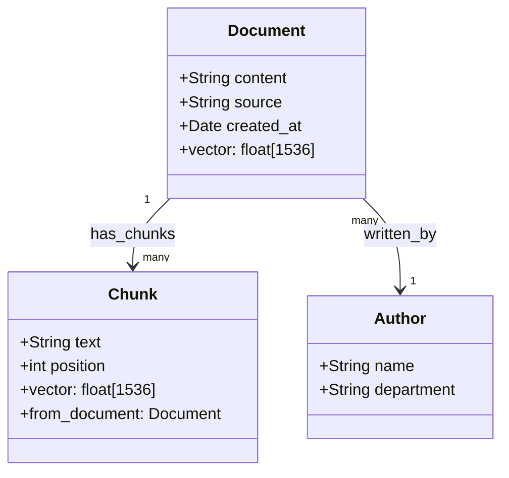

### Weaviate Architecture

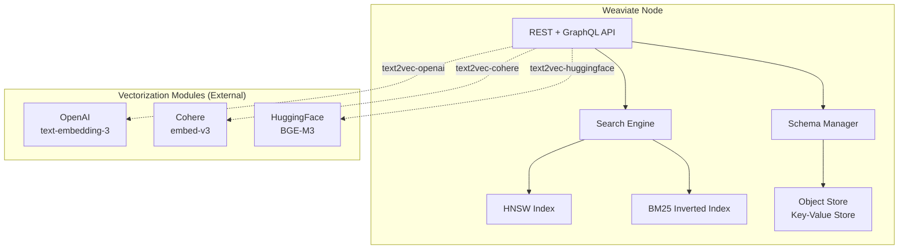

---

## 4. Implementation

### Production Weaviate RAG

```python
"""
Weaviate v4 client — modern API for production RAG.
pip install weaviate-client
"""
import weaviate
import weaviate.classes as wvc
from weaviate.classes.query import MetadataQuery, Filter
from typing import List, Dict, Optional
import os


class WeaviateRAGStore:
    """
    Production Weaviate vector store for RAG.
    
    Features:
    - Schema-first design with type safety
    - Native hybrid search (BM25 + vector)
    - Cross-references between objects (for parent-child chunking)
    - Batch import with automatic error recovery
    """

    def __init__(
        self,
        url: str = "http://localhost:8080",
        openai_api_key: Optional[str] = None,
    ):
        headers = {}
        if openai_api_key:
            headers["X-OpenAI-Api-Key"] = openai_api_key

        self.client = weaviate.connect_to_local(
            headers=headers,
        )

        self._ensure_schema()

    def _ensure_schema(self):
        """Create collections if they don't exist."""
        # Document class (parent — full document)
        if not self.client.collections.exists("Document"):
            self.client.collections.create(
                name="Document",
                vectorizer_config=wvc.config.Configure.Vectorizer.text2vec_openai(
                    model="text-embedding-3-small",
                ),
                properties=[
                    wvc.config.Property(name="title", data_type=wvc.config.DataType.TEXT),
                    wvc.config.Property(name="source", data_type=wvc.config.DataType.TEXT),
                    wvc.config.Property(name="created_at", data_type=wvc.config.DataType.DATE),
                ],
            )

        # Chunk class (child — text chunks with reference to parent)
        if not self.client.collections.exists("Chunk"):
            self.client.collections.create(
                name="Chunk",
                vectorizer_config=wvc.config.Configure.Vectorizer.text2vec_openai(
                    model="text-embedding-3-small",
                ),
                properties=[
                    wvc.config.Property(
                        name="content",
                        data_type=wvc.config.DataType.TEXT,
                        vectorize_property_name=True,  # Vectorize this field
                    ),
                    wvc.config.Property(name="position", data_type=wvc.config.DataType.INT),
                    wvc.config.Property(name="namespace", data_type=wvc.config.DataType.TEXT),
                ],
                references=[
                    wvc.config.ReferenceProperty(
                        name="fromDocument",
                        target_collection="Document",
                    )
                ],
                # Configure HNSW
                vector_index_config=wvc.config.Configure.VectorIndex.hnsw(
                    ef_construction=200,
                    max_connections=32,
                    ef=64,
                ),
            )

    def add_chunks(
        self,
        chunks: List[Dict],  # [{content, namespace, metadata}]
        document_id: Optional[str] = None,
    ) -> List[str]:
        """Batch import chunks with parent document reference."""
        collection = self.client.collections.get("Chunk")
        chunk_ids = []

        # Weaviate batch import — handles rate limiting and errors
        with collection.batch.dynamic() as batch:
            for chunk in chunks:
                props = {
                    "content": chunk["content"],
                    "namespace": chunk.get("namespace", "default"),
                    "position": chunk.get("position", 0),
                }
                refs = {}
                if document_id:
                    refs["fromDocument"] = document_id

                chunk_uuid = batch.add_object(properties=props, references=refs)
                chunk_ids.append(str(chunk_uuid))

        return chunk_ids

    def query(
        self,
        query_text: str,
        namespace: str = "default",
        limit: int = 5,
        alpha: float = 0.5,  # 0=BM25 only, 1=vector only, 0.5=hybrid
        filters: Optional[Filter] = None,
    ) -> List[Dict]:
        """
        Hybrid search: dense + BM25 in one native query.

        alpha parameter:
        - alpha=0.0: Pure BM25 keyword search
        - alpha=1.0: Pure vector semantic search
        - alpha=0.5: Equal weight hybrid
        """
        collection = self.client.collections.get("Chunk")

        # Build filter
        base_filter = Filter.by_property("namespace").equal(namespace)
        combined_filter = base_filter & filters if filters else base_filter

        response = collection.query.hybrid(
            query=query_text,
            alpha=alpha,
            limit=limit,
            filters=combined_filter,
            return_metadata=MetadataQuery(score=True, explain_score=True),
            return_references=[
                wvc.query.QueryReference(
                    link_on="fromDocument",
                    return_properties=["title", "source"],
                )
            ],
        )

        results = []
        for obj in response.objects:
            result = {
                "id": str(obj.uuid),
                "content": obj.properties.get("content", ""),
                "namespace": obj.properties.get("namespace", ""),
                "score": obj.metadata.score if obj.metadata else 0.0,
                "explain_score": obj.metadata.explain_score if obj.metadata else "",
            }
            # Include parent document info if available
            if obj.references and "fromDocument" in obj.references:
                parent = obj.references["fromDocument"].objects[0]
                result["source"] = parent.properties.get("source", "")
                result["title"] = parent.properties.get("title", "")
            results.append(result)

        return results

    def delete(self, chunk_id: str):
        collection = self.client.collections.get("Chunk")
        collection.data.delete_by_id(chunk_id)

    def close(self):
        self.client.close()
```

---

## 5. Tradeoffs

| Feature | Weaviate | Pinecone | Chroma |
|---|---|---|---|
| Open source | ✅ | ❌ | ✅ |
| Schema flexibility | Schema-first (structured) | Flexible | Flexible |
| Knowledge graph | ✅ Cross-references | ❌ | ❌ |
| Hybrid search | ✅ Native | ✅ Native | ❌ (manual) |
| Multi-modal | ✅ Native modules | ❌ | ❌ |
| Deployment | Self-host + Cloud | Cloud only | Self-host |
| Learning curve | High | Low | Very low |

---

## 6. Interview Preparation

**Junior**: "Weaviate is an open-source vector database with a schema-based design. It supports hybrid search (vector + keyword) natively and can connect to OpenAI or Cohere to automatically vectorize text during insert."

**Mid-level**: "I choose Weaviate over Chroma when I need cross-references between objects — like linking document chunks back to their parent document, or linking products to categories. This powers the Parent-Child retrieval pattern natively without a separate document database. The hybrid search with alpha parameter makes tuning dense vs. sparse tradeoff simple."

**Senior**: "Weaviate's knowledge graph capabilities make it uniquely suited for Graph RAG — where retrieval traverses relationships between objects rather than just finding similar vectors. For a legal RAG system: cases reference statutes, statutes reference regulations, cases reference prior cases. Weaviate can traverse these references during retrieval, enriching context beyond what pure vector search provides."

---

---

# Chapter 7: Milvus

---

## 1. Introduction

### What Is Milvus?

**Milvus** is an open-source, cloud-native vector database designed for **massive scale** — billions of vectors — with enterprise-grade distributed architecture. It is the most powerful self-hosted vector database available, with features and scale that rival managed services.

Milvus is built by Zilliz, who also offer **Zilliz Cloud** as the fully managed version.

Key features:
- **True distributed architecture**: Separate compute and storage, horizontal scaling
- **Multiple index types**: HNSW, IVF, ANNOY, DiskANN, and more
- **On-disk indexes**: DiskANN for vector search without loading into RAM
- **GPU acceleration**: CUDA-optimized indexes
- **Multi-vector**: Store multiple embedding vectors per entity
- **Partitioning**: Physical data partitioning for multi-tenancy at scale
- **Streaming**: Kafka integration for real-time ingestion

---

## 2. Historical Motivation

In 2019, Zilliz engineers at Facebook, LinkedIn, and Alibaba needed to search billions of product and content embeddings. No open-source tool could handle this scale.

They built Milvus from scratch with a **disaggregated architecture**: compute nodes (query nodes, data nodes) are separate from storage (object storage like S3). This means you can scale query capacity independently from data capacity — a critical requirement for billion-vector workloads.

Milvus 2.0 (2021) rebuilt everything as cloud-native microservices using Kubernetes, etcd for metadata, Pulsar/Kafka for streaming, and S3 for persistence. It became the de facto standard for self-hosted billion-scale vector search.

---

## 3. Visual Mental Model

### Milvus Distributed Architecture

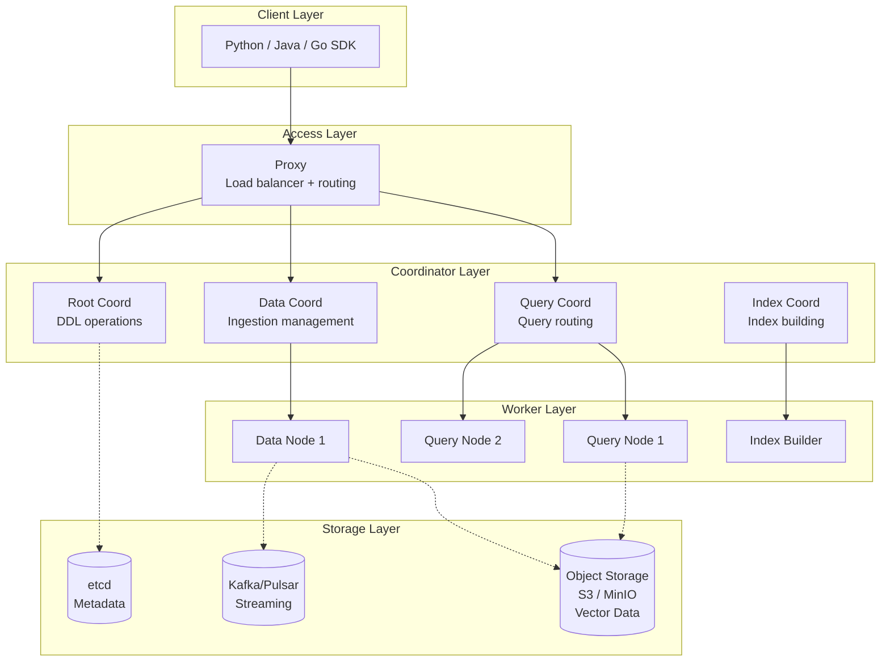

---

## 4. Implementation

### Production Milvus for Enterprise RAG

```python
"""
Milvus 2.x production usage.
pip install pymilvus
"""
from pymilvus import (
    connections,
    utility,
    FieldSchema,
    CollectionSchema,
    DataType,
    Collection,
    AnnSearchRequest,
    WeightedRanker,
)
import numpy as np
from typing import List, Dict, Optional
import logging

logger = logging.getLogger(__name__)

# ─── Connection ───────────────────────────────────────────────────────────────

def connect_milvus(host: str = "localhost", port: int = 19530):
    connections.connect(host=host, port=port)
    logger.info(f"Connected to Milvus at {host}:{port}")


# ─── Collection Schema ────────────────────────────────────────────────────────

def create_rag_collection(collection_name: str = "rag_documents", dim: int = 1536):
    """
    Create a Milvus collection for RAG.
    Schema matches a document chunk with dense + sparse embeddings.
    """
    if utility.has_collection(collection_name):
        logger.info(f"Collection {collection_name} already exists")
        return Collection(collection_name)

    fields = [
        FieldSchema(name="id", dtype=DataType.INT64, is_primary=True, auto_id=True),
        FieldSchema(name="doc_id", dtype=DataType.VARCHAR, max_length=256),
        FieldSchema(name="text", dtype=DataType.VARCHAR, max_length=65535),
        FieldSchema(name="namespace", dtype=DataType.VARCHAR, max_length=256),
        FieldSchema(name="source", dtype=DataType.VARCHAR, max_length=512),
        FieldSchema(name="dense_vector", dtype=DataType.FLOAT_VECTOR, dim=dim),
    ]

    schema = CollectionSchema(fields=fields, description="RAG document chunks")
    collection = Collection(name=collection_name, schema=schema)

    # Create HNSW index on the dense vector field
    collection.create_index(
        field_name="dense_vector",
        index_params={
            "metric_type": "COSINE",
            "index_type": "HNSW",
            "params": {"M": 32, "efConstruction": 200},
        }
    )

    # Create scalar index on namespace for fast filtering
    collection.create_index(field_name="namespace", index_name="namespace_idx")

    logger.info(f"Created collection: {collection_name}")
    return collection


# ─── CRUD Operations ─────────────────────────────────────────────────────────

class MilvusVectorStore:
    """
    Production Milvus vector store for large-scale RAG.
    """

    def __init__(
        self,
        collection_name: str = "rag_documents",
        dim: int = 1536,
        host: str = "localhost",
        port: int = 19530,
    ):
        connect_milvus(host, port)
        self.collection = create_rag_collection(collection_name, dim)
        self.collection.load()  # Load collection into query node memory
        self.dim = dim

    def insert(
        self,
        texts: List[str],
        embeddings: np.ndarray,
        namespaces: List[str],
        doc_ids: List[str],
        sources: Optional[List[str]] = None,
    ) -> List[int]:
        """Insert vectors into Milvus. Returns auto-generated primary IDs."""
        data = {
            "doc_id": doc_ids,
            "text": texts,
            "namespace": namespaces,
            "source": sources or [""] * len(texts),
            "dense_vector": embeddings.astype(np.float32).tolist(),
        }

        result = self.collection.insert(data)
        self.collection.flush()  # Ensure data is persisted and indexed
        return result.primary_keys

    def search(
        self,
        query_embedding: np.ndarray,
        namespace: str,
        top_k: int = 5,
        nprobe: int = 32,  # For IVF; ignored for HNSW
        ef: int = 64,       # For HNSW efSearch
    ) -> List[Dict]:
        """
        Vector search with namespace filtering.
        Milvus filter expressions are SQL-like.
        """
        search_params = {
            "metric_type": "COSINE",
            "params": {"ef": ef},  # HNSW ef_search
        }

        results = self.collection.search(
            data=[query_embedding.tolist()],
            anns_field="dense_vector",
            param=search_params,
            limit=top_k,
            expr=f'namespace == "{namespace}"',  # SQL-like filter expression
            output_fields=["doc_id", "text", "source", "namespace"],
        )

        output = []
        for hit in results[0]:
            output.append({
                "id": hit.id,
                "doc_id": hit.entity.get("doc_id"),
                "text": hit.entity.get("text"),
                "source": hit.entity.get("source"),
                "score": hit.score,
            })
        return output

    def delete(self, primary_ids: List[int]):
        """Delete vectors by primary key."""
        expr = f"id in {primary_ids}"
        self.collection.delete(expr)

    def get_partition_stats(self) -> Dict:
        """Get collection statistics."""
        stats = utility.get_collection_stats(self.collection.name)
        return {"row_count": stats["row_count"]}

    def compact(self):
        """
        Compact the collection: merge small segments, rebuild indexes.
        Run periodically after bulk deletions.
        """
        self.collection.compact()
        logger.info("Compaction triggered")


# ─── DiskANN: On-disk vector search for massive corpora ─────────────────────

def create_diskann_collection(collection_name: str, dim: int = 1536):
    """
    DiskANN index: searches vectors stored on SSD, not RAM.
    Enables 10-100× larger corpora for the same memory budget.
    
    Ideal for: billions of vectors with limited RAM.
    """
    fields = [
        FieldSchema(name="id", dtype=DataType.INT64, is_primary=True, auto_id=True),
        FieldSchema(name="text", dtype=DataType.VARCHAR, max_length=65535),
        FieldSchema(name="vector", dtype=DataType.FLOAT_VECTOR, dim=dim),
    ]
    schema = CollectionSchema(fields=fields)
    collection = Collection(name=collection_name, schema=schema)

    # DiskANN index — vectors stored on SSD
    collection.create_index(
        field_name="vector",
        index_params={
            "metric_type": "COSINE",
            "index_type": "DISKANN",
            "params": {
                "search_list_size": 128,  # Build quality
            },
        }
    )
    return collection
```

---

## 5. Tradeoffs

| Feature | Milvus | Pinecone | Weaviate |
|---|---|---|---|
| Scale | Billions (distributed) | Billions (managed) | Hundreds of millions |
| Ops complexity | High (K8s cluster) | None | Medium (Docker) |
| Cost (self-host) | Infrastructure only | — | Infrastructure only |
| GPU support | ✅ CUDA indexes | ❌ | ❌ |
| DiskANN (on-disk) | ✅ | ❌ | ❌ |
| Multi-vector per entity | ✅ | ❌ | ✅ |
| Streaming ingestion | ✅ Kafka/Pulsar | ❌ | ❌ |
| Best for | Enterprise, self-hosted | Enterprise, managed | Rich data model |

---

## 6. Interview Preparation

**Junior**: "Milvus is a distributed vector database for very large scale — billions of vectors. It separates compute and storage, so you can scale search capacity independently from data storage."

**Mid-level**: "I choose Milvus for self-hosted billion-scale workloads. Its disaggregated architecture means query nodes can be scaled independently from data nodes. I use HNSW indexes for high-recall search and DiskANN for corpora that don't fit in RAM. Partitioning by namespace handles multi-tenancy — each tenant's vectors are physically separated for both isolation and performance."

**Senior**: "Milvus is the right choice when data sovereignty, cost at scale, or GPU acceleration requires self-hosting. The operational cost is significant: Kubernetes management, etcd tuning, MinIO/S3 bucket management, Kafka lag monitoring. I typically evaluate Milvus against Pinecone using TCO (Total Cost of Ownership) at projected scale — Pinecone's simplicity often wins below 500M vectors, but Milvus's infrastructure cost advantage wins above 1B vectors for high-query-volume workloads."

---

---

# Summary: Part 7 — Vector Databases

This part built end-to-end understanding of the vector database ecosystem — from the core algorithms to the managed services that power production AI systems:

| Chapter | Core Insight |
|---|---|
| **1. FAISS** | The algorithmic engine under all vector DBs. Exact (Flat), graph-based (HNSW), cluster-based (IVF), compressed (PQ). Know when to use each. |
| **2. HNSW** | Multi-layer navigable small-world graph. O(log N) query, no training, incremental inserts. M / efConstruction / efSearch — the three tuning knobs. |
| **3. IVF** | Cluster-first search. Train centroids, assign vectors, search nprobe cells. Best for billion-scale with GPU or PQ compression. |
| **4. Pinecone** | Managed cloud vector DB. Namespaces for multi-tenancy, real-time CRUD, server-side metadata filtering, native hybrid search. |
| **5. Chroma** | Developer-first open-source vector DB. Zero-config for prototyping, persistent mode for small production, built-in embedding. |
| **6. Weaviate** | Schema-first, knowledge-graph-capable vector DB. Cross-references between objects, native hybrid search, multi-modal, perfect for Graph RAG. |
| **7. Milvus** | Enterprise-grade distributed vector DB. Billions of vectors, disaggregated compute/storage, GPU indexes, DiskANN, streaming ingestion. |

### Decision Matrix: Choosing a Vector Database

```
Starting a new project / prototyping?           → Chroma (in-memory)
Small team, production, cloud-ok?               → Pinecone (serverless)
Need knowledge graph / cross-references?        → Weaviate
Self-hosted, < 50M vectors, high recall?        → FAISS + HNSW wrapper
Self-hosted, data sovereignty, enterprise?      → Milvus
Billions of vectors, GPU, Kafka streaming?      → Milvus with DiskANN
```

The connecting thread: **every vector database is an implementation of approximate nearest neighbor search on top of persistent storage**. The algorithms (HNSW, IVF, PQ) are universal; the databases differ in their operational model (managed vs. self-hosted), their data model (schema-free vs. schema-first), and their scale targets (millions vs. billions).

---

*End of Part 7 — Vector Databases*
