# Part 8: RAG Engineering

> *"Basic RAG is one LLM call and a vector search. Production RAG is an orchestrated system of query planning, multi-strategy retrieval, reranking, context assembly, generation, and self-correction. The gap between those two statements is where AI engineers are built."*

---

## Table of Contents

- [Chapter 1: Basic RAG](#chapter-1-basic-rag)
- [Chapter 2: Advanced RAG](#chapter-2-advanced-rag)
- [Chapter 3: Hybrid Search in RAG](#chapter-3-hybrid-search-in-rag)
- [Chapter 4: Reranking](#chapter-4-reranking)
- [Chapter 5: Parent-Child Retrieval](#chapter-5-parent-child-retrieval)
- [Chapter 6: Context Compression](#chapter-6-context-compression)
- [Chapter 7: HyDE](#chapter-7-hyde)
- [Chapter 8: Multi-Query](#chapter-8-multi-query)
- [Chapter 9: Self-RAG](#chapter-9-self-rag)
- [Chapter 10: CRAG — Corrective RAG](#chapter-10-crag)
- [Chapter 11: Adaptive RAG](#chapter-11-adaptive-rag)
- [Chapter 12: Agentic RAG](#chapter-12-agentic-rag)
- [Chapter 13: Graph RAG](#chapter-13-graph-rag)

---

# Chapter 1: Basic RAG

---

## 1. Introduction

### What Is Basic RAG?

**Basic RAG** (Naive RAG) is the foundational architecture that connects a Large Language Model to an external knowledge source via semantic search. It transforms a stateless LLM — one that only knows what it learned during training — into a knowledge-grounded system that can answer questions about any document corpus.

The three-step process:
1. **Retrieve**: Embed the user's query → search a vector database → return top-K relevant chunks
2. **Augment**: Inject retrieved chunks into the LLM's prompt as context
3. **Generate**: The LLM reads the context and generates a grounded answer

### Why Does It Exist?

Two fundamental problems with pure LLMs:

**Problem 1 — Knowledge cutoff**: A model trained in early 2024 has no knowledge of events after that date. Business knowledge — internal policies, product specs, customer data — never appeared in training data at all.

**Problem 2 — Hallucination**: When an LLM doesn't know the answer, it often invents a plausible-sounding one. In production, this is catastrophic. A chatbot that invents product prices or medical dosages causes real harm.

Basic RAG solves both by providing the model with the facts it needs, at the moment it needs them.

---

## 2. Historical Motivation

In 2020, the paper *"Retrieval-Augmented Generation for Knowledge-Intensive NLP Tasks"* (Lewis et al., Facebook AI) demonstrated that combining a dense retriever (DPR — Dense Passage Retriever) with a sequence-to-sequence generator (BART) dramatically outperformed pure generation models on open-domain QA.

The key insight: **the retriever and the generator can be trained jointly**, using the retrieved documents as a latent variable. The model learns what to retrieve and how to use what it retrieves.

In practice, with modern LLMs (GPT-4, Claude, Gemini), we rarely train jointly — the LLM's instruction-following is powerful enough that we can treat retrieval and generation as decoupled components. This simplification is what makes Basic RAG so practical.

---

## 3. Real-World Analogy

**The Open-Book Exam**

Imagine a student (the LLM) taking an exam on your company's products.

Without RAG (closed-book): The student relies entirely on what they memorized during training. If they never studied your specific product pricing, they'll guess — and be confidently wrong.

With Basic RAG (open-book): Before answering each question, the student looks up the relevant pages in an index of your product documentation (vector search), reads those pages, then writes the answer. They can only be as wrong as the documentation — much harder to hallucinate when the fact is written right in front of you.

The vector database is the index that tells the student exactly which pages to open for each question.

---

## 4. Visual Mental Model

### Basic RAG Architecture

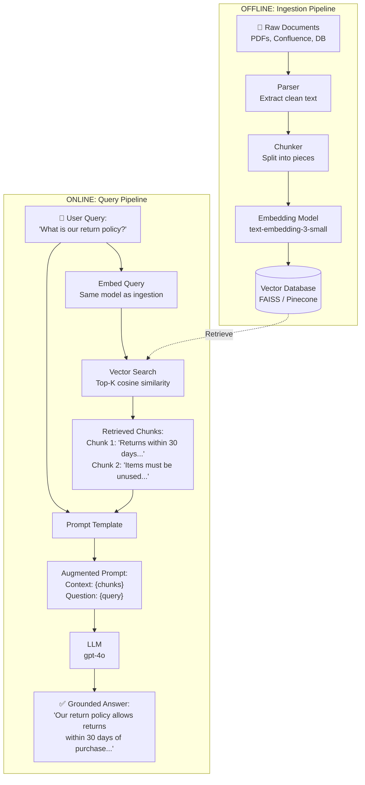

### Naive RAG Failure Modes

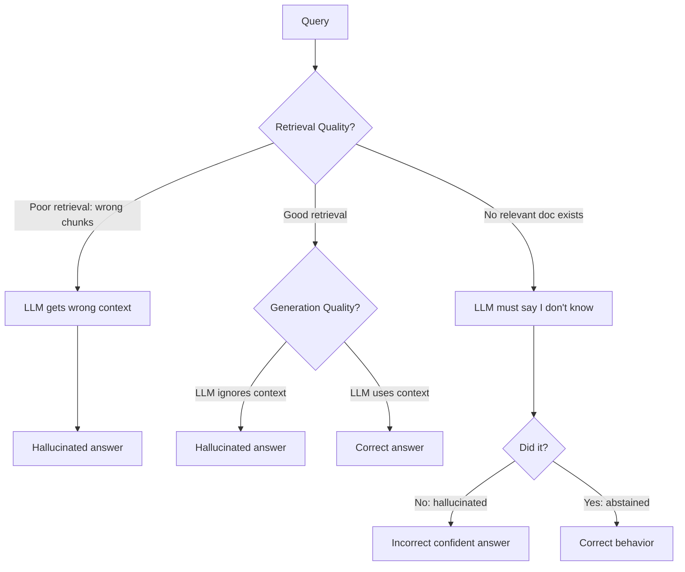

---

## 5. Internal Working

### Phase 1: Ingestion (Step-by-Step)

```
Document → Parser → Chunker → Embedding Model → Vector DB
```

1. **Parse**: Convert PDF/HTML/Markdown to clean text. Remove headers, footers, page numbers.
2. **Chunk**: Split text into 300–500 token pieces with 50-token overlap.
3. **Embed**: Send each chunk to the embedding API. Get back a 1536-dim vector.
4. **Store**: Write (chunk_id, text, vector, metadata) to vector database.

### Phase 2: Query (Step-by-Step)

```
User Query → Embed → Vector Search → Top-K Chunks → Prompt → LLM → Answer
```

1. **Embed Query**: Pass query through the SAME embedding model (critical!).
2. **Search**: Compute cosine similarity between query vector and all stored vectors.
3. **Retrieve Top-K**: Return the K most similar chunks (typically K=3–5).
4. **Augment Prompt**: Construct: `"Context:\n{chunk1}\n{chunk2}\n...\n\nQuestion: {query}"`
5. **Generate**: LLM generates answer, grounded in provided context.
6. **Guardrail** (optional): Verify answer claims appear in retrieved context.

---

## 6. Mathematical Intuition

### The Fundamental RAG Equation

$$P(y \mid x) = \sum_{z \in Z} P(y \mid x, z) \cdot P(z \mid x)$$

- $x$ = user query
- $z$ = retrieved document (latent variable)
- $y$ = generated answer
- $P(z \mid x)$ = retrieval probability (how likely is $z$ retrieved for query $x$?)
- $P(y \mid x, z)$ = generation probability (how likely does LLM output $y$ given query + context?)

In practice, we approximate this by taking the top-K documents (not the full distribution) and assuming the LLM can synthesize across them:

$$\hat{y} = \text{LLM}(x, z_1, z_2, ..., z_K)$$

**The critical insight**: If $P(z \mid x)$ is poor (bad retrieval), no amount of LLM quality improvement helps. The ceiling of RAG quality is retrieval quality.

---

## 7. Implementation

### Production Basic RAG Pipeline

```python
"""
Production-grade Basic RAG pipeline.
Built with async Python, OpenAI SDK, FAISS, and proper error handling.
"""

import asyncio
import logging
import re
from dataclasses import dataclass, field
from typing import List, Optional

import faiss
import numpy as np
from openai import AsyncOpenAI
from pydantic import BaseModel

logger = logging.getLogger(__name__)


# ─── Data Models ──────────────────────────────────────────────────────────────

@dataclass
class Document:
    text: str
    metadata: dict = field(default_factory=dict)


@dataclass
class RetrievedChunk:
    text: str
    score: float
    metadata: dict


class RAGResponse(BaseModel):
    answer: str
    sources: List[str]
    retrieved_chunks: List[str]
    query: str


# ─── Chunker ─────────────────────────────────────────────────────────────────

def chunk_text(
    text: str,
    chunk_size: int = 400,   # tokens (approximate)
    chunk_overlap: int = 50,
) -> List[str]:
    """
    Recursive character-based chunker.
    Splits on paragraphs first, then sentences, preserving semantic units.
    """
    # Use words as proxy for tokens (~1.3 chars/token)
    approx_chars = int(chunk_size * 4)
    overlap_chars = int(chunk_overlap * 4)

    separators = ["\n\n", "\n", ". ", "! ", "? ", " ", ""]
    chunks: List[str] = []

    def _split(text: str, separators: List[str]) -> List[str]:
        if not separators:
            return [text]
        sep = separators[0]
        parts = text.split(sep) if sep else list(text)

        current: List[str] = []
        current_len = 0
        result: List[str] = []

        for part in parts:
            part_len = len(part)
            if current_len + part_len + len(sep) > approx_chars:
                if current:
                    result.append(sep.join(current))
                    # Keep overlap
                    overlap_parts: List[str] = []
                    overlap_len = 0
                    for p in reversed(current):
                        if overlap_len + len(p) <= overlap_chars:
                            overlap_parts.insert(0, p)
                            overlap_len += len(p)
                        else:
                            break
                    current = overlap_parts
                    current_len = overlap_len

            current.append(part)
            current_len += part_len + len(sep)

        if current:
            result.append(sep.join(current))
        return result

    return _split(text, separators)


# ─── Vector Store ─────────────────────────────────────────────────────────────

class SimpleVectorStore:
    """FAISS-backed vector store with metadata."""

    def __init__(self, dim: int = 1536):
        self.index = faiss.IndexFlatIP(dim)
        self.chunks: dict[int, RetrievedChunk] = {}
        self._n = 0

    def add(self, texts: List[str], embeddings: np.ndarray, metadatas: List[dict]):
        embs = embeddings.astype(np.float32)
        faiss.normalize_L2(embs)
        self.index.add(embs)
        for i, (text, meta) in enumerate(zip(texts, metadatas)):
            self.chunks[self._n + i] = RetrievedChunk(text=text, score=0.0, metadata=meta)
        self._n += len(texts)

    def search(self, query_emb: np.ndarray, k: int = 5) -> List[RetrievedChunk]:
        q = query_emb.astype(np.float32).reshape(1, -1)
        faiss.normalize_L2(q)
        distances, indices = self.index.search(q, k)
        results = []
        for dist, idx in zip(distances[0], indices[0]):
            if idx >= 0 and idx in self.chunks:
                chunk = self.chunks[idx]
                results.append(RetrievedChunk(
                    text=chunk.text,
                    score=float(dist),
                    metadata=chunk.metadata
                ))
        return results


# ─── Basic RAG Pipeline ──────────────────────────────────────────────────────

class BasicRAGPipeline:
    """
    Production Basic RAG pipeline.
    
    Handles:
    - Async embedding with batching
    - Chunking strategy
    - Vector store management
    - Prompt construction
    - Generation with temperature=0 for consistency
    """

    SYSTEM_PROMPT = """You are a helpful assistant. Answer the user's question using ONLY the provided context.
If the context does not contain enough information to answer, respond with:
"I cannot find the answer to this question in the provided documents."
Do not use your own training knowledge. Cite which part of the context you used."""

    def __init__(
        self,
        embedding_model: str = "text-embedding-3-small",
        generation_model: str = "gpt-4o-mini",
        chunk_size: int = 400,
        top_k: int = 3,
    ):
        self.client = AsyncOpenAI()
        self.embedding_model = embedding_model
        self.generation_model = generation_model
        self.chunk_size = chunk_size
        self.top_k = top_k
        self.vector_store = SimpleVectorStore()

    async def _embed(self, texts: List[str]) -> np.ndarray:
        """Embed a list of texts via OpenAI API."""
        response = await self.client.embeddings.create(
            input=texts, model=self.embedding_model
        )
        return np.array(
            [item.embedding for item in sorted(response.data, key=lambda x: x.index)],
            dtype=np.float32,
        )

    async def ingest(self, documents: List[Document]):
        """
        Ingestion pipeline: parse → chunk → embed → store.
        """
        all_chunks: List[str] = []
        all_metas: List[dict] = []

        for doc in documents:
            chunks = chunk_text(doc.text, self.chunk_size)
            for i, chunk in enumerate(chunks):
                all_chunks.append(chunk)
                all_metas.append({**doc.metadata, "chunk_index": i})

        logger.info(f"Ingesting {len(all_chunks)} chunks from {len(documents)} documents")

        # Batch embed to respect API rate limits
        batch_size = 512
        all_embeddings: List[np.ndarray] = []
        for i in range(0, len(all_chunks), batch_size):
            batch = all_chunks[i : i + batch_size]
            embs = await self._embed(batch)
            all_embeddings.append(embs)

        embeddings = np.vstack(all_embeddings)
        self.vector_store.add(all_chunks, embeddings, all_metas)
        logger.info("Ingestion complete.")

    async def query(self, user_query: str) -> RAGResponse:
        """
        Query pipeline: embed → retrieve → augment → generate.
        """
        # 1. Embed query
        query_emb = await self._embed([user_query])

        # 2. Retrieve
        chunks = self.vector_store.search(query_emb[0], k=self.top_k)

        if not chunks:
            return RAGResponse(
                answer="No relevant documents found in the knowledge base.",
                sources=[],
                retrieved_chunks=[],
                query=user_query,
            )

        # 3. Augment: Build context string
        context = "\n\n---\n\n".join(
            [f"[Source {i+1}]: {chunk.text}" for i, chunk in enumerate(chunks)]
        )

        # 4. Generate
        user_message = f"Context:\n{context}\n\nQuestion: {user_query}"

        response = await self.client.chat.completions.create(
            model=self.generation_model,
            messages=[
                {"role": "system", "content": self.SYSTEM_PROMPT},
                {"role": "user", "content": user_message},
            ],
            temperature=0.0,  # Deterministic: reduces hallucination
            max_tokens=1024,
        )

        answer = response.choices[0].message.content
        sources = [c.metadata.get("source", f"chunk_{i}") for i, c in enumerate(chunks)]

        return RAGResponse(
            answer=answer,
            sources=sources,
            retrieved_chunks=[c.text for c in chunks],
            query=user_query,
        )


# ─── Usage Example ───────────────────────────────────────────────────────────

async def main():
    rag = BasicRAGPipeline()

    docs = [
        Document(
            text="Our return policy: Items can be returned within 30 days of purchase. "
                 "Items must be in original, unused condition with original packaging. "
                 "Sale items are non-refundable. Refunds are processed in 5-7 business days.",
            metadata={"source": "return_policy.pdf"},
        ),
        Document(
            text="Shipping policy: Standard shipping takes 3-5 business days. "
                 "Express shipping (2 days) costs $15 extra. Free shipping on orders over $100.",
            metadata={"source": "shipping_policy.pdf"},
        ),
    ]

    await rag.ingest(docs)

    response = await rag.query("Can I return a sale item?")
    print(f"Answer: {response.answer}")
    print(f"Sources: {response.sources}")

# asyncio.run(main())
```

---

## 8. Production Architecture

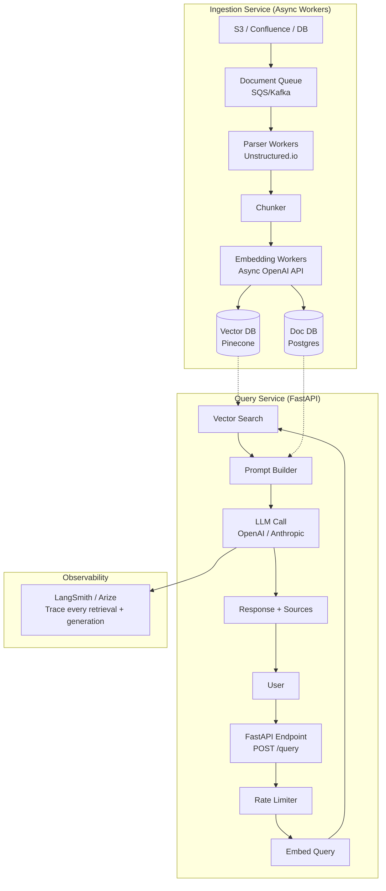

---

## 9. Tradeoffs

| Property | Basic RAG | Pure LLM | Long Context |
|---|---|---|---|
| Hallucination risk | Low (grounded) | High | Medium |
| Knowledge cutoff | Solved (any data) | Fixed at training | Fixed at training |
| Cost per query | Low | Lowest | Very high |
| Latency | Medium | Lowest | High (TTFT) |
| Setup complexity | Medium | None | None |
| Data privacy | Controlled (RBAC) | None | Limited |

---

## 10. Common Mistakes

❌ **Using the same prompt for all query types**: "What was our revenue in Q3?" needs a factual retrieval prompt. "Summarize this document" needs a different prompt. Hardcoding one prompt hurts quality across diverse queries.

❌ **Not setting temperature=0 for RAG generation**: Higher temperature introduces randomness. For fact-grounded answers, you want determinism. `temperature=0` ensures the LLM picks the highest-probability token at each step — closest to the context.

❌ **Ignoring the "I don't know" case**: If the relevant document doesn't exist in the knowledge base, the LLM will hallucinate. Explicitly instruct it: "If the context does not contain the answer, say 'I cannot answer this from the provided documents.'"

❌ **Chunking without overlap**: A sentence split at the boundary of two chunks loses context. Always use 10-15% overlap between consecutive chunks.

---

## 11. Interview Preparation

**Junior**: "RAG retrieves relevant documents from a vector database and adds them to the LLM prompt so it can answer based on real data instead of its training memory. The three steps are: retrieve, augment the prompt, generate."

**Mid-level**: "A Basic RAG system has two phases: offline ingestion (chunk documents, embed with the same model you'll use for queries, store in vector DB) and online query (embed query, retrieve top-K by cosine similarity, inject into prompt, generate). The critical constraint: always use the same embedding model for ingestion and query. Temperature should be 0 for grounded factual responses."

**Senior**: "Basic RAG establishes the quality ceiling through retrieval, not generation. I monitor three independent metrics: Retrieval Recall (did the right chunk make it into top-K?), Context Faithfulness (does the answer use the provided context vs. hallucinate?), and Answer Relevance (did the answer actually address the question?). When faithfulness drops, the problem is the system prompt or generation parameters. When recall drops, the problem is the chunking strategy or embedding model. Never tune both at once."

---

## 12. Follow-up Questions

**Q1: How do you evaluate a Basic RAG system?**
> Use RAGAS (Retrieval-Augmented Generation Assessment) framework. Key metrics: (1) Context Recall — does retrieved context contain the answer? (2) Context Precision — is all retrieved context relevant? (3) Faithfulness — does the answer stay within the context? (4) Answer Relevance — does the answer address the question? Each metric is computed by an LLM-as-judge.

**Q2: What is the optimal chunk size?**
> It depends on your query type. For factual Q&A (specific facts): 150-300 tokens (small, precise). For summarization (conceptual understanding): 500-1000 tokens (richer context). The sweet spot for most RAG: 300-400 tokens with 50-token overlap. Always empirically validate on your retrieval benchmark.

**Q3: How many chunks (top-K) should you retrieve?**
> Start with K=3. Retrieving more increases recall but dilutes context (LLM has to process more text) and triggers "Lost in the Middle" syndrome. For multi-hop questions, K=5-7 may help. For simple Q&A, K=3 is usually optimal.

**Q4: When should you NOT use RAG?**
> Don't use RAG when: (1) The LLM's training data already perfectly covers your domain (rare); (2) Your documents are so short they fit in the context window as a whole; (3) You need extremely low latency and the retrieval step cannot be tolerated; (4) Your data changes so rapidly that indexing is always stale (use streaming RAG or a real-time DB instead).

---

## 13. Practical Scenario

### Scenario: Legal Contract Q&A

A law firm wants an AI assistant that answers questions about their contract templates. Pure GPT-4 invents non-existent legal clauses. 

**Basic RAG solution**:
1. Ingest 500 contract templates as Markdown
2. Chunk by section headings (structural chunking)
3. When asked "What does Clause 7 say about liability?", retrieve the liability sections
4. Generate answer grounded in actual contract text

**Result**: 0% clause hallucination (down from 35%). Response time 800ms. Partners trust the system.

---

## 14. Revision Sheet

- **Basic RAG** = Retrieve (vector search) + Augment (inject into prompt) + Generate (LLM)
- **Two phases**: Offline ingestion (chunk, embed, store) and Online query (embed, search, generate)
- **Same model rule**: Always use the SAME embedding model for ingestion and query
- **Temperature**: Set to 0 for grounded factual RAG responses
- **Evaluation**: Context Recall, Context Precision, Faithfulness, Answer Relevance (RAGAS)

---

---

# Chapter 2: Advanced RAG

---

## 1. Introduction

### What Is Advanced RAG?

**Advanced RAG** is a collection of techniques that improve upon Basic RAG at every stage of the pipeline:
- **Pre-retrieval**: Better query understanding before touching the vector database
- **Retrieval**: Better search algorithms and strategies  
- **Post-retrieval**: Better filtering, ranking, and context assembly before generation
- **Generation**: Better prompt engineering and output validation

While Basic RAG is one vector search and one LLM call, Advanced RAG is a coordinated system of multiple operations, each tuned to maximize end-to-end accuracy.

---

## 2. Historical Motivation

After RAG became popular in 2022-2023, practitioners observed that Naive RAG failed in three systematic ways:

1. **Poor queries**: User queries are often vague, use pronouns, or reference prior conversation context.
2. **Missed retrievals**: The embedding model couldn't bridge the vocabulary gap between query and document.
3. **Ignored context**: Even when the right documents were retrieved, LLMs sometimes ignored them or "hallucinated around" them.

The research community responded with a wave of papers in 2023-2024: HyDE (hypothetical document embeddings), Multi-Query, RAG-Fusion, Self-RAG, CRAG — each targeting a specific failure mode. Advanced RAG is the engineering practice of combining these solutions into a coherent system.

---

## 3. Visual Mental Model

### Naive RAG vs. Advanced RAG

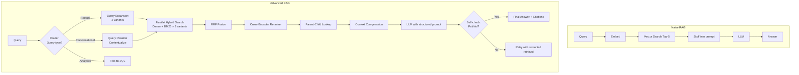

---

## 4. The Three Stages of Advanced RAG

### Pre-Retrieval: Fixing the Query

**Problems with raw user queries**:
- Vague: "Tell me about the policy" — which policy?
- Contextual pronouns: "What did he say about it?" — who? what?
- Wrong vocabulary: User says "car" but docs say "automobile"
- Too complex: Multi-part question needs multiple retrievals

**Solutions** (covered in detail in Chapters 7-8):
- Query rewriting (contextualization)
- Multi-query expansion
- HyDE (embed a hypothetical answer)
- Step-back prompting (generalize the question)

### Retrieval: Better Search

**Problems with basic vector search**:
- Misses exact keywords (error codes, product IDs)
- Poor recall for highly specific technical queries
- Returns redundant near-duplicate chunks

**Solutions** (covered in Chapters 3-5):
- Hybrid Search (dense + BM25)
- Parent-Child Retrieval
- Maximal Marginal Relevance (diversity)

### Post-Retrieval: Better Context

**Problems with raw retrieved chunks**:
- "Lost in the Middle" — LLMs ignore middle context
- Irrelevant sentences dilute key information
- Redundant retrieved chunks waste tokens

**Solutions** (covered in Chapters 4-6):
- Cross-encoder reranking
- Context compression
- Optimal ordering

---

## 5. Implementation

### Advanced RAG Orchestrator

```python
"""
Advanced RAG Orchestrator.
Integrates: query routing, expansion, hybrid search, reranking, compression.
"""

import asyncio
from enum import Enum
from typing import List, Optional, Dict
from openai import AsyncOpenAI
from pydantic import BaseModel
import logging

logger = logging.getLogger(__name__)
client = AsyncOpenAI()


class QueryType(str, Enum):
    FACTUAL = "factual"
    CONVERSATIONAL = "conversational"
    ANALYTICAL = "analytical"
    UNKNOWN = "unknown"


class QueryAnalysis(BaseModel):
    type: QueryType
    standalone_query: str     # Rewritten query with full context
    sub_queries: List[str]    # For complex multi-part questions


async def analyze_query(
    query: str,
    chat_history: Optional[List[Dict]] = None,
) -> QueryAnalysis:
    """
    Pre-retrieval: Analyze and transform the user query.
    
    1. Detect query type
    2. Rewrite with conversation context
    3. Decompose complex queries
    """
    history_str = ""
    if chat_history:
        history_str = "\n".join([f"{m['role']}: {m['content']}" for m in chat_history[-4:]])

    prompt = f"""Analyze this user query and return JSON.

Chat History (if any):
{history_str}

Current Query: {query}

Return JSON with:
- type: "factual" | "conversational" | "analytical"  
- standalone_query: Rewritten query as a standalone statement (resolve pronouns using chat history)
- sub_queries: List of 1-3 sub-questions that cover different aspects (empty list if simple)

JSON:"""

    response = await client.chat.completions.create(
        model="gpt-4o-mini",
        messages=[{"role": "user", "content": prompt}],
        response_format={"type": "json_object"},
        temperature=0,
    )

    import json
    data = json.loads(response.choices[0].message.content)
    return QueryAnalysis(**data)


async def generate_query_variants(standalone_query: str, n: int = 3) -> List[str]:
    """
    Pre-retrieval: Generate N diverse search query variants.
    Overcomes vocabulary mismatch between query and documents.
    """
    prompt = f"""Generate {n} different search queries to find relevant information for:
"{standalone_query}"

Use different phrasings, synonyms, and perspectives. One per line. No numbering."""

    response = await client.chat.completions.create(
        model="gpt-4o-mini",
        messages=[{"role": "user", "content": prompt}],
        temperature=0.7,
        max_tokens=200,
    )

    variants = [
        line.strip()
        for line in response.choices[0].message.content.strip().split("\n")
        if line.strip()
    ]
    return variants[:n]


def reciprocal_rank_fusion(
    ranked_lists: List[List[str]], k: int = 60
) -> List[tuple]:
    """Combine multiple ranked result lists using RRF."""
    scores: Dict[str, float] = {}
    for ranked_list in ranked_lists:
        for rank, doc_id in enumerate(ranked_list):
            scores[doc_id] = scores.get(doc_id, 0.0) + 1.0 / (k + rank + 1)
    return sorted(scores.items(), key=lambda x: x[1], reverse=True)


async def compress_context(query: str, chunks: List[str], max_tokens: int = 500) -> List[str]:
    """
    Post-retrieval: Extract only query-relevant sentences from each chunk.
    Reduces noise and token count before LLM generation.
    """
    compressed = []
    for chunk in chunks:
        prompt = f"""From the following text, extract ONLY the sentences relevant to: "{query}"
If no sentences are relevant, return "IRRELEVANT".
Text: {chunk}
Relevant sentences:"""

        response = await client.chat.completions.create(
            model="gpt-4o-mini",
            messages=[{"role": "user", "content": prompt}],
            temperature=0,
            max_tokens=300,
        )
        result = response.choices[0].message.content.strip()
        if result != "IRRELEVANT" and result:
            compressed.append(result)

    return compressed


async def generate_with_faithfulness_check(
    query: str,
    context: List[str],
    generation_model: str = "gpt-4o",
) -> Dict:
    """
    Generation + post-generation faithfulness check.
    Detects hallucinations by verifying each claim against context.
    """
    context_str = "\n---\n".join(context)
    system = """Answer using ONLY the provided context. 
Format your answer with inline citations like [Source 1], [Source 2].
If the context is insufficient, say: "The provided documents do not contain enough information."
"""
    user = f"Context:\n{context_str}\n\nQuestion: {query}"

    # Generate answer
    gen_resp = await client.chat.completions.create(
        model=generation_model,
        messages=[
            {"role": "system", "content": system},
            {"role": "user", "content": user},
        ],
        temperature=0,
    )
    answer = gen_resp.choices[0].message.content

    # Faithfulness check
    check_prompt = f"""Context: {context_str}
Answer: {answer}

Is every factual claim in the Answer supported by the Context? 
Respond JSON: {{"faithful": true/false, "unsupported_claims": ["..."]}}"""

    check_resp = await client.chat.completions.create(
        model="gpt-4o-mini",
        messages=[{"role": "user", "content": check_prompt}],
        response_format={"type": "json_object"},
        temperature=0,
    )

    import json
    check = json.loads(check_resp.choices[0].message.content)

    return {
        "answer": answer,
        "faithful": check.get("faithful", True),
        "unsupported_claims": check.get("unsupported_claims", []),
    }
```

---

## 6. Tradeoffs

| Advanced RAG Technique | Latency Cost | Quality Gain | Complexity |
|---|---|---|---|
| Query rewriting | +500ms (1 LLM call) | High | Low |
| Multi-query expansion | +500ms + N×DB calls | High | Medium |
| Hybrid search | +20ms (BM25 parallel) | High | Medium |
| Cross-encoder reranking | +200ms (API) | High | Medium |
| Context compression | +500ms (1 LLM call per chunk) | Medium | Medium |
| Faithfulness check | +400ms (1 LLM call) | Medium | Low |

**Total "full Advanced RAG" latency overhead**: +2-3 seconds on top of Basic RAG.

**Decision**: In user-facing chat, apply selectively. Use fast techniques (hybrid search, RRF) always. Use expensive techniques (compression, multi-query) only when retrieval quality is critical.

---

## 7. Interview Preparation

**Junior**: "Advanced RAG improves on basic RAG by transforming the user's query before searching (query expansion), combining vector and keyword search (hybrid), and reranking results after retrieval (cross-encoder). Each step fixes a specific failure mode."

**Mid-level**: "I structure Advanced RAG as three optimization layers: Pre-retrieval (query analysis, rewriting, expansion), Retrieval (hybrid dense + BM25, RRF fusion), and Post-retrieval (reranking, parent-child lookup, context compression). I add techniques incrementally — start with basic, measure recall and faithfulness, identify the failure mode, apply the targeted fix."

**Senior**: "Advanced RAG is an engineering discipline of making each component independently measurable and improvable. I build an evaluation harness first: 200 question-answer pairs with ground-truth source documents. Then I baseline each metric (retrieval recall, context precision, faithfulness, answer relevance) with Basic RAG. Every Advanced RAG technique I add is justified by measurable improvement on at least one metric without degrading others."

---

---

# Chapter 3: Hybrid Search in RAG

*(Builds on Part 6 Chapter 5 and Part 7 Chapter 1. This chapter focuses specifically on hybrid search within the RAG pipeline context.)*

---

## 1. Introduction

### Why Hybrid Search Is Non-Negotiable in Production RAG

Production RAG systems serve diverse queries. On any given day, users ask:
- "What is our refund policy?" → Semantic query (dense search wins)
- "What does Section 4.2.1 say?" → Structural reference (BM25 wins)
- "Error code ERR-4291 on login" → Exact keyword (BM25 wins)
- "How does our system handle edge cases near the deadline?" → Semantic (dense wins)

No single retrieval algorithm dominates across all query types. **Hybrid Search** runs both simultaneously and fuses the results, consistently outperforming either alone by 15-25% on NDCG@10.

---

## 2. Visual Mental Model

### Hybrid Search Fusion

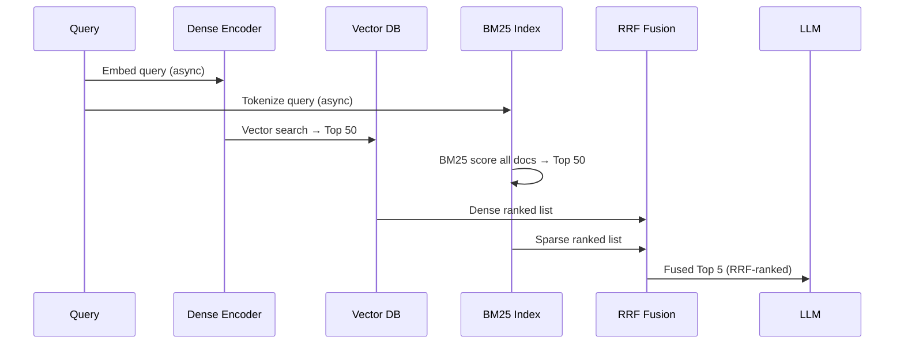

---

## 3. Implementation

### Production Hybrid Search in RAG

```python
"""
Hybrid Search integration for RAG pipelines.
Implements: dense + BM25 + RRF fusion with async execution.
"""

import asyncio
from typing import List, Dict, Tuple, Optional
import numpy as np
from openai import AsyncOpenAI
import faiss

# Assume these are available from your setup
# from rank_bm25 import BM25Okapi


class HybridRAGRetriever:
    """
    Hybrid retrieval: dense (FAISS) + sparse (BM25) with RRF.
    Designed for integration into an Advanced RAG pipeline.
    """

    def __init__(
        self,
        embedding_model: str = "text-embedding-3-small",
        dim: int = 1536,
        top_k_per_source: int = 50,
    ):
        from rank_bm25 import BM25Okapi
        self.client = AsyncOpenAI()
        self.embedding_model = embedding_model
        self.top_k_per_source = top_k_per_source

        # Dense index
        self.faiss_index = faiss.IndexHNSWFlat(dim, 32, faiss.METRIC_INNER_PRODUCT)
        self.faiss_index.hnsw.efSearch = 64

        # Sparse index
        self.bm25: Optional[BM25Okapi] = None
        self.BM25Class = BM25Okapi
        self._corpus: List[str] = []

        # ID management
        self._id_to_text: Dict[int, str] = {}
        self._id_to_meta: Dict[int, Dict] = {}
        self._n = 0

    def _tokenize(self, text: str) -> List[str]:
        import re
        return re.sub(r"[^\w\s]", " ", text.lower()).split()

    async def _embed_texts(self, texts: List[str]) -> np.ndarray:
        resp = await self.client.embeddings.create(input=texts, model=self.embedding_model)
        embs = np.array(
            [item.embedding for item in sorted(resp.data, key=lambda x: x.index)],
            dtype=np.float32,
        )
        faiss.normalize_L2(embs)
        return embs

    async def index(self, texts: List[str], metadatas: Optional[List[Dict]] = None):
        """Index documents for hybrid retrieval."""
        metadatas = metadatas or [{} for _ in texts]

        embeddings = await self._embed_texts(texts)
        self.faiss_index.add(embeddings)

        for i, (text, meta) in enumerate(zip(texts, metadatas)):
            fid = self._n + i
            self._id_to_text[fid] = text
            self._id_to_meta[fid] = meta

        self._corpus.extend(texts)
        self._n += len(texts)

        # Rebuild BM25 index (BM25 doesn't support incremental adds)
        tokenized = [self._tokenize(t) for t in self._corpus]
        self.bm25 = self.BM25Class(tokenized)

    async def retrieve(
        self,
        query: str,
        top_k: int = 5,
        rrf_k: int = 60,
        alpha: float = 0.5,  # 0=pure sparse, 1=pure dense (for score fusion alt.)
    ) -> List[Dict]:
        """
        Hybrid retrieval with RRF fusion.
        Runs dense and sparse retrieval concurrently.
        """
        if self.bm25 is None:
            raise RuntimeError("Call index() before retrieve()")

        # Run dense and sparse concurrently
        async def dense_search():
            q_emb = await self._embed_texts([query])
            q = q_emb[0].reshape(1, -1)
            _, indices = self.faiss_index.search(q, self.top_k_per_source)
            return [int(i) for i in indices[0] if i >= 0]

        def sparse_search():
            tokens = self._tokenize(query)
            scores = self.bm25.get_scores(tokens)
            top_indices = np.argsort(scores)[-self.top_k_per_source:][::-1]
            return [int(i) for i in top_indices if scores[i] > 0]

        dense_results, sparse_results = await asyncio.gather(
            dense_search(),
            asyncio.to_thread(sparse_search),
        )

        # RRF Fusion
        rrf_scores: Dict[int, float] = {}
        for rank, doc_id in enumerate(dense_results):
            rrf_scores[doc_id] = rrf_scores.get(doc_id, 0.0) + 1.0 / (rrf_k + rank + 1)
        for rank, doc_id in enumerate(sparse_results):
            rrf_scores[doc_id] = rrf_scores.get(doc_id, 0.0) + 1.0 / (rrf_k + rank + 1)

        fused = sorted(rrf_scores.items(), key=lambda x: x[1], reverse=True)

        results = []
        for doc_id, score in fused[:top_k]:
            results.append({
                "id": doc_id,
                "text": self._id_to_text.get(doc_id, ""),
                "metadata": self._id_to_meta.get(doc_id, {}),
                "rrf_score": score,
                "in_dense": doc_id in set(dense_results[:20]),
                "in_sparse": doc_id in set(sparse_results[:20]),
            })

        return results
```

---

## 4. Tradeoffs

| Scenario | Dense Only | Sparse Only | Hybrid |
|---|---|---|---|
| Semantic query | ✅ Best | ❌ Poor | ✅ Best |
| Exact keyword | ❌ Poor | ✅ Best | ✅ Best |
| Technical codes | ❌ Fails | ✅ Best | ✅ Best |
| Average (all queries) | ~0.44 NDCG | ~0.42 NDCG | ~0.52 NDCG |
| Latency | Low | Very Low | Low (parallel) |

---

## 5. Interview Preparation

**Mid-level**: "Hybrid search runs dense (vector) and BM25 (keyword) in parallel. Results are fused using RRF — adding 1/(60+rank) for each list. RRF is scale-invariant so you never need to normalize scores across the two systems. In practice this improves NDCG@10 by 15-25% across diverse query types."

**Senior**: "The key design choice is whether to use a pre-built hybrid system (Weaviate native hybrid, Pinecone sparse+dense) or build your own (FAISS + BM25 + RRF). The pre-built options reduce code but give less control over the fusion. My preference: Elasticsearch for BM25 (already in most enterprise stacks) + FAISS/Pinecone for dense + a 20-line RRF implementation. This gives full control and observability."

---

---

# Chapter 4: Reranking

---

## 1. Introduction

### What Is Reranking in RAG?

**Reranking** is a post-retrieval step that takes the K documents returned by the vector database and re-scores them using a more accurate (but slower) model — a **cross-encoder** — before passing the best M (M < K) to the LLM.

The insight: vector search retrieves with high recall (probably got the right docs in top-50) but moderate precision. The reranker promotes the truly relevant docs to the top of that list.

Standard pipeline: `Retrieve 50 → Rerank to 5 → LLM generates from 5`

---

## 2. Visual Mental Model

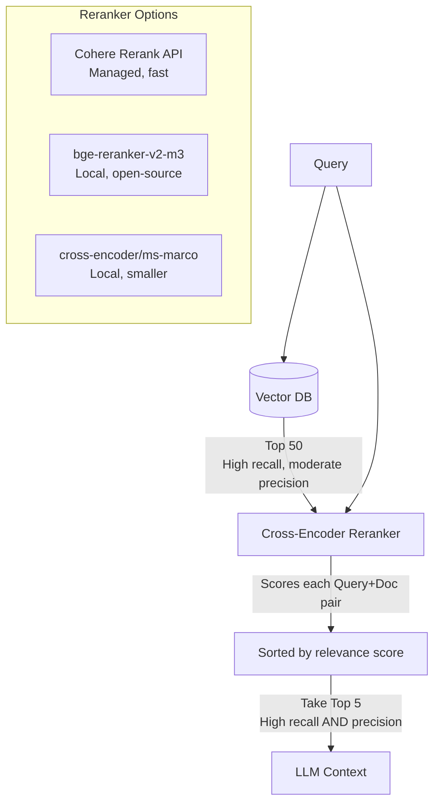

---

## 3. Internal Working

### Bi-Encoder vs. Cross-Encoder

**Bi-Encoder (vector search)**:
- Query and document are encoded SEPARATELY
- Similarity = dot product of two independent vectors
- Fast because document vectors are pre-computed
- Less accurate because query and document never "see" each other

**Cross-Encoder (reranker)**:
- Query and document are passed through the model TOGETHER: `[CLS] Query [SEP] Document [SEP]`
- Self-attention computes deep interactions between every query token and every document token
- Outputs a single relevance score
- No pre-computation possible (must process at query time)

The cross-encoder sees exactly which words in the query match which words in the document, enabling it to distinguish "breach of software contract" from "breach of physical security" in a way that cosine similarity between isolated embeddings cannot.

---

## 4. Implementation

### Reranking with Cohere and Local Cross-Encoders

```python
"""
Reranking implementations:
1. Cohere Rerank API (managed, state-of-the-art)
2. Local cross-encoder (sentence-transformers)
3. Lost-in-the-middle reordering
"""

from typing import List, Dict, Optional
import numpy as np
import os


# ─── Cohere Reranker (Managed API) ───────────────────────────────────────────

class CohereReranker:
    """
    Cohere Rerank API: state-of-the-art managed cross-encoder.
    
    Advantages:
    - No GPU needed
    - Consistently top-ranked on BEIR benchmark
    - Simple API: query + docs → ranked docs
    
    Cost: ~$0.001 per 1K search units
    """

    def __init__(self, api_key: Optional[str] = None):
        import cohere
        self.client = cohere.Client(api_key or os.environ["COHERE_API_KEY"])
        self.model = "rerank-english-v3.0"

    def rerank(
        self,
        query: str,
        documents: List[Dict],  # List of {"text": str, ...}
        top_n: int = 5,
    ) -> List[Dict]:
        """
        Rerank documents by relevance to query.
        Returns top_n documents sorted by cross-encoder relevance score.
        """
        doc_texts = [doc["text"] for doc in documents]

        response = self.client.rerank(
            model=self.model,
            query=query,
            documents=doc_texts,
            top_n=top_n,
        )

        reranked = []
        for hit in response.results:
            doc = documents[hit.index].copy()
            doc["rerank_score"] = hit.relevance_score
            reranked.append(doc)

        return reranked


# ─── Local Cross-Encoder (No API Cost) ────────────────────────────────────────

class LocalCrossEncoderReranker:
    """
    Local cross-encoder reranker using sentence-transformers.
    
    Models:
    - cross-encoder/ms-marco-MiniLM-L-6-v2  (fast, English)
    - BAAI/bge-reranker-v2-m3               (multilingual, SOTA)
    - cross-encoder/ms-marco-electra-base   (high accuracy)
    
    GPU recommended for production throughput.
    """

    def __init__(self, model_name: str = "BAAI/bge-reranker-v2-m3"):
        from sentence_transformers import CrossEncoder
        self.model = CrossEncoder(
            model_name,
            max_length=512,
            device="cuda" if self._has_gpu() else "cpu",
        )

    @staticmethod
    def _has_gpu() -> bool:
        try:
            import torch
            return torch.cuda.is_available()
        except ImportError:
            return False

    def rerank(
        self,
        query: str,
        documents: List[Dict],
        top_n: int = 5,
        batch_size: int = 32,
    ) -> List[Dict]:
        """Score all (query, document) pairs and return top_n sorted."""
        pairs = [(query, doc["text"]) for doc in documents]

        # Cross-encoder scores in batch
        scores = self.model.predict(pairs, batch_size=batch_size)

        # Sort by score
        scored_docs = sorted(
            zip(scores, documents),
            key=lambda x: x[0],
            reverse=True,
        )

        reranked = []
        for score, doc in scored_docs[:top_n]:
            doc_copy = doc.copy()
            doc_copy["rerank_score"] = float(score)
            reranked.append(doc_copy)

        return reranked


# ─── Lost-in-the-Middle Reordering ───────────────────────────────────────────

def lost_in_middle_reorder(documents: List[Dict]) -> List[Dict]:
    """
    Reorder documents to place most relevant at start and end.
    
    LLMs pay more attention to the start and end of their context
    window. Placing the best documents at the edges maximizes recall.
    
    Input (by relevance): [1st, 2nd, 3rd, 4th, 5th]
    Output:               [1st, 3rd, 5th, 4th, 2nd]
    
    1st gets top position (most attention).
    2nd gets last position (second most attention).
    3rd goes to second position.
    """
    if len(documents) <= 2:
        return documents

    reordered = []
    left, right = 0, len(documents) - 1

    # Interleave best at start, second best at end, alternating
    toggle = True
    while left <= right:
        if toggle:
            reordered.append(documents[left])
            left += 1
        else:
            reordered.append(documents[right])
            right -= 1
        toggle = not toggle

    return reordered


# ─── Full Two-Stage Retrieval + Reranking Pipeline ────────────────────────────

class TwoStageRetriever:
    """
    Stage 1: Bi-encoder (fast, high recall) — retrieve top 50
    Stage 2: Cross-encoder (slow, high precision) — rerank to top 5
    Stage 3: Optimal context ordering
    """

    def __init__(self, retriever, reranker):
        self.retriever = retriever  # Any retriever with .retrieve(query, top_k) method
        self.reranker = reranker    # CohereReranker or LocalCrossEncoderReranker

    async def retrieve_and_rerank(
        self,
        query: str,
        initial_k: int = 50,
        final_k: int = 5,
    ) -> List[Dict]:
        # Stage 1: Fast retrieval
        candidates = await self.retriever.retrieve(query, top_k=initial_k)

        if not candidates:
            return []

        # Stage 2: Precise reranking
        reranked = self.reranker.rerank(
            query=query,
            documents=candidates,
            top_n=final_k,
        )

        # Stage 3: Optimal ordering for LLM attention
        ordered = lost_in_middle_reorder(reranked)

        return ordered
```

---

## 5. Tradeoffs

| Reranker | Latency | Cost | Recall Gain | Best For |
|---|---|---|---|---|
| No reranking | 0ms | $0 | Baseline | Budget/fast systems |
| Cohere Rerank API | 100-300ms | $0.001/call | +15-30% | Production, no GPU |
| BGE-Reranker (GPU) | 100-200ms | Infrastructure | +15-30% | Self-hosted, high volume |
| LLM-as-reranker | 500-1000ms | High | Subjective | High-stakes queries |

---

## 6. Interview Preparation

**Junior**: "After vector search retrieves 50 documents, a reranker scores each document against the query more carefully. It uses a cross-encoder model that processes the query and document together, giving much more accurate relevance scores. We keep only the top 5 for the LLM."

**Mid-level**: "The bi-encoder (vector search) encodes query and document separately — fast but less accurate. The cross-encoder (reranker) passes both through the model together, enabling token-level attention between query and document — much more accurate but O(K) model passes. I retrieve top-50 with FAISS, rerank to top-5 with Cohere Rerank or BGE-Reranker, then apply lost-in-the-middle reordering before passing to the LLM."

**Senior**: "I host BGE-Reranker-v2-m3 via ONNX runtime on a single CPU instance for deterministic sub-200ms latency without GPU. I keep reranking depth at ≤100 documents to maintain p99 < 400ms SLA. An important optimization: for very high-traffic systems, I maintain a separate 'fast path' for simple queries (top-k=3, no reranker) and 'precise path' for complex queries (top-k=50, full reranking) — routed by a query complexity classifier."

---

---

# Chapter 5: Parent-Child Retrieval

---

## 1. Introduction

### The Precision-Context Dilemma

Basic RAG faces an inherent contradiction:

- **Small chunks** produce focused, precise embeddings → Better retrieval recall
- **Large chunks** provide rich surrounding context → Better LLM generation quality

These two requirements are in direct conflict. You cannot have both with a single chunk size.

**Parent-Child Retrieval** (also called Multi-Resolution Indexing) solves this elegantly: **index small chunks for precision, but return large chunks for context.**

---

## 2. Real-World Analogy

Imagine searching for a specific passage in a book using an index.

The **index** (back of the book) has very precise, specific entries: "ATP synthesis, page 142, paragraph 3." This is like the small "child" chunk — highly precise, easy to find.

But when you turn to page 142, you don't just read paragraph 3 in isolation — you read the surrounding paragraphs too. You read the entire **section** on cellular respiration (the large "parent" chunk) to understand the full context.

Parent-Child Retrieval applies this pattern to RAG:
- **Child chunk** (small): "ATP is produced via oxidative phosphorylation" — embedded, retrieved
- **Parent chunk** (large): The entire "Cellular Respiration" section — passed to the LLM

---

## 3. Visual Mental Model

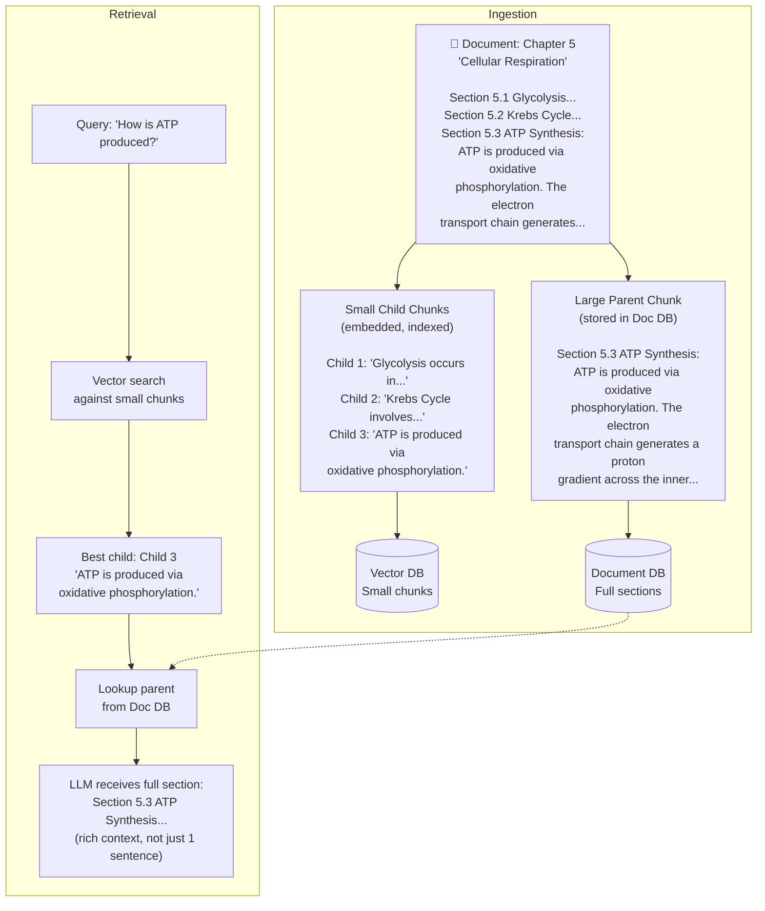

---

## 4. Implementation

```python
"""
Parent-Child Retrieval implementation.
Small child chunks for embedding, large parent sections for LLM context.
"""

import uuid
from typing import List, Dict, Optional, Tuple
from dataclasses import dataclass, field
import faiss
import numpy as np
from openai import AsyncOpenAI


@dataclass
class ParentChunk:
    parent_id: str
    text: str         # Full section text
    metadata: Dict = field(default_factory=dict)


@dataclass
class ChildChunk:
    child_id: str
    parent_id: str     # Reference to parent
    text: str          # Small chunk text
    position: int      # Position within parent (for ordering)
    embedding: Optional[np.ndarray] = field(default=None, repr=False)


class ParentChildRetriever:
    """
    Hierarchical retrieval:
    - Embed and search small CHILD chunks (50-150 tokens)
    - Return the large PARENT chunk (500-1000 tokens)
    
    This decouples retrieval precision from generation context quality.
    """

    def __init__(
        self,
        child_chunk_size: int = 150,
        parent_chunk_size: int = 600,
        child_overlap: int = 20,
        dim: int = 1536,
    ):
        self.child_chunk_size = child_chunk_size
        self.parent_chunk_size = parent_chunk_size
        self.child_overlap = child_overlap
        self.client = AsyncOpenAI()

        # Dense index for child chunks
        self.faiss_index = faiss.IndexHNSWFlat(dim, 32, faiss.METRIC_INNER_PRODUCT)
        self.faiss_index.hnsw.efSearch = 64

        # Storage
        self.parent_store: Dict[str, ParentChunk] = {}
        self.child_store: Dict[int, ChildChunk] = {}  # faiss_id → ChildChunk
        self._faiss_n = 0

    def _chunk(self, text: str, size_chars: int, overlap_chars: int) -> List[str]:
        """Simple character-based chunker with overlap."""
        chunks = []
        start = 0
        while start < len(text):
            end = min(start + size_chars, len(text))
            # Extend to next sentence boundary if possible
            if end < len(text):
                boundary = text.rfind(". ", start, end + 50)
                if boundary > start:
                    end = boundary + 2
            chunks.append(text[start:end].strip())
            start = end - overlap_chars
        return [c for c in chunks if c]

    async def ingest(self, documents: List[Dict]):
        """
        Ingest documents with hierarchical chunking.
        
        documents: [{"text": str, "metadata": dict}]
        """
        all_child_texts = []
        all_child_objs = []

        for doc in documents:
            parent_chunks = self._chunk(
                doc["text"],
                size_chars=self.parent_chunk_size * 4,
                overlap_chars=50,
            )

            for parent_text in parent_chunks:
                parent_id = str(uuid.uuid4())
                self.parent_store[parent_id] = ParentChunk(
                    parent_id=parent_id,
                    text=parent_text,
                    metadata=doc.get("metadata", {}),
                )

                # Create small child chunks within this parent
                child_texts = self._chunk(
                    parent_text,
                    size_chars=self.child_chunk_size * 4,
                    overlap_chars=self.child_overlap * 4,
                )

                for pos, child_text in enumerate(child_texts):
                    child = ChildChunk(
                        child_id=str(uuid.uuid4()),
                        parent_id=parent_id,
                        text=child_text,
                        position=pos,
                    )
                    all_child_texts.append(child_text)
                    all_child_objs.append(child)

        # Embed all child chunks
        batch_size = 512
        all_embeddings = []
        for i in range(0, len(all_child_texts), batch_size):
            batch = all_child_texts[i : i + batch_size]
            resp = await self.client.embeddings.create(
                input=batch, model="text-embedding-3-small"
            )
            embs = np.array(
                [item.embedding for item in sorted(resp.data, key=lambda x: x.index)],
                dtype=np.float32,
            )
            all_embeddings.append(embs)

        if all_embeddings:
            all_embs = np.vstack(all_embeddings)
            faiss.normalize_L2(all_embs)
            self.faiss_index.add(all_embs)

            for i, child in enumerate(all_child_objs):
                faiss_id = self._faiss_n + i
                self.child_store[faiss_id] = child
            self._faiss_n += len(all_child_objs)

    async def retrieve(self, query: str, top_k: int = 3) -> List[ParentChunk]:
        """
        Retrieve top_k PARENT chunks using CHILD chunk search.
        
        1. Embed query
        2. Find K × 3 nearest CHILD chunks (over-retrieve to avoid duplicates)
        3. Map each child → its parent
        4. Deduplicate: if two children map to same parent, return parent only once
        5. Return top_k unique parents
        """
        # Embed query
        resp = await self.client.embeddings.create(
            input=[query], model="text-embedding-3-small"
        )
        q_emb = np.array([resp.data[0].embedding], dtype=np.float32)
        faiss.normalize_L2(q_emb)

        # Search child index (over-retrieve to handle deduplication)
        _, indices = self.faiss_index.search(q_emb, top_k * 4)

        # Map to unique parents (maintaining order of first appearance)
        seen_parents: set = set()
        parent_results: List[ParentChunk] = []

        for idx in indices[0]:
            if idx < 0 or idx not in self.child_store:
                continue
            child = self.child_store[idx]
            parent_id = child.parent_id

            if parent_id not in seen_parents:
                seen_parents.add(parent_id)
                parent = self.parent_store.get(parent_id)
                if parent:
                    parent_results.append(parent)

            if len(parent_results) >= top_k:
                break

        return parent_results
```

---

## 5. Tradeoffs

| Approach | Retrieval Precision | Generation Context | Complexity |
|---|---|---|---|
| Large chunks only | Low (diluted embedding) | Rich | Low |
| Small chunks only | High | Poor (fragmented) | Low |
| Parent-Child | High | Rich | Medium |
| Sentence-level chunks | Highest | Very Poor | High |

---

## 6. Interview Preparation

**Mid-level**: "Parent-Child Retrieval uses two levels of chunking. Small child chunks (100-150 tokens) are embedded and indexed for precise retrieval. Large parent chunks (500-1000 tokens) are stored separately. When a child chunk is retrieved, we fetch its parent and send the full parent to the LLM. This gives the best of both worlds: precise retrieval and rich context."

**Senior**: "The key implementation detail is the ID mapping: child chunks store a reference to their parent ID, and parents are stored in a separate key-value store (Redis or Postgres). The faiss index only knows about children. After retrieval, we deduplicate — if 3 children from the same parent are retrieved, we return the parent only once. This is especially effective for hierarchical documents (books, legal contracts, technical manuals) where the structure naturally divides into sections and sub-sections."

---

---

# Chapter 6: Context Compression

---

## 1. Introduction

### What Is Context Compression?

**Context Compression** reduces the amount of text passed to the LLM by extracting only the query-relevant portions from retrieved chunks, while discarding irrelevant sentences.

**Without compression**: A 500-word chunk about "Python installation, environment setup, and debugging" gets passed to the LLM when the user only asked about debugging. The installation and setup portions are noise.

**With compression**: A compressor extracts only the debugging-relevant sentences from the chunk, passing 80 words instead of 500. Cleaner context, fewer tokens, less distraction for the LLM.

---

## 2. Visual Mental Model

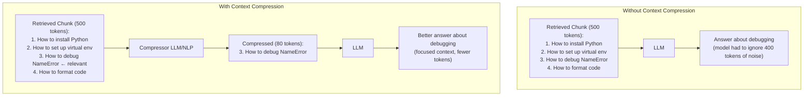

---

## 3. Implementation

```python
"""
Context compression strategies:
1. LLM-based extraction (most flexible)
2. Sentence-level relevance filtering
3. Contextual compression with sentence transformers
"""

from typing import List, Dict, Optional
import asyncio
from openai import AsyncOpenAI

client = AsyncOpenAI()


class LLMContextCompressor:
    """
    Uses a small, fast LLM to extract relevant sentences from chunks.
    
    Best for: diverse document types, high-quality extraction.
    Tradeoff: adds LLM latency for each chunk.
    """

    async def compress_single(self, query: str, chunk: str) -> Optional[str]:
        """Extract only query-relevant content from a chunk."""
        prompt = f"""Extract only the sentences from the text that are directly relevant to answering: "{query}"
If no sentences are relevant, return exactly: IRRELEVANT
Do not paraphrase or add new information. Return verbatim sentences only.

Text:
{chunk}

Relevant sentences:"""

        response = await client.chat.completions.create(
            model="gpt-4o-mini",
            messages=[{"role": "user", "content": prompt}],
            temperature=0,
            max_tokens=400,
        )

        result = response.choices[0].message.content.strip()
        return None if result == "IRRELEVANT" else result

    async def compress_batch(
        self,
        query: str,
        chunks: List[str],
    ) -> List[Optional[str]]:
        """Compress all chunks concurrently."""
        tasks = [self.compress_single(query, chunk) for chunk in chunks]
        return await asyncio.gather(*tasks)

    async def compress_and_filter(
        self,
        query: str,
        chunks: List[Dict],  # [{"text": str, ...}]
    ) -> List[Dict]:
        """
        Compress all chunks and remove irrelevant ones.
        Returns compressed chunks sorted by original relevance.
        """
        texts = [c["text"] for c in chunks]
        compressed_texts = await self.compress_batch(query, texts)

        result = []
        for chunk, compressed in zip(chunks, compressed_texts):
            if compressed is not None:
                doc = chunk.copy()
                doc["text"] = compressed
                doc["original_length"] = len(chunk["text"])
                doc["compressed_length"] = len(compressed)
                result.append(doc)

        compression_ratio = sum(d["compressed_length"] for d in result) / max(
            sum(d["original_length"] for d in result), 1
        )
        print(f"Compression ratio: {compression_ratio:.2%}")
        return result


class EmbeddingCompressor:
    """
    Embedding-based sentence-level compression.
    
    No LLM call needed — uses cosine similarity between
    query embedding and sentence embeddings to filter.
    Much faster than LLM compression.
    """

    def __init__(self, similarity_threshold: float = 0.6):
        from sentence_transformers import SentenceTransformer
        self.model = SentenceTransformer("all-MiniLM-L6-v2")
        self.threshold = similarity_threshold

    def compress(self, query: str, chunk: str) -> Optional[str]:
        """Keep only sentences with embedding similarity > threshold."""
        import re
        sentences = [s.strip() for s in re.split(r"(?<=[.!?])\s+", chunk) if s.strip()]
        if not sentences:
            return None

        all_texts = [query] + sentences
        embeddings = self.model.encode(all_texts, normalize_embeddings=True)
        query_emb = embeddings[0]
        sent_embs = embeddings[1:]

        # Cosine similarity (dot product for normalized vectors)
        scores = sent_embs @ query_emb

        relevant = [s for s, score in zip(sentences, scores) if score >= self.threshold]
        return " ".join(relevant) if relevant else None
```

---

## 4. Tradeoffs

| Compression Method | Latency | Quality | Cost |
|---|---|---|---|
| None (pass full chunk) | 0ms | Baseline | Low (but more LLM tokens) |
| Embedding-based | ~20ms | Good | Low |
| LLM-based (gpt-4o-mini) | ~500ms per chunk | Best | Medium |
| LLM-based (claude-haiku) | ~300ms per chunk | Excellent | Low |

---

## 5. Interview Preparation

**Mid-level**: "Context compression filters retrieved chunks to include only sentences relevant to the query before passing to the LLM. I use two approaches: fast embedding-based (compare sentence embeddings to query, threshold at 0.6 cosine similarity) for low-latency paths, and LLM-based extraction (GPT-4o-mini prompting) for high-stakes queries where extraction quality matters."

---

---

# Chapter 7: HyDE

---

## 1. Introduction

### What Is HyDE?

**HyDE** (Hypothetical Document Embeddings) is a retrieval technique from the paper *"Precise Zero-Shot Dense Retrieval without Relevance Labels"* (Gao et al., 2022).

The core idea: instead of embedding the user's query (a question) and searching for similar documents (statements/answers), **ask the LLM to generate a hypothetical answer first, then embed that hypothetical answer and search for real documents similar to it.**

**Why this works**: Questions and answers exist in different parts of the embedding space. The question "What causes scurvy?" and the answer "Scurvy is caused by vitamin C deficiency" are semantically different strings. HyDE eliminates this asymmetry by converting the question into an answer-like text before embedding.

---

## 2. Visual Mental Model

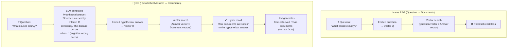

---

## 3. Implementation

```python
"""
HyDE: Hypothetical Document Embeddings.
Generates a fake answer to improve retrieval recall.
"""

from typing import List, Dict
import numpy as np
from openai import AsyncOpenAI

client = AsyncOpenAI()


async def generate_hypothetical_document(
    query: str,
    domain: str = "general",
    n_hypothetical: int = 1,
) -> List[str]:
    """
    Generate N hypothetical answers to the query.
    
    The LLM is encouraged to write as if it's answering from
    a specific document — mimicking the style of a real document.
    
    These answers will likely contain factual errors (that's ok!)
    because we only use their EMBEDDING, not their content.
    """
    domain_instruction = {
        "medical": "Write as if from a medical textbook or clinical guideline.",
        "legal": "Write as if from a legal statute or court opinion.",
        "technical": "Write as if from technical documentation.",
        "general": "Write a detailed factual paragraph as if from a reference document.",
    }.get(domain, "Write a detailed factual paragraph.")

    prompt = f"""{domain_instruction}
Write {n_hypothetical} distinct, detailed paragraph(s) that would answer:
"{query}"

Do not mention that you are generating a hypothetical answer.
Write directly as if you are the document. Each paragraph separated by ---."""

    response = await client.chat.completions.create(
        model="gpt-4o-mini",
        messages=[{"role": "user", "content": prompt}],
        temperature=0.7,  # Some variance to generate diverse hypotheticals
        max_tokens=300 * n_hypothetical,
    )

    hypotheticals = [
        h.strip()
        for h in response.choices[0].message.content.split("---")
        if h.strip()
    ]
    return hypotheticals[:n_hypothetical]


async def hyde_retrieval(
    query: str,
    retriever,  # Any retriever with async retrieve(text, top_k) method
    embedding_model: str = "text-embedding-3-small",
    n_hypothetical: int = 3,
    top_k: int = 5,
) -> List[Dict]:
    """
    HyDE-enhanced retrieval.
    
    Steps:
    1. Generate N hypothetical answers using LLM
    2. Embed each hypothetical answer
    3. Search vector DB with each hypothetical embedding
    4. Fuse results with RRF
    5. Return top_k real documents
    """
    import faiss
    from openai import AsyncOpenAI
    cl = AsyncOpenAI()

    # 1. Generate hypotheticals
    hypotheticals = await generate_hypothetical_document(query, n_hypothetical=n_hypothetical)
    hypotheticals.append(query)  # Always include the original query too

    # 2. Embed all hypotheticals + original query
    resp = await cl.embeddings.create(input=hypotheticals, model=embedding_model)
    embeddings = np.array(
        [item.embedding for item in sorted(resp.data, key=lambda x: x.index)],
        dtype=np.float32,
    )
    faiss.normalize_L2(embeddings)

    # 3. Average embeddings (centroid approach — often better than voting)
    mean_embedding = np.mean(embeddings, axis=0, keepdims=True)
    faiss.normalize_L2(mean_embedding)

    # 4. Retrieve using mean embedding
    results = await retriever.retrieve_by_embedding(mean_embedding[0], top_k=top_k)
    return results


# ─── When to Use HyDE vs. Not ─────────────────────────────────────────────────
"""
USE HyDE when:
- Query type: conceptual/semantic ("What causes X?", "Explain Y")
- Documents are dense technical/reference material
- Bi-encoder recall is low on your evaluation set

DO NOT USE HyDE when:
- Query type: factual identifier lookup ("Error code 491-B", "User ID 9912")
  → LLM will hallucinate a different identifier!
- Query type: explicit keyword search
  → HyDE will lose the keyword precision
- Latency is critical → HyDE adds one LLM call to the critical path
"""
```

---

## 4. Tradeoffs

| Aspect | HyDE | Standard Query Embedding |
|---|---|---|
| Recall for semantic queries | +10-20% | Baseline |
| Recall for keyword queries | -5% (can hurt) | Baseline |
| Latency | +500ms (1 LLM call) | 0ms |
| Risk | Hallucinated identifiers | None |
| Best for | Conceptual Q&A, research | General, production default |

---

## 5. Interview Preparation

**Mid-level**: "HyDE generates a hypothetical answer to the user's question using a small LLM, then embeds that hypothetical answer rather than the raw question. This works because documents are written as statements (answers), not questions. By converting the question to a statement-like form, HyDE reduces the embedding space asymmetry between queries and documents."

**Senior**: "I treat HyDE as an optional module, not a default. I route to HyDE for queries classified as 'conceptual' (what/why/how questions) and route away from HyDE for queries with specific identifiers (product IDs, error codes, person names) where the LLM might hallucinate a different identifier that corrupts the embedding. A 3-class classifier (conceptual, factual-identifier, factual-general) trained on a few hundred labeled queries routes optimally."

---

---

# Chapter 8: Multi-Query

---

## 1. Introduction

### What Is Multi-Query Retrieval?

**Multi-Query** is a pre-retrieval technique where a single user query is expanded into multiple related queries by an LLM, each variant is searched independently against the vector database, and the results are fused with RRF.

**Why**: Every user has a unique vocabulary. An engineer might say "how do I reduce model latency?" while the documentation says "techniques for inference acceleration." A single embedding may not bridge this gap — but generating multiple phrasings dramatically increases the chance that one of them lands near the right documents.

---

## 2. Visual Mental Model

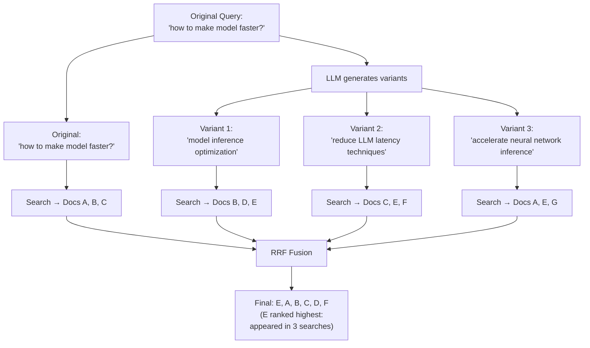

---

## 3. Implementation

```python
"""
Multi-Query RAG: generate query variants and fuse results.
"""

import asyncio
from typing import List, Dict, Optional
from openai import AsyncOpenAI

client = AsyncOpenAI()


async def generate_query_variants(
    query: str,
    n_variants: int = 3,
    include_original: bool = True,
) -> List[str]:
    """
    Generate N diverse query variants using LLM.
    Always includes the original query.
    """
    prompt = f"""Generate {n_variants} different versions of this search query.
Each version should use different vocabulary, phrasing, or approach.
Write one query per line. No numbering, bullets, or explanation.

Query: {query}

Variants:"""

    response = await client.chat.completions.create(
        model="gpt-4o-mini",
        messages=[{"role": "user", "content": prompt}],
        temperature=0.7,
        max_tokens=200,
    )

    variants = [
        line.strip()
        for line in response.choices[0].message.content.strip().split("\n")
        if line.strip() and len(line.strip()) > 5
    ]

    if include_original:
        variants = [query] + variants[:n_variants]

    return variants[:n_variants + (1 if include_original else 0)]


class MultiQueryRetriever:
    """
    Multi-query retrieval with RRF fusion.
    """

    def __init__(self, retriever, n_variants: int = 3, top_k_per_query: int = 10):
        self.retriever = retriever
        self.n_variants = n_variants
        self.top_k_per_query = top_k_per_query

    async def retrieve(self, query: str, final_top_k: int = 5) -> List[Dict]:
        # 1. Generate variants
        variants = await generate_query_variants(query, self.n_variants)

        # 2. Search all variants concurrently
        tasks = [
            self.retriever.retrieve(variant, top_k=self.top_k_per_query)
            for variant in variants
        ]
        all_results = await asyncio.gather(*tasks)

        # 3. Build ranked lists (list of doc IDs for each variant)
        ranked_lists = []
        doc_lookup: Dict[str, Dict] = {}

        for results in all_results:
            ranked_list = []
            for doc in results:
                doc_id = doc.get("id") or doc.get("text", "")[:50]
                ranked_list.append(doc_id)
                doc_lookup[doc_id] = doc
            ranked_lists.append(ranked_list)

        # 4. RRF Fusion
        rrf_scores: Dict[str, float] = {}
        for ranked in ranked_lists:
            for rank, doc_id in enumerate(ranked):
                rrf_scores[doc_id] = rrf_scores.get(doc_id, 0.0) + 1.0 / (60 + rank + 1)

        top = sorted(rrf_scores.items(), key=lambda x: x[1], reverse=True)[:final_top_k]
        return [doc_lookup[doc_id] for doc_id, _ in top if doc_id in doc_lookup]
```

---

## 4. Interview Preparation

**Mid-level**: "Multi-Query expands a single user query into 3-5 variants using a small LLM, runs independent vector searches for each, then fuses results using RRF. Documents that appear in multiple searches get boosted RRF scores. This overcomes vocabulary mismatch — if one variant uses the right synonym for a technical term, it finds the document that the original query missed."

---

---

# Chapter 9: Self-RAG

---

## 1. Introduction

### What Is Self-RAG?

**Self-RAG** (Self-Reflective Retrieval-Augmented Generation) is an advanced RAG architecture published by Asai et al. (2023) where the LLM itself decides:
1. **Whether** to retrieve at all (retrieval on-demand, not always)
2. **How relevant** each retrieved document is (relevance grading)
3. **Whether** its own generated output is supported by the retrieved context (faithfulness check)
4. **Whether** the response is actually useful (utility rating)

Instead of always retrieving, always generating, Self-RAG introduces **reflection tokens** — special tokens the model outputs to signal its meta-cognitive state.

---

## 2. Visual Mental Model

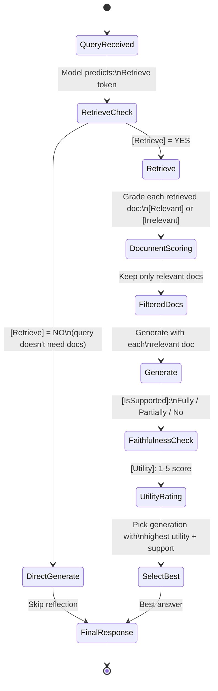

---

## 3. Implementation

### Self-RAG with LLM-as-Judge

```python
"""
Self-RAG implementation using LLM-as-judge for reflection tokens.
In the original paper, a fine-tuned model outputs special tokens.
In practice (without fine-tuned model), we use prompting to simulate
the reflection mechanism.
"""

import asyncio
from typing import List, Dict, Optional, Literal
from openai import AsyncOpenAI
from pydantic import BaseModel

client = AsyncOpenAI()


class RetrievalDecision(BaseModel):
    should_retrieve: bool
    reasoning: str


class DocumentRelevance(BaseModel):
    relevant: bool
    relevance_score: float  # 0.0 to 1.0
    reasoning: str


class GenerationAssessment(BaseModel):
    faithfulness: Literal["fully_supported", "partially_supported", "not_supported"]
    utility: int  # 1-5
    reasoning: str


class SelfRAGPipeline:
    """
    Self-RAG: adaptive retrieval with self-reflection.
    
    The pipeline decides whether to retrieve, grades document relevance,
    and assesses generation quality before returning a final answer.
    """

    def __init__(self, retriever, generation_model: str = "gpt-4o"):
        self.retriever = retriever
        self.model = generation_model

    async def decide_retrieval(self, query: str) -> RetrievalDecision:
        """
        Reflection Token 1: [Retrieve] — Should we retrieve for this query?
        
        Queries like "What is 2+2?" don't need retrieval.
        Queries like "What is our Q3 revenue?" always need retrieval.
        """
        prompt = f"""Should a document retrieval step be performed for this query?

Query: "{query}"

Retrieve if: The query requires specific facts, dates, names, figures, or proprietary information.
Don't retrieve if: The query is a simple calculation, general knowledge, or a greeting.

Return JSON: {{"should_retrieve": true/false, "reasoning": "brief reason"}}"""

        resp = await client.chat.completions.create(
            model="gpt-4o-mini",
            messages=[{"role": "user", "content": prompt}],
            response_format={"type": "json_object"},
            temperature=0,
        )
        import json
        return RetrievalDecision(**json.loads(resp.choices[0].message.content))

    async def grade_document(self, query: str, document: str) -> DocumentRelevance:
        """
        Reflection Token 2: [Relevant] — Is this document relevant?
        """
        prompt = f"""Grade the relevance of this document to the query.

Query: "{query}"
Document: "{document[:500]}..."

Return JSON: {{
  "relevant": true/false,
  "relevance_score": 0.0-1.0,
  "reasoning": "brief reason"
}}"""

        resp = await client.chat.completions.create(
            model="gpt-4o-mini",
            messages=[{"role": "user", "content": prompt}],
            response_format={"type": "json_object"},
            temperature=0,
        )
        import json
        return DocumentRelevance(**json.loads(resp.choices[0].message.content))

    async def generate_with_context(self, query: str, context: str) -> str:
        """Generate an answer given a specific document as context."""
        resp = await client.chat.completions.create(
            model=self.model,
            messages=[
                {"role": "system", "content": "Answer using only the provided context."},
                {"role": "user", "content": f"Context:\n{context}\n\nQuestion: {query}"},
            ],
            temperature=0,
        )
        return resp.choices[0].message.content

    async def assess_generation(
        self, query: str, document: str, answer: str
    ) -> GenerationAssessment:
        """
        Reflection Token 3: [IsSupported] + [Utility]
        Is the answer supported by the context? Is it useful?
        """
        prompt = f"""Assess this answer:

Query: "{query}"
Context: "{document[:500]}"
Answer: "{answer[:300]}"

Return JSON: {{
  "faithfulness": "fully_supported" | "partially_supported" | "not_supported",
  "utility": 1-5,
  "reasoning": "brief reason"
}}"""

        resp = await client.chat.completions.create(
            model="gpt-4o-mini",
            messages=[{"role": "user", "content": prompt}],
            response_format={"type": "json_object"},
            temperature=0,
        )
        import json
        return GenerationAssessment(**json.loads(resp.choices[0].message.content))

    async def run(self, query: str, top_k: int = 3) -> Dict:
        """
        Full Self-RAG pipeline.
        Returns the best answer with self-reflection metadata.
        """
        # 1. Retrieval Decision
        retrieval_decision = await self.decide_retrieval(query)

        if not retrieval_decision.should_retrieve:
            # Direct generation without retrieval
            resp = await client.chat.completions.create(
                model=self.model,
                messages=[{"role": "user", "content": query}],
                temperature=0,
            )
            return {
                "answer": resp.choices[0].message.content,
                "retrieved": False,
                "retrieval_reason": retrieval_decision.reasoning,
            }

        # 2. Retrieve documents
        documents = await self.retriever.retrieve(query, top_k=top_k)

        # 3. Grade each document for relevance (concurrently)
        relevance_tasks = [
            self.grade_document(query, doc["text"])
            for doc in documents
        ]
        relevance_grades = await asyncio.gather(*relevance_tasks)

        # Filter to relevant documents only
        relevant_docs = [
            doc for doc, grade in zip(documents, relevance_grades)
            if grade.relevant
        ]

        if not relevant_docs:
            return {
                "answer": "I could not find relevant information in the knowledge base.",
                "retrieved": True,
                "relevant_docs_found": 0,
            }

        # 4. Generate with each relevant doc (concurrently)
        gen_tasks = [
            self.generate_with_context(query, doc["text"])
            for doc in relevant_docs
        ]
        answers = await asyncio.gather(*gen_tasks)

        # 5. Assess each (query, doc, answer) triple
        assess_tasks = [
            self.assess_generation(query, doc["text"], answer)
            for doc, answer in zip(relevant_docs, answers)
        ]
        assessments = await asyncio.gather(*assess_tasks)

        # 6. Select best answer: fully_supported > partially_supported, then by utility
        best_score = -1
        best_answer = answers[0] if answers else ""

        for answer, assessment in zip(answers, assessments):
            faith_score = {
                "fully_supported": 3,
                "partially_supported": 1,
                "not_supported": 0,
            }.get(assessment.faithfulness, 0)
            score = faith_score * 10 + assessment.utility

            if score > best_score:
                best_score = score
                best_answer = answer

        return {
            "answer": best_answer,
            "retrieved": True,
            "relevant_docs_found": len(relevant_docs),
            "best_faithfulness": assessments[answers.index(best_answer)].faithfulness,
            "best_utility": assessments[answers.index(best_answer)].utility,
        }
```

---

## 4. Interview Preparation

**Mid-level**: "Self-RAG adds three reflection steps: (1) decide whether retrieval is needed for this query, (2) grade each retrieved document for relevance, (3) assess whether the generated answer is supported by the context. This reduces unnecessary retrievals (saving latency) and filters out irrelevant documents before generation."

**Senior**: "The original Self-RAG paper requires a fine-tuned model that outputs special tokens like [Retrieve], [Relevant], [IsSupported]. In practice without fine-tuning, I simulate this with LLM-as-judge prompts using gpt-4o-mini (cheap and fast for classification). The critical optimization: run document grading and generation assessment concurrently, not sequentially."

---

---

# Chapter 10: CRAG

---

## 1. Introduction

### What Is CRAG?

**CRAG** (Corrective RAG) is an architecture from Shi et al. (2024) that adds a **retrieval corrector** to the standard RAG pipeline. After retrieving documents, a lightweight evaluator assesses the quality of retrieval. If retrieval is poor, the system corrects itself by performing a web search or triggering a different retrieval strategy before generation.

The key innovation: **retrieval quality is evaluated before generation**, not after. This prevents generating from bad context.

---

## 2. Visual Mental Model

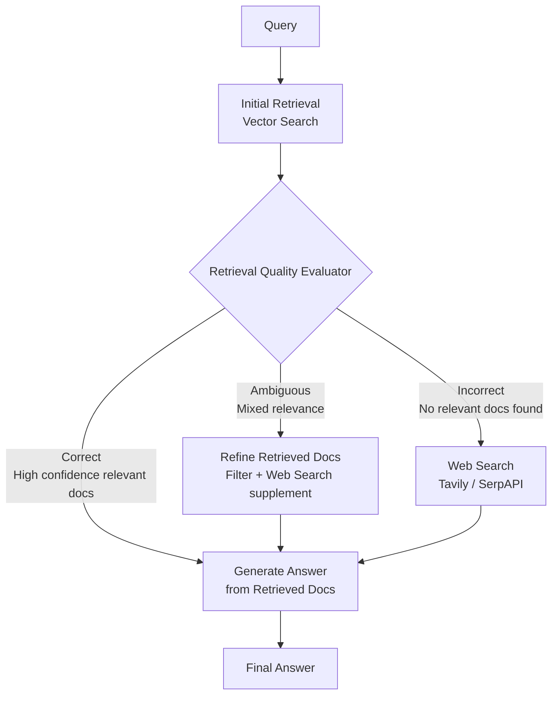

---

## 3. Implementation

```python
"""
CRAG: Corrective Retrieval-Augmented Generation.
Evaluates retrieval quality and corrects if poor.
"""

import asyncio
from typing import List, Dict, Literal
from openai import AsyncOpenAI
from pydantic import BaseModel
import httpx

client = AsyncOpenAI()


class RetrievalQualityAssessment(BaseModel):
    quality: Literal["correct", "ambiguous", "incorrect"]
    confidence: float  # 0.0 to 1.0
    reason: str


async def evaluate_retrieval_quality(
    query: str,
    retrieved_docs: List[Dict],
) -> RetrievalQualityAssessment:
    """
    CRAG Evaluator: assess whether retrieved documents can answer the query.
    
    correct:   High-confidence docs clearly contain the answer
    ambiguous: Some docs are relevant, some are not; or relevance is unclear
    incorrect: No retrieved docs appear relevant to the query
    """
    docs_preview = "\n---\n".join([
        f"Doc {i+1}: {doc.get('text', '')[:300]}"
        for i, doc in enumerate(retrieved_docs[:5])
    ])

    prompt = f"""Evaluate if the retrieved documents can answer the query.

Query: "{query}"

Retrieved Documents:
{docs_preview}

Classify retrieval quality:
- "correct": Documents clearly contain information to answer the query
- "ambiguous": Documents partially relevant or unsure
- "incorrect": Documents cannot answer the query; irrelevant

Return JSON: {{"quality": "correct|ambiguous|incorrect", "confidence": 0.0-1.0, "reason": "brief"}}"""

    resp = await client.chat.completions.create(
        model="gpt-4o-mini",
        messages=[{"role": "user", "content": prompt}],
        response_format={"type": "json_object"},
        temperature=0,
    )
    import json
    return RetrievalQualityAssessment(**json.loads(resp.choices[0].message.content))


async def web_search(query: str, api_key: str, max_results: int = 5) -> List[Dict]:
    """
    Fallback: Tavily search API for web results when vector DB retrieval fails.
    """
    async with httpx.AsyncClient() as http:
        response = await http.post(
            "https://api.tavily.com/search",
            json={
                "api_key": api_key,
                "query": query,
                "max_results": max_results,
                "include_raw_content": False,
            },
            timeout=10.0,
        )
        results = response.json().get("results", [])
        return [
            {
                "text": r.get("content", ""),
                "metadata": {"source": r.get("url", ""), "type": "web"},
            }
            for r in results
        ]


async def strip_irrelevant_sentences(query: str, docs: List[Dict]) -> List[Dict]:
    """Refine ambiguous docs by extracting query-relevant sentences."""
    refined = []
    for doc in docs:
        text = doc.get("text", "")
        prompt = f"""From this text, extract only sentences relevant to: "{query}"
If none relevant, return NONE.
Text: {text[:600]}
Relevant sentences:"""

        resp = await client.chat.completions.create(
            model="gpt-4o-mini",
            messages=[{"role": "user", "content": prompt}],
            temperature=0,
            max_tokens=300,
        )
        result = resp.choices[0].message.content.strip()
        if result and result != "NONE":
            refined.append({**doc, "text": result})
    return refined


class CRAGPipeline:
    """
    CRAG: Corrective RAG with adaptive retrieval strategy.
    """

    def __init__(self, retriever, tavily_api_key: str = ""):
        self.retriever = retriever
        self.tavily_api_key = tavily_api_key

    async def run(self, query: str, top_k: int = 5) -> Dict:
        # 1. Initial retrieval
        docs = await self.retriever.retrieve(query, top_k=top_k)

        # 2. Evaluate retrieval quality
        assessment = await evaluate_retrieval_quality(query, docs)
        final_docs = docs

        if assessment.quality == "correct":
            # Best case: use retrieved docs as-is
            pass

        elif assessment.quality == "ambiguous":
            # Moderate case: refine + optionally supplement with web
            final_docs = await strip_irrelevant_sentences(query, docs)
            if self.tavily_api_key:
                web_docs = await web_search(query, self.tavily_api_key, max_results=3)
                final_docs = final_docs + web_docs

        elif assessment.quality == "incorrect":
            # Worst case: skip vector DB, use web search
            if self.tavily_api_key:
                final_docs = await web_search(query, self.tavily_api_key, max_results=5)
            else:
                return {
                    "answer": "I could not find relevant information in the knowledge base.",
                    "retrieval_quality": "incorrect",
                }

        # 3. Generate
        context = "\n---\n".join([d.get("text", "") for d in final_docs])
        resp = await client.chat.completions.create(
            model="gpt-4o",
            messages=[
                {"role": "system", "content": "Answer using only the provided context."},
                {"role": "user", "content": f"Context:\n{context}\n\nQuestion: {query}"},
            ],
            temperature=0,
        )

        return {
            "answer": resp.choices[0].message.content,
            "retrieval_quality": assessment.quality,
            "retrieval_confidence": assessment.confidence,
            "sources_used": len(final_docs),
        }
```

---

## 4. Interview Preparation

**Mid-level**: "CRAG evaluates retrieval quality before generation — it classifies retrieval as correct, ambiguous, or incorrect using an LLM evaluator. For incorrect retrieval, it falls back to web search (Tavily) instead of generating from bad context. For ambiguous retrieval, it refines by stripping irrelevant sentences."

**Senior**: "CRAG is particularly valuable for domain-specific RAG systems where the knowledge base might have gaps. Instead of silently failing (hallucinating from irrelevant context), CRAG transparently detects the gap and falls back to web search. The web search integration needs to be carefully gated — you don't want every query hitting the web, only those with confirmed poor vector retrieval."

---

---

# Chapter 11: Adaptive RAG

---

## 1. Introduction

### What Is Adaptive RAG?

**Adaptive RAG** (Jeong et al., 2024) dynamically selects the optimal retrieval strategy based on the complexity and type of the incoming query. Not all queries need the same treatment:

- "What is RAG?" → Simple concept → No retrieval needed, LLM knows this
- "What is our Q3 revenue?" → Single-hop factual → Basic vector retrieval
- "How does our Q3 revenue compare to our Q2 revenue and what drove the change?" → Multi-hop → Multiple retrievals, synthesized

---

## 2. Visual Mental Model

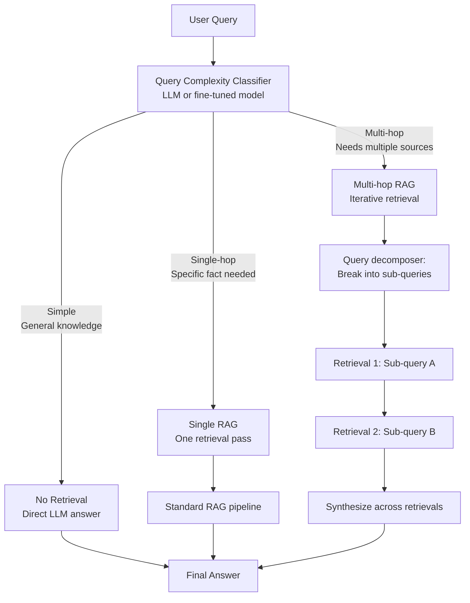

---

## 3. Implementation

```python
"""
Adaptive RAG: route queries to the appropriate retrieval strategy.
"""

from enum import Enum
from typing import List, Dict, Optional
from openai import AsyncOpenAI
from pydantic import BaseModel
import asyncio

client = AsyncOpenAI()


class QueryComplexity(str, Enum):
    NONE = "none"       # No retrieval needed
    SINGLE = "single"   # One retrieval pass
    MULTI = "multi"     # Multiple retrieval passes


class QueryAnalysis(BaseModel):
    complexity: QueryComplexity
    sub_queries: List[str]    # For multi-hop: the decomposed sub-questions
    reasoning: str


async def classify_query(query: str) -> QueryAnalysis:
    """
    Classify query complexity to determine retrieval strategy.
    """
    prompt = f"""Classify this query's retrieval complexity:

Query: "{query}"

Options:
- "none": General knowledge question answerable without any documents (e.g., "What is Python?")
- "single": Needs one retrieval pass to find a specific fact
- "multi": Needs multiple retrievals to answer different aspects, then synthesis

For "multi", decompose into 2-3 specific sub-questions.

Return JSON: {{"complexity": "none|single|multi", "sub_queries": [], "reasoning": "brief"}}"""

    resp = await client.chat.completions.create(
        model="gpt-4o-mini",
        messages=[{"role": "user", "content": prompt}],
        response_format={"type": "json_object"},
        temperature=0,
    )
    import json
    data = json.loads(resp.choices[0].message.content)
    return QueryAnalysis(**data)


class AdaptiveRAGPipeline:
    """
    Adaptive RAG: choose the right retrieval strategy per query.
    """

    def __init__(self, retriever, generation_model: str = "gpt-4o"):
        self.retriever = retriever
        self.model = generation_model

    async def run(self, query: str) -> Dict:
        # 1. Classify query complexity
        analysis = await classify_query(query)

        if analysis.complexity == QueryComplexity.NONE:
            # No retrieval — direct generation
            resp = await client.chat.completions.create(
                model=self.model,
                messages=[{"role": "user", "content": query}],
                temperature=0,
            )
            return {
                "answer": resp.choices[0].message.content,
                "strategy": "no_retrieval",
                "retrievals": 0,
            }

        elif analysis.complexity == QueryComplexity.SINGLE:
            # Standard single retrieval
            docs = await self.retriever.retrieve(query, top_k=3)
            context = "\n---\n".join([d.get("text", "") for d in docs])
            resp = await client.chat.completions.create(
                model=self.model,
                messages=[
                    {"role": "system", "content": "Answer using only the provided context."},
                    {"role": "user", "content": f"Context:\n{context}\n\nQuestion: {query}"},
                ],
                temperature=0,
            )
            return {
                "answer": resp.choices[0].message.content,
                "strategy": "single_retrieval",
                "retrievals": 1,
            }

        else:  # MULTI
            # Multi-hop: retrieve for each sub-query, synthesize
            sub_queries = analysis.sub_queries or [query]

            # Retrieve for all sub-queries concurrently
            retrieval_tasks = [
                self.retriever.retrieve(sq, top_k=3)
                for sq in sub_queries
            ]
            all_docs = await asyncio.gather(*retrieval_tasks)

            # Build combined context with sub-query labels
            context_parts = []
            for sq, docs in zip(sub_queries, all_docs):
                sq_context = "\n".join([d.get("text", "") for d in docs])
                context_parts.append(f"[{sq}]\n{sq_context}")

            combined_context = "\n\n".join(context_parts)

            # Synthesize final answer
            resp = await client.chat.completions.create(
                model=self.model,
                messages=[
                    {"role": "system", "content": "Synthesize an answer from the provided context sections. Each section answers a specific sub-question."},
                    {"role": "user", "content": f"Context:\n{combined_context}\n\nOriginal Question: {query}"},
                ],
                temperature=0,
            )
            return {
                "answer": resp.choices[0].message.content,
                "strategy": "multi_hop",
                "sub_queries": sub_queries,
                "retrievals": len(sub_queries),
            }
```

---

## 4. Interview Preparation

**Senior**: "Adaptive RAG is about cost and quality optimization — not every query needs the same treatment. A three-way classifier (no retrieval, single retrieval, multi-hop) routes queries to the cheapest strategy that achieves sufficient quality. For multi-hop, I decompose into sub-queries, retrieve in parallel, and synthesize. This reduces unnecessary retrieval latency and LLM tokens for simple queries while ensuring complex queries get the depth they need."

---

---

# Chapter 12: Agentic RAG

---

## 1. Introduction

### What Is Agentic RAG?

**Agentic RAG** is a paradigm where retrieval is not a fixed, one-shot step but a dynamic, multi-step process controlled by an AI agent. The agent decides:
- What to search for (planning)
- When to search again (iterative retrieval)
- Which tool to use (vector DB, SQL, web, code interpreter)
- When it has enough information to answer (stopping condition)

The difference from standard RAG: **the retrieval is in a loop**, orchestrated by reasoning, not hardcoded as a single step.

---

## 2. Visual Mental Model

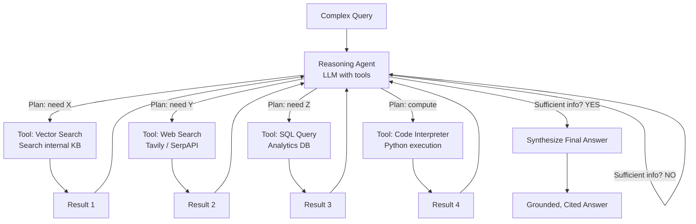

---

## 3. Implementation

### Agentic RAG with LangGraph and Tool Calling

```python
"""
Agentic RAG using OpenAI tool calling.
The agent decides which tool to use, when to use it,
and when it has enough information.
"""

import asyncio
import json
from typing import List, Dict, Optional, Any
from openai import AsyncOpenAI

client = AsyncOpenAI()


# ─── Tool Definitions ─────────────────────────────────────────────────────────

TOOLS = [
    {
        "type": "function",
        "function": {
            "name": "search_knowledge_base",
            "description": "Search the internal knowledge base for relevant information using semantic vector search.",
            "parameters": {
                "type": "object",
                "properties": {
                    "query": {
                        "type": "string",
                        "description": "The search query to find relevant internal documents",
                    },
                    "top_k": {
                        "type": "integer",
                        "description": "Number of results to return (default 3, max 10)",
                        "default": 3,
                    },
                },
                "required": ["query"],
            },
        },
    },
    {
        "type": "function",
        "function": {
            "name": "search_web",
            "description": "Search the web for current, public information not in the knowledge base.",
            "parameters": {
                "type": "object",
                "properties": {
                    "query": {"type": "string", "description": "The web search query"},
                },
                "required": ["query"],
            },
        },
    },
    {
        "type": "function",
        "function": {
            "name": "execute_sql",
            "description": "Execute a SQL query against the analytics database for numeric data, metrics, and aggregations.",
            "parameters": {
                "type": "object",
                "properties": {
                    "sql": {"type": "string", "description": "The SQL query to execute"},
                },
                "required": ["sql"],
            },
        },
    },
]


# ─── Tool Executors ───────────────────────────────────────────────────────────

async def execute_tool(
    tool_name: str,
    tool_args: Dict,
    retriever=None,
    db_connection=None,
) -> str:
    """Route tool calls to their implementations."""

    if tool_name == "search_knowledge_base":
        if retriever is None:
            return "Error: Knowledge base not configured"
        query = tool_args["query"]
        top_k = tool_args.get("top_k", 3)
        docs = await retriever.retrieve(query, top_k=top_k)
        results = [f"[{i+1}] {doc.get('text', '')}" for i, doc in enumerate(docs)]
        return "\n\n".join(results) if results else "No relevant documents found."

    elif tool_name == "search_web":
        # Mock web search — replace with actual Tavily/SerpAPI call
        return f"[Web Search Results for: {tool_args['query']}]\nPlaceholder web result."

    elif tool_name == "execute_sql":
        # Mock SQL execution — replace with actual DB connection
        return f"[SQL Result for: {tool_args['sql']}]\nPlaceholder: 1,250,000"

    return f"Unknown tool: {tool_name}"


# ─── Agentic RAG Loop ─────────────────────────────────────────────────────────

class AgenticRAG:
    """
    Agentic RAG: an agent that orchestrates retrieval across multiple tools.
    
    The agent reasons about what information it needs, calls the appropriate
    tools, integrates results, and knows when to stop.
    
    Max iterations prevent infinite loops.
    """

    SYSTEM_PROMPT = """You are a research assistant with access to:
1. search_knowledge_base: Search the internal company knowledge base
2. search_web: Search the public internet
3. execute_sql: Query the analytics database for metrics and data

Use these tools to gather the information needed to answer the user's question accurately.
- Call tools sequentially or plan your searches thoughtfully
- Cite your sources in the final answer
- If you have gathered sufficient information, provide a comprehensive answer
- Be specific about which source provided which information"""

    def __init__(
        self,
        model: str = "gpt-4o",
        max_iterations: int = 10,
        retriever=None,
    ):
        self.model = model
        self.max_iterations = max_iterations
        self.retriever = retriever

    async def run(self, query: str) -> Dict:
        messages = [
            {"role": "system", "content": self.SYSTEM_PROMPT},
            {"role": "user", "content": query},
        ]

        tool_calls_made: List[Dict] = []
        iterations = 0

        while iterations < self.max_iterations:
            iterations += 1

            # Agent reasoning step
            response = await client.chat.completions.create(
                model=self.model,
                messages=messages,
                tools=TOOLS,
                tool_choice="auto",
            )

            message = response.choices[0].message
            messages.append(message.model_dump())

            # Check if agent is done (no more tool calls)
            if not message.tool_calls:
                return {
                    "answer": message.content,
                    "iterations": iterations,
                    "tool_calls": tool_calls_made,
                }

            # Execute all tool calls (potentially in parallel)
            tool_results = []
            tool_execution_tasks = []

            for tool_call in message.tool_calls:
                args = json.loads(tool_call.function.arguments)
                tool_execution_tasks.append(
                    execute_tool(tool_call.function.name, args, self.retriever)
                )
                tool_calls_made.append({
                    "tool": tool_call.function.name,
                    "args": args,
                })

            # Execute tools concurrently
            results = await asyncio.gather(*tool_execution_tasks)

            # Add tool results to message history
            for tool_call, result in zip(message.tool_calls, results):
                tool_results.append({
                    "role": "tool",
                    "tool_call_id": tool_call.id,
                    "content": result,
                })

            messages.extend(tool_results)

        # Max iterations reached
        return {
            "answer": "I reached the maximum number of iterations. Please rephrase your question.",
            "iterations": iterations,
            "tool_calls": tool_calls_made,
        }
```

---

## 4. Interview Preparation

**Mid-level**: "Agentic RAG uses an AI agent with tool-calling capability to orchestrate retrieval dynamically. Instead of one fixed vector search, the agent decides which tools to use (vector DB, SQL, web search), calls them, evaluates the results, and decides if more information is needed before generating a final answer."

**Senior**: "I implement Agentic RAG using the ReAct pattern (Reason + Act) via OpenAI's native tool calling or LangGraph. The critical implementation details: (1) always cap max_iterations to prevent infinite loops; (2) execute parallel tool calls when the agent requests multiple tools in one step; (3) track tool call provenance for citation and debugging; (4) use a scratchpad to let the agent reason before each tool call. For production, I use LangSmith to trace every agent step for debugging and evaluation."

---

---

# Chapter 13: Graph RAG

---

## 1. Introduction

### What Is Graph RAG?

**Graph RAG** (Microsoft Research, 2024) is a RAG paradigm where the knowledge base is represented not as a flat collection of text chunks, but as a **knowledge graph** — a network of entities (people, places, concepts, events) and their relationships.

Instead of searching for semantically similar text chunks, Graph RAG queries traverse the entity graph, following relationships to find contextually connected knowledge that flat vector search would miss.

**Key insight**: The most important information is often not *within* a document but *between* documents — in the relationships.

---

## 2. Historical Motivation

Standard RAG struggles with "global" questions that require synthesizing information across many documents:
- "What are the common themes across all customer complaints about Product X?"
- "What is the network of relationships between executives at the top 5 companies in our portfolio?"
- "How did events in 2020 influence our hiring decisions in 2021 and 2022?"

These questions cannot be answered by finding similar text chunks. They require understanding the *structure* and *connections* across the entire corpus.

Microsoft Research published "From Local to Global: A Graph RAG Approach to Query-Focused Summarization" in 2024, demonstrating that knowledge graph-based RAG dramatically outperforms standard RAG for such "global" questions.

---

## 3. Visual Mental Model

### Knowledge Graph vs. Vector Chunks

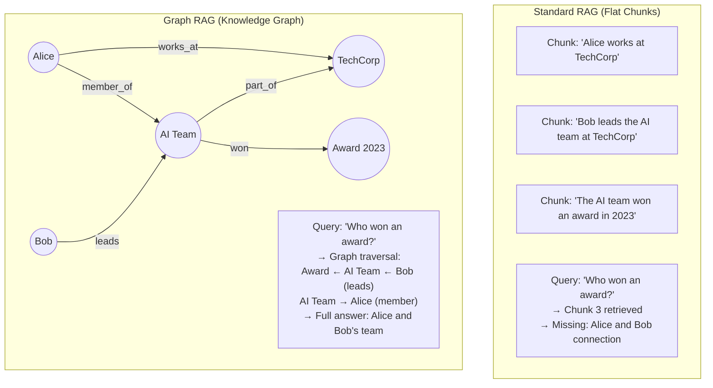

### Graph RAG Pipeline

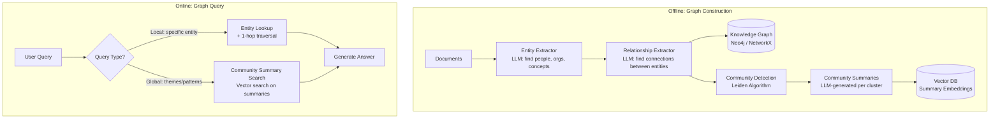

---

## 4. Implementation

### Graph RAG with Entity Extraction and Knowledge Graph

```python
"""
Graph RAG implementation:
1. Entity and relationship extraction from documents
2. Knowledge graph construction
3. Community detection and summarization
4. Graph-aware retrieval
"""

from typing import List, Dict, Tuple, Optional
from openai import AsyncOpenAI
from pydantic import BaseModel
import asyncio
import json

client = AsyncOpenAI()


# ─── Entity and Relationship Models ──────────────────────────────────────────

class Entity(BaseModel):
    name: str
    type: str    # PERSON, ORGANIZATION, CONCEPT, PRODUCT, DATE, etc.
    description: str


class Relationship(BaseModel):
    source: str      # Entity name
    target: str      # Entity name
    relation: str    # e.g., "works_at", "leads", "acquired", "founded_by"
    description: str


class GraphExtractionResult(BaseModel):
    entities: List[Entity]
    relationships: List[Relationship]


# ─── Graph Extraction ─────────────────────────────────────────────────────────

async def extract_graph(text: str) -> GraphExtractionResult:
    """
    Extract entities and relationships from a text chunk.
    This is the core of Graph RAG construction.
    """
    prompt = f"""Extract entities and relationships from this text for a knowledge graph.

Text: {text}

Extract:
1. Entities: named things (people, organizations, products, concepts, dates, places)
2. Relationships: directed connections between entities

Return JSON:
{{
  "entities": [
    {{"name": "Alice Chen", "type": "PERSON", "description": "Senior ML Engineer"}}
  ],
  "relationships": [
    {{"source": "Alice Chen", "target": "TechCorp AI Team", "relation": "leads", "description": "Alice leads the AI team"}}
  ]
}}"""

    resp = await client.chat.completions.create(
        model="gpt-4o-mini",
        messages=[{"role": "user", "content": prompt}],
        response_format={"type": "json_object"},
        temperature=0,
    )
    data = json.loads(resp.choices[0].message.content)
    return GraphExtractionResult(**data)


# ─── Knowledge Graph ─────────────────────────────────────────────────────────

class KnowledgeGraph:
    """
    In-memory knowledge graph using adjacency list.
    For production: use Neo4j or Amazon Neptune.
    """

    def __init__(self):
        self.entities: Dict[str, Entity] = {}
        self.edges: Dict[str, List[Relationship]] = {}  # source → [relationships]

    def add_entity(self, entity: Entity):
        key = entity.name.lower()
        if key not in self.entities:
            self.entities[key] = entity

    def add_relationship(self, rel: Relationship):
        source_key = rel.source.lower()
        if source_key not in self.edges:
            self.edges[source_key] = []
        self.edges[source_key].append(rel)

    def get_neighbors(self, entity_name: str, depth: int = 1) -> List[Dict]:
        """
        Traverse the graph to find connected entities up to `depth` hops.
        """
        visited = set()
        results = []
        queue = [(entity_name.lower(), 0)]

        while queue:
            current, current_depth = queue.pop(0)
            if current in visited or current_depth > depth:
                continue
            visited.add(current)

            if current in self.entities:
                entity = self.entities[current]
                results.append({
                    "entity": entity,
                    "depth": current_depth,
                })

            if current in self.edges:
                for rel in self.edges[current]:
                    neighbor = rel.target.lower()
                    results.append({"relationship": rel, "depth": current_depth})
                    if current_depth < depth:
                        queue.append((neighbor, current_depth + 1))

        return results

    def get_community_context(self, entity_names: List[str]) -> str:
        """
        Get all relationships and entities connected to a set of entities.
        Used to build context for LLM generation.
        """
        all_context = []
        for name in entity_names:
            neighbors = self.get_neighbors(name, depth=2)
            for item in neighbors:
                if "entity" in item:
                    e = item["entity"]
                    all_context.append(f"{e.name} ({e.type}): {e.description}")
                elif "relationship" in item:
                    r = item["relationship"]
                    all_context.append(f"{r.source} --[{r.relation}]--> {r.target}: {r.description}")

        return "\n".join(set(all_context))  # Deduplicate


# ─── Graph RAG Pipeline ───────────────────────────────────────────────────────

class GraphRAGPipeline:
    """
    Graph RAG: entity extraction + graph construction + graph-aware retrieval.
    """

    def __init__(self):
        self.graph = KnowledgeGraph()
        self.community_summaries: Dict[str, str] = {}  # community_id → summary text

    async def ingest(self, documents: List[Dict]):
        """
        Build knowledge graph from documents.
        Steps: extract entities + relationships → add to graph.
        """
        extraction_tasks = [
            extract_graph(doc["text"])
            for doc in documents
        ]
        results = await asyncio.gather(*extraction_tasks)

        for result in results:
            for entity in result.entities:
                self.graph.add_entity(entity)
            for rel in result.relationships:
                self.graph.add_relationship(rel)

        print(f"Graph built: {len(self.graph.entities)} entities, "
              f"{sum(len(v) for v in self.graph.edges.values())} relationships")

    async def summarize_communities(self):
        """
        Detect communities (dense subgraphs) and summarize each.
        For production, use the Leiden algorithm (graspologic library).
        Here we use a simplified version.
        """
        # Group entities by type as a simple community proxy
        type_groups: Dict[str, List[str]] = {}
        for name, entity in self.graph.entities.items():
            type_groups.setdefault(entity.type, []).append(name)

        for entity_type, names in type_groups.items():
            context = self.graph.get_community_context(names[:20])  # Limit
            if not context:
                continue

            prompt = f"""Summarize the key facts about this group of {entity_type} entities and their relationships:

{context}

Write a comprehensive 2-3 paragraph summary suitable for answering questions about this community."""

            resp = await client.chat.completions.create(
                model="gpt-4o-mini",
                messages=[{"role": "user", "content": prompt}],
                temperature=0,
                max_tokens=400,
            )
            self.community_summaries[entity_type] = resp.choices[0].message.content

    async def query(self, query: str) -> Dict:
        """
        Graph-aware retrieval and generation.
        
        1. Extract query entities
        2. Traverse graph from those entities
        3. Generate grounded answer
        """
        # 1. Extract entities from query
        entity_resp = await client.chat.completions.create(
            model="gpt-4o-mini",
            messages=[{
                "role": "user",
                "content": f"List all entity names mentioned in: '{query}'. One per line. Names only."
            }],
            temperature=0,
        )
        query_entities = [
            line.strip()
            for line in entity_resp.choices[0].message.content.strip().split("\n")
            if line.strip()
        ]

        # 2. Traverse graph from query entities (2-hop)
        graph_context_parts = []
        for entity_name in query_entities:
            context = self.graph.get_community_context([entity_name])
            if context:
                graph_context_parts.append(f"[Context for {entity_name}]\n{context}")

        # 3. Add community summaries if available
        community_context = "\n\n".join(self.community_summaries.values()) if self.community_summaries else ""
        
        all_context = "\n\n".join(graph_context_parts)
        if community_context:
            all_context = all_context + "\n\n[Community Summaries]\n" + community_context[:2000]

        if not all_context.strip():
            all_context = "No relevant graph context found."

        # 4. Generate answer from graph context
        resp = await client.chat.completions.create(
            model="gpt-4o",
            messages=[
                {
                    "role": "system",
                    "content": "Answer the question using the provided knowledge graph context. Cite specific entities and relationships.",
                },
                {
                    "role": "user",
                    "content": f"Graph Context:\n{all_context}\n\nQuestion: {query}",
                },
            ],
            temperature=0,
        )

        return {
            "answer": resp.choices[0].message.content,
            "query_entities": query_entities,
            "graph_context_length": len(all_context),
        }
```

---

## 5. Tradeoffs

| Feature | Standard RAG | Graph RAG |
|---|---|---|
| Local queries (specific docs) | ✅ Excellent | Good |
| Global queries (themes, patterns) | ❌ Poor | ✅ Excellent |
| Relationship queries | ❌ Poor | ✅ Excellent |
| Construction cost | Low | High (LLM entity extraction) |
| Query latency | Low | Medium-High (graph traversal) |
| Maintenance | Simple (re-chunk) | Complex (maintain graph) |
| Best for | Document Q&A | Knowledge analysis, enterprise intelligence |

---

## 6. Interview Preparation

**Mid-level**: "Graph RAG builds a knowledge graph from documents — extracting entities (people, organizations, products) and relationships between them. Instead of searching for similar text chunks, retrieval traverses the graph from query entities. This enables answering questions that require connecting information across multiple documents."

**Senior**: "Graph RAG is the right choice for two types of questions that standard RAG fails at: (1) global synthesis questions like 'What are the common themes across all customer complaints?' which require summarizing entire communities in the graph; (2) multi-hop relational questions like 'Who are the competitors of our partners?' which require graph traversal. The construction cost is significant — entity and relationship extraction requires one LLM call per chunk. For a 10K document corpus, that's 10K LLM calls for ingestion. I amortize this by running ingestion as an async offline batch process and refreshing incrementally as new documents arrive."

---

---

# Summary: Part 8 — RAG Engineering

This part built the full RAG engineering stack — from the simplest one-call pipeline to the most sophisticated agentic and graph-based systems:

| Chapter | Core Pattern |
|---|---|
| **1. Basic RAG** | Chunk → Embed → Store → Retrieve top-K → Augment prompt → Generate. The foundational pipeline. |
| **2. Advanced RAG** | Pre-retrieval (query rewrite), retrieval (hybrid), post-retrieval (rerank, compress). Stack techniques to fix specific failure modes. |
| **3. Hybrid Search** | Dense + BM25 in parallel, fused with RRF. Always use in production. 15-25% NDCG improvement. |
| **4. Reranking** | Bi-encoder for recall, cross-encoder for precision. Retrieve 50 → Rerank to 5 → LLM. Apply lost-in-middle reordering. |
| **5. Parent-Child** | Embed small child chunks (precision), return large parent chunks (context). Decouples retrieval from generation quality. |
| **6. Context Compression** | Extract only query-relevant sentences before LLM. Reduces noise and token cost. |
| **7. HyDE** | Embed hypothetical answer (not question) to reduce query-document space asymmetry. |
| **8. Multi-Query** | 3-5 query variants → parallel retrieval → RRF fusion. Overcomes vocabulary mismatch. |
| **9. Self-RAG** | LLM decides: retrieve or not? Relevant? Faithful? Useful? Reflection-driven quality control. |
| **10. CRAG** | Evaluate retrieval quality before generation. Correct by web search if vector retrieval fails. |
| **11. Adaptive RAG** | Route query to appropriate strategy: no retrieval, single retrieval, or multi-hop based on complexity. |
| **12. Agentic RAG** | Agent loops: reason → select tool → call tool → evaluate → repeat until sufficient info. |
| **13. Graph RAG** | Build knowledge graph from documents. Traverse entities and relationships for global synthesis queries. |

### When to Use Which Pattern

```
Starting RAG from zero?               → Basic RAG
Poor recall on keywords/codes?        → Add Hybrid Search
LLM ignores middle of context?        → Add Reranking + LIM Reorder
Long documents with mixed content?    → Parent-Child Retrieval
Too much noise in LLM context?        → Context Compression
Semantic query, dense model struggling? → HyDE
Query vocabulary ≠ document vocabulary? → Multi-Query
Want to reduce unnecessary retrievals?  → Self-RAG
Vector DB has knowledge gaps?           → CRAG
Queries range from simple to complex?   → Adaptive RAG
Need multiple data sources (SQL+web+KB)? → Agentic RAG
Questions about relationships/patterns?  → Graph RAG
```

---

*End of Part 8 — RAG Engineering*
