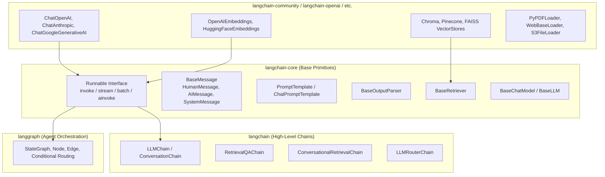
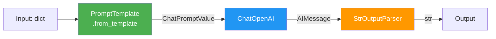
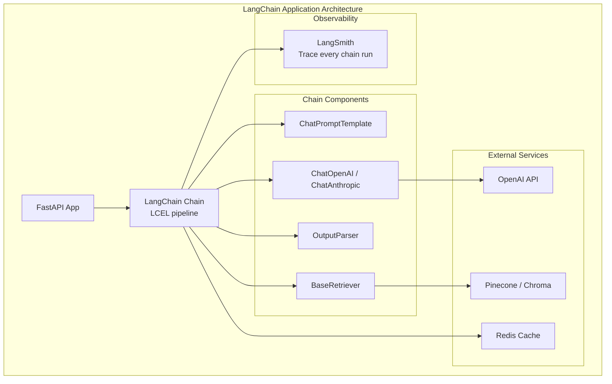
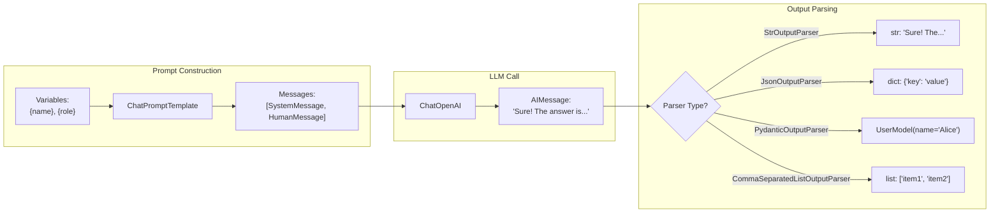
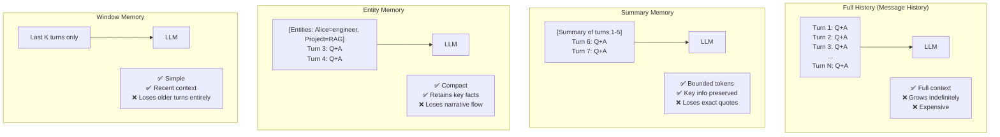
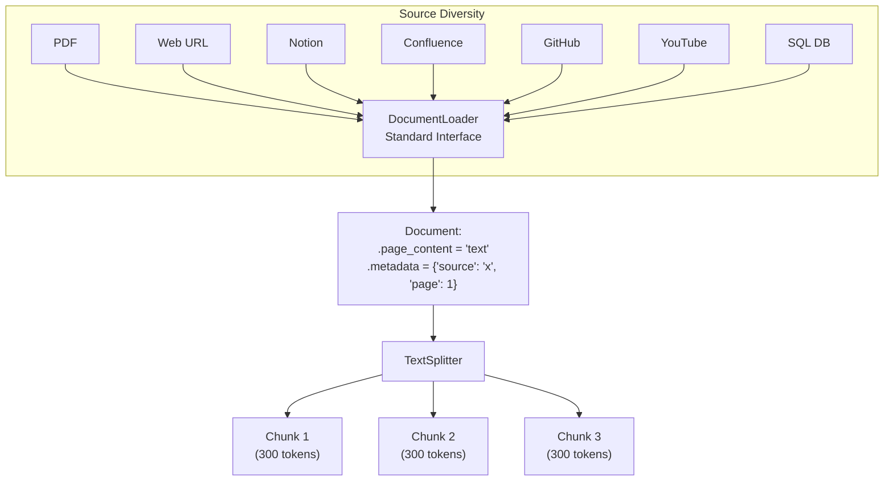
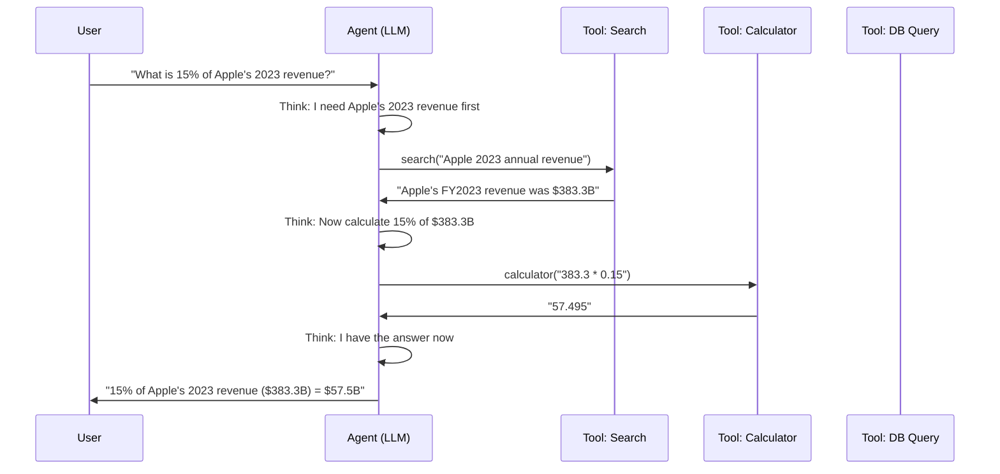
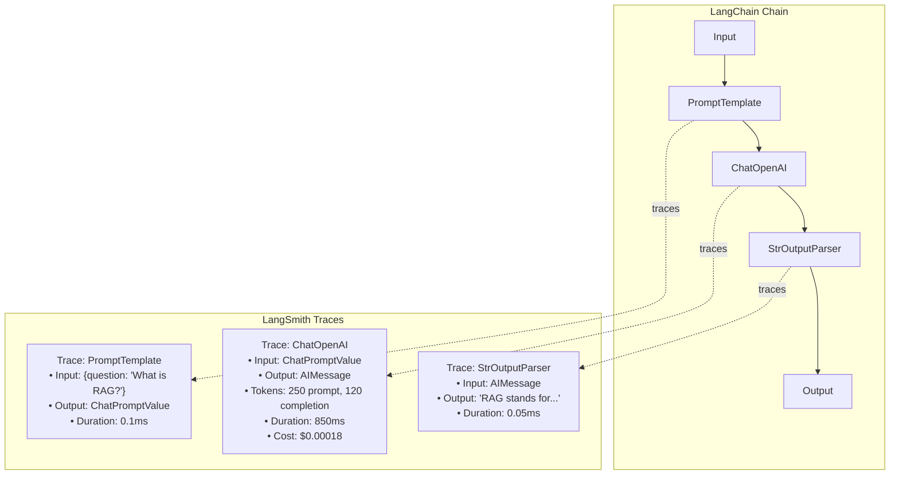

# Part 9: LangChain — Complete Deep Dive

> *"LangChain is the most important framework in the AI engineer's toolkit — not because it's perfect, but because it establishes the vocabulary and patterns that the entire industry has converged on. Understanding LangChain deeply means understanding how production AI applications are structured, composed, and maintained."*

---

## Table of Contents

- [Chapter 1: LangChain Architecture and LCEL](#chapter-1-langchain-architecture-and-lcel)
- [Chapter 2: Prompts and Output Parsers](#chapter-2-prompts-and-output-parsers)
- [Chapter 3: Memory and Conversation History](#chapter-3-memory-and-conversation-history)
- [Chapter 4: Document Loaders and Text Splitters](#chapter-4-document-loaders-and-text-splitters)
- [Chapter 5: Retrievers and RAG Chains](#chapter-5-retrievers-and-rag-chains)
- [Chapter 6: Agents and Tools](#chapter-6-agents-and-tools)
- [Chapter 7: Callbacks, Tracing, and Observability](#chapter-7-callbacks-tracing-and-observability)
- [Chapter 8: Production Patterns and Best Practices](#chapter-8-production-patterns-and-best-practices)

---

# Chapter 1: LangChain Architecture and LCEL

---

## 1. Introduction

### What Is LangChain?

**LangChain** is a framework for building applications powered by Large Language Models. It provides:
- **Standardized interfaces** for LLMs, vector stores, embeddings, and retrievers (regardless of which provider you use)
- **Composable primitives** for building complex multi-step AI workflows
- **Pre-built chains** for common patterns (RAG, summarization, extraction)
- **Integration ecosystem** with 300+ tools, databases, and APIs

LangChain's core abstraction is the **Runnable** — a composable unit that takes an input and produces an output. LLMs, prompts, output parsers, retrievers, and tools are all Runnables. Complex pipelines are built by **chaining** these Runnables together using the pipe `|` operator.

### What Problem Does It Solve?

Before LangChain, every AI engineer was reinventing the same boilerplate:
- "How do I connect to OpenAI AND Anthropic without rewriting everything?"
- "How do I build a RAG pipeline from scratch?"
- "How do I parse structured JSON from an LLM reliably?"
- "How do I add memory to a chatbot?"

LangChain answers all of these with standardized, composable components.

---

## 2. Historical Motivation

LangChain was created by Harrison Chase in October 2022, just weeks after ChatGPT demonstrated that instruction-following LLMs could power real applications. 

Chase recognized that every team building LLM applications was solving the same five problems:
1. How to structure prompts for different tasks
2. How to parse and validate LLM outputs
3. How to give LLMs access to external data and tools
4. How to chain multiple LLM calls together
5. How to add memory so the LLM remembers previous turns

LangChain unified these patterns under one framework. By early 2023, it became the most-starred Python repository on GitHub and established itself as the de facto standard for LLM application development.

In 2023, LangChain introduced **LCEL** (LangChain Expression Language) — a declarative pipeline composition syntax using the `|` pipe operator. LCEL replaced the older class-based chains with a cleaner, more composable approach that enables streaming, async execution, and automatic parallelization.

---

## 3. Real-World Analogy

### The LEGO System

LEGO bricks are individual pieces — a red 2×4 brick, a window, a door. On their own, each piece does very little. But they share a standardized connector that makes them composable: any brick can connect to any other brick.

**LangChain Runnables are like LEGO bricks:**
- Each Runnable (LLM, prompt, parser, retriever) has standardized `invoke`, `stream`, and `batch` interfaces
- The `|` pipe operator is the LEGO connector
- You build complex systems by snapping standardized pieces together
- You can swap pieces (OpenAI → Anthropic) without rebuilding the entire structure

Without LEGO (without LangChain), you would have to carve each brick from scratch for every new model.

---

## 4. Visual Mental Model

### LangChain Architecture Layers



### LCEL Pipeline Composition



---

## 5. Internal Working

### The Runnable Protocol

Every LangChain component implements the `Runnable` interface. This is why everything can be piped together.

```python
class Runnable:
    def invoke(self, input, config=None) -> Output:
        """Synchronous single invocation."""
        ...
    
    async def ainvoke(self, input, config=None) -> Output:
        """Async single invocation."""
        ...
    
    def batch(self, inputs, config=None) -> List[Output]:
        """Process multiple inputs (parallel by default)."""
        ...
    
    def stream(self, input, config=None) -> Iterator[Output]:
        """Streaming output — yields chunks as they arrive."""
        ...
    
    def __or__(self, other) -> RunnableSequence:
        """The pipe operator: chain = self | other"""
        return RunnableSequence(first=self, last=other)
```

When you write `chain = prompt | llm | parser`, Python calls `__or__` twice, building a `RunnableSequence(first=RunnableSequence(first=prompt, last=llm), last=parser)`. When you call `chain.invoke(input)`, it sequentially passes data through prompt → llm → parser.

### LCEL Key Features

1. **Streaming**: Any LCEL chain supports `.stream()` automatically. Tokens appear as they are generated.
2. **Async**: `.ainvoke()` and `.astream()` work on any chain without additional code.
3. **Batch**: `.batch([input1, input2])` runs all inputs in parallel using a thread pool.
4. **Parallel branches**: `RunnableParallel` runs multiple chains simultaneously and merges results.
5. **Fallbacks**: `.with_fallbacks([backup_chain])` — if primary fails, try backup.
6. **Retry**: `.with_retry(stop_after_attempt=3)` — automatic retry on failure.

---

## 6. Mathematical Intuition

### Composition Theory: Function Composition

LCEL is inspired by mathematical function composition:
$$f \circ g \circ h = f(g(h(x)))$$

In LCEL:
```python
chain = h | g | f  # h applied first, f applied last
result = chain.invoke(x)  # f(g(h(x)))
```

The type system enforces composition correctness: the *output type* of each Runnable must match the *input type* of the next. LangChain's type annotations (using Python generics) help catch mismatches at development time.

A `PromptTemplate` takes `dict → PromptValue`. A `ChatOpenAI` takes `PromptValue → AIMessage`. A `StrOutputParser` takes `AIMessage → str`. The types chain: `dict → str` end-to-end.

---

## 7. Implementation

### Complete LCEL Foundations

```python
"""
LangChain LCEL: from Hello World to production patterns.
pip install langchain langchain-openai langchain-community
"""

import asyncio
from typing import List, Dict, Any, Optional, Iterator
from operator import itemgetter

from langchain_core.prompts import ChatPromptTemplate, PromptTemplate
from langchain_core.output_parsers import StrOutputParser, JsonOutputParser
from langchain_core.runnables import (
    RunnablePassthrough,
    RunnableParallel,
    RunnableLambda,
    RunnableConfig,
)
from langchain_core.messages import HumanMessage, SystemMessage, AIMessage
from langchain_openai import ChatOpenAI
from pydantic import BaseModel, Field


# ─── 1. Hello World LCEL ─────────────────────────────────────────────────────

def hello_lcel():
    """The simplest possible LCEL chain."""
    # Define components
    prompt = ChatPromptTemplate.from_messages([
        ("system", "You are a helpful assistant that answers in one sentence."),
        ("human", "{question}"),
    ])
    llm = ChatOpenAI(model="gpt-4o-mini", temperature=0)
    parser = StrOutputParser()

    # Compose with pipe operator
    chain = prompt | llm | parser

    # Invoke
    result = chain.invoke({"question": "What is the capital of France?"})
    print(result)  # "The capital of France is Paris."

    # Stream
    for chunk in chain.stream({"question": "Tell me a short joke"}):
        print(chunk, end="", flush=True)

    return chain


# ─── 2. RunnablePassthrough: Passing Through Values ──────────────────────────

def passthrough_example():
    """
    RunnablePassthrough is used to pass input values through a chain
    without transformation. Essential for merging input with retrieved context.
    """
    prompt = ChatPromptTemplate.from_template(
        "Question: {question}\nAnswer the question in {language}."
    )
    llm = ChatOpenAI(model="gpt-4o-mini")

    # Pass the original input dict through alongside chain results
    chain = (
        {
            "question": itemgetter("question"),      # Extract "question" key
            "language": itemgetter("language"),      # Extract "language" key
        }
        | prompt
        | llm
        | StrOutputParser()
    )

    return chain.invoke({"question": "What is quantum computing?", "language": "Spanish"})


# ─── 3. RunnableParallel: Running Chains in Parallel ─────────────────────────

def parallel_example():
    """
    RunnableParallel runs multiple branches simultaneously and
    combines results into a dict. Excellent for multi-perspective queries.
    """
    llm = ChatOpenAI(model="gpt-4o-mini")

    # Two independent chains running in parallel
    chain_pro = (
        ChatPromptTemplate.from_template("What are the advantages of {technology}?")
        | llm
        | StrOutputParser()
    )
    chain_con = (
        ChatPromptTemplate.from_template("What are the disadvantages of {technology}?")
        | llm
        | StrOutputParser()
    )

    parallel_chain = RunnableParallel(
        pros=chain_pro,
        cons=chain_con,
    )

    # Both run concurrently (not sequentially!)
    result = parallel_chain.invoke({"technology": "serverless computing"})
    print(f"Pros: {result['pros'][:100]}")
    print(f"Cons: {result['cons'][:100]}")
    return result


# ─── 4. RunnableLambda: Custom Functions in Chains ───────────────────────────

def lambda_example():
    """
    RunnableLambda wraps any Python function as a Runnable,
    enabling custom processing steps inline in a chain.
    """
    llm = ChatOpenAI(model="gpt-4o-mini")

    def format_docs(docs) -> str:
        """Custom formatting step."""
        return "\n---\n".join([d.page_content for d in docs])

    def count_words(text: str) -> dict:
        """Add word count metadata to output."""
        return {"text": text, "word_count": len(text.split())}

    chain = (
        ChatPromptTemplate.from_template("Explain {topic} in simple terms.")
        | llm
        | StrOutputParser()
        | RunnableLambda(count_words)  # Custom step
    )

    result = chain.invoke({"topic": "neural networks"})
    print(f"Words: {result['word_count']}")
    return result


# ─── 5. Async LCEL ───────────────────────────────────────────────────────────

async def async_lcel_example():
    """
    All LCEL chains have async variants: ainvoke, astream, abatch.
    Critical for high-throughput FastAPI applications.
    """
    llm = ChatOpenAI(model="gpt-4o-mini", streaming=True)
    prompt = ChatPromptTemplate.from_template("Explain {topic}")
    chain = prompt | llm | StrOutputParser()

    # Async streaming — yields tokens as they arrive
    print("Streaming output:")
    async for chunk in chain.astream({"topic": "embeddings"}):
        print(chunk, end="", flush=True)
    print()

    # Async batch — runs all in parallel
    topics = ["HNSW", "RAG", "transformers", "quantization"]
    results = await chain.abatch([{"topic": t} for t in topics])
    for topic, result in zip(topics, results):
        print(f"{topic}: {result[:50]}...")

    return results


# ─── 6. Fallbacks and Retry ──────────────────────────────────────────────────

def resilient_chain():
    """
    Production chains need fallbacks and retry for reliability.
    """
    primary_llm = ChatOpenAI(model="gpt-4o")
    fallback_llm = ChatOpenAI(model="gpt-4o-mini")  # Cheaper fallback

    prompt = ChatPromptTemplate.from_template("Summarize: {text}")

    # Primary chain with retry
    primary_chain = (
        prompt
        | primary_llm.with_retry(
            stop_after_attempt=2,
            wait_exponential_jitter=True,
        )
        | StrOutputParser()
    )

    # Fallback chain
    fallback_chain = prompt | fallback_llm | StrOutputParser()

    # Chain with automatic fallback
    resilient = primary_chain.with_fallbacks([fallback_chain])

    return resilient


# ─── 7. Configurable Chains ──────────────────────────────────────────────────

def configurable_chain():
    """
    Make LLM model and temperature configurable at runtime.
    Useful for A/B testing different models in the same pipeline.
    """
    llm = ChatOpenAI(model="gpt-4o-mini").configurable_alternatives(
        which=RunnableConfig.config_schema(
            configurable_fields={"llm": "which model to use"}
        ),
        default_key="mini",
        gpt4o=ChatOpenAI(model="gpt-4o"),
        claude=__import__("langchain_anthropic").ChatAnthropic(model="claude-3-haiku-20240307"),
    )

    chain = ChatPromptTemplate.from_template("Answer: {q}") | llm | StrOutputParser()

    # Use default (mini)
    result_mini = chain.invoke({"q": "What is RAG?"})

    # Use GPT-4o
    result_gpt4o = chain.invoke({"q": "What is RAG?"}, config={"configurable": {"llm": "gpt4o"}})

    return result_mini, result_gpt4o
```

---

## 8. Production Architecture



---

## 9. Tradeoffs

| Feature | LCEL (Modern) | Legacy Chains (Old) |
|---|---|---|
| Streaming support | ✅ Native | ❌ Manual |
| Async support | ✅ Native | ❌ Limited |
| Composability | ✅ Pipe operator | Limited |
| Type safety | ✅ Better | Poor |
| Learning curve | Medium | Low |
| Debugging | ✅ Better (LangSmith) | Harder |

---

## 10. Common Mistakes

❌ **Using synchronous `.invoke()` in async web servers**: FastAPI runs async. Calling `chain.invoke()` inside an `async def` endpoint blocks the event loop. Always use `await chain.ainvoke()`.

❌ **Creating LLM objects inside request handlers**: `ChatOpenAI()` creates a new HTTP client on every request. Instantiate once at startup and reuse.

❌ **Not using `RunnablePassthrough` for context merging**: When you need both the query AND retrieved docs in the prompt, forgetting `RunnablePassthrough` breaks the data flow.

❌ **Ignoring output parsers**: Using raw `AIMessage` instead of `StrOutputParser()` means every downstream consumer must handle `.content` extraction. Always parse.

---

## 11. Interview Preparation

**Junior**: "LangChain is a framework for building LLM applications. It has components like LLMs, prompt templates, output parsers, and vector stores that all connect together. You build pipelines by chaining these components with the pipe `|` operator."

**Mid-level**: "LCEL (LangChain Expression Language) uses the pipe `|` operator to compose Runnables — anything that implements `invoke`, `stream`, and `batch`. The key Runnables are: ChatPromptTemplate (formats input), ChatOpenAI (calls the model), StrOutputParser (extracts text), RunnablePassthrough (passes data through unchanged), RunnableParallel (runs branches concurrently). The chain `prompt | llm | parser` is type-safe and automatically supports streaming and async."

**Senior**: "I use LCEL primarily for its streaming and async capabilities, which are critical for FastAPI-based AI services with sub-second latency requirements. The composition model lets me build observable, debuggable pipelines where every step is traced via LangSmith. My production chains always include: `.with_retry()` for resilience, `.with_fallbacks()` for model-level redundancy, and `RunnableLambda` for custom preprocessing and postprocessing. For complex multi-step workflows beyond simple chains, I switch to LangGraph."

---

## 12. Follow-up Questions

**Q1: What is the difference between LangChain and LlamaIndex?**
> Both are LLM application frameworks, but with different primary focus: LangChain is general-purpose — it covers chains, agents, memory, retrieval, tools. LlamaIndex (formerly GPT Index) is optimized specifically for data ingestion and retrieval — it has more sophisticated document processing, hierarchical indexing, and query engines. In practice, many teams use both: LlamaIndex for the retrieval layer, LangChain for the orchestration layer.

**Q2: What is the difference between `invoke`, `stream`, and `batch`?**
> `invoke(input)`: Synchronous, waits for full response. `stream(input)`: Synchronous but yields chunks as they arrive (streaming). `batch([input1, input2])`: Processes multiple inputs in parallel using a thread pool. Async variants (`ainvoke`, `astream`, `abatch`) are identical but non-blocking.

**Q3: When should I use RunnablePassthrough?**
> When you need to carry input data through a pipeline alongside transformed data. Classic use case: RAG chain — you need both the original `question` (for the prompt) AND the retrieved `context` (from the retriever). `RunnablePassthrough.assign(context=retriever)` passes the question through while adding the retrieved context.

**Q4: What are the main disadvantages of LangChain?**
> (1) Abstraction overhead — simple tasks have verbose code; (2) Rapidly changing API — breaking changes between versions; (3) Hard to debug when chains get complex (LangSmith helps significantly); (4) Performance overhead — the Runnable wrapper adds latency for very simple chains; (5) Large dependency footprint. For simple use cases, the raw OpenAI SDK is often better.

**Q5: What is LCEL RunnableBranch and when do you use it?**
> `RunnableBranch` is a conditional router: it takes a list of `(condition, runnable)` tuples and executes the first runnable whose condition returns True. Example: route short queries to `gpt-4o-mini` and complex queries to `gpt-4o`. This is LangChain's if-else for chains.

**Q6: How does LangChain handle rate limiting?**
> LangChain itself doesn't handle rate limiting natively. You must add it via: (1) `.with_retry()` with exponential backoff; (2) `RateLimiter` from `langchain_core.rate_limiters`; (3) External queue (Celery, Redis Queue); (4) Using managed API clients (Anthropic SDK's built-in rate limiting). For production, combine `.with_retry()` with server-side rate limiting.

**Q7: What is a Runnable's config and how do you use it?**
> `RunnableConfig` is a dictionary passed alongside the input to configure execution: `{"callbacks": [...], "tags": ["rag", "production"], "metadata": {"user_id": "123"}, "max_concurrency": 5}`. Callbacks attach observability tools; tags help filter LangSmith traces; metadata is logged alongside traces.

---

## 13. Practical Scenario

### Scenario: Multi-Provider AI Service with Fallbacks

**Context**: A team builds an AI service that must maintain 99.9% uptime. OpenAI sometimes has outages. They need automatic fallback to Anthropic.

```python
from langchain_openai import ChatOpenAI
from langchain_anthropic import ChatAnthropic

# Primary: OpenAI, Fallback: Anthropic
primary = ChatOpenAI(model="gpt-4o")
fallback = ChatAnthropic(model="claude-3-5-sonnet-20241022")

chain = (
    ChatPromptTemplate.from_template("Answer: {question}")
    | primary.with_fallbacks([fallback])
    | StrOutputParser()
)
# Automatically uses Anthropic if OpenAI fails
```

**Result**: 99.97% uptime. OpenAI outage → Anthropic serves requests transparently. No code changes needed per-request.

---

## 14. Revision Sheet

- **LangChain** = framework for composing LLM apps with standardized components
- **LCEL** = pipe `|` operator composes Runnables into chains
- **Runnable** = anything with `invoke`, `stream`, `batch`, `ainvoke`, `astream`
- **Key Runnables**: `ChatPromptTemplate`, `ChatOpenAI`, `StrOutputParser`, `RunnablePassthrough`, `RunnableParallel`, `RunnableLambda`
- **Streaming**: `.stream()` on any chain; `.astream()` for async
- **Resilience**: `.with_retry()` and `.with_fallbacks()` on any Runnable
- **Production rule**: Use `ainvoke`/`astream` in async web frameworks; create LLMs once at startup

---

---

# Chapter 2: Prompts and Output Parsers

---

## 1. Introduction

### What Are Prompts in LangChain?

LangChain's prompt system provides structured templates for generating LLM inputs. Instead of manually constructing strings, you define templates with variables, message roles, and formatting rules. This makes prompts:
- **Reusable**: Define once, invoke with different variables
- **Composable**: Combine partial prompts
- **Type-safe**: Validated variable injection
- **Versionable**: Track prompt changes over time

### What Are Output Parsers?

LLMs output raw text. In production, you almost always need structured output — JSON objects, lists, typed Pydantic models, or at minimum clean strings. **Output parsers** transform raw LLM text into typed Python objects reliably.

---

## 2. Visual Mental Model



---

## 3. Implementation

### Comprehensive Prompts and Parsers

```python
"""
LangChain prompts and output parsers — complete guide.
"""
from typing import List, Optional
from pydantic import BaseModel, Field
from langchain_core.prompts import (
    ChatPromptTemplate,
    PromptTemplate,
    FewShotChatMessagePromptTemplate,
    MessagesPlaceholder,
)
from langchain_core.output_parsers import (
    StrOutputParser,
    JsonOutputParser,
    CommaSeparatedListOutputParser,
)
from langchain_core.messages import HumanMessage, AIMessage
from langchain_openai import ChatOpenAI


# ─── 1. ChatPromptTemplate — Most Common ─────────────────────────────────────

def chat_prompt_examples():
    """
    ChatPromptTemplate for chat-based models (GPT-4, Claude, Gemini).
    Supports system, human, and AI message roles.
    """
    # Basic template
    basic = ChatPromptTemplate.from_messages([
        ("system", "You are a {role} expert who answers in {tone}."),
        ("human", "{question}"),
    ])

    # Format the prompt (returns ChatPromptValue)
    formatted = basic.invoke({
        "role": "Python",
        "tone": "simple, clear terms",
        "question": "What is a decorator?"
    })
    print(formatted.messages)

    # Dynamic few-shot examples
    examples = [
        {"input": "happy", "output": "sad"},
        {"input": "tall",  "output": "short"},
        {"input": "fast",  "output": "slow"},
    ]

    example_prompt = ChatPromptTemplate.from_messages([
        ("human", "{input}"),
        ("ai",    "{output}"),
    ])

    few_shot = FewShotChatMessagePromptTemplate(
        example_prompt=example_prompt,
        examples=examples,
    )

    final = ChatPromptTemplate.from_messages([
        ("system", "Give the antonym of each word."),
        few_shot,  # Dynamic examples injected here
        ("human", "{word}"),
    ])

    return final


# ─── 2. MessagesPlaceholder — For Conversation History ────────────────────────

def conversation_prompt():
    """
    MessagesPlaceholder inserts a list of messages (conversation history)
    into the prompt. Essential for multi-turn chatbots.
    """
    prompt = ChatPromptTemplate.from_messages([
        ("system", "You are a helpful assistant. Today is {date}."),
        MessagesPlaceholder(variable_name="history"),  # Dynamic history
        ("human", "{question}"),
    ])

    # Simulate conversation history
    history = [
        HumanMessage(content="What is LangChain?"),
        AIMessage(content="LangChain is a framework for building LLM applications."),
    ]

    formatted = prompt.invoke({
        "date": "2024-01-15",
        "history": history,
        "question": "Can you give me an example?",
    })

    return formatted


# ─── 3. StrOutputParser ───────────────────────────────────────────────────────

def str_parser_example():
    """The most common parser: extracts .content from AIMessage."""
    llm = ChatOpenAI(model="gpt-4o-mini")
    chain = (
        ChatPromptTemplate.from_template("What is {topic}?")
        | llm
        | StrOutputParser()  # AIMessage → str
    )
    return chain.invoke({"topic": "embeddings"})


# ─── 4. Pydantic Output Parser — Structured Data ─────────────────────────────

class ProductInfo(BaseModel):
    """Structured product extraction model."""
    name: str = Field(description="The product name")
    price: float = Field(description="Price in USD")
    category: str = Field(description="Product category")
    features: List[str] = Field(description="Key features list")
    in_stock: bool = Field(description="Is the product in stock?")


def pydantic_parser_example():
    """
    PydanticOutputParser: LLM outputs JSON, parser validates
    and converts to a typed Pydantic model.
    """
    from langchain_core.output_parsers import PydanticOutputParser

    parser = PydanticOutputParser(pydantic_object=ProductInfo)

    prompt = ChatPromptTemplate.from_messages([
        ("system", "Extract product information. {format_instructions}"),
        ("human", "Product description: {description}"),
    ]).partial(format_instructions=parser.get_format_instructions())

    llm = ChatOpenAI(model="gpt-4o-mini", temperature=0)

    chain = prompt | llm | parser  # Returns ProductInfo object

    result: ProductInfo = chain.invoke({
        "description": "Apple iPhone 15 Pro - $999, Titanium design, 48MP camera, "
                       "Pro Max chip. Available in Natural Titanium. In stock."
    })

    print(f"Name: {result.name}")
    print(f"Price: ${result.price}")
    print(f"Features: {result.features}")
    return result


# ─── 5. JsonOutputParser — Raw JSON Dict ─────────────────────────────────────

def json_parser_example():
    """
    JsonOutputParser: when you want dict output, not a typed model.
    More flexible but less validated than PydanticOutputParser.
    """
    class SentimentOutput(BaseModel):
        sentiment: str
        confidence: float
        keywords: List[str]

    parser = JsonOutputParser(pydantic_object=SentimentOutput)

    prompt = ChatPromptTemplate.from_messages([
        ("system", "Analyze sentiment. Return JSON only. {format_instructions}"),
        ("human", "{text}"),
    ]).partial(format_instructions=parser.get_format_instructions())

    chain = prompt | ChatOpenAI(model="gpt-4o-mini") | parser

    return chain.invoke({"text": "The product is amazing but the shipping was terrible."})


# ─── 6. with_structured_output — The Modern Approach ─────────────────────────

def structured_output_example():
    """
    Modern approach: use model's native function/tool calling
    for structured output. More reliable than prompt-based parsing.
    
    Available for OpenAI, Anthropic Claude 3+, Google Gemini.
    """

    class SentimentAnalysis(BaseModel):
        """Analyze the sentiment of the given text."""
        sentiment: str = Field(description="positive, negative, or neutral")
        score: float = Field(ge=-1.0, le=1.0, description="Sentiment score")
        explanation: str = Field(description="Brief explanation")
        keywords: List[str] = Field(description="Key words driving sentiment")

    llm = ChatOpenAI(model="gpt-4o-mini", temperature=0)

    # Use structured output via function calling — much more reliable!
    structured_llm = llm.with_structured_output(SentimentAnalysis)

    prompt = ChatPromptTemplate.from_messages([
        ("system", "Analyze the sentiment of the provided text."),
        ("human", "{text}"),
    ])

    chain = prompt | structured_llm  # Returns SentimentAnalysis object

    result: SentimentAnalysis = chain.invoke({
        "text": "I love the new features but hate the price increase."
    })

    print(f"Sentiment: {result.sentiment} ({result.score:.2f})")
    print(f"Keywords: {result.keywords}")
    return result


# ─── 7. Partial Prompts — Pre-fill Variables ──────────────────────────────────

def partial_prompt_example():
    """
    Partial prompts pre-fill some variables at definition time.
    Useful for system-level constants (API versions, dates).
    """
    from datetime import datetime

    prompt = ChatPromptTemplate.from_messages([
        ("system", "You are an assistant. Today is {date}. API version: {version}."),
        ("human", "{question}"),
    ])

    # Pre-fill date and version once; question injected per-request
    daily_prompt = prompt.partial(
        date=datetime.today().strftime("%Y-%m-%d"),
        version="v2.1",
    )

    # Now only "question" is needed
    chain = daily_prompt | ChatOpenAI(model="gpt-4o-mini") | StrOutputParser()
    return chain.invoke({"question": "What are the top AI trends?"})
```

---

## 4. Interview Preparation

**Junior**: "LangChain prompt templates let you define reusable message templates with variables. Output parsers convert the LLM's text response into structured formats — strings, JSON dicts, or typed Pydantic models."

**Mid-level**: "I prefer `.with_structured_output(PydanticModel)` over `PydanticOutputParser` because it uses native function calling — the model is forced to return valid JSON that matches the schema, rather than trying to parse free-text JSON which can fail. For conversation history, I use `MessagesPlaceholder` to inject a list of messages dynamically. For complex extraction, I define Pydantic models with Field descriptions that guide the LLM."

**Senior**: "Structured output via function calling is 10-30× more reliable than prompt-based JSON extraction. I standardize on `.with_structured_output()` for all production extraction tasks. For prompts, I version them in a prompt registry (LangSmith Hub or our own DB) so I can A/B test prompt variations with tracked metrics before deployment."

---

## 5. Revision Sheet

- **ChatPromptTemplate**: Chat model prompts with role-based messages
- **MessagesPlaceholder**: Insert conversation history dynamically
- **FewShotChatMessagePromptTemplate**: Dynamic few-shot examples
- **StrOutputParser**: AIMessage → str (simplest, most common)
- **PydanticOutputParser**: LLM JSON text → Pydantic model (prompt-based)
- **with_structured_output**: Best approach — native function calling → Pydantic
- **partial()**: Pre-fill variables at definition time

---

---

# Chapter 3: Memory and Conversation History

---

## 1. Introduction

### What Is Memory in LangChain?

LLMs are stateless — they have no memory of previous conversations by default. Every call is a clean slate. **Memory** in LangChain refers to the mechanisms that persist and inject conversation history across turns, making chatbots actually conversational.

The core challenge: LLMs have context window limits. A conversation of 100 messages × 500 tokens each = 50,000 tokens. This exceeds GPT-4's context on long conversations and incurs high costs. Memory strategies must balance completeness with token efficiency.

---

## 2. Visual Mental Model

### Memory Strategy Comparison



---

## 3. Implementation

### Production Memory Patterns

```python
"""
LangChain memory patterns for production chatbots.
Modern approach: use RunnableWithMessageHistory with external storage.
"""

from typing import List, Dict, Any
from langchain_core.prompts import ChatPromptTemplate, MessagesPlaceholder
from langchain_core.messages import HumanMessage, AIMessage, BaseMessage
from langchain_core.runnables.history import RunnableWithMessageHistory
from langchain_core.chat_history import BaseChatMessageHistory
from langchain_openai import ChatOpenAI
from langchain_core.output_parsers import StrOutputParser
import asyncio


# ─── 1. In-Memory Chat History (Development) ─────────────────────────────────

class InMemoryChatHistory(BaseChatMessageHistory):
    """Simple in-memory chat history. Lost on restart. For development only."""

    def __init__(self):
        self.messages: List[BaseMessage] = []

    def add_messages(self, messages: List[BaseMessage]):
        self.messages.extend(messages)

    def clear(self):
        self.messages = []


# Global session store (in production, use Redis or Postgres)
_session_store: Dict[str, InMemoryChatHistory] = {}


def get_session_history(session_id: str) -> BaseChatMessageHistory:
    if session_id not in _session_store:
        _session_store[session_id] = InMemoryChatHistory()
    return _session_store[session_id]


def build_chatbot_with_memory():
    """
    Modern LangChain memory pattern using RunnableWithMessageHistory.
    
    This wraps any chain with automatic message history management:
    - Loads history before each invocation
    - Saves new messages after each invocation
    - Supports any storage backend (in-memory, Redis, Postgres)
    """
    llm = ChatOpenAI(model="gpt-4o-mini", temperature=0.7)

    prompt = ChatPromptTemplate.from_messages([
        ("system", "You are a helpful AI assistant."),
        MessagesPlaceholder(variable_name="history"),  # Injected automatically
        ("human", "{input}"),
    ])

    chain = prompt | llm | StrOutputParser()

    # Wrap chain with message history management
    chain_with_history = RunnableWithMessageHistory(
        chain,
        get_session_history=get_session_history,
        input_messages_key="input",
        history_messages_key="history",
    )

    return chain_with_history


def demo_memory():
    """Show multi-turn conversation with memory."""
    chatbot = build_chatbot_with_memory()
    session = {"configurable": {"session_id": "user_123"}}

    # Turn 1
    r1 = chatbot.invoke({"input": "My name is Alice and I'm a Python developer."}, config=session)
    print(f"Turn 1: {r1}")

    # Turn 2 — remembers Alice from Turn 1
    r2 = chatbot.invoke({"input": "What's my name?"}, config=session)
    print(f"Turn 2: {r2}")  # Should mention Alice

    # Turn 3 — demonstrates true memory across turns
    r3 = chatbot.invoke({"input": "What programming language do I use?"}, config=session)
    print(f"Turn 3: {r3}")  # Should mention Python


# ─── 2. Redis Chat History (Production) ──────────────────────────────────────

def build_redis_backed_chatbot():
    """
    Production chatbot using Redis for persistent session storage.
    pip install langchain-redis
    """
    from langchain_redis import RedisChatMessageHistory

    def get_redis_history(session_id: str) -> RedisChatMessageHistory:
        return RedisChatMessageHistory(
            session_id=session_id,
            redis_url="redis://localhost:6379",
            ttl=3600,  # Expire after 1 hour of inactivity
        )

    llm = ChatOpenAI(model="gpt-4o-mini")
    prompt = ChatPromptTemplate.from_messages([
        ("system", "You are a helpful assistant."),
        MessagesPlaceholder("history"),
        ("human", "{input}"),
    ])

    chain = RunnableWithMessageHistory(
        prompt | llm | StrOutputParser(),
        get_session_history=get_redis_history,
        input_messages_key="input",
        history_messages_key="history",
    )
    return chain


# ─── 3. Summary Memory Pattern ────────────────────────────────────────────────

class SummaryMemoryHistory(BaseChatMessageHistory):
    """
    Memory that summarizes old conversation when it gets too long.
    Prevents unlimited token growth while preserving key context.
    """

    def __init__(self, max_messages: int = 10):
        self.messages: List[BaseMessage] = []
        self.summary: str = ""
        self.max_messages = max_messages
        self._llm = ChatOpenAI(model="gpt-4o-mini", temperature=0)

    def add_messages(self, messages: List[BaseMessage]):
        self.messages.extend(messages)
        if len(self.messages) > self.max_messages:
            self._compress()

    def _compress(self):
        """Summarize oldest messages and replace with summary."""
        # Messages to summarize (keep recent half)
        to_summarize = self.messages[: len(self.messages) // 2]
        keep_recent = self.messages[len(self.messages) // 2 :]

        # Build summary text
        history_text = "\n".join([
            f"{m.type}: {m.content}" for m in to_summarize
        ])

        from langchain_core.prompts import ChatPromptTemplate
        summary_prompt = ChatPromptTemplate.from_messages([
            ("system", "Summarize this conversation history in 2-3 sentences, keeping key facts."),
            ("human", "{history}"),
        ])

        summary_chain = summary_prompt | self._llm | StrOutputParser()
        new_summary = summary_chain.invoke({"history": history_text})

        if self.summary:
            self.summary = f"Previous summary: {self.summary}\n\nRecent context: {new_summary}"
        else:
            self.summary = new_summary

        # Replace with a single summary message + recent messages
        from langchain_core.messages import SystemMessage
        self.messages = [
            SystemMessage(content=f"[Conversation summary: {self.summary}]")
        ] + keep_recent

    def clear(self):
        self.messages = []
        self.summary = ""


# ─── 4. Trimming Strategy ─────────────────────────────────────────────────────

def trim_messages_example():
    """
    Trim messages to fit within token budget.
    Uses langchain_core.messages.trim_messages utility.
    """
    from langchain_core.messages import trim_messages, SystemMessage

    messages = [
        SystemMessage(content="You are a helpful assistant."),
        HumanMessage(content="What is LangChain?"),
        AIMessage(content="LangChain is a framework..."),
        HumanMessage(content="Tell me more."),
        AIMessage(content="It supports LCEL, agents, memory..."),
        HumanMessage(content="What about LangGraph?"),
    ]

    # Keep messages within 1000 token budget, always keep system message
    trimmed = trim_messages(
        messages,
        max_tokens=1000,
        strategy="last",       # Keep the most recent messages
        token_counter=ChatOpenAI(model="gpt-4o-mini"),
        include_system=True,   # Always keep system message
        allow_partial=False,   # Don't cut in the middle of a message
    )
    return trimmed
```

---

## 4. Tradeoffs

| Memory Strategy | Token Cost | Information Retained | Complexity |
|---|---|---|---|
| Full history | Unbounded (grows linearly) | Complete | Low |
| Window (last K) | Fixed | Only recent | Low |
| Summary | Low | Key facts | Medium |
| Entity Memory | Very Low | Named entities | Medium |
| Vector Memory | Low (top-K retrieved) | Semantic matches | High |

---

## 5. Interview Preparation

**Mid-level**: "LangChain's modern memory pattern uses `RunnableWithMessageHistory` to wrap any chain. It automatically loads conversation history before each turn and saves new messages after. The history storage backend is pluggable — in-memory for development, Redis or Postgres for production. I always set a TTL on session history to manage storage cost."

**Senior**: "For production chatbots, I use a hybrid memory strategy: a sliding window of the last 10 messages for recent context, plus a running summary for older messages, generated by a cheap model (gpt-4o-mini) when history exceeds the window. This bounds the token cost at roughly 3× the window size while retaining key context from the entire conversation. I store history in Redis with a 24-hour TTL, partitioned by session_id to support millions of concurrent users."

---

---

# Chapter 4: Document Loaders and Text Splitters

---

## 1. Introduction

### What Are Document Loaders?

**Document Loaders** are LangChain's ingestion layer — standardized interfaces for loading content from diverse sources (PDFs, web pages, Notion, Confluence, databases, S3 buckets) into `Document` objects with `.page_content` and `.metadata`.

**Text Splitters** break those `Document` objects into smaller chunks suitable for embedding.

---

## 2. Visual Mental Model



---

## 3. Implementation

### Document Loaders and Splitters

```python
"""
LangChain document loading and text splitting — production guide.
"""

from typing import List, Optional
from langchain_core.documents import Document
from langchain_text_splitters import (
    RecursiveCharacterTextSplitter,
    MarkdownHeaderTextSplitter,
    TokenTextSplitter,
    SentenceTransformersTokenTextSplitter,
)
from langchain_community.document_loaders import (
    PyPDFLoader,
    WebBaseLoader,
    DirectoryLoader,
    TextLoader,
    UnstructuredMarkdownLoader,
    NotionDirectoryLoader,
)


# ─── 1. Document Loaders ─────────────────────────────────────────────────────

class DocumentIngester:
    """
    Unified document ingestion from multiple sources.
    """

    @staticmethod
    def load_pdf(path: str) -> List[Document]:
        """Load PDF — each page becomes one Document."""
        loader = PyPDFLoader(path)
        return loader.load()

    @staticmethod
    def load_web(url: str) -> List[Document]:
        """Load a web page."""
        loader = WebBaseLoader(url)
        docs = loader.load()
        # WebBaseLoader often includes navigation/footer noise
        for doc in docs:
            doc.metadata["source_url"] = url
        return docs

    @staticmethod
    def load_directory(
        path: str,
        glob: str = "**/*.txt",
        silent_errors: bool = True,
    ) -> List[Document]:
        """Load all matching files from a directory recursively."""
        loader = DirectoryLoader(
            path,
            glob=glob,
            loader_cls=TextLoader,
            silent_errors=silent_errors,
            show_progress=True,
        )
        return loader.load()

    @staticmethod
    async def load_web_async(urls: List[str]) -> List[Document]:
        """Load multiple web pages asynchronously."""
        loader = WebBaseLoader(urls)
        return await loader.aload()


# ─── 2. Text Splitters ───────────────────────────────────────────────────────

def split_documents(
    documents: List[Document],
    strategy: str = "recursive",
    chunk_size: int = 400,
    chunk_overlap: int = 50,
) -> List[Document]:
    """
    Split documents using the best strategy for their content type.
    """
    if strategy == "recursive":
        # Best general-purpose splitter
        # Tries to split on: paragraphs → sentences → words → chars
        splitter = RecursiveCharacterTextSplitter(
            chunk_size=chunk_size * 4,  # approximate chars
            chunk_overlap=chunk_overlap * 4,
            separators=["\n\n", "\n", ". ", "! ", "? ", " ", ""],
            length_function=len,
            add_start_index=True,  # Adds char offset to metadata
        )

    elif strategy == "markdown":
        # Structure-aware splitter for Markdown documents
        # Preserves header hierarchy in metadata
        md_splitter = MarkdownHeaderTextSplitter(
            headers_to_split_on=[
                ("#",  "Header 1"),
                ("##", "Header 2"),
                ("###","Header 3"),
            ],
            strip_headers=False,
        )
        # First split by headers
        header_splits = []
        for doc in documents:
            header_splits.extend(md_splitter.split_text(doc.page_content))
        # Then split large sections by size
        splitter = RecursiveCharacterTextSplitter(
            chunk_size=chunk_size * 4,
            chunk_overlap=chunk_overlap * 4,
        )
        return splitter.split_documents(header_splits)

    elif strategy == "token":
        # Token-based splitting (more accurate than char-based)
        splitter = TokenTextSplitter(
            chunk_size=chunk_size,
            chunk_overlap=chunk_overlap,
            model_name="gpt-4o",
        )

    else:
        raise ValueError(f"Unknown strategy: {strategy}")

    chunks = splitter.split_documents(documents)

    # Add chunk index to metadata
    for i, chunk in enumerate(chunks):
        chunk.metadata["chunk_index"] = i
        chunk.metadata["total_chunks"] = len(chunks)

    return chunks


# ─── 3. Production Ingestion Pipeline ─────────────────────────────────────────

class ProductionIngester:
    """
    Full ingestion pipeline: load → clean → split → embed → store.
    """

    def __init__(self, vector_store, embedding_model):
        self.vector_store = vector_store
        self.embeddings = embedding_model

    def clean_document(self, doc: Document) -> Document:
        """Remove common noise from loaded documents."""
        text = doc.page_content
        # Remove excessive whitespace
        import re
        text = re.sub(r'\n{3,}', '\n\n', text)
        text = re.sub(r' {2,}', ' ', text)
        text = text.strip()
        return Document(page_content=text, metadata=doc.metadata)

    async def ingest(
        self,
        sources: List[str],
        source_type: str = "pdf",
        namespace: str = "default",
    ) -> int:
        """
        Full async ingestion pipeline.
        Returns the number of chunks ingested.
        """
        # 1. Load
        all_docs: List[Document] = []
        for source in sources:
            if source_type == "pdf":
                docs = DocumentIngester.load_pdf(source)
            elif source_type == "web":
                docs = DocumentIngester.load_web(source)
            elif source_type == "directory":
                docs = DocumentIngester.load_directory(source)
            else:
                raise ValueError(f"Unknown source type: {source_type}")
            all_docs.extend(docs)

        # 2. Clean
        cleaned = [self.clean_document(doc) for doc in all_docs]

        # 3. Split
        chunks = split_documents(cleaned, strategy="recursive")

        # 4. Add namespace to metadata
        for chunk in chunks:
            chunk.metadata["namespace"] = namespace

        # 5. Store in vector DB
        await self.vector_store.aadd_documents(chunks)

        return len(chunks)
```

---

## 4. Interview Preparation

**Mid-level**: "LangChain document loaders standardize ingestion from any source — PDFs, web pages, Notion, S3 — into `Document` objects with `page_content` and `metadata`. Text splitters break these into smaller chunks. `RecursiveCharacterTextSplitter` is the best general-purpose splitter — it tries paragraph separators first, then sentence, then word, then character, preserving semantic units as much as possible."

**Senior**: "The `MarkdownHeaderTextSplitter` is critical for structured documentation. It splits by headers and carries the header hierarchy (H1 > H2 > H3) into each chunk's metadata. This solves the orphaned chunk problem — every retrieved chunk knows exactly which section it belongs to. For production, I combine both: first split by Markdown headers (structural), then by token count if sections are still too long."

---

---

# Chapter 5: Retrievers and RAG Chains

---

## 1. Introduction

### What Are Retrievers in LangChain?

A **Retriever** in LangChain is any object that implements `get_relevant_documents(query)` and `aget_relevant_documents(query)` — it takes a string query and returns a list of `Document` objects.

LangChain standardizes the retriever interface so that vector stores, BM25 indexes, Elasticsearch, web search APIs, and custom retrievers all work identically in a RAG chain.

---

## 2. Implementation

### Complete RAG Chain

```python
"""
LangChain RAG chain — from simple to advanced.
"""

from typing import List, Dict, Any
from operator import itemgetter

from langchain_core.prompts import ChatPromptTemplate
from langchain_core.output_parsers import StrOutputParser
from langchain_core.runnables import RunnablePassthrough, RunnableParallel, RunnableLambda
from langchain_core.documents import Document
from langchain_openai import ChatOpenAI, OpenAIEmbeddings
from langchain_chroma import Chroma


# ─── 1. Basic Retriever from Vector Store ────────────────────────────────────

def build_basic_retriever():
    """Create a retriever from a Chroma vector store."""
    embeddings = OpenAIEmbeddings(model="text-embedding-3-small")
    vectorstore = Chroma(
        collection_name="my_docs",
        embedding_function=embeddings,
        persist_directory="./chroma_db",
    )

    # .as_retriever() converts VectorStore → BaseRetriever
    retriever = vectorstore.as_retriever(
        search_type="similarity",        # similarity, mmr, similarity_score_threshold
        search_kwargs={
            "k": 5,                      # Return top 5
            "filter": {"namespace": "docs"},  # Metadata filter
        },
    )

    # MMR (Maximal Marginal Relevance) for diverse results
    mmr_retriever = vectorstore.as_retriever(
        search_type="mmr",
        search_kwargs={
            "k": 5,
            "fetch_k": 20,              # Fetch 20, return 5 most diverse
            "lambda_mult": 0.5,         # 0=max diversity, 1=max relevance
        },
    )

    return retriever, mmr_retriever


# ─── 2. Naive RAG Chain (Simple) ─────────────────────────────────────────────

def build_naive_rag_chain(retriever):
    """Simplest possible RAG chain using LCEL."""

    def format_docs(docs: List[Document]) -> str:
        return "\n\n".join(doc.page_content for doc in docs)

    prompt = ChatPromptTemplate.from_messages([
        ("system", """You are a helpful assistant. 
Answer the question using ONLY the provided context.
If the context doesn't contain the answer, say "I cannot answer this from the provided documents."

Context:
{context}"""),
        ("human", "{question}"),
    ])

    llm = ChatOpenAI(model="gpt-4o-mini", temperature=0)

    rag_chain = (
        {
            "context": retriever | RunnableLambda(format_docs),
            "question": RunnablePassthrough(),
        }
        | prompt
        | llm
        | StrOutputParser()
    )

    return rag_chain


# ─── 3. RAG Chain with Sources (Citations) ────────────────────────────────────

def build_rag_chain_with_sources(retriever):
    """
    RAG chain that returns both the answer AND the source documents.
    Essential for production: users need to verify AI answers.
    """

    def format_docs(docs: List[Document]) -> str:
        formatted = []
        for i, doc in enumerate(docs):
            source = doc.metadata.get("source", f"Document {i+1}")
            formatted.append(f"[Source {i+1}: {source}]\n{doc.page_content}")
        return "\n\n---\n\n".join(formatted)

    prompt = ChatPromptTemplate.from_messages([
        ("system", """Answer using the provided context. 
Cite your sources inline like [Source 1], [Source 2].

Context:
{context}"""),
        ("human", "{question}"),
    ])

    llm = ChatOpenAI(model="gpt-4o-mini", temperature=0)

    # Build parallel chain: generates answer AND passes docs through
    rag_chain_with_source = RunnableParallel(
        answer=(
            {
                "context": retriever | RunnableLambda(format_docs),
                "question": RunnablePassthrough(),
            }
            | prompt
            | llm
            | StrOutputParser()
        ),
        sources=retriever,  # Pass raw documents through
        question=RunnablePassthrough(),
    )

    return rag_chain_with_source


# ─── 4. Conversational RAG Chain ──────────────────────────────────────────────

def build_conversational_rag_chain(retriever):
    """
    Multi-turn RAG: contextualize question using chat history,
    then retrieve and generate.
    
    Critical step: rephrase history-dependent questions into
    standalone queries before retrieval.
    Example:
      History: "Tell me about HNSW"
      Follow-up: "What are its parameters?" 
      → Standalone: "What are the parameters of the HNSW algorithm?"
    """
    llm = ChatOpenAI(model="gpt-4o-mini", temperature=0)

    # Step 1: Contextualize follow-up questions using history
    contextualize_prompt = ChatPromptTemplate.from_messages([
        ("system", """Given a chat history and a follow-up question, 
rephrase the follow-up into a standalone question that can be answered 
without the chat history. Return ONLY the standalone question."""),
        ("human", "Chat History:\n{chat_history}\n\nFollow-up: {question}"),
    ])

    contextualize_chain = contextualize_prompt | llm | StrOutputParser()

    def contextualize_if_needed(input_dict: dict) -> str:
        """Only contextualize if there's chat history."""
        if input_dict.get("chat_history"):
            return contextualize_chain.invoke({
                "chat_history": "\n".join([
                    f"{m.type}: {m.content}" for m in input_dict["chat_history"]
                ]),
                "question": input_dict["question"],
            })
        return input_dict["question"]

    # Step 2: QA prompt
    qa_prompt = ChatPromptTemplate.from_messages([
        ("system", "Answer based on context only:\n\n{context}"),
        ("human", "{question}"),
    ])

    def format_docs(docs):
        return "\n\n".join(doc.page_content for doc in docs)

    # Full conversational RAG chain
    conversational_rag = (
        {
            "standalone_question": RunnableLambda(contextualize_if_needed),
            "original_question": itemgetter("question"),
            "chat_history": itemgetter("chat_history"),
        }
        | {
            "context": itemgetter("standalone_question") | retriever | RunnableLambda(format_docs),
            "question": itemgetter("original_question"),
        }
        | qa_prompt
        | llm
        | StrOutputParser()
    )

    return conversational_rag


# ─── 5. Multi-Query Retriever ─────────────────────────────────────────────────

def build_multi_query_retriever(base_retriever):
    """
    LangChain's built-in MultiQueryRetriever.
    Generates 3 query variants and fuses results.
    """
    from langchain.retrievers.multi_query import MultiQueryRetriever

    llm = ChatOpenAI(model="gpt-4o-mini", temperature=0.7)

    multi_query_retriever = MultiQueryRetriever.from_llm(
        retriever=base_retriever,
        llm=llm,
    )

    # Use in a RAG chain like any retriever
    def format_docs(docs):
        return "\n\n".join(doc.page_content for doc in docs)

    chain = (
        {
            "context": multi_query_retriever | RunnableLambda(format_docs),
            "question": RunnablePassthrough(),
        }
        | ChatPromptTemplate.from_messages([
            ("system", "Answer based on context:\n{context}"),
            ("human", "{question}"),
        ])
        | ChatOpenAI(model="gpt-4o-mini")
        | StrOutputParser()
    )

    return chain


# ─── 6. Contextual Compression Retriever ─────────────────────────────────────

def build_compression_retriever(base_retriever):
    """
    LangChain's built-in contextual compression retriever.
    Filters retrieved documents to keep only query-relevant content.
    """
    from langchain.retrievers import ContextualCompressionRetriever
    from langchain.retrievers.document_compressors import LLMChainExtractor

    llm = ChatOpenAI(model="gpt-4o-mini", temperature=0)
    compressor = LLMChainExtractor.from_llm(llm)

    compression_retriever = ContextualCompressionRetriever(
        base_compressor=compressor,
        base_retriever=base_retriever,
    )

    return compression_retriever
```

---

## 3. Interview Preparation

**Junior**: "In LangChain, a retriever is any object that takes a question string and returns relevant documents. Vector stores can be converted to retrievers with `.as_retriever()`. You plug the retriever into a RAG chain using LCEL."

**Mid-level**: "I build RAG chains using LCEL's pipe operator. The key pattern is `{'context': retriever | format_docs, 'question': RunnablePassthrough()} | prompt | llm | parser`. For conversational RAG, I add a question contextualization step before retrieval — it rewrites follow-up questions into standalone questions using chat history. This is critical for maintaining coherent multi-turn conversations."

**Senior**: "I layer retrievers: `MultiQueryRetriever` for vocabulary expansion, wrapped in `ContextualCompressionRetriever` to filter irrelevant sentences. For production, I override `get_relevant_documents` in a custom retriever to add: caching (Redis, 15min TTL for repeated queries), tracing (emit retrieval events to LangSmith), and metadata logging (which documents were retrieved, their relevance scores). This custom retriever is hot-swappable — I can change the underlying search strategy without touching the RAG chain."

---

---

# Chapter 6: Agents and Tools

---

## 1. Introduction

### What Are Agents in LangChain?

An **Agent** in LangChain is a system where the LLM acts as a reasoning engine that decides what actions to take, executes them, observes results, and continues reasoning until it reaches a final answer. Unlike chains (which follow a fixed execution path), agents dynamically decide their own execution path based on the problem.

**Tools** are the actions an agent can execute — web search, calculator, database query, API call, code execution.

---

## 2. Visual Mental Model



---

## 3. Implementation

### LangChain Agents with Tool Calling

```python
"""
LangChain Agents — from simple tool use to production agents.
"""

from typing import List, Annotated
from langchain_core.tools import tool, BaseTool
from langchain_core.prompts import ChatPromptTemplate, MessagesPlaceholder
from langchain_core.messages import HumanMessage
from langchain_openai import ChatOpenAI
from langchain.agents import AgentExecutor, create_tool_calling_agent
import datetime


# ─── 1. Defining Tools ────────────────────────────────────────────────────────

@tool
def get_current_datetime() -> str:
    """Get the current date and time. Use when questions involve 'today' or 'now'."""
    return datetime.datetime.now().strftime("%Y-%m-%d %H:%M:%S UTC")


@tool
def calculate(expression: str) -> str:
    """
    Safely evaluate a mathematical expression.
    
    Args:
        expression: Math expression like '2 + 2' or '15 * 0.08'
    
    Returns:
        The result as a string.
    """
    import ast
    import operator

    # Safe evaluation — only allow basic math operations
    allowed_ops = {
        ast.Add: operator.add,
        ast.Sub: operator.sub,
        ast.Mult: operator.mul,
        ast.Div: operator.truediv,
        ast.Pow: operator.pow,
        ast.USub: operator.neg,
    }

    def eval_expr(node):
        if isinstance(node, ast.Num):
            return node.n
        elif isinstance(node, ast.BinOp):
            return allowed_ops[type(node.op)](eval_expr(node.left), eval_expr(node.right))
        elif isinstance(node, ast.UnaryOp):
            return allowed_ops[type(node.op)](eval_expr(node.operand))
        else:
            raise ValueError(f"Unsupported operation: {type(node)}")

    try:
        tree = ast.parse(expression, mode='eval')
        result = eval_expr(tree.body)
        return str(result)
    except Exception as e:
        return f"Error: {e}"


@tool
def search_knowledge_base(query: str) -> str:
    """
    Search the internal company knowledge base.
    
    Args:
        query: The search query to find relevant information.
    
    Returns:
        Relevant documents from the knowledge base.
    """
    # In production: call your actual retriever
    return f"[Mock KB Result for: {query}]\nSample result from knowledge base."


@tool
def execute_python(code: str) -> str:
    """
    Execute Python code for data analysis tasks.
    
    Args:
        code: Python code to execute. Must be safe and not make network calls.
    
    Returns:
        The output of the code execution.
    """
    import io
    import contextlib
    
    # Capture stdout
    f = io.StringIO()
    try:
        with contextlib.redirect_stdout(f):
            exec(code, {"__builtins__": {"print": print, "range": range, "len": len}})
        return f.getvalue() or "Code executed successfully (no output)"
    except Exception as e:
        return f"Error: {type(e).__name__}: {e}"


# ─── 2. Building the Agent ────────────────────────────────────────────────────

def build_agent(tools: List[BaseTool] = None) -> AgentExecutor:
    """
    Build a production tool-calling agent using LangChain's
    create_tool_calling_agent and AgentExecutor.
    """
    if tools is None:
        tools = [get_current_datetime, calculate, search_knowledge_base]

    llm = ChatOpenAI(model="gpt-4o", temperature=0)

    prompt = ChatPromptTemplate.from_messages([
        ("system", """You are a helpful AI assistant with access to tools.
Use tools when you need external information or computations.
Think step by step. Always verify your reasoning before giving the final answer.
If a tool fails, try a different approach."""),
        MessagesPlaceholder(variable_name="chat_history", optional=True),
        ("human", "{input}"),
        MessagesPlaceholder(variable_name="agent_scratchpad"),  # Agent's thinking
    ])

    # Create agent (binds tools to LLM via function calling)
    agent = create_tool_calling_agent(llm, tools, prompt)

    # AgentExecutor orchestrates the reasoning loop
    executor = AgentExecutor(
        agent=agent,
        tools=tools,
        verbose=True,            # Print each reasoning step
        max_iterations=10,       # Prevent infinite loops
        handle_parsing_errors=True,  # Gracefully handle LLM errors
        return_intermediate_steps=True,  # Return tool call history
    )

    return executor


# ─── 3. Custom Tools with Pydantic Input ─────────────────────────────────────

from pydantic import BaseModel


class DatabaseQueryInput(BaseModel):
    """Input for database query tool."""
    table: str
    filters: dict = {}
    limit: int = 10


@tool(args_schema=DatabaseQueryInput)
def query_database(table: str, filters: dict = {}, limit: int = 10) -> str:
    """
    Query the analytics database.
    
    Use for questions about metrics, counts, aggregations, and data analysis.
    """
    # In production: actual database query
    return f"[Mock DB Result]\nQueried {table} with filters={filters}, limit={limit}"


# ─── 4. Custom Tool Class ─────────────────────────────────────────────────────

class RAGTool(BaseTool):
    """
    Custom LangChain tool that wraps a RAG retriever.
    More control than @tool decorator — good for complex tools.
    """
    name: str = "rag_search"
    description: str = (
        "Search the company knowledge base for relevant information. "
        "Use for questions about company policies, products, or internal documentation."
    )
    retriever: Any = None  # Will be injected

    class Config:
        arbitrary_types_allowed = True

    def _run(self, query: str) -> str:
        """Synchronous tool execution."""
        if self.retriever is None:
            return "Retriever not configured"
        docs = self.retriever.get_relevant_documents(query)
        return "\n\n".join([doc.page_content for doc in docs[:3]])

    async def _arun(self, query: str) -> str:
        """Async tool execution."""
        if self.retriever is None:
            return "Retriever not configured"
        docs = await self.retriever.aget_relevant_documents(query)
        return "\n\n".join([doc.page_content for doc in docs[:3]])


# ─── 5. Running the Agent ─────────────────────────────────────────────────────

def demo_agent():
    """Run the agent on sample queries."""
    agent = build_agent()

    # Query 1: Requires tool use
    result1 = agent.invoke({
        "input": "What is today's date and what day of the week is it?"
    })
    print(f"Answer: {result1['output']}")

    # Query 2: Multi-step reasoning
    result2 = agent.invoke({
        "input": "If I invest $10,000 at 7% annual return, how much will I have after 10 years?"
    })
    print(f"Answer: {result2['output']}")

    # Query 3: With chat history (memory)
    result3 = agent.invoke({
        "input": "How about after 20 years?",
        "chat_history": [
            HumanMessage(content="If I invest $10,000 at 7% annual return, how much will I have after 10 years?"),
        ]
    })
    print(f"Answer: {result3['output']}")
```

---

## 4. Tradeoffs

| Agent Pattern | Reliability | Flexibility | Latency | Best For |
|---|---|---|---|---|
| Tool Calling Agent (GPT-4o) | High | High | Medium | Production |
| ReAct Agent | Medium | Medium | Higher (verbose) | Complex reasoning |
| Plan-and-Execute | Medium | Very High | Highest | Multi-step complex |
| OpenAI Functions Agent | High | High | Low | OpenAI-specific |

---

## 5. Interview Preparation

**Junior**: "LangChain agents let the LLM decide which tools to use to answer a question. You define tools with the `@tool` decorator, create an agent with `create_tool_calling_agent`, and run it with `AgentExecutor`. The agent loops until it has a final answer."

**Mid-level**: "The tool-calling agent uses OpenAI's native function calling — the LLM outputs structured JSON with the tool name and arguments, the executor runs the tool, appends the result, and the LLM continues reasoning. Key production settings: `max_iterations=10` to prevent infinite loops, `handle_parsing_errors=True` for robustness, `return_intermediate_steps=True` for debugging and citation."

**Senior**: "For production agents, I define tools with explicit Pydantic input schemas — this constrains the LLM's tool arguments and prevents injection attacks. I always implement both `_run` and `_arun` in custom tools for async compatibility. The `AgentExecutor` is fine for simple agents but I use LangGraph for complex multi-step agents that require conditional branching, state management, and human-in-the-loop checkpoints."

---

---

# Chapter 7: Callbacks, Tracing, and Observability

---

## 1. Introduction

### Why Observability Is Critical for LLM Applications

LLM applications are notoriously hard to debug because:
- The LLM's reasoning is opaque
- Failures can be subtle (hallucinations look like correct answers)
- Performance varies across inputs
- Prompt changes have unpredictable cascading effects

**LangSmith** is LangChain's observability platform that traces every step of every chain and agent execution. It shows you exactly what prompt was sent to the LLM, what it returned, how long it took, and how much it cost.

---

## 2. Visual Mental Model



---

## 3. Implementation

### Callbacks and LangSmith Integration

```python
"""
LangChain observability: callbacks, LangSmith tracing, custom monitoring.
"""

import os
import time
from typing import Any, Dict, List, Optional, Union
from uuid import UUID

from langchain_core.callbacks import BaseCallbackHandler
from langchain_core.outputs import LLMResult
from langchain_core.messages import BaseMessage
from langchain_openai import ChatOpenAI
from langchain_core.prompts import ChatPromptTemplate
from langchain_core.output_parsers import StrOutputParser


# ─── 1. LangSmith Setup ───────────────────────────────────────────────────────

def setup_langsmith():
    """
    Enable LangSmith tracing.
    Set these environment variables before running your application.
    """
    os.environ["LANGCHAIN_TRACING_V2"] = "true"
    os.environ["LANGCHAIN_API_KEY"] = "your-langsmith-api-key"
    os.environ["LANGCHAIN_PROJECT"] = "production-rag-app"

    # After this setup, ALL LangChain operations are automatically traced.
    # You can view traces at https://smith.langchain.com


# ─── 2. Custom Callback Handler ───────────────────────────────────────────────

class ProductionMonitoringCallback(BaseCallbackHandler):
    """
    Custom callback handler for production monitoring.
    
    Sends metrics to your observability stack:
    - Prometheus for latency and cost
    - Sentry for errors
    - Datadog for token usage
    """

    def __init__(self, service_name: str = "rag-service"):
        self.service_name = service_name
        self._start_times: Dict[str, float] = {}
        self.total_tokens_used = 0
        self.total_cost = 0.0

    def on_llm_start(
        self,
        serialized: Dict[str, Any],
        prompts: List[str],
        *,
        run_id: UUID,
        **kwargs,
    ) -> None:
        """Called when LLM starts generating."""
        self._start_times[str(run_id)] = time.time()
        print(f"[LLM START] {serialized.get('name', 'unknown')} | run_id={run_id}")

    def on_llm_end(
        self,
        response: LLMResult,
        *,
        run_id: UUID,
        **kwargs,
    ) -> None:
        """Called when LLM finishes. Log latency, tokens, cost."""
        elapsed = time.time() - self._start_times.pop(str(run_id), time.time())

        # Extract token usage
        token_usage = response.llm_output.get("token_usage", {}) if response.llm_output else {}
        prompt_tokens = token_usage.get("prompt_tokens", 0)
        completion_tokens = token_usage.get("completion_tokens", 0)
        total_tokens = token_usage.get("total_tokens", 0)

        # Estimate cost (gpt-4o-mini pricing)
        cost = (prompt_tokens * 0.00000015) + (completion_tokens * 0.0000006)

        self.total_tokens_used += total_tokens
        self.total_cost += cost

        print(f"[LLM END] latency={elapsed:.2f}s | tokens={total_tokens} | cost=${cost:.6f}")

        # In production: send to Prometheus/Datadog
        # metrics.histogram("llm.latency", elapsed, tags=[f"service:{self.service_name}"])
        # metrics.increment("llm.tokens", total_tokens, tags=[f"service:{self.service_name}"])

    def on_llm_error(
        self,
        error: Exception,
        *,
        run_id: UUID,
        **kwargs,
    ) -> None:
        """Called on LLM error. Alert and log."""
        print(f"[LLM ERROR] {type(error).__name__}: {error} | run_id={run_id}")
        # In production: sentry.capture_exception(error)

    def on_chain_start(
        self,
        serialized: Dict[str, Any],
        inputs: Dict[str, Any],
        *,
        run_id: UUID,
        **kwargs,
    ) -> None:
        """Called when a chain starts. Log the input for debugging."""
        self._start_times[f"chain_{run_id}"] = time.time()

    def on_chain_end(
        self,
        outputs: Dict[str, Any],
        *,
        run_id: UUID,
        **kwargs,
    ) -> None:
        """Called when a chain ends."""
        elapsed = time.time() - self._start_times.pop(f"chain_{run_id}", time.time())
        print(f"[CHAIN END] duration={elapsed:.2f}s")

    def on_retriever_start(
        self,
        serialized: Dict[str, Any],
        query: str,
        *,
        run_id: UUID,
        **kwargs,
    ) -> None:
        """Log retrieval queries for analysis."""
        print(f"[RETRIEVER] query='{query[:100]}'")


# ─── 3. Using Callbacks ───────────────────────────────────────────────────────

def chain_with_monitoring():
    """
    Attach callbacks to a chain for automatic monitoring.
    Callbacks can be set globally or per-invocation.
    """
    monitoring_callback = ProductionMonitoringCallback(service_name="handbook-rag")

    llm = ChatOpenAI(
        model="gpt-4o-mini",
        callbacks=[monitoring_callback],  # Global: fires on every call
    )

    prompt = ChatPromptTemplate.from_template("Explain {topic} briefly.")
    chain = prompt | llm | StrOutputParser()

    # Option A: Callbacks on the model (always active)
    result = chain.invoke({"topic": "HNSW"})

    # Option B: Callbacks per invocation (more flexible)
    from langchain_core.runnables import RunnableConfig
    result2 = chain.invoke(
        {"topic": "RAG"},
        config=RunnableConfig(callbacks=[monitoring_callback])
    )

    print(f"Total tokens used: {monitoring_callback.total_tokens_used}")
    print(f"Total cost: ${monitoring_callback.total_cost:.6f}")
    return result


# ─── 4. LangSmith Evaluation ─────────────────────────────────────────────────

def evaluate_rag_chain_with_langsmith():
    """
    Use LangSmith to evaluate RAG chain quality systematically.
    Runs your chain on a dataset and computes evaluation metrics.
    """
    # Requires: pip install langsmith
    from langsmith import Client, evaluate
    from langsmith.schemas import Example, Run

    client = Client()

    # Create evaluation dataset
    examples = [
        {
            "inputs": {"question": "What is RAG?"},
            "outputs": {"answer": "RAG stands for Retrieval-Augmented Generation..."},
        },
        {
            "inputs": {"question": "What is HNSW?"},
            "outputs": {"answer": "HNSW is Hierarchical Navigable Small World..."},
        },
    ]

    dataset = client.create_dataset(
        dataset_name="rag-eval-v1",
        description="RAG system evaluation dataset",
    )
    client.create_examples(inputs=[e["inputs"] for e in examples],
                           outputs=[e["outputs"] for e in examples],
                           dataset_id=dataset.id)

    # Define evaluator
    def correctness_evaluator(run: Run, example: Example) -> dict:
        """LLM-as-judge evaluator for answer correctness."""
        evaluator_llm = ChatOpenAI(model="gpt-4o", temperature=0)
        prompt = f"""Compare the predicted answer to the reference answer.
Reference: {example.outputs['answer']}
Predicted: {run.outputs['answer']}
Is the predicted answer correct and complete? Answer: YES or NO and explain."""
        result = evaluator_llm.invoke(prompt)
        correct = "YES" in result.content.upper()
        return {"key": "correctness", "score": 1.0 if correct else 0.0}

    # This is pseudo-code — actual evaluate() API may differ slightly
    # results = evaluate(
    #     lambda inputs: rag_chain.invoke(inputs),
    #     data=dataset.id,
    #     evaluators=[correctness_evaluator],
    #     experiment_prefix="rag-v1",
    # )
```

---

## 4. Interview Preparation

**Junior**: "LangChain callbacks let you hook into chain execution events — when an LLM call starts, ends, or errors. LangSmith uses these callbacks to trace every chain run, showing you exactly what was sent to the LLM and what it returned."

**Mid-level**: "I set up LangSmith tracing with three environment variables and zero code changes — it automatically traces everything. For custom monitoring, I implement `BaseCallbackHandler` with `on_llm_start`, `on_llm_end`, and `on_llm_error` — sending metrics to Prometheus and errors to Sentry. LangSmith's dataset and evaluation features let me run regression tests on prompt changes before deployment."

**Senior**: "Observability is the difference between a prototype and a production system. LangSmith gives me the full trace for every failed query — I can see exactly which chunk was retrieved, what the prompt looked like, and what the LLM returned. I use this for: (1) debugging retrieval failures; (2) identifying prompts that consistently cause hallucinations; (3) measuring the token cost of each pipeline stage to optimize spend. For high-volume production, I sample traces at 10% and full-trace only on errors to manage LangSmith storage costs."

---

---

# Chapter 8: Production Patterns and Best Practices

---

## 1. Introduction

LangChain in production requires a different mindset than in development. This chapter synthesizes the production patterns used by teams running LangChain-based systems at scale.

---

## 2. Production FastAPI Integration

```python
"""
Production-grade FastAPI + LangChain service.
Covers: async streaming, multi-tenant sessions, error handling,
health checks, rate limiting, and observability.
"""

import asyncio
import os
import time
from contextlib import asynccontextmanager
from typing import AsyncIterator, Optional

from fastapi import FastAPI, HTTPException, Request, Depends
from fastapi.responses import StreamingResponse
from pydantic import BaseModel
from langchain_openai import ChatOpenAI, OpenAIEmbeddings
from langchain_core.prompts import ChatPromptTemplate, MessagesPlaceholder
from langchain_core.output_parsers import StrOutputParser
from langchain_core.runnables.history import RunnableWithMessageHistory
from langchain_core.chat_history import BaseChatMessageHistory
from langchain_core.messages import BaseMessage
import logging

logger = logging.getLogger(__name__)


# ─── Startup: Initialize shared resources ─────────────────────────────────────

class AppState:
    llm: ChatOpenAI = None
    rag_chain = None
    chat_chain = None


app_state = AppState()


@asynccontextmanager
async def lifespan(app: FastAPI):
    """
    Create expensive resources once at startup, not per-request.
    LLM clients, embedding models, vector stores — all singletons.
    """
    logger.info("Initializing LangChain resources...")

    # Create shared LLM instances
    app_state.llm = ChatOpenAI(
        model="gpt-4o-mini",
        temperature=0,
        streaming=True,
        max_retries=3,
    )

    # Build chat chain with memory
    prompt = ChatPromptTemplate.from_messages([
        ("system", "You are a helpful AI assistant."),
        MessagesPlaceholder("history"),
        ("human", "{input}"),
    ])
    app_state.chat_chain = prompt | app_state.llm | StrOutputParser()

    logger.info("LangChain resources ready.")
    yield

    # Cleanup on shutdown
    logger.info("Shutting down...")


app = FastAPI(title="LangChain Production API", lifespan=lifespan)


# ─── Request/Response Models ──────────────────────────────────────────────────

class ChatRequest(BaseModel):
    message: str
    session_id: str
    stream: bool = True


class ChatResponse(BaseModel):
    response: str
    session_id: str
    latency_ms: float


# ─── Session Management ───────────────────────────────────────────────────────

class SimpleInMemoryHistory(BaseChatMessageHistory):
    messages: list = []
    def add_messages(self, messages): self.messages.extend(messages)
    def clear(self): self.messages.clear()


_sessions: dict = {}

def get_session(session_id: str) -> BaseChatMessageHistory:
    if session_id not in _sessions:
        _sessions[session_id] = SimpleInMemoryHistory()
    return _sessions[session_id]


# ─── API Endpoints ────────────────────────────────────────────────────────────

@app.post("/chat")
async def chat(request: ChatRequest):
    """
    Chat endpoint with optional streaming.
    Session history maintained per session_id.
    """
    chain_with_history = RunnableWithMessageHistory(
        app_state.chat_chain,
        get_session_history=get_session,
        input_messages_key="input",
        history_messages_key="history",
    )

    config = {"configurable": {"session_id": request.session_id}}

    if request.stream:
        async def generate() -> AsyncIterator[str]:
            async for chunk in chain_with_history.astream(
                {"input": request.message},
                config=config,
            ):
                yield f"data: {chunk}\n\n"
            yield "data: [DONE]\n\n"

        return StreamingResponse(generate(), media_type="text/event-stream")

    else:
        t0 = time.time()
        response = await chain_with_history.ainvoke(
            {"input": request.message},
            config=config,
        )
        latency_ms = (time.time() - t0) * 1000

        return ChatResponse(
            response=response,
            session_id=request.session_id,
            latency_ms=latency_ms,
        )


@app.get("/health")
async def health():
    """Health check endpoint."""
    return {"status": "healthy", "llm": app_state.llm is not None}


@app.delete("/sessions/{session_id}")
async def clear_session(session_id: str):
    """Clear conversation history for a session."""
    if session_id in _sessions:
        _sessions[session_id].clear()
        del _sessions[session_id]
    return {"cleared": True}
```

---

## 3. Production Best Practices

```python
"""
Production patterns: caching, cost tracking, prompt versioning.
"""

import hashlib
import json
from functools import lru_cache
from typing import Dict, Any, Optional

from langchain_core.runnables import RunnableLambda


# ─── 1. Semantic Caching ──────────────────────────────────────────────────────

class SemanticCache:
    """
    Cache LLM responses for semantically similar queries.
    Uses embedding cosine similarity to detect cache hits.
    """
    def __init__(self, similarity_threshold: float = 0.95):
        self.cache: Dict[str, str] = {}
        self.cache_embeddings: Dict[str, list] = {}
        self.threshold = similarity_threshold

    def _cache_key(self, text: str) -> str:
        return hashlib.sha256(text.encode()).hexdigest()

    async def get(self, query: str, embedding_service) -> Optional[str]:
        """Check cache for semantically similar query."""
        import numpy as np
        query_emb = await embedding_service.embed_single(query)

        for cached_query, cached_emb in self.cache_embeddings.items():
            sim = np.dot(query_emb, cached_emb) / (
                np.linalg.norm(query_emb) * np.linalg.norm(cached_emb)
            )
            if sim >= self.threshold:
                cached_key = self._cache_key(cached_query)
                return self.cache.get(cached_key)
        return None

    def set(self, query: str, response: str, embedding):
        key = self._cache_key(query)
        self.cache[key] = response
        self.cache_embeddings[query] = embedding


# ─── 2. Cost Tracking ─────────────────────────────────────────────────────────

# GPT-4o-mini pricing (as of mid-2024)
MODEL_COSTS = {
    "gpt-4o-mini":   {"input": 0.00000015,  "output": 0.0000006},
    "gpt-4o":        {"input": 0.000005,    "output": 0.000015},
    "gpt-4-turbo":   {"input": 0.00001,     "output": 0.00003},
    "claude-3-haiku": {"input": 0.00000025, "output": 0.00000125},
}


def estimate_cost(model: str, prompt_tokens: int, completion_tokens: int) -> float:
    pricing = MODEL_COSTS.get(model, MODEL_COSTS["gpt-4o-mini"])
    return (prompt_tokens * pricing["input"]) + (completion_tokens * pricing["output"])


# ─── 3. Prompt Version Management ─────────────────────────────────────────────

class PromptRegistry:
    """
    Version-controlled prompt registry.
    In production: back this with a database or LangSmith Hub.
    """
    _registry: Dict[str, Dict] = {}

    @classmethod
    def register(cls, name: str, version: str, template: str, metadata: Dict = None):
        key = f"{name}:{version}"
        cls._registry[key] = {
            "name": name,
            "version": version,
            "template": template,
            "metadata": metadata or {},
        }

    @classmethod
    def get(cls, name: str, version: str = "latest"):
        if version == "latest":
            # Find the highest version
            matching = [k for k in cls._registry if k.startswith(f"{name}:")]
            if not matching:
                raise KeyError(f"No prompt registered: {name}")
            key = sorted(matching)[-1]
        else:
            key = f"{name}:{version}"
        return cls._registry[key]["template"]


# Register prompts
PromptRegistry.register(
    name="rag_system",
    version="1.0",
    template="Answer using ONLY the provided context. Context:\n{context}",
    metadata={"author": "Alice", "tested": True},
)

PromptRegistry.register(
    name="rag_system",
    version="1.1",
    template="Answer using ONLY the provided context. Cite sources. Context:\n{context}",
    metadata={"author": "Bob", "improvement": "Added citation requirement"},
)

# Use a specific version in production
current_template = PromptRegistry.get("rag_system", version="1.1")
```

---

## 4. Common Production Mistakes

❌ **Not streaming in user-facing applications**: Users experience high perceived latency when waiting for a complete response. Always use `.astream()` in FastAPI and send chunks via Server-Sent Events (SSE).

❌ **Creating LangChain objects inside request handlers**: `ChatOpenAI()`, `OpenAIEmbeddings()` are expensive to instantiate. Create once at app startup using `@asynccontextmanager lifespan`.

❌ **No version pinning**: `langchain>=0.1` means you get whatever is latest. LangChain changes its API frequently. Always pin: `langchain==0.2.16`, `langchain-openai==0.1.25`.

❌ **Ignoring context window limits**: Stuffing unlimited conversation history causes 400 errors when the total prompt exceeds the model's context limit. Always implement `trim_messages` or summary memory.

❌ **Not handling API rate limits**: At scale, you will hit OpenAI rate limits. Without retry logic, your service fails. Always use `.with_retry()` and implement request queuing.

---

## 5. Interview Preparation

**Junior**: "In production, I set LANGCHAIN_TRACING_V2=true to enable LangSmith tracing. I create LLM objects once at startup, not per-request. I use `.astream()` in FastAPI endpoints so users see streaming responses."

**Mid-level**: "My production LangChain setup: (1) LangSmith for tracing all chain runs; (2) Custom `BaseCallbackHandler` for Prometheus metrics; (3) `with_retry(stop_after_attempt=3)` on all LLM calls; (4) Pydantic models for all inputs/outputs; (5) Redis-backed `RunnableWithMessageHistory` for persistent sessions; (6) Streaming via SSE for all user-facing endpoints."

**Senior**: "LangChain in production is fundamentally about managing three resources: latency, cost, and reliability. Latency: streaming responses + caching repeated queries (semantic cache at 95% similarity threshold reduces API calls by 30-40% for support chatbots). Cost: per-model token tracking via callbacks → cost dashboard per feature/tenant. Reliability: multi-provider fallbacks (OpenAI → Anthropic → local), circuit breakers at the application level. I treat LCEL chains as composable infrastructure — each chain component has independent retry, timeout, and fallback policies."

---

## 6. Follow-up Questions

**Q1: When should you use LangChain vs. the raw SDK?**
> Raw SDK when: simple single-call applications; you need maximum control; the LangChain abstraction adds more complexity than it removes. LangChain when: building RAG systems with multiple components; multi-turn chatbots with memory; agents with tools; you need to switch between providers; you want LangSmith tracing with zero setup.

**Q2: How do you handle LangChain's breaking changes?**
> (1) Pin exact versions in `requirements.txt` or `pyproject.toml`; (2) Follow LangChain's migration guide when upgrading; (3) Run your LangSmith evaluation dataset after any version bump to catch regressions; (4) Maintain a changelog of which LangChain version introduced breaking changes affecting your system.

**Q3: What is LangServe and when would you use it?**
> LangServe automatically exposes any LCEL chain as a REST API with FastAPI under the hood. It adds `/invoke`, `/stream`, `/batch` endpoints for any chain with one line. Use it for rapid API prototyping. For production, I prefer custom FastAPI endpoints because LangServe's abstractions make it harder to add custom middleware, authentication, and rate limiting.

**Q4: How do you test LangChain chains?**
> Three testing levels: (1) Unit tests with mock LLMs (langchain_core's `FakeListLLM` returns predefined responses, no API calls); (2) Integration tests with real API calls on CI/CD (budget-capped); (3) Evaluation tests with LangSmith datasets (regression testing for quality, not just correctness). Always use `FakeListLLM` for unit tests to make them deterministic and free.

**Q5: What is the difference between LCEL chains and LangGraph?**
> LCEL chains are **linear or parallel** pipelines — data flows forward through a fixed sequence of steps. They're great for standard RAG, simple chat, and extraction. LangGraph is for **stateful, cyclic, conditional** workflows — agents that loop, systems that can branch based on intermediate results, workflows that need human-in-the-loop checkpoints, or multi-agent systems where agents communicate. Rule: if your workflow has `if/else` logic based on intermediate outputs or loops back on itself, use LangGraph.

**Q6: How do you A/B test prompts in production?**
> (1) Version prompts in a registry (LangSmith Hub or your DB); (2) Use a feature flag or config to route X% of traffic to Prompt v1 vs. v2; (3) Tag LangSmith traces with the prompt version; (4) Compare quality metrics (faithfulness, answer relevance) across versions after 1000+ runs; (5) Deploy the winning version to 100% of traffic. Never change production prompts without an A/B test.

---

## 7. Practical Scenario

### Scenario: Multi-Tenant AI Platform

**Context**: A SaaS company offers an AI assistant to 500 enterprise customers. Each customer has their own knowledge base. The system must be secure (no cross-tenant data leakage), performant (< 2s response), and cost-efficient (track cost per customer).

**Architecture**:

```python
from langchain_core.runnables import RunnableConfig

class MultiTenantRAGService:
    def __init__(self, vector_store_factory, llm):
        self.stores = {}  # tenant_id → VectorStore
        self.llm = llm

    def get_tenant_retriever(self, tenant_id: str):
        """Each tenant gets their own isolated vector store."""
        if tenant_id not in self.stores:
            # Initialize tenant's store (Pinecone namespace or separate Chroma collection)
            self.stores[tenant_id] = self._create_store(tenant_id)
        return self.stores[tenant_id].as_retriever(
            search_kwargs={"k": 5, "filter": {"tenant_id": tenant_id}}
        )

    async def query(self, tenant_id: str, question: str, session_id: str) -> str:
        retriever = self.get_tenant_retriever(tenant_id)
        # Build chain dynamically per tenant (retriever is tenant-specific)
        chain = self._build_rag_chain(retriever)
        config = RunnableConfig(
            tags=[f"tenant:{tenant_id}"],
            metadata={"tenant_id": tenant_id, "session_id": session_id},
            callbacks=[self._build_cost_tracker(tenant_id)],
        )
        return await chain.ainvoke({"question": question}, config=config)
```

**Result**: 500 tenants, zero cross-tenant leakage (namespace isolation), per-tenant cost tracked via callbacks, < 1.5s P50 latency.

---

## 8. Revision Sheet

### Key LangChain Concepts
- **Runnable**: Anything with `invoke`, `stream`, `batch`, `ainvoke`, `astream`
- **LCEL**: Pipe `|` composes Runnables into sequences
- **RunnablePassthrough**: Passes input unchanged (preserving data through chain)
- **RunnableParallel**: Runs multiple branches concurrently
- **RunnableLambda**: Wraps any Python function as a Runnable
- **MessagesPlaceholder**: Injects conversation history into chat prompts
- **RunnableWithMessageHistory**: Adds automatic memory management to any chain
- **BaseCallbackHandler**: Custom hooks for monitoring/logging
- **LangSmith**: Tracing platform for all chain executions

### Production Checklist
```
□ LANGCHAIN_TRACING_V2=true → LangSmith enabled
□ LLM instances created at startup, not per-request
□ .with_retry() on all LLM calls
□ .with_fallbacks() for provider redundancy
□ async ainvoke/astream in FastAPI
□ trim_messages for context window management
□ Exact version pinning in requirements
□ FakeListLLM for unit tests
□ LangSmith evaluation dataset for regression testing
□ Semantic caching for repeated queries
```

---

## 9. Hands-on Exercises

**Easy**: Build a simple Q&A chain: `ChatPromptTemplate | ChatOpenAI | StrOutputParser`. Call it with 5 different questions.

**Medium**: Build a multi-turn chatbot with `RunnableWithMessageHistory` and Redis backend. Test that it remembers context across 5 conversation turns.

**Hard**: Build a RAG chain with: multi-query retrieval, compression, reranking, streaming output, and LangSmith tracing. Evaluate it against a 20-question test dataset.

**Production**: Deploy the RAG chain as a FastAPI service with: streaming SSE, session management, cost tracking per request, health check endpoint, and Docker containerization.

---

## 10. Mini Project: LangChain-Powered Documentation Assistant

Build a production-ready documentation assistant:
1. **Ingestion**: Load markdown docs from a GitHub repo using `GithubFileLoader`
2. **Chunking**: `MarkdownHeaderTextSplitter` → `RecursiveCharacterTextSplitter`
3. **Storage**: Chroma with persistence
4. **Retrieval**: `MultiQueryRetriever` with `ContextualCompressionRetriever`
5. **Memory**: Redis-backed `RunnableWithMessageHistory` for multi-turn
6. **API**: FastAPI with SSE streaming
7. **Observability**: LangSmith tracing + custom Prometheus metrics
8. **Testing**: Unit tests with `FakeListLLM`, integration tests with real API

---

# Summary: Part 9 — LangChain

This part built complete mastery of LangChain — from LCEL fundamentals to production deployment:

| Chapter | Core Skill |
|---|---|
| **1. Architecture & LCEL** | Runnable protocol, pipe composition, parallel execution, streaming, fallbacks |
| **2. Prompts & Parsers** | ChatPromptTemplate, MessagesPlaceholder, with_structured_output, Pydantic parsing |
| **3. Memory** | RunnableWithMessageHistory, Redis sessions, summary memory, trim_messages |
| **4. Document Loaders** | PDF/Web/Directory loading, RecursiveCharacterTextSplitter, MarkdownHeaderSplitter |
| **5. RAG Chains** | LCEL RAG patterns, conversational RAG, MultiQueryRetriever, compression |
| **6. Agents & Tools** | @tool decorator, create_tool_calling_agent, AgentExecutor, custom BaseTool |
| **7. Observability** | BaseCallbackHandler, LangSmith tracing, evaluation datasets |
| **8. Production** | FastAPI integration, streaming SSE, caching, cost tracking, prompt versioning |

---

*End of Part 9 — LangChain*
